# 数据访问模式

<cite>
**本文档引用的文件**
- [internal/application/repository/chunk.go](file://internal/application/repository/chunk.go)
- [internal/application/repository/knowledge.go](file://internal/application/repository/knowledge.go)
- [internal/types/interfaces/chunk.go](file://internal/types/interfaces/chunk.go)
- [internal/types/interfaces/knowledge.go](file://internal/types/interfaces/knowledge.go)
- [internal/container/container.go](file://internal/container/container.go)
- [internal/application/repository/retriever/elasticsearch/v7/repository.go](file://internal/application/repository/retriever/elasticsearch/v7/repository.go)
- [internal/application/repository/retriever/elasticsearch/v8/repository.go](file://internal/application/repository/retriever/elasticsearch/v8/repository.go)
- [internal/application/repository/retriever/neo4j/repository.go](file://internal/application/repository/retriever/neo4j/repository.go)
- [internal/application/repository/retriever/postgres/repository.go](file://internal/application/repository/retriever/postgres/repository.go)
- [internal/types/interfaces/retriever.go](file://internal/types/interfaces/retriever.go)
- [internal/errors/errors.go](file://internal/errors/errors.go)
- [internal/utils/security.go](file://internal/utils/security.go)
</cite>

## 目录
1. [简介](#简介)
2. [项目结构](#项目结构)
3. [核心组件](#核心组件)
4. [架构概览](#架构概览)
5. [详细组件分析](#详细组件分析)
6. [依赖分析](#依赖分析)
7. [性能考虑](#性能考虑)
8. [故障排除指南](#故障排除指南)
9. [结论](#结论)

## 简介

WiseDx是一个基于GORM的现代数据访问层实现，采用了Repository模式来抽象数据持久化逻辑。该系统提供了完整的数据访问解决方案，包括传统的关系型数据库操作、向量搜索引擎集成以及图数据库支持。

系统的核心设计原则是通过接口隔离和依赖注入来实现松耦合的数据访问层，同时提供了多种检索引擎支持，包括PostgreSQL向量搜索、Elasticsearch全文检索和Neo4j图查询。

## 项目结构

WiseDx的数据访问层采用清晰的分层架构：

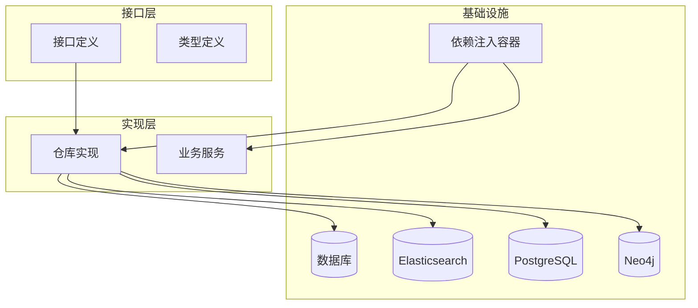

**图表来源**
- [internal/container/container.go](file://internal/container/container.go#L57-L209)
- [internal/types/interfaces/chunk.go](file://internal/types/interfaces/chunk.go#L9-L81)

**章节来源**
- [internal/container/container.go](file://internal/container/container.go#L57-L209)

## 核心组件

### Repository接口体系

WiseDx实现了完整的Repository模式，定义了清晰的接口契约：

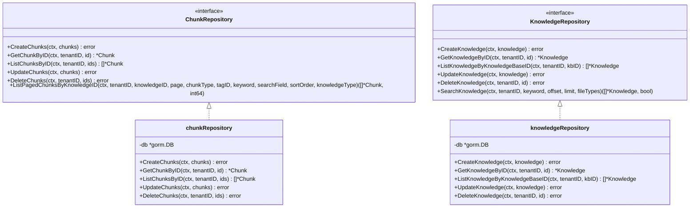

**图表来源**
- [internal/types/interfaces/chunk.go](file://internal/types/interfaces/chunk.go#L9-L81)
- [internal/types/interfaces/knowledge.go](file://internal/types/interfaces/knowledge.go#L147-L187)
- [internal/application/repository/chunk.go](file://internal/application/repository/chunk.go#L15-L23)
- [internal/application/repository/knowledge.go](file://internal/application/repository/knowledge.go#L18-L26)

### 依赖注入容器

系统使用Go-Undry/Dig容器实现依赖注入：

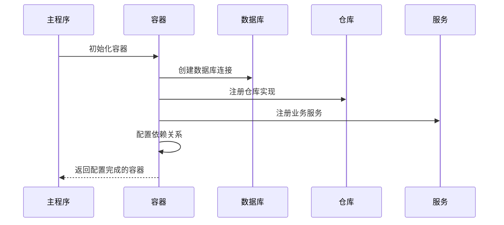

**图表来源**
- [internal/container/container.go](file://internal/container/container.go#L65-L209)

**章节来源**
- [internal/types/interfaces/chunk.go](file://internal/types/interfaces/chunk.go#L9-L81)
- [internal/types/interfaces/knowledge.go](file://internal/types/interfaces/knowledge.go#L147-L187)
- [internal/application/repository/chunk.go](file://internal/application/repository/chunk.go#L15-L23)
- [internal/application/repository/knowledge.go](file://internal/application/repository/knowledge.go#L18-L26)

## 架构概览

WiseDx的数据访问架构采用了多层解耦设计：

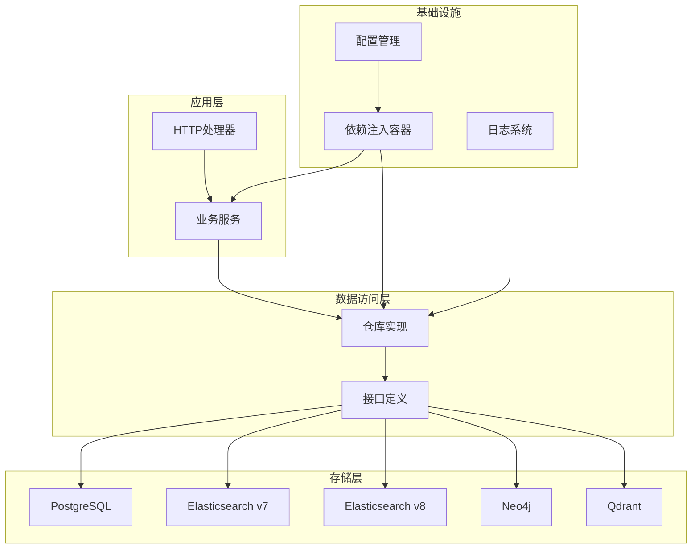

**图表来源**
- [internal/container/container.go](file://internal/container/container.go#L415-L532)
- [internal/types/interfaces/retriever.go](file://internal/types/interfaces/retriever.go#L10-L65)

## 详细组件分析

### 分块数据访问层

分块（Chunk）是WiseDx的核心数据实体，负责管理知识库中的文本片段：

#### 核心功能特性

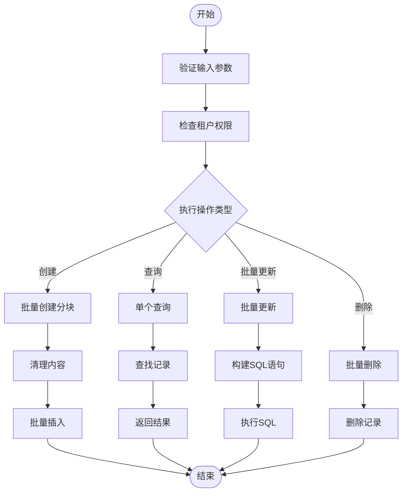

**图表来源**
- [internal/application/repository/chunk.go](file://internal/application/repository/chunk.go#L25-L33)
- [internal/application/repository/chunk.go](file://internal/application/repository/chunk.go#L250-L330)

#### 批量操作优化

系统实现了多种批量操作以提高性能：

| 操作类型 | 实现方式 | 性能优势 |
|---------|----------|----------|
| 批量创建 | GORM CreateInBatches | 减少数据库往返次数 |
| 批量更新 | 原生SQL CASE表达式 | 单次SQL执行多个更新 |
| 批量删除 | IN子句批量删除 | 一次操作删除多个记录 |
| 分页查询 | OFFSET/LIMIT分页 | 控制内存使用 |

**章节来源**
- [internal/application/repository/chunk.go](file://internal/application/repository/chunk.go#L25-L33)
- [internal/application/repository/chunk.go](file://internal/application/repository/chunk.go#L250-L330)
- [internal/application/repository/chunk.go](file://internal/application/repository/chunk.go#L337-L357)

### 知识库数据访问层

知识库（Knowledge）模块管理文档和FAQ等知识资源：

#### 搜索功能实现

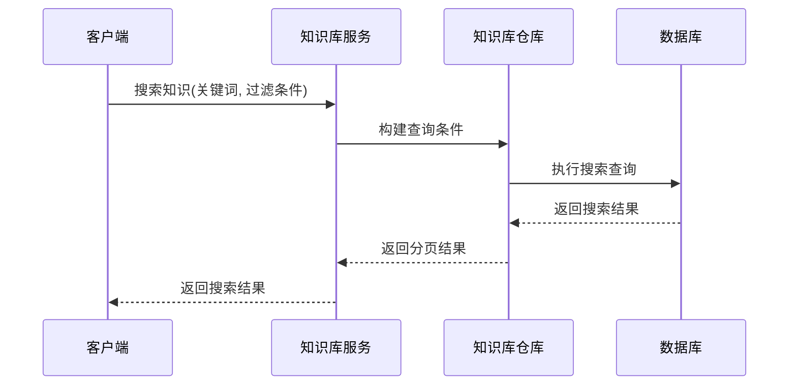

**图表来源**
- [internal/application/repository/knowledge.go](file://internal/application/repository/knowledge.go#L300-L403)

**章节来源**
- [internal/application/repository/knowledge.go](file://internal/application/repository/knowledge.go#L300-L403)

### 检索引擎集成

WiseDx支持多种检索引擎，每种都有专门的仓库实现：

#### PostgreSQL向量检索

PostgreSQL仓库利用pgvector扩展实现高效的向量相似度搜索：

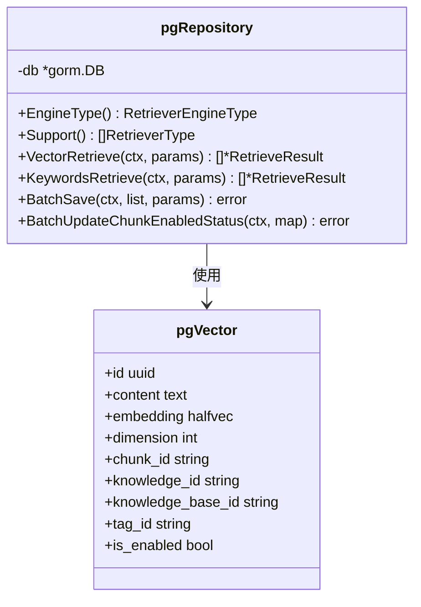

**图表来源**
- [internal/application/repository/retriever/postgres/repository.go](file://internal/application/repository/retriever/postgres/repository.go#L19-L28)
- [internal/application/repository/retriever/postgres/repository.go](file://internal/application/repository/retriever/postgres/repository.go#L251-L403)

#### Elasticsearch检索

Elasticsearch仓库支持关键词和向量两种检索模式：

**章节来源**
- [internal/application/repository/retriever/postgres/repository.go](file://internal/application/repository/retriever/postgres/repository.go#L19-L28)
- [internal/application/repository/retriever/elasticsearch/v7/repository.go](file://internal/application/repository/retriever/elasticsearch/v7/repository.go#L103-L148)
- [internal/application/repository/retriever/elasticsearch/v8/repository.go](file://internal/application/repository/retriever/elasticsearch/v8/repository.go#L102-L128)

### 图数据库集成

Neo4j仓库提供知识图谱查询能力：

**章节来源**
- [internal/application/repository/retriever/neo4j/repository.go](file://internal/application/repository/retriever/neo4j/repository.go#L14-L23)

## 依赖分析

### 组件耦合关系

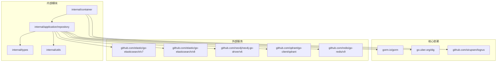

**图表来源**
- [internal/container/container.go](file://internal/container/container.go#L6-L55)

### 依赖注入配置

系统通过集中式容器管理所有依赖关系：

**章节来源**
- [internal/container/container.go](file://internal/container/container.go#L100-L115)

## 性能考虑

### 缓存策略

WiseDx实现了多层次的缓存策略：

1. **连接池管理**: PostgreSQL连接池配置最大空闲连接数和连接生命周期
2. **Redis缓存**: 使用Redis作为分布式缓存层
3. **批量操作**: 通过批量插入和更新减少数据库压力

### 读写分离

系统支持通过环境变量配置不同的数据库驱动：
- PostgreSQL作为主要数据存储
- 可选的Elasticsearch用于全文检索
- Neo4j用于图查询场景

### 批量操作优化

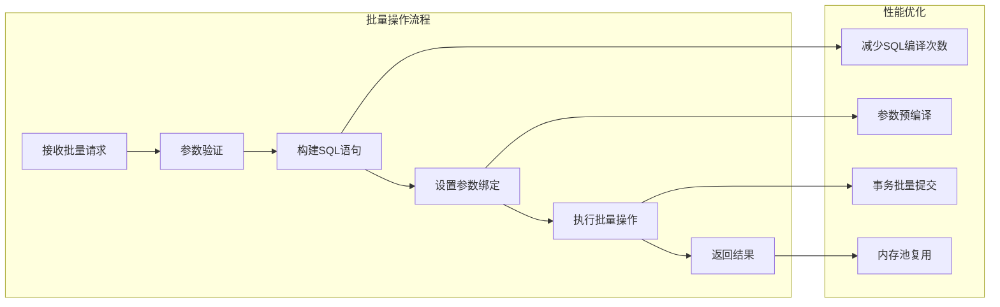

**图表来源**
- [internal/application/repository/chunk.go](file://internal/application/repository/chunk.go#L250-L330)

## 故障排除指南

### 错误处理机制

系统实现了统一的应用错误处理：

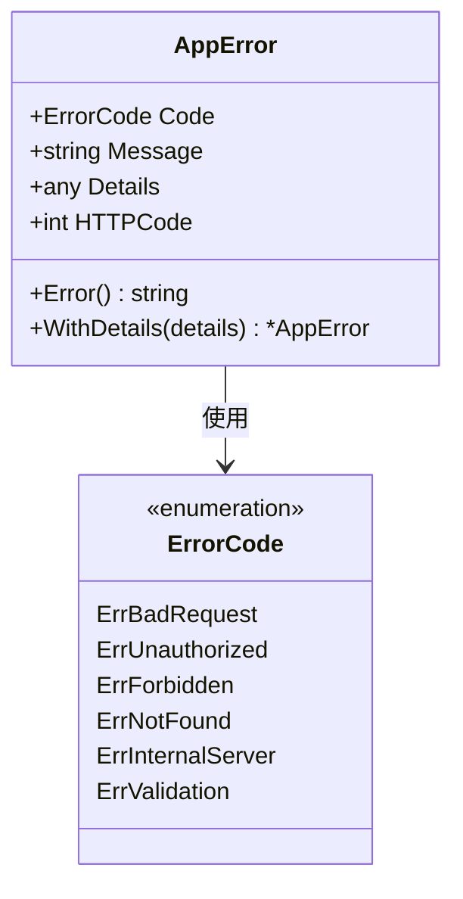

**图表来源**
- [internal/errors/errors.go](file://internal/errors/errors.go#L42-L48)

### 安全性考虑

系统实现了全面的安全防护措施：

#### SQL注入防护

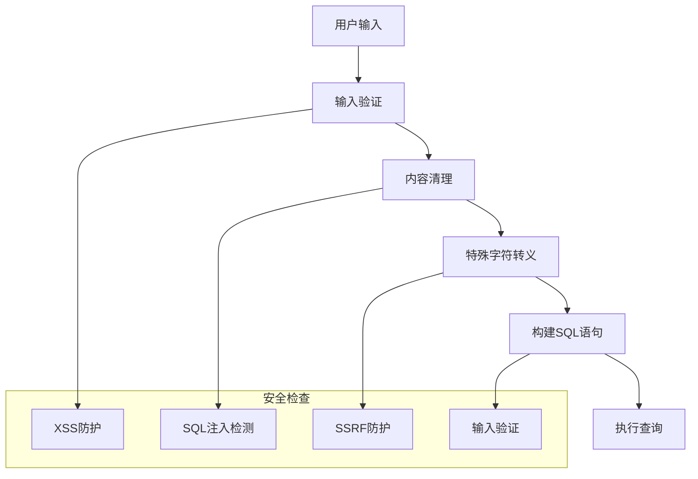

**图表来源**
- [internal/utils/security.go](file://internal/utils/security.go#L39-L60)

#### 权限控制

系统通过租户ID实现多租户隔离：
- 所有查询都强制包含租户过滤条件
- 支持基于角色的访问控制
- 提供审计日志记录

**章节来源**
- [internal/errors/errors.go](file://internal/errors/errors.go#L12-L40)
- [internal/utils/security.go](file://internal/utils/security.go#L39-L60)

## 结论

WiseDx的数据访问模式展现了现代Go应用程序的最佳实践：

1. **清晰的抽象层次**: 通过接口定义实现了良好的抽象隔离
2. **灵活的依赖注入**: 使用Dig容器实现松耦合的组件管理
3. **高性能的批量操作**: 通过原生SQL和批量处理优化性能
4. **全面的安全防护**: 实现了多层次的安全保护机制
5. **可扩展的架构**: 支持多种存储后端和检索引擎

该实现为大规模知识管理应用提供了坚实的数据访问基础，既保证了系统的可维护性，又确保了良好的性能表现。