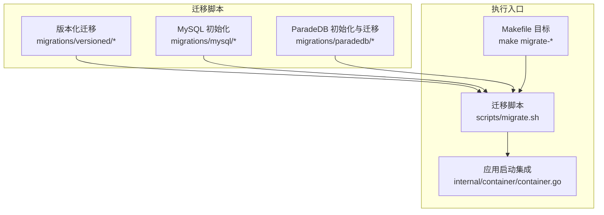
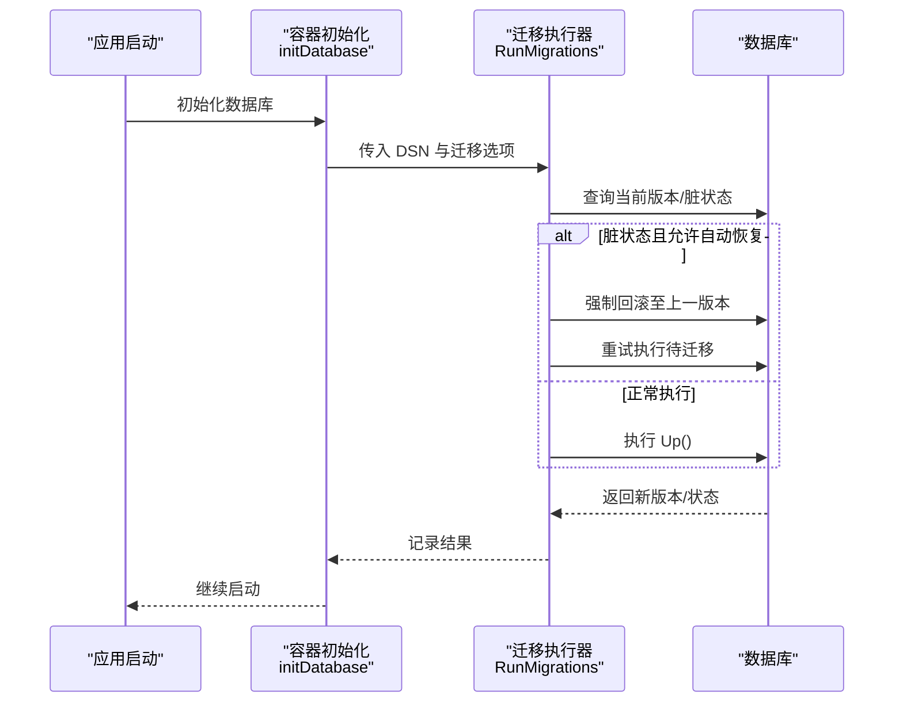
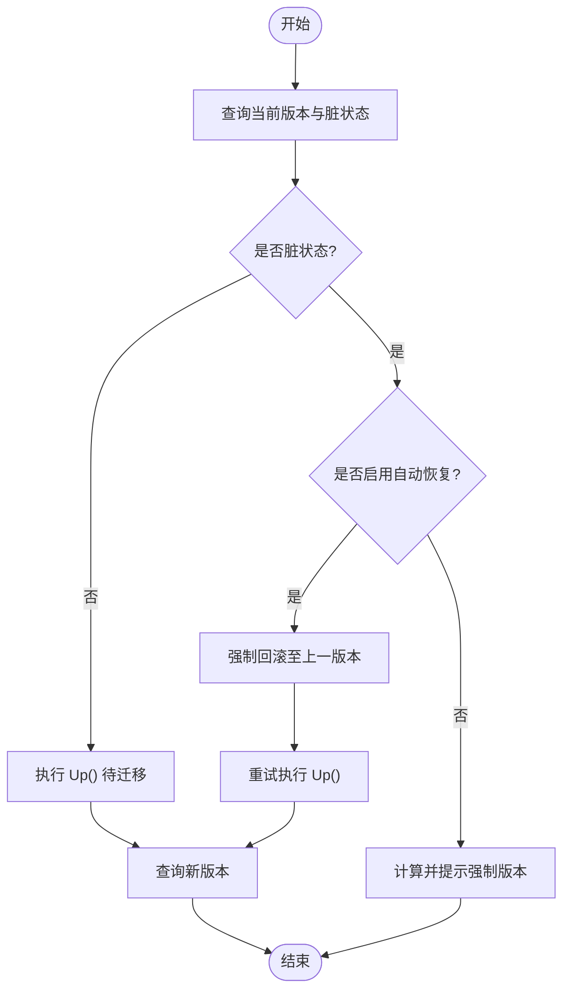
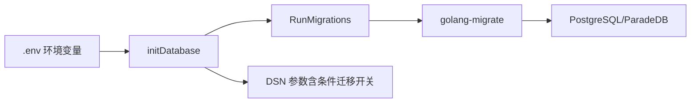

# 迁移管理

<cite>
**本文引用的文件**
- [internal/database/migration.go](file://internal/database/migration.go)
- [internal/container/container.go](file://internal/container/container.go)
- [scripts/migrate.sh](file://scripts/migrate.sh)
- [Makefile](file://Makefile)
- [migrations/versioned/000000_init.up.sql](file://migrations/versioned/000000_init.up.sql)
- [migrations/versioned/000002_embeddings.up.sql](file://migrations/versioned/000002_embeddings.up.sql)
- [migrations/versioned/000007_embeddings_tag_id.up.sql](file://migrations/versioned/000007_embeddings_tag_id.up.sql)
- [migrations/versioned/000007_embeddings_tag_id.down.sql](file://migrations/versioned/000007_embeddings_tag_id.down.sql)
- [migrations/mysql/00-init-db.sql](file://migrations/mysql/00-init-db.sql)
- [migrations/paradedb/00-init-db.sql](file://migrations/paradedb/00-init-db.sql)
- [migrations/paradedb/01-migrate-to-paradedb.sql](file://migrations/paradedb/01-migrate-to-paradedb.sql)
- [.env.example](file://.env.example)
</cite>

## 目录
1. [简介](#简介)
2. [项目结构](#项目结构)
3. [核心组件](#核心组件)
4. [架构总览](#架构总览)
5. [详细组件分析](#详细组件分析)
6. [依赖关系分析](#依赖关系分析)
7. [性能考量](#性能考量)
8. [故障排查指南](#故障排查指南)
9. [结论](#结论)
10. [附录](#附录)

## 简介
本文件系统性阐述 WiseDx 的数据库迁移管理体系，覆盖版本化迁移机制、迁移脚本编写规范、执行顺序与回滚策略、MySQL 初始化迁移与 ParadeDB 迁移的特殊处理、数据完整性与错误处理、迁移测试与验证方法、生产环境最佳实践与风险控制，以及常见问题与解决方案。

## 项目结构
WiseDx 的迁移体系由三部分组成：
- 版本化迁移：位于 migrations/versioned，采用 golang-migrate 的 up/down 脚本，按序号递增，严格保证幂等与可回滚。
- MySQL 初始化迁移：位于 migrations/mysql，提供一次性初始化脚本，适合首次部署或独立 MySQL 场景。
- ParadeDB 迁移：位于 migrations/paradedb，包含扩展安装、表结构与索引定义，以及从 PostgreSQL 迁移到 ParadeDB 的指导脚本。

图表来源
- [scripts/migrate.sh](file://scripts/migrate.sh#L63-L120)
- [Makefile](file://Makefile#L164-L196)
- [internal/container/container.go](file://internal/container/container.go#L262-L349)

章节来源
- [Makefile](file://Makefile#L164-L196)
- [scripts/migrate.sh](file://scripts/migrate.sh#L1-L122)
- [internal/container/container.go](file://internal/container/container.go#L262-L349)

## 核心组件
- 版本化迁移执行器：封装 golang-migrate，负责版本查询、dirty 状态检测、自动恢复与重试、最终版本确认。
- 迁移选项：支持自动恢复 dirty 状态（AutoRecoverDirty），避免因部分失败导致的阻塞。
- 应用启动集成：在数据库连接建立时自动执行迁移，支持通过环境变量控制是否启用自动迁移与自动恢复。
- 迁移脚本：按 up/down 成对提供，版本号递增；条件迁移（如向量索引）根据环境参数动态启用。

章节来源
- [internal/database/migration.go](file://internal/database/migration.go#L14-L25)
- [internal/database/migration.go](file://internal/database/migration.go#L27-L152)
- [internal/container/container.go](file://internal/container/container.go#L326-L349)

## 架构总览
迁移流程从应用启动或手动脚本触发，统一通过 golang-migrate 执行版本化迁移，支持条件迁移与回滚。

图表来源
- [internal/container/container.go](file://internal/container/container.go#L326-L349)
- [internal/database/migration.go](file://internal/database/migration.go#L27-L152)

## 详细组件分析

### 版本化迁移执行器
- 功能要点
  - 自动查询当前版本与脏状态，记录日志。
  - 支持 AutoRecoverDirty：当检测到脏状态时，强制回滚至上一版本并重试。
  - 对初始迁移（版本0）的脏状态进行特殊处理：若无法回滚更早版本，则尝试清除脏标记并重试（要求迁移具备幂等性）。
  - 对迁移失败但未造成脏状态的情况直接返回错误；对迁移过程中变为脏状态的情况，同样尝试恢复并重试。
  - 最终输出版本变化与脏状态提示。

图表来源
- [internal/database/migration.go](file://internal/database/migration.go#L43-L152)

章节来源
- [internal/database/migration.go](file://internal/database/migration.go#L14-L25)
- [internal/database/migration.go](file://internal/database/migration.go#L27-L152)

### 条件迁移：向量索引与全文检索
- 触发条件
  - 通过 DSN 中的自定义参数控制是否跳过向量相关迁移。
  - 当检索驱动包含 PostgreSQL 时，启用向量迁移；否则跳过。
- 实现机制
  - 在迁移脚本中读取该参数，若为“跳过”，则记录通知并 RETURN，不执行后续创建与索引逻辑。
  - 若启用，则创建扩展、表与索引，并对现有索引进行幂等处理与重建。
- 关键点
  - 扩展安装与索引创建均带有幂等判断，避免重复执行报错。
  - HNSW 索引按维度条件创建，BM25 索引针对中文分词器配置。

章节来源
- [internal/container/container.go](file://internal/container/container.go#L293-L309)
- [migrations/versioned/000002_embeddings.up.sql](file://migrations/versioned/000002_embeddings.up.sql#L4-L10)
- [migrations/versioned/000002_embeddings.up.sql](file://migrations/versioned/000002_embeddings.up.sql#L15-L18)
- [migrations/versioned/000002_embeddings.up.sql](file://migrations/versioned/000002_embeddings.up.sql#L40-L55)
- [migrations/versioned/000002_embeddings.up.sql](file://migrations/versioned/000002_embeddings.up.sql#L57-L76)
- [migrations/versioned/000002_embeddings.up.sql](file://migrations/versioned/000002_embeddings.up.sql#L87-L91)

### MySQL 初始化迁移
- 设计目标
  - 提供一次性初始化脚本，删除旧表、创建新表、建立索引，适用于首次部署或独立 MySQL 场景。
- 关键特性
  - 使用 InnoDB 引擎与 utf8mb4 字符集。
  - 为多张表建立复合索引，提升查询效率。
  - 为 JSON 字段添加注释，便于维护与审计。
- 注意事项
  - 该脚本为一次性初始化，不参与版本化迁移流程。
  - 如需与版本化迁移配合，应将其内容拆分为版本化 up 脚本并遵循序号递增规则。

章节来源
- [migrations/mysql/00-init-db.sql](file://migrations/mysql/00-init-db.sql#L1-L157)

### ParadeDB 迁移与初始化
- 初始化脚本
  - 安装必要扩展（UUID、向量、pg_trgm、pg_search）。
  - 创建与 PostgreSQL 相同的业务表结构与索引。
  - 为嵌入向量字段创建 HNSW 索引，为文本字段创建 BM25 全文检索索引。
- 迁移脚本
  - 提供从 PostgreSQL 迁移到 ParadeDB 的步骤说明与示例（导出/导入、验证、样例数据插入）。
  - 包含中文分词器配置与测试用表创建示例，便于验证检索效果。

章节来源
- [migrations/paradedb/00-init-db.sql](file://migrations/paradedb/00-init-db.sql#L1-L215)
- [migrations/paradedb/01-migrate-to-paradedb.sql](file://migrations/paradedb/01-migrate-to-paradedb.sql#L1-L70)

### 迁移脚本编写规范与执行顺序
- 命名规范
  - up/down 成对命名，版本号固定宽度（如 000000、000001），确保排序正确。
- 幂等性
  - 所有 DDL 使用 IF NOT EXISTS 或幂等判断，避免重复执行失败。
- 事务与回滚
  - 单个 up 脚本内尽量保持原子性；复杂变更建议拆分为多个小版本，便于回滚。
- 顺序约束
  - 依赖关系通过版本号体现；前置依赖的 up 先于后置依赖的 up 执行。
- 条件迁移
  - 使用参数或环境变量控制是否执行，避免在不适用的环境中产生无效操作。

章节来源
- [migrations/versioned/000000_init.up.sql](file://migrations/versioned/000000_init.up.sql#L1-L204)
- [migrations/versioned/000002_embeddings.up.sql](file://migrations/versioned/000002_embeddings.up.sql#L4-L10)
- [migrations/versioned/000007_embeddings_tag_id.up.sql](file://migrations/versioned/000007_embeddings_tag_id.up.sql#L4-L10)

### 回滚策略与数据安全
- 回滚策略
  - 使用 golang-migrate 的 down 脚本进行逆向执行。
  - 对于条件迁移，down 脚本需具备幂等判断，确保多次执行的安全性。
- 数据安全
  - 在执行迁移前建议备份数据库。
  - 对关键业务表的删除与修改操作，应在 down 脚本中提供完整恢复逻辑。
- 自动恢复
  - 启用 AutoRecoverDirty 时，遇到脏状态会自动回滚至上一版本并重试，降低人工干预成本。

章节来源
- [internal/database/migration.go](file://internal/database/migration.go#L56-L87)
- [internal/database/migration.go](file://internal/database/migration.go#L154-L193)
- [migrations/versioned/000007_embeddings_tag_id.down.sql](file://migrations/versioned/000007_embeddings_tag_id.down.sql#L1-L12)

### 数据完整性检查与错误处理
- 版本一致性
  - 迁移前后记录版本号与脏状态，便于追踪与审计。
- 错误分类
  - 迁移失败但未造成脏状态：直接返回错误并终止。
  - 迁移过程中变为脏状态：尝试自动恢复并重试，仍失败则提示强制版本。
- 日志与可观测性
  - 执行器记录详细日志，包含版本变化、脏状态告警与恢复动作。

章节来源
- [internal/database/migration.go](file://internal/database/migration.go#L89-L133)
- [internal/database/migration.go](file://internal/database/migration.go#L141-L149)

### 迁移测试与验证
- 手动验证
  - 使用 scripts/migrate.sh 的 version、up、down、goto、force 等子命令验证迁移状态与版本跳转。
  - 通过 Makefile 的 migrate-* 目标快速执行常用操作。
- 条件迁移验证
  - 切换 RETRIEVE_DRIVER 与 DB_DRIVER，验证向量迁移的启用/跳过行为。
- 数据验证
  - 在 ParadeDB 迁移脚本中提供样例数据与索引验证示例，确保检索功能正常。

章节来源
- [scripts/migrate.sh](file://scripts/migrate.sh#L63-L120)
- [Makefile](file://Makefile#L164-L196)
- [migrations/paradedb/01-migrate-to-paradedb.sql](file://migrations/paradedb/01-migrate-to-paradedb.sql#L31-L70)

### 生产环境最佳实践与风险控制
- 自动迁移与恢复
  - 生产环境建议启用 AUTO_MIGRATE 与 AUTO_RECOVER_DIRTY，减少停机时间。
- 环境隔离
  - 不同环境（开发/测试/生产）使用独立数据库实例与迁移脚本，避免交叉污染。
- 条件迁移策略
  - 通过 RETRIEVE_DRIVER 控制向量迁移，确保在不支持向量检索的环境中跳过相关索引创建。
- 回滚预案
  - 为关键迁移准备 down 脚本与备份策略，确保可快速回滚。
- 监控与告警
  - 结合日志与版本状态监控，及时发现迁移异常。

章节来源
- [.env.example](file://.env.example#L64-L66)
- [internal/container/container.go](file://internal/container/container.go#L293-L309)
- [internal/database/migration.go](file://internal/database/migration.go#L56-L87)

## 依赖关系分析
- 应用启动依赖容器初始化，容器初始化在建立数据库连接时触发迁移。
- 迁移执行器依赖 golang-migrate 的数据库与文件源适配器。
- 条件迁移依赖 DSN 中的自定义参数，由容器初始化注入。

图表来源
- [internal/container/container.go](file://internal/container/container.go#L271-L317)
- [internal/database/migration.go](file://internal/database/migration.go#L36-L41)

章节来源
- [internal/container/container.go](file://internal/container/container.go#L271-L317)
- [internal/database/migration.go](file://internal/database/migration.go#L36-L41)

## 性能考量
- 索引创建成本
  - 向量与全文索引创建可能耗时较长，建议在低峰时段执行或分批进行。
- 幂等与重试
  - 幂等判断减少重复执行开销；自动恢复重试避免长时间阻塞。
- 连接池与超时
  - 应用层配置连接池参数，避免迁移期间资源争用。

## 故障排查指南
- 脏状态
  - 现象：迁移执行一半失败，数据库处于脏状态。
  - 处理：启用 AutoRecoverDirty 自动恢复；或使用 scripts/migrate.sh force 强制版本。
- 版本不一致
  - 现象：迁移版本与预期不符。
  - 处理：使用 scripts/migrate.sh goto 跳转到指定版本；或使用 version 查看当前版本。
- 条件迁移未生效
  - 现象：期望启用的向量迁移未执行。
  - 处理：检查 RETRIEVE_DRIVER 与 DSN 中的条件参数；确认迁移脚本中的条件判断逻辑。

章节来源
- [internal/database/migration.go](file://internal/database/migration.go#L56-L87)
- [internal/database/migration.go](file://internal/database/migration.go#L154-L193)
- [scripts/migrate.sh](file://scripts/migrate.sh#L95-L115)
- [internal/container/container.go](file://internal/container/container.go#L293-L309)

## 结论
WiseDx 的迁移体系以版本化迁移为核心，结合条件迁移与自动恢复机制，兼顾了灵活性与安全性。通过明确的编写规范、严格的幂等性与回滚策略、完善的测试与验证流程，以及生产环境的最佳实践，能够有效保障数据库演进的稳定性与可追溯性。

## 附录

### 迁移脚本示例路径
- 初始化迁移（PostgreSQL）：migrations/versioned/000000_init.up.sql
- 向量迁移（条件）：migrations/versioned/000002_embeddings.up.sql
- 嵌入表增强（up/down）：migrations/versioned/000007_embeddings_tag_id.{up,down}.sql
- MySQL 初始化：migrations/mysql/00-init-db.sql
- ParadeDB 初始化：migrations/paradedb/00-init-db.sql
- 从 PostgreSQL 迁移到 ParadeDB：migrations/paradedb/01-migrate-to-paradedb.sql

### 常见问题与解决方案
- 迁移卡住或失败
  - 检查脏状态并启用自动恢复；必要时使用 force 强制版本。
- 向量索引未创建
  - 检查 RETRIEVE_DRIVER 与 DSN 条件参数；确认迁移脚本条件判断。
- 索引创建耗时长
  - 选择低峰时段执行；分批创建索引并观察进度。