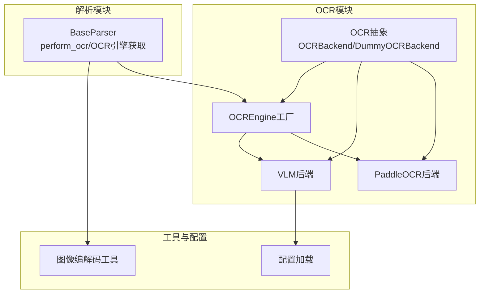
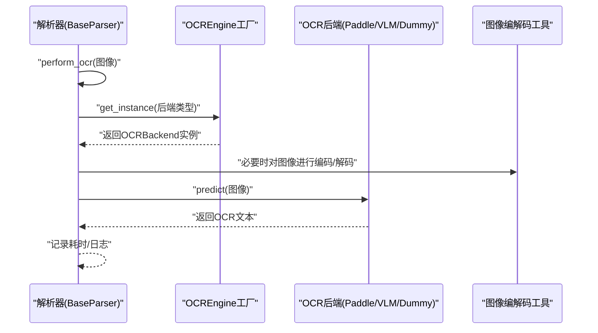
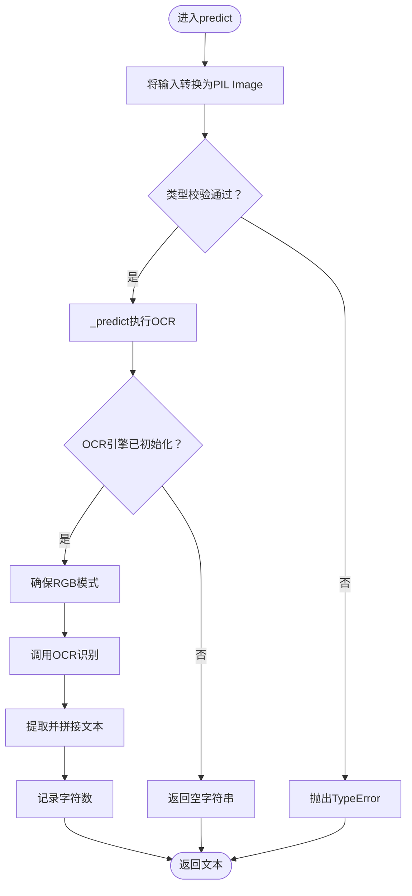
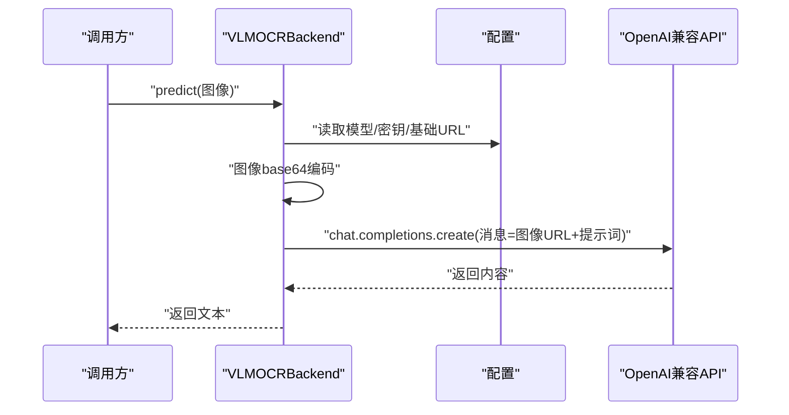
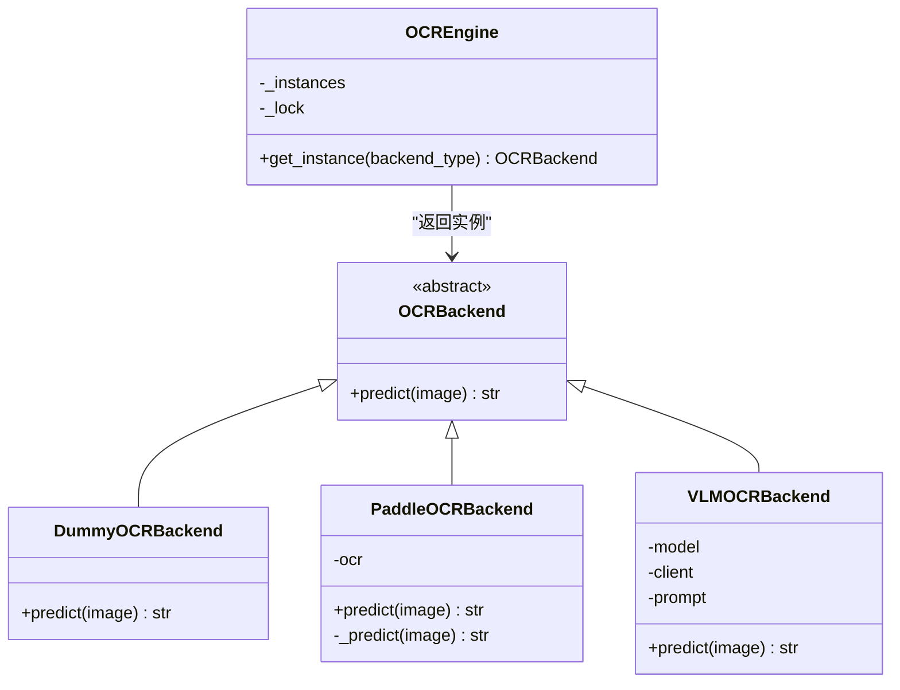
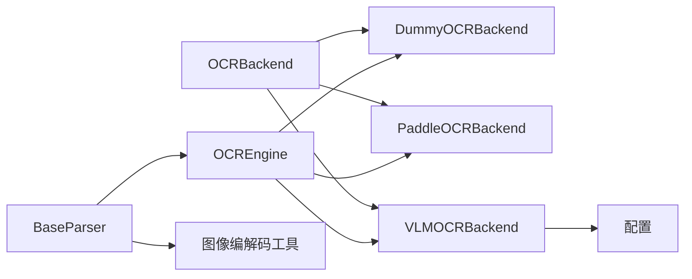

# OCR后端接口设计

<cite>
**本文档引用的文件**
- [docreader/ocr/base.py](file://docreader/ocr/base.py)
- [docreader/ocr/paddle.py](file://docreader/ocr/paddle.py)
- [docreader/ocr/vlm.py](file://docreader/ocr/vlm.py)
- [docreader/ocr/__init__.py](file://docreader/ocr/__init__.py)
- [docreader/parser/base_parser.py](file://docreader/parser/base_parser.py)
- [docreader/utils/endecode.py](file://docreader/utils/endecode.py)
- [docreader/config.py](file://docreader/config.py)
- [docreader/README.md](file://docreader/README.md)
</cite>

## 目录
1. [简介](#简介)
2. [项目结构](#项目结构)
3. [核心组件](#核心组件)
4. [架构总览](#架构总览)
5. [详细组件分析](#详细组件分析)
6. [依赖关系分析](#依赖关系分析)
7. [性能考虑](#性能考虑)
8. [故障排查指南](#故障排查指南)
9. [结论](#结论)
10. [附录](#附录)

## 简介
本文件系统化阐述WiseDx项目中DocReader服务的OCR后端接口设计，重点覆盖：
- OCRBackend抽象基类的设计理念与接口规范
- DummyOCRBackend的实现目的与使用场景
- 通过接口抽象实现多后端统一调用的工厂模式
- 新OCR后端的集成步骤与最佳实践
- OCR接口在文档解析流水线中的作用与协作关系
- 错误处理策略与性能优化建议
- 接口设计的演进历史与未来扩展方向

## 项目结构
围绕OCR能力的相关模块主要位于docreader子目录，采用“按功能域分层”的组织方式：
- ocr：OCR抽象与具体实现（PaddleOCR、VLM、Dummy）
- parser：文档解析器，负责在解析流程中触发OCR
- utils：通用工具（如图像编解码）
- config：配置加载与环境变量解析
- README：部署与配置说明

图表来源
- [docreader/ocr/base.py](file://docreader/ocr/base.py#L10-L31)
- [docreader/ocr/paddle.py](file://docreader/ocr/paddle.py#L16-L176)
- [docreader/ocr/vlm.py](file://docreader/ocr/vlm.py#L14-L88)
- [docreader/ocr/__init__.py](file://docreader/ocr/__init__.py#L12-L37)
- [docreader/parser/base_parser.py](file://docreader/parser/base_parser.py#L96-L222)
- [docreader/utils/endecode.py](file://docreader/utils/endecode.py#L23-L76)
- [docreader/config.py](file://docreader/config.py#L48-L220)

章节来源
- [docreader/ocr/base.py](file://docreader/ocr/base.py#L1-L32)
- [docreader/ocr/paddle.py](file://docreader/ocr/paddle.py#L1-L176)
- [docreader/ocr/vlm.py](file://docreader/ocr/vlm.py#L1-L88)
- [docreader/ocr/__init__.py](file://docreader/ocr/__init__.py#L1-L38)
- [docreader/parser/base_parser.py](file://docreader/parser/base_parser.py#L96-L244)
- [docreader/utils/endecode.py](file://docreader/utils/endecode.py#L1-L205)
- [docreader/config.py](file://docreader/config.py#L1-L285)
- [docreader/README.md](file://docreader/README.md#L80-L104)

## 核心组件
- OCRBackend抽象基类：定义predict接口，约束输入输出类型，确保所有后端实现具备统一契约。
- DummyOCRBackend：占位实现，用于在未配置或不可用时提供安全降级。
- PaddleOCRBackend：本地CPU推理后端，支持指令集兼容性检测与错误处理。
- VLMOCRBackend：基于OpenAI兼容接口的视觉语言模型后端，支持远程API调用。
- OCREngine工厂：根据后端类型返回单例实例，避免重复初始化。

章节来源
- [docreader/ocr/base.py](file://docreader/ocr/base.py#L10-L31)
- [docreader/ocr/paddle.py](file://docreader/ocr/paddle.py#L16-L176)
- [docreader/ocr/vlm.py](file://docreader/ocr/vlm.py#L14-L88)
- [docreader/ocr/__init__.py](file://docreader/ocr/__init__.py#L12-L37)

## 架构总览
OCR接口在文档解析流水线中的位置如下：

图表来源
- [docreader/parser/base_parser.py](file://docreader/parser/base_parser.py#L197-L222)
- [docreader/ocr/__init__.py](file://docreader/ocr/__init__.py#L18-L37)
- [docreader/utils/endecode.py](file://docreader/utils/endecode.py#L23-L76)

## 详细组件分析

### OCRBackend抽象基类与接口规范
- 设计理念
  - 通过抽象基类约束所有OCR后端的predict方法签名，确保上层调用无需关心具体实现细节。
  - 统一输入类型Union[str, bytes, Image.Image]与返回类型str，简化调用方逻辑。
- 接口规范
  - 方法：predict(image: Union[str, bytes, Image.Image]) -> str
  - 输入支持：文件路径字符串、字节流、PIL图像对象
  - 返回：提取的文本字符串；异常或不可用时返回空字符串
- 适用场景
  - 在解析器中统一触发OCR，屏蔽底层差异
  - 便于替换与扩展新的OCR后端

章节来源
- [docreader/ocr/base.py](file://docreader/ocr/base.py#L10-L23)

### DummyOCRBackend实现与使用场景
- 实现要点
  - predict方法直接返回空字符串，并记录警告日志
- 使用场景
  - 作为默认后端（当后端类型为空或未知时）
  - 在开发/测试阶段快速运行，避免OCR初始化失败影响整体流程
  - 当明确禁用OCR时的安全兜底

章节来源
- [docreader/ocr/base.py](file://docreader/ocr/base.py#L26-L31)
- [docreader/ocr/__init__.py](file://docreader/ocr/__init__.py#L19-L37)

### PaddleOCRBackend实现
- 初始化策略
  - 强制使用CPU（禁用GPU），设置设备为cpu
  - 检测CPU是否支持AVX指令集，若不支持则切换兼容模式
  - 配置PaddleOCR参数（检测/识别模型、阈值、语言等），并创建OCR实例
  - 捕获导入失败、OS错误（非法指令等）与一般异常，记录日志并优雅降级
- predict流程
  - 将输入转换为PIL Image对象（支持字符串路径、字节流）
  - 校验类型，调用内部_predict
- 内部_predict逻辑
  - 确保图像为RGB模式
  - 转换为numpy数组，调用OCR执行识别
  - 提取结果并拼接文本，记录字符数量
  - 捕获异常并返回空字符串

图表来源
- [docreader/ocr/paddle.py](file://docreader/ocr/paddle.py#L118-L176)

章节来源
- [docreader/ocr/paddle.py](file://docreader/ocr/paddle.py#L16-L176)

### VLMOCRBackend实现
- 初始化策略
  - 从配置加载OCR模型、API密钥、基础URL等
  - 创建OpenAI兼容客户端，设置超时
  - 准备提示词（中文文档解析指令）
- predict流程
  - 校验客户端是否初始化
  - 使用图像编解码工具将输入编码为base64
  - 以OpenAI兼容的消息格式调用API，传入图像URL与提示词
  - 返回模型返回的内容文本，异常时记录错误并返回空字符串

图表来源
- [docreader/ocr/vlm.py](file://docreader/ocr/vlm.py#L17-L87)
- [docreader/config.py](file://docreader/config.py#L128-L133)
- [docreader/utils/endecode.py](file://docreader/utils/endecode.py#L23-L76)

章节来源
- [docreader/ocr/vlm.py](file://docreader/ocr/vlm.py#L14-L88)
- [docreader/config.py](file://docreader/config.py#L48-L220)
- [docreader/utils/endecode.py](file://docreader/utils/endecode.py#L23-L76)

### OCREngine工厂与统一调用
- 工厂职责
  - 根据后端类型（paddle/vlm/dummy）返回对应OCRBackend实例
  - 使用线程锁保证线程安全
  - 单例缓存，避免重复初始化
- 类型映射
  - "paddle" -> PaddleOCRBackend
  - "vlm" -> VLMOCRBackend
  - 其他/空 -> DummyOCRBackend

图表来源
- [docreader/ocr/base.py](file://docreader/ocr/base.py#L10-L31)
- [docreader/ocr/paddle.py](file://docreader/ocr/paddle.py#L16-L176)
- [docreader/ocr/vlm.py](file://docreader/ocr/vlm.py#L14-L88)
- [docreader/ocr/__init__.py](file://docreader/ocr/__init__.py#L12-L37)

章节来源
- [docreader/ocr/__init__.py](file://docreader/ocr/__init__.py#L12-L37)

### OCR接口在文档解析流水线中的作用
- 触发时机
  - 解析器在处理包含图像的文档时，调用perform_ocr对图像进行OCR
- 关键步骤
  - 图像尺寸限制与缩放
  - 通过OCREngine获取OCR后端实例
  - 执行predict并记录耗时
- 与组件协作
  - 与存储模块配合上传/下载图片
  - 与VLM模块配合生成图像描述（caption）
  - 与图像编解码工具配合base64传输

章节来源
- [docreader/parser/base_parser.py](file://docreader/parser/base_parser.py#L197-L244)

## 依赖关系分析
- 抽象与实现
  - OCRBackend为抽象基类，Dummy/Paddle/VLM均继承该基类
- 工厂与后端
  - OCREngine根据类型选择具体后端并缓存实例
- 解析器与OCR
  - BaseParser通过OCREngine统一调度OCR后端
- 工具与配置
  - VLMOCRBackend依赖配置加载与图像编解码工具

图表来源
- [docreader/ocr/base.py](file://docreader/ocr/base.py#L10-L31)
- [docreader/ocr/__init__.py](file://docreader/ocr/__init__.py#L12-L37)
- [docreader/parser/base_parser.py](file://docreader/parser/base_parser.py#L96-L222)
- [docreader/utils/endecode.py](file://docreader/utils/endecode.py#L23-L76)
- [docreader/config.py](file://docreader/config.py#L128-L133)

## 性能考虑
- 图像预处理
  - BaseParser在OCR前对图像进行尺寸限制，避免过大图像导致内存与时间开销激增
- 后端初始化
  - OCREngine使用单例缓存，避免重复初始化带来的资源浪费
- PaddleOCR兼容性
  - 自动检测CPU指令集并切换兼容模式，减少因硬件不匹配导致的崩溃与重试成本
- VLM调用
  - 使用OpenAI兼容接口，注意网络延迟与超时控制，合理设置温度与最大token数

章节来源
- [docreader/parser/base_parser.py](file://docreader/parser/base_parser.py#L224-L244)
- [docreader/ocr/__init__.py](file://docreader/ocr/__init__.py#L15-L16)
- [docreader/ocr/paddle.py](file://docreader/ocr/paddle.py#L34-L67)
- [docreader/ocr/vlm.py](file://docreader/ocr/vlm.py#L25-L32)

## 故障排查指南
- PaddleOCR初始化失败
  - 症状：导入失败、OS错误（非法指令）、崩溃
  - 处理：检查CPU指令集支持；安装CPU-only版本；切换后端或禁用OCR
- VLM调用失败
  - 症状：API密钥/基础URL错误、网络超时
  - 处理：核对配置项；检查代理设置；确认模型可用性
- OCR结果为空
  - 症状：图像质量差、后端未初始化
  - 处理：提高图像分辨率；检查后端初始化日志；必要时启用Dummy后端定位问题
- 解析器OCR调用异常
  - 症状：perform_ocr抛错或耗时过长
  - 处理：检查图像尺寸限制；确认存储上传成功；查看日志定位具体环节

章节来源
- [docreader/ocr/paddle.py](file://docreader/ocr/paddle.py#L95-L117)
- [docreader/ocr/vlm.py](file://docreader/ocr/vlm.py#L50-L58)
- [docreader/parser/base_parser.py](file://docreader/parser/base_parser.py#L206-L222)
- [docreader/README.md](file://docreader/README.md#L181-L201)

## 结论
通过OCRBackend抽象基类与OCREngine工厂，WiseDx实现了OCR能力的统一入口与灵活替换。Dummy后端提供了安全降级，Paddle与VLM后端分别满足本地推理与云端API两种典型场景。结合解析器的图像预处理与日志监控，整体方案在可维护性、可扩展性与稳定性方面表现良好。未来可继续扩展更多后端（如第三方API），并在配置与错误处理层面进一步完善。

## 附录

### OCR接口扩展方法与最佳实践
- 新后端集成步骤
  - 定义类继承OCRBackend并实现predict方法
  - 在OCREngine.get_instance中增加类型分支，返回新后端实例
  - 在配置中新增必要的环境变量（如API密钥、基础URL、模型名等）
  - 编写单元测试与集成测试，覆盖正常与异常路径
- 最佳实践
  - 明确输入输出契约，严格类型校验
  - 在初始化阶段做充分的环境探测与降级准备
  - 统一日志格式，区分warn/error级别
  - 控制超时与重试，避免阻塞主流程
  - 对于远程API后端，尽量复用连接池与会话

章节来源
- [docreader/ocr/base.py](file://docreader/ocr/base.py#L10-L23)
- [docreader/ocr/__init__.py](file://docreader/ocr/__init__.py#L18-L37)
- [docreader/config.py](file://docreader/config.py#L128-L133)

### 接口使用示例（路径指引）
- 在解析器中触发OCR
  - 路径：[docreader/parser/base_parser.py](file://docreader/parser/base_parser.py#L197-L222)
- 获取OCR引擎实例
  - 路径：[docreader/parser/base_parser.py](file://docreader/parser/base_parser.py#L96-L120)
- OCREngine工厂
  - 路径：[docreader/ocr/__init__.py](file://docreader/ocr/__init__.py#L18-L37)
- VLM后端调用示例
  - 路径：[docreader/ocr/vlm.py](file://docreader/ocr/vlm.py#L41-L87)
- Paddle后端调用示例
  - 路径：[docreader/ocr/paddle.py](file://docreader/ocr/paddle.py#L118-L176)

### OCR接口设计演进与未来方向
- 演进历史
  - 从单一后端逐步引入Dummy与VLM，增强可用性与灵活性
  - 增加配置驱动与环境变量支持，降低部署复杂度
- 未来扩展方向
  - 支持更多OCR后端（如Tesseract、第三方云服务）
  - 引入缓存与批处理机制，提升吞吐
  - 增强错误恢复与可观测性（指标、追踪）

章节来源
- [docreader/README.md](file://docreader/README.md#L80-L104)
- [docreader/ocr/__init__.py](file://docreader/ocr/__init__.py#L18-L37)