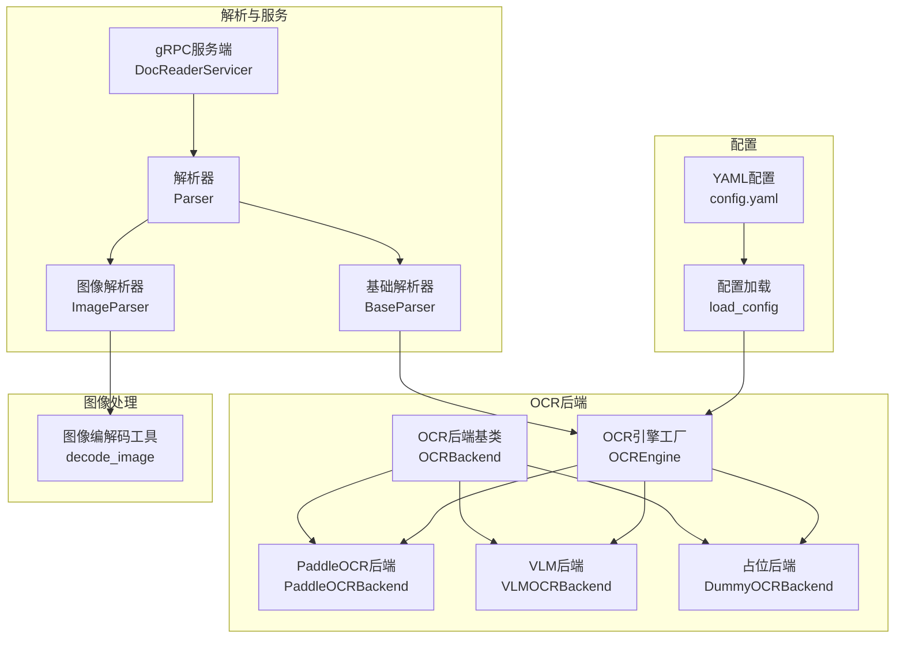
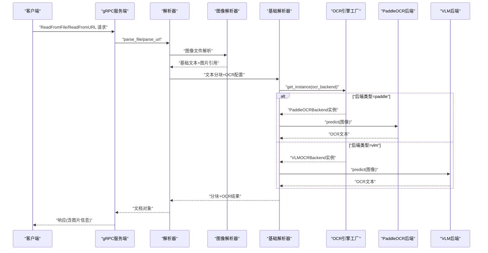
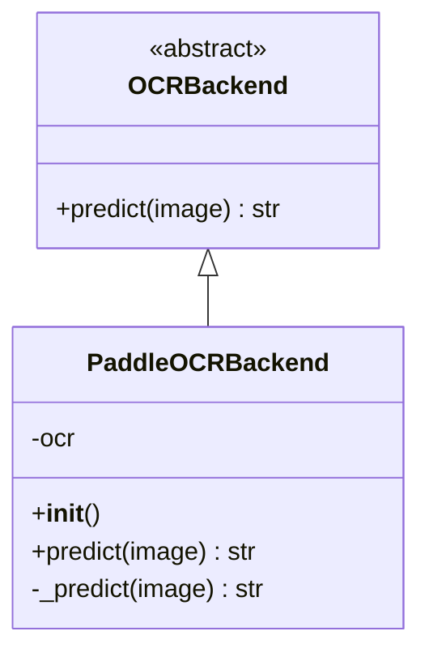
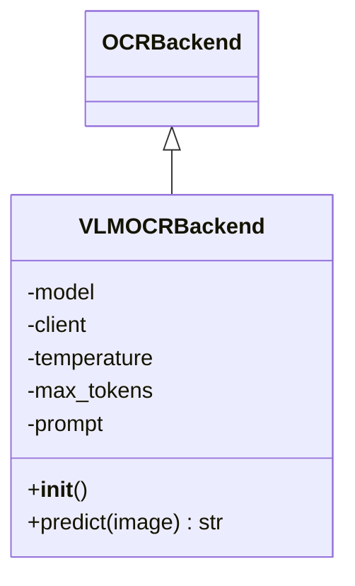
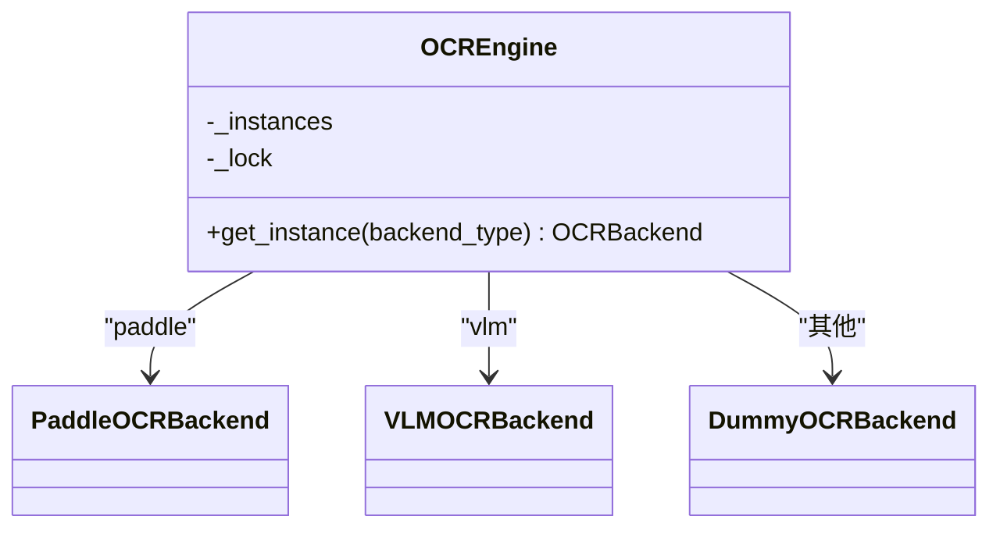
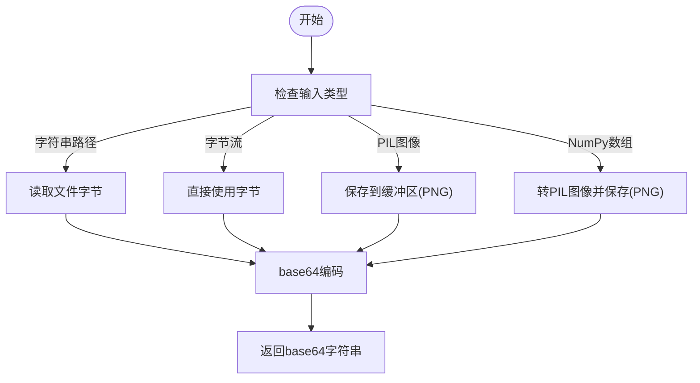
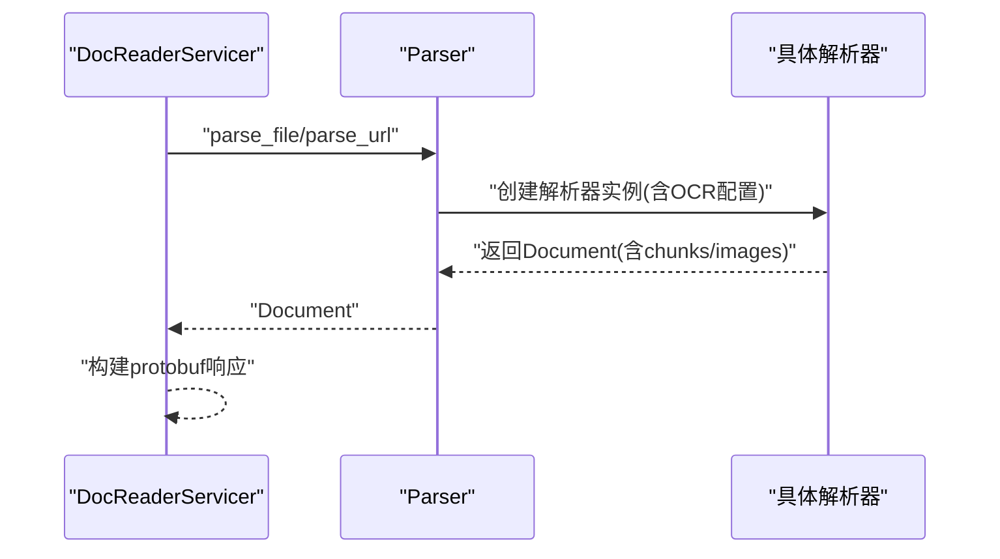
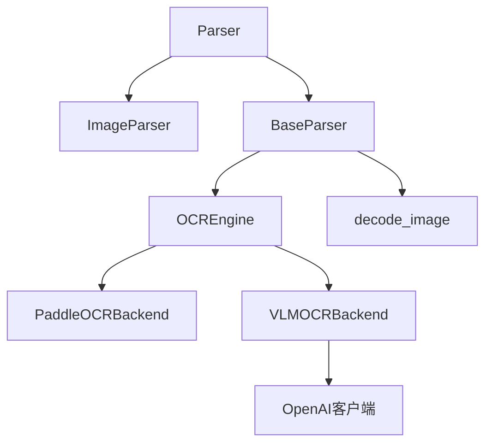

# OCR图像识别系统

<cite>
**本文档引用的文件**
- [docreader/ocr/paddle.py](file://docreader/ocr/paddle.py)
- [docreader/ocr/vlm.py](file://docreader/ocr/vlm.py)
- [docreader/ocr/base.py](file://docreader/ocr/base.py)
- [docreader/ocr/__init__.py](file://docreader/ocr/__init__.py)
- [docreader/utils/endecode.py](file://docreader/utils/endecode.py)
- [docreader/config.py](file://docreader/config.py)
- [config/config.yaml](file://config/config.yaml)
- [docreader/main.py](file://docreader/main.py)
- [docreader/parser/parser.py](file://docreader/parser/parser.py)
- [docreader/parser/base_parser.py](file://docreader/parser/base_parser.py)
- [docreader/parser/image_parser.py](file://docreader/parser/image_parser.py)
- [docreader/models/read_config.py](file://docreader/models/read_config.py)
- [docreader/scripts/download_deps.py](file://docreader/scripts/download_deps.py)
</cite>

## 目录
1. [简介](#简介)
2. [项目结构](#项目结构)
3. [核心组件](#核心组件)
4. [架构概览](#架构概览)
5. [详细组件分析](#详细组件分析)
6. [依赖关系分析](#依赖关系分析)
7. [性能考量](#性能考量)
8. [故障排除指南](#故障排除指南)
9. [结论](#结论)
10. [附录](#附录)

## 简介
本文件面向WiseDx OCR图像识别系统，系统通过PaddleOCR与视觉语言模型（VLM）两种技术实现图像文字识别与理解。文档涵盖系统架构、图像预处理、文字检测与识别、后处理流程、配置参数、模型选择、性能优化、质量评估与错误纠正策略、图像质量要求、处理速度优化与成本控制建议，并提供具体配置示例与故障排除指南。

## 项目结构
WiseDx的OCR能力位于docreader子系统中，采用模块化设计：
- OCR后端抽象与实现：OCR后端基类定义统一接口，PaddleOCR与VLM分别实现具体算法。
- 图像编码工具：提供图像到base64编码的通用工具，便于API传输。
- 配置管理：集中管理gRPC端口、并发、OCR/VLM后端、存储等配置。
- 解析器：统一入口，负责文件类型识别、分块策略、图像OCR调用与结果组装。
- 服务端：gRPC服务封装解析器，对外提供读取文件与URL的能力。

**图表来源**
- [docreader/ocr/base.py](file://docreader/ocr/base.py#L10-L31)
- [docreader/ocr/paddle.py](file://docreader/ocr/paddle.py#L16-L93)
- [docreader/ocr/vlm.py](file://docreader/ocr/vlm.py#L14-L87)
- [docreader/ocr/__init__.py](file://docreader/ocr/__init__.py#L12-L37)
- [docreader/utils/endecode.py](file://docreader/utils/endecode.py#L23-L75)
- [docreader/parser/parser.py](file://docreader/parser/parser.py#L21-L179)
- [docreader/parser/image_parser.py](file://docreader/parser/image_parser.py#L12-L49)
- [docreader/parser/base_parser.py](file://docreader/parser/base_parser.py#L95-L244)
- [docreader/config.py](file://docreader/config.py#L99-L217)
- [config/config.yaml](file://config/config.yaml#L1-L585)

**章节来源**
- [docreader/ocr/base.py](file://docreader/ocr/base.py#L10-L31)
- [docreader/ocr/__init__.py](file://docreader/ocr/__init__.py#L12-L37)
- [docreader/utils/endecode.py](file://docreader/utils/endecode.py#L23-L75)
- [docreader/parser/parser.py](file://docreader/parser/parser.py#L21-L179)
- [docreader/parser/image_parser.py](file://docreader/parser/image_parser.py#L12-L49)
- [docreader/parser/base_parser.py](file://docreader/parser/base_parser.py#L95-L244)
- [docreader/config.py](file://docreader/config.py#L99-L217)
- [config/config.yaml](file://config/config.yaml#L1-L585)

## 核心组件
- OCR后端基类：定义predict接口，约束所有OCR实现。
- PaddleOCR后端：本地离线推理，支持CPU指令集检测与兼容模式，配置文字检测/识别模型、阈值与方向分类。
- VLM后端：基于OpenAI兼容接口的视觉语言模型，支持图像+文本提示，返回结构化文本。
- OCR引擎工厂：线程安全的实例缓存，按后端类型创建Paddle或VLM实例。
- 图像编解码工具：统一将图像转换为base64字符串，支持多种输入格式。
- 解析器：根据文件类型选择解析器，执行分块与OCR，组装结果。
- 配置系统：集中管理gRPC、图像并发、OCR/VLM后端、存储等参数。

**章节来源**
- [docreader/ocr/base.py](file://docreader/ocr/base.py#L10-L31)
- [docreader/ocr/paddle.py](file://docreader/ocr/paddle.py#L16-L176)
- [docreader/ocr/vlm.py](file://docreader/ocr/vlm.py#L14-L88)
- [docreader/ocr/__init__.py](file://docreader/ocr/__init__.py#L12-L37)
- [docreader/utils/endecode.py](file://docreader/utils/endecode.py#L23-L75)
- [docreader/parser/parser.py](file://docreader/parser/parser.py#L21-L179)

## 架构概览
系统采用“解析器+OCR引擎”的分层架构。解析器负责文件类型识别与分块；图像解析器负责上传与基础文本生成；基础解析器负责OCR调用与结果拼装；gRPC服务端统一对外提供接口。

**图表来源**
- [docreader/main.py](file://docreader/main.py#L130-L241)
- [docreader/parser/parser.py](file://docreader/parser/parser.py#L74-L179)
- [docreader/parser/image_parser.py](file://docreader/parser/image_parser.py#L24-L49)
- [docreader/parser/base_parser.py](file://docreader/parser/base_parser.py#L95-L244)
- [docreader/ocr/__init__.py](file://docreader/ocr/__init__.py#L18-L37)
- [docreader/ocr/paddle.py](file://docreader/ocr/paddle.py#L118-L176)
- [docreader/ocr/vlm.py](file://docreader/ocr/vlm.py#L41-L88)

## 详细组件分析

### PaddleOCR后端实现
- 初始化流程：禁用GPU、检测CPU AVX能力并设置兼容模式、加载PaddleOCR并配置模型与阈值。
- 文本识别：确保图像为RGB，转numpy数组，调用OCR执行识别，提取文本并拼接。
- 错误处理：捕获导入失败、OS错误（非法指令/崩溃）、通用异常并记录日志。

**图表来源**
- [docreader/ocr/base.py](file://docreader/ocr/base.py#L10-L23)
- [docreader/ocr/paddle.py](file://docreader/ocr/paddle.py#L16-L176)

**章节来源**
- [docreader/ocr/paddle.py](file://docreader/ocr/paddle.py#L16-L176)

### VLM后端实现
- 初始化：从配置读取模型、API密钥与基础URL，构造OpenAI兼容客户端。
- 文本识别：将图像编码为base64，构造消息结构（图像+提示），调用API获取响应。
- 提示工程：强调忽略页眉页脚、表格用HTML、公式用LaTeX、按阅读顺序组织。

**图表来源**
- [docreader/ocr/base.py](file://docreader/ocr/base.py#L10-L23)
- [docreader/ocr/vlm.py](file://docreader/ocr/vlm.py#L14-L88)

**章节来源**
- [docreader/ocr/vlm.py](file://docreader/ocr/vlm.py#L14-L88)

### OCR引擎工厂
- 线程安全：使用锁保护实例缓存，避免重复创建。
- 类型分发：根据后端类型返回PaddleOCR或VLM实例，否则返回占位后端。

**图表来源**
- [docreader/ocr/__init__.py](file://docreader/ocr/__init__.py#L12-L37)
- [docreader/ocr/base.py](file://docreader/ocr/base.py#L26-L31)

**章节来源**
- [docreader/ocr/__init__.py](file://docreader/ocr/__init__.py#L12-L37)

### 图像编解码工具
- 输入支持：字符串路径、字节流、PIL图像、NumPy数组。
- 编码流程：统一转换为PNG格式缓冲区，再进行base64编码，便于API传输。
- 错误处理：对不支持的类型抛出异常，解码时支持严格/忽略策略。

**图表来源**
- [docreader/utils/endecode.py](file://docreader/utils/endecode.py#L23-L75)

**章节来源**
- [docreader/utils/endecode.py](file://docreader/utils/endecode.py#L23-L75)

### 解析器与服务端
- 解析器：映射文件扩展名到解析器类，支持PDF、Word、Markdown、文本、图像、电子表格等；图像统一走图像解析器。
- 基础解析器：负责OCR引擎获取、图像尺寸限制、OCR预测与结果拼装。
- 服务端：gRPC服务封装解析器，支持从文件与URL读取，返回分块与图片信息。

**图表来源**
- [docreader/main.py](file://docreader/main.py#L130-L241)
- [docreader/parser/parser.py](file://docreader/parser/parser.py#L21-L179)
- [docreader/parser/base_parser.py](file://docreader/parser/base_parser.py#L95-L244)

**章节来源**
- [docreader/main.py](file://docreader/main.py#L130-L241)
- [docreader/parser/parser.py](file://docreader/parser/parser.py#L21-L179)
- [docreader/parser/base_parser.py](file://docreader/parser/base_parser.py#L95-L244)

## 依赖关系分析
- 组件耦合：解析器与解析器实现低耦合，通过接口与工厂注入OCR后端；OCR后端与外部库（PaddleOCR、OpenAI）通过工厂隔离。
- 外部依赖：PaddleOCR本地推理，VLM依赖远程API；图像编解码工具为通用组件。
- 并发与缓存：OCR引擎工厂缓存实例，基础解析器限制图像尺寸，配置控制并发。

**图表来源**
- [docreader/parser/parser.py](file://docreader/parser/parser.py#L21-L179)
- [docreader/parser/image_parser.py](file://docreader/parser/image_parser.py#L12-L49)
- [docreader/parser/base_parser.py](file://docreader/parser/base_parser.py#L95-L244)
- [docreader/ocr/__init__.py](file://docreader/ocr/__init__.py#L12-L37)
- [docreader/utils/endecode.py](file://docreader/utils/endecode.py#L23-L75)
- [docreader/ocr/vlm.py](file://docreader/ocr/vlm.py#L26-L30)

**章节来源**
- [docreader/parser/parser.py](file://docreader/parser/parser.py#L21-L179)
- [docreader/parser/base_parser.py](file://docreader/parser/base_parser.py#L95-L244)
- [docreader/ocr/__init__.py](file://docreader/ocr/__init__.py#L12-L37)
- [docreader/utils/endecode.py](file://docreader/utils/endecode.py#L23-L75)
- [docreader/ocr/vlm.py](file://docreader/ocr/vlm.py#L26-L30)

## 性能考量
- 图像尺寸限制：基础解析器对图像进行尺寸限制，避免超大图导致内存与处理时间飙升。
- 并发控制：配置项控制图像最大并发数，避免资源争用。
- PaddleOCR优化：禁用GPU、检测CPU指令集并设置兼容模式，减少崩溃风险；启用膨胀与慢模式DB分数提升精度。
- VLM成本控制：限制max_tokens与温度，避免过长响应；合理设置提示，减少不必要的上下文。
- 预下载模型：提供脚本预下载PaddleOCR模型，缩短首次启动延迟。

**章节来源**
- [docreader/parser/base_parser.py](file://docreader/parser/base_parser.py#L224-L244)
- [docreader/config.py](file://docreader/config.py#L106-L118)
- [docreader/ocr/paddle.py](file://docreader/ocr/paddle.py#L25-L90)
- [docreader/scripts/download_deps.py](file://docreader/scripts/download_deps.py#L26-L70)

## 故障排除指南
- PaddleOCR初始化失败
  - 症状：导入失败或OS错误（非法指令/崩溃）。
  - 原因：CPU不支持AVX指令集或PaddlePaddle版本不兼容。
  - 处理：禁用GPU、设置兼容模式；安装CPU-only版本或切换后端。
- VLM调用失败
  - 症状：API调用异常或无响应。
  - 原因：API密钥/基础URL配置错误、网络代理问题、模型不可用。
  - 处理：检查配置项与网络；确认提示格式与模型名称。
- 图像编码异常
  - 症状：base64编码失败或解码异常。
  - 原因：输入类型不支持或字节流损坏。
  - 处理：确认输入类型；使用错误处理策略忽略无效数据。
- gRPC服务端问题
  - 症状：请求失败、响应为空或超时。
  - 原因：解析器未正确初始化、并发过高、文件过大。
  - 处理：查看日志；调整并发与文件大小限制；检查存储配置。

**章节来源**
- [docreader/ocr/paddle.py](file://docreader/ocr/paddle.py#L95-L116)
- [docreader/ocr/vlm.py](file://docreader/ocr/vlm.py#L85-L87)
- [docreader/utils/endecode.py](file://docreader/utils/endecode.py#L75-L112)
- [docreader/main.py](file://docreader/main.py#L185-L191)

## 结论
WiseDx的OCR系统通过抽象化的OCR后端与工厂模式，实现了PaddleOCR与VLM的灵活切换。结合图像编解码工具、解析器与gRPC服务端，系统在多模态文档解析中提供了稳定、可扩展的OCR能力。通过配置化参数与性能优化策略，可在不同硬件与网络环境下平衡精度与成本。

## 附录

### OCR配置参数与模型选择
- OCR后端类型：通过配置项选择paddle或vlm。
- PaddleOCR参数示例（来自代码与脚本）：
  - 文本检测/识别模型名称
  - 检测阈值、框阈值、unclip比例
  - 方向分类与膨胀策略
  - 检测侧边长度限制
- VLM参数示例：
  - 模型名称、API基础URL、API密钥
  - 温度与最大token数
  - 提示模板（中文）

**章节来源**
- [docreader/config.py](file://docreader/config.py#L128-L133)
- [docreader/ocr/paddle.py](file://docreader/ocr/paddle.py#L72-L90)
- [docreader/scripts/download_deps.py](file://docreader/scripts/download_deps.py#L32-L50)
- [docreader/ocr/vlm.py](file://docreader/ocr/vlm.py#L25-L39)

### 图像质量要求与处理建议
- 输入格式：支持常见图像格式；内部统一编码为PNG后base64传输。
- 尺寸限制：基础解析器对图像进行缩放，避免超大图影响性能。
- 建议：尽量使用清晰、对比度良好的图像；避免过度压缩。

**章节来源**
- [docreader/utils/endecode.py](file://docreader/utils/endecode.py#L60-L73)
- [docreader/parser/base_parser.py](file://docreader/parser/base_parser.py#L224-L244)

### 质量评估与错误纠正策略
- 质量评估：基于OCR结果与人工校验，关注字符准确率、版面理解与数学公式表达。
- 错误纠正：对VLM输出进行结构化提示约束（表格HTML、公式LaTeX）；对PaddleOCR结果进行后处理清洗（去空白、拼接）。
- 建议：在复杂场景下优先使用VLM；对纯文本场景可使用PaddleOCR以降低成本。

**章节来源**
- [docreader/ocr/vlm.py](file://docreader/ocr/vlm.py#L34-L39)
- [docreader/ocr/paddle.py](file://docreader/ocr/paddle.py#L160-L168)

### 处理速度优化与成本控制
- 速度优化：限制图像尺寸、控制并发、预下载模型、禁用GPU以稳定性能。
- 成本控制：VLM按token计费，控制max_tokens与提示长度；PaddleOCR本地部署零API成本。

**章节来源**
- [docreader/parser/base_parser.py](file://docreader/parser/base_parser.py#L224-L244)
- [docreader/config.py](file://docreader/config.py#L106-L118)
- [docreader/scripts/download_deps.py](file://docreader/scripts/download_deps.py#L26-L70)

### 具体配置示例
- 环境变量（节选）：
  - DOCREADER_OCR_BACKEND：选择paddle或vlm
  - DOCREADER_OCR_API_BASE_URL、DOCREADER_OCR_API_KEY、DOCREADER_OCR_MODEL：VLM相关
  - DOCREADER_GRPC_PORT、DOCREADER_GRPC_MAX_WORKERS：gRPC服务端口与并发
  - DOCREADER_IMAGE_MAX_CONCURRENT：图像最大并发
- YAML配置（节选）：
  - knowledge_base.chunk_size、chunk_overlap、split_markers
  - image_processing.enable_multimodal

**章节来源**
- [docreader/config.py](file://docreader/config.py#L128-L144)
- [config/config.yaml](file://config/config.yaml#L507-L513)