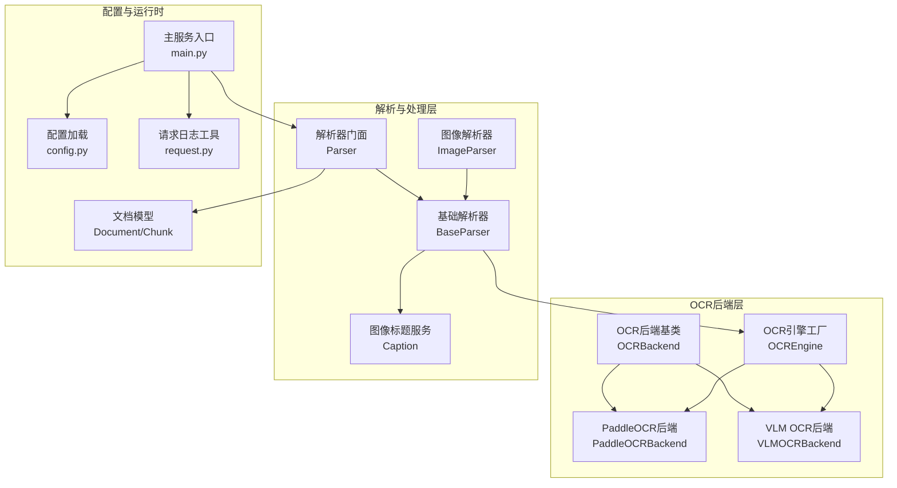
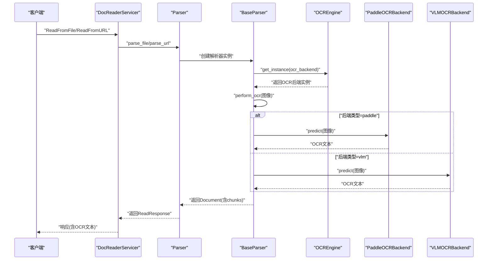
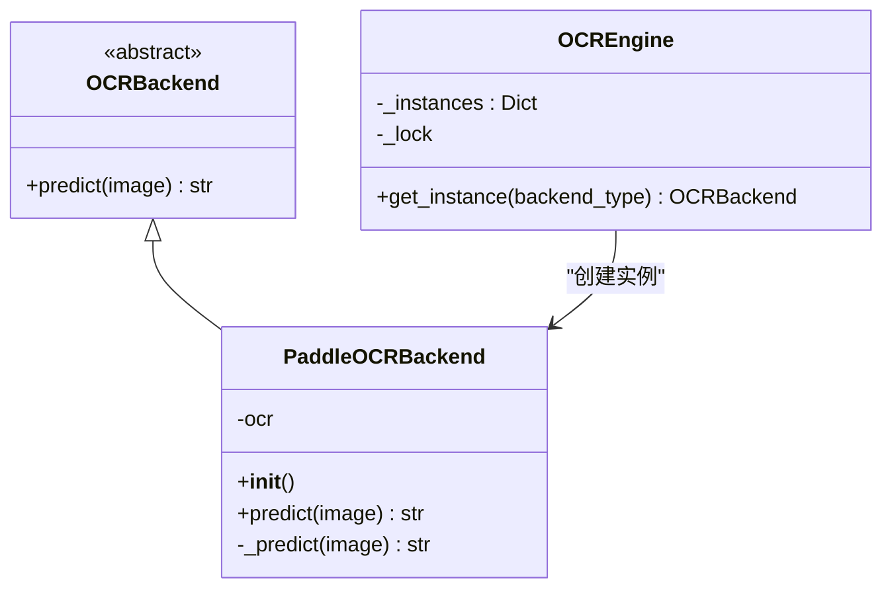
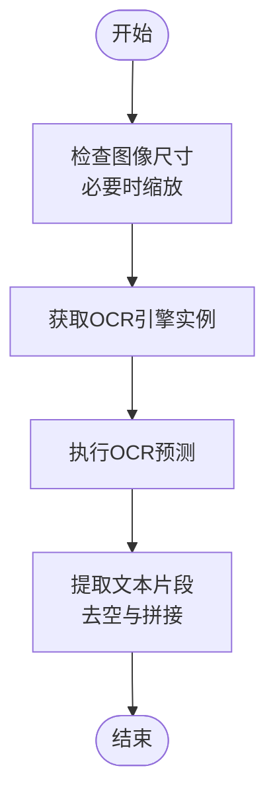
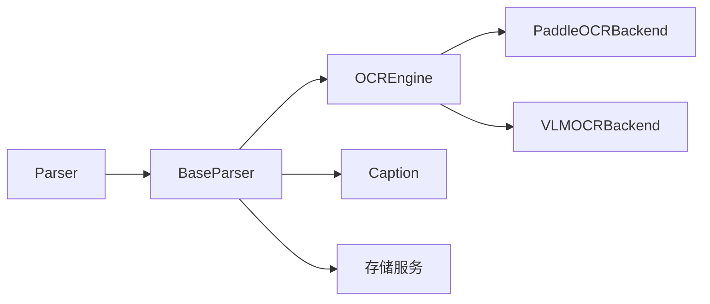

# PaddleOCR文字识别

<cite>
**本文档引用的文件**
- [docreader/ocr/paddle.py](file://docreader/ocr/paddle.py)
- [docreader/ocr/base.py](file://docreader/ocr/base.py)
- [docreader/ocr/__init__.py](file://docreader/ocr/__init__.py)
- [docreader/ocr/vlm.py](file://docreader/ocr/vlm.py)
- [docreader/parser/base_parser.py](file://docreader/parser/base_parser.py)
- [docreader/parser/parser.py](file://docreader/parser/parser.py)
- [docreader/parser/image_parser.py](file://docreader/parser/image_parser.py)
- [docreader/parser/caption.py](file://docreader/parser/caption.py)
- [docreader/config.py](file://docreader/config.py)
- [docreader/main.py](file://docreader/main.py)
- [docreader/models/document.py](file://docreader/models/document.py)
- [docreader/utils/request.py](file://docreader/utils/request.py)
- [docreader/scripts/download_deps.py](file://docreader/scripts/download_deps.py)
</cite>

## 目录
1. [简介](#简介)
2. [项目结构](#项目结构)
3. [核心组件](#核心组件)
4. [架构总览](#架构总览)
5. [详细组件分析](#详细组件分析)
6. [依赖关系分析](#依赖关系分析)
7. [性能考虑](#性能考虑)
8. [故障排除指南](#故障排除指南)
9. [结论](#结论)
10. [附录](#附录)

## 简介
本文件面向WiseDx项目中的PaddleOCR文字识别子系统，系统性梳理其架构设计、技术原理、配置参数、性能优化策略以及常见问题排查方法。文档重点覆盖以下方面：
- 文字检测与识别算法：基于PaddleOCR PP-OCRv4模型族，结合文档方向分类、文本行方向检测、膨胀增强与DB分数模式优化，提升复杂场景下的准确率。
- 后处理流程：统一的OCR结果提取、文本拼接与日志记录。
- 配置参数：模型选择、检测阈值、识别阈值、并发控制、代理设置等。
- 性能表现与局限性：针对不同图像质量、字体类型与语言环境的适用性与限制。
- 实践示例：模型下载预热、初始化与预测调用的参考路径。
- 优化策略：CPU兼容性适配、并发控制、内存管理与日志追踪。

## 项目结构
围绕OCR能力，WiseDx采用模块化设计，主要涉及OCR后端抽象、具体实现（PaddleOCR/VLM）、解析器与配置管理等层次。

**图表来源**
- [docreader/ocr/base.py](file://docreader/ocr/base.py#L10-L32)
- [docreader/ocr/paddle.py](file://docreader/ocr/paddle.py#L16-L176)
- [docreader/ocr/vlm.py](file://docreader/ocr/vlm.py#L14-L88)
- [docreader/ocr/__init__.py](file://docreader/ocr/__init__.py#L12-L38)
- [docreader/parser/base_parser.py](file://docreader/parser/base_parser.py#L29-L460)
- [docreader/parser/parser.py](file://docreader/parser/parser.py#L21-L179)
- [docreader/parser/image_parser.py](file://docreader/parser/image_parser.py#L12-L49)
- [docreader/parser/caption.py](file://docreader/parser/caption.py#L173-L388)
- [docreader/config.py](file://docreader/config.py#L48-L285)
- [docreader/main.py](file://docreader/main.py#L130-L315)
- [docreader/models/document.py](file://docreader/models/document.py#L9-L88)
- [docreader/utils/request.py](file://docreader/utils/request.py#L47-L150)

**章节来源**
- [docreader/ocr/paddle.py](file://docreader/ocr/paddle.py#L16-L176)
- [docreader/ocr/base.py](file://docreader/ocr/base.py#L10-L32)
- [docreader/ocr/__init__.py](file://docreader/ocr/__init__.py#L12-L38)
- [docreader/parser/base_parser.py](file://docreader/parser/base_parser.py#L95-L460)
- [docreader/parser/parser.py](file://docreader/parser/parser.py#L21-L179)
- [docreader/parser/image_parser.py](file://docreader/parser/image_parser.py#L12-L49)
- [docreader/parser/caption.py](file://docreader/parser/caption.py#L173-L388)
- [docreader/config.py](file://docreader/config.py#L48-L285)
- [docreader/main.py](file://docreader/main.py#L130-L315)
- [docreader/models/document.py](file://docreader/models/document.py#L9-L88)
- [docreader/utils/request.py](file://docreader/utils/request.py#L47-L150)

## 核心组件
- OCR后端抽象与实现
  - 抽象基类：定义统一的predict接口，约束各后端实现。
  - PaddleOCR后端：封装PaddleOCR初始化、CPU兼容性检测、模型配置与预测逻辑。
  - VLM OCR后端：基于OpenAI兼容接口或Ollama，实现远程VLM OCR能力。
  - OCR引擎工厂：按后端类型创建并缓存实例，支持线程安全。
- 解析与处理
  - 基础解析器：统一的OCR执行、图像缩放、并发控制、多图异步处理、文本切分与图像抽取。
  - 解析器门面：根据文件类型路由到对应解析器，协调chunking与OCR/VLM流程。
  - 图像解析器：负责图像上传、Markdown生成与基础图像元数据。
  - 图像标题服务：封装OpenAI/Ollama接口，生成图像描述。
- 配置与运行时
  - 配置加载：从环境变量读取gRPC、图像处理、OCR、VLM、存储等配置。
  - 主服务：启动gRPC服务，接收文件/URL解析请求，返回带OCR文本的Chunk结果。
  - 文档模型：定义Chunk与Document的数据结构，支撑后续检索与展示。
  - 请求日志：注入请求ID、毫秒级时间戳与耗时统计，便于追踪。

**章节来源**
- [docreader/ocr/base.py](file://docreader/ocr/base.py#L10-L32)
- [docreader/ocr/paddle.py](file://docreader/ocr/paddle.py#L16-L176)
- [docreader/ocr/vlm.py](file://docreader/ocr/vlm.py#L14-L88)
- [docreader/ocr/__init__.py](file://docreader/ocr/__init__.py#L12-L38)
- [docreader/parser/base_parser.py](file://docreader/parser/base_parser.py#L95-L460)
- [docreader/parser/parser.py](file://docreader/parser/parser.py#L21-L179)
- [docreader/parser/image_parser.py](file://docreader/parser/image_parser.py#L12-L49)
- [docreader/parser/caption.py](file://docreader/parser/caption.py#L173-L388)
- [docreader/config.py](file://docreader/config.py#L48-L285)
- [docreader/main.py](file://docreader/main.py#L130-L315)
- [docreader/models/document.py](file://docreader/models/document.py#L9-L88)
- [docreader/utils/request.py](file://docreader/utils/request.py#L47-L150)

## 架构总览
下图展示了从gRPC请求到OCR执行与结果返回的完整流程，突出OCR后端选择、并发控制与图像处理的关键节点。

**图表来源**
- [docreader/main.py](file://docreader/main.py#L130-L241)
- [docreader/parser/parser.py](file://docreader/parser/parser.py#L74-L179)
- [docreader/parser/base_parser.py](file://docreader/parser/base_parser.py#L95-L223)
- [docreader/ocr/__init__.py](file://docreader/ocr/__init__.py#L12-L38)
- [docreader/ocr/paddle.py](file://docreader/ocr/paddle.py#L118-L176)
- [docreader/ocr/vlm.py](file://docreader/ocr/vlm.py#L41-L88)

## 详细组件分析

### PaddleOCR后端实现
- 初始化与CPU兼容性
  - 强制使用CPU设备，禁用GPU。
  - Linux环境下检测AVX指令集，若不支持则切换兼容模式并限制AVX使用。
  - 导入PaddleOCR并按配置构建实例，启用文档方向分类、文本行方向检测、膨胀增强与慢速DB分数模式。
- 预测流程
  - 支持字符串路径、字节流与PIL图像对象输入。
  - 统一转换为RGB模式，转为numpy数组后调用PaddleOCR进行识别。
  - 提取识别结果中的文本片段，去除空串并以空格连接，记录字符数量与日志。
- 错误处理
  - 导入失败、OS错误（非法指令/崩溃）与通用异常均记录错误日志并返回空文本。

**图表来源**
- [docreader/ocr/base.py](file://docreader/ocr/base.py#L10-L32)
- [docreader/ocr/paddle.py](file://docreader/ocr/paddle.py#L16-L176)
- [docreader/ocr/__init__.py](file://docreader/ocr/__init__.py#L12-L38)

**章节来源**
- [docreader/ocr/paddle.py](file://docreader/ocr/paddle.py#L16-L176)
- [docreader/ocr/base.py](file://docreader/ocr/base.py#L10-L32)
- [docreader/ocr/__init__.py](file://docreader/ocr/__init__.py#L12-L38)

### OCR引擎工厂
- 功能
  - 根据后端类型（paddle/vlm/dummy）创建并缓存实例。
  - 线程安全的单例缓存，避免重复初始化。
- 使用
  - 基础解析器通过工厂获取OCR引擎，再调用predict执行识别。

**章节来源**
- [docreader/ocr/__init__.py](file://docreader/ocr/__init__.py#L12-L38)
- [docreader/parser/base_parser.py](file://docreader/parser/base_parser.py#L95-L120)

### 基础解析器与图像处理
- OCR执行
  - perform_ocr：先按最大尺寸限制缩放图像，再通过工厂获取OCR引擎并执行预测。
- 并发控制
  - process_multiple_images：使用信号量限制并发任务数，支持超时与异常兜底，避免整体失败。
- 文本切分与结构保护
  - _split_into_units：保护表格、代码块、公式、内联图片/链接等结构，避免切分破坏。
  - chunk_text：按单位累加，保持overlap完整性，确保语义连贯。
- 图像抽取与标题
  - extract_images_from_chunk：从Chunk文本中抽取图片信息。
  - get_image_caption：调用Caption服务生成图像描述（可选）。

**图表来源**
- [docreader/parser/base_parser.py](file://docreader/parser/base_parser.py#L197-L223)

**章节来源**
- [docreader/parser/base_parser.py](file://docreader/parser/base_parser.py#L197-L460)

### 解析器门面与图像解析器
- 解析器门面
  - 根据文件扩展名映射到对应解析器，传递chunking配置与OCR后端类型。
- 图像解析器
  - 将图像上传至存储，生成Markdown图片引用与原始二进制映射。

**章节来源**
- [docreader/parser/parser.py](file://docreader/parser/parser.py#L21-L179)
- [docreader/parser/image_parser.py](file://docreader/parser/image_parser.py#L12-L49)

### VLM OCR后端
- 功能
  - 基于OpenAI兼容接口或Ollama，将图像编码为base64并通过聊天补全接口提取文本。
  - 支持温度与最大token限制，确保稳定输出。
- 配置
  - 从全局配置读取模型名称、API密钥与基础URL。

**章节来源**
- [docreader/ocr/vlm.py](file://docreader/ocr/vlm.py#L14-L88)
- [docreader/config.py](file://docreader/config.py#L128-L144)

### 图像标题服务（Caption）
- 功能
  - 支持OpenAI兼容与Ollama两种接口，生成图像简要描述。
  - 自动处理超时、状态码异常与JSON解析错误。
- 配置
  - 优先使用传入的vlm_config，否则回退到环境变量。

**章节来源**
- [docreader/parser/caption.py](file://docreader/parser/caption.py#L173-L388)
- [docreader/config.py](file://docreader/config.py#L134-L144)

## 依赖关系分析
- 组件耦合
  - BaseParser依赖OCREngine与Caption，形成“解析-识别-描述”的处理链。
  - Parser门面负责路由与配置传递，降低上层对具体解析器的感知。
  - PaddleOCRBackend/VLMOCRBackend实现OCRBackend抽象，便于替换与扩展。
- 外部依赖
  - PaddleOCR：用于本地CPU推理。
  - OpenAI兼容API/Ollama：用于远程VLM OCR。
  - 存储服务：上传图像与返回URL。
- 潜在循环依赖
  - 当前结构清晰，无明显循环导入；工厂与抽象类解耦良好。

**图表来源**
- [docreader/parser/parser.py](file://docreader/parser/parser.py#L21-L179)
- [docreader/parser/base_parser.py](file://docreader/parser/base_parser.py#L95-L460)
- [docreader/ocr/__init__.py](file://docreader/ocr/__init__.py#L12-L38)
- [docreader/ocr/paddle.py](file://docreader/ocr/paddle.py#L16-L176)
- [docreader/ocr/vlm.py](file://docreader/ocr/vlm.py#L14-L88)
- [docreader/parser/caption.py](file://docreader/parser/caption.py#L173-L388)

**章节来源**
- [docreader/parser/parser.py](file://docreader/parser/parser.py#L21-L179)
- [docreader/parser/base_parser.py](file://docreader/parser/base_parser.py#L95-L460)
- [docreader/ocr/__init__.py](file://docreader/ocr/__init__.py#L12-L38)

## 性能考虑
- CPU兼容性与指令集
  - 自动检测AVX支持，不支持时切换兼容模式，避免非法指令导致崩溃。
- 图像尺寸控制
  - 默认最大边长限制为1920px，减少推理开销与内存占用。
- 并发控制
  - 通过信号量限制同时处理的图像数量，避免资源争抢。
- 日志与监控
  - 注入请求ID与耗时统计，便于定位瓶颈与异常。
- 模型预热
  - 提供脚本预下载与缓存模型，减少首次调用延迟。

**章节来源**
- [docreader/ocr/paddle.py](file://docreader/ocr/paddle.py#L25-L67)
- [docreader/parser/base_parser.py](file://docreader/parser/base_parser.py#L224-L244)
- [docreader/utils/request.py](file://docreader/utils/request.py#L47-L150)
- [docreader/scripts/download_deps.py](file://docreader/scripts/download_deps.py#L26-L60)

## 故障排除指南
- PaddleOCR初始化失败
  - 导入失败：检查paddle与paddleocr安装状态。
  - OS错误（非法指令/崩溃）：确认CPU是否支持AVX；建议安装CPU-only版本或更换后端。
- OCR结果为空
  - 检查图像尺寸与格式；确保转换为RGB模式。
  - 调整检测阈值与DB分数模式配置以提升召回。
- 并发异常
  - 调整最大并发任务数；为OCR调用设置合理超时。
- VLM OCR失败
  - 校验API密钥、基础URL与模型名称；确认网络可达性与超时设置。
- 日志与追踪
  - 使用请求ID快速定位单次调用的完整链路与耗时。

**章节来源**
- [docreader/ocr/paddle.py](file://docreader/ocr/paddle.py#L95-L117)
- [docreader/parser/base_parser.py](file://docreader/parser/base_parser.py#L266-L298)
- [docreader/ocr/vlm.py](file://docreader/ocr/vlm.py#L50-L87)
- [docreader/utils/request.py](file://docreader/utils/request.py#L47-L150)

## 结论
WiseDx的OCR子系统以模块化架构实现了PaddleOCR与VLM OCR的统一接入，结合图像缩放、并发控制与结构化文本切分，满足医学文档的多模态解析需求。通过CPU兼容性适配、模型预热与日志追踪，系统在稳定性与可观测性方面具备良好表现。建议在生产环境中根据硬件条件与业务负载，合理配置并发与阈值参数，并优先采用模型预热策略以降低首包延迟。

## 附录

### 配置参数总览
- OCR相关
  - OCR后端类型：选择paddle或vlm。
  - OCR模型名称：远程VLM模型名。
  - OCR API基础URL与密钥：远程VLM访问凭证。
- 图像处理
  - 最大并发任务数：控制图像处理并发度。
  - 图像最大边长：默认1920px，影响推理速度与内存。
- 存储与代理
  - 存储类型与桶配置。
  - 外部HTTP/HTTPS代理设置。
- gRPC
  - 工作线程数、端口与消息大小限制。

**章节来源**
- [docreader/config.py](file://docreader/config.py#L48-L285)

### 关键参数调优建议
- 检测阈值与框阈值
  - text_det_thresh与text_det_box_thresh用于平衡召回与精度，低阈值提高召回但可能引入噪声。
- DB分数模式
  - det_db_score_mode设为slow可提升准确性，但会增加计算时间。
- 膨胀增强
  - use_dilation开启可改善小字与模糊文本识别效果。
- 并发与超时
  - 根据CPU核数与内存上限调整最大并发任务数；为OCR调用设置合理超时（如30秒）。

**章节来源**
- [docreader/ocr/paddle.py](file://docreader/ocr/paddle.py#L71-L90)
- [docreader/parser/base_parser.py](file://docreader/parser/base_parser.py#L266-L298)

### 配置示例（参考路径）
- 模型下载与预热
  - 参考脚本路径：[docreader/scripts/download_deps.py](file://docreader/scripts/download_deps.py#L26-L60)
- 初始化与预测调用
  - PaddleOCR初始化与预测：[docreader/ocr/paddle.py](file://docreader/ocr/paddle.py#L16-L176)
  - VLM OCR初始化与预测：[docreader/ocr/vlm.py](file://docreader/ocr/vlm.py#L14-L88)
- 解析器集成
  - 解析器门面与图像处理：[docreader/parser/parser.py](file://docreader/parser/parser.py#L21-L179)，[docreader/parser/base_parser.py](file://docreader/parser/base_parser.py#L386-L460)