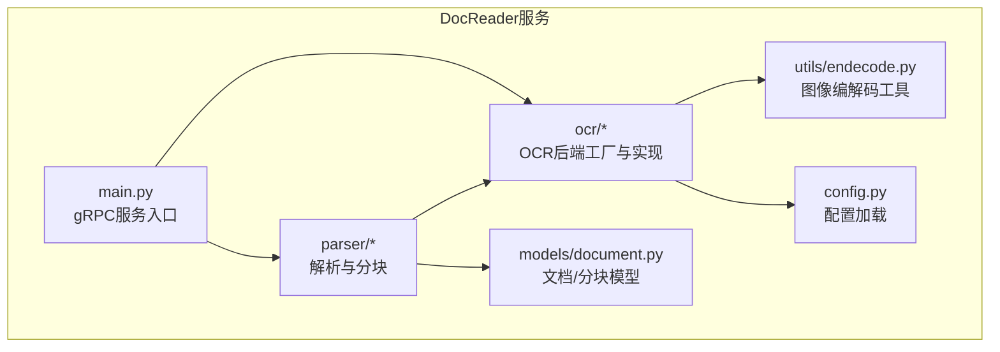
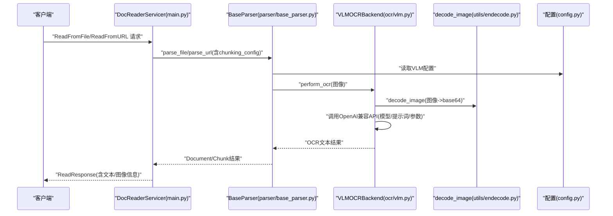
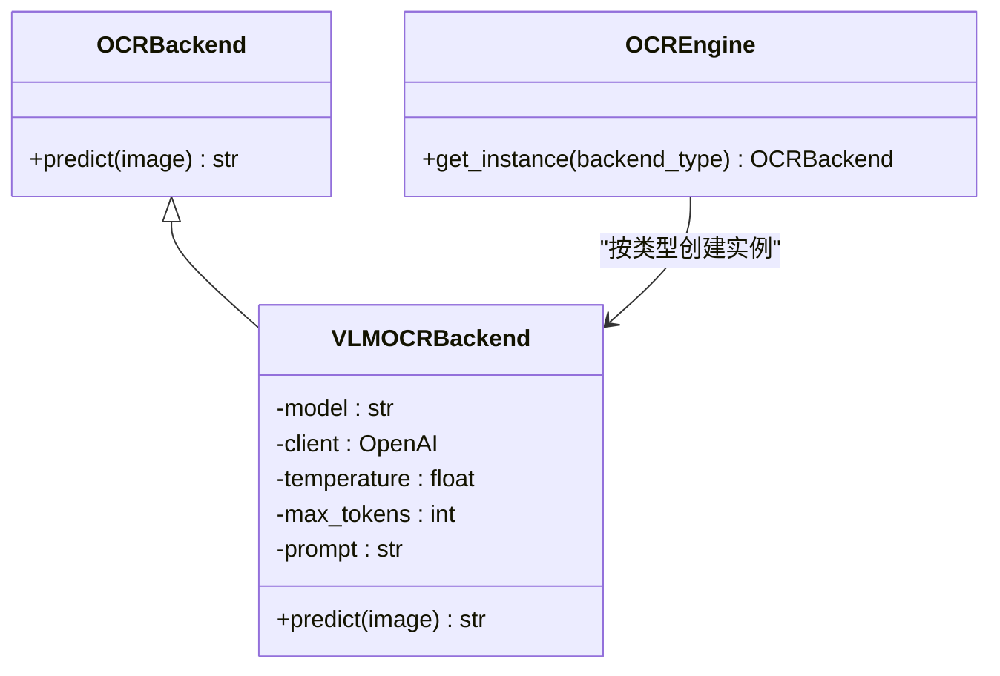
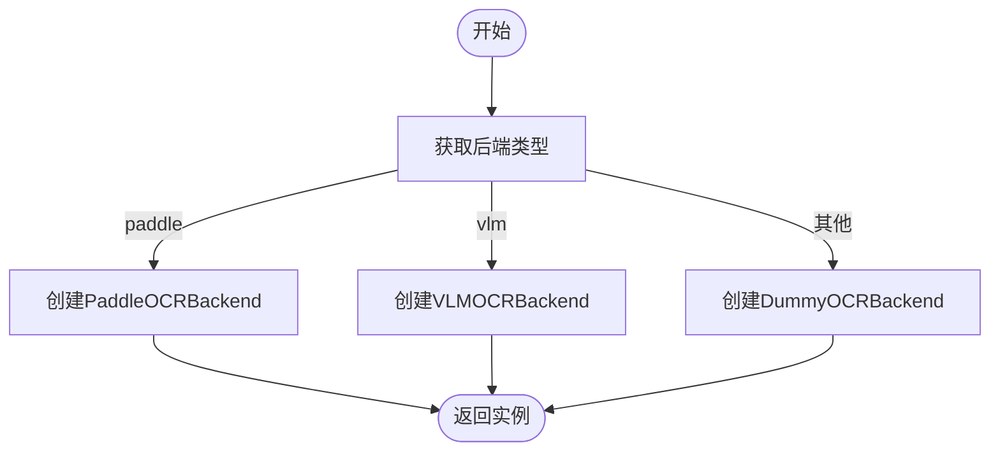
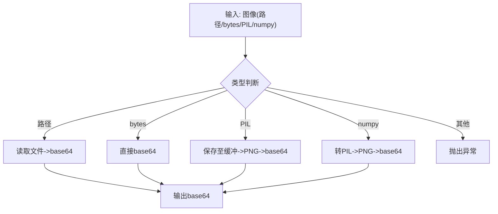
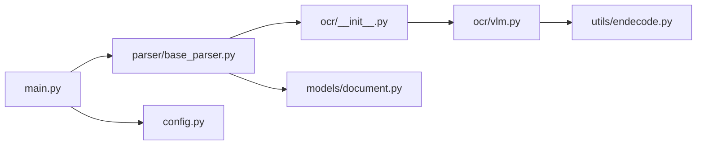

# 视觉语言模型OCR

<cite>
**本文引用的文件**
- [docreader/ocr/vlm.py](file://docreader/ocr/vlm.py)
- [docreader/ocr/base.py](file://docreader/ocr/base.py)
- [docreader/ocr/__init__.py](file://docreader/ocr/__init__.py)
- [docreader/utils/endecode.py](file://docreader/utils/endecode.py)
- [docreader/config.py](file://docreader/config.py)
- [config/config.yaml](file://config/config.yaml)
- [docreader/main.py](file://docreader/main.py)
- [docreader/parser/base_parser.py](file://docreader/parser/base_parser.py)
- [docreader/models/document.py](file://docreader/models/document.py)
- [docreader/README.md](file://docreader/README.md)
- [README.md](file://README.md)
</cite>

## 目录
1. [简介](#简介)
2. [项目结构](#项目结构)
3. [核心组件](#核心组件)
4. [架构总览](#架构总览)
5. [组件详解](#组件详解)
6. [依赖关系分析](#依赖关系分析)
7. [性能考量](#性能考量)
8. [故障排除指南](#故障排除指南)
9. [结论](#结论)
10. [附录](#附录)

## 简介
本文件面向“视觉语言模型OCR（VLM OCR）”在文档解析与多模态理解中的应用，结合仓库中现有的VLM OCR实现与整体DocReader服务架构，系统化阐述VLM在OCR任务中的技术优势、架构设计、配置与使用方法、与传统OCR的差异与互补、在医疗文档场景的应用思路与对比、部署与性能优化建议，以及常见问题排查。

## 项目结构
本项目采用模块化分层设计：
- 服务入口与gRPC：docreader/main.py提供DocReaderServicer，对外暴露解析与读取接口。
- OCR子系统：docreader/ocr目录包含OCR后端抽象与具体实现（VLM与PaddleOCR等），并通过工厂类统一管理。
- 解析管线：docreader/parser目录负责各类文档格式解析、分块、OCR执行与多模态处理。
- 配置与工具：docreader/config.py加载运行时配置；docreader/utils/endecode.py提供图像编解码等工具；docreader/models/document.py定义文档与分块的数据模型。
- 文档与部署：docreader/README.md提供服务与配置说明；顶层README.md提供整体框架定位与能力概览。

图表来源
- [docreader/main.py](file://docreader/main.py#L130-L315)
- [docreader/parser/base_parser.py](file://docreader/parser/base_parser.py#L122-L210)
- [docreader/ocr/__init__.py](file://docreader/ocr/__init__.py#L12-L38)
- [docreader/models/document.py](file://docreader/models/document.py#L62-L88)
- [docreader/utils/endecode.py](file://docreader/utils/endecode.py#L23-L76)
- [docreader/config.py](file://docreader/config.py#L99-L217)

章节来源
- [docreader/main.py](file://docreader/main.py#L130-L315)
- [docreader/parser/base_parser.py](file://docreader/parser/base_parser.py#L122-L210)
- [docreader/ocr/__init__.py](file://docreader/ocr/__init__.py#L12-L38)
- [docreader/models/document.py](file://docreader/models/document.py#L62-L88)
- [docreader/utils/endecode.py](file://docreader/utils/endecode.py#L23-L76)
- [docreader/config.py](file://docreader/config.py#L99-L217)

## 核心组件
- OCR后端抽象与工厂
  - 抽象基类：OCRBackend，定义predict接口。
  - 工厂类：OCREngine，按后端类型返回实例（支持paddle、vlm、dummy）。
- VLM OCR后端
  - VLMOCRBackend：基于OpenAI兼容接口调用VLM模型进行图像文本抽取，内置提示词与参数。
- 图像编解码工具
  - decode_image：将多种输入格式（路径、bytes、PIL、numpy）统一编码为base64字符串。
- 配置系统
  - DocReaderConfig：集中加载环境变量，支持OCR/VLM/存储/代理等配置。
- 解析与分块
  - BaseParser：负责文档解析、分块、OCR执行与多模态处理初始化。
- 文档模型
  - Document/Chunk：统一的文档与分块数据结构，便于序列化与传输。

章节来源
- [docreader/ocr/base.py](file://docreader/ocr/base.py#L10-L32)
- [docreader/ocr/__init__.py](file://docreader/ocr/__init__.py#L12-L38)
- [docreader/ocr/vlm.py](file://docreader/ocr/vlm.py#L14-L88)
- [docreader/utils/endecode.py](file://docreader/utils/endecode.py#L23-L76)
- [docreader/config.py](file://docreader/config.py#L99-L217)
- [docreader/parser/base_parser.py](file://docreader/parser/base_parser.py#L122-L210)
- [docreader/models/document.py](file://docreader/models/document.py#L9-L88)

## 架构总览
下图展示了DocReader服务中与VLM OCR相关的端到端流程：客户端通过gRPC发起解析请求，服务端根据配置选择OCR后端（此处为VLM），对图像进行OCR识别，随后进入解析与分块阶段，最终返回包含文本与图像信息的响应。

图表来源
- [docreader/main.py](file://docreader/main.py#L135-L241)
- [docreader/parser/base_parser.py](file://docreader/parser/base_parser.py#L170-L210)
- [docreader/ocr/vlm.py](file://docreader/ocr/vlm.py#L41-L88)
- [docreader/utils/endecode.py](file://docreader/utils/endecode.py#L23-L76)
- [docreader/config.py](file://docreader/config.py#L99-L217)

## 组件详解

### VLM OCR后端（VLMOCRBackend）
- 设计要点
  - 基于OpenAI兼容接口，通过消息结构传入图像URL与文本提示，实现统一的多模态输入。
  - 内置提示词，强调“正文提取、忽略页眉页脚、表格HTML、公式LaTeX、按阅读顺序组织”，适配结构化文档。
  - 参数控制：温度固定为0、最大token数可控，确保稳定与可控的输出。
- 数据流
  - 输入：图像（路径/bytes/PIL/numpy）。
  - 处理：decode_image编码为base64，构造OpenAI兼容的消息结构。
  - 输出：模型返回的文本内容。
- 错误处理
  - 客户端未初始化、异常捕获均记录日志并返回空串，避免中断解析流程。

图表来源
- [docreader/ocr/base.py](file://docreader/ocr/base.py#L10-L32)
- [docreader/ocr/vlm.py](file://docreader/ocr/vlm.py#L14-L88)
- [docreader/ocr/__init__.py](file://docreader/ocr/__init__.py#L12-L38)

章节来源
- [docreader/ocr/vlm.py](file://docreader/ocr/vlm.py#L14-L88)
- [docreader/ocr/base.py](file://docreader/ocr/base.py#L10-L32)
- [docreader/ocr/__init__.py](file://docreader/ocr/__init__.py#L12-L38)

### OCR工厂与多后端支持
- OCREngine提供按类型创建后端实例的工厂方法，支持paddle、vlm与dummy三种类型。
- BaseParser在初始化时可按配置选择OCR后端，并在perform_ocr中统一调度。

图表来源
- [docreader/ocr/__init__.py](file://docreader/ocr/__init__.py#L12-L38)
- [docreader/parser/base_parser.py](file://docreader/parser/base_parser.py#L96-L120)

章节来源
- [docreader/ocr/__init__.py](file://docreader/ocr/__init__.py#L12-L38)
- [docreader/parser/base_parser.py](file://docreader/parser/base_parser.py#L96-L120)

### 图像编解码工具（decode_image）
- 支持多种输入格式，统一输出base64字符串，便于嵌入到多模态消息中。
- 对不支持的类型抛出异常，便于上层捕获与降级。

图表来源
- [docreader/utils/endecode.py](file://docreader/utils/endecode.py#L23-L76)

章节来源
- [docreader/utils/endecode.py](file://docreader/utils/endecode.py#L23-L76)

### 配置系统（DocReaderConfig）
- 通过环境变量集中加载，涵盖gRPC、图像处理、代理、OCR/VLM、存储等。
- VLM相关字段：模型名称、接口类型（openai/ollama）、API密钥与基础URL。
- 与服务入口main.py配合，动态决定VLM配置与并发参数。

章节来源
- [docreader/config.py](file://docreader/config.py#L99-L217)
- [docreader/main.py](file://docreader/main.py#L105-L127)

### 解析与分块（BaseParser）
- 初始化时根据chunking_config决定是否启用多模态与Caption服务。
- perform_ocr中对图像进行尺寸控制与OCR执行，支持并发与错误处理。
- 与Document/Chunk模型配合，统一输出结构化结果。

章节来源
- [docreader/parser/base_parser.py](file://docreader/parser/base_parser.py#L122-L210)
- [docreader/models/document.py](file://docreader/models/document.py#L9-L88)

## 依赖关系分析
- 组件耦合
  - DocReaderServicer依赖Parser；Parser依赖OCR工厂与配置；VLMOCRBackend依赖OpenAI兼容接口与图像编解码工具。
- 外部依赖
  - OpenAI兼容API（VLM模型服务）、MinIO对象存储（图片URL生成）、gRPC通信。
- 潜在循环依赖
  - 当前模块职责清晰，未发现循环导入；OCR工厂与解析器通过接口解耦。

图表来源
- [docreader/main.py](file://docreader/main.py#L130-L315)
- [docreader/parser/base_parser.py](file://docreader/parser/base_parser.py#L122-L210)
- [docreader/ocr/__init__.py](file://docreader/ocr/__init__.py#L12-L38)
- [docreader/ocr/vlm.py](file://docreader/ocr/vlm.py#L14-L88)
- [docreader/utils/endecode.py](file://docreader/utils/endecode.py#L23-L76)
- [docreader/models/document.py](file://docreader/models/document.py#L9-L88)
- [docreader/config.py](file://docreader/config.py#L99-L217)

章节来源
- [docreader/main.py](file://docreader/main.py#L130-L315)
- [docreader/parser/base_parser.py](file://docreader/parser/base_parser.py#L122-L210)
- [docreader/ocr/__init__.py](file://docreader/ocr/__init__.py#L12-L38)
- [docreader/ocr/vlm.py](file://docreader/ocr/vlm.py#L14-L88)
- [docreader/utils/endecode.py](file://docreader/utils/endecode.py#L23-L76)
- [docreader/models/document.py](file://docreader/models/document.py#L9-L88)
- [docreader/config.py](file://docreader/config.py#L99-L217)

## 性能考量
- 并发与吞吐
  - gRPC服务可通过环境变量配置工作线程数与消息大小上限，适合高并发场景。
  - 图像处理并发数可配置，避免过大并发导致内存压力。
- OCR与VLM成本
  - VLM依赖外部API，需关注调用次数与延迟；可通过提示词与参数控制输出长度与稳定性。
- 存储与网络
  - 图片URL生成依赖MinIO公共端点，需确保网络可达与带宽充足。
- 文档解析
  - 多模态解析与OCR执行会增加CPU与内存占用，建议根据文档规模调整chunk大小与并发。

章节来源
- [docreader/README.md](file://docreader/README.md#L75-L140)
- [docreader/config.py](file://docreader/config.py#L107-L118)
- [docreader/main.py](file://docreader/main.py#L281-L287)

## 故障排除指南
- VLM OCR无输出或报错
  - 检查OCR/VLM相关环境变量是否正确配置（模型名、接口类型、API密钥、基础URL）。
  - 查看服务日志，确认VLMOCRBackend初始化与API调用是否成功。
- 图像无法显示或URL不可达
  - 检查MinIO公共端点配置，确保可从浏览器或客户端访问。
- 文件上传失败
  - 调整最大文件大小限制，确保前后端一致。
- OCR功能异常
  - 可临时禁用OCR或切换后端类型进行定位。

章节来源
- [docreader/README.md](file://docreader/README.md#L181-L228)
- [docreader/config.py](file://docreader/config.py#L99-L217)
- [docreader/ocr/vlm.py](file://docreader/ocr/vlm.py#L50-L58)

## 结论
本仓库提供了基于OpenAI兼容接口的VLM OCR实现，结合DocReader服务的gRPC接口与解析管线，能够将图像OCR结果与文档结构化输出整合。通过配置系统与工厂模式，系统具备良好的可扩展性与可运维性。在实际应用中，建议结合业务场景优化提示词、参数与并发策略，并在部署时关注网络与存储的稳定性与性能。

## 附录

### VLM OCR在OCR任务中的技术优势与应用场景
- 技术优势
  - 多模态理解：在单一接口中融合图像与文本提示，适合复杂版面与结构化内容。
  - 提示词工程：通过结构化提示词约束输出格式（正文、表格HTML、公式LaTeX），提升下游处理效率。
  - 稳定性：固定温度与最大token，减少不确定性，适合生产环境。
- 应用场景
  - 复杂背景与多语言混合：VLM具备更强的泛化能力，适合处理非标准排版与混合语言。
  - 医疗文档：可与结构化解析、知识图谱增强结合，支撑临床决策与研究分析。

章节来源
- [docreader/ocr/vlm.py](file://docreader/ocr/vlm.py#L34-L39)
- [README.md](file://README.md#L32-L63)

### VLM与传统OCR的差异与互补
- 差异
  - 传统OCR（如PaddleOCR）侧重像素到文本映射，VLM更偏向“理解+生成”，适合结构化输出与格式约束。
- 互补
  - 在复杂版面与低质量图像上，VLM可作为补充后端；在高精度纯文本场景，传统OCR可作为首选或降级方案。

章节来源
- [docreader/ocr/__init__.py](file://docreader/ocr/__init__.py#L12-L38)
- [docreader/README.md](file://docreader/README.md#L80-L95)

### 医疗文档OCR应用思路与效果对比（概念性说明）
- 应用思路
  - 将VLM OCR与结构化解析、知识图谱召回结合，实现“图像+文本”的联合理解，提升诊断建议与鉴别诊断的准确性。
- 效果对比（概念性）
  - VLM在复杂背景、手写体、多语言混合场景下通常优于传统OCR；在标准化表格与公式场景，可结合LaTeX/HTML输出提升后续处理效率。
- 与仓库能力的契合
  - 仓库已提供多模态解析、分块与结构化输出能力，可作为VLM OCR在医疗文档场景的基础设施。

章节来源
- [README.md](file://README.md#L48-L63)
- [config/config.yaml](file://config/config.yaml#L511-L513)

### 配置与使用方法（摘要）
- 环境变量关键项
  - OCR/VLM：OCR_BACKEND、OCR_API_BASE_URL、OCR_API_KEY、OCR_MODEL；VLM_MODEL_BASE_URL、VLM_MODEL_NAME、VLM_MODEL_API_KEY、VLM_INTERFACE_TYPE。
  - 存储：STORAGE_TYPE、MINIO_*或COS_*。
  - gRPC与并发：DOCREADER_GRPC_*、IMAGE_MAX_CONCURRENT。
- 使用流程
  - 通过gRPC调用DocReaderServicer的ReadFromFile/ReadFromURL接口，服务端自动选择OCR后端并返回结构化结果。

章节来源
- [docreader/README.md](file://docreader/README.md#L71-L140)
- [docreader/config.py](file://docreader/config.py#L128-L144)
- [docreader/main.py](file://docreader/main.py#L135-L241)