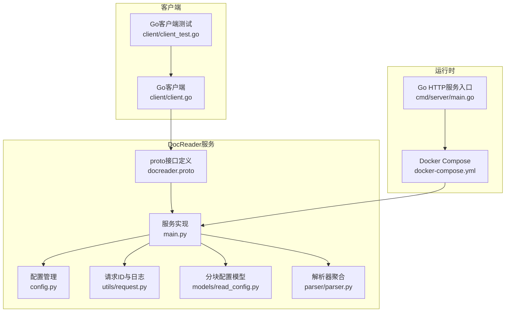
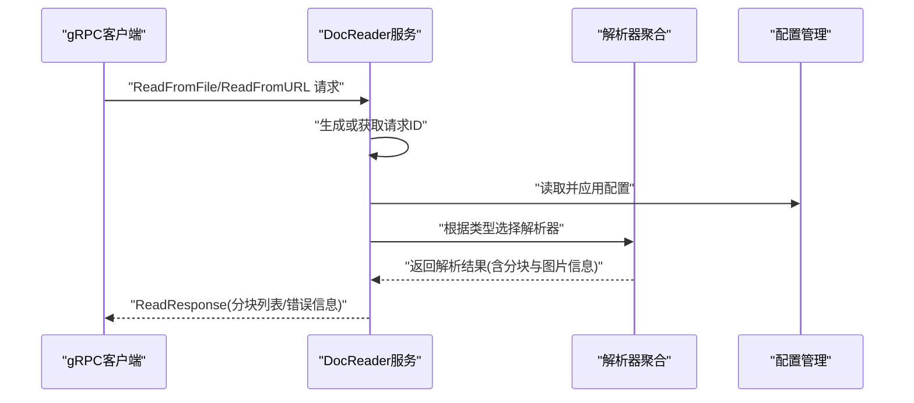
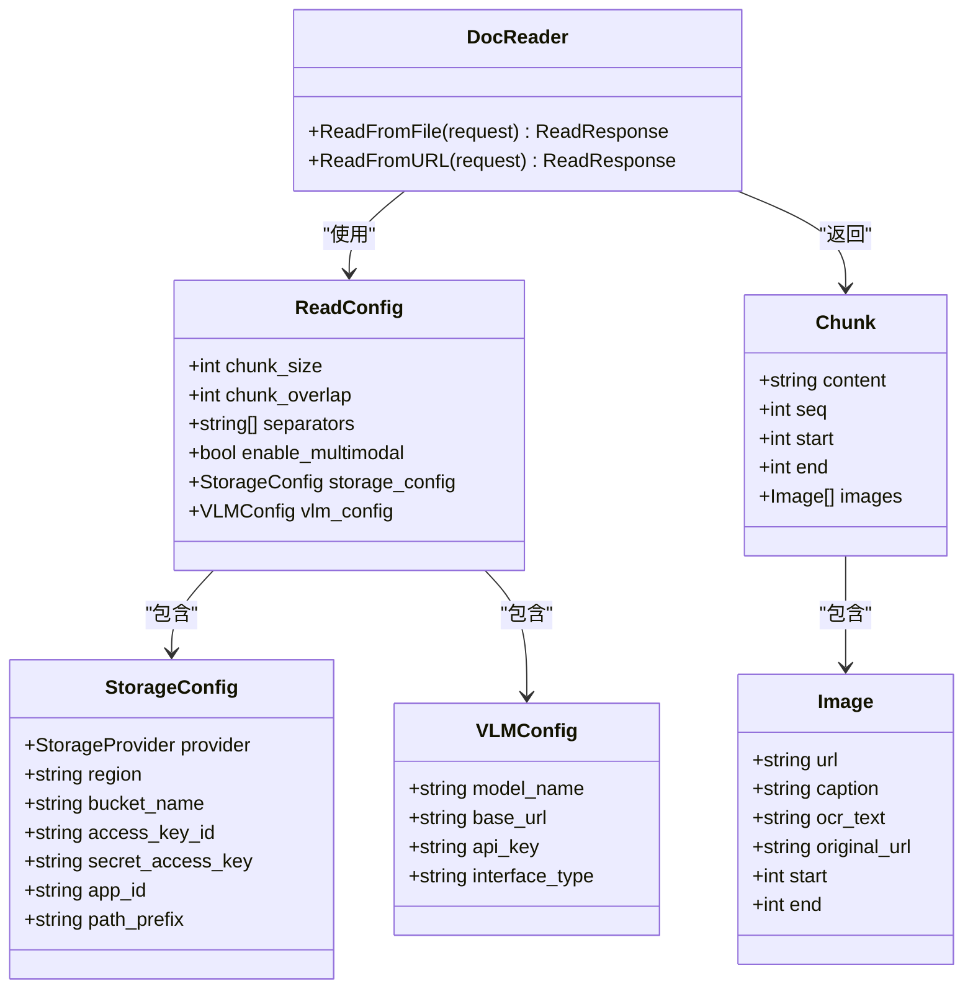
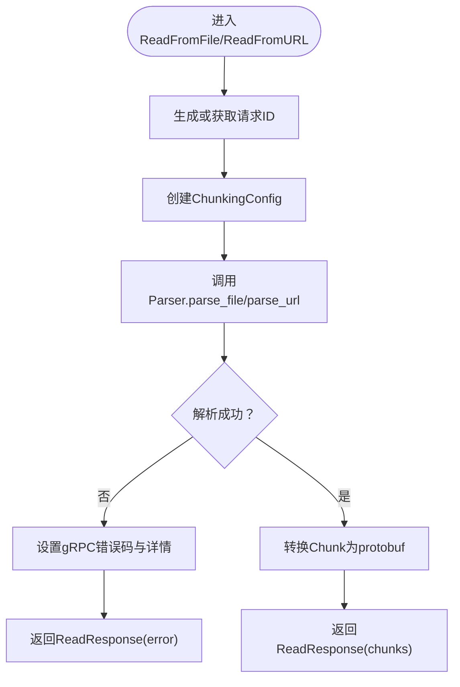
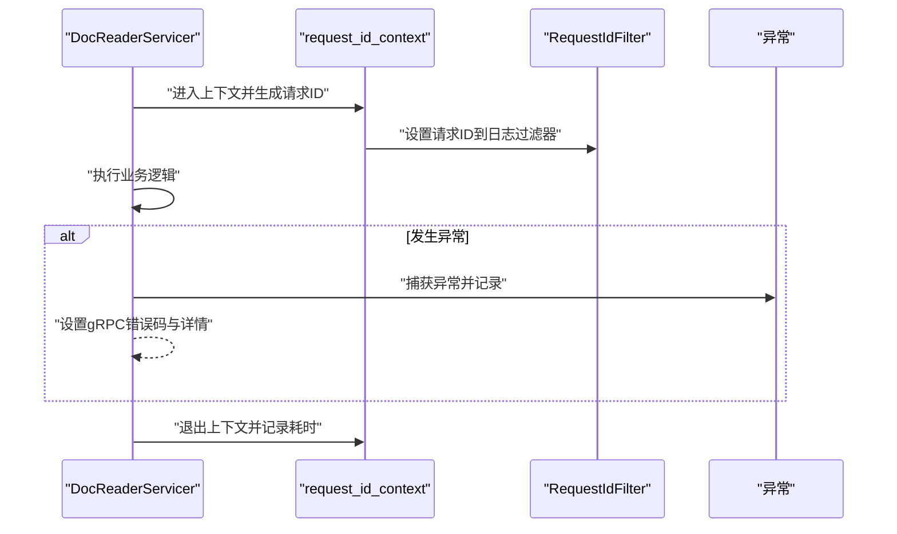
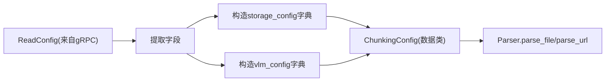
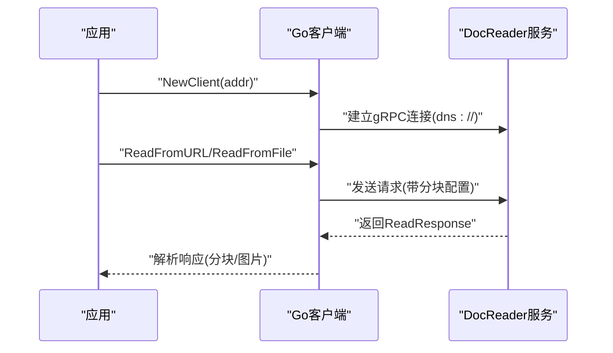
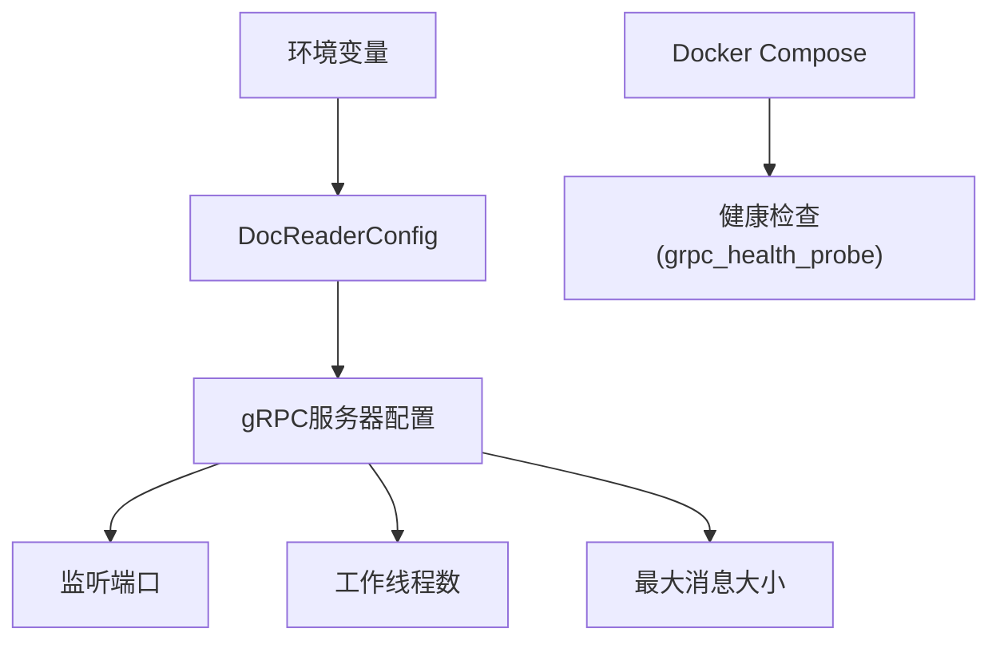
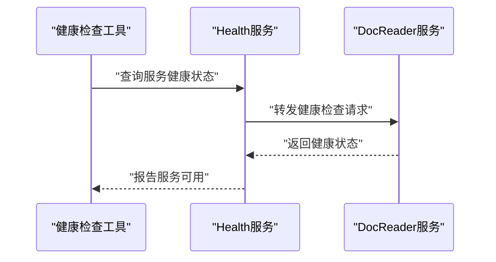
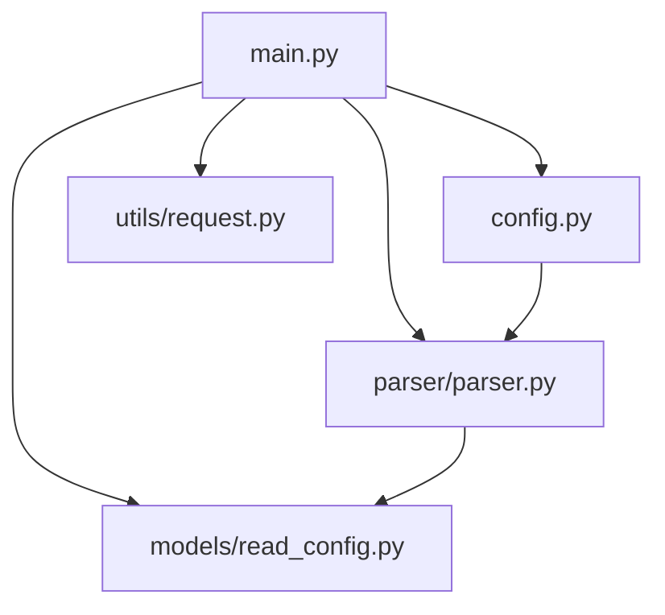

# gRPC服务实现

<cite>
**本文档引用的文件**
- [docreader/proto/docreader.proto](file://docreader/proto/docreader.proto)
- [docreader/main.py](file://docreader/main.py)
- [docreader/models/read_config.py](file://docreader/models/read_config.py)
- [docreader/config.py](file://docreader/config.py)
- [docreader/utils/request.py](file://docreader/utils/request.py)
- [docreader/client/client.go](file://docreader/client/client.go)
- [docreader/client/client_test.go](file://docreader/client/client_test.go)
- [docreader/parser/parser.py](file://docreader/parser/parser.py)
- [internal/middleware/logger.go](file://internal/middleware/logger.go)
- [docker-compose.yml](file://docker-compose.yml)
- [cmd/server/main.go](file://cmd/server/main.go)
</cite>

## 目录
1. [简介](#简介)
2. [项目结构](#项目结构)
3. [核心组件](#核心组件)
4. [架构总览](#架构总览)
5. [详细组件分析](#详细组件分析)
6. [依赖关系分析](#依赖关系分析)
7. [性能考虑](#性能考虑)
8. [故障排查指南](#故障排查指南)
9. [结论](#结论)
10. [附录](#附录)

## 简介
本文件面向WiseDx项目中的DocReader gRPC服务实现，系统性阐述以下内容：
- gRPC接口定义与协议缓冲区使用方式
- DocReaderServicer服务实现，重点解析ReadFromFile与ReadFromURL两个核心方法的处理流程
- 请求ID跟踪、异常处理与日志记录机制
- ChunkingConfig配置的传递与转换过程
- gRPC客户端集成示例与最佳实践
- 服务启动配置、性能调优与监控指标
- 健康检查服务的实现与部署注意事项

## 项目结构
WiseDx采用多语言混合架构：gRPC服务由Python实现，Go应用负责HTTP服务与容器编排。DocReader服务位于docreader目录，通过proto文件定义接口，并在main.py中实现服务端逻辑。

**图表来源**
- [docreader/proto/docreader.proto](file://docreader/proto/docreader.proto#L1-L89)
- [docreader/main.py](file://docreader/main.py#L1-L315)
- [docreader/config.py](file://docreader/config.py#L1-L285)
- [docreader/utils/request.py](file://docreader/utils/request.py#L1-L150)
- [docreader/models/read_config.py](file://docreader/models/read_config.py#L1-L28)
- [docreader/parser/parser.py](file://docreader/parser/parser.py#L1-L179)
- [docreader/client/client.go](file://docreader/client/client.go#L1-L123)
- [docreader/client/client_test.go](file://docreader/client/client_test.go#L1-L155)
- [docker-compose.yml](file://docker-compose.yml#L1-L271)
- [cmd/server/main.go](file://cmd/server/main.go#L1-L193)

**章节来源**
- [docreader/proto/docreader.proto](file://docreader/proto/docreader.proto#L1-L89)
- [docreader/main.py](file://docreader/main.py#L1-L315)
- [docker-compose.yml](file://docker-compose.yml#L121-L144)

## 核心组件
- gRPC接口定义：在proto文件中定义DocReader服务及ReadFromFile、ReadFromURL两个方法，以及ReadConfig、Chunk、Image等消息类型。
- 服务实现：DocReaderServicer类实现两个核心方法，负责请求ID注入、配置转换、调用解析器、构建响应。
- 配置管理：DocReaderConfig从环境变量加载gRPC、图像处理、代理、OCR/VLM、存储等配置。
- 请求ID与日志：通过utils/request.py提供的RequestIdFilter与request_id_context，统一注入请求ID并格式化日志。
- 解析器聚合：Parser根据文件类型选择具体解析器，支持多种文档与图像格式，以及网页抓取。
- 客户端：Go客户端封装连接、调用选项与调试日志；测试用例展示典型调用流程。

**章节来源**
- [docreader/main.py](file://docreader/main.py#L130-L274)
- [docreader/config.py](file://docreader/config.py#L48-L217)
- [docreader/utils/request.py](file://docreader/utils/request.py#L47-L150)
- [docreader/parser/parser.py](file://docreader/parser/parser.py#L21-L179)
- [docreader/client/client.go](file://docreader/client/client.go#L1-L123)

## 架构总览
DocReader服务采用Python实现，基于grpcio框架，监听本地IPv6地址的gRPC端口。服务启动时注册DocReaderServicer与Health服务，支持最大消息长度与线程池工作线程数配置。

**图表来源**
- [docreader/main.py](file://docreader/main.py#L135-L240)
- [docreader/parser/parser.py](file://docreader/parser/parser.py#L74-L179)
- [docreader/config.py](file://docreader/config.py#L99-L217)

**章节来源**
- [docreader/main.py](file://docreader/main.py#L276-L315)
- [docreader/config.py](file://docreader/config.py#L99-L217)

## 详细组件分析

### gRPC接口定义与协议缓冲区
- 服务与方法：DocReader服务包含ReadFromFile与ReadFromURL两个方法，分别处理文件内容与URL内容。
- 消息类型：ReadConfig定义分块大小、重叠、分隔符、多模态开关、存储配置与VLM配置；Chunk与Image描述分块内容与图片信息；ReadResponse承载分块列表与错误信息。
- 存储与VLM：StorageConfig与VLMConfig支持COS与MinIO通用配置，以及VLM模型接口类型选择。

**图表来源**
- [docreader/proto/docreader.proto](file://docreader/proto/docreader.proto#L8-L89)

**章节来源**
- [docreader/proto/docreader.proto](file://docreader/proto/docreader.proto#L1-L89)

### DocReaderServicer实现与处理逻辑
- ReadFromFile：从请求中提取文件名、类型与内容，生成或注入请求ID，创建ChunkingConfig，调用Parser.parse_file，将内部Chunk转换为protobuf Chunk并返回ReadResponse。
- ReadFromURL：从请求中提取URL与标题，生成或注入请求ID，创建ChunkingConfig，调用Parser.parse_url，将内部Chunk转换为protobuf Chunk并返回ReadResponse。
- 异常处理：捕获异常并设置gRPC状态码与详情，同时记录错误日志与堆栈信息。
- 日志记录：使用RequestIdFilter与request_id_context，确保日志包含请求ID与耗时统计。

**图表来源**
- [docreader/main.py](file://docreader/main.py#L135-L240)
- [docreader/main.py](file://docreader/main.py#L242-L274)

**章节来源**
- [docreader/main.py](file://docreader/main.py#L130-L274)

### 请求ID跟踪、异常处理与日志记录
- 请求ID注入：通过utils/request.py的RequestIdFilter与request_id_context，在日志中自动附加请求ID与执行耗时。
- 日志格式：统一格式包含时间戳、毫秒级、请求ID、级别、模块与消息；当存在请求ID时追加耗时信息。
- 异常处理：在服务方法中捕获异常，设置gRPC状态码INTERNAL与错误详情，并记录详细堆栈信息。

**图表来源**
- [docreader/utils/request.py](file://docreader/utils/request.py#L47-L150)
- [docreader/main.py](file://docreader/main.py#L135-L240)

**章节来源**
- [docreader/utils/request.py](file://docreader/utils/request.py#L1-L150)
- [docreader/main.py](file://docreader/main.py#L135-L240)

### ChunkingConfig的配置传递与转换
- 从ReadConfig到ChunkingConfig：服务端在create_chunking_config中提取chunk_size、chunk_overlap、separators、enable_multimodal，并将StorageConfig与VLMConfig转换为字典形式。
- 内部使用：Parser.parse_file与Parser.parse_url接收ChunkingConfig，驱动具体解析器进行分块与多模态处理。

**图表来源**
- [docreader/main.py](file://docreader/main.py#L66-L127)
- [docreader/models/read_config.py](file://docreader/models/read_config.py#L4-L28)
- [docreader/parser/parser.py](file://docreader/parser/parser.py#L74-L179)

**章节来源**
- [docreader/main.py](file://docreader/main.py#L66-L127)
- [docreader/models/read_config.py](file://docreader/models/read_config.py#L1-L28)
- [docreader/parser/parser.py](file://docreader/parser/parser.py#L74-L179)

### gRPC客户端集成示例与最佳实践
- Go客户端：NewClient建立连接，设置默认负载均衡策略与消息大小限制；提供SetDebug与Log便于调试；提供GetImagesFromChunk与HasImagesInChunk辅助处理响应。
- 客户端测试：client_test.go展示了ReadFromURL与ReadFromFile的典型调用流程，包含分块参数与调试日志启用。

**图表来源**
- [docreader/client/client.go](file://docreader/client/client.go#L47-L76)
- [docreader/client/client_test.go](file://docreader/client/client_test.go#L20-L77)

**章节来源**
- [docreader/client/client.go](file://docreader/client/client.go#L1-L123)
- [docreader/client/client_test.go](file://docreader/client/client_test.go#L1-L155)

### 服务启动配置、性能调优与监控
- 启动配置：服务启动时读取DocReaderConfig，设置线程池工作线程数与最大消息大小，绑定IPv6地址端口。
- 性能调优：通过环境变量调整gRPC工作线程数、最大文件大小、端口等；Parser层控制图像并发任务数量与OCR后端。
- 监控与健康检查：Docker Compose中对docreader服务使用grpc_health_probe进行健康检查，确保服务可用性。

**图表来源**
- [docreader/config.py](file://docreader/config.py#L99-L217)
- [docreader/main.py](file://docreader/main.py#L276-L315)
- [docker-compose.yml](file://docker-compose.yml#L134-L139)

**章节来源**
- [docreader/config.py](file://docreader/config.py#L99-L217)
- [docreader/main.py](file://docreader/main.py#L276-L315)
- [docker-compose.yml](file://docker-compose.yml#L134-L139)

### 健康检查服务的实现与部署注意事项
- 健康检查：服务启动时注册HealthServicer，使用grpc_health.v1包提供的Health服务，支持健康状态查询。
- 部署注意事项：Docker Compose中对docreader服务配置健康检查命令，确保容器启动后gRPC服务可被探测；前端与应用服务依赖docreader健康状态。

**图表来源**
- [docreader/main.py](file://docreader/main.py#L292-L294)
- [docker-compose.yml](file://docker-compose.yml#L134-L139)

**章节来源**
- [docreader/main.py](file://docreader/main.py#L292-L294)
- [docker-compose.yml](file://docker-compose.yml#L134-L139)

## 依赖关系分析
DocReader服务内部各模块职责清晰，耦合度低，通过配置与消息类型解耦。

**图表来源**
- [docreader/main.py](file://docreader/main.py#L1-L315)
- [docreader/parser/parser.py](file://docreader/parser/parser.py#L1-L179)
- [docreader/config.py](file://docreader/config.py#L1-L285)
- [docreader/utils/request.py](file://docreader/utils/request.py#L1-L150)
- [docreader/models/read_config.py](file://docreader/models/read_config.py#L1-L28)

**章节来源**
- [docreader/main.py](file://docreader/main.py#L1-L315)
- [docreader/parser/parser.py](file://docreader/parser/parser.py#L1-L179)
- [docreader/config.py](file://docreader/config.py#L1-L285)
- [docreader/utils/request.py](file://docreader/utils/request.py#L1-L150)
- [docreader/models/read_config.py](file://docreader/models/read_config.py#L1-L28)

## 性能考虑
- 并发与线程池：通过环境变量配置gRPC工作线程数，合理设置以匹配CPU核心数与I/O特性。
- 消息大小：根据文档大小与图片处理需求，调整最大消息大小，避免传输失败。
- 图像处理：Parser层限制图像尺寸与并发任务数，平衡吞吐与资源占用。
- 日志开销：在生产环境建议减少日志级别，避免过多I/O影响性能。

## 故障排查指南
- 连接失败：确认服务端口与网络可达，检查Docker Compose健康检查状态。
- 解析失败：检查文件类型映射与解析器支持范围，查看服务端日志中的错误详情与堆栈。
- 配置错误：核对环境变量命名与取值，使用print_config输出生效配置进行验证。
- 请求ID缺失：确认客户端是否正确设置请求ID头，服务端日志应包含请求ID以便追踪。

**章节来源**
- [docreader/client/client.go](file://docreader/client/client.go#L47-L76)
- [docreader/main.py](file://docreader/main.py#L135-L240)
- [docreader/config.py](file://docreader/config.py#L280-L285)

## 结论
WiseDx的DocReader gRPC服务通过清晰的接口定义、可配置的分块策略与完善的日志/健康检查机制，提供了稳定高效的文档解析能力。结合Go客户端与Docker编排，能够快速集成到整体系统中，并通过环境变量与配置文件灵活适配不同部署场景。

## 附录
- 环境变量参考：gRPC工作线程数、最大文件大小、端口、图像并发、代理、OCR/VLM、存储类型与凭证等。
- 健康检查：使用grpc_health_probe探测gRPC服务健康状态。
- 客户端最佳实践：统一设置请求ID头、合理配置消息大小、启用调试日志定位问题。

**章节来源**
- [docreader/config.py](file://docreader/config.py#L99-L217)
- [docker-compose.yml](file://docker-compose.yml#L134-L139)
- [docreader/client/client.go](file://docreader/client/client.go#L1-L123)