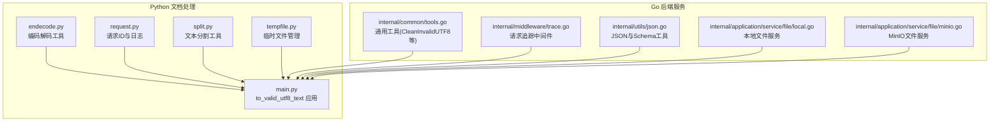
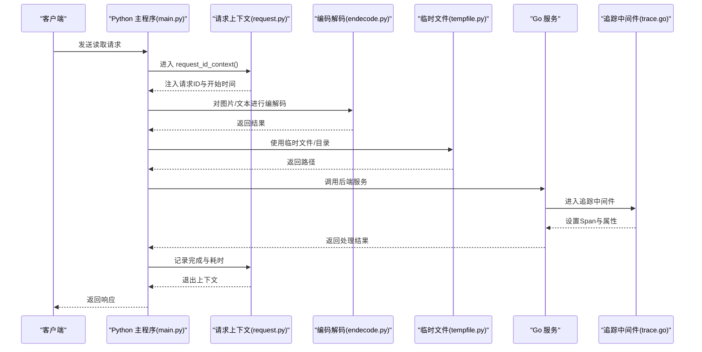
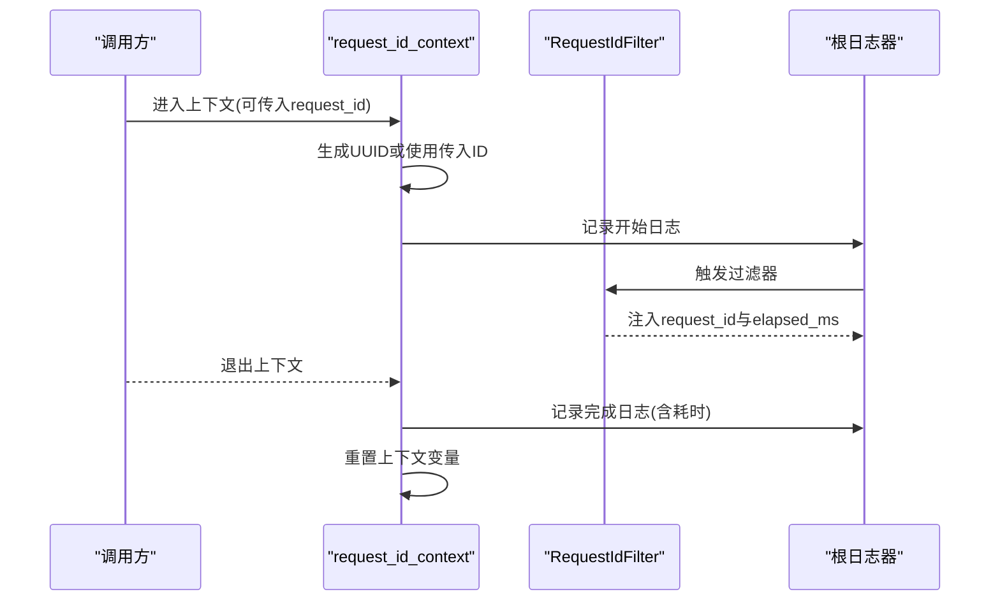
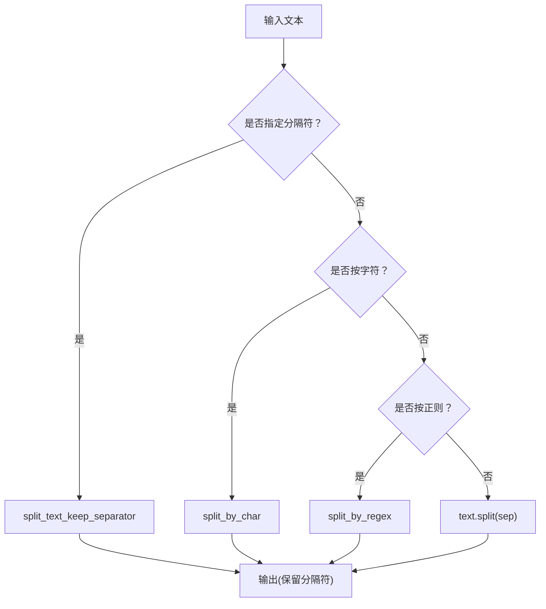
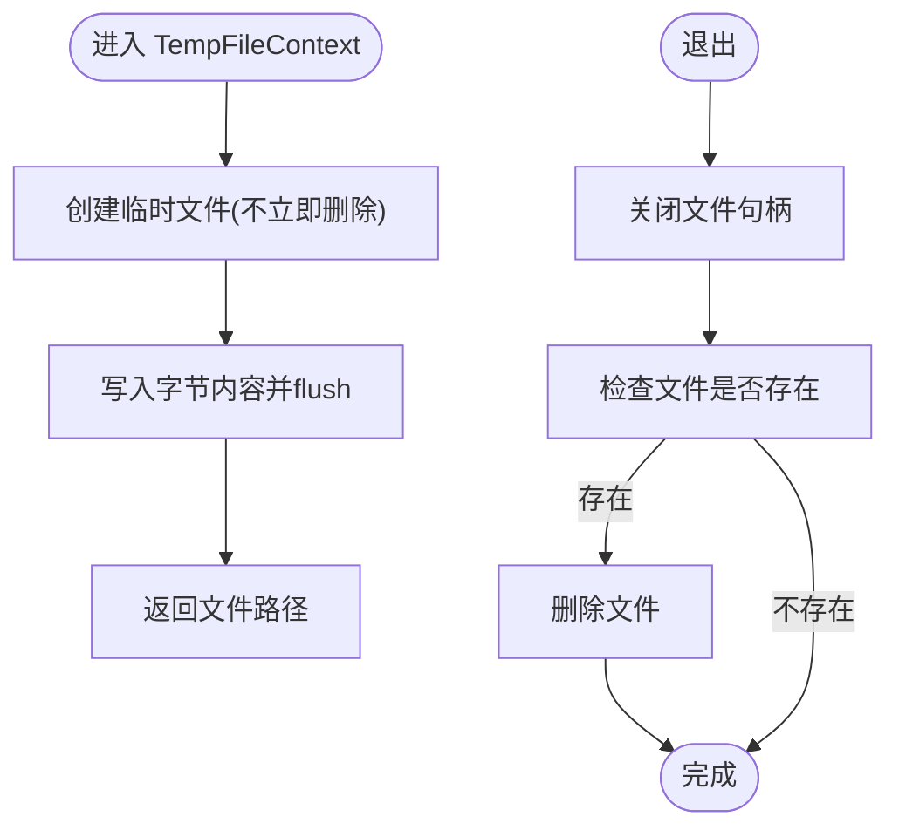
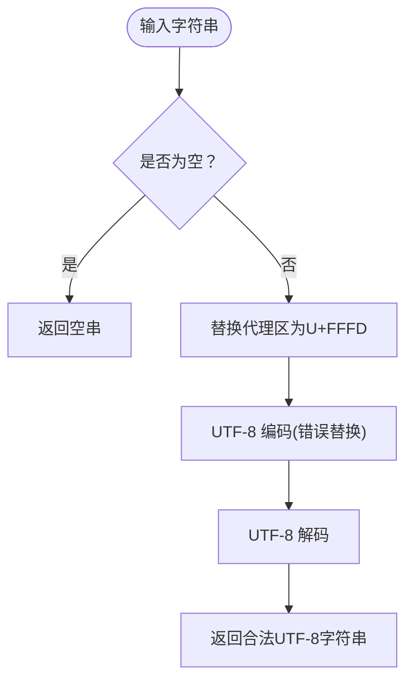
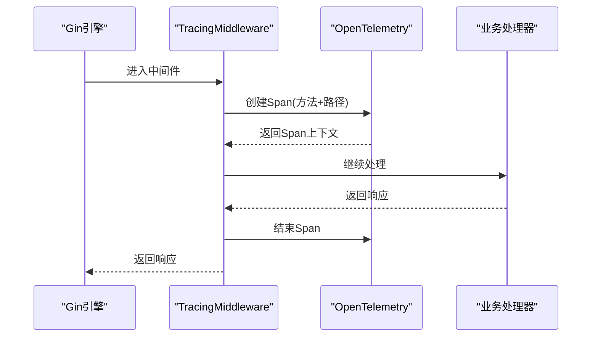
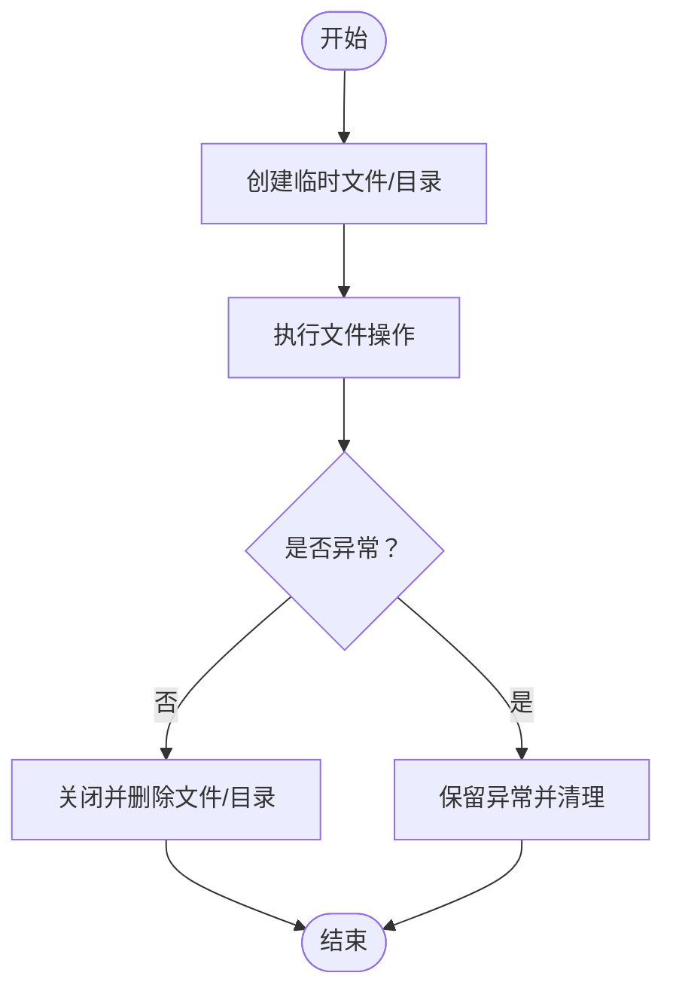
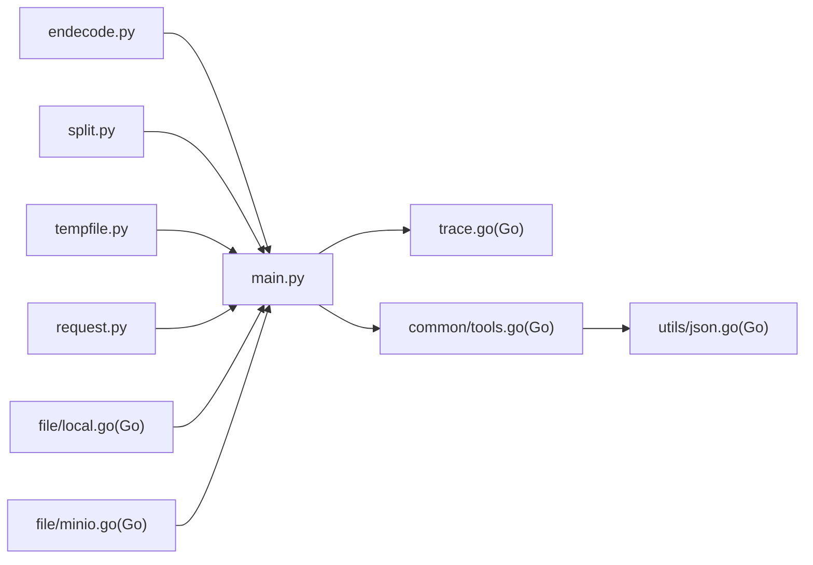

# 工具函数和辅助模块

<cite>
**本文引用的文件**
- [docreader/utils/endecode.py](file://docreader/utils/endecode.py)
- [docreader/utils/request.py](file://docreader/utils/request.py)
- [docreader/utils/split.py](file://docreader/utils/split.py)
- [docreader/utils/tempfile.py](file://docreader/utils/tempfile.py)
- [internal/common/tools.go](file://internal/common/tools.go)
- [docreader/main.py](file://docreader/main.py)
- [internal/middleware/trace.go](file://internal/middleware/trace.go)
- [internal/utils/json.go](file://internal/utils/json.go)
- [docreader/parser/docx_parser.py](file://docreader/parser/docx_parser.py)
- [internal/application/service/file/local.go](file://internal/application/service/file/local.go)
- [internal/application/service/file/minio.go](file://internal/application/service/file/minio.go)
</cite>

## 目录
1. [简介](#简介)
2. [项目结构](#项目结构)
3. [核心组件](#核心组件)
4. [架构总览](#架构总览)
5. [详细组件分析](#详细组件分析)
6. [依赖分析](#依赖分析)
7. [性能考虑](#性能考虑)
8. [故障排查指南](#故障排查指南)
9. [结论](#结论)
10. [附录](#附录)

## 简介
本文件聚焦 WiseDx 文档处理系统中的工具函数与辅助模块，系统性梳理以下能力：
- 编码解码处理：图像与文本的多格式编解码、字节与字符串互转、自动编码检测与回退
- 请求ID管理与日志追踪：基于上下文变量的请求ID注入、毫秒级时间戳格式化、请求耗时统计
- 文本分割辅助：按分隔符、正则、字符粒度的切分与匹配工具
- 临时文件管理：临时文件与目录的创建、使用与清理策略
- 关键函数实现与应用：to_valid_utf8_text 的设计动机与使用场景、CleanInvalidUTF8 的清洗逻辑
- 错误处理与异常恢复：统一的错误传播与日志记录
- 扩展与自定义：如何在现有框架上扩展工具函数与自定义工具

## 项目结构
这些工具分布在 Python 文档处理子系统与 Go 后端服务之间，形成“前端解析 + 后端服务”的协作模式：
- Python 层：编码解码、请求上下文、文本切分、临时文件管理
- Go 层：通用工具（字符串清洗、管道日志）、请求追踪中间件、文件存储服务



图表来源
- [docreader/utils/endecode.py](file://docreader/utils/endecode.py#L1-L205)
- [docreader/utils/request.py](file://docreader/utils/request.py#L1-L150)
- [docreader/utils/split.py](file://docreader/utils/split.py#L1-L81)
- [docreader/utils/tempfile.py](file://docreader/utils/tempfile.py#L1-L78)
- [docreader/main.py](file://docreader/main.py#L30-L229)
- [internal/common/tools.go](file://internal/common/tools.go#L1-L222)
- [internal/middleware/trace.go](file://internal/middleware/trace.go#L1-L48)
- [internal/utils/json.go](file://internal/utils/json.go#L1-L36)
- [internal/application/service/file/local.go](file://internal/application/service/file/local.go#L86-L123)
- [internal/application/service/file/minio.go](file://internal/application/service/file/minio.go#L91-L135)

章节来源
- [docreader/utils/endecode.py](file://docreader/utils/endecode.py#L1-L205)
- [docreader/utils/request.py](file://docreader/utils/request.py#L1-L150)
- [docreader/utils/split.py](file://docreader/utils/split.py#L1-L81)
- [docreader/utils/tempfile.py](file://docreader/utils/tempfile.py#L1-L78)
- [internal/common/tools.go](file://internal/common/tools.go#L1-L222)
- [docreader/main.py](file://docreader/main.py#L30-L229)
- [internal/middleware/trace.go](file://internal/middleware/trace.go#L1-L48)
- [internal/utils/json.go](file://internal/utils/json.go#L1-L36)
- [internal/application/service/file/local.go](file://internal/application/service/file/local.go#L86-L123)
- [internal/application/service/file/minio.go](file://internal/application/service/file/minio.go#L91-L135)

## 核心组件
- 编码解码工具（Python）
  - 图像编解码：支持路径、字节、PIL图像对象、NumPy数组输入，统一输出 base64 字符串；支持 base64 解码并带错误处理策略
  - 文本编解码：字符串到字节（UTF-8），以及多编码自动检测解码（优先尝试 UTF-8、GB 系列、Big5、ASCII、Latin-1），失败时以 Latin-1 替换回退并记录警告
- 请求ID与日志（Python）
  - 上下文变量保存请求ID与起始时间，提供上下文管理器生成/注入请求ID
  - 自定义日志过滤器与格式化器，输出毫秒级时间戳与请求耗时
  - 初始化函数统一为根日志器的所有处理器添加过滤器与格式化器
- 文本分割工具（Python）
  - 按分隔符切分并保留或丢弃分隔符
  - 按字符粒度切分
  - 正则表达式切分（捕获分隔符以保留）
  - 正则匹配工具
- 临时文件管理（Python）
  - 临时文件上下文：写入字节内容到临时文件，退出时自动删除
  - 临时目录上下文：创建临时目录，退出时清理
- Go 通用工具
  - 字符串清洗：移除非法 UTF-8 与空字符
  - JSON 解析增强：从 LLM 返回的代码块中提取 JSON
  - 管道日志：结构化日志构建与截断
- 请求追踪中间件（Go）
  - Gin 中间件：为每个请求创建 Span，采集响应体，设置基础属性
- 文件服务（Go）
  - 本地文件服务：打开、删除、保存字节数据
  - MinIO 文件服务：打开、删除、保存字节数据（对象名生成）

章节来源
- [docreader/utils/endecode.py](file://docreader/utils/endecode.py#L23-L197)
- [docreader/utils/request.py](file://docreader/utils/request.py#L17-L149)
- [docreader/utils/split.py](file://docreader/utils/split.py#L5-L81)
- [docreader/utils/tempfile.py](file://docreader/utils/tempfile.py#L8-L67)
- [internal/common/tools.go](file://internal/common/tools.go#L93-L222)
- [internal/middleware/trace.go](file://internal/middleware/trace.go#L28-L48)
- [internal/application/service/file/local.go](file://internal/application/service/file/local.go#L86-L123)
- [internal/application/service/file/minio.go](file://internal/application/service/file/minio.go#L91-L135)

## 架构总览
文档处理流程中，Python 层负责输入预处理（编码解码、文本切分、临时文件管理），Go 层负责业务处理与持久化（清洗、日志、追踪、文件存储）。to_valid_utf8_text 在协议转换阶段保证字符串合法。



图表来源
- [docreader/main.py](file://docreader/main.py#L135-L192)
- [docreader/utils/request.py](file://docreader/utils/request.py#L120-L149)
- [docreader/utils/endecode.py](file://docreader/utils/endecode.py#L23-L112)
- [docreader/utils/tempfile.py](file://docreader/utils/tempfile.py#L19-L41)
- [internal/middleware/trace.go](file://internal/middleware/trace.go#L28-L48)

## 详细组件分析

### 编码解码处理（图像与文本）
- 图像编码 decode_image
  - 支持输入类型：字符串（文件路径）、字节、PIL 图像对象、NumPy 数组
  - 输出：base64 字符串
  - 异常：不支持的类型抛出错误
- 图像解码 encode_image
  - 输入：base64 字符串
  - 输出：字节
  - 错误处理：errors 参数控制严格或忽略（默认严格），注册其他错误处理策略亦可
- 文本编解码
  - encode_bytes：UTF-8 编码
  - decode_bytes：按优先级尝试多种编码，失败回退 Latin-1 并记录警告
- 使用建议
  - 图像处理：优先使用 PIL 或 NumPy 输入以避免重复 IO
  - 文本处理：若来源未知编码，使用 decode_bytes 并自定义 encodings 列表

```mermaid
flowchart TD
Start(["进入 decode_image"]) --> Type{"输入类型？"}
Type --> |字符串(路径)| Read["读取文件字节"]
Type --> |字节| UseBytes["直接使用字节"]
Type --> |PIL| SaveBuf["保存到内存缓冲区"]
Type --> |NumPy| ToPIL["转为PIL图像"]
Read --> Encode["base64 编码"]
UseBytes --> Encode
SaveBuf --> Encode
ToPIL --> SaveBuf
Encode --> Out["返回 base64 字符串"]
Type --> |不支持| Err["抛出错误"]
```

图表来源
- [docreader/utils/endecode.py](file://docreader/utils/endecode.py#L23-L75)

章节来源
- [docreader/utils/endecode.py](file://docreader/utils/endecode.py#L23-L197)

### 请求ID管理与日志追踪
- 上下文变量
  - request_id_var：保存当前请求ID
  - _request_start_time_ctx：保存请求开始时间
- 日志格式化
  - MillisecondFormatter：将微秒格式化为毫秒
  - RequestIdFilter：为日志记录注入 request_id 与 elapsed_ms，并追加耗时到消息
- 上下文管理器
  - request_id_context：生成或接收请求ID，设置开始时间，记录开始与结束日志，最终重置上下文变量
- 初始化
  - init_logging_request_id：为根日志器的所有处理器添加过滤器与格式化器，若无处理器则新增标准输出处理器



图表来源
- [docreader/utils/request.py](file://docreader/utils/request.py#L120-L149)
- [docreader/utils/request.py](file://docreader/utils/request.py#L47-L82)
- [docreader/utils/request.py](file://docreader/utils/request.py#L84-L118)

章节来源
- [docreader/utils/request.py](file://docreader/utils/request.py#L17-L149)

### 文本分割辅助
- split_text_keep_separator：按分隔符切分并保留分隔符于每段开头（除首段）
- split_by_sep：工厂函数，返回按分隔符切分的函数（可选保留分隔符）
- split_by_char：返回按字符切分的函数
- split_by_regex：按正则表达式切分，捕获分隔符以保留
- match_by_regex：返回正则匹配函数



图表来源
- [docreader/utils/split.py](file://docreader/utils/split.py#L5-L81)

章节来源
- [docreader/utils/split.py](file://docreader/utils/split.py#L1-L81)

### 临时文件管理
- TempFileContext
  - 进入：创建命名临时文件，写入字节内容并刷新
  - 退出：关闭句柄并删除文件，记录日志
- TempDirContext
  - 进入：创建临时目录
  - 退出：清理目录，记录日志



图表来源
- [docreader/utils/tempfile.py](file://docreader/utils/tempfile.py#L19-L41)

章节来源
- [docreader/utils/tempfile.py](file://docreader/utils/tempfile.py#L8-L67)

### 关键函数：to_valid_utf8_text 与 CleanInvalidUTF8
- to_valid_utf8_text（Python）
  - 动机：protobuf 不接受代理区（surrogate）代码点，需替换为 U+FFFD 并重新以 UTF-8 编解码确保合法
  - 流程：非空校验 → 代理区替换 → UTF-8 编码再解码
  - 应用：在协议转换阶段对字符串字段进行清洗
- CleanInvalidUTF8（Go）
  - 动机：移除非法 UTF-8 字节与空字符，保证日志与数据一致性
  - 流程：遍历 UTF-8 字符，跳过非法字节与空字符，累积到新字符串



图表来源
- [docreader/main.py](file://docreader/main.py#L34-L44)
- [internal/common/tools.go](file://internal/common/tools.go#L119-L141)

章节来源
- [docreader/main.py](file://docreader/main.py#L34-L44)
- [internal/common/tools.go](file://internal/common/tools.go#L119-L141)

### 请求上下文管理与日志跟踪机制
- 请求ID注入
  - 通过 request_id_context 生成/注入请求ID，RequestIdFilter 在日志记录中附加 request_id 与 elapsed_ms
- 日志格式
  - 毫秒级时间戳（将微秒截断为三位）
  - 若未设置请求ID，使用占位符
- 追踪中间件（Go）
  - Gin 中间件：创建 Span，设置 HTTP 方法、URL、路径等属性，捕获响应体以便后续分析



图表来源
- [internal/middleware/trace.go](file://internal/middleware/trace.go#L28-L48)

章节来源
- [docreader/utils/request.py](file://docreader/utils/request.py#L27-L118)
- [internal/middleware/trace.go](file://internal/middleware/trace.go#L1-L48)

### 临时文件的创建、使用与清理策略
- 创建
  - 使用 NamedTemporaryFile 写入内容，delete=False 以便外部使用
- 使用
  - 返回文件路径供后续操作（如解析器读取）
- 清理
  - 退出上下文时关闭并删除文件；解析器还提供显式清理函数，删除临时图片文件并尝试清理空目录
- 文件服务
  - 本地文件服务：打开、删除、保存字节数据
  - MinIO 文件服务：打开、删除、保存字节数据（对象名生成）



图表来源
- [docreader/utils/tempfile.py](file://docreader/utils/tempfile.py#L19-L67)
- [docreader/parser/docx_parser.py](file://docreader/parser/docx_parser.py#L942-L980)
- [internal/application/service/file/local.go](file://internal/application/service/file/local.go#L86-L123)
- [internal/application/service/file/minio.go](file://internal/application/service/file/minio.go#L91-L135)

章节来源
- [docreader/utils/tempfile.py](file://docreader/utils/tempfile.py#L8-L67)
- [docreader/parser/docx_parser.py](file://docreader/parser/docx_parser.py#L942-L980)
- [internal/application/service/file/local.go](file://internal/application/service/file/local.go#L86-L123)
- [internal/application/service/file/minio.go](file://internal/application/service/file/minio.go#L91-L135)

### 工具函数的使用示例与最佳实践
- 编码解码
  - 图像：优先传入 PIL/NumPy 以减少 IO；解码时根据场景选择 errors="ignore" 以容忍损坏数据
  - 文本：若不确定编码，使用 decode_bytes 并提供 encodings 列表；必要时结合日志观察回退行为
- 请求ID与日志
  - 在每个请求入口使用 request_id_context 包裹，确保日志可追踪
  - 使用 init_logging_request_id 初始化全局日志格式
- 文本分割
  - 按段落/标题优先使用 split_by_sep；需要保留分隔符时启用 keep_sep
  - 正则切分适合复杂边界，但注意性能与可维护性
- 临时文件
  - 仅在必要时使用，尽量缩短生命周期；完成后及时清理
  - 对于图片等中间产物，解析器会进行批量清理
- 字符串清洗
  - Protobuf 输出前使用 to_valid_utf8_text
  - 日志与存储前使用 CleanInvalidUTF8

章节来源
- [docreader/utils/endecode.py](file://docreader/utils/endecode.py#L23-L197)
- [docreader/utils/request.py](file://docreader/utils/request.py#L120-L149)
- [docreader/utils/split.py](file://docreader/utils/split.py#L5-L81)
- [docreader/utils/tempfile.py](file://docreader/utils/tempfile.py#L8-L67)
- [docreader/main.py](file://docreader/main.py#L34-L44)
- [internal/common/tools.go](file://internal/common/tools.go#L119-L141)

### 错误处理与异常恢复机制
- 编码解码
  - encode_image：errors="ignore" 时返回空字节；否则抛出 binascii.Error
  - decode_bytes：逐个尝试编码，失败回退 Latin-1 并记录警告
- 请求ID
  - request_id_context：无论是否异常均记录完成日志并重置上下文变量
- 临时文件
  - TempFileContext/TempDirContext：退出时清理，异常不吞掉；解析器提供额外清理逻辑
- 文件服务
  - 打开/删除/保存失败时记录错误并返回包装后的错误

章节来源
- [docreader/utils/endecode.py](file://docreader/utils/endecode.py#L78-L112)
- [docreader/utils/endecode.py](file://docreader/utils/endecode.py#L133-L197)
- [docreader/utils/request.py](file://docreader/utils/request.py#L120-L149)
- [docreader/utils/tempfile.py](file://docreader/utils/tempfile.py#L31-L41)
- [docreader/parser/docx_parser.py](file://docreader/parser/docx_parser.py#L942-L980)
- [internal/application/service/file/local.go](file://internal/application/service/file/local.go#L86-L123)
- [internal/application/service/file/minio.go](file://internal/application/service/file/minio.go#L91-L135)

### 工具模块的扩展方法与自定义工具开发指南
- 扩展 Python 工具
  - 新增函数：遵循现有参数命名与返回值约定，提供清晰文档字符串与示例
  - 错误处理：明确 errors 参数策略或异常类型
  - 日志：对关键路径记录 debug/warning/info
- 扩展 Go 工具
  - 保持无副作用与幂等性；对字符串/JSON/日志等场景提供统一接口
  - 与现有日志与追踪集成，便于观测
- 自定义工具开发（以 Go 为例）
  - 实现 types.Tool 接口（名称、描述、参数 Schema）
  - 使用 ToolExecutor 获取上下文数据
  - 通过 ToolRegistry 注册与检索工具
  - JSON Schema 生成：使用 internal/utils/json.go 的 GenerateSchema 泛型生成 Schema

```mermaid
classDiagram
class Tool {
+Name() string
+Description() string
+Parameters() json.RawMessage
}
class ToolExecutor {
+GetContext() map[string]interface{}
}
class ToolRegistry {
+RegisterTool(tool)
+GetTool(name) Tool
+ListTools() []string
+GetFunctionDefinitions() []FunctionDefinition
}
Tool <|-- ToolExecutor
ToolRegistry --> Tool : "管理"
```

图表来源
- [internal/agent/tools/tool.go](file://internal/agent/tools/tool.go#L10-L47)
- [internal/agent/tools/registry.go](file://internal/agent/tools/registry.go#L12-L58)
- [internal/utils/json.go](file://internal/utils/json.go#L19-L35)

章节来源
- [internal/agent/tools/tool.go](file://internal/agent/tools/tool.go#L1-L63)
- [internal/agent/tools/registry.go](file://internal/agent/tools/registry.go#L1-L58)
- [internal/utils/json.go](file://internal/utils/json.go#L1-L36)

## 依赖分析
- Python 工具模块内部耦合度低，职责清晰，便于独立测试与复用
- 与 Go 层交互集中在协议转换与日志/追踪环节
- 文件服务与存储抽象分离，便于替换实现



图表来源
- [docreader/utils/endecode.py](file://docreader/utils/endecode.py#L1-L205)
- [docreader/utils/split.py](file://docreader/utils/split.py#L1-L81)
- [docreader/utils/tempfile.py](file://docreader/utils/tempfile.py#L1-L78)
- [docreader/utils/request.py](file://docreader/utils/request.py#L1-L150)
- [docreader/main.py](file://docreader/main.py#L30-L229)
- [internal/middleware/trace.go](file://internal/middleware/trace.go#L1-L48)
- [internal/common/tools.go](file://internal/common/tools.go#L1-L222)
- [internal/utils/json.go](file://internal/utils/json.go#L1-L36)
- [internal/application/service/file/local.go](file://internal/application/service/file/local.go#L86-L123)
- [internal/application/service/file/minio.go](file://internal/application/service/file/minio.go#L91-L135)

章节来源
- [docreader/main.py](file://docreader/main.py#L30-L229)
- [internal/common/tools.go](file://internal/common/tools.go#L1-L222)

## 性能考虑
- 编码解码
  - 图像：避免重复 IO，优先使用内存对象；base64 编解码成本与尺寸线性相关
  - 文本：多编码尝试按顺序进行，encodings 列表越短越好
- 文本分割
  - 正则切分比简单 split 更昂贵，仅在必要时使用
  - 保留分隔符会增加结果数量，注意内存占用
- 临时文件
  - 控制临时文件数量与大小，尽快清理
- 日志
  - 毫秒级格式化与请求耗时计算开销极小
- Go 管道日志
  - 字符串截断避免超长字段影响日志体积

## 故障排查指南
- 图像解码失败
  - 检查 base64 字符串是否被包裹在 data URI 或其他文本中；使用 errors="ignore" 以容忍错误
- 文本乱码
  - 使用 decode_bytes 并提供正确 encodings 列表；关注回退到 Latin-1 的警告
- 请求ID缺失
  - 确认已调用 init_logging_request_id；检查 request_id_context 是否正确包裹请求处理
- 临时文件残留
  - 确保使用上下文管理器；解析器会进行二次清理，但仍建议手动清理
- 文件操作失败
  - 查看本地/MinIO 文件服务的日志与错误返回，确认路径与权限

章节来源
- [docreader/utils/endecode.py](file://docreader/utils/endecode.py#L78-L112)
- [docreader/utils/endecode.py](file://docreader/utils/endecode.py#L133-L197)
- [docreader/utils/request.py](file://docreader/utils/request.py#L47-L82)
- [docreader/utils/request.py](file://docreader/utils/request.py#L120-L149)
- [docreader/utils/tempfile.py](file://docreader/utils/tempfile.py#L31-L41)
- [docreader/parser/docx_parser.py](file://docreader/parser/docx_parser.py#L942-L980)
- [internal/application/service/file/local.go](file://internal/application/service/file/local.go#L86-L123)
- [internal/application/service/file/minio.go](file://internal/application/service/file/minio.go#L91-L135)

## 结论
本文件系统性梳理了 WiseDx 文档处理系统中的工具函数与辅助模块，覆盖编码解码、请求ID与日志、文本分割、临时文件管理、关键清洗函数与错误处理。通过模块化设计与清晰的上下文管理，这些工具为文档解析提供了稳定、可观测且易于扩展的基础能力。

## 附录
- to_valid_utf8_text 的应用场景
  - 协议转换：确保字符串字段符合 protobuf 要求
  - 日志输出：避免非法字符导致的序列化失败
- CleanInvalidUTF8 的应用场景
  - 数据清洗：移除非法 UTF-8 与空字符，提升日志与存储质量
- JSON Schema 生成
  - 使用 internal/utils/json.go 的泛型函数为类型生成 Schema，便于参数校验与文档生成

章节来源
- [docreader/main.py](file://docreader/main.py#L34-L44)
- [internal/common/tools.go](file://internal/common/tools.go#L119-L141)
- [internal/utils/json.go](file://internal/utils/json.go#L19-L35)