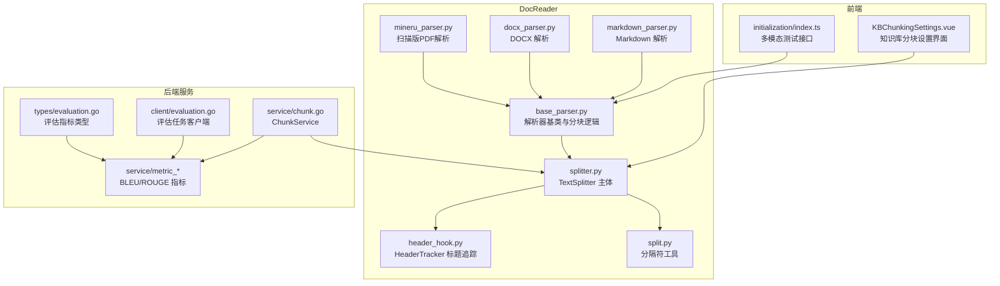
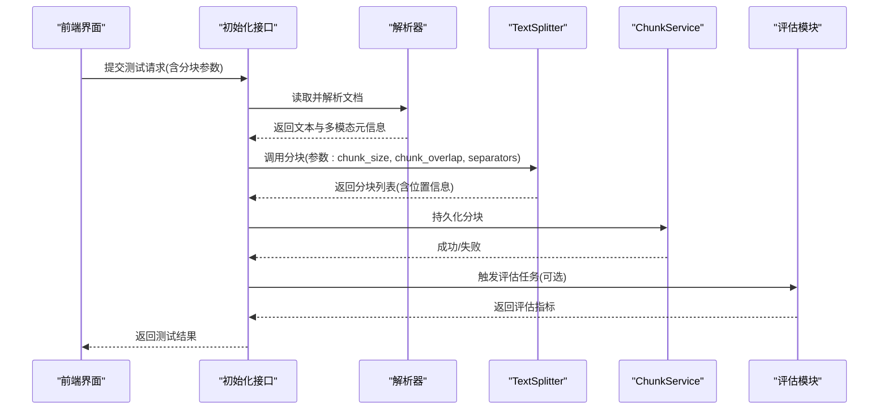
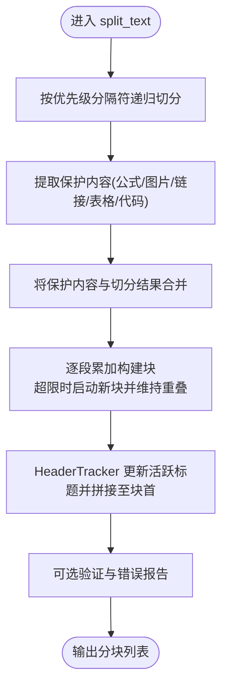
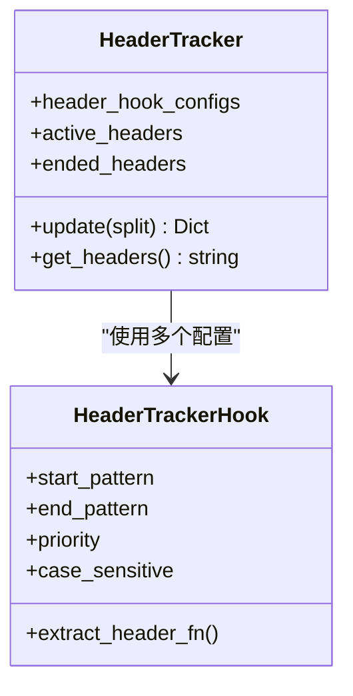
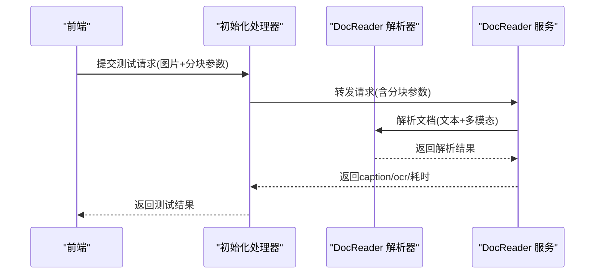
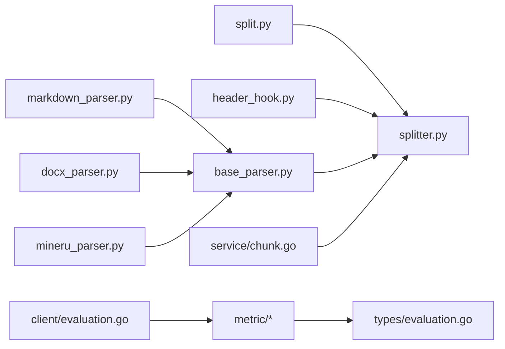

# 文本分割算法

<cite>
**本文引用的文件**
- [docreader/splitter/splitter.py](file://docreader/splitter/splitter.py)
- [docreader/splitter/header_hook.py](file://docreader/splitter/header_hook.py)
- [docreader/utils/split.py](file://docreader/utils/split.py)
- [frontend/src/views/knowledge/settings/KBChunkingSettings.vue](file://frontend/src/views/knowledge/settings/KBChunkingSettings.vue)
- [client/chunk.go](file://client/chunk.go)
- [internal/application/service/chunk.go](file://internal/application/service/chunk.go)
- [internal/application/service/metric_hook.go](file://internal/application/service/metric_hook.go)
- [internal/application/service/metric/bleu.go](file://internal/application/service/metric/bleu.go)
- [internal/application/service/metric/rouge.go](file://internal/application/service/metric/rouge.go)
- [internal/types/evaluation.go](file://internal/types/evaluation.go)
- [client/evaluation.go](file://client/evaluation.go)
- [docreader/parser/base_parser.py](file://docreader/parser/base_parser.py)
- [docreader/parser/mineru_parser.py](file://docreader/parser/mineru_parser.py)
- [docreader/parser/docx_parser.py](file://docreader/parser/docx_parser.py)
- [docreader/parser/markdown_parser.py](file://docreader/parser/markdown_parser.py)
- [internal/handler/initialization.go](file://internal/handler/initialization.go)
- [frontend/src/api/initialization/index.ts](file://frontend/src/api/initialization/index.ts)
- [docreader/testdata/test.md](file://docreader/testdata/test.md)
- [docreader/testdata/test.txt](file://docreader/testdata/test.txt)
</cite>

## 目录
1. [简介](#简介)
2. [项目结构](#项目结构)
3. [核心组件](#核心组件)
4. [架构总览](#架构总览)
5. [详细组件分析](#详细组件分析)
6. [依赖关系分析](#依赖关系分析)
7. [性能考量](#性能考量)
8. [故障排查指南](#故障排查指南)
9. [结论](#结论)
10. [附录](#附录)

## 简介
本文件系统性梳理 WiseDx 中的文本分割算法与实现，重点覆盖以下方面：
- 基于字符数的固定分割策略
- 基于语义与结构的智能分割策略
- 基于标题层级的结构化分割与 HeaderHook 机制
- 分割参数配置（chunk_size、chunk_overlap、separators 等）及其对分割效果的影响
- 多模态文档中文本与图像/表格/公式等内容的协同处理
- 分割质量评估指标与优化策略
- 不同文档类型的分割最佳实践与性能对比分析

## 项目结构
WiseDx 的文本分割能力由 Python DocReader 子系统提供，前端提供可视化配置入口，后端服务负责持久化与检索增强。

图表来源
- [frontend/src/views/knowledge/settings/KBChunkingSettings.vue](file://frontend/src/views/knowledge/settings/KBChunkingSettings.vue#L1-L232)
- [frontend/src/api/initialization/index.ts](file://frontend/src/api/initialization/index.ts#L316-L356)
- [docreader/splitter/splitter.py](file://docreader/splitter/splitter.py#L1-L585)
- [docreader/splitter/header_hook.py](file://docreader/splitter/header_hook.py#L1-L113)
- [docreader/utils/split.py](file://docreader/utils/split.py#L1-L81)
- [docreader/parser/base_parser.py](file://docreader/parser/base_parser.py#L588-L675)
- [docreader/parser/markdown_parser.py](file://docreader/parser/markdown_parser.py#L413-L442)
- [docreader/parser/docx_parser.py](file://docreader/parser/docx_parser.py#L245-L1327)
- [docreader/parser/mineru_parser.py](file://docreader/parser/mineru_parser.py#L88-L113)
- [internal/application/service/chunk.go](file://internal/application/service/chunk.go#L1-L441)
- [internal/application/service/metric_hook.go](file://internal/application/service/metric_hook.go#L31-L71)
- [internal/application/service/metric/bleu.go](file://internal/application/service/metric/bleu.go#L1-L49)
- [internal/application/service/metric/rouge.go](file://internal/application/service/metric/rouge.go#L1-L13)
- [internal/types/evaluation.go](file://internal/types/evaluation.go#L33-L68)
- [client/evaluation.go](file://client/evaluation.go#L1-L114)

章节来源
- [frontend/src/views/knowledge/settings/KBChunkingSettings.vue](file://frontend/src/views/knowledge/settings/KBChunkingSettings.vue#L1-L232)
- [frontend/src/api/initialization/index.ts](file://frontend/src/api/initialization/index.ts#L316-L356)
- [docreader/splitter/splitter.py](file://docreader/splitter/splitter.py#L1-L585)
- [docreader/splitter/header_hook.py](file://docreader/splitter/header_hook.py#L1-L113)
- [docreader/utils/split.py](file://docreader/utils/split.py#L1-L81)
- [docreader/parser/base_parser.py](file://docreader/parser/base_parser.py#L588-L675)
- [docreader/parser/markdown_parser.py](file://docreader/parser/markdown_parser.py#L413-L442)
- [docreader/parser/docx_parser.py](file://docreader/parser/docx_parser.py#L245-L1327)
- [docreader/parser/mineru_parser.py](file://docreader/parser/mineru_parser.py#L88-L113)
- [internal/application/service/chunk.go](file://internal/application/service/chunk.go#L1-L441)
- [internal/application/service/metric_hook.go](file://internal/application/service/metric_hook.go#L31-L71)
- [internal/application/service/metric/bleu.go](file://internal/application/service/metric/bleu.go#L1-L49)
- [internal/application/service/metric/rouge.go](file://internal/application/service/metric/rouge.go#L1-L13)
- [internal/types/evaluation.go](file://internal/types/evaluation.go#L33-L68)
- [client/evaluation.go](file://client/evaluation.go#L1-L114)

## 核心组件
- TextSplitter：主分割器，支持可配置的 chunk_size、chunk_overlap、separators、protected_regex，以及 HeaderTracker 的上下文标题注入。
- HeaderTracker：标题追踪器，维护活跃标题集合，按优先级拼接标题上下文，辅助结构化分割。
- 分隔符工具：提供按分隔符、按字符、按正则等多种切分函数，支撑递归切分与回退策略。
- 解析器基类与具体解析器：统一的分块流程与多模态（图片、表格、公式）内容抽取与序列化。
- 评估指标：BLEU、ROUGE 等生成质量指标，用于评估不同分块策略对下游检索/生成的影响。

章节来源
- [docreader/splitter/splitter.py](file://docreader/splitter/splitter.py#L31-L115)
- [docreader/splitter/header_hook.py](file://docreader/splitter/header_hook.py#L67-L113)
- [docreader/utils/split.py](file://docreader/utils/split.py#L5-L81)
- [docreader/parser/base_parser.py](file://docreader/parser/base_parser.py#L588-L675)
- [internal/application/service/metric/bleu.go](file://internal/application/service/metric/bleu.go#L27-L49)
- [internal/application/service/metric/rouge.go](file://internal/application/service/metric/rouge.go#L9-L13)

## 架构总览
文本从解析器产出纯文本与多模态元信息，进入 TextSplitter 进行结构化分块；分块结果通过 ChunkService 持久化，评估模块用于量化不同分块策略的效果。

图表来源
- [frontend/src/api/initialization/index.ts](file://frontend/src/api/initialization/index.ts#L316-L356)
- [internal/handler/initialization.go](file://internal/handler/initialization.go#L1870-L1924)
- [docreader/parser/base_parser.py](file://docreader/parser/base_parser.py#L170-L210)
- [docreader/splitter/splitter.py](file://docreader/splitter/splitter.py#L116-L144)
- [internal/application/service/chunk.go](file://internal/application/service/chunk.go#L57-L76)
- [client/evaluation.go](file://client/evaluation.go#L66-L113)

## 详细组件分析

### TextSplitter：固定分割、智能合并与标题上下文
- 固定分割（基于字符数）
  - 通过 separators 优先级尝试切分，若仍超限则递归切分，直至每段长度不超过 chunk_size。
  - 支持按字符级切分作为最终回退，保证可切分性。
- 智能合并（保护内容与重叠）
  - 保护正则：对公式、图片、链接、表格、代码块等进行保护，避免被切分破坏结构。
  - 合并阶段：按长度累加，超过 chunk_size 时启动新块；通过弹出前序元素控制 overlap，确保相邻块有重叠。
  - 标题上下文：HeaderTracker 在合并过程中动态更新活跃标题，必要时将标题拼接到块首，提升检索/生成上下文质量。
- 输出格式：返回 (start, end, text) 三元组，便于后续去重、恢复与持久化。

图表来源
- [docreader/splitter/splitter.py](file://docreader/splitter/splitter.py#L116-L144)
- [docreader/splitter/splitter.py](file://docreader/splitter/splitter.py#L146-L181)
- [docreader/splitter/splitter.py](file://docreader/splitter/splitter.py#L183-L297)
- [docreader/splitter/splitter.py](file://docreader/splitter/splitter.py#L299-L407)

章节来源
- [docreader/splitter/splitter.py](file://docreader/splitter/splitter.py#L31-L115)
- [docreader/splitter/splitter.py](file://docreader/splitter/splitter.py#L116-L297)
- [docreader/utils/split.py](file://docreader/utils/split.py#L27-L49)

### HeaderTracker：标题识别与上下文注入
- 配置模型：支持 start_pattern/end_pattern、提取函数、优先级、大小写敏感等。
- 状态管理：维护 active_headers（活跃标题）与 ended_headers（已结束标题），避免重复注入。
- 工作流程：遍历配置，检测当前切分片段中的标题开始/结束，更新状态；最终按优先级拼接标题字符串，供 TextSplitter 注入块首。

图表来源
- [docreader/splitter/header_hook.py](file://docreader/splitter/header_hook.py#L7-L113)

章节来源
- [docreader/splitter/header_hook.py](file://docreader/splitter/header_hook.py#L67-L113)

### 分隔符工具：切分策略与回退
- split_by_sep：按分隔符切分并可选择保留分隔符。
- split_by_char：按字符切分，作为极端情况下的回退。
- split_by_regex：按正则切分并保留分隔符，便于结构化内容识别。

章节来源
- [docreader/utils/split.py](file://docreader/utils/split.py#L5-L81)

### 解析器与多模态：文本与图像/表格/公式的协同
- 解析器基类：统一的分块流程，支持 chunk_size、chunk_overlap、多模态开关、并发控制等参数。
- 具体解析器：
  - Markdown：标准化表格、提取图片并上传，形成结构化文本。
  - DOCX：抽取段落文本与嵌入图片，支持多进程与缓存。
  - 扫描版PDF：调用外部服务解析，启用表格/公式识别。
- 多模态测试：前端提交图片与分块参数，后端调用 DocReader 进行 OCR/Caption 测试，返回处理时间与结果。

图表来源
- [frontend/src/api/initialization/index.ts](file://frontend/src/api/initialization/index.ts#L316-L356)
- [internal/handler/initialization.go](file://internal/handler/initialization.go#L1870-L1924)
- [docreader/parser/base_parser.py](file://docreader/parser/base_parser.py#L170-L210)
- [docreader/parser/mineru_parser.py](file://docreader/parser/mineru_parser.py#L88-L113)
- [docreader/parser/docx_parser.py](file://docreader/parser/docx_parser.py#L245-L1327)
- [docreader/parser/markdown_parser.py](file://docreader/parser/markdown_parser.py#L413-L442)

章节来源
- [docreader/parser/base_parser.py](file://docreader/parser/base_parser.py#L170-L210)
- [docreader/parser/mineru_parser.py](file://docreader/parser/mineru_parser.py#L88-L113)
- [docreader/parser/docx_parser.py](file://docreader/parser/docx_parser.py#L245-L1327)
- [docreader/parser/markdown_parser.py](file://docreader/parser/markdown_parser.py#L413-L442)
- [frontend/src/api/initialization/index.ts](file://frontend/src/api/initialization/index.ts#L316-L356)
- [internal/handler/initialization.go](file://internal/handler/initialization.go#L1870-L1924)

### 分割参数配置与影响
- chunk_size：决定单块最大长度。越大越利于语义完整性，但会增加检索/生成开销；过小会导致过度切分，破坏上下文。
- chunk_overlap：决定相邻块重叠长度。越大越利于上下文连续性，但会增加存储与向量化成本。
- separators：分隔符优先级决定切分粒度。优先使用更“语义级”的分隔符（如段落、句子结尾）可提升语义完整性。
- protected_regex：保护公式、表格、图片、链接、代码块等结构，避免破坏其完整性。
- HeaderTracker：通过标题上下文注入，增强检索与问答的结构性。

章节来源
- [docreader/splitter/splitter.py](file://docreader/splitter/splitter.py#L41-L84)
- [frontend/src/views/knowledge/settings/KBChunkingSettings.vue](file://frontend/src/views/knowledge/settings/KBChunkingSettings.vue#L8-L72)
- [docreader/splitter/header_hook.py](file://docreader/splitter/header_hook.py#L67-L113)

### 分割质量评估与优化策略
- 评估指标：BLEU、ROUGE 等生成质量指标，用于衡量不同分块策略对问答/摘要等生成任务的影响。
- 指标计算：统一的 MetricList 与 MetricInput 结构，支持批量计算与平均值统计。
- 优化策略：
  - 基于检索指标（Precision/Recall/MRR/Map）与生成指标（BLEU/ROUGE）联合评估，选择综合最优的 chunk_size 与 chunk_overlap。
  - 对表格/代码/公式等结构化内容，适当增大 chunk_size 或减少重叠，避免跨结构切分。
  - 针对长文档采用较大的 chunk_size 与较小的重叠，短文档采用较小的 chunk_size 与较大的重叠。

章节来源
- [internal/application/service/metric_hook.go](file://internal/application/service/metric_hook.go#L31-L71)
- [internal/application/service/metric/bleu.go](file://internal/application/service/metric/bleu.go#L27-L49)
- [internal/application/service/metric/rouge.go](file://internal/application/service/metric/rouge.go#L9-L13)
- [internal/types/evaluation.go](file://internal/types/evaluation.go#L50-L68)
- [client/evaluation.go](file://client/evaluation.go#L66-L113)

### 不同文档类型的分割最佳实践
- Markdown
  - 优势：结构清晰，适合按段落/标题切分；表格、图片、代码块均有明确边界。
  - 建议：优先使用段落换行与标题作为分隔符；开启保护正则以保留表格/代码块；适当注入标题上下文。
- DOCX
  - 优势：段落结构明确，图片嵌入在段内；支持多进程解析。
  - 建议：按段落切分为主，结合标题层级；对图片较多的文档，适当增大 chunk_size。
- 扫描版PDF
  - 优势：通过 OCR/Caption 可获得文本与视觉描述。
  - 建议：启用表格/公式识别；根据页面内容密度调整 chunk_size；对图片密集区域单独处理。
- 纯文本
  - 建议：优先使用中文句号/问号/感叹号等语义分隔符；根据语义完整性需求调整重叠。

章节来源
- [docreader/parser/markdown_parser.py](file://docreader/parser/markdown_parser.py#L413-L442)
- [docreader/parser/docx_parser.py](file://docreader/parser/docx_parser.py#L245-L1327)
- [docreader/parser/mineru_parser.py](file://docreader/parser/mineru_parser.py#L88-L113)
- [docreader/testdata/test.md](file://docreader/testdata/test.md#L1-L37)
- [docreader/testdata/test.txt](file://docreader/testdata/test.txt#L1-L16)

## 依赖关系分析
- 组件耦合
  - TextSplitter 依赖 HeaderTracker 与分隔符工具，内部通过 protected_regex 与 separators 实现结构化与语义化切分。
  - 解析器基类统一调度分块流程，具体解析器负责内容抽取与序列化。
  - 评估模块独立于分块逻辑，通过指标计算反馈优化方向。
- 外部依赖
  - 前端通过接口提交测试请求，后端转发至 DocReader 服务，形成闭环。

图表来源
- [docreader/utils/split.py](file://docreader/utils/split.py#L1-L81)
- [docreader/splitter/splitter.py](file://docreader/splitter/splitter.py#L1-L585)
- [docreader/splitter/header_hook.py](file://docreader/splitter/header_hook.py#L1-L113)
- [docreader/parser/base_parser.py](file://docreader/parser/base_parser.py#L588-L675)
- [docreader/parser/markdown_parser.py](file://docreader/parser/markdown_parser.py#L413-L442)
- [docreader/parser/docx_parser.py](file://docreader/parser/docx_parser.py#L245-L1327)
- [docreader/parser/mineru_parser.py](file://docreader/parser/mineru_parser.py#L88-L113)
- [internal/application/service/chunk.go](file://internal/application/service/chunk.go#L1-L441)
- [internal/application/service/metric_hook.go](file://internal/application/service/metric_hook.go#L31-L71)
- [internal/types/evaluation.go](file://internal/types/evaluation.go#L33-L68)
- [client/evaluation.go](file://client/evaluation.go#L1-L114)

## 性能考量
- 切分复杂度
  - 递归切分与保护内容过滤的时间复杂度与输入长度线性相关，建议合理设置 separators 与 chunk_size，避免过深递归。
- 重叠处理
  - 重叠越大，存储与向量化成本越高；可通过评估指标权衡重叠收益与成本。
- 多模态开销
  - OCR/Caption 会显著增加处理时间，建议在测试阶段启用，生产环境按需开启。
- 并发与缓存
  - DOCX 解析支持多进程与图片缓存，可有效降低重复处理成本。

## 故障排查指南
- 分割异常
  - 检查 chunk_overlap 是否大于 chunk_size，若异常将触发参数校验错误。
  - 使用 _validate_chunks 与 restore_text 进行一致性验证与差异定位。
- 标题上下文问题
  - 确认 HeaderTracker 的 start_pattern/end_pattern 是否正确匹配目标标题；检查优先级与大小写敏感配置。
- 多模态测试
  - 若测试失败，检查 VLM 模型配置、网络连通性与存储配置；关注处理耗时与返回内容。

章节来源
- [docreader/splitter/splitter.py](file://docreader/splitter/splitter.py#L98-L102)
- [docreader/splitter/splitter.py](file://docreader/splitter/splitter.py#L409-L555)
- [docreader/splitter/header_hook.py](file://docreader/splitter/header_hook.py#L23-L38)
- [frontend/src/api/initialization/index.ts](file://frontend/src/api/initialization/index.ts#L316-L356)
- [internal/handler/initialization.go](file://internal/handler/initialization.go#L1870-L1924)

## 结论
WiseDx 的文本分割算法以 TextSplitter 为核心，结合 HeaderTracker 的标题上下文注入与保护正则，实现了兼顾结构完整性与语义连贯性的分块策略。通过前端可视化配置与后端评估体系，用户可以针对不同文档类型与业务目标，迭代优化 chunk_size、chunk_overlap 与分隔符策略，从而在检索/生成质量与性能之间取得平衡。

## 附录
- 分割参数可视化配置入口：KBChunkingSettings.vue
- 多模态测试接口：initialization/index.ts
- 分块持久化与查询：client/chunk.go、service/chunk.go
- 评估任务与指标：client/evaluation.go、types/evaluation.go、metric/*、metric_hook.go