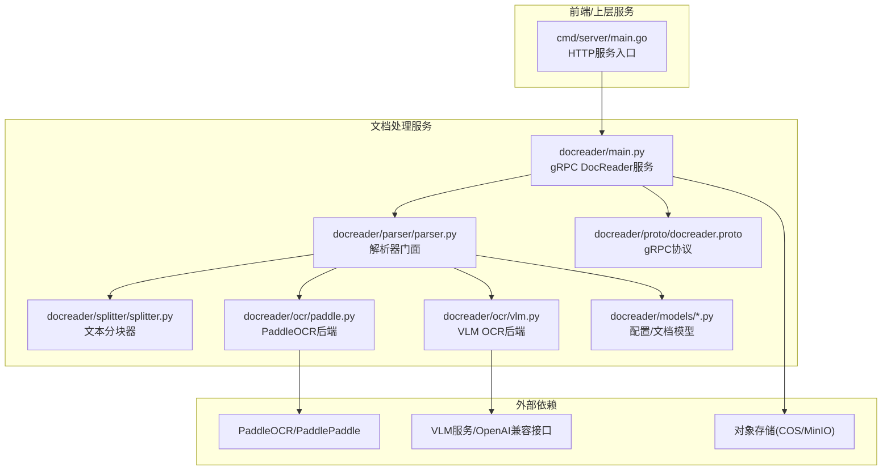
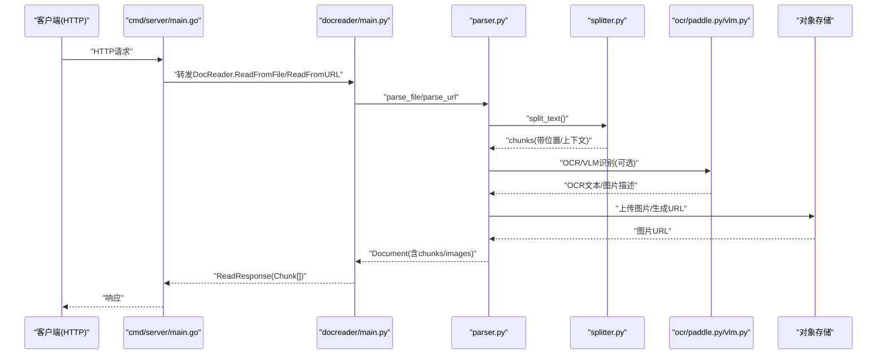
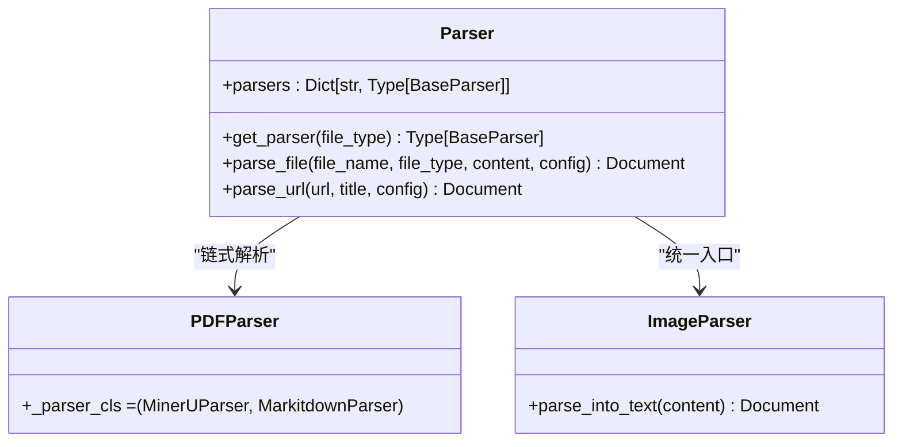
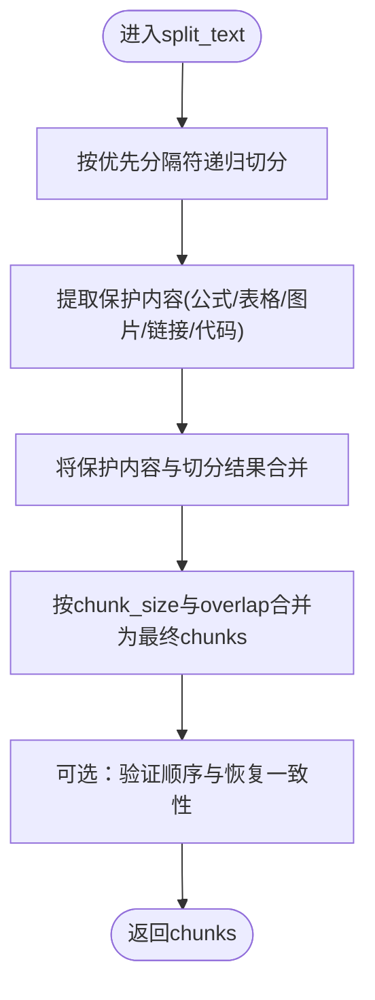
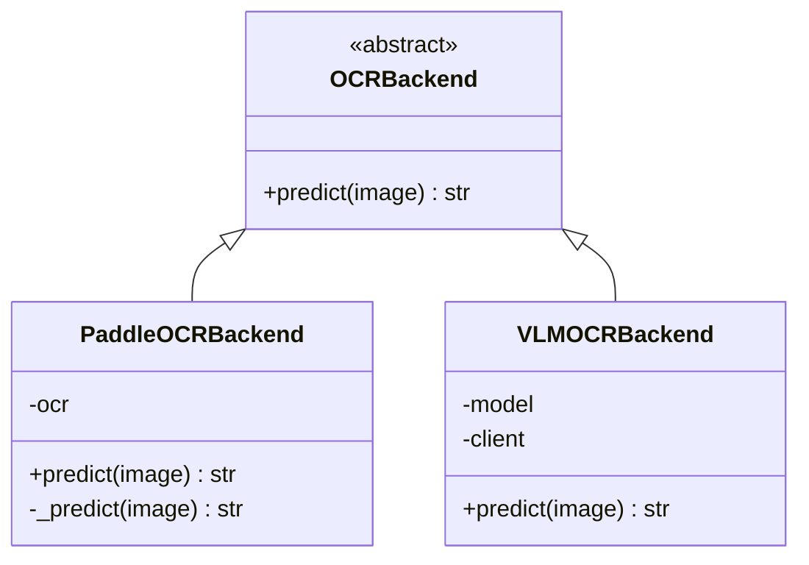
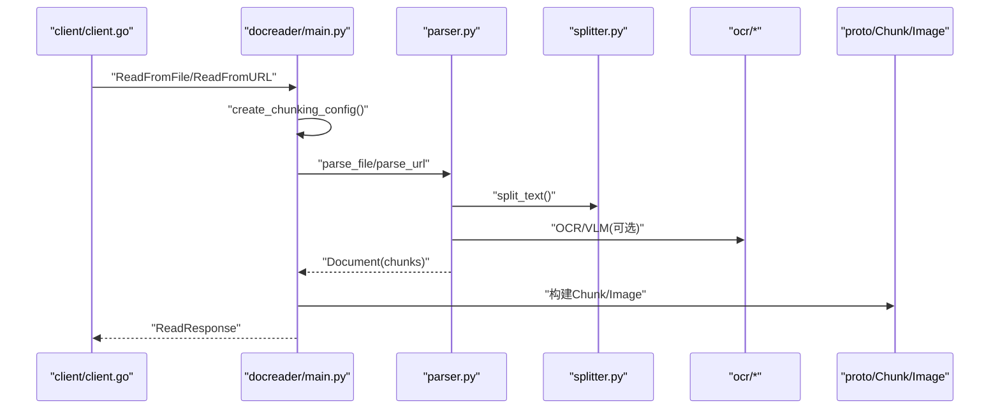
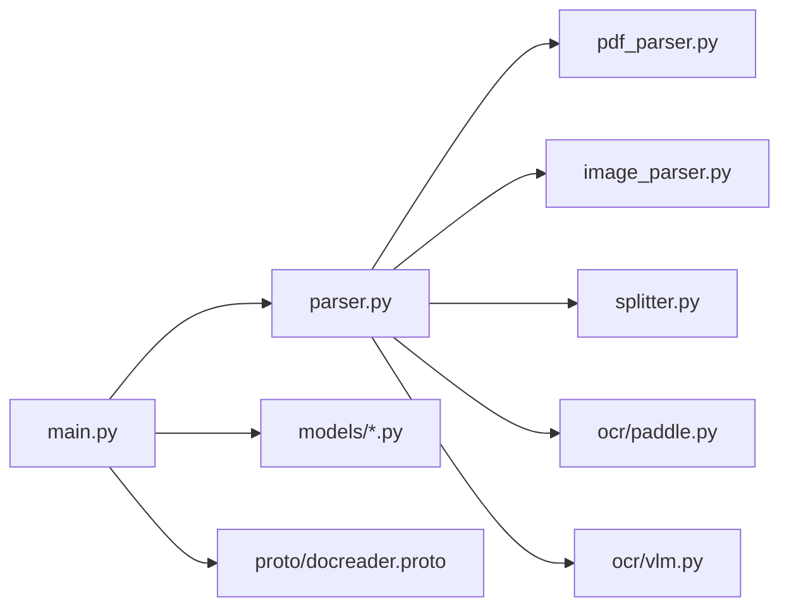

# 文档处理系统

<cite>
**本文引用的文件**
- [docreader/main.py](file://docreader/main.py)
- [docreader/config.py](file://docreader/config.py)
- [cmd/server/main.go](file://cmd/server/main.go)
- [client/client.go](file://client/client.go)
- [config/config.yaml](file://config/config.yaml)
- [docreader/parser/__init__.py](file://docreader/parser/__init__.py)
- [docreader/parser/parser.py](file://docreader/parser/parser.py)
- [docreader/parser/pdf_parser.py](file://docreader/parser/pdf_parser.py)
- [docreader/parser/image_parser.py](file://docreader/parser/image_parser.py)
- [docreader/ocr/paddle.py](file://docreader/ocr/paddle.py)
- [docreader/ocr/vlm.py](file://docreader/ocr/vlm.py)
- [docreader/splitter/splitter.py](file://docreader/splitter/splitter.py)
- [docreader/models/read_config.py](file://docreader/models/read_config.py)
- [docreader/models/document.py](file://docreader/models/document.py)
- [docreader/proto/docreader.proto](file://docreader/proto/docreader.proto)
</cite>

## 目录
1. [简介](#简介)
2. [项目结构](#项目结构)
3. [核心组件](#核心组件)
4. [架构总览](#架构总览)
5. [详细组件分析](#详细组件分析)
6. [依赖关系分析](#依赖关系分析)
7. [性能考量](#性能考量)
8. [故障排除指南](#故障排除指南)
9. [结论](#结论)
10. [附录](#附录)

## 简介
本文件面向WiseDx文档处理系统，聚焦“文档解析与分块”能力，涵盖多格式文档解析（PDF、Word、Excel、图片、网页等）、OCR图像识别（PaddleOCR与视觉语言模型VLM）、文本分块算法、嵌入生成前置流程、元数据与结构化处理、gRPC服务实现与客户端集成、配置项与性能优化建议，以及常见格式处理示例与故障排除。

## 项目结构
系统采用前后端分离与模块化设计：
- 后端服务（Python docreader）：提供gRPC服务，负责解析、分块、OCR/VLM、存储上传与响应封装。
- 前端/上层服务（Go cmd/server）：提供HTTP API入口，承载业务编排与路由。
- 客户端（Go client）：提供HTTP客户端封装，便于调用后端服务。
- 配置（Python docreader/config.py + YAML）：统一管理gRPC、OCR、VLM、存储、代理等参数。
- 协议定义（proto）：定义gRPC接口、消息结构与枚举。

图表来源
- [docreader/main.py](file://docreader/main.py#L276-L315)
- [docreader/parser/parser.py](file://docreader/parser/parser.py#L21-L179)
- [docreader/splitter/splitter.py](file://docreader/splitter/splitter.py#L31-L585)
- [docreader/ocr/paddle.py](file://docreader/ocr/paddle.py#L16-L176)
- [docreader/ocr/vlm.py](file://docreader/ocr/vlm.py#L14-L88)
- [docreader/models/read_config.py](file://docreader/models/read_config.py#L4-L28)
- [docreader/models/document.py](file://docreader/models/document.py#L9-L88)
- [docreader/proto/docreader.proto](file://docreader/proto/docreader.proto#L1-L89)

章节来源
- [docreader/main.py](file://docreader/main.py#L1-L315)
- [docreader/config.py](file://docreader/config.py#L1-L285)
- [cmd/server/main.go](file://cmd/server/main.go#L1-L193)
- [client/client.go](file://client/client.go#L1-L105)
- [config/config.yaml](file://config/config.yaml#L1-L585)
- [docreader/parser/__init__.py](file://docreader/parser/__init__.py#L1-L40)
- [docreader/parser/parser.py](file://docreader/parser/parser.py#L1-L179)
- [docreader/parser/pdf_parser.py](file://docreader/parser/pdf_parser.py#L1-L17)
- [docreader/parser/image_parser.py](file://docreader/parser/image_parser.py#L1-L49)
- [docreader/ocr/paddle.py](file://docreader/ocr/paddle.py#L1-L176)
- [docreader/ocr/vlm.py](file://docreader/ocr/vlm.py#L1-L88)
- [docreader/splitter/splitter.py](file://docreader/splitter/splitter.py#L1-L585)
- [docreader/models/read_config.py](file://docreader/models/read_config.py#L1-L28)
- [docreader/models/document.py](file://docreader/models/document.py#L1-L88)
- [docreader/proto/docreader.proto](file://docreader/proto/docreader.proto#L1-L89)

## 核心组件
- 解析器门面（Parser）：统一调度各类解析器（PDF、Word、Excel、图片、网页、文本等），支持按文件类型映射与链式解析策略。
- 文本分块器（TextSplitter）：基于分隔符与保护正则（公式、表格、代码块、图片链接、超链接）进行智能分块，保留上下文与完整性。
- OCR后端（PaddleOCR/VLM）：提供离线/在线两种OCR能力，支持图片文本抽取与图片描述生成（VLM）。
- gRPC服务（DocReader）：提供“从文件读取”“从URL读取”两类接口，返回结构化分块与图片信息。
- 配置系统（DocReaderConfig）：集中管理gRPC并发、文件大小、OCR/VLM后端、存储类型与凭证、代理等。
- 数据模型（Chunk/Document）：标准化文档与分块结构，便于序列化与传输。

章节来源
- [docreader/parser/parser.py](file://docreader/parser/parser.py#L21-L179)
- [docreader/splitter/splitter.py](file://docreader/splitter/splitter.py#L31-L585)
- [docreader/ocr/paddle.py](file://docreader/ocr/paddle.py#L16-L176)
- [docreader/ocr/vlm.py](file://docreader/ocr/vlm.py#L14-L88)
- [docreader/main.py](file://docreader/main.py#L130-L274)
- [docreader/config.py](file://docreader/config.py#L48-L217)
- [docreader/models/read_config.py](file://docreader/models/read_config.py#L4-L28)
- [docreader/models/document.py](file://docreader/models/document.py#L9-L88)

## 架构总览
下图展示从HTTP入口到gRPC服务、解析与分块、OCR/VLM、存储上传的完整链路。

图表来源
- [cmd/server/main.go](file://cmd/server/main.go#L124-L188)
- [docreader/main.py](file://docreader/main.py#L130-L274)
- [docreader/parser/parser.py](file://docreader/parser/parser.py#L74-L179)
- [docreader/splitter/splitter.py](file://docreader/splitter/splitter.py#L116-L297)
- [docreader/ocr/paddle.py](file://docreader/ocr/paddle.py#L118-L176)
- [docreader/ocr/vlm.py](file://docreader/ocr/vlm.py#L41-L88)

## 详细组件分析

### 解析器门面与多格式支持
- 类型映射：doc与docx、pdf、md/markdown、txt、图片（jpg/jpeg/png/gif/bmp/tiff/webp）、csv/xlsx/xls、网页等。
- 链式解析：PDF采用“MinerU优先，MarkItDown回退”的责任链策略。
- 配置注入：将chunk_size、chunk_overlap、separators、enable_multimodal、OCR后端、并发限制等传入具体解析器实例。

图表来源
- [docreader/parser/parser.py](file://docreader/parser/parser.py#L21-L179)
- [docreader/parser/pdf_parser.py](file://docreader/parser/pdf_parser.py#L6-L17)
- [docreader/parser/image_parser.py](file://docreader/parser/image_parser.py#L12-L49)

章节来源
- [docreader/parser/__init__.py](file://docreader/parser/__init__.py#L1-L40)
- [docreader/parser/parser.py](file://docreader/parser/parser.py#L21-L179)
- [docreader/parser/pdf_parser.py](file://docreader/parser/pdf_parser.py#L1-L17)
- [docreader/parser/image_parser.py](file://docreader/parser/image_parser.py#L1-L49)

### 文本分块算法
- 分隔符优先级：默认按换行、中文句号、空格等顺序切分。
- 保护正则：公式（LaTeX双$）、图片（Markdown语法）、链接（Markdown语法）、表格（表头/表体）、代码块（含语言标识）。
- 合并与重叠：逐段累加，超过chunk_size则落盘为chunk，并从上一个chunk中弹出头部内容以维持chunk_overlap。
- 头部上下文：通过HeaderTracker在分块前缀中保留标题等上下文，避免信息丢失。
- 恢复校验：提供restore_text与验证流程，便于定位分块错误。

图表来源
- [docreader/splitter/splitter.py](file://docreader/splitter/splitter.py#L116-L297)
- [docreader/splitter/splitter.py](file://docreader/splitter/splitter.py#L299-L407)
- [docreader/splitter/splitter.py](file://docreader/splitter/splitter.py#L517-L556)

章节来源
- [docreader/splitter/splitter.py](file://docreader/splitter/splitter.py#L31-L585)

### OCR与视觉语言模型
- PaddleOCR后端：
  - 禁用GPU、强制CPU运行，自动探测AVX能力并降级兼容。
  - 文档方向分类、文本行方向检测、阈值与模型配置可调。
  - 输入支持字符串路径、字节流、PIL Image，输出为拼接后的OCR文本。
- VLM OCR后端：
  - 基于OpenAI兼容接口，发送base64编码图片与提示词，返回结构化文本（表格用HTML、公式用LaTeX）。
  - 通过配置读取模型名、基础URL、API Key与接口类型。

图表来源
- [docreader/ocr/paddle.py](file://docreader/ocr/paddle.py#L16-L176)
- [docreader/ocr/vlm.py](file://docreader/ocr/vlm.py#L14-L88)

章节来源
- [docreader/ocr/paddle.py](file://docreader/ocr/paddle.py#L1-L176)
- [docreader/ocr/vlm.py](file://docreader/ocr/vlm.py#L1-L88)

### gRPC服务与客户端集成
- 服务定义：DocReader服务包含ReadFromFile与ReadFromURL两个RPC，返回ReadResponse（包含Chunk列表与错误信息）。
- 服务实现：DocReaderServicer在请求中注入request_id，解析ReadConfig为ChunkingConfig，调用Parser执行解析，再将内部Chunk转换为protobuf Chunk（含图片信息）。
- 客户端：Go客户端封装HTTP请求，支持超时、鉴权头、请求ID透传，便于集成到上层服务。

图表来源
- [docreader/proto/docreader.proto](file://docreader/proto/docreader.proto#L7-L89)
- [docreader/main.py](file://docreader/main.py#L66-L127)
- [docreader/main.py](file://docreader/main.py#L130-L274)
- [docreader/parser/parser.py](file://docreader/parser/parser.py#L74-L179)
- [docreader/splitter/splitter.py](file://docreader/splitter/splitter.py#L116-L297)
- [docreader/ocr/paddle.py](file://docreader/ocr/paddle.py#L118-L176)
- [docreader/ocr/vlm.py](file://docreader/ocr/vlm.py#L41-L88)

章节来源
- [docreader/proto/docreader.proto](file://docreader/proto/docreader.proto#L1-L89)
- [docreader/main.py](file://docreader/main.py#L130-L274)
- [client/client.go](file://client/client.go#L1-L105)

### 配置与元数据
- DocReaderConfig：集中管理gRPC并发、最大消息大小、端口、图片并发、代理、OCR/VLM后端、存储类型与凭证、MinIO/COS参数、本地存储目录等。
- ReadConfig：来自gRPC请求的分块配置，包含chunk_size、chunk_overlap、separators、enable_multimodal、StorageConfig、VLMConfig。
- Document/Chunk：标准化文档与分块结构，包含content、seq、start/end、images、metadata等字段，支持序列化与JSON互转。

章节来源
- [docreader/config.py](file://docreader/config.py#L48-L285)
- [docreader/models/read_config.py](file://docreader/models/read_config.py#L4-L28)
- [docreader/models/document.py](file://docreader/models/document.py#L9-L88)

## 依赖关系分析
- Parser依赖各具体解析器（PDF、Word、Excel、图片、网页、文本）与OCR/VLM后端。
- TextSplitter依赖HeaderTracker与工具函数，保障保护内容完整性与上下文保留。
- DocReader服务依赖Parser与配置系统，负责请求ID注入、Chunk到protobuf转换、错误码设置。
- 协议与模型相互独立，便于跨语言扩展。

图表来源
- [docreader/parser/parser.py](file://docreader/parser/parser.py#L1-L179)
- [docreader/parser/pdf_parser.py](file://docreader/parser/pdf_parser.py#L1-L17)
- [docreader/parser/image_parser.py](file://docreader/parser/image_parser.py#L1-L49)
- [docreader/splitter/splitter.py](file://docreader/splitter/splitter.py#L1-L585)
- [docreader/ocr/paddle.py](file://docreader/ocr/paddle.py#L1-L176)
- [docreader/ocr/vlm.py](file://docreader/ocr/vlm.py#L1-L88)
- [docreader/main.py](file://docreader/main.py#L1-L315)
- [docreader/models/read_config.py](file://docreader/models/read_config.py#L1-L28)
- [docreader/models/document.py](file://docreader/models/document.py#L1-L88)
- [docreader/proto/docreader.proto](file://docreader/proto/docreader.proto#L1-L89)

章节来源
- [docreader/parser/parser.py](file://docreader/parser/parser.py#L1-L179)
- [docreader/main.py](file://docreader/main.py#L1-L315)

## 性能考量
- gRPC并发与消息大小：通过配置项控制最大工作线程与最大消息长度，避免内存溢出与阻塞。
- 图片并发：限制图片OCR/VLM并发数，避免CPU/GPU资源争抢。
- OCR后端选择：PaddleOCR适合离线与CPU环境；VLM适合高质量视觉理解但需网络与API配额。
- 分块策略：合理设置chunk_size与chunk_overlap，兼顾召回与检索效率；优先分隔符与保护正则减少碎片化。
- 存储上传：图片上传至对象存储，返回URL供后续检索与可视化使用。

章节来源
- [docreader/config.py](file://docreader/config.py#L106-L217)
- [docreader/main.py](file://docreader/main.py#L281-L287)
- [docreader/parser/parser.py](file://docreader/parser/parser.py#L104-L116)

## 故障排除指南
- gRPC错误码与错误信息：服务端在异常时设置INTERNAL状态码并返回错误详情，便于定位。
- 请求ID追踪：服务端在请求上下文中注入request_id，便于日志聚合与问题溯源。
- OCR初始化失败：
  - PaddleOCR：导入失败或CPU指令集不兼容（非法指令/崩溃），建议安装CPU-only版本或更换后端。
  - VLM：API Key/URL配置错误或网络超时，检查OCR/VLM相关环境变量。
- 图片上传失败：确认存储类型与凭证配置正确，检查对象存储可用性。
- 分块异常：若出现恢复校验失败，系统会生成调试文件，定位差异位置与内容。

章节来源
- [docreader/main.py](file://docreader/main.py#L164-L191)
- [docreader/main.py](file://docreader/main.py#L234-L240)
- [docreader/ocr/paddle.py](file://docreader/ocr/paddle.py#L95-L117)
- [docreader/ocr/vlm.py](file://docreader/ocr/vlm.py#L50-L58)
- [docreader/splitter/splitter.py](file://docreader/splitter/splitter.py#L409-L516)

## 结论
WiseDx文档处理系统通过模块化的解析器门面、稳健的文本分块算法、可插拔的OCR/VLM后端与gRPC服务，实现了对多格式文档的高效解析与结构化输出。结合完善的配置体系与错误处理机制，系统在生产环境中具备良好的可维护性与扩展性。

## 附录

### 常见文档格式处理示例
- PDF：采用MinerU优先、MarkItDown回退的链式解析，适合复杂版式与表格。
- Word：doc/docx分别由DocParser与Docx2Parser处理，兼容旧版与新版格式。
- Excel：csv/xlsx/xls由CSV/Excel解析器处理，支持结构化数据抽取。
- 图片：上传至对象存储，生成URL；可选OCR提取文本与VLM生成描述。
- 网页：WebParser抓取并清理内容，再进行分块与结构化输出。

章节来源
- [docreader/parser/pdf_parser.py](file://docreader/parser/pdf_parser.py#L6-L17)
- [docreader/parser/__init__.py](file://docreader/parser/__init__.py#L16-L39)
- [docreader/parser/image_parser.py](file://docreader/parser/image_parser.py#L24-L49)

### 配置项速览（关键）
- gRPC：最大工作线程、最大消息大小、监听端口
- 图片处理：最大并发
- 代理：HTTP/HTTPS代理
- OCR：后端类型、API基础URL、API Key、模型名
- VLM：模型基础URL、模型名、API Key、接口类型
- 存储：类型（COS/MinIO）、区域/桶/密钥/路径前缀、SSL开关
- 其他：MinerU端点

章节来源
- [docreader/config.py](file://docreader/config.py#L99-L217)
- [config/config.yaml](file://config/config.yaml#L507-L513)