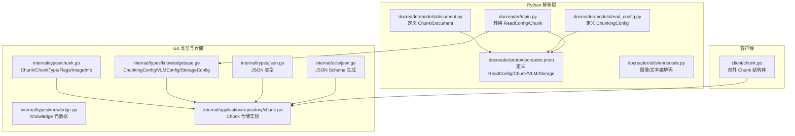
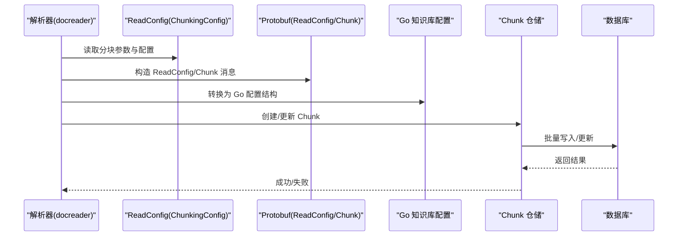
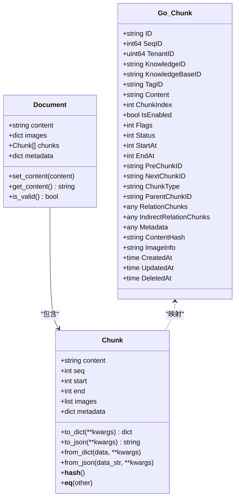
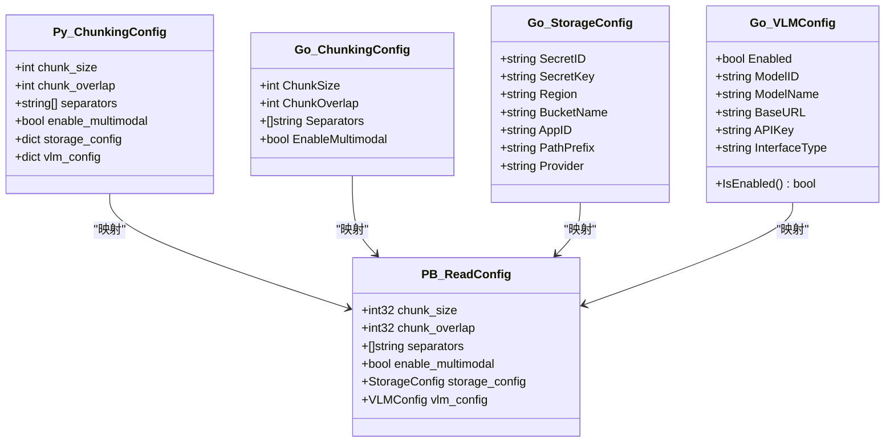
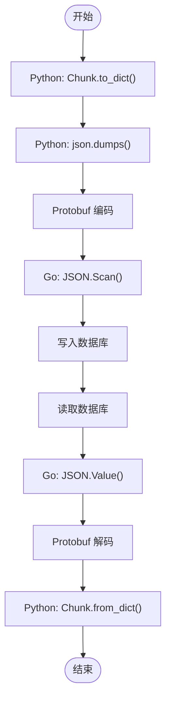
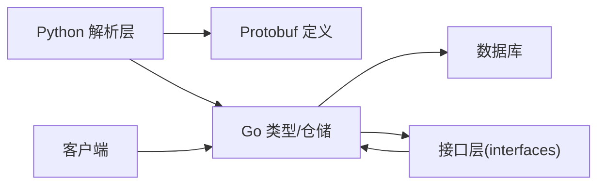
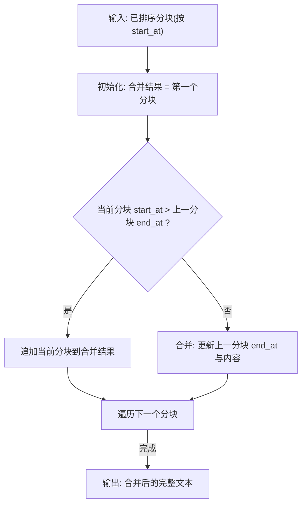

# 文档数据模型

<cite>
**本文引用的文件**
- [docreader/models/document.py](file://docreader/models/document.py)
- [docreader/models/read_config.py](file://docreader/models/read_config.py)
- [internal/types/chunk.go](file://internal/types/chunk.go)
- [client/chunk.go](file://client/chunk.go)
- [internal/application/repository/chunk.go](file://internal/application/repository/chunk.go)
- [docreader/proto/docreader.proto](file://docreader/proto/docreader.proto)
- [internal/types/knowledge.go](file://internal/types/knowledge.go)
- [internal/types/knowledgebase.go](file://internal/types/knowledgebase.go)
- [docreader/main.py](file://docreader/main.py)
- [docreader/utils/endecode.py](file://docreader/utils/endecode.py)
- [internal/types/json.go](file://internal/types/json.go)
- [internal/utils/json.go](file://internal/utils/json.go)
- [frontend/src/components/doc-content.vue](file://frontend/src/components/doc-content.vue)
</cite>

## 目录
1. [简介](#简介)
2. [项目结构](#项目结构)
3. [核心组件](#核心组件)
4. [架构总览](#架构总览)
5. [详细组件分析](#详细组件分析)
6. [依赖关系分析](#依赖关系分析)
7. [性能考量](#性能考量)
8. [故障排查指南](#故障排查指南)
9. [结论](#结论)
10. [附录](#附录)

## 简介
本文件系统化梳理 WiseDx 的文档数据模型，重点覆盖以下方面：
- Document 与 Chunk 的设计与用途
- ReadConfig 配置模型（分块参数、存储配置、VLM 配置）的字段定义与约束
- 数据模型之间的关系与约束
- 序列化与反序列化机制
- 数据验证规则与默认值
- 扩展方法与自定义字段添加建议
- 与 protobuf 模型的映射关系与兼容性

## 项目结构
围绕文档数据模型的关键目录与文件如下：
- Python 文档解析层：docreader/models（定义 Chunk/Document 与 ReadConfig）
- Go 类型与持久化：internal/types（定义 Chunk、知识库配置等）
- Go 仓储层：internal/application/repository（对 Chunk 的增删改查与批量操作）
- Protobuf 协议：docreader/proto（定义 ReadConfig、Chunk、VLMConfig、StorageConfig 等）
- 客户端模型：client（对外暴露的 Chunk 结构体）
- 工具与编码：docreader/utils/endecode.py（图像与文本编解码）
- JSON 类型与校验：internal/types/json.go、internal/utils/json.go

图表来源
- [docreader/models/document.py](file://docreader/models/document.py#L9-L87)
- [docreader/models/read_config.py](file://docreader/models/read_config.py#L4-L27)
- [docreader/proto/docreader.proto](file://docreader/proto/docreader.proto#L41-L48)
- [docreader/main.py](file://docreader/main.py#L84-L127)
- [internal/types/chunk.go](file://internal/types/chunk.go#L96-L155)
- [internal/types/knowledgebase.go](file://internal/types/knowledgebase.go#L96-L253)
- [internal/application/repository/chunk.go](file://internal/application/repository/chunk.go#L25-L330)
- [client/chunk.go](file://client/chunk.go#L14-L40)

章节来源
- [docreader/models/document.py](file://docreader/models/document.py#L9-L87)
- [docreader/models/read_config.py](file://docreader/models/read_config.py#L4-L27)
- [docreader/proto/docreader.proto](file://docreader/proto/docreader.proto#L41-L48)
- [internal/types/chunk.go](file://internal/types/chunk.go#L96-L155)
- [internal/types/knowledgebase.go](file://internal/types/knowledgebase.go#L96-L253)
- [internal/application/repository/chunk.go](file://internal/application/repository/chunk.go#L25-L330)
- [client/chunk.go](file://client/chunk.go#L14-L40)

## 核心组件
本节聚焦 Document、Chunk、ReadConfig 的设计与职责。

- Document（文档）
  - 作用：承载文档级内容、图片映射、分块列表与元数据
  - 关键字段：content、images、chunks、metadata
  - 校验：is_valid() 要求 content 非空
  - 方法：set_content()/get_content()

- Chunk（分块）
  - 作用：最小检索单元，包含文本、位置信息、图片、元数据
  - 关键字段：content、seq、start、end、images、metadata
  - 序列化：to_dict()/to_json()/from_dict()/from_json()
  - 哈希与相等：基于 content 的 __hash__/__eq__

- ReadConfig（读取配置）
  - 作用：控制分块策略、多模态开关、存储与 VLM 配置
  - 关键字段：chunk_size、chunk_overlap、separators、enable_multimodal、storage_config、vlm_config

章节来源
- [docreader/models/document.py](file://docreader/models/document.py#L9-L87)
- [docreader/models/read_config.py](file://docreader/models/read_config.py#L4-L27)

## 架构总览
下图展示从解析层到持久化层的数据流与模型映射关系：

图表来源
- [docreader/main.py](file://docreader/main.py#L84-L127)
- [docreader/proto/docreader.proto](file://docreader/proto/docreader.proto#L41-L89)
- [internal/types/knowledgebase.go](file://internal/types/knowledgebase.go#L96-L253)
- [internal/application/repository/chunk.go](file://internal/application/repository/chunk.go#L25-L330)

## 详细组件分析

### Document 与 Chunk 数据模型
- Python 层
  - Document：包含 content、images、chunks、metadata；提供 is_valid() 校验
  - Chunk：包含 content、seq、start、end、images、metadata；支持 to/from_dict/json
- Go 层
  - types.Chunk：包含 ID、SeqID、TenantID、KnowledgeID、KnowledgeBaseID、TagID、Content、ChunkIndex、IsEnabled、Flags、Status、StartAt、EndAt、Pre/NextChunkID、ChunkType、ParentChunkID、Relation/IndirectRelationChunks、Metadata、ContentHash、ImageInfo、CreatedAt/UpdatedAt/DeletedAt
  - ImageInfo：图片 URL、原始 URL、在文本中的位置、图片描述、OCR 文本
  - Flags/HasFlag/SetFlag/ClearFlag/ToggleFlag：位标志管理（如推荐状态）

图表来源
- [docreader/models/document.py](file://docreader/models/document.py#L62-L87)
- [docreader/models/document.py](file://docreader/models/document.py#L9-L45)
- [internal/types/chunk.go](file://internal/types/chunk.go#L96-L155)

章节来源
- [docreader/models/document.py](file://docreader/models/document.py#L9-L87)
- [internal/types/chunk.go](file://internal/types/chunk.go#L96-L155)

### ReadConfig 配置模型
- Python 层
  - ChunkingConfig：chunk_size、chunk_overlap、separators、enable_multimodal、storage_config、vlm_config
- Go 层
  - knowledgebase.ChunkingConfig：ChunkSize、ChunkOverlap、Separators、EnableMultimodal
  - knowledgebase.StorageConfig：兼容旧版 COS 配置字段
  - knowledgebase.VLMConfig：Enabled、ModelID、ModelName/BaseURL/APIKey/InterfaceType（兼容老版本）
- Protobuf 层
  - ReadConfig：chunk_size、chunk_overlap、separators、enable_multimodal、storage_config、vlm_config
  - VLMConfig：model_name、base_url、api_key、interface_type
  - StorageConfig：provider、region、bucket_name、access_key_id、secret_access_key、app_id、path_prefix

图表来源
- [docreader/models/read_config.py](file://docreader/models/read_config.py#L4-L27)
- [internal/types/knowledgebase.go](file://internal/types/knowledgebase.go#L96-L253)
- [docreader/proto/docreader.proto](file://docreader/proto/docreader.proto#L41-L48)

章节来源
- [docreader/models/read_config.py](file://docreader/models/read_config.py#L4-L27)
- [internal/types/knowledgebase.go](file://internal/types/knowledgebase.go#L96-L253)
- [docreader/proto/docreader.proto](file://docreader/proto/docreader.proto#L41-L48)

### 数据模型关系与约束
- Document 与 Chunk
  - Document.chunks 是 Chunk 列表；Chunk.parent_chunk_id 可指向父 Chunk（如图片与文本关联）
- Chunk 类型与状态
  - ChunkType：text、image_ocr、image_caption、summary、entity、relationship、faq、web_search、table_summary、table_column
  - ChunkStatus：default、stored、indexed
  - Flags：位标志（如推荐），HasFlag/SetFlag/ClearFlag/ToggleFlag
- 关系与元数据
  - RelationChunks/IndirectRelationChunks：与关系/间接关系 Chunk 的关联
  - Metadata：chunk 级别扩展信息（FAQ 等场景）
- 位置与顺序
  - StartAt/EndAt 与 ChunkIndex 决定检索定位与排序（FAQ 按更新时间，文档按 chunk_index）

章节来源
- [internal/types/chunk.go](file://internal/types/chunk.go#L11-L78)
- [internal/types/chunk.go](file://internal/types/chunk.go#L96-L155)

### 序列化与反序列化机制
- Python
  - Chunk.to_dict()/to_json()/from_dict()/from_json() 支持扩展字段注入与类名标记
- Go
  - types.JSON：自定义 JSON 类型，实现 sql.Scanner/driver.Valuer/json.Marshaler/json.Unmarshaler
  - internal/utils.GenerateSchema：为任意类型生成 JSON Schema
- Protobuf
  - docreader/main.py 将内部 Chunk 转换为 protobuf Chunk，确保字符串 UTF-8 合法
  - docreader.proto 定义 ReadConfig/Chunk/VLMConfig/StorageConfig 的消息结构
- 编解码工具
  - endecode.py：图像 base64 编解码、多编码格式文本解码

图表来源
- [docreader/models/document.py](file://docreader/models/document.py#L25-L59)
- [internal/types/json.go](file://internal/types/json.go#L13-L49)
- [internal/utils/json.go](file://internal/utils/json.go#L19-L35)
- [docreader/main.py](file://docreader/main.py#L242-L254)
- [docreader/proto/docreader.proto](file://docreader/proto/docreader.proto#L77-L89)

章节来源
- [docreader/models/document.py](file://docreader/models/document.py#L25-L59)
- [internal/types/json.go](file://internal/types/json.go#L13-L49)
- [internal/utils/json.go](file://internal/utils/json.go#L19-L35)
- [docreader/main.py](file://docreader/main.py#L242-L254)
- [docreader/proto/docreader.proto](file://docreader/proto/docreader.proto#L77-L89)

### 数据验证规则与默认值
- 分块参数
  - chunk_size、chunk_overlap、separators 在 Python/Go/Protobuf 中均有对应字段
  - enable_multimodal 控制多模态处理开关
- 默认值与兼容
  - Go Chunk.Flags 默认值为 1（推荐），迁移脚本添加 flags 列并默认 1
  - Go VLMConfig.IsEnabled() 兼容新老版本（Enabled+ModelID 或 ModelName+BaseURL）
  - Go KnowledgeBase.EnsureDefaults() 保证类型与配置默认值
- 校验
  - Document.is_valid() 要求 content 非空
  - JSON 类型提供 Map()/ToString() 辅助访问
  - JSON Schema 生成工具可用于运行时校验

章节来源
- [internal/types/chunk.go](file://internal/types/chunk.go#L48-L78)
- [migrations/versioned/000003_chunk_flags.up.sql](file://migrations/versioned/000003_chunk_flags.up.sql#L8-L10)
- [internal/types/knowledgebase.go](file://internal/types/knowledgebase.go#L197-L210)
- [internal/types/knowledgebase.go](file://internal/types/knowledgebase.go#L304-L329)
- [docreader/models/document.py](file://docreader/models/document.py#L86-L87)
- [internal/types/json.go](file://internal/types/json.go#L59-L68)
- [internal/utils/json.go](file://internal/utils/json.go#L19-L35)

### 扩展方法与自定义字段
- 扩展字段
  - Python：Chunk.to_dict()/from_dict() 支持传入额外 kwargs 注入自定义字段
  - Go：Metadata 为 JSON 类型，可存放任意结构化扩展信息
- 自定义字段添加建议
  - 通过 Metadata 字段承载业务特定元数据，避免修改核心结构体
  - 若需持久化查询，建议在数据库层面新增列或使用 JSON 路径索引
- 与前端的合并逻辑
  - 前端根据 start_at/end_at 合并重叠分块，确保与后端排序一致

章节来源
- [docreader/models/document.py](file://docreader/models/document.py#L25-L59)
- [internal/types/chunk.go](file://internal/types/chunk.go#L142-L147)
- [frontend/src/components/doc-content.vue](file://frontend/src/components/doc-content.vue#L84-L119)

### 与 Protobuf 模型的映射关系与兼容性
- 字段映射
  - ReadConfig：chunk_size、chunk_overlap、separators、enable_multimodal、storage_config、vlm_config
  - VLMConfig：model_name、base_url、api_key、interface_type
  - StorageConfig：provider、region、bucket_name、access_key_id、secret_access_key、app_id、path_prefix
- 兼容性
  - Go 端保留旧版字段（如 EnableMultimodal、COS 字段）以兼容历史数据
  - docreader/main.py 将 Protobuf 配置转换为 Go 结构，同时记录日志便于追踪
- 注意事项
  - Protobuf 字符串需合法 UTF-8，转换时进行清洗
  - 多模态开关以 enable_multimodal 为准，与 Go 端 IsEnabled() 兼容

章节来源
- [docreader/proto/docreader.proto](file://docreader/proto/docreader.proto#L41-L89)
- [internal/types/knowledgebase.go](file://internal/types/knowledgebase.go#L96-L253)
- [docreader/main.py](file://docreader/main.py#L84-L127)
- [docreader/main.py](file://docreader/main.py#L242-L254)

## 依赖关系分析
- 组件耦合
  - Python 解析层与 Protobuf 层双向映射，Go 仓储层依赖 Go 类型
  - 客户端模型与 Go 仓储层交互，统一对外接口
- 外部依赖
  - protobuf（Python/Go）、GORM、JSON Schema 工具
- 潜在循环依赖
  - 通过接口（interfaces）隔离仓储与服务层，避免循环导入

图表来源
- [docreader/proto/docreader.proto](file://docreader/proto/docreader.proto#L1-L89)
- [internal/application/repository/chunk.go](file://internal/application/repository/chunk.go#L1-L23)
- [client/chunk.go](file://client/chunk.go#L14-L40)

章节来源
- [internal/application/repository/chunk.go](file://internal/application/repository/chunk.go#L1-L23)
- [client/chunk.go](file://client/chunk.go#L14-L40)

## 性能考量
- 批量写入
  - 仓储层使用 Select("*") 与 CreateInBatches 提高插入效率，避免零值字段被忽略
- 批量更新
  - UpdateChunks 使用 CASE 表达式单 SQL 更新多个字段，减少往返
  - UpdateChunkFlagsBatch/UpdateChunkFieldsByTagID 支持批量标志与字段更新
- 分页与过滤
  - ListPagedChunksByKnowledgeID 支持按标签、关键词、排序方式分页查询
- JSON 查询
  - FAQ 场景支持 Postgres/MySQL 的 JSON 路径查询，注意索引与性能

章节来源
- [internal/application/repository/chunk.go](file://internal/application/repository/chunk.go#L25-L330)

## 故障排查指南
- 常见问题
  - 分块顺序错误或文本无法还原：检查分块算法与验证逻辑
  - 多模态未生效：确认 enable_multimodal 与 Go 端 IsEnabled() 判定
  - JSON 解析异常：检查 JSON 类型的 Scan/Value 与 Map()/ToString()
  - Protobuf 字符串异常：确认字符串 UTF-8 清洗
- 排查步骤
  - 查看 docreader/main.py 日志输出与错误码
  - 检查数据库 flags 列是否存在与默认值
  - 前端合并逻辑与后端排序一致性核对

章节来源
- [docreader/main.py](file://docreader/main.py#L234-L254)
- [migrations/versioned/000003_chunk_flags.down.sql](file://migrations/versioned/000003_chunk_flags.down.sql#L8-L10)
- [frontend/src/components/doc-content.vue](file://frontend/src/components/doc-content.vue#L84-L119)

## 结论
WiseDx 的文档数据模型在 Python、Protobuf 与 Go 三层之间实现了清晰的边界与稳定的映射关系。Document/Chunk 提供了灵活的内容与元数据承载能力，ReadConfig 则统一了分块策略与多模态配置。通过 JSON 类型与接口层，系统在保证扩展性的同时兼顾性能与一致性。建议在实际落地中优先使用 Metadata 进行扩展，并遵循分页、批量与 JSON 查询的最佳实践。

## 附录
- 关键流程示意（分块合并）

图表来源
- [frontend/src/components/doc-content.vue](file://frontend/src/components/doc-content.vue#L84-L119)