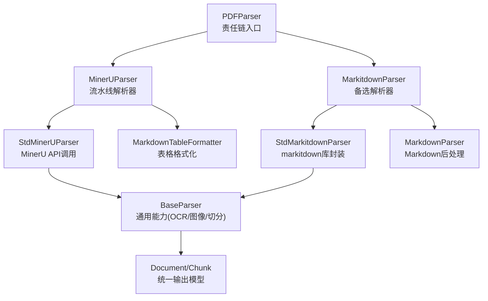
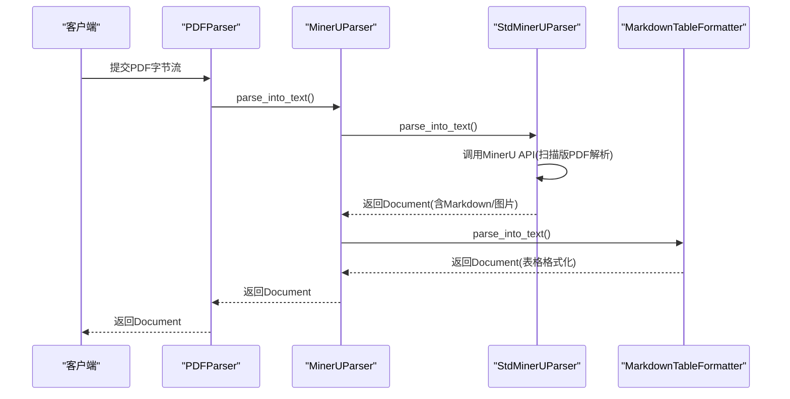
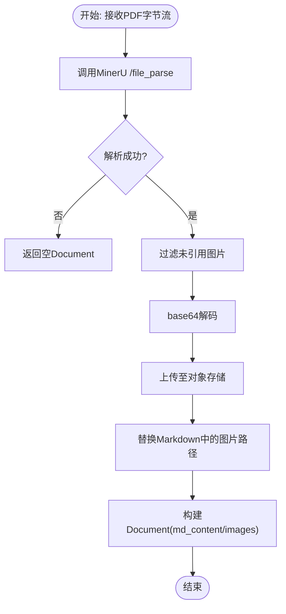
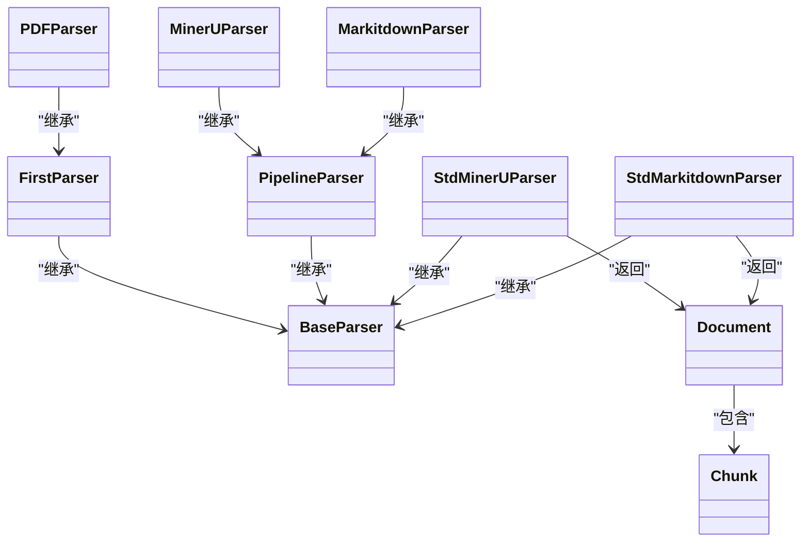

# PDF解析器

<cite>
**本文引用的文件**
- [docreader/parser/pdf_parser.py](file://docreader/parser/pdf_parser.py)
- [docreader/parser/mineru_parser.py](file://docreader/parser/mineru_parser.py)
- [docreader/parser/markitdown_parser.py](file://docreader/parser/markitdown_parser.py)
- [docreader/parser/chain_parser.py](file://docreader/parser/chain_parser.py)
- [docreader/parser/base_parser.py](file://docreader/parser/base_parser.py)
- [docreader/models/document.py](file://docreader/models/document.py)
- [docreader/config.py](file://docreader/config.py)
- [docreader/utils/endecode.py](file://docreader/utils/endecode.py)
- [docreader/proto/docreader.proto](file://docreader/proto/docreader.proto)
- [docreader/proto/docreader.pb.go](file://docreader/proto/docreader.pb.go)
</cite>

## 目录
1. [简介](#简介)
2. [项目结构](#项目结构)
3. [核心组件](#核心组件)
4. [架构总览](#架构总览)
5. [详细组件分析](#详细组件分析)
6. [依赖关系分析](#依赖关系分析)
7. [性能考量](#性能考量)
8. [故障排查指南](#故障排查指南)
9. [结论](#结论)
10. [附录](#附录)

## 简介
本技术文档围绕仓库中的PDF解析器展开，系统性阐述其页面提取算法、文本布局分析与格式保持机制；同时覆盖对不同PDF版本的支持、加密文档处理与数字签名验证现状、页面旋转检测、字体识别与字符编码转换、PDF元数据提取、书签解析与附件处理能力说明，并提供复杂布局PDF的处理示例路径、性能优化策略与常见问题解决方案。

## 项目结构
PDF解析器位于Python模块docreader/parser下，采用“责任链+流水线”的组合模式组织多个后端解析器，形成可扩展、可降级的解析链路。核心文件包括：
- PDF入口：pdf_parser.py
- 解析器实现：mineru_parser.py、markitdown_parser.py
- 抽象基类与通用能力：base_parser.py、chain_parser.py
- 数据模型：models/document.py
- 配置与环境变量：config.py
- 编解码工具：utils/endecode.py
- gRPC协议与消息定义：proto/docreader.proto、docreader.pb.go

图表来源
- [docreader/parser/pdf_parser.py](file://docreader/parser/pdf_parser.py#L6-L16)
- [docreader/parser/mineru_parser.py](file://docreader/parser/mineru_parser.py#L294-L303)
- [docreader/parser/markitdown_parser.py](file://docreader/parser/markitdown_parser.py#L45-L46)
- [docreader/parser/chain_parser.py](file://docreader/parser/chain_parser.py#L94-L148)
- [docreader/parser/base_parser.py](file://docreader/parser/base_parser.py#L29-L184)
- [docreader/models/document.py](file://docreader/models/document.py#L62-L88)

章节来源
- [docreader/parser/pdf_parser.py](file://docreader/parser/pdf_parser.py#L1-L16)
- [docreader/parser/mineru_parser.py](file://docreader/parser/mineru_parser.py#L1-L329)
- [docreader/parser/markitdown_parser.py](file://docreader/parser/markitdown_parser.py#L1-L46)
- [docreader/parser/chain_parser.py](file://docreader/parser/chain_parser.py#L1-L177)
- [docreader/parser/base_parser.py](file://docreader/parser/base_parser.py#L1-L1008)
- [docreader/models/document.py](file://docreader/models/document.py#L1-L88)

## 核心组件
- PDFParser：基于FirstParser的责任链入口，按顺序尝试MinerUParser与MarkitdownParser，首个成功即返回。
- MinerUParser：PipelineParser，串联StdMinerUParser与MarkdownTableFormatter，实现“结构化解析+表格格式化”。
- StdMinerUParser：对接MinerU API，支持扫描版PDF解析、表格/公式识别、多语言（中英）等；负责将结果转为Markdown并上传图片。
- MarkitdownParser：PipelineParser，串联StdMarkitdownParser与MarkdownParser，利用markitdown库进行多格式转换。
- StdMarkitdownParser：封装markitdown.convert，以file_extension提示格式，保留data URI。
- BaseParser：提供OCR、图像下载/上传、并发控制、文本切分与结构保护、分块等通用能力。
- Document/Chunk：统一的解析输出模型，支持内容、位置、图片映射与元数据。

章节来源
- [docreader/parser/pdf_parser.py](file://docreader/parser/pdf_parser.py#L6-L16)
- [docreader/parser/mineru_parser.py](file://docreader/parser/mineru_parser.py#L19-L168)
- [docreader/parser/mineru_parser.py](file://docreader/parser/mineru_parser.py#L294-L303)
- [docreader/parser/markitdown_parser.py](file://docreader/parser/markitdown_parser.py#L14-L46)
- [docreader/parser/chain_parser.py](file://docreader/parser/chain_parser.py#L20-L148)
- [docreader/parser/base_parser.py](file://docreader/parser/base_parser.py#L29-L460)
- [docreader/models/document.py](file://docreader/models/document.py#L9-L88)

## 架构总览
PDF解析器采用“责任链+流水线”双模式：
- 责任链（FirstParser）：顺序尝试多个解析器，首个成功即返回，失败自动切换至下一个。
- 流水线（PipelineParser）：将前一解析器的输出作为下一解析器输入，累积图片与中间结果，最终统一输出。

图表来源
- [docreader/parser/pdf_parser.py](file://docreader/parser/pdf_parser.py#L48-L72)
- [docreader/parser/mineru_parser.py](file://docreader/parser/mineru_parser.py#L294-L303)
- [docreader/parser/mineru_parser.py](file://docreader/parser/mineru_parser.py#L74-L168)
- [docreader/parser/chain_parser.py](file://docreader/parser/chain_parser.py#L122-L148)

## 详细组件分析

### PDFParser（责任链入口）
- 角色：按顺序尝试MinerUParser与MarkitdownParser，首个成功即返回；全部失败返回空Document。
- 关键点：_parser_cls=(MinerUParser, MarkitdownParser)，遵循FirstParser的顺序尝试与异常吞吐策略。

章节来源
- [docreader/parser/pdf_parser.py](file://docreader/parser/pdf_parser.py#L6-L16)
- [docreader/parser/chain_parser.py](file://docreader/parser/chain_parser.py#L48-L72)

### MinerUParser（MinerU流水线）
- 角色：串联StdMinerUParser与MarkdownTableFormatter，先结构化解析，再表格格式化。
- 行为：StdMinerUParser调用MinerU API，启用表格/公式/多语言解析；MarkdownTableFormatter对表格进行Markdown化。

章节来源
- [docreader/parser/mineru_parser.py](file://docreader/parser/mineru_parser.py#L294-L303)
- [docreader/parser/mineru_parser.py](file://docreader/parser/mineru_parser.py#L19-L168)

### StdMinerUParser（MinerU API调用）
- 功能要点：
  - 调用MinerU /file_parse接口，开启表格/公式/多语言解析，全页解析。
  - 解析结果包含md_content与images（base64），过滤未被引用的图片，上传至对象存储并替换Markdown中的图片路径。
  - 可选markdownify将HTML表格转为Markdown。
- 图片处理：base64解码→对象存储上传→URL替换→返回Document。

图表来源
- [docreader/parser/mineru_parser.py](file://docreader/parser/mineru_parser.py#L74-L168)
- [docreader/utils/endecode.py](file://docreader/utils/endecode.py#L78-L112)

章节来源
- [docreader/parser/mineru_parser.py](file://docreader/parser/mineru_parser.py#L74-L168)
- [docreader/utils/endecode.py](file://docreader/utils/endecode.py#L1-L205)

### MarkitdownParser（备选解析器）
- 角色：StdMarkitdownParser封装markitdown.convert，以file_type提示格式，保留data URIs；随后MarkdownParser进行后处理。
- 适用场景：当MinerU不可用或解析失败时的回退方案。

章节来源
- [docreader/parser/markitdown_parser.py](file://docreader/parser/markitdown_parser.py#L14-L46)

### BaseParser（通用能力）
- OCR与图像处理：perform_ocr、process_image_async、process_multiple_images、download_and_upload_image、get_image_caption等。
- 并发控制：Semaphore限制最大并发任务数，超时保护（OCR默认30秒）。
- 文本切分：_split_into_units按受保护结构（表格、代码块、公式、行内图片/链接）切分，chunk_text维持结构完整性与重叠策略。
- URL安全校验：_is_safe_url防止SSRF攻击。
- 存储与配置：create_storage、CONFIG（环境变量驱动）。

章节来源
- [docreader/parser/base_parser.py](file://docreader/parser/base_parser.py#L29-L460)
- [docreader/parser/base_parser.py](file://docreader/parser/base_parser.py#L461-L675)
- [docreader/parser/base_parser.py](file://docreader/parser/base_parser.py#L677-L800)
- [docreader/config.py](file://docreader/config.py#L99-L217)

### 文档模型（Document/Chunk）
- Document：content、images、chunks、metadata。
- Chunk：content、seq、start、end、images、metadata。
- 用于统一承载解析结果与后续分块、图像映射。

章节来源
- [docreader/models/document.py](file://docreader/models/document.py#L9-L88)

### gRPC协议与消息定义
- 服务：DocReader.ReadFromFile、ReadFromURL。
- 消息：ReadConfig、Chunk、Image、StorageConfig、VLMConfig等。
- 用于跨语言/进程传输解析结果，支持图片描述、OCR文本、原始URL与位置信息。

章节来源
- [docreader/proto/docreader.proto](file://docreader/proto/docreader.proto#L1-L89)
- [docreader/proto/docreader.pb.go](file://docreader/proto/docreader.pb.go#L486-L743)

## 依赖关系分析
- PDFParser依赖FirstParser，进而实例化MinerUParser与MarkitdownParser。
- MinerUParser继承PipelineParser，内部组合StdMinerUParser与MarkdownTableFormatter。
- StdMinerUParser与StdMarkitdownParser均继承BaseParser，共享OCR、图像处理、文本切分等能力。
- Document/Chunk作为统一输出，贯穿各解析器。

图表来源
- [docreader/parser/chain_parser.py](file://docreader/parser/chain_parser.py#L20-L167)
- [docreader/parser/pdf_parser.py](file://docreader/parser/pdf_parser.py#L6-L16)
- [docreader/parser/mineru_parser.py](file://docreader/parser/mineru_parser.py#L19-L303)
- [docreader/parser/markitdown_parser.py](file://docreader/parser/markitdown_parser.py#L14-L46)
- [docreader/parser/base_parser.py](file://docreader/parser/base_parser.py#L29-L184)
- [docreader/models/document.py](file://docreader/models/document.py#L62-L88)

## 性能考量
- 并发与限流：BaseParser通过asyncio.Semaphore限制并发图像处理任务数量，避免资源争用。
- OCR超时：OCR执行设置30秒超时，防止阻塞；异常被捕获并记录，保证整体流程继续。
- 图像尺寸控制：_resize_image_if_needed按最大边长缩放，降低OCR与上传成本。
- 文本切分结构保护：_split_into_units与chunk_text在重叠与结构完整性之间平衡，减少重复计算。
- API调用：MinerU API请求设置合理超时与错误处理，避免单点故障影响全局。
- 存储上传：图片base64解码后直接上传对象存储，减少中间缓存。

章节来源
- [docreader/parser/base_parser.py](file://docreader/parser/base_parser.py#L246-L356)
- [docreader/parser/base_parser.py](file://docreader/parser/base_parser.py#L197-L222)
- [docreader/parser/base_parser.py](file://docreader/parser/base_parser.py#L224-L244)
- [docreader/parser/base_parser.py](file://docreader/parser/base_parser.py#L557-L675)
- [docreader/parser/mineru_parser.py](file://docreader/parser/mineru_parser.py#L88-L113)

## 故障排查指南
- MinerU不可用或解析失败：
  - 检查MinerU端点配置（环境变量或构造函数传参），确认/ping可用。
  - 关注HTTP状态码与超时，必要时调整超时时间。
  - 若返回空Document，确认PDF是否为扫描版、语言列表是否包含目标语言。
- 图片未被引用或缺失：
  - StdMinerUParser会过滤未在md_content中出现的图片，检查Markdown内容与图片路径替换逻辑。
- OCR异常：
  - perform_ocr在异常时返回空文本并记录日志；检查OCR引擎初始化与网络代理配置。
- URL安全校验失败：
  - _is_safe_url拒绝私有IP、环回地址、保留域名等；检查外部代理与URL合法性。
- 文本切分异常：
  - _split_into_units与chunk_text对受保护结构有特殊处理；若出现切分异常，检查分隔符与结构正则。

章节来源
- [docreader/parser/mineru_parser.py](file://docreader/parser/mineru_parser.py#L55-L73)
- [docreader/parser/mineru_parser.py](file://docreader/parser/mineru_parser.py#L126-L168)
- [docreader/parser/base_parser.py](file://docreader/parser/base_parser.py#L197-L222)
- [docreader/parser/base_parser.py](file://docreader/parser/base_parser.py#L358-L459)
- [docreader/parser/base_parser.py](file://docreader/parser/base_parser.py#L386-L459)

## 结论
该PDF解析器通过“责任链+流水线”模式实现了高鲁棒性的多后端解析链路：优先使用MinerU进行结构化解析与表格/公式识别，回退至markitdown库以覆盖更多格式。BaseParser提供了OCR、图像处理、并发控制与文本切分等通用能力，确保复杂布局与多模态内容的稳定输出。结合gRPC消息模型，解析结果可被下游系统高效消费。

## 附录

### PDF版本支持与特性说明
- 扫描版PDF：通过MinerU API进行版面理解与文字识别，支持表格/公式抽取。
- 机器版PDF：通过markitdown库进行多格式转换，保留结构与图片。
- 多语言：MinerU侧配置中英语言列表，提升识别准确率。
- 页面范围：MinerU API支持start_page_id与end_page_id，实现全页解析或范围解析。

章节来源
- [docreader/parser/mineru_parser.py](file://docreader/parser/mineru_parser.py#L93-L113)
- [docreader/parser/mineru_parser.py](file://docreader/parser/mineru_parser.py#L195-L204)

### 加密文档处理与数字签名验证
- 当前实现未见针对PDF加密与数字签名验证的专门逻辑；建议在上游对加密PDF进行解密或在MinerU侧处理。
- 如需增强，可在BaseParser或MinerU调用前增加密码校验与证书验证步骤。

[本节为概念性说明，不直接分析具体文件]

### 页面旋转检测、字体识别与字符编码转换
- 页面旋转检测：MinerU API具备布局模型（如doclayout_yolo），可辅助检测旋转与方向；具体字段需参考MinerU返回结构。
- 字体识别：当前实现未显式进行字体识别；如需，可在MinerU侧启用相应模型并解析返回的布局信息。
- 字符编码转换：endecode.decode_bytes提供多编码尝试与回退策略，适用于混合编码文本的解码。

章节来源
- [docreader/utils/endecode.py](file://docreader/utils/endecode.py#L133-L197)
- [docreader/parser/mineru_parser.py](file://docreader/parser/mineru_parser.py#L199-L202)

### PDF元数据提取、书签解析与附件处理
- 元数据提取：当前实现未见对PDF元数据（标题、作者、主题等）的专门提取逻辑。
- 书签解析：未见对书签树的解析实现。
- 附件处理：未见对PDF附件的提取与保存逻辑。
- 建议：如需上述能力，可在MinerU侧启用相应解析项或引入专门的PDF库（如PyMuPDF）进行补充。

[本节为概念性说明，不直接分析具体文件]

### 复杂布局PDF处理示例（代码路径）
- 扫描版PDF解析流程（MinerU API）：[docreader/parser/mineru_parser.py](file://docreader/parser/mineru_parser.py#L88-L168)
- 图片上传与路径替换：[docreader/parser/mineru_parser.py](file://docreader/parser/mineru_parser.py#L126-L168)
- 文本结构保护与分块：[docreader/parser/base_parser.py](file://docreader/parser/base_parser.py#L468-L675)
- OCR执行与并发控制：[docreader/parser/base_parser.py](file://docreader/parser/base_parser.py#L197-L356)

### 性能优化策略清单
- 控制并发：合理设置max_concurrent_tasks，避免CPU/内存瓶颈。
- 图像预处理：按最大边长缩放，减少OCR与上传开销。
- 切分策略：根据业务需求调整chunk_size与chunk_overlap，兼顾召回与上下文连续性。
- 超时与重试：MinerU API与OCR均设置超时，必要时增加重试与熔断策略。
- 存储直传：base64解码后直接上传对象存储，减少中间缓存。

章节来源
- [docreader/parser/base_parser.py](file://docreader/parser/base_parser.py#L122-L184)
- [docreader/parser/base_parser.py](file://docreader/parser/base_parser.py#L224-L244)
- [docreader/parser/base_parser.py](file://docreader/parser/base_parser.py#L557-L675)
- [docreader/parser/mineru_parser.py](file://docreader/parser/mineru_parser.py#L88-L113)