# Word文档解析器

<cite>
**本文档引用的文件**
- [doc_parser.py](file://docreader/parser/doc_parser.py)
- [docx_parser.py](file://docreader/parser/docx_parser.py)
- [docx2_parser.py](file://docreader/parser/docx2_parser.py)
- [base_parser.py](file://docreader/parser/base_parser.py)
- [chain_parser.py](file://docreader/parser/chain_parser.py)
- [markitdown_parser.py](file://docreader/parser/markitdown_parser.py)
- [document.py](file://docreader/models/document.py)
- [endecode.py](file://docreader/utils/endecode.py)
- [__init__.py](file://docreader/parser/__init__.py)
</cite>

## 目录
1. [简介](#简介)
2. [项目结构](#项目结构)
3. [核心组件](#核心组件)
4. [架构概览](#架构概览)
5. [详细组件分析](#详细组件分析)
6. [依赖关系分析](#依赖关系分析)
7. [性能考虑](#性能考虑)
8. [故障排除指南](#故障排除指南)
9. [结论](#结论)

## 简介

Word文档解析器是WiseDx文档处理系统的核心组件，专门负责处理Microsoft Word文档格式。该系统提供了两种主要的Word文档解析策略：针对旧版DOC格式的DocParser和针对现代DOCX格式的DocxParser。

系统采用模块化设计，支持多种解析策略的组合使用，包括：
- **DocParser**：专为旧版Word文档(.doc)设计，支持多种提取方法
- **DocxParser**：专为现代Word文档(.docx)设计，支持并发处理和图像提取
- **Docx2Parser**：结合多种解析策略的链式处理器

## 项目结构

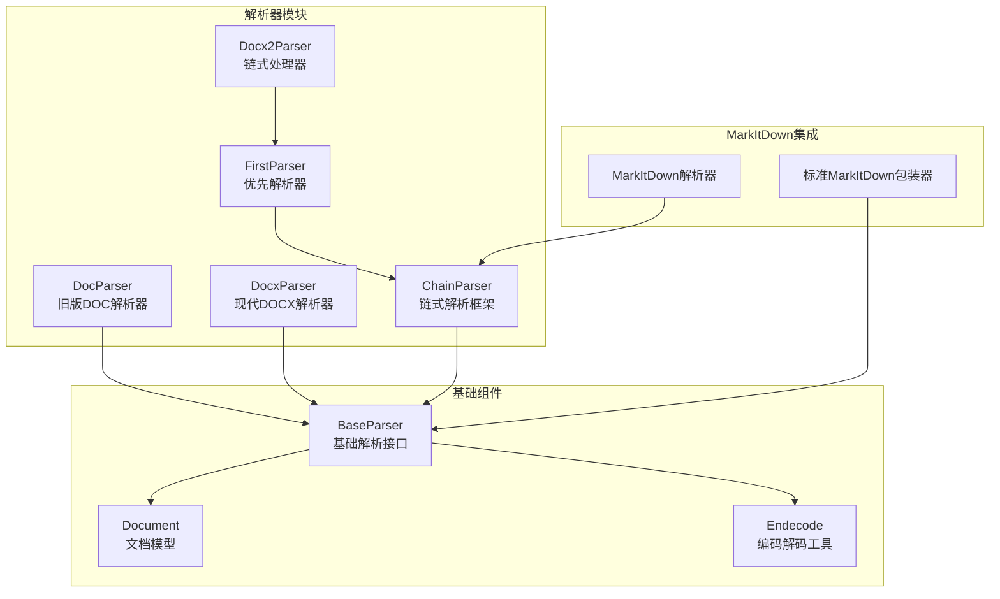

**图表来源**
- [doc_parser.py](file://docreader/parser/doc_parser.py#L95-L140)
- [docx_parser.py](file://docreader/parser/docx_parser.py#L52-L100)
- [docx2_parser.py](file://docreader/parser/docx2_parser.py#L10-L12)
- [chain_parser.py](file://docreader/parser/chain_parser.py#L20-L47)

**章节来源**
- [doc_parser.py](file://docreader/parser/doc_parser.py#L1-L50)
- [docx_parser.py](file://docreader/parser/docx_parser.py#L1-L50)
- [docx2_parser.py](file://docreader/parser/docx2_parser.py#L1-L20)

## 核心组件

### DocParser - 旧版Word文档解析器

DocParser专门处理旧版Microsoft Word文档(.doc格式)，采用多阶段解析策略：

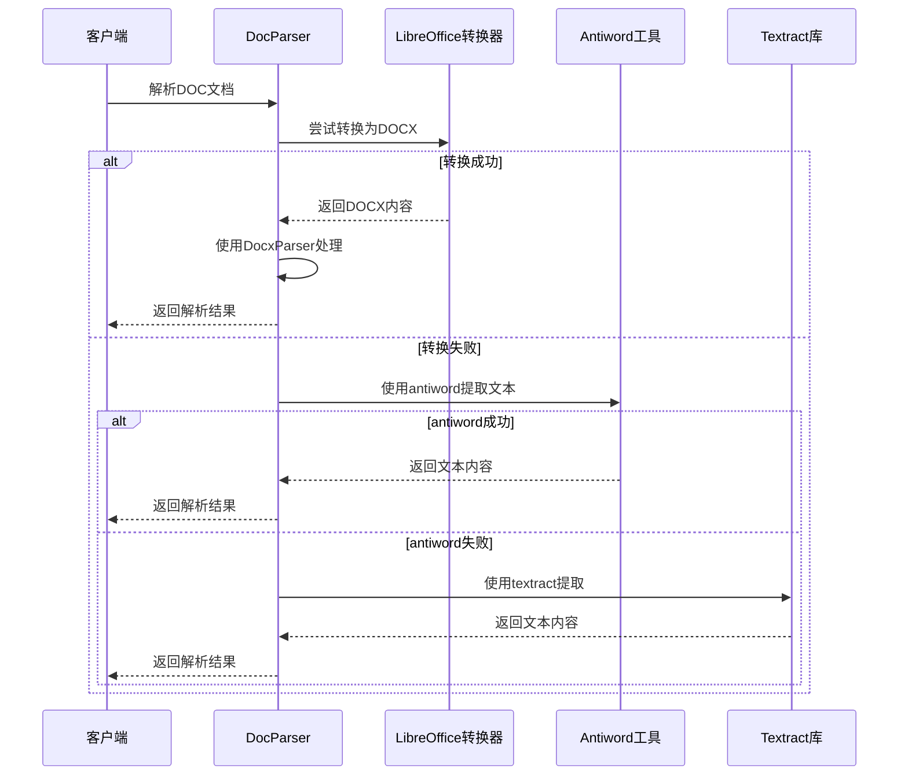

**图表来源**
- [doc_parser.py](file://docreader/parser/doc_parser.py#L103-L140)
- [doc_parser.py](file://docreader/parser/doc_parser.py#L129-L140)

### DocxParser - 现代Word文档解析器

DocxParser专为现代Word文档(.docx格式)设计，支持复杂的并发处理和图像提取：

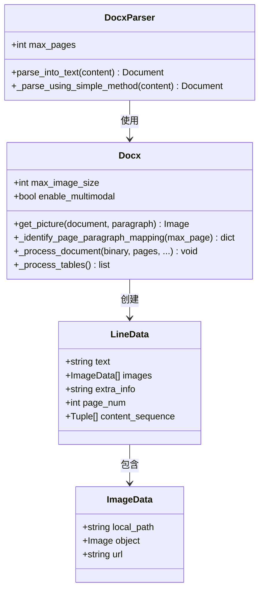

**图表来源**
- [docx_parser.py](file://docreader/parser/docx_parser.py#L52-L100)
- [docx_parser.py](file://docreader/parser/docx_parser.py#L245-L253)
- [docx_parser.py](file://docreader/parser/docx_parser.py#L37-L50)

### Docx2Parser - 链式解析器

Docx2Parser采用链式解析模式，结合多种解析策略：

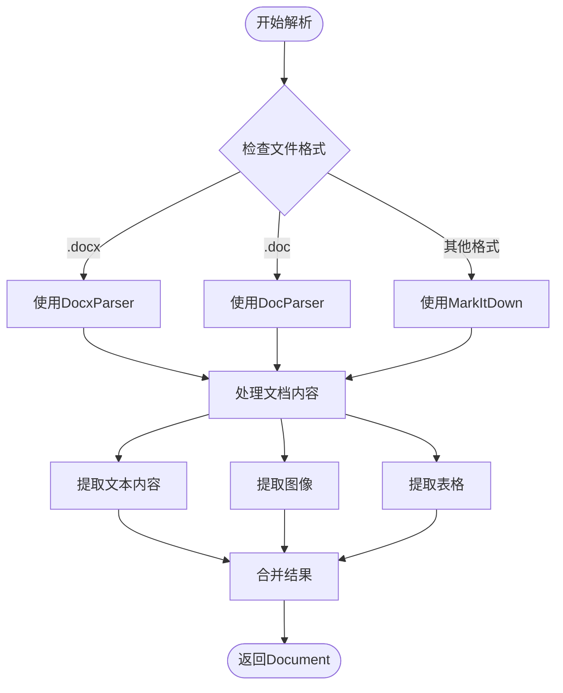

**图表来源**
- [docx2_parser.py](file://docreader/parser/docx2_parser.py#L10-L12)
- [chain_parser.py](file://docreader/parser/chain_parser.py#L20-L47)

**章节来源**
- [doc_parser.py](file://docreader/parser/doc_parser.py#L95-L140)
- [docx_parser.py](file://docreader/parser/docx_parser.py#L52-L100)
- [docx2_parser.py](file://docreader/parser/docx2_parser.py#L10-L12)

## 架构概览

系统采用分层架构设计，从底层的文档解析到底层的存储服务：

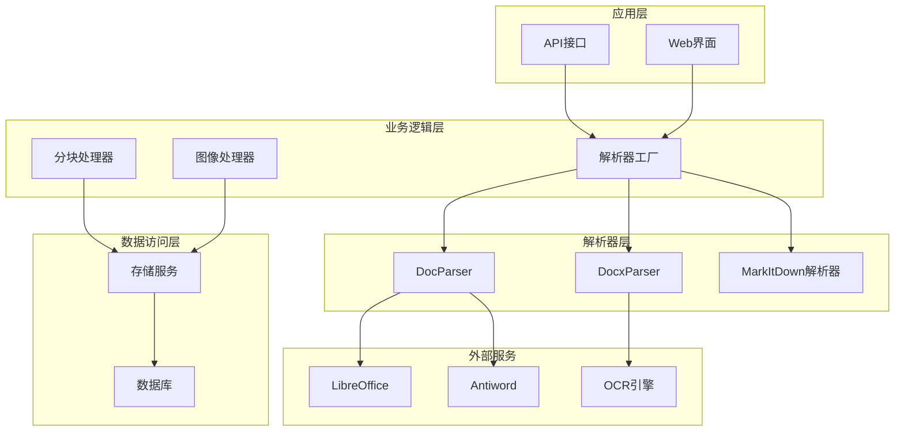

**图表来源**
- [base_parser.py](file://docreader/parser/base_parser.py#L122-L184)
- [doc_parser.py](file://docreader/parser/doc_parser.py#L170-L229)
- [docx_parser.py](file://docreader/parser/docx_parser.py#L430-L496)

## 详细组件分析

### DocParser组件详细分析

#### 解析策略实现

DocParser实现了三层解析策略，确保在不同环境下都能获得最佳解析效果：

1. **DOCX转换策略**：优先尝试将旧版DOC转换为DOCX格式，然后使用DocxParser处理
2. **Antiword文本提取**：当转换失败时，使用antiword工具直接提取文本
3. **Textract备用策略**：作为最后的备用方案，但当前已禁用以避免SSRF漏洞

#### Sandbox执行器

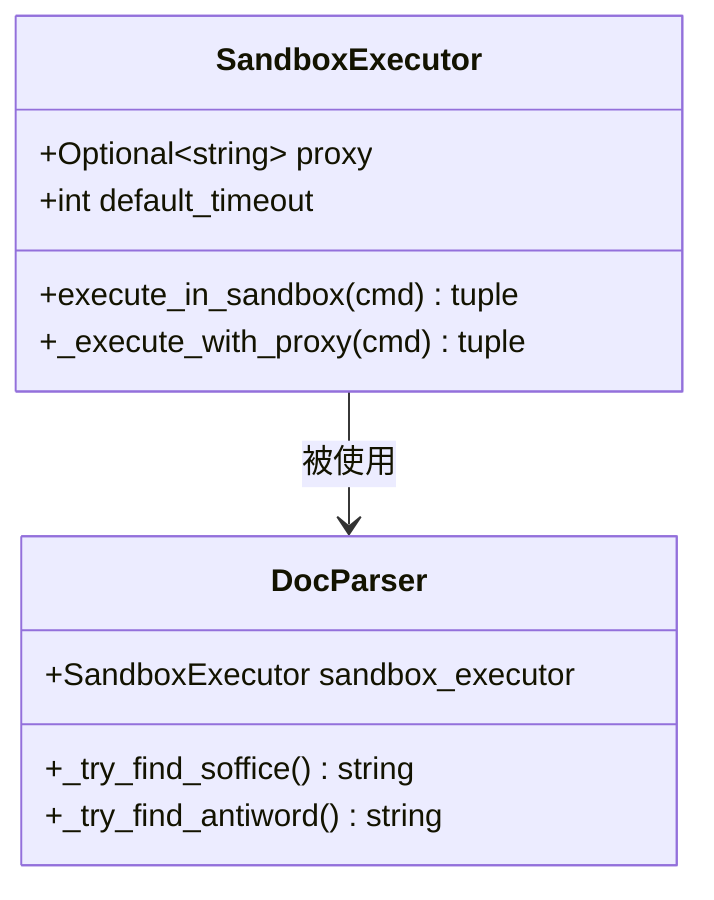

**图表来源**
- [doc_parser.py](file://docreader/parser/doc_parser.py#L16-L53)
- [doc_parser.py](file://docreader/parser/doc_parser.py#L231-L312)

#### 执行环境隔离

SandboxExecutor确保所有外部命令执行都在安全的沙箱环境中进行，防止潜在的安全威胁：

- **代理配置**：支持HTTP和HTTPS代理设置
- **超时控制**：默认60秒超时，防止长时间阻塞
- **错误处理**：统一的异常处理机制

**章节来源**
- [doc_parser.py](file://docreader/parser/doc_parser.py#L16-L90)
- [doc_parser.py](file://docreader/parser/doc_parser.py#L170-L229)

### DocxParser组件详细分析

#### 并发处理架构

DocxParser采用了先进的并发处理架构，支持大规模文档的高效处理：

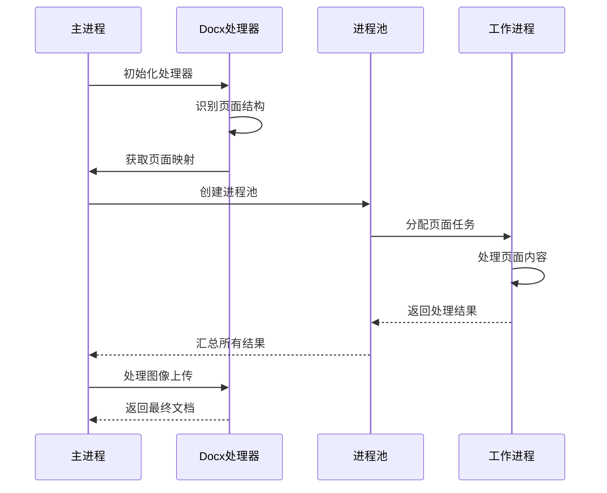

**图表来源**
- [docx_parser.py](file://docreader/parser/docx_parser.py#L430-L496)
- [docx_parser.py](file://docreader/parser/docx_parser.py#L720-L754)

#### 页面识别算法

DocxParser实现了智能的页面识别算法，能够准确识别文档中的页面边界：

1. **大文档启发式方法**：对于超过1000段落的大文档，使用启发式算法估算每页段落数
2. **标准页面检测**：对于小文档，逐段检查页面断点标记
3. **页面断点检测**：支持多种页面断点类型：
   - `lastRenderedPageBreak`：最后渲染的页面断点
   - `w:br`标签：页面换行符
   - `w:sectPr`元素：节分隔符

#### 图像处理流程

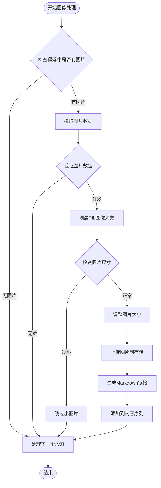

**图表来源**
- [docx_parser.py](file://docreader/parser/docx_parser.py#L1377-L1486)

**章节来源**
- [docx_parser.py](file://docreader/parser/docx_parser.py#L296-L428)
- [docx_parser.py](file://docreader/parser/docx_parser.py#L808-L931)

### 链式解析器分析

#### FirstParser模式

FirstParser实现了责任链模式，按顺序尝试多个解析器，直到找到成功的解析器：

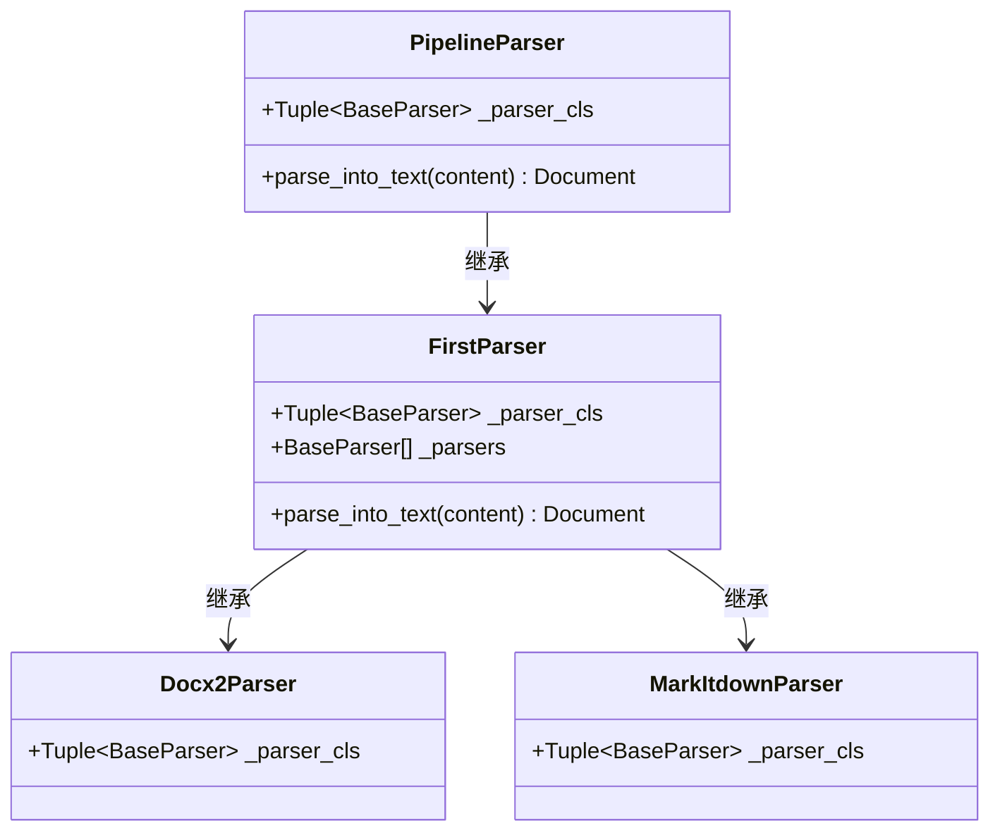

**图表来源**
- [chain_parser.py](file://docreader/parser/chain_parser.py#L20-L92)
- [docx2_parser.py](file://docreader/parser/docx2_parser.py#L10-L12)

#### MarkItDown集成

系统集成了MarkItDown库，提供对多种文档格式的支持：

- **格式支持**：docx、pptx、pdf等
- **数据URI保持**：保留原始数据URI格式
- **流式处理**：支持字节流输入输出

**章节来源**
- [chain_parser.py](file://docreader/parser/chain_parser.py#L1-L177)
- [markitdown_parser.py](file://docreader/parser/markitdown_parser.py#L14-L45)

## 依赖关系分析

### 核心依赖关系

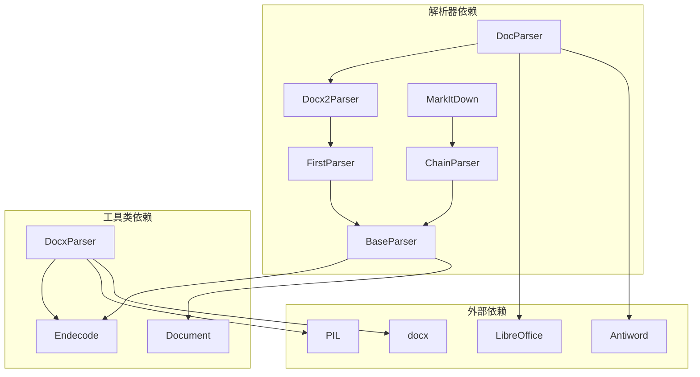

**图表来源**
- [doc_parser.py](file://docreader/parser/doc_parser.py#L10-L11)
- [docx_parser.py](file://docreader/parser/docx_parser.py#L14-L24)
- [base_parser.py](file://docreader/parser/base_parser.py#L16-L23)

### 数据模型关系

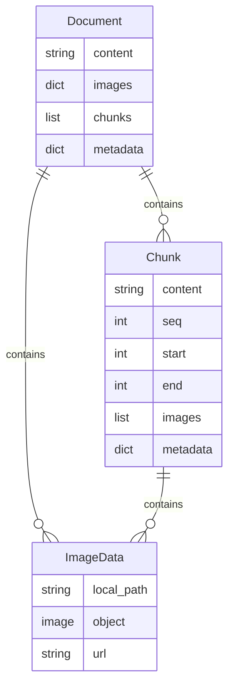

**图表来源**
- [document.py](file://docreader/models/document.py#L62-L88)
- [docx_parser.py](file://docreader/parser/docx_parser.py#L29-L50)

**章节来源**
- [doc_parser.py](file://docreader/parser/doc_parser.py#L1-L13)
- [docx_parser.py](file://docreader/parser/docx_parser.py#L1-L26)
- [document.py](file://docreader/models/document.py#L1-L88)

## 性能考虑

### 内存优化策略

1. **分页处理**：DocxParser支持最大页数限制，默认100页，防止内存溢出
2. **图像缓存**：使用picture_cache避免重复处理相同图像
3. **临时文件管理**：自动清理临时图像文件和文档文件

### 并发处理优化

1. **动态工作进程数**：根据文档特征和CPU核心数动态调整
2. **进程池管理**：使用ProcessPoolExecutor实现真正的多核并行
3. **资源锁机制**：使用threading.Lock保护共享资源

### 编码处理优化

系统实现了智能的字符编码检测机制，支持多种编码格式：

- **优先级顺序**：utf-8 → gb18030 → gb2312 → gbk → big5 → ascii → latin-1
- **自动降级**：当首选编码失败时自动尝试下一个编码
- **错误处理**：使用latin-1作为最终降级方案，确保解析不会中断

## 故障排除指南

### 常见问题及解决方案

#### DOC文档解析失败

**问题症状**：DocParser无法解析旧版DOC文档

**可能原因**：
1. LibreOffice未安装或路径配置错误
2. antiword工具不可用
3. 文件权限问题

**解决步骤**：
1. 检查LibreOffice安装状态
2. 验证antiword可执行文件路径
3. 确认文件读取权限

#### DOCX文档处理超时

**问题症状**：DocxParser处理大型文档时超时

**可能原因**：
1. 文档过大导致内存不足
2. 图像过多影响处理速度
3. 系统资源限制

**解决步骤**：
1. 调整max_pages参数限制处理页数
2. 减少max_image_size限制图像大小
3. 增加系统内存或CPU资源

#### 图像处理异常

**问题症状**：图像提取失败或显示异常

**可能原因**：
1. 图像格式不受支持
2. 图像损坏或格式错误
3. 存储服务连接失败

**解决步骤**：
1. 检查图像格式兼容性
2. 验证图像完整性
3. 确认存储服务可用性

**章节来源**
- [doc_parser.py](file://docreader/parser/doc_parser.py#L154-L168)
- [docx_parser.py](file://docreader/parser/docx_parser.py#L800-L806)

## 结论

WiseDx的Word文档解析器系统提供了完整的文档处理解决方案，具有以下特点：

### 技术优势

1. **多格式支持**：同时支持旧版DOC和现代DOCX格式
2. **智能解析策略**：根据文档特征选择最优解析方法
3. **高性能并发**：支持大规模文档的高效处理
4. **安全性保障**：严格的沙箱执行和URL验证机制

### 设计亮点

1. **模块化架构**：清晰的组件分离和职责划分
2. **扩展性强**：易于添加新的解析策略和格式支持
3. **容错能力**：多层备份策略确保解析成功率
4. **性能优化**：针对大数据场景的专门优化

### 应用价值

该解析器系统为WiseDx平台提供了强大的文档处理能力，能够：
- 支持医疗文档的复杂格式处理
- 提供高质量的文本提取和图像识别
- 确保大规模文档处理的稳定性和性能
- 为后续的知识图谱构建提供可靠的数据基础

通过合理的设计和实现，该系统能够在保证质量的同时，满足生产环境对性能和稳定性的严格要求。