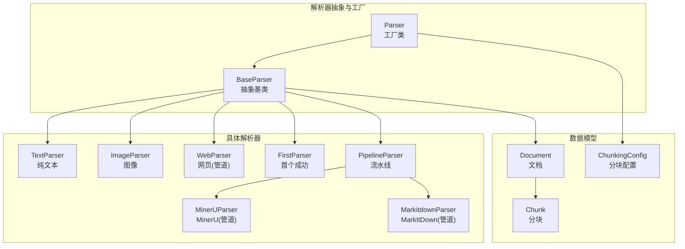
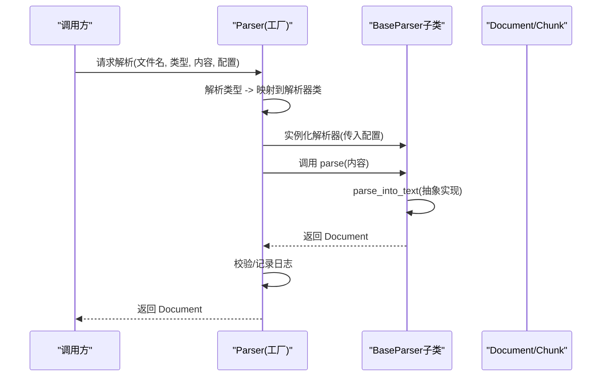
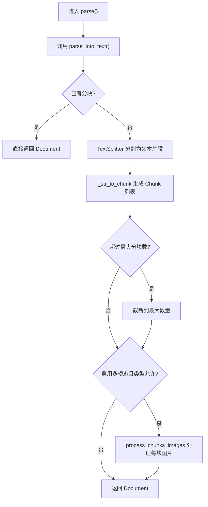
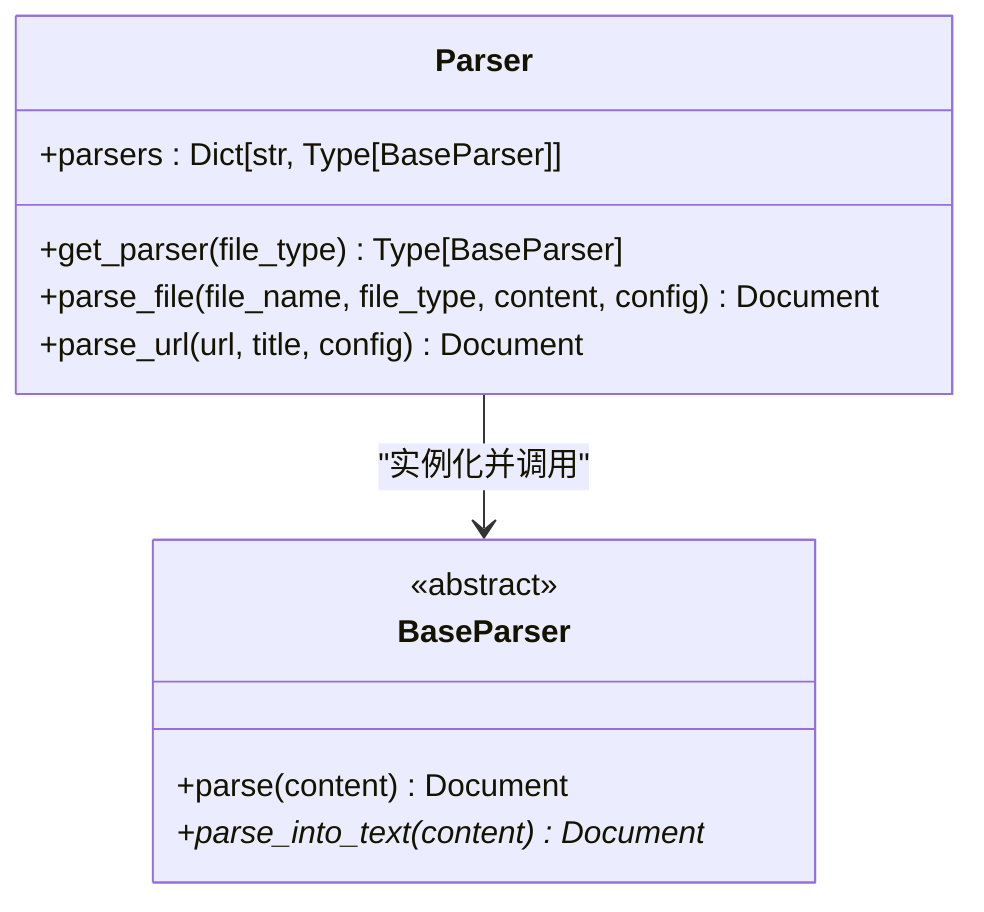
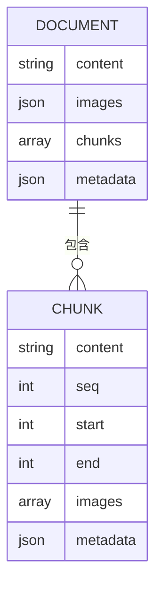
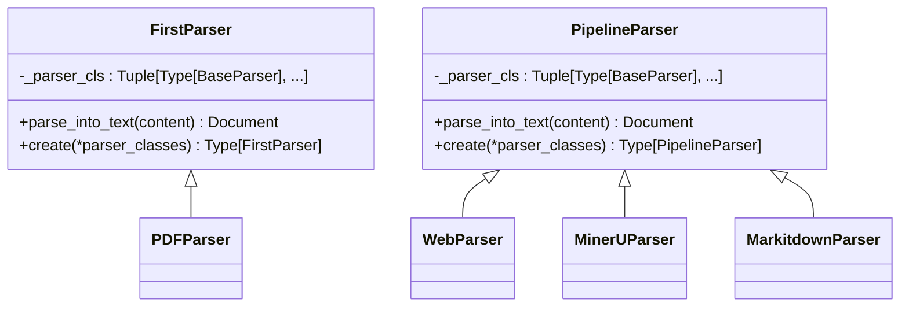
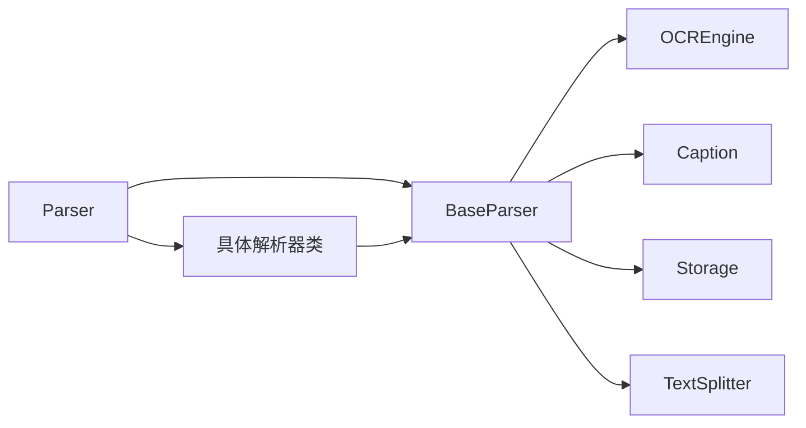

# 基础解析器

<cite>
**本文引用的文件**
- [docreader/parser/base_parser.py](file://docreader/parser/base_parser.py)
- [docreader/parser/parser.py](file://docreader/parser/parser.py)
- [docreader/models/document.py](file://docreader/models/document.py)
- [docreader/models/read_config.py](file://docreader/models/read_config.py)
- [docreader/parser/text_parser.py](file://docreader/parser/text_parser.py)
- [docreader/parser/image_parser.py](file://docreader/parser/image_parser.py)
- [docreader/parser/web_parser.py](file://docreader/parser/web_parser.py)
- [docreader/parser/chain_parser.py](file://docreader/parser/chain_parser.py)
- [docreader/parser/mineru_parser.py](file://docreader/parser/mineru_parser.py)
- [docreader/parser/markitdown_parser.py](file://docreader/parser/markitdown_parser.py)
</cite>

## 目录
1. [简介](#简介)
2. [项目结构](#项目结构)
3. [核心组件](#核心组件)
4. [架构总览](#架构总览)
5. [详细组件分析](#详细组件分析)
6. [依赖关系分析](#依赖关系分析)
7. [性能考量](#性能考量)
8. [故障排查指南](#故障排查指南)
9. [结论](#结论)
10. [附录：扩展与最佳实践](#附录扩展与最佳实践)

## 简介
本文件系统性阐述“基础解析器”体系，围绕 BaseParser 抽象基类的设计模式、标准接口规范、异常处理与返回值约定，以及 Parser 工厂的解析器选择与动态加载机制展开；同时覆盖解析器生命周期管理、资源清理与错误恢复策略，并提供可直接参考的继承示例与扩展指南，最后给出性能优化与内存管理的最佳实践。

## 项目结构
本项目在 docreader/parser 子模块中实现了统一的解析器抽象与多种具体解析器，配合 Parser 工厂类完成按文件类型自动选择与实例化，最终产出标准化的 Document 结构体，供后续分块与检索使用。

图表来源
- [docreader/parser/base_parser.py](file://docreader/parser/base_parser.py#L29-L460)
- [docreader/parser/parser.py](file://docreader/parser/parser.py#L21-L179)
- [docreader/models/document.py](file://docreader/models/document.py#L62-L88)
- [docreader/models/read_config.py](file://docreader/models/read_config.py#L4-L28)

章节来源
- [docreader/parser/base_parser.py](file://docreader/parser/base_parser.py#L29-L460)
- [docreader/parser/parser.py](file://docreader/parser/parser.py#L21-L179)
- [docreader/models/document.py](file://docreader/models/document.py#L62-L88)
- [docreader/models/read_config.py](file://docreader/models/read_config.py#L4-L28)

## 核心组件
- BaseParser 抽象基类：定义统一的 parse() 流程、parse_into_text() 抽象接口、OCR 与图像处理能力、文本分块策略、URL 安全校验等。
- Parser 工厂类：根据文件类型映射到具体解析器类，负责实例化与调用 parse()，并进行结果校验与日志记录。
- Document/Chunk 数据模型：标准化输出结构，包含文本内容、图像映射、分块序列与元数据。
- 配置对象 ChunkingConfig：控制分块大小、重叠、分隔符、是否启用多模态、存储与视觉语言模型配置等。

章节来源
- [docreader/parser/base_parser.py](file://docreader/parser/base_parser.py#L29-L460)
- [docreader/parser/parser.py](file://docreader/parser/parser.py#L21-L179)
- [docreader/models/document.py](file://docreader/models/document.py#L62-L88)
- [docreader/models/read_config.py](file://docreader/models/read_config.py#L4-L28)

## 架构总览
下图展示从工厂到解析器再到数据模型的整体调用流程与职责边界。

图表来源
- [docreader/parser/parser.py](file://docreader/parser/parser.py#L74-L131)
- [docreader/parser/base_parser.py](file://docreader/parser/base_parser.py#L386-L459)

章节来源
- [docreader/parser/parser.py](file://docreader/parser/parser.py#L74-L131)
- [docreader/parser/base_parser.py](file://docreader/parser/base_parser.py#L386-L459)

## 详细组件分析

### BaseParser 抽象基类
- 设计模式
  - 抽象基类 + 模板方法：parse() 为模板方法，内部调用 parse_into_text() 与分块逻辑；子类仅需实现 parse_into_text()。
  - 可插拔的 OCR 与图像处理：提供统一的 OCR 执行、图像下载上传、并发处理与资源释放。
  - URL 安全校验：防止 SSRF 攻击，限制协议与主机名/IP。
- 标准接口与返回值
  - parse_into_text(content: bytes) -> Document：子类必须实现，返回包含文本与可选图像映射的 Document。
  - parse(content: bytes) -> Document：统一入口，负责文本提取、分块、可选的图像处理与结果裁剪。
  - 返回值格式：始终返回 Document；若未生成分块，将基于 TextSplitter 生成；若启用多模态且文件类型允许，对每个分块内的图片执行 OCR 与标题生成。
- 异常处理机制
  - 图像并发处理：使用 asyncio.Semaphore 控制并发，单个任务失败不会导致整体失败，异常会被捕获并记录，返回空结果占位。
  - OCR 超时：在异步执行 OCR 时设置超时，避免阻塞；失败时记录错误并返回空文本。
  - URL 下载与上传：对远程 URL 进行安全校验与代理配置；下载失败或上传失败时回退原 URL 并记录警告。
  - OCR 引擎初始化：采用懒加载与失败标记，避免重复尝试。
- 生命周期管理与资源清理
  - 图像对象在使用后及时 close()，并发完成后清空中间列表并触发垃圾回收。
  - 事件循环检测与创建：在 process_chunks_images 中确保有可用事件循环，避免在无循环环境中运行。
  - OCR 引擎与 Caption 服务：类变量共享实例，延迟初始化，失败后不再重试。
- 关键算法与流程
  - 文本分块：先按受保护结构（表格、代码块、公式、行内图片/链接）切分为基本单元，再按分隔符与重叠策略生成 Chunk 列表。
  - 图像处理：提取 Markdown/HTML 中的图片信息 -> 下载/上传 -> 并发 OCR + 标题 -> 合并结果到分块。
  - URL 安全校验：scheme 限定、IP/主机名校验、禁止私网/环回/元数据端点等。

图表来源
- [docreader/parser/base_parser.py](file://docreader/parser/base_parser.py#L386-L459)
- [docreader/parser/base_parser.py](file://docreader/parser/base_parser.py#L461-L466)
- [docreader/parser/base_parser.py](file://docreader/parser/base_parser.py#L405-L420)

章节来源
- [docreader/parser/base_parser.py](file://docreader/parser/base_parser.py#L29-L460)
- [docreader/parser/base_parser.py](file://docreader/parser/base_parser.py#L461-L466)
- [docreader/parser/base_parser.py](file://docreader/parser/base_parser.py#L405-L459)

### Parser 工厂类
- 解析器选择逻辑
  - 初始化时建立 文件扩展名 -> 解析器类 的映射表，覆盖文档、图像、电子表格、网页等类型。
  - get_parser(file_type)：大小写不敏感查找，不存在则抛出异常。
- 动态加载机制
  - 通过导入各解析器模块并在构造函数中注册映射，实现静态“动态”选择；新增类型只需在映射中添加条目。
- 调用流程
  - parse_file(file_name, file_type, content, config)：根据配置创建具体解析器实例，调用其 parse()，并进行结果校验与日志记录。
  - parse_url(url, title, config)：创建 WebParser 实例，解析网页内容并返回 Document。

图表来源
- [docreader/parser/parser.py](file://docreader/parser/parser.py#L21-L179)
- [docreader/parser/base_parser.py](file://docreader/parser/base_parser.py#L29-L460)

章节来源
- [docreader/parser/parser.py](file://docreader/parser/parser.py#L21-L179)

### 数据模型：Document 与 Chunk
- Document：包含 content、images、chunks、metadata 字段；提供 set/get_content、is_valid 等辅助方法。
- Chunk：包含 content、seq、start、end、images、metadata；提供 to_dict/json/from_dict/from_json 等序列化工具。

图表来源
- [docreader/models/document.py](file://docreader/models/document.py#L62-L88)

章节来源
- [docreader/models/document.py](file://docreader/models/document.py#L62-L88)

### 链式解析器：FirstParser 与 PipelineParser
- FirstParser：顺序尝试多个解析器，返回第一个成功的 Document；失败时返回空 Document。
- PipelineParser：将前一解析器的输出作为下一解析器输入，累积所有阶段的图像映射，形成流水线处理。
- 典型应用：
  - PDFParser：组合 MinerUParser 与 MarkitdownParser，按顺序尝试。
  - WebParser：StdWebParser（抓取 + HTML -> Markdown）+ MarkdownParser（进一步处理）。
  - MinerUParser：StdMinerUParser + MarkdownTableFormatter（表格格式化）。
  - MarkitdownParser：StdMarkitdownParser + MarkdownParser。

图表来源
- [docreader/parser/chain_parser.py](file://docreader/parser/chain_parser.py#L20-L177)
- [docreader/parser/pdf_parser.py](file://docreader/parser/pdf_parser.py#L6-L16)
- [docreader/parser/web_parser.py](file://docreader/parser/web_parser.py#L116-L126)
- [docreader/parser/mineru_parser.py](file://docreader/parser/mineru_parser.py#L294-L303)
- [docreader/parser/markitdown_parser.py](file://docreader/parser/markitdown_parser.py#L45-L46)

章节来源
- [docreader/parser/chain_parser.py](file://docreader/parser/chain_parser.py#L20-L177)
- [docreader/parser/pdf_parser.py](file://docreader/parser/pdf_parser.py#L6-L16)
- [docreader/parser/web_parser.py](file://docreader/parser/web_parser.py#L116-L126)
- [docreader/parser/mineru_parser.py](file://docreader/parser/mineru_parser.py#L294-L303)
- [docreader/parser/markitdown_parser.py](file://docreader/parser/markitdown_parser.py#L45-L46)

### 具体解析器示例与扩展指南
- TextParser（纯文本）
  - 继承 BaseParser，实现 parse_into_text()，直接解码字节流为文本并封装为 Document。
  - 适合 txt 等纯文本场景。
- ImageParser（图像）
  - 继承 BaseParser，实现 parse_into_text()，上传图像至存储，生成 Markdown 图片引用，并返回图像 base64 映射。
  - 适合图片直出场景。
- WebParser（网页）
  - 继承 PipelineParser，组合 StdWebParser（Playwright + Trafilatura）与 MarkdownParser，实现网页抓取与 Markdown 转换。
  - 适合网页内容抽取与清洗。
- 扩展指南
  - 步骤
    1) 新建类继承 BaseParser 或链式解析器（如 FirstParser/PipelineParser）。
    2) 实现 parse_into_text()，返回 Document；必要时调用 BaseParser 的工具方法（如 OCR、图像处理、URL 校验）。
    3) 在 Parser 工厂的映射表中注册新类型。
    4) 如需链式处理，可在子类中定义 _parser_cls 并继承 PipelineParser/FirstParser。
  - 注意事项
    - 严格遵守 parse_into_text() 的返回值规范（Document）。
    - 对外部网络请求设置超时与重试策略，避免阻塞。
    - 对图像资源及时关闭，避免内存泄漏。
    - 对 URL 进行安全校验，防止 SSRF。
    - 对异常进行捕获与降级，保证整体稳定性。

章节来源
- [docreader/parser/text_parser.py](file://docreader/parser/text_parser.py#L10-L35)
- [docreader/parser/image_parser.py](file://docreader/parser/image_parser.py#L12-L49)
- [docreader/parser/web_parser.py](file://docreader/parser/web_parser.py#L116-L126)
- [docreader/parser/parser.py](file://docreader/parser/parser.py#L27-L50)

## 依赖关系分析
- 组件耦合
  - BaseParser 与 OCR、Caption、Storage、TextSplitter 等模块存在跨模块依赖，但通过配置注入与延迟初始化降低耦合度。
  - Parser 工厂与具体解析器通过类型映射弱耦合，便于扩展。
- 外部依赖
  - 网络请求（requests）、异步浏览器（playwright）、内容抽取（trafilatura）、图像处理（Pillow）、OCR 引擎等。
- 循环依赖
  - 未发现直接循环导入；链式解析器通过字符串引用与运行时组合避免循环。

图表来源
- [docreader/parser/base_parser.py](file://docreader/parser/base_parser.py#L16-L23)
- [docreader/parser/parser.py](file://docreader/parser/parser.py#L7-L16)

章节来源
- [docreader/parser/base_parser.py](file://docreader/parser/base_parser.py#L16-L23)
- [docreader/parser/parser.py](file://docreader/parser/parser.py#L7-L16)

## 性能考量
- 并发控制
  - 使用 asyncio.Semaphore 控制图像下载、上传与 OCR 的并发度，避免资源争用与超载。
  - 在 process_chunks_images 中为每个分块也设置并发上限，确保整体吞吐稳定。
- 资源限制
  - 图像尺寸限制：超过阈值自动缩放，减少 OCR 与传输成本。
  - 最大分块数限制：防止超大数据产生过多分块。
- I/O 优化
  - URL 下载使用代理配置与超时控制；OCR 与 Caption 采用异步执行并设置超时。
  - 存储上传采用二进制流直传，避免中间缓存。
- 算法优化
  - 文本分块前先识别受保护结构（表格、代码、公式、行内图片/链接），保证结构完整性与分块质量。
  - 重叠策略按完整单元计算，避免切分关键结构。

[本节为通用性能建议，无需特定文件引用]

## 故障排查指南
- 常见问题与定位
  - 解析器未找到：检查 Parser 工厂映射表是否包含目标类型，或传入的 file_type 是否正确。
  - OCR 失败：确认 OCR 引擎初始化状态与后端可用性；检查图像尺寸与格式；关注超时与异常日志。
  - 图像处理失败：检查 URL 安全校验、代理配置、下载状态码与存储上传结果；确认事件循环可用。
  - 网页抓取失败：检查 Playwright 启动参数、代理、超时与页面导航错误。
- 日志与告警
  - BaseParser 中大量 INFO/WARNING/ERROR 日志用于追踪流程与异常；结合日志定位问题。
  - Parser 工厂在 parse_file/parse_url 中记录关键参数与结果状态，便于审计。

章节来源
- [docreader/parser/parser.py](file://docreader/parser/parser.py#L100-L131)
- [docreader/parser/base_parser.py](file://docreader/parser/base_parser.py#L246-L356)
- [docreader/parser/web_parser.py](file://docreader/parser/web_parser.py#L38-L84)

## 结论
BaseParser 以抽象基类与模板方法为核心，统一了解析流程与返回格式；Parser 工厂通过类型映射实现灵活的动态选择；链式解析器提供了“首个成功”与“流水线”两种组合策略，满足复杂场景需求。配合完善的异常处理、资源清理与性能优化策略，该体系具备良好的可扩展性与工程落地能力。

[本节为总结，无需特定文件引用]

## 附录：扩展与最佳实践
- 自定义解析器步骤
  - 新建类继承 BaseParser 或链式解析器，实现 parse_into_text()。
  - 在 Parser 工厂映射表中注册新类型。
  - 如涉及外部服务，务必设置超时、重试与降级策略。
- 最佳实践清单
  - 输入校验：对 content、URL、文件类型进行严格校验。
  - 输出一致性：始终返回 Document，字段齐全，便于下游处理。
  - 并发与限流：合理设置 max_concurrent_tasks，避免资源耗尽。
  - 资源管理：图像对象及时关闭，事件循环可用性检测。
  - 错误恢复：单点失败不影响整体流程，记录日志并返回空占位。
  - 配置驱动：通过 ChunkingConfig 控制分块策略与多模态开关。

[本节为通用指导，无需特定文件引用]