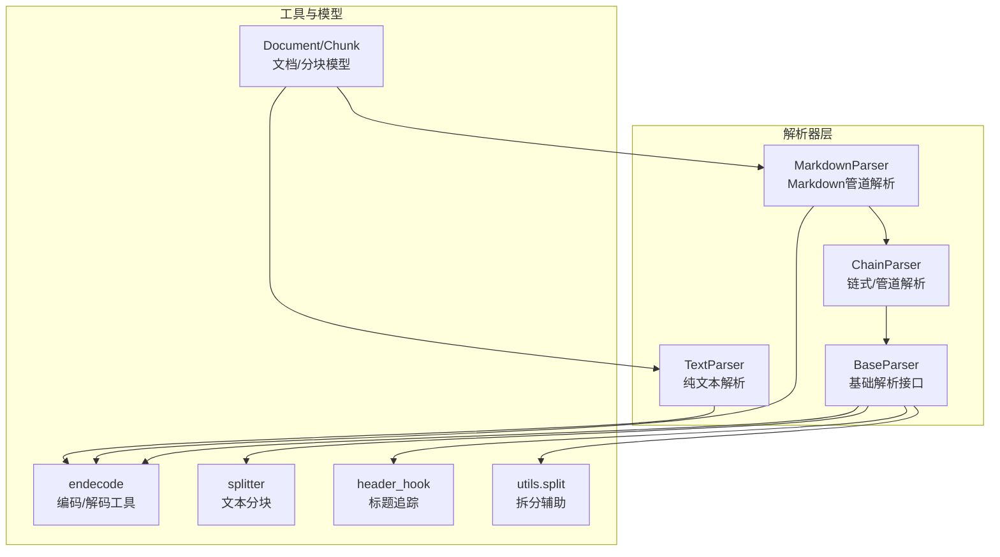
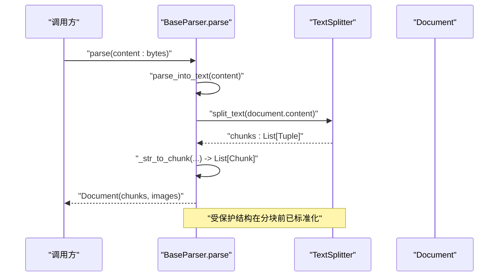
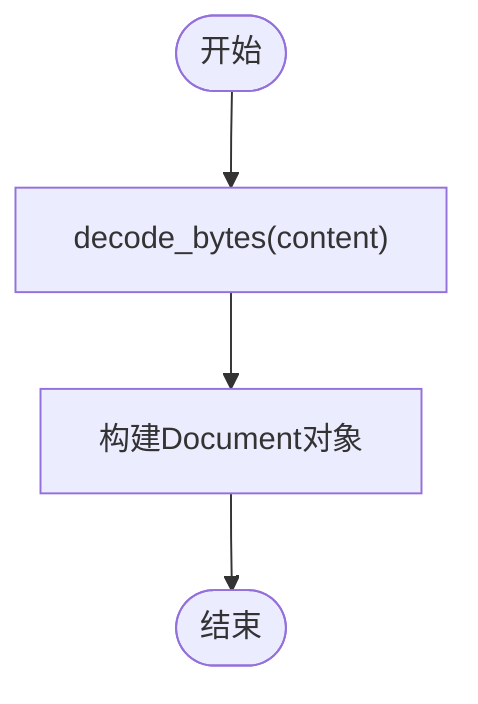
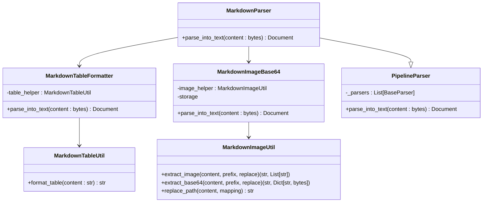
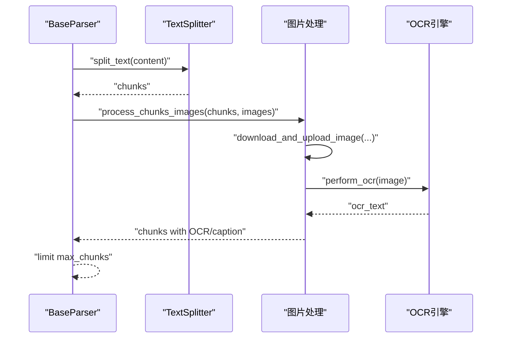
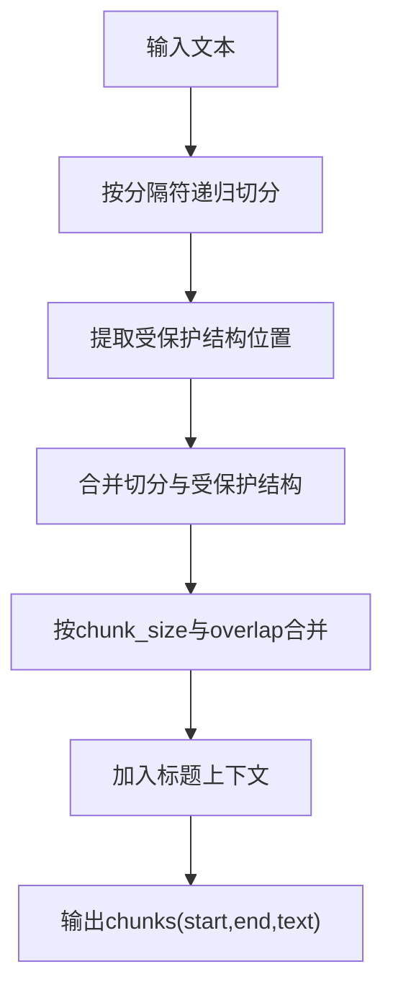
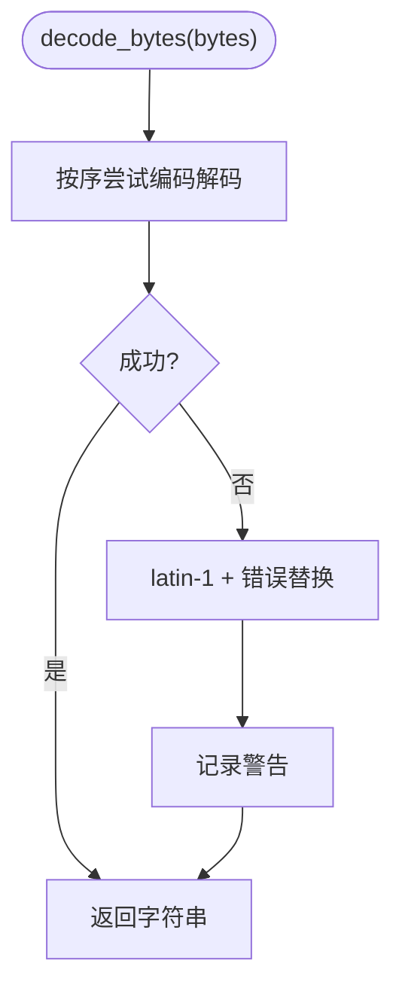
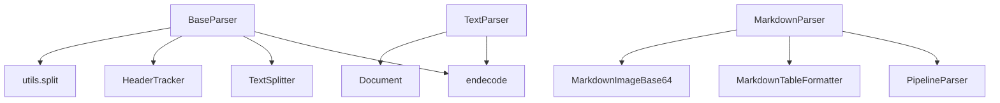

# 文本和Markdown解析器

<cite>
**本文档引用的文件**
- [docreader/parser/text_parser.py](file://docreader/parser/text_parser.py)
- [docreader/parser/markdown_parser.py](file://docreader/parser/markdown_parser.py)
- [docreader/parser/base_parser.py](file://docreader/parser/base_parser.py)
- [docreader/parser/chain_parser.py](file://docreader/parser/chain_parser.py)
- [docreader/utils/endecode.py](file://docreader/utils/endecode.py)
- [docreader/models/document.py](file://docreader/models/document.py)
- [docreader/splitter/splitter.py](file://docreader/splitter/splitter.py)
- [docreader/splitter/header_hook.py](file://docreader/splitter/header_hook.py)
- [docreader/utils/split.py](file://docreader/utils/split.py)
- [docreader/testdata/test.txt](file://docreader/testdata/test.txt)
- [docreader/testdata/test.md](file://docreader/testdata/test.md)
</cite>

## 目录
1. [简介](#简介)
2. [项目结构](#项目结构)
3. [核心组件](#核心组件)
4. [架构总览](#架构总览)
5. [详细组件分析](#详细组件分析)
6. [依赖关系分析](#依赖关系分析)
7. [性能考虑](#性能考虑)
8. [故障排查指南](#故障排查指南)
9. [结论](#结论)
10. [附录](#附录)

## 简介
本技术文档面向文本与Markdown解析器，系统阐述以下能力与实现细节：
- 纯文本文件的编码检测、换行符标准化与特殊字符处理机制
- Markdown解析器的语法树构建、HTML转换与代码高亮功能
- 文本预处理算法：URL提取、邮件地址识别与引用标记处理
- Markdown扩展语法支持、数学公式渲染与图表生成的技术实现
- 复杂Markdown文档结构的处理流程与最佳实践

本项目采用模块化设计，结合管道式解析与链式解析策略，确保在不同输入格式下均能稳定输出结构化的文本与图像映射。

## 项目结构
解析器相关代码主要位于docreader/parser目录，配合工具模块docreader/utils与分块模块docreader/splitter，形成“解码-预处理-分块-后处理”的完整流水线。

**图表来源**
- [docreader/parser/text_parser.py](file://docreader/parser/text_parser.py#L10-L34)
- [docreader/parser/markdown_parser.py](file://docreader/parser/markdown_parser.py#L413-L425)
- [docreader/parser/base_parser.py](file://docreader/parser/base_parser.py#L29-L186)
- [docreader/parser/chain_parser.py](file://docreader/parser/chain_parser.py#L94-L168)
- [docreader/utils/endecode.py](file://docreader/utils/endecode.py#L133-L197)
- [docreader/models/document.py](file://docreader/models/document.py#L62-L88)
- [docreader/splitter/splitter.py](file://docreader/splitter/splitter.py#L31-L144)
- [docreader/splitter/header_hook.py](file://docreader/splitter/header_hook.py#L67-L113)
- [docreader/utils/split.py](file://docreader/utils/split.py#L5-L81)

**章节来源**
- [docreader/parser/text_parser.py](file://docreader/parser/text_parser.py#L10-L34)
- [docreader/parser/markdown_parser.py](file://docreader/parser/markdown_parser.py#L413-L425)
- [docreader/parser/base_parser.py](file://docreader/parser/base_parser.py#L122-L186)
- [docreader/parser/chain_parser.py](file://docreader/parser/chain_parser.py#L94-L168)
- [docreader/utils/endecode.py](file://docreader/utils/endecode.py#L133-L197)
- [docreader/models/document.py](file://docreader/models/document.py#L62-L88)
- [docreader/splitter/splitter.py](file://docreader/splitter/splitter.py#L31-L144)
- [docreader/splitter/header_hook.py](file://docreader/splitter/header_hook.py#L67-L113)
- [docreader/utils/split.py](file://docreader/utils/split.py#L5-L81)

## 核心组件
- 编码解码工具：提供多编码自动检测与图像编解码能力，保障文本与图片的跨格式兼容。
- 基础解析器：定义统一接口与通用文本分块、图片处理、并发控制等能力。
- 纯文本解析器：对字节流进行编码检测，输出Document对象。
- Markdown解析器：通过管道方式依次执行表格格式化与Base64图片提取上传，输出标准化Markdown与图像映射。
- 文本分块器：支持受保护结构（表格、代码块、公式、行内图片/链接）的完整性保留与重叠拼接。
- 标题追踪器：在分块过程中维护上下文标题，提升检索与阅读体验。

**章节来源**
- [docreader/utils/endecode.py](file://docreader/utils/endecode.py#L133-L197)
- [docreader/parser/base_parser.py](file://docreader/parser/base_parser.py#L185-L460)
- [docreader/parser/text_parser.py](file://docreader/parser/text_parser.py#L16-L34)
- [docreader/parser/markdown_parser.py](file://docreader/parser/markdown_parser.py#L413-L425)
- [docreader/splitter/splitter.py](file://docreader/splitter/splitter.py#L116-L297)
- [docreader/splitter/header_hook.py](file://docreader/splitter/header_hook.py#L67-L113)

## 架构总览
解析器采用“基础接口 + 工具 + 分块 + 管道/链式”组合，确保可扩展与可维护性。

**图表来源**
- [docreader/parser/base_parser.py](file://docreader/parser/base_parser.py#L386-L460)
- [docreader/splitter/splitter.py](file://docreader/splitter/splitter.py#L116-L144)

**章节来源**
- [docreader/parser/base_parser.py](file://docreader/parser/base_parser.py#L386-L460)
- [docreader/splitter/splitter.py](file://docreader/splitter/splitter.py#L116-L144)

## 详细组件分析

### 纯文本解析器（TextParser）
- 职责：将原始字节流通过多编码自动检测解码为字符串，封装为Document对象。
- 关键点：
  - 使用统一的解码函数进行编码检测与回退策略。
  - 输出Document，后续由基础解析器负责分块与图片处理。

**图表来源**
- [docreader/parser/text_parser.py](file://docreader/parser/text_parser.py#L16-L34)
- [docreader/utils/endecode.py](file://docreader/utils/endecode.py#L133-L197)

**章节来源**
- [docreader/parser/text_parser.py](file://docreader/parser/text_parser.py#L16-L34)
- [docreader/utils/endecode.py](file://docreader/utils/endecode.py#L133-L197)

### Markdown解析器（MarkdownParser）
- 职责：通过管道解析Markdown，标准化表格格式并处理Base64图片。
- 管道阶段：
  - 表格格式化：统一列对齐与间距，保留缩进与对齐标记。
  - Base64图片处理：提取、解码、上传存储、替换为URL并返回图像映射。
- 输出：Document，包含标准化后的文本与图片映射。

**图表来源**
- [docreader/parser/markdown_parser.py](file://docreader/parser/markdown_parser.py#L413-L425)
- [docreader/parser/markdown_parser.py](file://docreader/parser/markdown_parser.py#L127-L161)
- [docreader/parser/markdown_parser.py](file://docreader/parser/markdown_parser.py#L350-L411)
- [docreader/parser/markdown_parser.py](file://docreader/parser/markdown_parser.py#L30-L104)
- [docreader/parser/markdown_parser.py](file://docreader/parser/markdown_parser.py#L163-L337)
- [docreader/parser/chain_parser.py](file://docreader/parser/chain_parser.py#L94-L168)

**章节来源**
- [docreader/parser/markdown_parser.py](file://docreader/parser/markdown_parser.py#L413-L425)
- [docreader/parser/markdown_parser.py](file://docreader/parser/markdown_parser.py#L127-L161)
- [docreader/parser/markdown_parser.py](file://docreader/parser/markdown_parser.py#L350-L411)
- [docreader/parser/markdown_parser.py](file://docreader/parser/markdown_parser.py#L30-L104)
- [docreader/parser/markdown_parser.py](file://docreader/parser/markdown_parser.py#L163-L337)
- [docreader/parser/chain_parser.py](file://docreader/parser/chain_parser.py#L94-L168)

### 基础解析器（BaseParser）
- 职责：统一解析入口、文本分块、图片下载/上传、OCR与并发控制。
- 关键能力：
  - 文本分块：保护结构完整性、重叠拼接、标题上下文维护。
  - 图片处理：安全URL校验、本地/远程/存储URL处理、并发限制与超时控制。
  - OCR：图像尺寸调整、引擎调用、异步处理与异常兜底。
- 输出：Document（content、images、chunks、metadata）。

**图表来源**
- [docreader/parser/base_parser.py](file://docreader/parser/base_parser.py#L386-L460)
- [docreader/parser/base_parser.py](file://docreader/parser/base_parser.py#L721-L800)
- [docreader/parser/base_parser.py](file://docreader/parser/base_parser.py#L197-L223)
- [docreader/splitter/splitter.py](file://docreader/splitter/splitter.py#L116-L144)

**章节来源**
- [docreader/parser/base_parser.py](file://docreader/parser/base_parser.py#L386-L460)
- [docreader/parser/base_parser.py](file://docreader/parser/base_parser.py#L721-L800)
- [docreader/parser/base_parser.py](file://docreader/parser/base_parser.py#L197-L223)
- [docreader/splitter/splitter.py](file://docreader/splitter/splitter.py#L116-L144)

### 文本分块器（TextSplitter）
- 职责：在保证受保护结构完整性的前提下，按分隔符与重叠策略生成分块。
- 受保护结构：数学公式、行内图片/链接、表格（表头与正文）、代码块。
- 标题追踪：在分块前缀中加入活跃标题，增强检索与阅读连贯性。

**图表来源**
- [docreader/splitter/splitter.py](file://docreader/splitter/splitter.py#L116-L297)
- [docreader/splitter/header_hook.py](file://docreader/splitter/header_hook.py#L67-L113)
- [docreader/utils/split.py](file://docreader/utils/split.py#L5-L81)

**章节来源**
- [docreader/splitter/splitter.py](file://docreader/splitter/splitter.py#L116-L297)
- [docreader/splitter/header_hook.py](file://docreader/splitter/header_hook.py#L67-L113)
- [docreader/utils/split.py](file://docreader/utils/split.py#L5-L81)

### 编码解码工具（endecode）
- 职责：提供多编码自动检测、图像编解码与字节串转换。
- 特性：优先尝试UTF-8、GB系列、Big5、ASCII、Latin-1；失败时以Latin-1替换回退并告警。

**图表来源**
- [docreader/utils/endecode.py](file://docreader/utils/endecode.py#L133-L197)

**章节来源**
- [docreader/utils/endecode.py](file://docreader/utils/endecode.py#L133-L197)

### 数据模型（Document/Chunk）
- Document：包含content、images、chunks、metadata，提供有效性判断。
- Chunk：包含content、seq、start、end、images、metadata，支持序列化与反序列化。

**章节来源**
- [docreader/models/document.py](file://docreader/models/document.py#L62-L88)

## 依赖关系分析
- 组件耦合：
  - BaseParser依赖endecode、splitter、header_hook、utils.split，形成解析核心。
  - MarkdownParser继承PipelineParser，组合MarkdownTableFormatter与MarkdownImageBase64。
  - TextParser直接依赖endecode与Document。
- 外部依赖：
  - 存储上传接口（storage.upload_bytes）用于图片持久化。
  - OCR引擎（OCREngine）用于图片文字识别。
  - 请求库（requests）用于远程图片下载与代理支持。

**图表来源**
- [docreader/parser/base_parser.py](file://docreader/parser/base_parser.py#L166-L184)
- [docreader/parser/chain_parser.py](file://docreader/parser/chain_parser.py#L94-L168)
- [docreader/parser/markdown_parser.py](file://docreader/parser/markdown_parser.py#L413-L425)
- [docreader/parser/text_parser.py](file://docreader/parser/text_parser.py#L16-L34)
- [docreader/models/document.py](file://docreader/models/document.py#L62-L88)

**章节来源**
- [docreader/parser/base_parser.py](file://docreader/parser/base_parser.py#L166-L184)
- [docreader/parser/chain_parser.py](file://docreader/parser/chain_parser.py#L94-L168)
- [docreader/parser/markdown_parser.py](file://docreader/parser/markdown_parser.py#L413-L425)
- [docreader/parser/text_parser.py](file://docreader/parser/text_parser.py#L16-L34)
- [docreader/models/document.py](file://docreader/models/document.py#L62-L88)

## 性能考虑
- 并发与限流：通过信号量限制并发图片处理数量，避免资源耗尽。
- 超时控制：OCR与远程下载设置超时，防止阻塞。
- 图像尺寸控制：超过阈值自动缩放，降低OCR与传输成本。
- 分块策略：受保护结构优先，避免在公式、表格、代码块中间切分导致语义破坏。
- 回退与容错：编码检测失败时使用Latin-1替换回退，确保解析不中断。

[本节为通用性能建议，无需具体文件引用]

## 故障排查指南
- 编码问题：若出现乱码，检查输入编码是否在默认尝试列表中；必要时自定义编码列表。
- 图片处理失败：确认URL安全校验通过、代理配置正确、存储上传可用。
- 分块异常：检查受保护结构正则是否覆盖实际内容；必要时调整分隔符优先级。
- OCR失败：检查OCR引擎初始化状态与超时设置；对异常图片返回空结果以避免整体失败。

**章节来源**
- [docreader/utils/endecode.py](file://docreader/utils/endecode.py#L190-L197)
- [docreader/parser/base_parser.py](file://docreader/parser/base_parser.py#L74-L94)
- [docreader/parser/base_parser.py](file://docreader/parser/base_parser.py#L269-L275)
- [docreader/splitter/splitter.py](file://docreader/splitter/splitter.py#L309-L334)

## 结论
本解析器体系通过“编码解码 + 结构化分块 + 管道处理 + 并发控制”的设计，在保证Markdown结构完整性的同时，实现了对复杂文档的高质量解析与分块。结合图片处理与OCR能力，能够满足多模态文档的统一处理需求。建议在生产环境中根据业务场景调整分隔符、受保护结构与并发参数，以获得更优的吞吐与稳定性。

[本节为总结性内容，无需具体文件引用]

## 附录
- 示例输入参考：
  - 纯文本样例：docreader/testdata/test.txt
  - Markdown样例：docreader/testdata/test.md
- 最佳实践：
  - 在分块前先进行表格与公式等结构的标准化，减少切分错误。
  - 对大图进行尺寸控制与并发限制，避免内存与网络瓶颈。
  - 使用受保护结构正则覆盖常见Markdown元素，确保语义完整性。
  - 对外部URL进行安全校验，避免SSRF风险。

**章节来源**
- [docreader/testdata/test.txt](file://docreader/testdata/test.txt#L1-L16)
- [docreader/testdata/test.md](file://docreader/testdata/test.md#L1-L37)