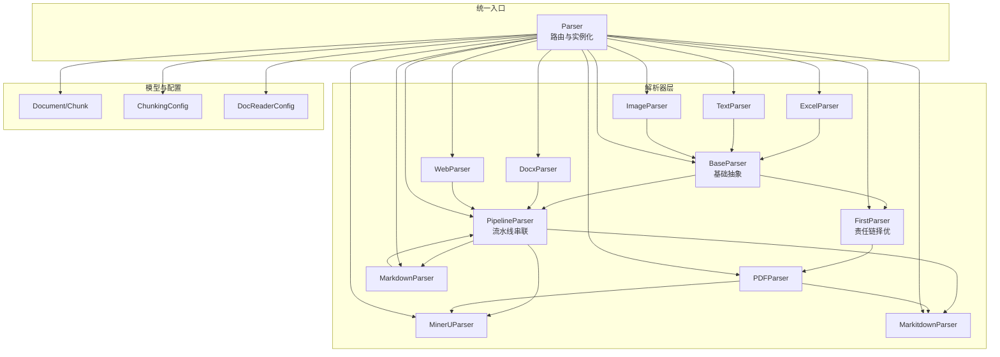
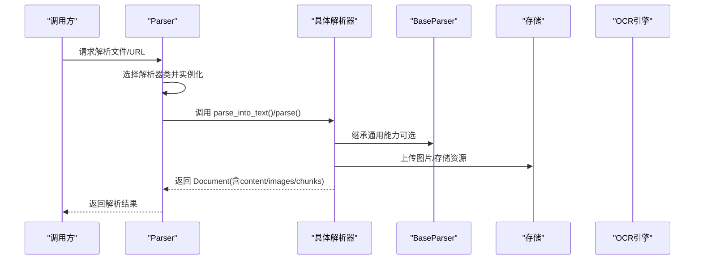
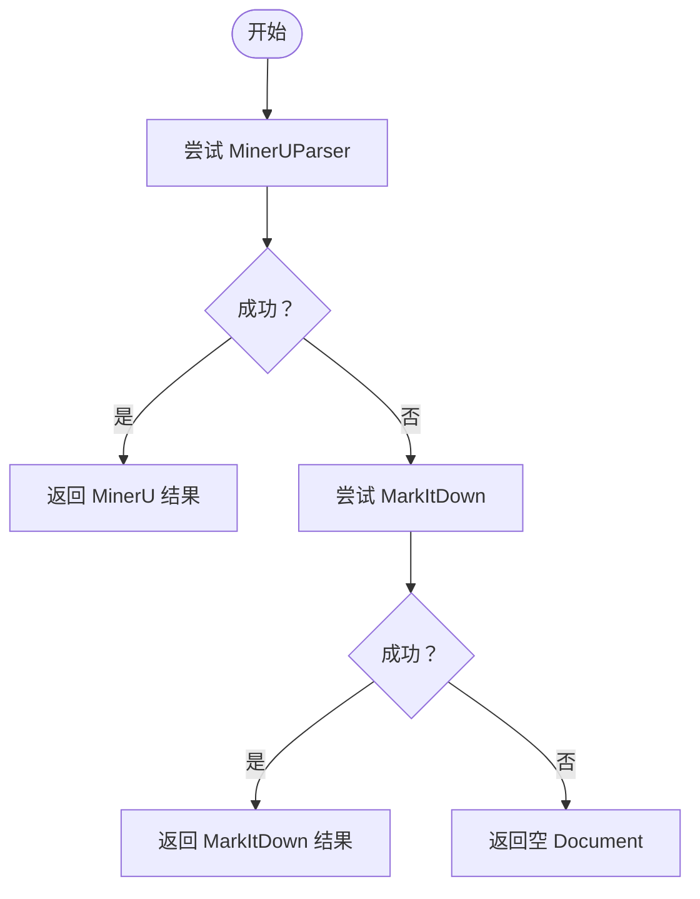
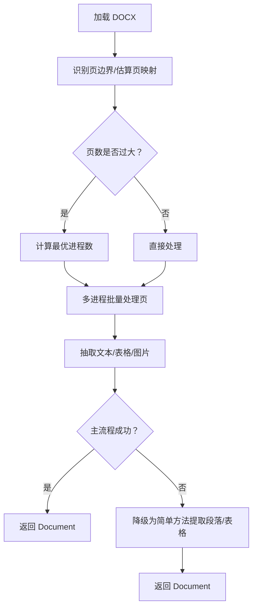
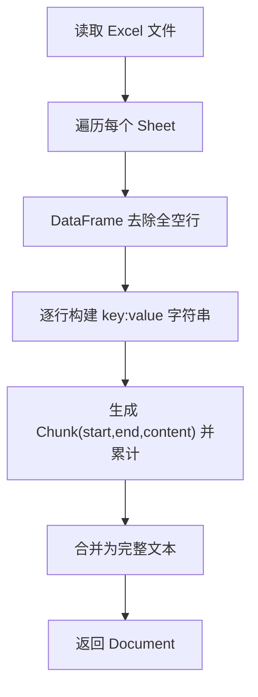
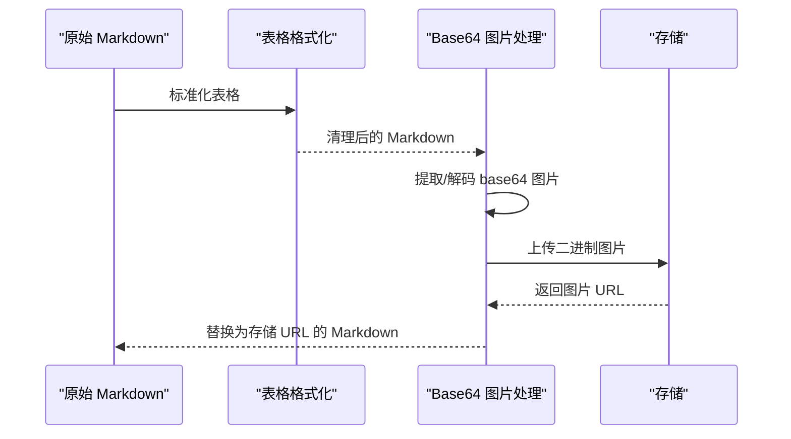
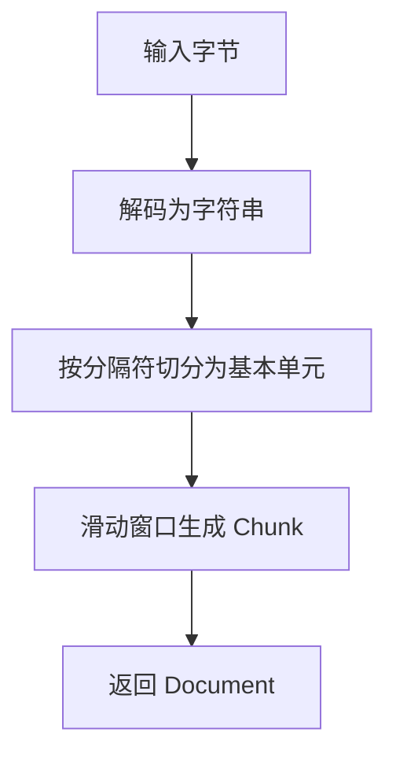
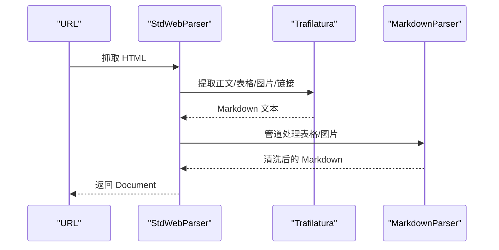
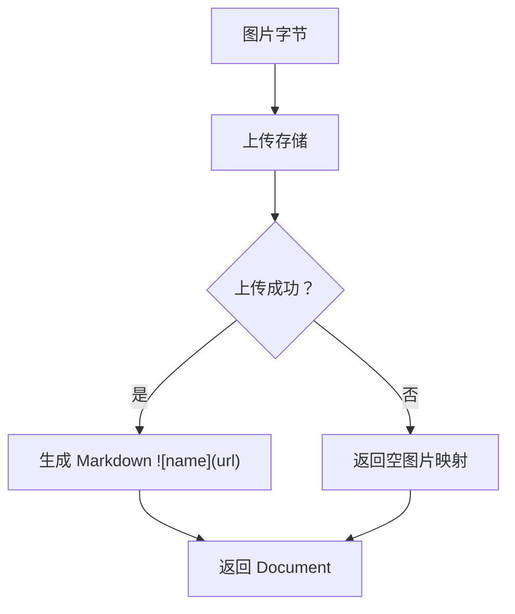
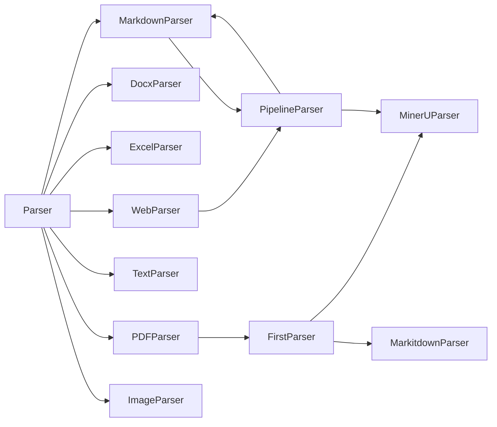

# 文档解析器

<cite>
**本文引用的文件**
- [docreader/parser/base_parser.py](file://docreader/parser/base_parser.py)
- [docreader/parser/chain_parser.py](file://docreader/parser/chain_parser.py)
- [docreader/parser/parser.py](file://docreader/parser/parser.py)
- [docreader/parser/pdf_parser.py](file://docreader/parser/pdf_parser.py)
- [docreader/parser/docx_parser.py](file://docreader/parser/docx_parser.py)
- [docreader/parser/excel_parser.py](file://docreader/parser/excel_parser.py)
- [docreader/parser/markdown_parser.py](file://docreader/parser/markdown_parser.py)
- [docreader/parser/text_parser.py](file://docreader/parser/text_parser.py)
- [docreader/parser/web_parser.py](file://docreader/parser/web_parser.py)
- [docreader/parser/image_parser.py](file://docreader/parser/image_parser.py)
- [docreader/parser/mineru_parser.py](file://docreader/parser/mineru_parser.py)
- [docreader/parser/markitdown_parser.py](file://docreader/parser/markitdown_parser.py)
- [docreader/models/document.py](file://docreader/models/document.py)
- [docreader/models/read_config.py](file://docreader/models/read_config.py)
- [docreader/config.py](file://docreader/config.py)
</cite>

## 目录
1. [简介](#简介)
2. [项目结构](#项目结构)
3. [核心组件](#核心组件)
4. [架构总览](#架构总览)
5. [详细组件分析](#详细组件分析)
6. [依赖分析](#依赖分析)
7. [性能考虑](#性能考虑)
8. [故障排查指南](#故障排查指南)
9. [结论](#结论)
10. [附录](#附录)

## 简介
本文件面向 WiseDx 文档解析器子系统，系统性梳理了多格式文档解析器的实现原理与设计模式，覆盖 PDF、Word、Excel、Markdown、Text、Web 页面、图片等格式。重点包括：
- BaseParser 基类的设计模式与继承关系
- 各解析器的特定处理逻辑（如 PDF 的页面提取、Word 的样式保留、Excel 的表格结构化、图片的元数据提取等）
- 配置参数、性能优化策略与错误处理机制
- 解析器扩展方法与最佳实践

## 项目结构
解析器模块位于 docreader/parser 下，采用“按职责分层 + 策略组合”的组织方式：
- 基类与通用能力：base_parser.py、chain_parser.py
- 具体解析器：pdf_parser.py、docx_parser.py、excel_parser.py、markdown_parser.py、text_parser.py、web_parser.py、image_parser.py、mineru_parser.py、markitdown_parser.py
- 统一入口与路由：parser.py
- 数据模型与配置：models/document.py、models/read_config.py、config.py

图表来源
- [docreader/parser/parser.py](file://docreader/parser/parser.py#L21-L179)
- [docreader/parser/base_parser.py](file://docreader/parser/base_parser.py#L29-L460)
- [docreader/parser/chain_parser.py](file://docreader/parser/chain_parser.py#L20-L177)
- [docreader/parser/pdf_parser.py](file://docreader/parser/pdf_parser.py#L6-L17)
- [docreader/parser/mineru_parser.py](file://docreader/parser/mineru_parser.py#L294-L303)
- [docreader/parser/markitdown_parser.py](file://docreader/parser/markitdown_parser.py#L45-L46)
- [docreader/parser/markdown_parser.py](file://docreader/parser/markdown_parser.py#L413-L426)
- [docreader/parser/web_parser.py](file://docreader/parser/web_parser.py#L116-L126)
- [docreader/parser/excel_parser.py](file://docreader/parser/excel_parser.py#L20-L98)
- [docreader/parser/docx_parser.py](file://docreader/parser/docx_parser.py#L52-L243)
- [docreader/parser/text_parser.py](file://docreader/parser/text_parser.py#L10-L35)
- [docreader/parser/image_parser.py](file://docreader/parser/image_parser.py#L12-L49)
- [docreader/models/document.py](file://docreader/models/document.py#L9-L88)
- [docreader/models/read_config.py](file://docreader/models/read_config.py#L4-L28)
- [docreader/config.py](file://docreader/config.py#L99-L221)

章节来源
- [docreader/parser/parser.py](file://docreader/parser/parser.py#L21-L179)

## 核心组件
- BaseParser 抽象基类：定义统一接口、通用 OCR/图像处理、文本切分与分块、图片抽取与上传、URL 安全校验等。
- ChainParser 责任链与流水线：FirstParser（择优）与 PipelineParser（串联），用于组合多个解析器。
- Parser 统一路由器：根据文件类型映射到具体解析器，注入 ChunkingConfig 与全局配置。

章节来源
- [docreader/parser/base_parser.py](file://docreader/parser/base_parser.py#L29-L460)
- [docreader/parser/chain_parser.py](file://docreader/parser/chain_parser.py#L20-L177)
- [docreader/parser/parser.py](file://docreader/parser/parser.py#L21-L179)

## 架构总览
解析流程从 Parser.get_parser 获取解析器实例，随后调用 parse() 完成内容解析与分块；若启用多模态，会在文本分块后对块内图片执行 OCR 与标题生成。

图表来源
- [docreader/parser/parser.py](file://docreader/parser/parser.py#L74-L179)
- [docreader/parser/base_parser.py](file://docreader/parser/base_parser.py#L386-L460)

## 详细组件分析

### BaseParser 基类与通用能力
- 设计模式
  - 抽象基类 + 模板方法：子类只需实现 parse_into_text，parse() 提供统一的分块与多模态处理流程。
  - 工厂/缓存：OCR 引擎单例缓存，避免重复初始化。
  - 责任链/流水线：通过 FirstParser/PipelineParser 组合不同解析器。
- 关键能力
  - URL 安全校验：限制协议、禁止私有/环回/元数据地址。
  - OCR：自动缩放、超时控制、并发限制、异常兜底。
  - 图像并发处理：信号量限流、异常隔离、资源释放。
  - 文本分块：保护表格/代码/公式/行内图片链接等结构，按分隔符切分并保留重叠。
  - 图片抽取与上传：从 Markdown/HTML 中抽取图片，上传至对象存储，替换为可访问 URL。
- 配置参数
  - chunk_size、chunk_overlap、separators、enable_multimodal、max_image_size、max_concurrent_tasks、max_chunks、ocr_backend、ocr_config、chunking_config 等。
- 错误处理
  - URL 校验失败直接返回；OCR 超时/异常记录日志并跳过；并发处理异常收集并返回空结果占位；最终 Document 校验有效性。

章节来源
- [docreader/parser/base_parser.py](file://docreader/parser/base_parser.py#L29-L460)
- [docreader/models/read_config.py](file://docreader/models/read_config.py#L4-L28)
- [docreader/config.py](file://docreader/config.py#L99-L221)

### PDF 解析器（PDFParser）
- 实现要点
  - 采用 FirstParser 责任链：MinerUParser（主）、MarkitdownParser（备选），首个成功者即返回。
  - MinerUParser：调用 MinerU API，返回 markdown 内容与图片，再做图片上传与路径替换。
  - MarkitdownParser：封装 markitdown 库，统一多种文档格式输出文本。
- 典型流程

图表来源
- [docreader/parser/pdf_parser.py](file://docreader/parser/pdf_parser.py#L6-L17)
- [docreader/parser/mineru_parser.py](file://docreader/parser/mineru_parser.py#L294-L303)
- [docreader/parser/markitdown_parser.py](file://docreader/parser/markitdown_parser.py#L45-L46)

章节来源
- [docreader/parser/pdf_parser.py](file://docreader/parser/pdf_parser.py#L6-L17)
- [docreader/parser/mineru_parser.py](file://docreader/parser/mineru_parser.py#L74-L168)
- [docreader/parser/markitdown_parser.py](file://docreader/parser/markitdown_parser.py#L27-L42)

### Word 解析器（DocxParser）
- 实现要点
  - 主流程：DocxProcessor 并行处理各页，支持大文档的进程池拆分与临时文件共享。
  - 页面识别：启发式估算与标准扫描两种策略，自动限制最大页数。
  - 图片处理：提取嵌入图片，上传存储，生成 base64 映射；支持多进程并发。
  - 回退策略：若主流程失败，降级为简单方法遍历段落与表格提取文本。
- 关键流程

图表来源
- [docreader/parser/docx_parser.py](file://docreader/parser/docx_parser.py#L430-L800)

章节来源
- [docreader/parser/docx_parser.py](file://docreader/parser/docx_parser.py#L52-L243)
- [docreader/parser/docx_parser.py](file://docreader/parser/docx_parser.py#L430-L800)

### Excel 解析器（ExcelParser）
- 实现要点
  - 使用 pandas 读取多工作表，去除全空行，逐行转为“列名: 值”格式，拼接为文本并生成 Chunk 列表。
  - 保持跨表顺序，便于后续检索与定位。
- 典型流程

图表来源
- [docreader/parser/excel_parser.py](file://docreader/parser/excel_parser.py#L43-L98)

章节来源
- [docreader/parser/excel_parser.py](file://docreader/parser/excel_parser.py#L20-L98)

### Markdown 解析器（MarkdownParser）
- 组件构成
  - MarkdownTableFormatter：标准化表格格式（对齐、间距、缩进）。
  - MarkdownImageBase64：提取/上传 base64 图片，替换为存储 URL。
  - MarkdownParser：管道串联上述两个阶段。
- 典型流程

图表来源
- [docreader/parser/markdown_parser.py](file://docreader/parser/markdown_parser.py#L127-L161)
- [docreader/parser/markdown_parser.py](file://docreader/parser/markdown_parser.py#L350-L411)
- [docreader/parser/markdown_parser.py](file://docreader/parser/markdown_parser.py#L413-L426)

章节来源
- [docreader/parser/markdown_parser.py](file://docreader/parser/markdown_parser.py#L127-L161)
- [docreader/parser/markdown_parser.py](file://docreader/parser/markdown_parser.py#L350-L411)
- [docreader/parser/markdown_parser.py](file://docreader/parser/markdown_parser.py#L413-L426)

### Text 解析器（TextParser）
- 实现要点
  - 直接解码字节为文本，走统一分块逻辑，适合纯文本场景。
- 典型流程

图表来源
- [docreader/parser/text_parser.py](file://docreader/parser/text_parser.py#L16-L35)

章节来源
- [docreader/parser/text_parser.py](file://docreader/parser/text_parser.py#L10-L35)

### Web 页面解析器（WebParser）
- 实现要点
  - StdWebParser：Playwright + WebKit 抓取 HTML，Trafilatura 提取正文并转为 Markdown，支持代理。
  - WebParser：StdWebParser + MarkdownParser 管道。
- 典型流程

图表来源
- [docreader/parser/web_parser.py](file://docreader/parser/web_parser.py#L38-L114)
- [docreader/parser/web_parser.py](file://docreader/parser/web_parser.py#L116-L126)

章节来源
- [docreader/parser/web_parser.py](file://docreader/parser/web_parser.py#L17-L126)

### 图片解析器（ImageParser）
- 实现要点
  - 上传图片到存储，生成 Markdown 图片引用，返回 base64 映射。
  - 适用于独立图片文件解析。
- 典型流程

图表来源
- [docreader/parser/image_parser.py](file://docreader/parser/image_parser.py#L24-L49)

章节来源
- [docreader/parser/image_parser.py](file://docreader/parser/image_parser.py#L12-L49)

### 统一路由与扩展
- Parser 路由
  - 依据文件扩展名映射到对应解析器，支持 docx/doc/pdf/md/txt/jpg/png/gif/bmp/tiff/webp/csv/xlsx/xls 等。
  - 支持 parse_file 与 parse_url 两类入口。
- 扩展新解析器
  - 新建类继承 BaseParser 或在合适场景使用 FirstParser/PipelineParser 组合。
  - 在 Parser.parsers 中注册扩展名到类的映射。
  - 若需多模态，确保 parse_into_text 返回 Document，并在 parse() 中触发图片处理流程。

章节来源
- [docreader/parser/parser.py](file://docreader/parser/parser.py#L27-L73)
- [docreader/parser/parser.py](file://docreader/parser/parser.py#L74-L179)

## 依赖分析
- 组件耦合
  - Parser 对各解析器类存在静态映射，耦合度中等；通过类构造注入配置降低运行时耦合。
  - BaseParser 依赖 OCR、存储、分词/切分工具，形成通用能力中心。
  - ChainParser 仅依赖 BaseParser 接口，具备良好可扩展性。
- 外部依赖
  - PDF：MinerU API、MarkItDown
  - Web：Playwright、Trafilatura
  - 图片：Pillow、对象存储 SDK
  - 文本：正则、分词与切分工具

图表来源
- [docreader/parser/parser.py](file://docreader/parser/parser.py#L27-L50)
- [docreader/parser/pdf_parser.py](file://docreader/parser/pdf_parser.py#L6-L17)
- [docreader/parser/web_parser.py](file://docreader/parser/web_parser.py#L116-L126)
- [docreader/parser/mineru_parser.py](file://docreader/parser/mineru_parser.py#L294-L303)
- [docreader/parser/markitdown_parser.py](file://docreader/parser/markitdown_parser.py#L45-L46)
- [docreader/parser/markdown_parser.py](file://docreader/parser/markdown_parser.py#L413-L426)

## 性能考虑
- 并发与限流
  - BaseParser 使用 asyncio.Semaphore 控制图像并发，避免内存与 GPU 资源耗尽。
  - DocxParser 动态计算进程数，结合文档大小与图片数量，减少上下文切换开销。
- 缩放与裁剪
  - 图像自动缩放到最大尺寸阈值，显著降低 OCR 与编码成本。
- 分块策略
  - 保护结构（表格/代码/公式/行内图片）不被切分，提升检索质量。
  - overlap 保留语义连续性，但需平衡召回与性能。
- 存储与网络
  - 统一对象存储上传，减少本地磁盘 IO；远程图片下载前进行 URL 安全校验与代理设置。
- 失败快速回退
  - PDF 责任链择优；Word 主流程失败自动降级；OCR 超时/异常不阻塞整体流程。

[本节为通用指导，无需列出章节来源]

## 故障排查指南
- URL 安全校验失败
  - 现象：远程图片或网页抓取被拒绝。
  - 处理：检查代理配置、域名白名单、私有/环回地址过滤规则。
- OCR 超时/失败
  - 现象：图像处理卡住或报错。
  - 处理：缩短 max_image_size、降低并发、检查 OCR 后端可用性与鉴权。
- PDF 解析为空
  - 现象：MinerU/MarkItDown 返回空内容。
  - 处理：确认 API 可达性、切换备用解析器、检查文件格式与页数限制。
- Word 大文档内存溢出
  - 现象：CPU 占用高、内存飙升。
  - 处理：减小 max_pages、调整进程数、启用临时文件共享。
- 图片上传失败
  - 现象：返回空 URL 或映射缺失。
  - 处理：检查存储配置、桶权限、路径前缀；确认文件扩展名正确。

章节来源
- [docreader/parser/base_parser.py](file://docreader/parser/base_parser.py#L37-L94)
- [docreader/parser/base_parser.py](file://docreader/parser/base_parser.py#L197-L222)
- [docreader/parser/base_parser.py](file://docreader/parser/base_parser.py#L246-L357)
- [docreader/parser/mineru_parser.py](file://docreader/parser/mineru_parser.py#L55-L73)
- [docreader/parser/web_parser.py](file://docreader/parser/web_parser.py#L38-L84)
- [docreader/parser/docx_parser.py](file://docreader/parser/docx_parser.py#L646-L666)

## 结论
WiseDx 文档解析器以 BaseParser 为核心，结合 ChainParser 的责任链与流水线模式，实现了对多格式文档的稳定解析与高质量分块。通过统一的配置体系、并发控制与错误兜底，系统在准确性与性能之间取得平衡。扩展新解析器的成本低，易于集成第三方库与服务。

[本节为总结性内容，无需列出章节来源]

## 附录

### 配置参数一览
- ChunkingConfig
  - chunk_size、chunk_overlap、separators、enable_multimodal、storage_config、vlm_config
- DocReaderConfig（环境变量前缀 DOCREADER_）
  - gRPC、图像并发、代理、OCR/VLM、存储（COS/MinIO/Local）、MinerU 端点等

章节来源
- [docreader/models/read_config.py](file://docreader/models/read_config.py#L4-L28)
- [docreader/config.py](file://docreader/config.py#L99-L221)

### 数据模型
- Document：content、images、chunks、metadata
- Chunk：content、seq、start、end、images、metadata

章节来源
- [docreader/models/document.py](file://docreader/models/document.py#L62-L88)