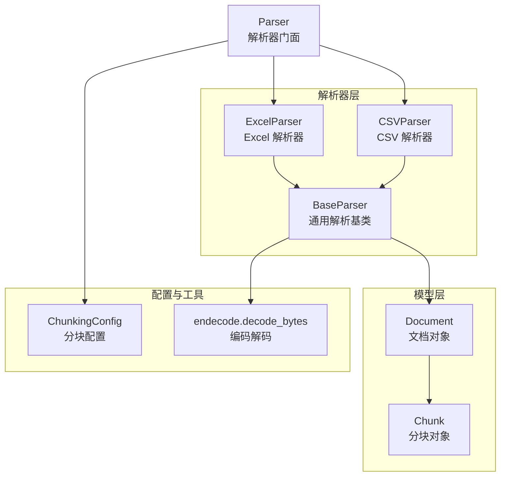
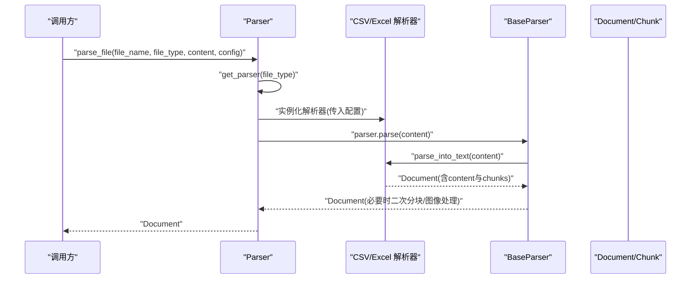
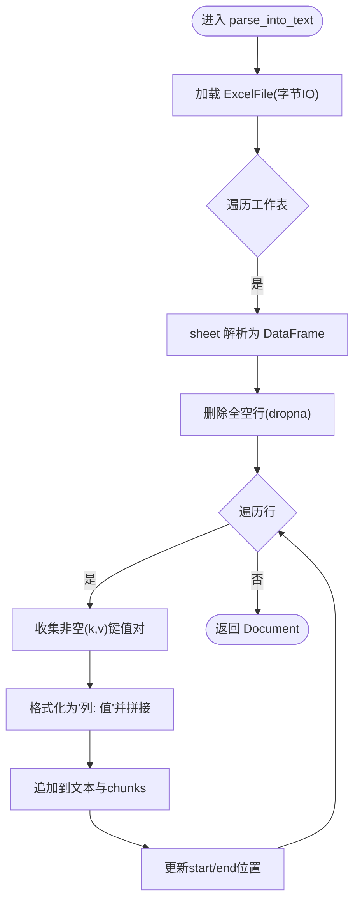
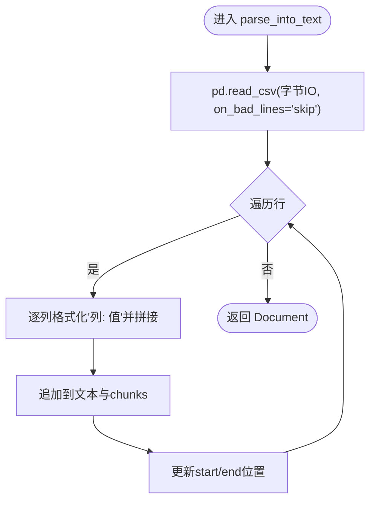
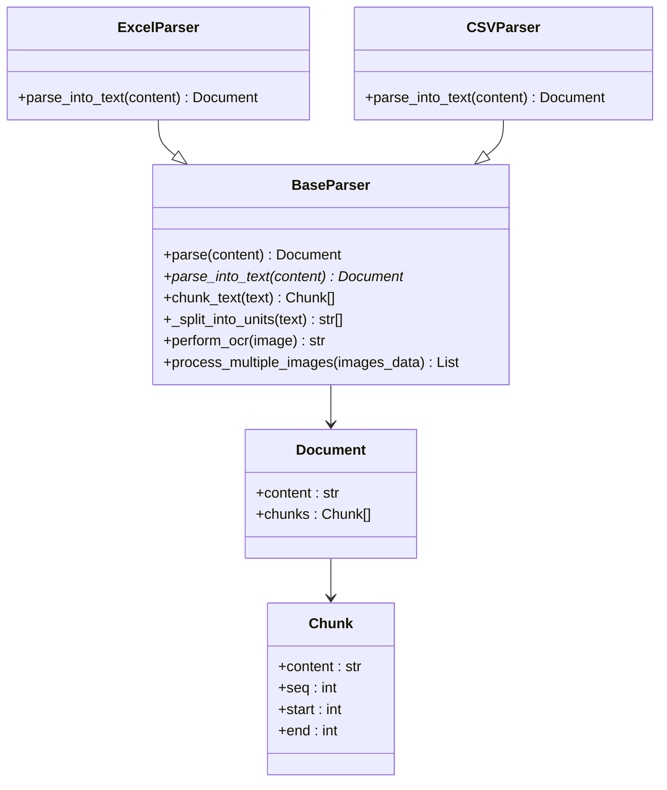
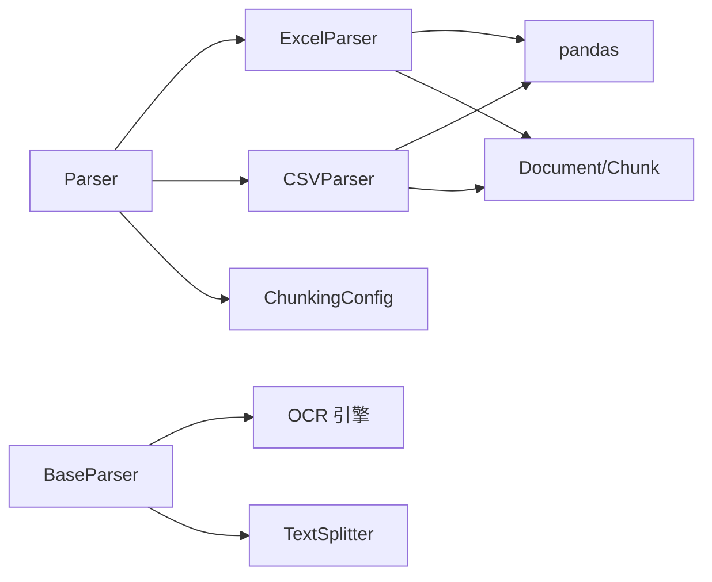
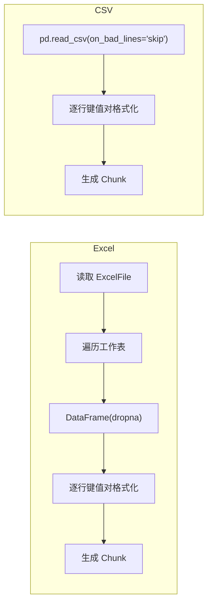

# 电子表格解析器

<cite>
**本文引用的文件**
- [docreader/parser/excel_parser.py](file://docreader/parser/excel_parser.py)
- [docreader/parser/csv_parser.py](file://docreader/parser/csv_parser.py)
- [docreader/parser/base_parser.py](file://docreader/parser/base_parser.py)
- [docreader/parser/parser.py](file://docreader/parser/parser.py)
- [docreader/models/document.py](file://docreader/models/document.py)
- [docreader/models/read_config.py](file://docreader/models/read_config.py)
- [docreader/utils/endecode.py](file://docreader/utils/endecode.py)
- [docreader/pyproject.toml](file://docreader/pyproject.toml)
</cite>

## 目录
1. [简介](#简介)
2. [项目结构](#项目结构)
3. [核心组件](#核心组件)
4. [架构总览](#架构总览)
5. [组件详解](#组件详解)
6. [依赖关系分析](#依赖关系分析)
7. [性能考量](#性能考量)
8. [故障排查指南](#故障排查指南)
9. [结论](#结论)
10. [附录](#附录)

## 简介
本技术文档聚焦于电子表格解析器的设计与实现，覆盖 Excel 与 CSV 文件的结构化数据提取流程。重点包括：
- 行列键值对构建、空值与空行处理、顺序与位置追踪
- 多工作表遍历与拼接策略
- 条件格式与图表数据的提取现状与扩展建议
- CSV 分隔符检测、编码识别与“坏行跳过”机制
- 大数据文件的流式处理思路与内存管理最佳实践
- 数据清洗、行列标题识别、复杂数据透视表与嵌套表格的处理建议
- 性能优化与并发控制策略

## 项目结构
电子表格解析器位于 docreader 子模块中，采用“统一入口 + 多解析器适配”的架构设计，Excel 与 CSV 解析器均继承自通用基类，遵循统一的解析接口与文档模型。

**图表来源**
- [docreader/parser/parser.py](file://docreader/parser/parser.py#L21-L179)
- [docreader/parser/excel_parser.py](file://docreader/parser/excel_parser.py#L20-L97)
- [docreader/parser/csv_parser.py](file://docreader/parser/csv_parser.py#L20-L84)
- [docreader/parser/base_parser.py](file://docreader/parser/base_parser.py#L29-L460)
- [docreader/models/document.py](file://docreader/models/document.py#L62-L88)
- [docreader/models/read_config.py](file://docreader/models/read_config.py#L4-L28)
- [docreader/utils/endecode.py](file://docreader/utils/endecode.py#L144-L197)

**章节来源**
- [docreader/parser/parser.py](file://docreader/parser/parser.py#L21-L179)
- [docreader/parser/excel_parser.py](file://docreader/parser/excel_parser.py#L20-L97)
- [docreader/parser/csv_parser.py](file://docreader/parser/csv_parser.py#L20-L84)
- [docreader/parser/base_parser.py](file://docreader/parser/base_parser.py#L29-L460)
- [docreader/models/document.py](file://docreader/models/document.py#L62-L88)
- [docreader/models/read_config.py](file://docreader/models/read_config.py#L4-L28)
- [docreader/utils/endecode.py](file://docreader/utils/endecode.py#L144-L197)

## 核心组件
- 统一门面 Parser：根据文件类型选择具体解析器，注入分块配置与并发参数，统一返回 Document。
- 基类 BaseParser：提供 OCR、图像处理、文本分块、结构化单位保护等通用能力；子类只需实现 parse_into_text 即可。
- ExcelParser：按工作表逐表解析，丢弃全空行，将每行转为“列名: 值”的键值串，逐行生成 Chunk。
- CSVParser：读取 CSV 为 DataFrame，逐行格式化为键值串，自动跳过“坏行”，逐行生成 Chunk。
- 文档模型 Document/Chunk：承载文本内容、分块序列、位置信息与元数据。
- 配置 ChunkingConfig：控制分块大小、重叠、分隔符与是否启用多模态。
- 编码工具 endecode.decode_bytes：提供多编码尝试与回退策略，辅助 CSV/文本解码。

**章节来源**
- [docreader/parser/parser.py](file://docreader/parser/parser.py#L27-L131)
- [docreader/parser/base_parser.py](file://docreader/parser/base_parser.py#L122-L184)
- [docreader/parser/excel_parser.py](file://docreader/parser/excel_parser.py#L43-L97)
- [docreader/parser/csv_parser.py](file://docreader/parser/csv_parser.py#L37-L84)
- [docreader/models/document.py](file://docreader/models/document.py#L9-L88)
- [docreader/models/read_config.py](file://docreader/models/read_config.py#L4-L28)
- [docreader/utils/endecode.py](file://docreader/utils/endecode.py#L144-L197)

## 架构总览
下图展示了从文件类型到具体解析器再到文档输出的整体流程。

**图表来源**
- [docreader/parser/parser.py](file://docreader/parser/parser.py#L74-L131)
- [docreader/parser/base_parser.py](file://docreader/parser/base_parser.py#L386-L459)
- [docreader/parser/excel_parser.py](file://docreader/parser/excel_parser.py#L43-L97)
- [docreader/parser/csv_parser.py](file://docreader/parser/csv_parser.py#L37-L84)

## 组件详解

### Excel 解析器（ExcelParser）
- 多工作表处理：通过 pandas ExcelFile 遍历 sheet_names，逐表解析为 DataFrame。
- 空行过滤：使用 dropna(how="all") 过滤完全为空的行。
- 键值对构建：遍历每行，仅保留非空值，格式化为“列名: 值”，逗号连接后换行。
- 分块策略：逐行生成 Chunk，维护 start/end 位置与 seq 序列，保证跨表顺序一致。
- 返回结构：Document(content=拼接文本, chunks=按行生成的 Chunk 列表)。

**图表来源**
- [docreader/parser/excel_parser.py](file://docreader/parser/excel_parser.py#L43-L97)

**章节来源**
- [docreader/parser/excel_parser.py](file://docreader/parser/excel_parser.py#L20-L97)

### CSV 解析器（CSVParser）
- DataFrame 读取：使用 pandas.read_csv，设置 on_bad_lines="skip" 跳过“坏行”。
- 键值对构建：对每列执行 strip 并格式化为“列: 值”，逗号连接后换行。
- 分块策略：逐行生成 Chunk，记录位置与序号。
- 编码支持：CSV 内容通常由 pandas 读取，若需外部解码可结合 endecode.decode_bytes 的多编码尝试策略。

**图表来源**
- [docreader/parser/csv_parser.py](file://docreader/parser/csv_parser.py#L37-L84)

**章节来源**
- [docreader/parser/csv_parser.py](file://docreader/parser/csv_parser.py#L20-L84)

### 基类与通用能力（BaseParser）
- 统一接口：子类必须实现 parse_into_text，返回 Document。
- 文本分块：提供 _split_into_units 保护表格/代码/公式/图片等结构，再按 chunk_size 与 chunk_overlap 生成 Chunk。
- 图像处理：支持 OCR 与异步并发处理，限制最大并发数，超时与异常兜底。
- 多模态：根据文件类型决定是否进行图像处理与标题生成。
- 配置注入：从 ChunkingConfig 获取分块参数、存储与视觉语言模型配置。

**图表来源**
- [docreader/parser/base_parser.py](file://docreader/parser/base_parser.py#L29-L460)
- [docreader/parser/excel_parser.py](file://docreader/parser/excel_parser.py#L20-L97)
- [docreader/parser/csv_parser.py](file://docreader/parser/csv_parser.py#L20-L84)
- [docreader/models/document.py](file://docreader/models/document.py#L9-L88)

**章节来源**
- [docreader/parser/base_parser.py](file://docreader/parser/base_parser.py#L122-L460)

### 文档与分块模型（Document/Chunk）
- Document：包含 content、chunks、images、metadata 字段，提供 set_content/get_content/is_valid 等方法。
- Chunk：包含 content、seq、start、end、images、metadata，支持 to_dict/to_json/from_dict/from_json。

**章节来源**
- [docreader/models/document.py](file://docreader/models/document.py#L9-L88)

### 解析门面（Parser）
- 类型映射：docx/pdf/md/txt/jpg/png/gif/bmp/tiff/webp/csv/xlsx/xls。
- 实例化：根据 file_type 获取解析器类，注入 ChunkingConfig、OCR 后端、并发上限等参数。
- 执行：调用 parser.parse(content)，返回 Document。

**章节来源**
- [docreader/parser/parser.py](file://docreader/parser/parser.py#L27-L131)

### 编码识别与文本解码（endecode.decode_bytes）
- 多编码尝试：按优先级尝试 utf-8、gb18030、gb2312、gbk、big5、ascii、latin-1。
- 回退策略：若全部失败，使用 latin-1 + 错误替换并记录警告。
- 适用场景：当 CSV/文本来源编码未知或混合时，可先用该函数解码，再交给 pandas 或解析器。

**章节来源**
- [docreader/utils/endecode.py](file://docreader/utils/endecode.py#L144-L197)

## 依赖关系分析
- ExcelParser/CSVParser 依赖 pandas（ExcelFile、read_csv），用于结构化解析。
- BaseParser 提供 OCR、图像处理、文本分块等通用能力，被各解析器复用。
- Parser 门面负责类型路由与配置注入，屏蔽上层差异。
- 文档模型与分块配置为跨解析器共享的数据契约。

**图表来源**
- [docreader/parser/excel_parser.py](file://docreader/parser/excel_parser.py#L12-L14)
- [docreader/parser/csv_parser.py](file://docreader/parser/csv_parser.py#L12-L14)
- [docreader/parser/base_parser.py](file://docreader/parser/base_parser.py#L185-L460)
- [docreader/parser/parser.py](file://docreader/parser/parser.py#L27-L50)
- [docreader/models/read_config.py](file://docreader/models/read_config.py#L4-L28)
- [docreader/models/document.py](file://docreader/models/document.py#L9-L88)

**章节来源**
- [docreader/pyproject.toml](file://docreader/pyproject.toml#L7-L38)
- [docreader/parser/excel_parser.py](file://docreader/parser/excel_parser.py#L12-L14)
- [docreader/parser/csv_parser.py](file://docreader/parser/csv_parser.py#L12-L14)
- [docreader/parser/base_parser.py](file://docreader/parser/base_parser.py#L185-L460)
- [docreader/parser/parser.py](file://docreader/parser/parser.py#L27-L50)
- [docreader/models/read_config.py](file://docreader/models/read_config.py#L4-L28)
- [docreader/models/document.py](file://docreader/models/document.py#L9-L88)

## 性能考量
- Pandas 读取：Excel/CSV 读取为内存驻留，大文件需关注内存峰值；可通过分块读取（CSV）或分表处理（Excel）缓解。
- 文本分块：BaseParser 的 chunk_text 已考虑结构保护与重叠，合理设置 chunk_size 与 chunk_overlap 可平衡检索精度与吞吐。
- 图像处理：异步并发与信号量限制最大并发，超时保护避免阻塞；对超大图像进行尺寸压缩。
- 编码解码：多编码尝试存在多次解码开销，建议在上游已知编码时直接传递正确编码给 pandas。
- I/O 与网络：下载远程图片时带代理与超时，避免阻塞；本地文件直传可减少一次网络往返。

[本节为通用性能建议，无需特定文件引用]

## 故障排查指南
- Excel/CSV 读取失败
  - 确认文件字节流有效且未损坏。
  - ExcelParser 使用 pandas ExcelFile，CSVParser 使用 pandas read_csv；如报错，检查文件格式与版本兼容性。
- “坏行”导致数据缺失（CSV）
  - CSVParser 已启用 on_bad_lines="skip"，若仍缺行，检查输入格式与分隔符一致性。
- 编码问题（中文乱码）
  - 使用 endecode.decode_bytes 进行多编码尝试与回退。
- 图像处理异常
  - BaseParser 的异步处理包含超时与异常兜底；检查 OCR 后端可用性与网络代理配置。
- 分块数量过多
  - 通过 ChunkingConfig 的 max_chunks 限制返回分块数量。

**章节来源**
- [docreader/parser/csv_parser.py](file://docreader/parser/csv_parser.py#L52-L55)
- [docreader/utils/endecode.py](file://docreader/utils/endecode.py#L180-L197)
- [docreader/parser/base_parser.py](file://docreader/parser/base_parser.py#L246-L356)
- [docreader/models/read_config.py](file://docreader/models/read_config.py#L11-L15)

## 结论
本电子表格解析器以简洁高效的策略实现了 Excel 与 CSV 的结构化提取：Excel 多工作表遍历与空行过滤、CSV 坏行跳过与键值对格式化、统一的 Document/Chunk 输出与可配置的分块策略。结合 BaseParser 的通用能力，系统具备良好的扩展性与稳定性。对于复杂场景（条件格式/图表/数据透视表/嵌套表格），可在现有键值对基础上引入更细粒度的结构化建模与规则引擎，以满足业务需求。

[本节为总结，无需特定文件引用]

## 附录

### Excel/CSV 解析流程对比

**图表来源**
- [docreader/parser/excel_parser.py](file://docreader/parser/excel_parser.py#L63-L97)
- [docreader/parser/csv_parser.py](file://docreader/parser/csv_parser.py#L60-L84)

### 数据清洗与空值处理建议
- 空值处理：ExcelParser/CSVParser 已跳过空值，后续可按列类型进行类型推断与默认值填充。
- 行列标题识别：可基于首行去空白/去重策略识别标题行；对重复列名进行重命名。
- 复杂表格：对嵌套表格与合并单元格，建议在键值对基础上引入“层级路径”字段，记录列路径与行路径，便于后续重建结构。

[本小节为通用建议，无需特定文件引用]

### 条件格式与图表数据提取现状与扩展
- 现状：当前解析器专注于结构化文本提取，未直接解析条件格式与图表数据。
- 扩展建议：
  - 条件格式：可借助第三方库读取样式信息，结合键值对标注“样式标记”字段。
  - 图表数据：可抽取图表关联的源数据区域，与键值对合并，形成“可视化数据源”索引。
  - 数据透视表：建议在键值对中保留“维度/指标”层级，或导出为宽表/长表两种视图。

[本小节为概念性扩展建议，无需特定文件引用]