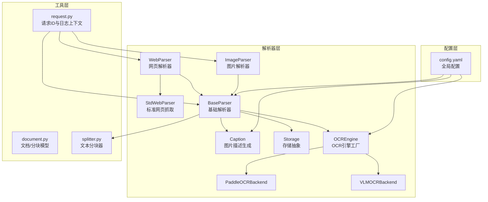
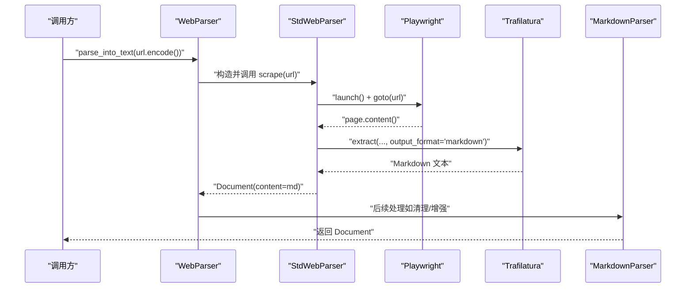
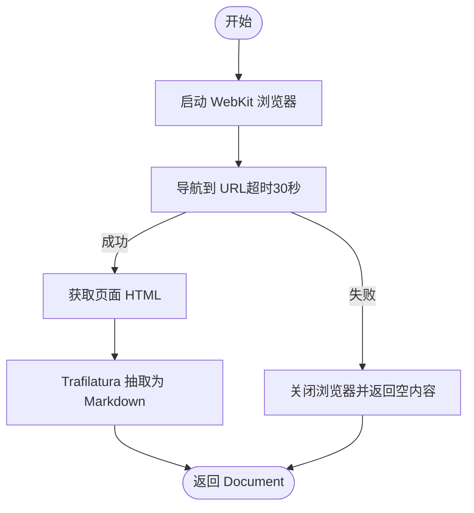
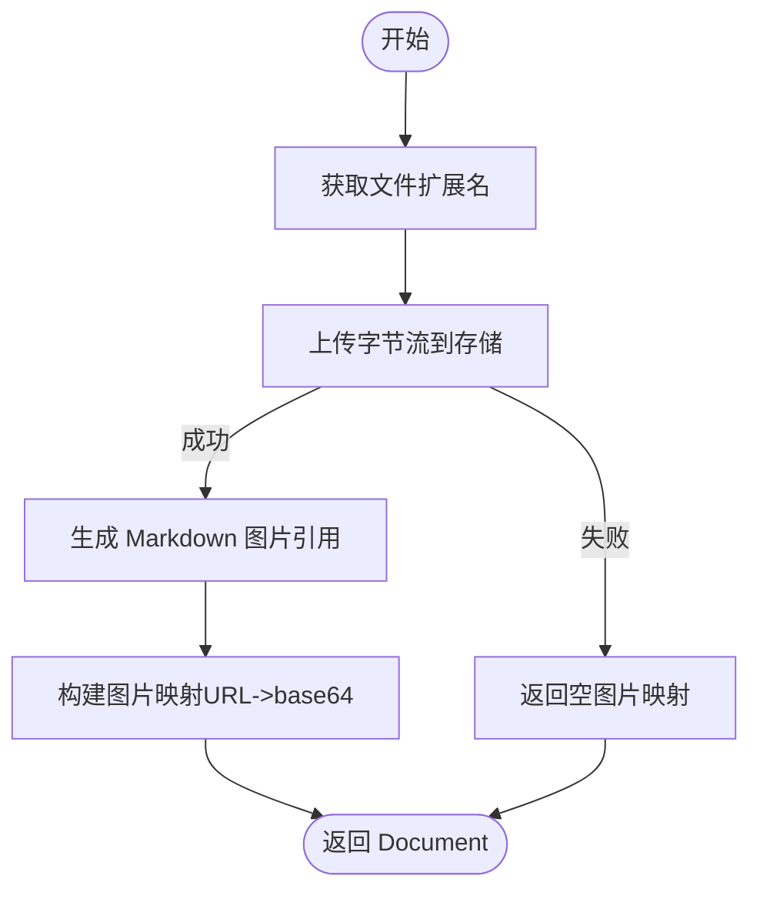
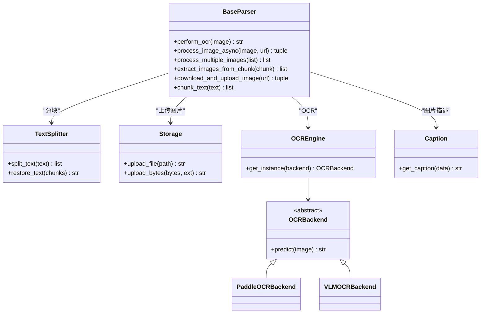
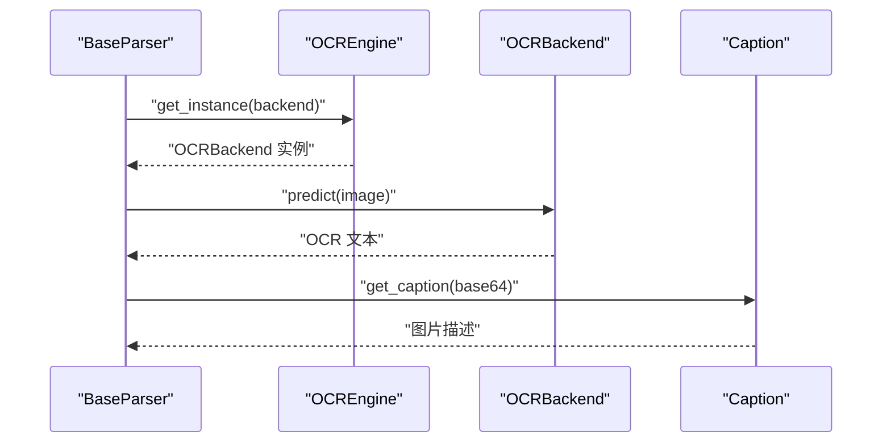
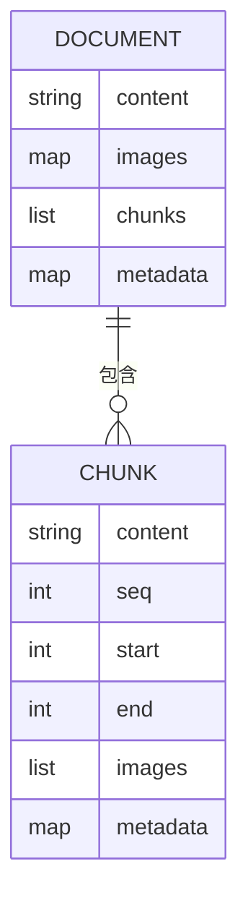
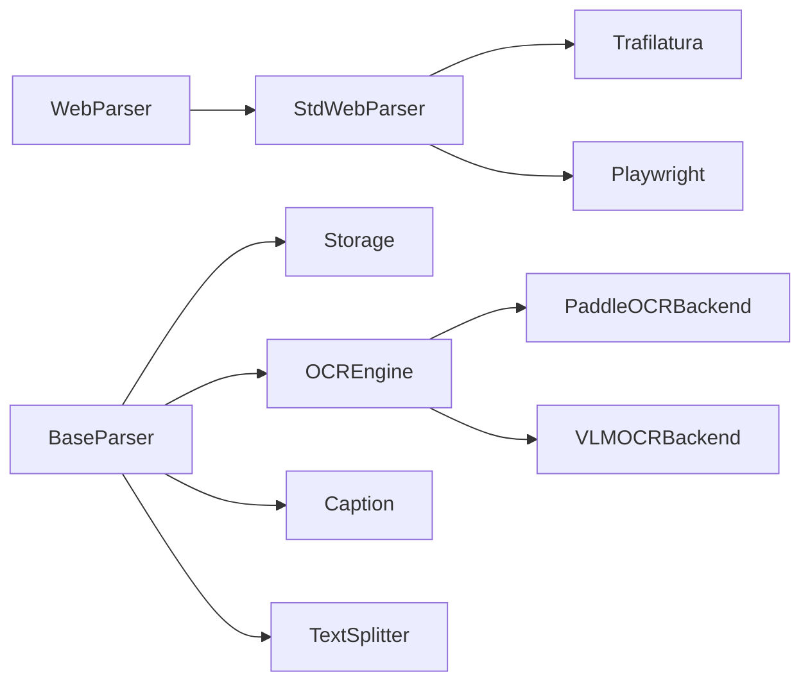

# 网页和图片解析器

<cite>
**本文引用的文件**
- [docreader/parser/web_parser.py](file://docreader/parser/web_parser.py)
- [docreader/parser/image_parser.py](file://docreader/parser/image_parser.py)
- [docreader/parser/base_parser.py](file://docreader/parser/base_parser.py)
- [docreader/models/document.py](file://docreader/models/document.py)
- [docreader/ocr/base.py](file://docreader/ocr/base.py)
- [docreader/ocr/paddle.py](file://docreader/ocr/paddle.py)
- [docreader/ocr/vlm.py](file://docreader/ocr/vlm.py)
- [docreader/parser/caption.py](file://docreader/parser/caption.py)
- [docreader/parser/storage.py](file://docreader/parser/storage.py)
- [docreader/splitter/splitter.py](file://docreader/splitter/splitter.py)
- [docreader/utils/request.py](file://docreader/utils/request.py)
- [config/config.yaml](file://config/config.yaml)
- [docreader/testdata/test.html](file://docreader/testdata/test.html)
</cite>

## 目录
1. [简介](#简介)
2. [项目结构](#项目结构)
3. [核心组件](#核心组件)
4. [架构总览](#架构总览)
5. [详细组件分析](#详细组件分析)
6. [依赖分析](#依赖分析)
7. [性能考量](#性能考量)
8. [故障排查指南](#故障排查指南)
9. [结论](#结论)
10. [附录](#附录)

## 简介
本技术文档聚焦于网页与图片解析器的设计与实现，涵盖以下关键能力：
- 网页解析：基于 Playwright 的动态渲染与 Trafilatura 的内容抽取，支持代理、超时控制与错误恢复。
- 图片解析：统一的图像处理流程，支持上传存储、OCR 文字识别、视觉语言模型（VLM）生成图片描述、图片质量与尺寸控制。
- 内容分块：在保持 Markdown 结构完整性的同时进行智能分块，支持重叠与保护区域（表格、代码块、图片、链接等）。
- 可观测性与可维护性：统一的日志上下文、请求 ID、毫秒级时间戳格式化与异常处理。

## 项目结构
本项目采用“解析器层 + 工具层 + 配置层”的分层设计：
- 解析器层：网页解析器、图片解析器、基础解析器、分块器、存储抽象、OCR 引擎、VLM 描述生成。
- 工具层：日志上下文、请求 ID、编码解码工具。
- 配置层：全局配置与提示模板。

**图表来源**
- [docreader/parser/web_parser.py](file://docreader/parser/web_parser.py#L17-L127)
- [docreader/parser/image_parser.py](file://docreader/parser/image_parser.py#L12-L49)
- [docreader/parser/base_parser.py](file://docreader/parser/base_parser.py#L29-L460)
- [docreader/parser/caption.py](file://docreader/parser/caption.py#L173-L388)
- [docreader/parser/storage.py](file://docreader/parser/storage.py#L19-L447)
- [docreader/ocr/__init__.py](file://docreader/ocr/__init__.py#L12-L38)
- [docreader/ocr/paddle.py](file://docreader/ocr/paddle.py#L16-L176)
- [docreader/ocr/vlm.py](file://docreader/ocr/vlm.py#L14-L88)
- [docreader/splitter/splitter.py](file://docreader/splitter/splitter.py#L31-L585)
- [docreader/utils/request.py](file://docreader/utils/request.py#L17-L150)
- [config/config.yaml](file://config/config.yaml#L507-L513)

**章节来源**
- [docreader/parser/web_parser.py](file://docreader/parser/web_parser.py#L17-L127)
- [docreader/parser/image_parser.py](file://docreader/parser/image_parser.py#L12-L49)
- [docreader/parser/base_parser.py](file://docreader/parser/base_parser.py#L29-L460)
- [docreader/parser/caption.py](file://docreader/parser/caption.py#L173-L388)
- [docreader/parser/storage.py](file://docreader/parser/storage.py#L19-L447)
- [docreader/ocr/__init__.py](file://docreader/ocr/__init__.py#L12-L38)
- [docreader/ocr/paddle.py](file://docreader/ocr/paddle.py#L16-L176)
- [docreader/ocr/vlm.py](file://docreader/ocr/vlm.py#L14-L88)
- [docreader/splitter/splitter.py](file://docreader/splitter/splitter.py#L31-L585)
- [docreader/utils/request.py](file://docreader/utils/request.py#L17-L150)
- [config/config.yaml](file://config/config.yaml#L507-L513)

## 核心组件
- 网页解析器（WebParser/StdWebParser）
  - 使用 Playwright WebKit 渲染页面，Trafilatura 提取正文、图片、表格、链接，输出 Markdown。
  - 支持代理、超时、错误处理与日志记录。
- 图片解析器（ImageParser）
  - 将图片上传至对象存储，生成 Markdown 图片引用与 base64 映射，便于后续 OCR 与描述生成。
- 基础解析器（BaseParser）
  - 统一的 OCR、图片处理并发控制、分块、图像提取与上传、SSRF 防护、URL 校验。
  - 提供异步图片处理与并发信号量控制，保障稳定性。
- OCR 引擎（OCREngine/PaddleOCR/VLM）
  - 工厂模式管理 OCR 后端实例，支持 PaddleOCR 与 VLM（OpenAI 兼容接口）。
- 图片描述（Caption）
  - 基于 VLM 的图片描述生成，支持 Ollama 与 OpenAI 兼容接口。
- 存储抽象（Storage）
  - 支持 COS、MinIO、本地文件系统、Base64 内联与 Dummy 存储。
- 文本分块（TextSplitter）
  - 保护 Markdown 结构（表格、代码块、图片、链接）与分隔符，支持重叠与头部上下文保留。

**章节来源**
- [docreader/parser/web_parser.py](file://docreader/parser/web_parser.py#L17-L127)
- [docreader/parser/image_parser.py](file://docreader/parser/image_parser.py#L12-L49)
- [docreader/parser/base_parser.py](file://docreader/parser/base_parser.py#L29-L460)
- [docreader/ocr/__init__.py](file://docreader/ocr/__init__.py#L12-L38)
- [docreader/ocr/paddle.py](file://docreader/ocr/paddle.py#L16-L176)
- [docreader/ocr/vlm.py](file://docreader/ocr/vlm.py#L14-L88)
- [docreader/parser/caption.py](file://docreader/parser/caption.py#L173-L388)
- [docreader/parser/storage.py](file://docreader/parser/storage.py#L19-L447)
- [docreader/splitter/splitter.py](file://docreader/splitter/splitter.py#L31-L585)

## 架构总览
网页与图片解析器遵循“管道式”与“模块化”设计：
- 管道解析：WebParser 将 StdWebParser（抓取+HTML转Markdown）与 MarkdownParser（后续处理）串联。
- 多模态处理：BaseParser 在分块后扫描 Markdown 中的图片引用，下载/上传并并发执行 OCR 与图片描述生成。
- 存储与并发：统一存储抽象屏蔽后端差异；并发信号量控制 OCR/VLM 调用，避免资源争用。

**图表来源**
- [docreader/parser/web_parser.py](file://docreader/parser/web_parser.py#L38-L114)

**章节来源**
- [docreader/parser/web_parser.py](file://docreader/parser/web_parser.py#L116-L127)

## 详细组件分析

### 网页解析器（WebParser/StdWebParser）
- 抓取策略
  - 使用 Playwright WebKit 启动浏览器，设置可选代理，导航到目标 URL，等待 30 秒超时。
  - 获取页面完整 HTML，返回给上层解析器。
- 内容抽取
  - 使用 Trafilatura 将 HTML 转换为 Markdown，保留元数据、图片、表格与链接。
- 错误处理
  - 导航失败或抓取异常时返回空内容或错误文档，避免中断流程。
- 日志与可观测性
  - 记录抓取阶段各步骤耗时与结果，便于定位问题。

**图表来源**
- [docreader/parser/web_parser.py](file://docreader/parser/web_parser.py#L38-L114)

**章节来源**
- [docreader/parser/web_parser.py](file://docreader/parser/web_parser.py#L17-L127)

### 图片解析器（ImageParser）
- 功能概述
  - 上传图片到对象存储，生成 Markdown 图片引用与 base64 映射，便于后续处理。
- 处理流程
  - 读取文件扩展名，调用存储上传接口，返回可访问 URL。
  - 生成 Markdown 图片语法与图片映射，封装为 Document 返回。

**图表来源**
- [docreader/parser/image_parser.py](file://docreader/parser/image_parser.py#L24-L49)

**章节来源**
- [docreader/parser/image_parser.py](file://docreader/parser/image_parser.py#L12-L49)

### 基础解析器（BaseParser）与多模态处理
- OCR 与图片处理
  - 统一入口 perform_ocr，支持图片尺寸限制（默认最大 1920），避免大图导致内存与性能问题。
  - 异步并发处理：process_image_async + process_multiple_images，结合 asyncio.Semaphore 控制并发度。
  - 资源管理：自动关闭 PIL 图像对象，防止内存泄漏。
- 图片提取与上传
  - extract_images_from_chunk：从分块文本中提取 Markdown/HTML 图片引用。
  - download_and_upload_image：支持远程 URL、COS/MinIO 存储 URL 与本地路径，内置 SSRF 校验。
- 分块与结构保护
  - TextSplitter 保护表格、代码块、图片、链接等结构，按分隔符智能切分并保留重叠。
- 配置与能力开关
  - enable_multimodal、max_concurrent_tasks、max_chunks、ocr_backend 等参数集中管理。

**图表来源**
- [docreader/parser/base_parser.py](file://docreader/parser/base_parser.py#L197-L460)
- [docreader/splitter/splitter.py](file://docreader/splitter/splitter.py#L116-L585)
- [docreader/parser/storage.py](file://docreader/parser/storage.py#L19-L447)
- [docreader/ocr/__init__.py](file://docreader/ocr/__init__.py#L12-L38)
- [docreader/ocr/base.py](file://docreader/ocr/base.py#L10-L32)
- [docreader/ocr/paddle.py](file://docreader/ocr/paddle.py#L16-L176)
- [docreader/ocr/vlm.py](file://docreader/ocr/vlm.py#L14-L88)
- [docreader/parser/caption.py](file://docreader/parser/caption.py#L173-L388)

**章节来源**
- [docreader/parser/base_parser.py](file://docreader/parser/base_parser.py#L197-L460)
- [docreader/splitter/splitter.py](file://docreader/splitter/splitter.py#L116-L585)
- [docreader/parser/storage.py](file://docreader/parser/storage.py#L19-L447)
- [docreader/ocr/__init__.py](file://docreader/ocr/__init__.py#L12-L38)
- [docreader/ocr/base.py](file://docreader/ocr/base.py#L10-L32)
- [docreader/ocr/paddle.py](file://docreader/ocr/paddle.py#L16-L176)
- [docreader/ocr/vlm.py](file://docreader/ocr/vlm.py#L14-L88)
- [docreader/parser/caption.py](file://docreader/parser/caption.py#L173-L388)

### OCR 引擎与图片描述（Caption）
- OCR 引擎工厂
  - OCREngine 通过线程安全的单例缓存不同后端实例，避免重复初始化。
  - 支持 paddle、vlm 与 dummy 后端，默认 dummy。
- PaddleOCR 后端
  - CPU 模式运行，自动检测 AVX 指令集并降级兼容；支持中文识别与文档方向分类。
- VLM OCR 后端
  - 使用 OpenAI 兼容接口，发送 base64 图片与提示词，返回结构化文本（表格用 HTML、公式用 LaTeX）。
- 图片描述（Caption）
  - 支持 Ollama 与 OpenAI 兼容接口，统一响应结构，提取首条候选内容。

**图表来源**
- [docreader/ocr/__init__.py](file://docreader/ocr/__init__.py#L12-L38)
- [docreader/ocr/paddle.py](file://docreader/ocr/paddle.py#L16-L176)
- [docreader/ocr/vlm.py](file://docreader/ocr/vlm.py#L14-L88)
- [docreader/parser/caption.py](file://docreader/parser/caption.py#L218-L388)

**章节来源**
- [docreader/ocr/__init__.py](file://docreader/ocr/__init__.py#L12-L38)
- [docreader/ocr/paddle.py](file://docreader/ocr/paddle.py#L16-L176)
- [docreader/ocr/vlm.py](file://docreader/ocr/vlm.py#L14-L88)
- [docreader/parser/caption.py](file://docreader/parser/caption.py#L173-L388)

### 文档与分块模型（Document/Chunk）
- Document
  - 包含 content、images、chunks、metadata 字段，支持序列化与校验。
- Chunk
  - 包含 content、seq、start、end、images、metadata，支持序列化与哈希比较。
- 分块策略
  - TextSplitter 保护 Markdown 结构，按分隔符递归切分，支持重叠与头部上下文保留，最终恢复原文。

**图表来源**
- [docreader/models/document.py](file://docreader/models/document.py#L62-L88)
- [docreader/splitter/splitter.py](file://docreader/splitter/splitter.py#L116-L585)

**章节来源**
- [docreader/models/document.py](file://docreader/models/document.py#L62-L88)
- [docreader/splitter/splitter.py](file://docreader/splitter/splitter.py#L116-L585)

## 依赖分析
- 组件耦合
  - WebParser 依赖 StdWebParser 与 MarkdownParser；StdWebParser 依赖 Playwright 与 Trafilatura。
  - BaseParser 依赖 Storage、OCREngine、Caption、TextSplitter，形成多模态处理闭环。
  - OCR 引擎工厂统一管理后端实例，降低外部依赖耦合。
- 外部依赖
  - Playwright（WebKit）、Trafilatura（HTML->Markdown）、Pillow（图像处理）、requests（HTTP 下载）、MinIO/COS SDK、OpenAI/Ollama 客户端。
- 潜在循环依赖
  - 通过模块导入与延迟初始化避免循环依赖；工厂类（OCREngine）与抽象类（OCRBackend）降低耦合。

**图表来源**
- [docreader/parser/web_parser.py](file://docreader/parser/web_parser.py#L17-L127)
- [docreader/parser/base_parser.py](file://docreader/parser/base_parser.py#L29-L460)
- [docreader/ocr/__init__.py](file://docreader/ocr/__init__.py#L12-L38)

**章节来源**
- [docreader/parser/web_parser.py](file://docreader/parser/web_parser.py#L17-L127)
- [docreader/parser/base_parser.py](file://docreader/parser/base_parser.py#L29-L460)
- [docreader/ocr/__init__.py](file://docreader/ocr/__init__.py#L12-L38)

## 性能考量
- 并发控制
  - 使用 asyncio.Semaphore 控制并发图片处理任务，避免 OCR/VLM 后端过载。
- 图像尺寸限制
  - 默认最大边长 1920，自动缩放避免大图带来的内存与计算压力。
- 分块策略
  - TextSplitter 保护结构与分隔符，减少无效切分；重叠保留上下文，提升检索质量。
- 存储与网络
  - 统一存储抽象，支持多种后端；远程图片下载时使用代理与超时控制，避免阻塞。
- 日志与可观测性
  - 请求 ID 与毫秒级时间戳，便于追踪与性能分析。

[本节为通用指导，无需特定文件引用]

## 故障排查指南
- 网页抓取失败
  - 检查代理配置、超时设置与目标站点可访问性；查看日志中导航错误与浏览器关闭记录。
- OCR 无法初始化
  - PaddleOCR：检查 CPU 指令集支持与依赖安装；确认禁用 GPU 并设置 CPU 设备。
  - VLM OCR：检查 API Key、Base URL 与模型名称；确认网络可达与超时设置。
- 图片上传失败
  - 检查存储后端配置（COS/MinIO/本地）与权限；确认对象键生成与 URL 拼接。
- 并发异常
  - 调整 max_concurrent_tasks；确保异常任务不会导致整体失败；关注资源释放与图像对象关闭。
- SSRF 防护
  - BaseParser 的 URL 校验会拒绝私有/保留 IP 与受限主机名，检查输入 URL 是否合规。

**章节来源**
- [docreader/parser/web_parser.py](file://docreader/parser/web_parser.py#L38-L114)
- [docreader/ocr/paddle.py](file://docreader/ocr/paddle.py#L95-L117)
- [docreader/ocr/vlm.py](file://docreader/ocr/vlm.py#L50-L88)
- [docreader/parser/storage.py](file://docreader/parser/storage.py#L43-L447)
- [docreader/parser/base_parser.py](file://docreader/parser/base_parser.py#L35-L94)

## 结论
本解析器体系以“管道 + 多模态 + 分块 + 存储抽象”为核心，实现了网页与图片的高质量解析与处理。通过并发控制、结构保护与统一日志，系统在复杂网页与多格式图片场景下具备良好的稳定性与可维护性。建议在生产环境中结合配置文件与日志上下文进行持续监控与优化。

[本节为总结，无需特定文件引用]

## 附录

### 配置项与最佳实践
- 多模态与分块
  - enable_multimodal、chunk_size、chunk_overlap、max_chunks、max_concurrent_tasks。
- OCR 后端
  - ocr_backend（paddle/vlm/dummy）、ocr_config（后端特定参数）。
- 存储后端
  - storage_type（minio/cos/local/base64/dummy），按需配置访问密钥与桶名。
- VLM/Caption
  - vlm_model_base_url、vlm_model_name、vlm_model_api_key、vlm_interface_type（ollama/openai）。
- OCR 模型
  - ocr_model、ocr_api_key、ocr_api_base_url。

**章节来源**
- [config/config.yaml](file://config/config.yaml#L507-L513)

### 示例与测试
- 测试 HTML
  - 包含图片、链接、代码块、表格与分块测试段落，可用于验证分块与结构保护效果。
  
**章节来源**
- [docreader/testdata/test.html](file://docreader/testdata/test.html#L1-L56)