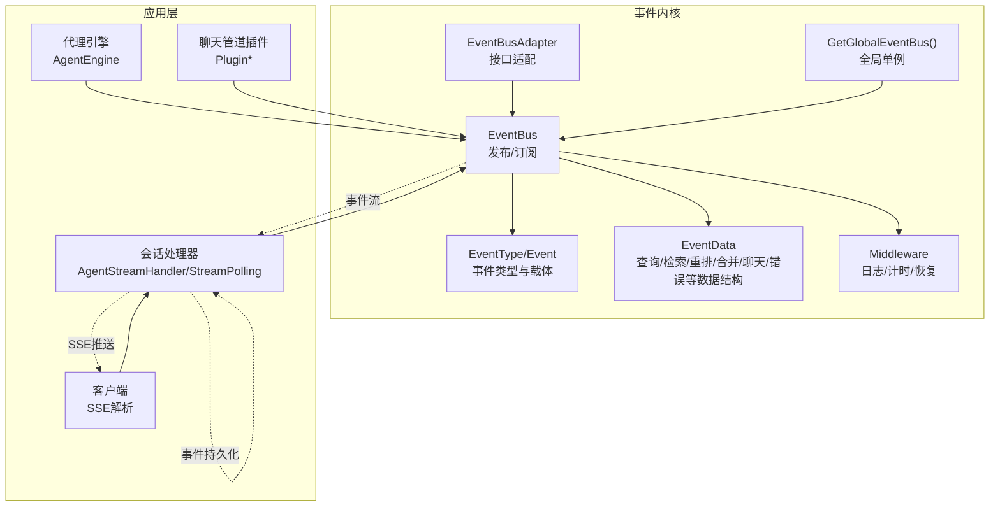
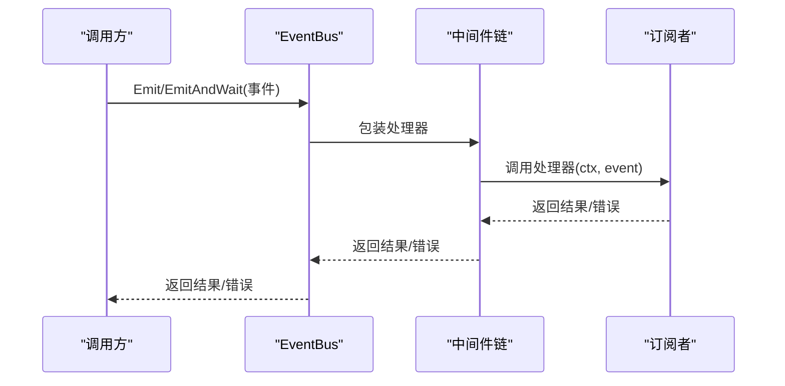
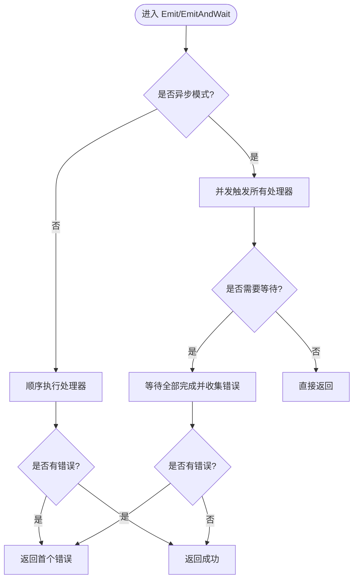
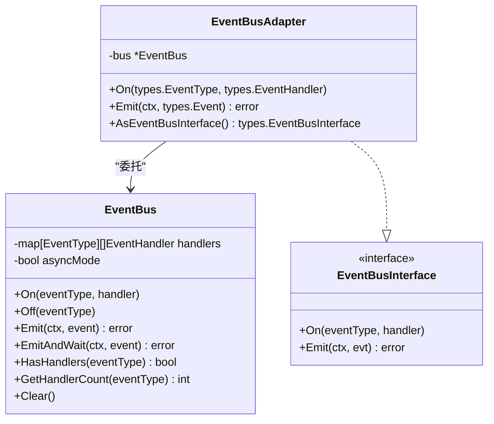
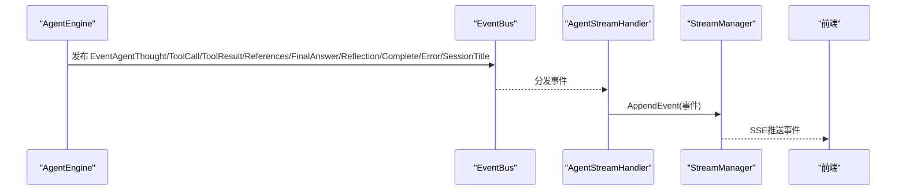
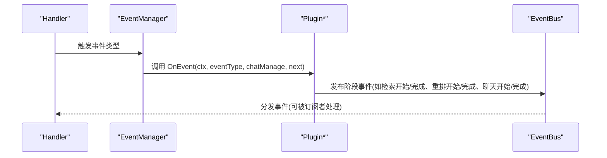
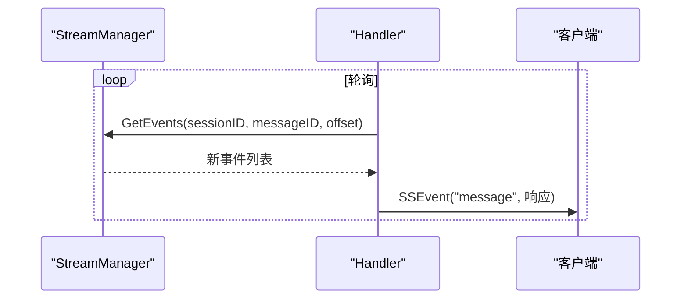

# 事件系统

<cite>
**本文档引用的文件**
- [internal/event/event.go](file://internal/event/event.go)
- [internal/event/middleware.go](file://internal/event/middleware.go)
- [internal/event/global.go](file://internal/event/global.go)
- [internal/event/adapter.go](file://internal/event/adapter.go)
- [internal/event/event_data.go](file://internal/event/event_data.go)
- [internal/event/example_test.go](file://internal/event/example_test.go)
- [internal/event/usage_example.md](file://internal/event/usage_example.md)
- [internal/types/event_bus.go](file://internal/types/event_bus.go)
- [internal/handler/session/agent_stream_handler.go](file://internal/handler/session/agent_stream_handler.go)
- [internal/handler/session/stream.go](file://internal/handler/session/stream.go)
- [client/agent.go](file://client/agent.go)
- [client/session.go](file://client/session.go)
- [internal/agent/engine.go](file://internal/agent/engine.go)
- [internal/application/service/chat_pipline/chat_pipline.go](file://internal/application/service/chat_pipline/chat_pipline.go)
- [internal/application/service/chat_pipline/chat_completion_stream.go](file://internal/application/service/chat_pipline/chat_completion_stream.go)
- [internal/application/service/chat_pipline/search.go](file://internal/application/service/chat_pipline/search.go)
- [internal/application/service/chat_pipline/rewrite.go](file://internal/application/service/chat_pipline/rewrite.go)
- [internal/application/service/chat_pipline/rerank.go](file://internal/application/service/chat_pipline/rerank.go)
- [internal/application/service/chat_pipline/chat_completion.go](file://internal/application/service/chat_pipline/chat_completion.go)
</cite>

## 目录
1. [简介](#简介)
2. [项目结构](#项目结构)
3. [核心组件](#核心组件)
4. [架构总览](#架构总览)
5. [详细组件分析](#详细组件分析)
6. [依赖关系分析](#依赖关系分析)
7. [性能考量](#性能考量)
8. [故障排查指南](#故障排查指南)
9. [结论](#结论)
10. [附录](#附录)

## 简介
本文件系统性阐述 WiseDx 的事件系统设计与实现，重点覆盖：
- 基于事件总线的松耦合通信机制：事件定义、发布、订阅与处理流程
- 事件中间件：拦截、过滤与转换能力
- 事件驱动架构在代理引擎、聊天管道与系统通知中的应用
- 事件定义与使用示例：如何创建与处理自定义事件
- 性能与错误处理策略
- 事件系统与传统请求-响应模式的差异与优势

## 项目结构
事件系统主要位于 internal/event 目录，围绕 EventBus、事件类型、事件数据结构、中间件与适配器展开，并通过全局总线与接口适配器在系统各层解耦使用。



图表来源
- [internal/event/event.go](file://internal/event/event.go#L84-L160)
- [internal/event/event_data.go](file://internal/event/event_data.go#L5-L224)
- [internal/event/middleware.go](file://internal/event/middleware.go#L11-L95)
- [internal/event/adapter.go](file://internal/event/adapter.go#L9-L60)
- [internal/event/global.go](file://internal/event/global.go#L8-L27)
- [internal/agent/engine.go](file://internal/agent/engine.go#L25-L73)
- [internal/application/service/chat_pipline/chat_pipline.go](file://internal/application/service/chat_pipline/chat_pipline.go#L9-L28)
- [internal/handler/session/agent_stream_handler.go](file://internal/handler/session/agent_stream_handler.go#L15-L69)
- [internal/handler/session/stream.go](file://internal/handler/session/stream.go#L133-L175)
- [client/agent.go](file://client/agent.go#L101-L143)
- [client/session.go](file://client/session.go#L245-L292)

章节来源
- [internal/event/event.go](file://internal/event/event.go#L1-L234)
- [internal/event/event_data.go](file://internal/event/event_data.go#L1-L224)
- [internal/event/middleware.go](file://internal/event/middleware.go#L1-L95)
- [internal/event/adapter.go](file://internal/event/adapter.go#L1-L60)
- [internal/event/global.go](file://internal/event/global.go#L1-L58)

## 核心组件
- 事件总线 EventBus：支持同步与异步两种模式，提供 On/Off/Emit/EmitAndWait/HasHandlers/GetHandlerCount/Clear 等能力，内部以读写锁保护处理器列表，保证并发安全。
- 事件类型 EventType：涵盖查询、检索、重排、合并、聊天、代理、快速回复、错误、会话标题、停止等事件域。
- 事件载体 Event：包含 ID、Type、SessionID、Data、Metadata、RequestID，支持链式扩展方法 WithSessionID/WithRequestID/WithMetadata。
- 事件数据结构 EventData：针对不同阶段的数据封装，如 QueryData、RetrievalData、RerankData、MergeData、ChatData、ErrorData、Agent*Data、Streaming Agent*Data、SessionTitleData、StopData、QuickReplyData 等。
- 中间件 Middleware：WithLogging、WithTiming、WithRecovery，支持 Chain 组合与 ApplyMiddleware 应用。
- 全局总线 GetGlobalEventBus：单例全局事件总线，简化跨模块使用。
- 适配器 EventBusAdapter：将内部 EventBus 适配为 types.EventBusInterface，避免循环依赖。

章节来源
- [internal/event/event.go](file://internal/event/event.go#L11-L234)
- [internal/event/event_data.go](file://internal/event/event_data.go#L5-L224)
- [internal/event/middleware.go](file://internal/event/middleware.go#L11-L95)
- [internal/event/global.go](file://internal/event/global.go#L8-L58)
- [internal/event/adapter.go](file://internal/event/adapter.go#L9-L60)
- [internal/types/event_bus.go](file://internal/types/event_bus.go#L7-L31)

## 架构总览
事件系统采用“发布-订阅”模式，上游组件通过 EventBus 发布事件，下游订阅者按需处理。中间件贯穿事件生命周期，提供日志、性能与健壮性保障。全局总线与接口适配器确保模块间低耦合。



图表来源
- [internal/event/event.go](file://internal/event/event.go#L123-L205)
- [internal/event/middleware.go](file://internal/event/middleware.go#L11-L95)

## 详细组件分析

### 事件总线与生命周期
- 同步模式：顺序执行所有处理器，任一失败即返回错误；适合需要强一致性的场景。
- 异步模式：并发触发处理器，立即返回；适合不影响主流程的监控、日志等。
- EmitAndWait：在异步模式下等待所有处理器完成并聚合错误，兼顾异步与一致性。



图表来源
- [internal/event/event.go](file://internal/event/event.go#L123-L205)

章节来源
- [internal/event/event.go](file://internal/event/event.go#L84-L234)

### 事件中间件
- WithLogging：记录事件触发与处理结果，便于可观测性。
- WithTiming：统计处理耗时并注入事件元数据，便于性能分析。
- WithRecovery：捕获 panic 并转换为可报告的错误类型，提升系统稳定性。
- Chain/ApplyMiddleware：支持多中间件组合与按需应用。

```mermaid
classDiagram
class Middleware {
+func(EventHandler) EventHandler
}
class WithLogging {
+apply(next) EventHandler
}
class WithTiming {
+apply(next) EventHandler
}
class WithRecovery {
+apply(next) EventHandler
}
class PanicError {
+Panic interface{}
+Error() string
}
Middleware <|.. WithLogging
Middleware <|.. WithTiming
Middleware <|.. WithRecovery
WithRecovery --> PanicError : "抛出/包装"
```

图表来源
- [internal/event/middleware.go](file://internal/event/middleware.go#L11-L95)

章节来源
- [internal/event/middleware.go](file://internal/event/middleware.go#L1-L95)

### 事件数据模型
事件数据结构覆盖查询、检索、重排、合并、聊天、错误、代理（含流式）、会话标题、停止、快速回复等，统一通过 NewEvent 构造并使用 WithSessionID/WithRequestID/WithMetadata 扩展。

```mermaid
classDiagram
class Event {
+string ID
+EventType Type
+string SessionID
+interface{} Data
+map[string]interface{} Metadata
+string RequestID
+WithSessionID(sessionID) Event
+WithRequestID(requestID) Event
+WithMetadata(key, value) Event
}
class QueryData {
+string OriginalQuery
+string RewrittenQuery
+string SessionID
+string UserID
+map[string]interface{} Extra
}
class RetrievalData {
+string Query
+string KnowledgeBaseID
+int TopK
+float64 Threshold
+string RetrievalType
+int ResultCount
+interface{} Results
+int64 Duration
+map[string]interface{} Extra
}
class RerankData { ... }
class MergeData { ... }
class ChatData { ... }
class ErrorData { ... }
class AgentPlanData { ... }
class AgentStepData { ... }
class AgentActionData { ... }
class AgentQueryData { ... }
class AgentCompleteData { ... }
class AgentThoughtData { ... }
class AgentToolCallData { ... }
class AgentToolResultData { ... }
class AgentReferencesData { ... }
class AgentFinalAnswerData { ... }
class AgentReflectionData { ... }
class SessionTitleData { ... }
class StopData { ... }
class QuickReplyData { ... }
Event --> QueryData : "Data"
Event --> RetrievalData : "Data"
Event --> RerankData : "Data"
Event --> MergeData : "Data"
Event --> ChatData : "Data"
Event --> ErrorData : "Data"
Event --> AgentPlanData : "Data"
Event --> AgentStepData : "Data"
Event --> AgentActionData : "Data"
Event --> AgentQueryData : "Data"
Event --> AgentCompleteData : "Data"
Event --> AgentThoughtData : "Data"
Event --> AgentToolCallData : "Data"
Event --> AgentToolResultData : "Data"
Event --> AgentReferencesData : "Data"
Event --> AgentFinalAnswerData : "Data"
Event --> AgentReflectionData : "Data"
Event --> SessionTitleData : "Data"
Event --> StopData : "Data"
Event --> QuickReplyData : "Data"
```

图表来源
- [internal/event/event_data.go](file://internal/event/event_data.go#L5-L224)

章节来源
- [internal/event/event_data.go](file://internal/event/event_data.go#L1-L224)

### 全局总线与接口适配
- GetGlobalEventBus：单例全局总线，简化跨模块使用。
- EventBusAdapter：将内部 EventBus 适配为 types.EventBusInterface，避免循环依赖，支持在 types 包中无侵入使用。



图表来源
- [internal/event/adapter.go](file://internal/event/adapter.go#L9-L60)
- [internal/types/event_bus.go](file://internal/types/event_bus.go#L21-L31)
- [internal/event/global.go](file://internal/event/global.go#L14-L27)

章节来源
- [internal/event/global.go](file://internal/event/global.go#L1-L58)
- [internal/event/adapter.go](file://internal/event/adapter.go#L1-L60)
- [internal/types/event_bus.go](file://internal/types/event_bus.go#L1-L31)

### 事件驱动在代理引擎中的应用
- 代理引擎在执行过程中通过 EventBus 发布思考、工具调用、工具结果、引用、最终答案、反思、完成、错误、会话标题等事件，供前端或其它订阅者实时消费。
- 代理流式处理器 AgentStreamHandler 订阅代理相关事件，将事件写入 StreamManager，并通过 SSE 推送给前端。



图表来源
- [internal/agent/engine.go](file://internal/agent/engine.go#L75-L155)
- [internal/handler/session/agent_stream_handler.go](file://internal/handler/session/agent_stream_handler.go#L56-L69)
- [internal/handler/session/stream.go](file://internal/handler/session/stream.go#L133-L175)

章节来源
- [internal/agent/engine.go](file://internal/agent/engine.go#L25-L155)
- [internal/handler/session/agent_stream_handler.go](file://internal/handler/session/agent_stream_handler.go#L15-L69)
- [internal/handler/session/stream.go](file://internal/handler/session/stream.go#L133-L175)

### 事件驱动在聊天管道中的应用
- 聊天管道以插件形式工作，通过 EventManager 管理事件与处理器链，插件在 OnEvent 中根据事件类型执行对应逻辑，并可借助 EventBus 发布阶段事件。
- 插件示例：搜索、查询改写、重排、聊天完成等均在相应阶段发布事件，便于监控与日志。



图表来源
- [internal/application/service/chat_pipline/chat_pipline.go](file://internal/application/service/chat_pipline/chat_pipline.go#L9-L78)
- [internal/application/service/chat_pipline/search.go](file://internal/application/service/chat_pipline/search.go#L44-L85)
- [internal/application/service/chat_pipline/rewrite.go](file://internal/application/service/chat_pipline/rewrite.go#L93-L120)
- [internal/application/service/chat_pipline/rerank.go](file://internal/application/service/chat_pipline/rerank.go#L128-L162)
- [internal/application/service/chat_pipline/chat_completion.go](file://internal/application/service/chat_pipline/chat_completion.go#L16-L41)

章节来源
- [internal/application/service/chat_pipline/chat_pipline.go](file://internal/application/service/chat_pipline/chat_pipline.go#L1-L141)
- [internal/application/service/chat_pipline/search.go](file://internal/application/service/chat_pipline/search.go#L44-L85)
- [internal/application/service/chat_pipline/rewrite.go](file://internal/application/service/chat_pipline/rewrite.go#L93-L120)
- [internal/application/service/chat_pipline/rerank.go](file://internal/application/service/chat_pipline/rerank.go#L128-L162)
- [internal/application/service/chat_pipline/chat_completion.go](file://internal/application/service/chat_pipline/chat_completion.go#L16-L41)

### 事件驱动在系统通知中的应用
- Handler 层通过 SSE 拉取 StreamManager 中的事件，周期性轮询并推送至客户端，实现“事件驱动”的系统通知。
- 客户端分别实现了对 SSE 的解析与回调处理，支持事件类型识别与内容累积。



图表来源
- [internal/handler/session/stream.go](file://internal/handler/session/stream.go#L133-L175)
- [client/agent.go](file://client/agent.go#L101-L143)
- [client/session.go](file://client/session.go#L245-L292)

章节来源
- [internal/handler/session/stream.go](file://internal/handler/session/stream.go#L133-L175)
- [client/agent.go](file://client/agent.go#L101-L143)
- [client/session.go](file://client/session.go#L245-L292)

### 事件定义与使用示例
- 基础使用：创建 EventBus，注册处理器，构造事件并通过 Emit/EmitAndWait 发布。
- 中间件：通过 ApplyMiddleware 将 WithTiming、WithRecovery 等中间件组合应用到处理器。
- 管道示例：在搜索、改写、重排、聊天完成等阶段发布事件，便于监控与日志。
- 初始化流程：在服务启动时注册监控、分析与日志等处理器，形成完整的事件生态。

章节来源
- [internal/event/example_test.go](file://internal/event/example_test.go#L10-L248)
- [internal/event/usage_example.md](file://internal/event/usage_example.md#L1-L420)

## 依赖关系分析
事件系统通过 EventBusAdapter 与 types.EventBusInterface 解耦，避免循环依赖；全局总线提供便捷入口；中间件贯穿事件生命周期；Handler 层通过 SSE 与前端交互，形成闭环。

```mermaid
graph LR
Types["types.EventBusInterface"] <- --> Adapter["EventBusAdapter"]
Adapter --> EBus["EventBus"]
EBus --> MW["Middleware"]
EBus --> Handler["AgentStreamHandler/StreamPolling"]
Handler --> Client["SSE客户端"]
EBus --> Agent["AgentEngine"]
EBus --> Plugins["Chat Pipeline Plugins"]
```

图表来源
- [internal/event/adapter.go](file://internal/event/adapter.go#L9-L60)
- [internal/types/event_bus.go](file://internal/types/event_bus.go#L21-L31)
- [internal/handler/session/agent_stream_handler.go](file://internal/handler/session/agent_stream_handler.go#L15-L69)
- [internal/agent/engine.go](file://internal/agent/engine.go#L25-L73)
- [internal/application/service/chat_pipline/chat_pipline.go](file://internal/application/service/chat_pipline/chat_pipline.go#L9-L28)

章节来源
- [internal/event/adapter.go](file://internal/event/adapter.go#L1-L60)
- [internal/types/event_bus.go](file://internal/types/event_bus.go#L1-L31)
- [internal/handler/session/agent_stream_handler.go](file://internal/handler/session/agent_stream_handler.go#L1-L200)
- [internal/agent/engine.go](file://internal/agent/engine.go#L1-L200)
- [internal/application/service/chat_pipline/chat_pipline.go](file://internal/application/service/chat_pipline/chat_pipline.go#L1-L141)

## 性能考量
- 异步优先：对不影响主流程的监控、日志等使用异步事件总线，避免阻塞关键路径。
- 中间件成本：仅在必要处启用 WithTiming/WithLogging，减少额外开销。
- 数据体积：避免在事件中传递大对象，特别是在异步场景。
- 处理器职责：每个处理器专注单一职责，避免在事件处理中执行重任务。
- 并发控制：利用 EventBus 内部并发模型与 WaitGroup 聚合错误，平衡吞吐与一致性。

## 故障排查指南
- 事件未被处理：检查 HasHandlers 与处理器注册顺序，确认事件类型匹配。
- 异步事件丢失：确认使用异步总线且未在关键路径阻塞；必要时使用 EmitAndWait。
- 中间件异常：WithRecovery 可捕获 panic 并返回可诊断错误；结合 WithTiming 查看耗时。
- SSE 不可见：检查 Handler 的轮询与 StreamManager 写入，确认事件已 AppendEvent。
- 事件数据缺失：确认使用 WithSessionID/WithRequestID/WithMetadata 扩展事件元数据。

章节来源
- [internal/event/event.go](file://internal/event/event.go#L123-L234)
- [internal/event/middleware.go](file://internal/event/middleware.go#L55-L95)
- [internal/handler/session/stream.go](file://internal/handler/session/stream.go#L133-L175)

## 结论
WiseDx 的事件系统通过 EventBus 提供了高内聚、低耦合的通信机制，配合中间件与全局总线，实现了可观测、可扩展、可维护的事件驱动架构。在代理引擎、聊天管道与系统通知中，事件系统有效解耦了上下游模块，提升了整体系统的灵活性与可演进性。

## 附录
- 事件类型清单：查询类、检索类、重排类、合并类、聊天类、代理类、快速回复、错误、会话标题、停止等。
- 事件数据结构：QueryData、RetrievalData、RerankData、MergeData、ChatData、ErrorData、Agent*Data、Streaming Agent*Data、SessionTitleData、StopData、QuickReplyData。
- 使用建议：在不影响业务主流程的场景使用异步总线；在关键路径谨慎使用中间件；通过全局总线与适配器降低模块耦合。