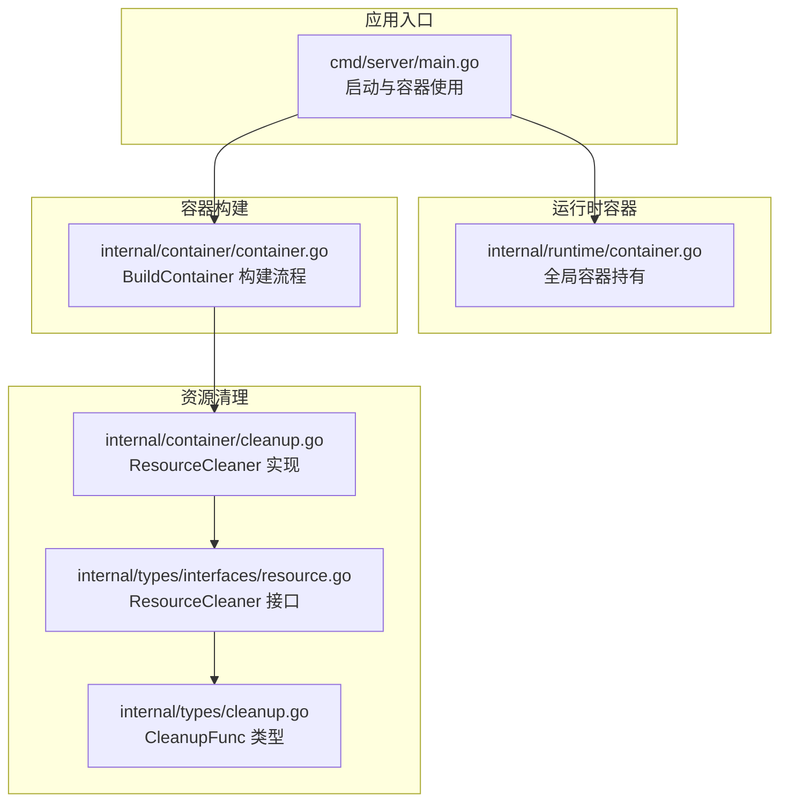
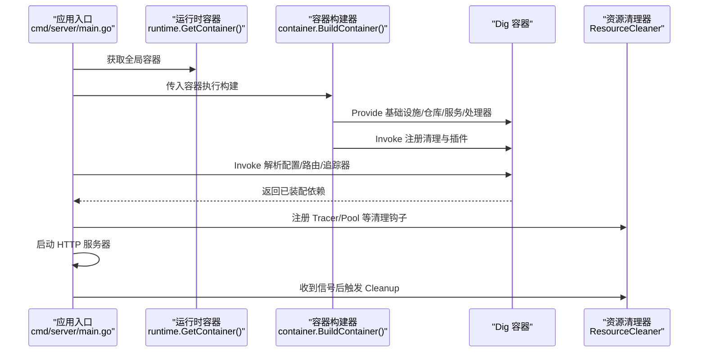
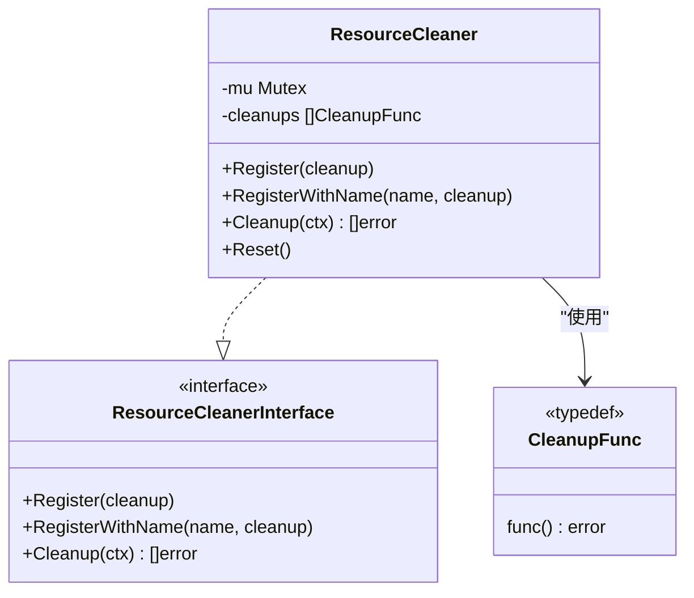
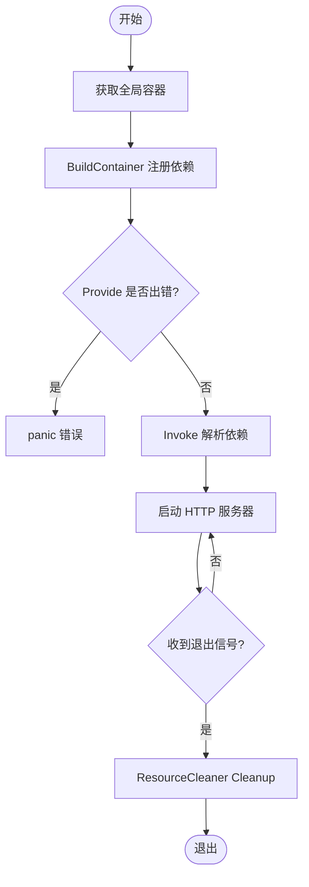

# 依赖注入容器

<cite>
**本文档引用的文件**
- [internal/container/container.go](file://internal/container/container.go)
- [internal/runtime/container.go](file://internal/runtime/container.go)
- [cmd/server/main.go](file://cmd/server/main.go)
- [internal/container/cleanup.go](file://internal/container/cleanup.go)
- [internal/types/interfaces/resource.go](file://internal/types/interfaces/resource.go)
- [internal/types/cleanup.go](file://internal/types/cleanup.go)
- [internal/application/service/knowledgebase.go](file://internal/application/service/knowledgebase.go)
- [internal/handler/session/handler.go](file://internal/handler/session/handler.go)
- [internal/application/repository/knowledgebase.go](file://internal/application/repository/knowledgebase.go)
- [internal/config/config.go](file://internal/config/config.go)
</cite>

## 目录
1. [简介](#简介)
2. [项目结构](#项目结构)
3. [核心组件](#核心组件)
4. [架构总览](#架构总览)
5. [详细组件分析](#详细组件分析)
6. [依赖关系分析](#依赖关系分析)
7. [性能考虑](#性能考虑)
8. [故障排查指南](#故障排查指南)
9. [结论](#结论)
10. [附录](#附录)

## 简介
本文件系统性阐述 WiseDx 项目的依赖注入容器设计与实现，基于 Uber Dig 容器，覆盖 BuildContainer 的工作原理、依赖注册顺序、各层组件（基础设施、数据访问层、业务服务层、HTTP 处理器层）的装配关系、资源清理与生命周期管理、错误处理与调试方法，并提供新增服务与修改依赖的实践指引。

## 项目结构
WiseDx 的依赖注入相关代码主要分布在以下模块：
- 容器构建与注册：internal/container/container.go
- 全局容器持有：internal/runtime/container.go
- 应用入口与容器使用：cmd/server/main.go
- 资源清理与生命周期：internal/container/cleanup.go 及其接口定义
- 服务与处理器示例：internal/application/service/*、internal/handler/session/*
- 配置加载：internal/config/config.go

图表来源
- [cmd/server/main.go](file://cmd/server/main.go#L124-L126)
- [internal/runtime/container.go](file://internal/runtime/container.go#L9-L23)
- [internal/container/container.go](file://internal/container/container.go#L57-L209)
- [internal/container/cleanup.go](file://internal/container/cleanup.go#L12-L87)
- [internal/types/interfaces/resource.go](file://internal/types/interfaces/resource.go#L9-L19)
- [internal/types/cleanup.go](file://internal/types/cleanup.go#L3-L4)

章节来源
- [internal/container/container.go](file://internal/container/container.go#L1-L209)
- [internal/runtime/container.go](file://internal/runtime/container.go#L1-L24)
- [cmd/server/main.go](file://cmd/server/main.go#L124-L126)

## 核心组件
- 全局容器持有者：runtime 包提供全局 dig 容器实例，供其他模块获取并注册依赖。
- 容器构建器：container 包的 BuildContainer 负责集中注册所有基础设施、仓库、服务与处理器。
- 资源清理器：container 包的 ResourceCleaner 提供统一的资源注册与逆序清理能力，确保优雅关闭。
- 应用入口：cmd/server/main.go 通过 BuildContainer 构建容器，并在 Invoke 中解析所需依赖启动 HTTP 服务，同时注册清理钩子。

章节来源
- [internal/runtime/container.go](file://internal/runtime/container.go#L9-L23)
- [internal/container/container.go](file://internal/container/container.go#L57-L209)
- [internal/container/cleanup.go](file://internal/container/cleanup.go#L12-L87)
- [cmd/server/main.go](file://cmd/server/main.go#L124-L188)

## 架构总览
下图展示了从应用启动到容器初始化、依赖解析与资源清理的整体流程。

图表来源
- [cmd/server/main.go](file://cmd/server/main.go#L124-L188)
- [internal/runtime/container.go](file://internal/runtime/container.go#L19-L23)
- [internal/container/container.go](file://internal/container/container.go#L57-L209)
- [internal/container/cleanup.go](file://internal/container/cleanup.go#L18-L56)

## 详细组件分析

### BuildContainer 工作原理与注册顺序
BuildContainer 按照“基础设施 → 外部客户端 → 仓库 → 服务 → 插件/注册表 → 处理器 → 路由”的顺序注册依赖，确保后续组件可正确解析前置依赖。

- 基础设施层
  - 配置加载：config.LoadConfig
  - 分布式追踪：initTracer
  - 数据库：initDatabase（GORM PostgreSQL）
  - 文件存储：initFileService（支持 MinIO/COS/本地/虚拟）
  - Redis 客户端：initRedisClient
  - 并发池：initAntsPool
  - 上下文存储：initContextStorage（基于 Redis）

- 外部服务客户端
  - 文档阅读器客户端：initDocReaderClient
  - Ollama 服务：initOllamaService
  - Neo4j 客户端：initNeo4jClient（可选）
  - 流管理器：stream.NewStreamManager
  - DuckDB 内存数据库：NewDuckDB

- 仓库层
  - 租户、知识库、知识、块、标签、会话、消息、模型、用户、Token、自定义代理等仓库

- 服务层
  - 租户、知识库、知识、块、标签、模型、数据集、评估、用户、消息、MCP 服务、自定义代理等服务
  - 提取服务（命名提供）
  - Web 搜索注册表与提供者注册
  - 事件总线与 Agent 服务
  - Session 服务

- 插件与注册表
  - 检索引擎注册表：initRetrieveEngineRegistry（支持 PostgreSQL、Elasticsearch V7/V8、Qdrant）
  - 聊天流水线插件：事件、追踪、搜索、重排序、合并、数据分析、消息转换、补全、流式补全、过滤、TopK、改写、历史加载、实体抽取、实体搜索、并行搜索等

- 处理器层
  - 租户、知识库、知识、块、FAQ、标签、会话、消息、模型、评估、初始化、认证、系统、MCP 服务、Web 搜索、自定义代理等处理器

- 路由与任务队列
  - 路由器：router.NewRouter
  - Asynq 客户端与服务器：router.NewAsyncqClient / NewAsynqServer

- 生命周期与清理
  - 注册并发池清理：registerPoolCleanup
  - 注册追踪器清理：main.go 中通过 ResourceCleaner.RegisterWithName

章节来源
- [internal/container/container.go](file://internal/container/container.go#L57-L209)

### 基础设施组件注册
- 配置加载：config.LoadConfig 支持 YAML 配置文件与环境变量替换，返回 *config.Config。
- 数据库：initDatabase 根据环境变量选择驱动（PostgreSQL），构造 gorm.DB，执行迁移（可选），设置连接池。
- 文件存储：initFileService 根据 STORAGE_TYPE 选择 MinIO、COS、本地或虚拟实现。
- Redis：initRedisClient 读取 REDIS_* 环境变量并校验 Ping。
- 上下文存储：initContextStorage 基于 Redis 实现 LLM 上下文缓存。
- 并发池：initAntsPool 读取 CONCURRENCY_POOL_SIZE，默认 5，启用预分配。
- 检索引擎注册表：initRetrieveEngineRegistry 根据 RETRIEVE_DRIVER 动态注册多种检索后端。

章节来源
- [internal/container/container.go](file://internal/container/container.go#L221-L532)
- [internal/config/config.go](file://internal/config/config.go#L170-L205)

### 数据访问层（Repositories）
- 仓库实现通常直接依赖 *gorm.DB，在构造函数中注入并封装 CRUD 操作。
- 示例：知识库仓库 NewKnowledgeBaseRepository 接收 *gorm.DB 并实现接口方法。

章节来源
- [internal/application/repository/knowledgebase.go](file://internal/application/repository/knowledgebase.go#L19-L22)

### 业务服务层（Services）
- 服务层通过构造函数注入所需的仓库、外部客户端、注册表与工具组件。
- 示例：知识库服务 NewKnowledgeBaseService 注入多个仓库与检索注册表、文件服务、异步客户端等。

章节来源
- [internal/application/service/knowledgebase.go](file://internal/application/service/knowledgebase.go#L36-L58)

### HTTP 处理器层（Handlers）
- 处理器通过构造函数注入服务层与配置，处理 HTTP 请求并调用服务完成业务逻辑。
- 示例：会话处理器 NewHandler 注入 SessionService、MessageService、StreamManager、KnowledgeBaseService、CustomAgentService 等。

章节来源
- [internal/handler/session/handler.go](file://internal/handler/session/handler.go#L25-L42)

### 资源清理机制与生命周期管理
- ResourceCleaner 提供注册与逆序清理能力，支持带名称的清理钩子以便调试定位。
- 清理顺序：后注册先执行，确保依赖释放顺序合理。
- 应用入口在 main 中注册追踪器清理钩子，并在收到信号后统一触发 Cleanup。

图表来源
- [internal/container/cleanup.go](file://internal/container/cleanup.go#L12-L87)
- [internal/types/interfaces/resource.go](file://internal/types/interfaces/resource.go#L9-L19)
- [internal/types/cleanup.go](file://internal/types/cleanup.go#L3-L4)

章节来源
- [internal/container/cleanup.go](file://internal/container/cleanup.go#L12-L87)
- [internal/types/interfaces/resource.go](file://internal/types/interfaces/resource.go#L9-L19)
- [internal/types/cleanup.go](file://internal/types/cleanup.go#L3-L4)
- [cmd/server/main.go](file://cmd/server/main.go#L142-L177)

### 容器初始化流程与错误处理
- BuildContainer 使用 must(err) 在注册阶段遇到错误直接 panic，确保启动失败显式可见。
- initDatabase 支持可选迁移与脏状态恢复，失败时记录告警并继续启动。
- main 中通过 c.Invoke 解析配置、路由与追踪器，随后启动 HTTP 服务器；收到系统信号后触发优雅关闭与资源清理。

图表来源
- [internal/runtime/container.go](file://internal/runtime/container.go#L19-L23)
- [internal/container/container.go](file://internal/container/container.go#L211-L219)
- [cmd/server/main.go](file://cmd/server/main.go#L124-L188)

章节来源
- [internal/container/container.go](file://internal/container/container.go#L211-L219)
- [cmd/server/main.go](file://cmd/server/main.go#L124-L188)

## 依赖关系分析
下图展示容器构建期间的关键依赖关系与装配顺序。

```mermaid
graph TB
subgraph "基础设施"
CFG["config.LoadConfig"]
TRC["initTracer"]
DB["initDatabase"]
FS["initFileService"]
RDS["initRedisClient"]
POOL["initAntsPool"]
CTX["initContextStorage"]
end
subgraph "外部客户端"
DOC["initDocReaderClient"]
OLL["initOllamaService"]
N4J["initNeo4jClient"]
STR["stream.NewStreamManager"]
DCK["NewDuckDB"]
end
subgraph "仓库层"
REPO_Tenant["TenantRepository"]
REPO_KB["KnowledgeBaseRepository"]
REPO_K["KnowledgeRepository"]
REPO_Chunk["ChunkRepository"]
REPO_Tag["KnowledgeTagRepository"]
REPO_Session["SessionRepository"]
REPO_Msg["MessageRepository"]
REPO_Model["ModelRepository"]
REPO_User["UserRepository"]
REPO_Auth["AuthTokenRepository"]
REPO_Neo4j["Neo4jRepository"]
REPO_MCP["MCPServiceRepository"]
REPO_CustomAgent["CustomAgentRepository"]
SVC_WSState["WebSearchStateService"]
end
subgraph "服务层"
SVC_Tenant["TenantService"]
SVC_KB["KnowledgeBaseService"]
SVC_K["KnowledgeService"]
SVC_Chunk["ChunkService"]
SVC_Tag["KnowledgeTagService"]
SVC_Embed["BatchEmbedder"]
SVC_Model["ModelService"]
SVC_Dataset["DatasetService"]
SVC_Eval["EvaluationService"]
SVC_User["UserService"]
SVC_Msg["MessageService"]
SVC_MCP["MCPServiceService"]
SVC_CustomAgent["CustomAgentService"]
REG_WS["WebSearch Registry"]
SVC_WS["WebSearchService"]
BUS["EventBus"]
SVC_Agent["AgentService"]
SVC_Session["SessionService"]
end
subgraph "插件与注册表"
REG_Retrieve["RetrieveEngineRegistry"]
PLUGINS["聊天流水线插件集合"]
end
subgraph "处理器层"
H_Tenant["TenantHandler"]
H_KB["KnowledgeBaseHandler"]
H_K["KnowledgeHandler"]
H_Chunk["ChunkHandler"]
H_FAQ["FAQHandler"]
H_Tag["TagHandler"]
H_Session["SessionHandler"]
H_Msg["MessageHandler"]
H_Model["ModelHandler"]
H_Eval["EvaluationHandler"]
H_Init["InitializationHandler"]
H_Auth["AuthHandler"]
H_System["SystemHandler"]
H_MCP["MCPServiceHandler"]
H_WebSearch["WebSearchHandler"]
H_CustomAgent["CustomAgentHandler"]
end
subgraph "路由与任务"
ROUTER["router.NewRouter"]
ASYNQ_CLI["router.NewAsyncqClient"]
ASYNQ_SRV["router.NewAsynqServer"]
end
CFG --> DB
CFG --> FS
CFG --> RDS
CFG --> POOL
CFG --> CTX
DB --> REG_Retrieve
FS --> SVC_KB
RDS --> CTX
POOL --> SVC_Session
REG_Retrieve --> SVC_KB
SVC_KB --> SVC_K
SVC_KB --> SVC_Chunk
SVC_KB --> SVC_Msg
SVC_KB --> SVC_Model
SVC_KB --> SVC_User
SVC_KB --> SVC_MCP
SVC_KB --> SVC_CustomAgent
SVC_Agent --> SVC_Session
SVC_Session --> SVC_Msg
REG_WS --> SVC_WS
SVC_WS --> SVC_Agent
PLUGINS --> SVC_Agent
H_Session --> SVC_Session
H_Session --> SVC_Msg
H_Session --> SVC_KB
H_Session --> SVC_CustomAgent
ROUTER --> H_Tenant
ROUTER --> H_KB
ROUTER --> H_K
ROUTER --> H_Chunk
ROUTER --> H_FAQ
ROUTER --> H_Tag
ROUTER --> H_Session
ROUTER --> H_Msg
ROUTER --> H_Model
ROUTER --> H_Eval
ROUTER --> H_Init
ROUTER --> H_Auth
ROUTER --> H_System
ROUTER --> H_MCP
ROUTER --> H_WebSearch
ROUTER --> H_CustomAgent
ASYNQ_CLI --> ROUTER
ASYNQ_SRV --> ROUTER
```

图表来源
- [internal/container/container.go](file://internal/container/container.go#L57-L209)

章节来源
- [internal/container/container.go](file://internal/container/container.go#L57-L209)

## 性能考虑
- 并发池：initAntsPool 默认大小可通过环境变量调整，建议根据 CPU 核数与 I/O 密集度权衡。
- 数据库连接池：initDatabase 设置空闲连接数与最大生命周期，避免连接泄漏。
- DuckDB：内存数据库适合分析场景，注意内存占用与查询复杂度。
- 检索引擎：按需启用后端（RETRIEVE_DRIVER），减少不必要的客户端初始化。

## 故障排查指南
- 启动失败（panic）
  - BuildContainer 在注册阶段使用 must，若某 Provide 返回错误会直接 panic。检查对应初始化函数的环境变量与依赖可用性。
- 数据库迁移失败
  - initDatabase 支持可选迁移，失败时记录告警但不阻塞启动。可通过环境变量禁用自动迁移或开启脏状态恢复。
- Redis 连接失败
  - initRedisClient 会在 Ping 失败时返回错误，请核对 REDIS_ADDR、REDIS_PASSWORD、REDIS_DB。
- 资源清理异常
  - ResourceCleaner Cleanup 逆序执行，任一清理失败不会中断其他清理。可在 RegisterWithName 中看到具体清理项名称与错误日志。

章节来源
- [internal/container/container.go](file://internal/container/container.go#L211-L219)
- [internal/container/container.go](file://internal/container/container.go#L229-L252)
- [internal/container/cleanup.go](file://internal/container/cleanup.go#L58-L78)

## 结论
WiseDx 的依赖注入容器以 Uber Dig 为核心，采用集中式 BuildContainer 统一装配基础设施、仓库、服务、插件与处理器，并通过 ResourceCleaner 实现可控的生命周期管理。该设计保证了模块解耦、依赖清晰与优雅关闭，便于扩展新服务与维护现有依赖。

## 附录

### 如何添加新的服务或修改现有依赖
- 新增服务
  - 在 internal/application/service 下创建服务实现，并在 container.BuildContainer 中通过 must(container.Provide(...)) 注册。
  - 若服务依赖特定仓库或外部客户端，确保在 BuildContainer 中先注册被依赖组件，再注册使用它们的服务。
- 修改现有依赖
  - 若需替换某个仓库实现，只需在 BuildContainer 中将对应 Provide 替换为新实现。
  - 若需引入新的外部客户端（如新的检索后端），在相应初始化函数中创建并注册到容器。
- 处理器层
  - 在 internal/handler 下创建或修改处理器，通过构造函数注入所需服务，并在 BuildContainer 中注册处理器。

章节来源
- [internal/container/container.go](file://internal/container/container.go#L57-L209)