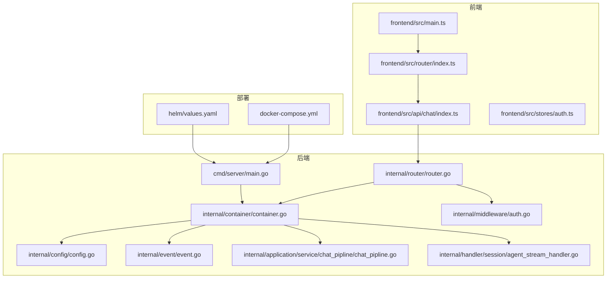
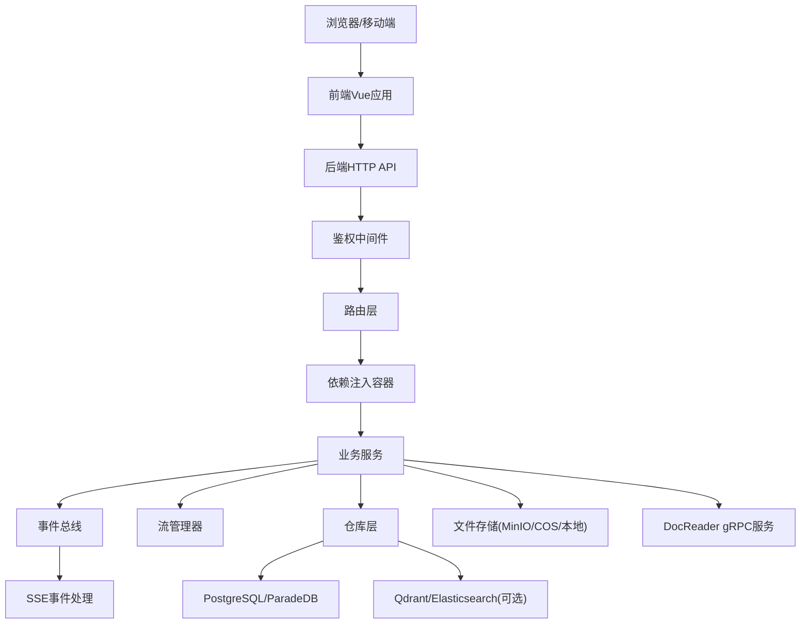
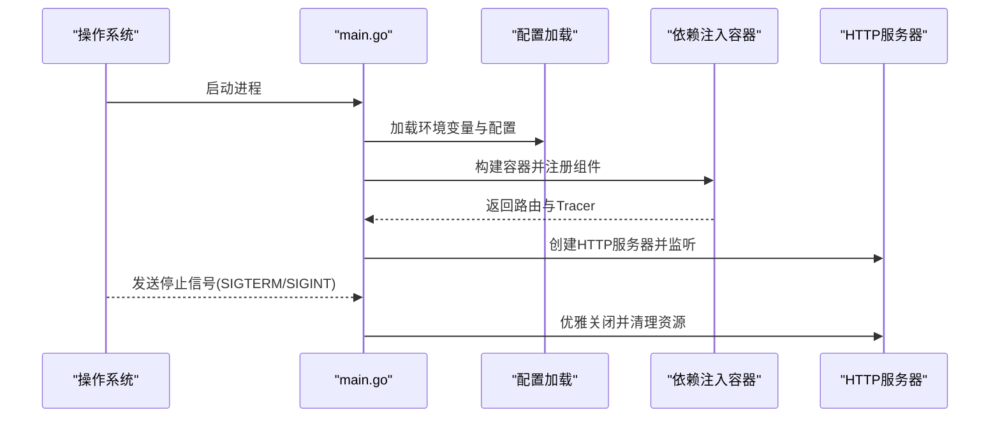
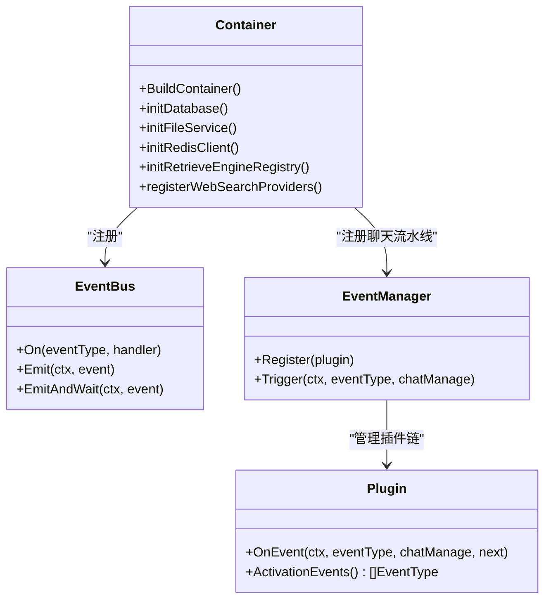
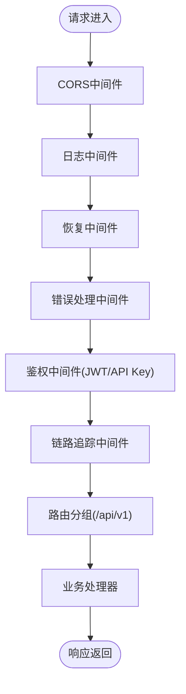
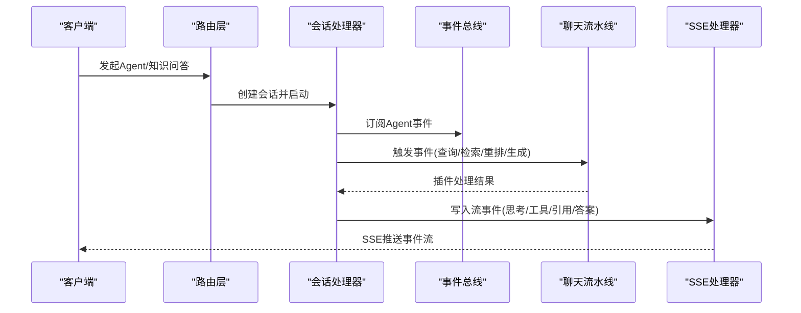
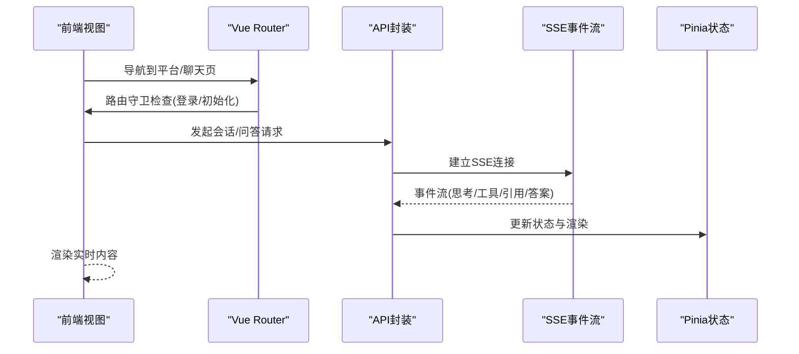
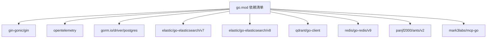

# 整体架构

<cite>
**本文引用的文件**
- [cmd/server/main.go](file://cmd/server/main.go)
- [internal/config/config.go](file://internal/config/config.go)
- [docker-compose.yml](file://docker-compose.yml)
- [helm/values.yaml](file://helm/values.yaml)
- [internal/router/router.go](file://internal/router/router.go)
- [internal/container/container.go](file://internal/container/container.go)
- [internal/event/event.go](file://internal/event/event.go)
- [internal/application/service/chat_pipline/chat_pipline.go](file://internal/application/service/chat_pipline/chat_pipline.go)
- [internal/handler/session/agent_stream_handler.go](file://internal/handler/session/agent_stream_handler.go)
- [frontend/src/main.ts](file://frontend/src/main.ts)
- [frontend/src/router/index.ts](file://frontend/src/router/index.ts)
- [frontend/src/api/chat/index.ts](file://frontend/src/api/chat/index.ts)
- [frontend/src/stores/auth.ts](file://frontend/src/stores/auth.ts)
- [internal/middleware/auth.go](file://internal/middleware/auth.go)
- [config/config.yaml](file://config/config.yaml)
- [go.mod](file://go.mod)
</cite>

## 目录
1. [简介](#简介)
2. [项目结构](#项目结构)
3. [核心组件](#核心组件)
4. [架构总览](#架构总览)
5. [详细组件分析](#详细组件分析)
6. [依赖分析](#依赖分析)
7. [性能考量](#性能考量)
8. [故障排查指南](#故障排查指南)
9. [结论](#结论)
10. [附录](#附录)

## 简介
本架构文档面向WiseDx（WeKnora）系统，系统采用前后端分离架构，结合微服务化与事件驱动设计，实现“表现层（前端Vue.js）—业务层（Go后端服务）—数据层（数据库与外部服务）”的清晰分层。后端通过依赖注入容器统一装配各模块，路由层集中管理API，业务层通过插件化的聊天流水线处理检索、重排、合并与生成等阶段，事件总线支撑Agent流式事件的订阅与转发，前端通过SSE与后端进行实时交互。

## 项目结构
- 后端入口与运行时
  - 服务入口位于命令行入口，负责环境变量加载、日志配置、容器构建与HTTP服务启动。
  - 依赖注入容器集中注册配置、基础设施、仓库、服务、处理器与路由器。
- 路由与中间件
  - 路由器定义REST API分组与鉴权策略；中间件负责CORS、日志、错误处理、鉴权与链路追踪。
- 业务与事件
  - 业务层通过事件总线与聊天流水线插件协作，实现查询预处理、检索、重排、合并、生成与流式输出。
- 前端
  - Vue 3 + Pinia + Vue Router，通过Axios与SSE与后端交互，支持多租户与知识库切换。

**图示来源**
- [cmd/server/main.go](file://cmd/server/main.go#L88-L192)
- [internal/container/container.go](file://internal/container/container.go#L65-L209)
- [internal/router/router.go](file://internal/router/router.go#L54-L118)
- [internal/middleware/auth.go](file://internal/middleware/auth.go#L59-L196)
- [internal/event/event.go](file://internal/event/event.go#L84-L160)
- [internal/application/service/chat_pipline/chat_pipline.go](file://internal/application/service/chat_pipline/chat_pipline.go#L24-L78)
- [internal/handler/session/agent_stream_handler.go](file://internal/handler/session/agent_stream_handler.go#L15-L69)
- [frontend/src/main.ts](file://frontend/src/main.ts#L1-L20)
- [frontend/src/router/index.ts](file://frontend/src/router/index.ts#L1-L127)
- [frontend/src/api/chat/index.ts](file://frontend/src/api/chat/index.ts#L1-L53)
- [frontend/src/stores/auth.ts](file://frontend/src/stores/auth.ts#L1-L233)
- [docker-compose.yml](file://docker-compose.yml#L1-L271)
- [helm/values.yaml](file://helm/values.yaml#L1-L489)

**章节来源**
- [cmd/server/main.go](file://cmd/server/main.go#L88-L192)
- [internal/container/container.go](file://internal/container/container.go#L65-L209)
- [internal/router/router.go](file://internal/router/router.go#L54-L118)
- [internal/middleware/auth.go](file://internal/middleware/auth.go#L59-L196)
- [internal/event/event.go](file://internal/event/event.go#L84-L160)
- [internal/application/service/chat_pipline/chat_pipline.go](file://internal/application/service/chat_pipline/chat_pipline.go#L24-L78)
- [internal/handler/session/agent_stream_handler.go](file://internal/handler/session/agent_stream_handler.go#L15-L69)
- [frontend/src/main.ts](file://frontend/src/main.ts#L1-L20)
- [frontend/src/router/index.ts](file://frontend/src/router/index.ts#L1-L127)
- [frontend/src/api/chat/index.ts](file://frontend/src/api/chat/index.ts#L1-L53)
- [frontend/src/stores/auth.ts](file://frontend/src/stores/auth.ts#L1-L233)
- [docker-compose.yml](file://docker-compose.yml#L1-L271)
- [helm/values.yaml](file://helm/values.yaml#L1-L489)

## 核心组件
- 服务入口与运行时
  - 负责环境变量加载、日志配置、Gin模式设置、HTTP服务器启动与优雅关闭。
- 依赖注入容器
  - 注册配置、Tracing、数据库、文件存储、Redis、检索引擎注册、MCP管理器、业务服务、聊天流水线插件、HTTP处理器与路由器。
- 路由与中间件
  - 统一CORS、日志、恢复、错误处理、鉴权（JWT与API Key）、链路追踪；按版本分组API。
- 事件总线与聊天流水线
  - 事件总线支持同步/异步事件发布与订阅；聊天流水线以插件化方式串联检索、重排、合并、生成等阶段。
- SSE与Agent流式处理
  - 专用事件总线与流管理器，将Agent事件转换为SSE事件，前端逐段渲染。
- 前端
  - Vue应用、路由守卫、API封装与Pinia状态管理，支持多租户与知识库切换。

**章节来源**
- [cmd/server/main.go](file://cmd/server/main.go#L88-L192)
- [internal/container/container.go](file://internal/container/container.go#L65-L209)
- [internal/router/router.go](file://internal/router/router.go#L54-L118)
- [internal/event/event.go](file://internal/event/event.go#L84-L160)
- [internal/application/service/chat_pipline/chat_pipline.go](file://internal/application/service/chat_pipline/chat_pipline.go#L24-L78)
- [internal/handler/session/agent_stream_handler.go](file://internal/handler/session/agent_stream_handler.go#L15-L69)
- [frontend/src/main.ts](file://frontend/src/main.ts#L1-L20)
- [frontend/src/router/index.ts](file://frontend/src/router/index.ts#L1-L127)
- [frontend/src/api/chat/index.ts](file://frontend/src/api/chat/index.ts#L1-L53)
- [frontend/src/stores/auth.ts](file://frontend/src/stores/auth.ts#L1-L233)

## 架构总览
系统采用三层架构与事件驱动：
- 表现层：Vue前端，负责UI与用户交互，通过Axios与SSE与后端通信。
- 业务层：Go后端，统一通过依赖注入装配，路由层集中处理HTTP请求，中间件统一鉴权与追踪，事件总线与聊天流水线处理复杂业务流程。
- 数据层：PostgreSQL（ParadeDB）作为主存储，Redis用于流与上下文缓存，可选Qdrant/Elasticsearch作为向量/混合检索后端，MinIO/COS本地存储文件，DocReader通过gRPC解析文档。

**图示来源**
- [internal/router/router.go](file://internal/router/router.go#L54-L118)
- [internal/container/container.go](file://internal/container/container.go#L65-L209)
- [internal/event/event.go](file://internal/event/event.go#L84-L160)
- [internal/handler/session/agent_stream_handler.go](file://internal/handler/session/agent_stream_handler.go#L15-L69)
- [docker-compose.yml](file://docker-compose.yml#L146-L271)
- [helm/values.yaml](file://helm/values.yaml#L240-L489)

## 详细组件分析

### 服务入口与运行时
- 环境变量加载与校验，日志输出到控制台与文件，Gin模式切换，HTTP服务器启动与信号处理，优雅关闭与资源清理。
- 通过依赖注入容器构建应用，注册Tracing、数据库、文件存储、Redis、检索引擎、MCP管理器、业务服务、聊天流水线插件与路由器。

**图示来源**
- [cmd/server/main.go](file://cmd/server/main.go#L88-L192)
- [internal/container/container.go](file://internal/container/container.go#L65-L209)

**章节来源**
- [cmd/server/main.go](file://cmd/server/main.go#L88-L192)
- [internal/container/container.go](file://internal/container/container.go#L65-L209)

### 依赖注入容器与组件装配
- 核心基础设施：配置、Tracing、数据库、文件存储、Redis、并发池、上下文存储。
- 检索引擎注册：支持PostgreSQL、Elasticsearch v7/v8、Qdrant。
- 业务服务：租户、知识库、知识、分块、消息、模型、评估、用户、MCP服务、自定义Agent、Web搜索。
- 聊天流水线插件：追踪、搜索、重排、合并、数据分析、消息转换、生成、流过滤、重写、历史加载、实体抽取与搜索、并行搜索等。
- HTTP处理器与路由器：注册所有业务API与SSE路由。

**图示来源**
- [internal/container/container.go](file://internal/container/container.go#L65-L209)
- [internal/event/event.go](file://internal/event/event.go#L84-L160)
- [internal/application/service/chat_pipline/chat_pipline.go](file://internal/application/service/chat_pipline/chat_pipline.go#L24-L78)

**章节来源**
- [internal/container/container.go](file://internal/container/container.go#L65-L209)
- [internal/event/event.go](file://internal/event/event.go#L84-L160)
- [internal/application/service/chat_pipline/chat_pipline.go](file://internal/application/service/chat_pipline/chat_pipline.go#L24-L78)

### 路由与中间件
- 路由分组：健康检查、Swagger（非生产）、认证中间件、OpenTelemetry追踪、业务API分组。
- 中间件：CORS、请求ID、日志、恢复、错误处理、鉴权（JWT与API Key）、跨租户访问控制。
- 鉴权策略：支持JWT Bearer与X-API-Key两种认证方式，支持跨租户切换。

**图示来源**
- [internal/router/router.go](file://internal/router/router.go#L54-L118)
- [internal/middleware/auth.go](file://internal/middleware/auth.go#L59-L196)

**章节来源**
- [internal/router/router.go](file://internal/router/router.go#L54-L118)
- [internal/middleware/auth.go](file://internal/middleware/auth.go#L59-L196)

### 事件总线与聊天流水线
- 事件类型覆盖查询、检索、重排、合并、聊天生成、Agent计划与工具调用、错误与会话标题更新等。
- 事件总线支持同步与异步模式，提供订阅、发布与等待机制。
- 聊天流水线以插件化方式串联各阶段，构建Handler链，按事件类型触发对应处理。

**图示来源**
- [internal/event/event.go](file://internal/event/event.go#L84-L160)
- [internal/application/service/chat_pipline/chat_pipline.go](file://internal/application/service/chat_pipline/chat_pipline.go#L24-L78)
- [internal/handler/session/agent_stream_handler.go](file://internal/handler/session/agent_stream_handler.go#L56-L69)

**章节来源**
- [internal/event/event.go](file://internal/event/event.go#L84-L160)
- [internal/application/service/chat_pipline/chat_pipline.go](file://internal/application/service/chat_pipline/chat_pipline.go#L24-L78)
- [internal/handler/session/agent_stream_handler.go](file://internal/handler/session/agent_stream_handler.go#L56-L69)

### 前端交互与SSE
- Vue应用初始化、路由守卫与状态管理；API封装统一调用后端REST与SSE。
- 路由守卫支持登录态与系统初始化检查；Pinia持久化存储用户、租户、知识库与当前选择。

**图示来源**
- [frontend/src/router/index.ts](file://frontend/src/router/index.ts#L83-L124)
- [frontend/src/api/chat/index.ts](file://frontend/src/api/chat/index.ts#L17-L33)
- [frontend/src/stores/auth.ts](file://frontend/src/stores/auth.ts#L130-L198)

**章节来源**
- [frontend/src/router/index.ts](file://frontend/src/router/index.ts#L83-L124)
- [frontend/src/api/chat/index.ts](file://frontend/src/api/chat/index.ts#L17-L33)
- [frontend/src/stores/auth.ts](file://frontend/src/stores/auth.ts#L130-L198)

## 依赖分析
- 外部依赖与集成
  - HTTP框架：Gin；Swagger文档；CORS；OpenTelemetry链路追踪。
  - 数据库：GORM + PostgreSQL（ParadeDB）；迁移工具；可选Elasticsearch v7/v8、Qdrant。
  - 缓存与队列：Redis；并发池ants；流管理器（内存/Redis）。
  - 文件存储：MinIO、COS、本地；DocReader gRPC服务。
  - AI/模型：Ollama；多种大模型提供商适配；嵌入与重排模型抽象。
  - MCP：Mark3 Labs MCP协议客户端与管理器。
- 部署与编排
  - Docker Compose：前端、后端、DocReader、PostgreSQL、Redis、MinIO、Jaeger、Neo4j、Qdrant等服务编排。
  - Helm：Kubernetes部署参数与资源定义，支持可选组件（MinIO、Neo4j、Qdrant、Jaeger）。

**图示来源**
- [go.mod](file://go.mod#L7-L55)

**章节来源**
- [go.mod](file://go.mod#L7-L55)
- [docker-compose.yml](file://docker-compose.yml#L1-L271)
- [helm/values.yaml](file://helm/values.yaml#L1-L489)

## 性能考量
- 并发与资源池
  - goroutine池大小可通过环境变量配置，避免过载；Redis连接池与数据库连接池参数可调优。
- 检索与重排
  - 多后端检索引擎可按需启用；向量与关键词混合检索、重排阈值与TopK参数可配置。
- 流式输出
  - SSE事件按块推送，前端累积渲染；事件总线异步模式减少阻塞。
- 缓存与上下文
  - Redis缓存对话上下文与流数据，缩短响应时间。
- 部署与弹性
  - Docker Compose与Helm支持横向扩展与持久化卷；健康检查与优雅关闭保障稳定性。

[本节为通用指导，无需特定文件引用]

## 故障排查指南
- 认证失败
  - 检查JWT Bearer或X-API-Key是否正确；确认租户存在且API Key匹配；跨租户访问需具备权限。
- 数据库连接
  - 核对DB_DRIVER、DB_HOST、DB_PORT、DB_USER、DB_PASSWORD、DB_NAME；ParadeDB迁移参数与跳过嵌入配置。
- 检索后端
  - 确认RETRIEVE_DRIVER配置包含所需后端；Elasticsearch地址与凭据、Qdrant主机/端口/TLS/API Key。
- 文件存储
  - MinIO/COS配置项齐全；本地存储目录权限与容量。
- DocReader
  - gRPC健康检查与地址配置；MinIO公共端点与文件大小限制。
- 日志与追踪
  - 查看后端日志与Jaeger UI；确认OTEL导出端点与传播器配置。

**章节来源**
- [internal/middleware/auth.go](file://internal/middleware/auth.go#L59-L196)
- [internal/container/container.go](file://internal/container/container.go#L271-L362)
- [internal/container/container.go](file://internal/container/container.go#L425-L532)
- [docker-compose.yml](file://docker-compose.yml#L146-L271)
- [helm/values.yaml](file://helm/values.yaml#L240-L489)

## 结论
WiseDx通过清晰的分层设计与事件驱动架构，实现了从前端交互到后端业务处理再到外部服务集成的完整闭环。依赖注入与插件化流水线提升了可维护性与可扩展性；SSE与事件总线保障了实时性与可观测性；Docker与Helm提供了标准化的部署与运维能力。未来可在可观测性、安全加固与多活容灾方面持续演进。

[本节为总结，无需特定文件引用]

## 附录
- 配置文件与提示词模板
  - YAML配置文件集中管理服务器、对话、知识库、向量库、流管理器、Web搜索、提示词模板等；支持从目录动态加载模板。
- 健康检查与探针
  - 后端/DocReader/PostgreSQL/MinIO/Jaeger/Neo4j/Qdrant均配置健康检查与就绪探针，便于编排与监控。

**章节来源**
- [config/config.yaml](file://config/config.yaml#L1-L585)
- [internal/config/config.go](file://internal/config/config.go#L170-L230)
- [docker-compose.yml](file://docker-compose.yml#L1-L271)
- [helm/values.yaml](file://helm/values.yaml#L112-L131)
- [helm/values.yaml](file://helm/values.yaml#L188-L229)
- [helm/values.yaml](file://helm/values.yaml#L240-L283)
- [helm/values.yaml](file://helm/values.yaml#L286-L329)
- [helm/values.yaml](file://helm/values.yaml#L331-L341)
- [helm/values.yaml](file://helm/values.yaml#L404-L489)