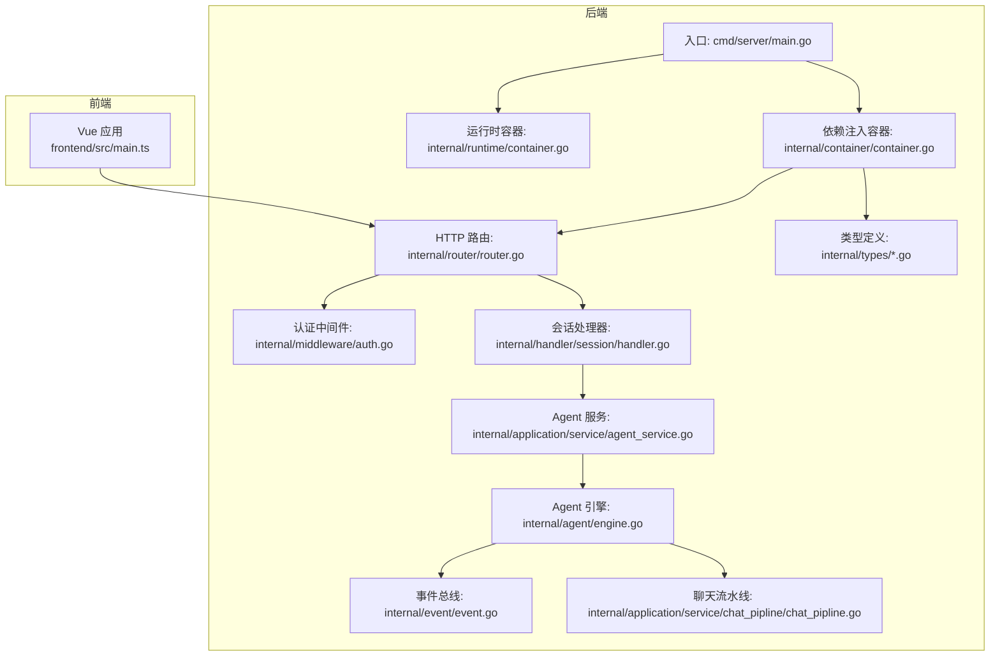
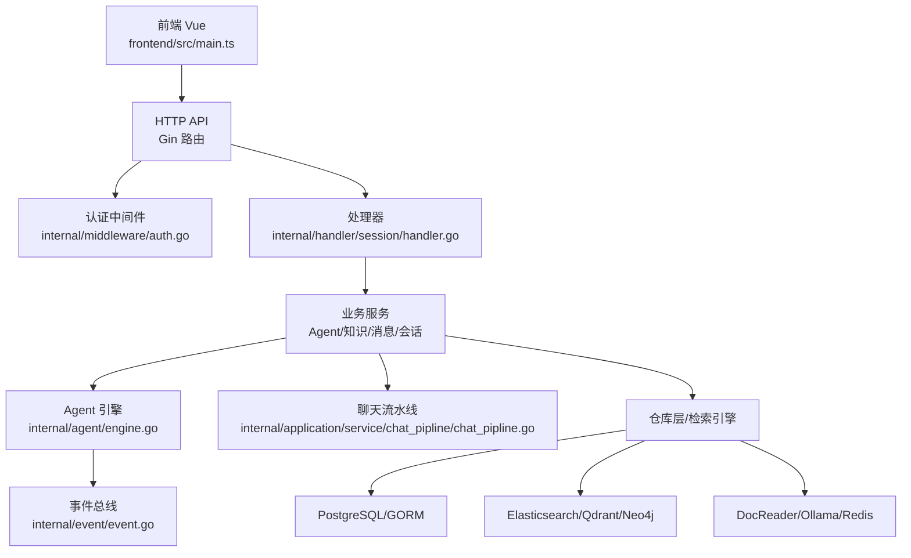
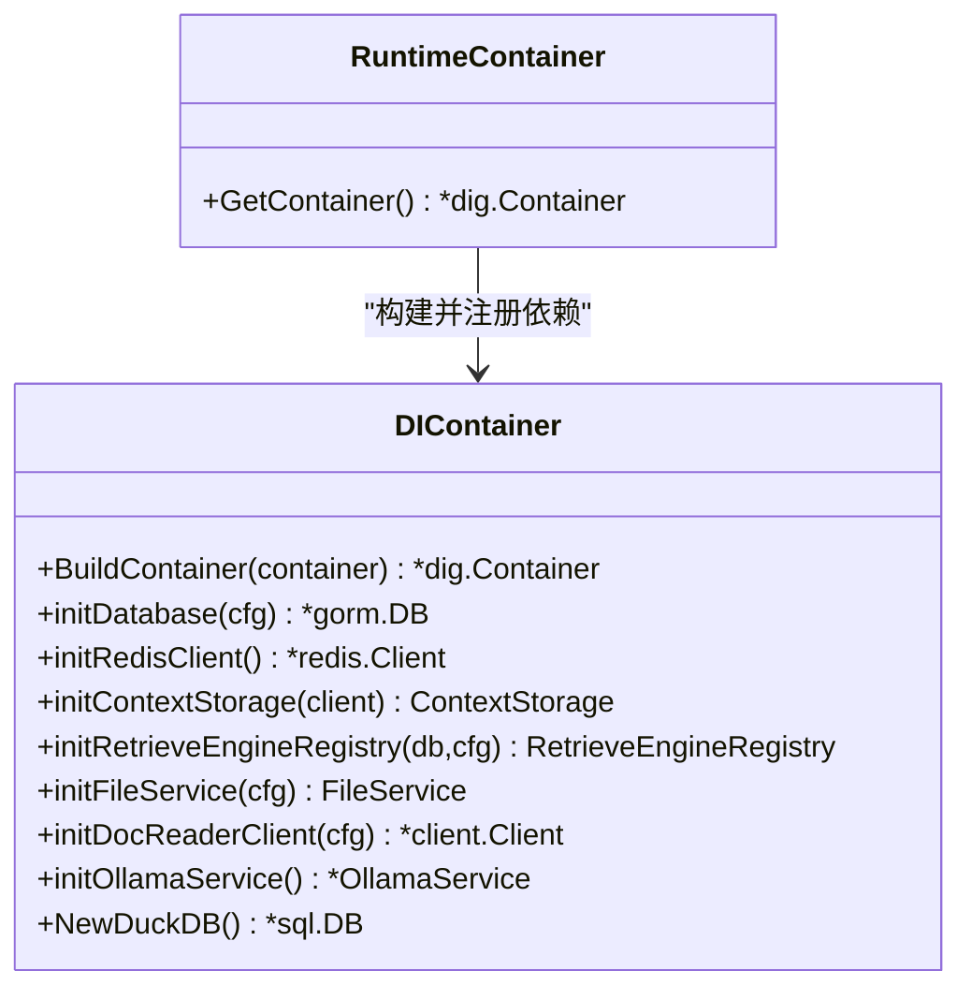
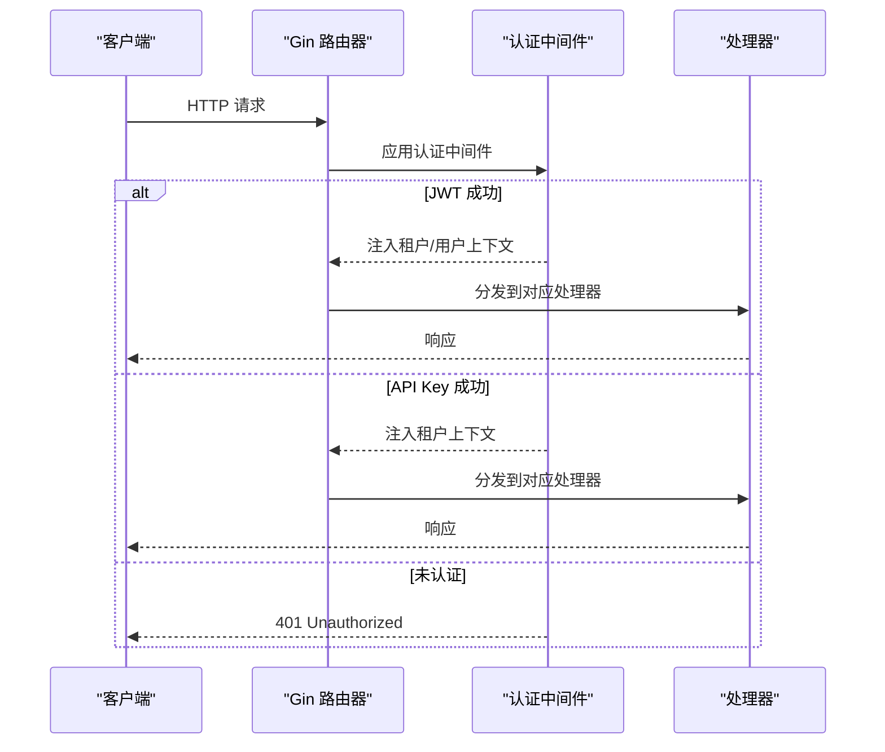
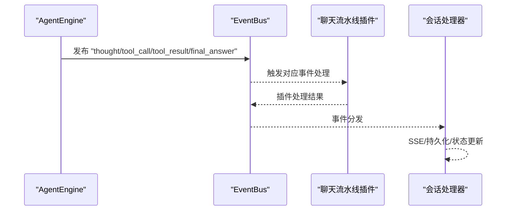
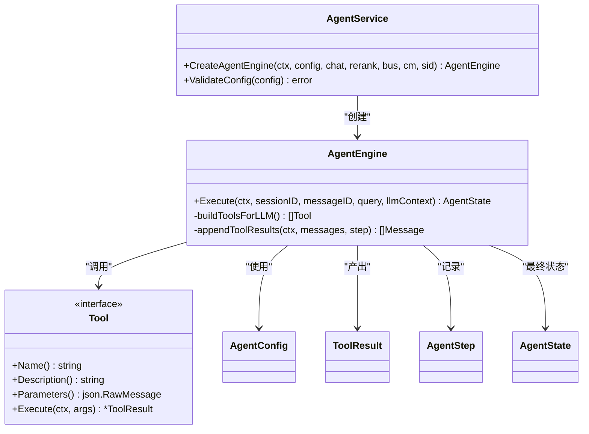
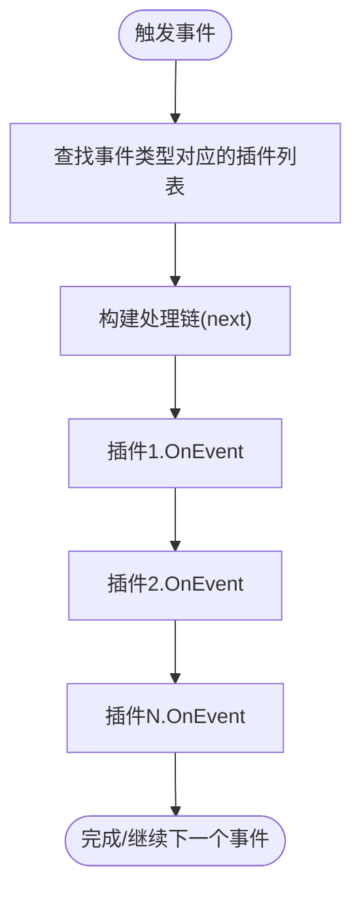
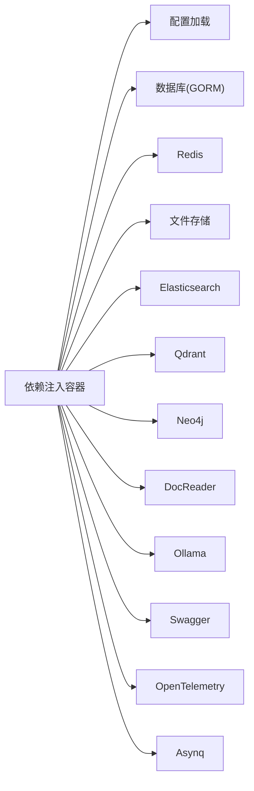

# 架构设计

<cite>
**本文引用的文件**
- [cmd/server/main.go](file://cmd/server/main.go)
- [internal/runtime/container.go](file://internal/runtime/container.go)
- [internal/container/container.go](file://internal/container/container.go)
- [internal/router/router.go](file://internal/router/router.go)
- [internal/middleware/auth.go](file://internal/middleware/auth.go)
- [internal/event/event.go](file://internal/event/event.go)
- [internal/types/interfaces/agent.go](file://internal/types/interfaces/agent.go)
- [internal/application/service/agent_service.go](file://internal/application/service/agent_service.go)
- [internal/config/config.go](file://internal/config/config.go)
- [internal/agent/engine.go](file://internal/agent/engine.go)
- [internal/application/service/chat_pipline/chat_pipline.go](file://internal/application/service/chat_pipline/chat_pipline.go)
- [internal/types/agent.go](file://internal/types/agent.go)
- [internal/handler/session/handler.go](file://internal/handler/session/handler.go)
- [frontend/src/main.ts](file://frontend/src/main.ts)
- [go.mod](file://go.mod)
</cite>

## 目录
1. [引言](#引言)
2. [项目结构](#项目结构)
3. [核心组件](#核心组件)
4. [架构总览](#架构总览)
5. [详细组件分析](#详细组件分析)
6. [依赖分析](#依赖分析)
7. [性能考虑](#性能考虑)
8. [故障排查指南](#故障排查指南)
9. [结论](#结论)
10. [附录](#附录)

## 引言
本架构设计文档面向 WiseDx（Weknora）系统，聚焦于整体系统架构、前后端分离、微服务化与事件驱动设计、依赖注入容器（Uber Dig）的使用方式、分层架构（表现层、业务层、数据层）以及核心设计模式（工厂、策略、观察者等）。文档通过代码级图表与流程图帮助开发者快速理解系统设计思路与组件交互关系。

## 项目结构
WiseDx 采用 Go 语言后端与 Vue 前端分离的典型现代 Web 架构：
- 后端入口位于 cmd/server/main.go，负责初始化环境变量、构建依赖注入容器、启动 HTTP 服务器与资源清理。
- 依赖注入容器在 internal/container/container.go 中集中注册基础设施、仓库层、业务服务层、事件总线与 HTTP 路由器。
- 前端位于 frontend/，使用 Vue 3 + Pinia + TDesign，入口为 frontend/src/main.ts。

**图表来源**
- [cmd/server/main.go](file://cmd/server/main.go#L88-L192)
- [internal/runtime/container.go](file://internal/runtime/container.go#L9-L23)
- [internal/container/container.go](file://internal/container/container.go#L65-L209)
- [internal/router/router.go](file://internal/router/router.go#L54-L118)
- [internal/middleware/auth.go](file://internal/middleware/auth.go#L64-L196)
- [internal/event/event.go](file://internal/event/event.go#L90-L160)
- [internal/application/service/agent_service.go](file://internal/application/service/agent_service.go#L40-L69)
- [internal/agent/engine.go](file://internal/agent/engine.go#L47-L73)
- [internal/application/service/chat_pipline/chat_pipline.go](file://internal/application/service/chat_pipline/chat_pipline.go#L23-L78)
- [internal/types/agent.go](file://internal/types/agent.go#L107-L178)
- [internal/handler/session/handler.go](file://internal/handler/session/handler.go#L15-L42)

**章节来源**
- [cmd/server/main.go](file://cmd/server/main.go#L88-L192)
- [internal/runtime/container.go](file://internal/runtime/container.go#L9-L23)
- [internal/container/container.go](file://internal/container/container.go#L65-L209)
- [internal/router/router.go](file://internal/router/router.go#L54-L118)
- [frontend/src/main.ts](file://frontend/src/main.ts#L1-L20)

## 核心组件
- 依赖注入容器（Uber Dig）：在 internal/runtime/container.go 中定义全局容器，在 internal/container/container.go 中集中注册配置、数据库、存储、服务、仓库、事件总线、路由器等。
- HTTP 路由与中间件：internal/router/router.go 负责路由分组与注册；认证中间件 internal/middleware/auth.go 处理 JWT 与 API Key 认证。
- 事件驱动：internal/event/event.go 提供 EventBus，支持同步/异步事件发布与订阅，贯穿 Agent 执行、聊天流水线与会话处理。
- Agent 体系：internal/application/service/agent_service.go 创建 AgentEngine，内部通过工具注册表与事件总线协作；internal/agent/engine.go 实现 ReAct 循环与事件流式输出。
- 聊天流水线：internal/application/service/chat_pipline/chat_pipline.go 定义插件化事件管理器，按事件类型串接处理链。
- 类型与配置：internal/types/agent.go 定义 Agent 配置与状态；internal/config/config.go 提供应用配置加载与模板解析。

**章节来源**
- [internal/runtime/container.go](file://internal/runtime/container.go#L9-L23)
- [internal/container/container.go](file://internal/container/container.go#L65-L209)
- [internal/router/router.go](file://internal/router/router.go#L54-L118)
- [internal/middleware/auth.go](file://internal/middleware/auth.go#L64-L196)
- [internal/event/event.go](file://internal/event/event.go#L90-L160)
- [internal/application/service/agent_service.go](file://internal/application/service/agent_service.go#L40-L69)
- [internal/agent/engine.go](file://internal/agent/engine.go#L47-L73)
- [internal/application/service/chat_pipline/chat_pipline.go](file://internal/application/service/chat_pipline/chat_pipline.go#L23-L78)
- [internal/types/agent.go](file://internal/types/agent.go#L107-L178)
- [internal/config/config.go](file://internal/config/config.go#L170-L230)

## 架构总览
WiseDx 采用“前后端分离 + 依赖注入 + 事件驱动”的架构：
- 表现层：Vue 前端通过 HTTP 与后端交互，路由与状态管理由前端框架承担。
- 控制层：Gin 路由器与中间件负责请求接入、认证与日志。
- 业务层：服务层封装业务逻辑，如 Agent 服务、知识检索、消息与会话管理。
- 数据层：通过 GORM 连接 PostgreSQL，结合多种检索引擎（PostgreSQL、Elasticsearch、Qdrant）与外部服务（DocReader、Ollama、Redis、Neo4j）。
- 事件驱动：EventBus 作为观察者模式载体，贯穿 Agent 执行、聊天流水线与会话处理，实现松耦合与可观测性。

**图表来源**
- [frontend/src/main.ts](file://frontend/src/main.ts#L1-L20)
- [internal/router/router.go](file://internal/router/router.go#L54-L118)
- [internal/middleware/auth.go](file://internal/middleware/auth.go#L64-L196)
- [internal/handler/session/handler.go](file://internal/handler/session/handler.go#L15-L42)
- [internal/agent/engine.go](file://internal/agent/engine.go#L47-L73)
- [internal/event/event.go](file://internal/event/event.go#L90-L160)
- [internal/application/service/chat_pipline/chat_pipline.go](file://internal/application/service/chat_pipline/chat_pipline.go#L23-L78)

## 详细组件分析

### 依赖注入容器（Uber Dig）
- 全局容器：internal/runtime/container.go 定义全局 dig 容器，并提供 GetContainer() 获取引用。
- 容器构建：internal/container/container.go 的 BuildContainer() 注册配置、Tracer、数据库、文件存储、Redis、Goroutine 池、上下文存储、检索引擎注册表、MCP 管理器、各类服务与仓库、聊天流水线插件、HTTP 处理器与路由器。
- 资源清理：通过 ResourceCleaner 注册 Redis、Ants 池等资源的清理回调，确保优雅关闭。

**图表来源**
- [internal/runtime/container.go](file://internal/runtime/container.go#L9-L23)
- [internal/container/container.go](file://internal/container/container.go#L65-L209)

**章节来源**
- [internal/runtime/container.go](file://internal/runtime/container.go#L9-L23)
- [internal/container/container.go](file://internal/container/container.go#L65-L209)

### HTTP 路由与中间件
- 路由器：internal/router/router.go 使用 dig.In 参数注入服务与处理器，统一注册认证、健康检查、Swagger 文档与各模块路由。
- 认证中间件：internal/middleware/auth.go 支持 Bearer JWT 与 X-API-Key 两种认证方式，可跨租户访问控制，将租户与用户信息注入上下文。

**图表来源**
- [internal/router/router.go](file://internal/router/router.go#L54-L118)
- [internal/middleware/auth.go](file://internal/middleware/auth.go#L64-L196)

**章节来源**
- [internal/router/router.go](file://internal/router/router.go#L54-L118)
- [internal/middleware/auth.go](file://internal/middleware/auth.go#L64-L196)

### 事件驱动设计（观察者模式）
- 事件总线：internal/event/event.go 提供 EventBus，支持同步/异步事件发布、订阅与清理。
- Agent 执行：internal/agent/engine.go 在思考、工具调用、最终答案等阶段通过 EventBus 发布事件，Handler 侧订阅并转换为 SSE/前端渲染。
- 聊天流水线：internal/application/service/chat_pipline/chat_pipline.go 通过插件化事件管理器，按事件类型串联处理步骤。

**图表来源**
- [internal/agent/engine.go](file://internal/agent/engine.go#L664-L742)
- [internal/event/event.go](file://internal/event/event.go#L126-L160)
- [internal/application/service/chat_pipline/chat_pipline.go](file://internal/application/service/chat_pipline/chat_pipline.go#L70-L78)
- [internal/handler/session/handler.go](file://internal/handler/session/handler.go#L15-L42)

**章节来源**
- [internal/event/event.go](file://internal/event/event.go#L90-L160)
- [internal/agent/engine.go](file://internal/agent/engine.go#L664-L742)
- [internal/application/service/chat_pipline/chat_pipline.go](file://internal/application/service/chat_pipline/chat_pipline.go#L23-L78)
- [internal/handler/session/handler.go](file://internal/handler/session/handler.go#L15-L42)

### Agent 服务与工具注册（工厂/策略）
- Agent 服务：internal/application/service/agent_service.go 负责根据配置创建 AgentEngine，注册工具（知识检索、网络搜索、数据库查询、数据分析等），并支持 MCP 工具扩展。
- 工具注册表：AgentEngine 内部维护工具函数定义，按配置动态启用/过滤工具，体现“策略”选择与“工厂”创建。
- 类型定义：internal/types/agent.go 定义 AgentConfig、Tool、ToolResult、AgentStep、AgentState 等核心类型。

**图表来源**
- [internal/application/service/agent_service.go](file://internal/application/service/agent_service.go#L71-L201)
- [internal/agent/engine.go](file://internal/agent/engine.go#L47-L73)
- [internal/types/agent.go](file://internal/types/agent.go#L107-L178)

**章节来源**
- [internal/application/service/agent_service.go](file://internal/application/service/agent_service.go#L40-L69)
- [internal/agent/engine.go](file://internal/agent/engine.go#L47-L73)
- [internal/types/agent.go](file://internal/types/agent.go#L107-L178)

### 聊天流水线（插件化事件处理）
- 插件接口：internal/application/service/chat_pipline/chat_pipline.go 定义 Plugin 与 EventManager，支持按事件类型注册多个插件并构建处理链。
- 预定义错误：对搜索、重排、模型调用等常见失败场景提供标准化错误包装，便于统一处理与上报。

**图表来源**
- [internal/application/service/chat_pipline/chat_pipline.go](file://internal/application/service/chat_pipline/chat_pipline.go#L53-L78)

**章节来源**
- [internal/application/service/chat_pipline/chat_pipline.go](file://internal/application/service/chat_pipline/chat_pipline.go#L23-L78)

### 配置与提示词模板
- 配置加载：internal/config/config.go 支持从多路径加载 YAML 配置，环境变量替换，提示词模板目录加载。
- 提示词模板：支持 system/context/rewrite/fallback 等模板集合，按需注入到 Agent 执行与聊天流水线。

**章节来源**
- [internal/config/config.go](file://internal/config/config.go#L170-L230)

## 依赖分析
- 容器构建顺序：配置 → Tracer → 数据库 → 文件存储 → Redis → 上下文存储 → 检索引擎注册表 → MCP 管理器 → 服务/仓库 → 聊天流水线插件 → 处理器 → 路由器。
- 关键外部依赖：GORM(PostgreSQL)、Elasticsearch、Qdrant、Neo4j、Redis、DocReader、Ollama、Swag（Swagger）、OpenTelemetry、Asynq（任务队列）等。

**图表来源**
- [internal/container/container.go](file://internal/container/container.go#L72-L98)
- [go.mod](file://go.mod#L7-L55)

**章节来源**
- [internal/container/container.go](file://internal/container/container.go#L72-L98)
- [go.mod](file://go.mod#L7-L55)

## 性能考虑
- 并发与池化：通过 ants 池限制并发任务数，避免资源争用；Redis 与数据库连接池参数合理设置，降低延迟。
- 检索优化：根据 RETRIEVE_DRIVER 动态启用 Postgres/Elasticsearch/Qdrant，结合 TopK、阈值与重排策略提升召回质量与速度。
- 事件流式输出：Agent 执行与聊天流水线均采用事件流式发布，前端可逐步渲染，减少一次性大响应带来的阻塞。
- 缓存与上下文：LLM 上下文通过 Redis 存储，结合 TTL 与清理策略，平衡内存占用与复用效率。

[本节为通用指导，无需特定文件引用]

## 故障排查指南
- 认证失败：检查 Authorization 头或 X-API-Key 是否正确，确认租户存在且 API Key 匹配。
- 事件未到达：确认 EventBus 是否启用异步/同步模式，检查事件类型与订阅者是否匹配。
- Agent 执行异常：查看 AgentEngine 在思考/工具调用阶段的日志与事件，定位具体工具执行失败原因。
- 路由未生效：确认 RouterParams 注入的服务与处理器已通过容器注册，路由组与中间件顺序正确。

**章节来源**
- [internal/middleware/auth.go](file://internal/middleware/auth.go#L64-L196)
- [internal/event/event.go](file://internal/event/event.go#L126-L160)
- [internal/agent/engine.go](file://internal/agent/engine.go#L129-L143)
- [internal/router/router.go](file://internal/router/router.go#L54-L118)

## 结论
WiseDx 通过 Uber Dig 实现了清晰的依赖注入与生命周期管理，结合 Gin 路由与中间件形成稳定的控制层；业务层以 Agent 为核心，配合事件总线与插件化聊天流水线实现高度解耦与可观测性；数据层通过 GORM 与多检索后端支撑多样化检索需求。整体架构兼顾可扩展性、可维护性与性能，适合在多租户与复杂检索场景下演进。

[本节为总结，无需特定文件引用]

## 附录
- 前端入口：frontend/src/main.ts 初始化 Vue 应用、路由与状态管理。
- 后端入口：cmd/server/main.go 负责环境加载、容器构建、HTTP 服务启动与优雅关闭。

**章节来源**
- [frontend/src/main.ts](file://frontend/src/main.ts#L1-L20)
- [cmd/server/main.go](file://cmd/server/main.go#L88-L192)