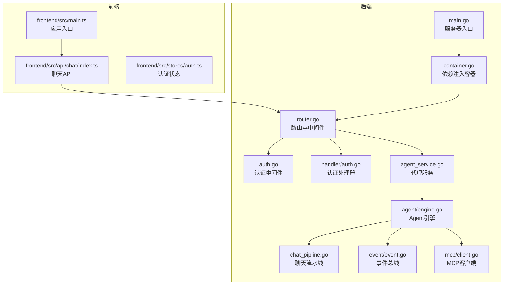
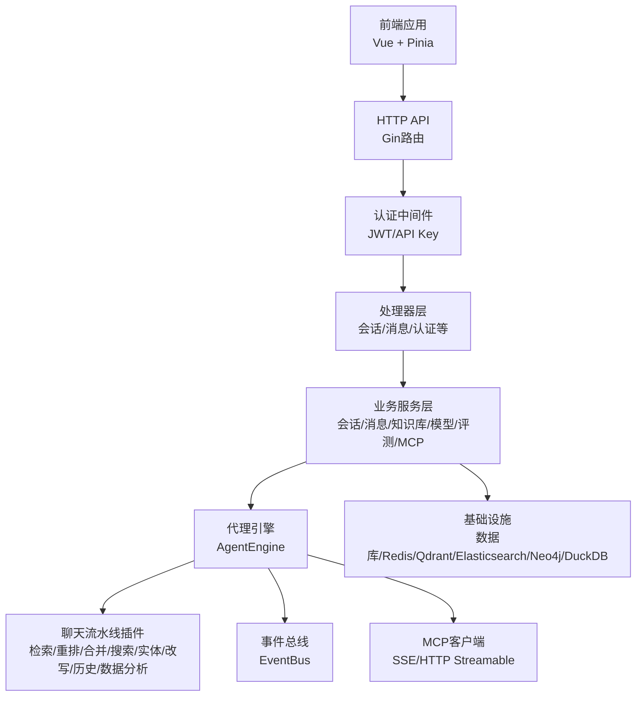
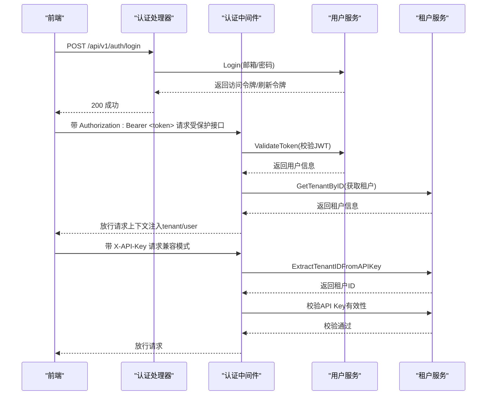
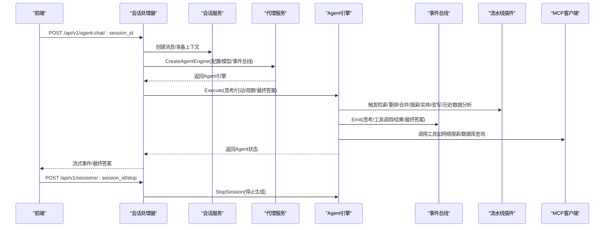
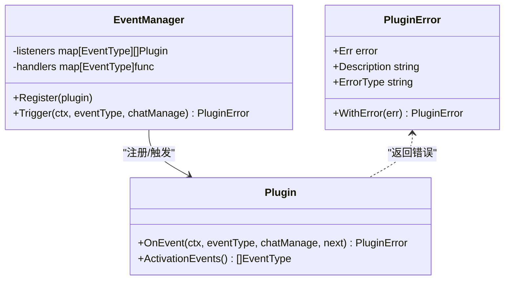
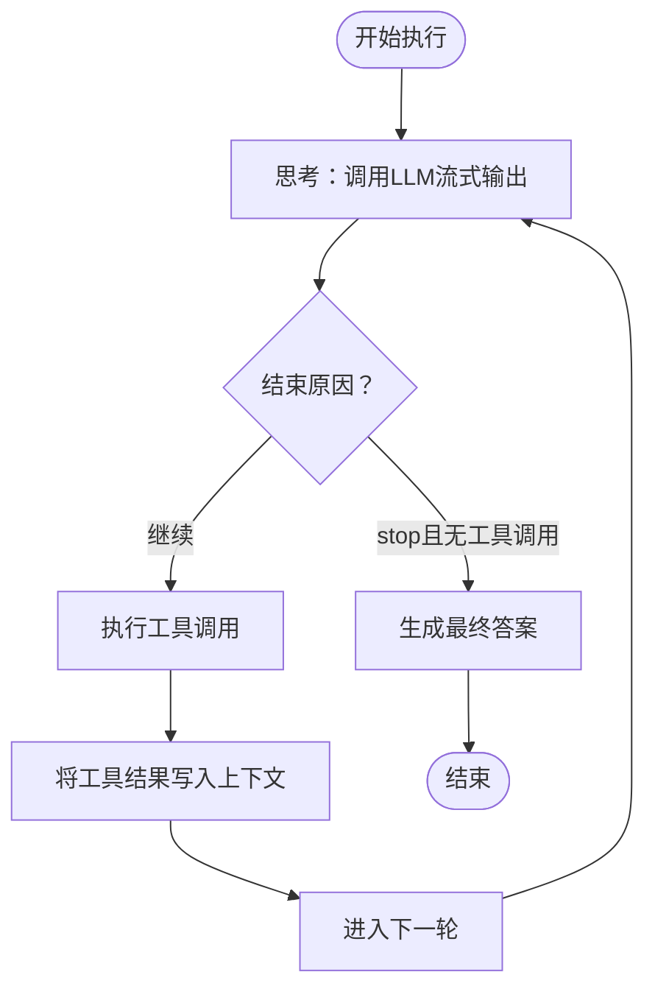
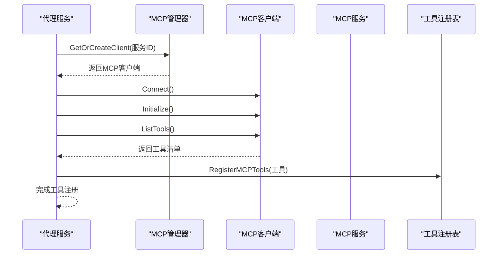
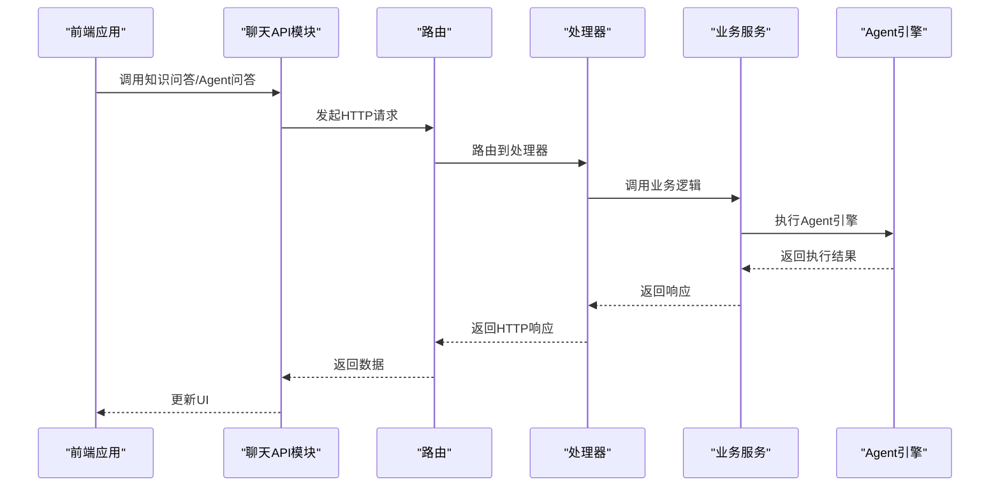
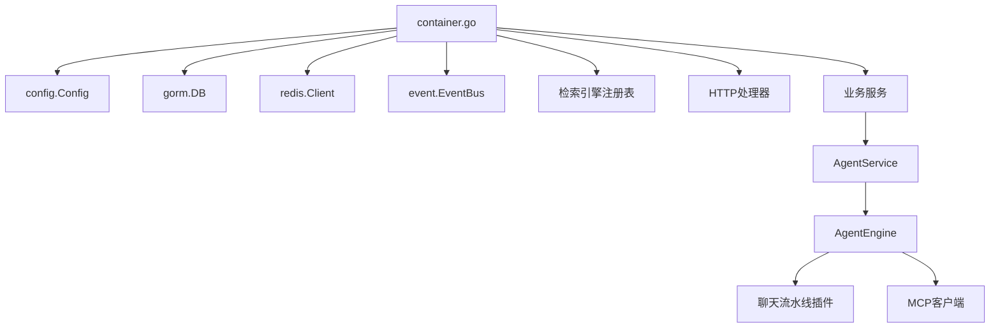

# 组件交互关系

<cite>
**本文引用的文件**
- [cmd/server/main.go](file://cmd/server/main.go)
- [internal/router/router.go](file://internal/router/router.go)
- [internal/middleware/auth.go](file://internal/middleware/auth.go)
- [internal/handler/auth.go](file://internal/handler/auth.go)
- [internal/container/container.go](file://internal/container/container.go)
- [internal/application/service/chat_pipline/chat_pipline.go](file://internal/application/service/chat_pipline/chat_pipline.go)
- [internal/agent/engine.go](file://internal/agent/engine.go)
- [internal/event/event.go](file://internal/event/event.go)
- [internal/handler/session/handler.go](file://internal/handler/session/handler.go)
- [internal/application/service/agent_service.go](file://internal/application/service/agent_service.go)
- [internal/mcp/client.go](file://internal/mcp/client.go)
- [frontend/src/main.ts](file://frontend/src/main.ts)
- [frontend/src/api/chat/index.ts](file://frontend/src/api/chat/index.ts)
- [frontend/src/stores/auth.ts](file://frontend/src/stores/auth.ts)
- [internal/models/chat/provider_chat.go](file://internal/models/chat/provider_chat.go)
</cite>

## 目录
1. [引言](#引言)
2. [项目结构](#项目结构)
3. [核心组件](#核心组件)
4. [架构总览](#架构总览)
5. [详细组件分析](#详细组件分析)
6. [依赖关系分析](#依赖关系分析)
7. [性能考虑](#性能考虑)
8. [故障排查指南](#故障排查指南)
9. [结论](#结论)
10. [附录](#附录)

## 引言
本文件面向WiseDx项目的组件交互关系，系统性梳理前后端与后端内部组件的交互方式与通信协议，覆盖认证授权、数据传输、gRPC/HTTP/事件传递、代理引擎与工具系统协作、聊天管道插件协调等主题，并提供数据流与时序图，帮助开发者与运维人员快速理解系统运行机制与最佳实践。

## 项目结构
WiseDx采用分层清晰的Go后端与Vue前端架构：
- 后端入口与容器装配：通过main函数构建依赖注入容器，初始化配置、Tracing、数据库、外部客户端、事件总线、聊天流水线插件与路由。
- 路由与中间件：统一注册CORS、日志、恢复、错误处理、认证与追踪中间件，按模块划分REST API。
- 业务服务层：封装领域服务（会话、消息、知识库、模型、评测、MCP服务等），并集成代理引擎与工具系统。
- 事件驱动：通过事件总线在检索、重排、合并、聊天生成、Agent执行等阶段进行解耦协作。
- 前端：Vue应用通过API模块与后端交互，Pinia状态管理维护认证态与租户切换。

图表来源
- [cmd/server/main.go](file://cmd/server/main.go#L88-L192)
- [internal/container/container.go](file://internal/container/container.go#L65-L209)
- [internal/router/router.go](file://internal/router/router.go#L53-L118)
- [internal/middleware/auth.go](file://internal/middleware/auth.go#L59-L197)
- [internal/handler/auth.go](file://internal/handler/auth.go#L21-L401)
- [internal/application/service/agent_service.go](file://internal/application/service/agent_service.go#L40-L201)
- [internal/agent/engine.go](file://internal/agent/engine.go#L25-L155)
- [internal/application/service/chat_pipline/chat_pipline.go](file://internal/application/service/chat_pipline/chat_pipline.go#L23-L78)
- [internal/event/event.go](file://internal/event/event.go#L83-L160)
- [internal/mcp/client.go](file://internal/mcp/client.go#L19-L135)
- [frontend/src/main.ts](file://frontend/src/main.ts#L1-L20)
- [frontend/src/api/chat/index.ts](file://frontend/src/api/chat/index.ts#L1-L53)
- [frontend/src/stores/auth.ts](file://frontend/src/stores/auth.ts#L1-L233)

章节来源
- [cmd/server/main.go](file://cmd/server/main.go#L88-L192)
- [internal/container/container.go](file://internal/container/container.go#L65-L209)

## 核心组件
- 服务器入口与容器
  - main.go负责环境变量加载、日志配置、Gin模式设置、依赖注入容器构建与HTTP服务器启动。
  - container.go集中注册基础设施（Tracing、数据库、Redis、文件存储、检索引擎注册、外部客户端）、仓储层、业务服务层、聊天流水线插件与HTTP处理器，并启动异步任务服务。
- 路由与中间件
  - router.go注册CORS、日志、恢复、错误处理、健康检查、认证与追踪中间件；按模块分组注册REST API。
  - middleware/auth.go实现JWT与API Key双通道认证，支持跨租户访问校验与上下文注入。
- 处理器层
  - handler/auth.go提供注册、登录、登出、刷新令牌、校验令牌、获取当前用户、修改密码等接口。
  - handler/session/handler.go提供会话创建、查询、分页、更新、删除、知识问答、Agent问答、停止会话等接口。
- 业务服务与代理引擎
  - application/service/agent_service.go负责创建Agent引擎，注册工具（知识检索、网络搜索、数据库查询、MCP工具等），并进行配置校验与知识库信息加载。
  - agent/engine.go实现ReAct循环：思考（LLM流式输出）、行动（工具调用）、观察（结果写入上下文）、最终答案生成与事件广播。
  - application/service/chat_pipline/chat_pipline.go定义插件接口与事件管理器，支持链式插件编排（检索、重排、合并、搜索、实体搜索、改写、历史加载、数据分析等）。
  - event/event.go定义事件类型与事件总线，支持同步/异步事件发布与订阅。
  - mcp/client.go封装MCP客户端，支持SSE与HTTP Streamable传输，提供工具与资源发现、调用能力。
- 前端交互
  - frontend/src/main.ts初始化Vue应用、Pinia、路由与国际化。
  - frontend/src/api/chat/index.ts封装会话、知识问答、Agent问答、消息加载、停止会话等API。
  - frontend/src/stores/auth.ts管理用户、租户、令牌、知识库与跨租户选择状态。

章节来源
- [internal/router/router.go](file://internal/router/router.go#L53-L118)
- [internal/middleware/auth.go](file://internal/middleware/auth.go#L59-L197)
- [internal/handler/auth.go](file://internal/handler/auth.go#L21-L401)
- [internal/handler/session/handler.go](file://internal/handler/session/handler.go#L15-L300)
- [internal/application/service/agent_service.go](file://internal/application/service/agent_service.go#L40-L201)
- [internal/agent/engine.go](file://internal/agent/engine.go#L25-L155)
- [internal/application/service/chat_pipline/chat_pipline.go](file://internal/application/service/chat_pipline/chat_pipline.go#L23-L78)
- [internal/event/event.go](file://internal/event/event.go#L83-L160)
- [internal/mcp/client.go](file://internal/mcp/client.go#L19-L135)
- [frontend/src/main.ts](file://frontend/src/main.ts#L1-L20)
- [frontend/src/api/chat/index.ts](file://frontend/src/api/chat/index.ts#L1-L53)
- [frontend/src/stores/auth.ts](file://frontend/src/stores/auth.ts#L1-L233)

## 架构总览
WiseDx采用“HTTP API + 事件总线 + 插件流水线”的解耦架构：
- 前端通过REST API与后端交互，后端通过认证中间件校验用户身份与租户权限。
- 业务服务层通过事件总线与聊天流水线插件协作，实现检索、重排、合并、聊天生成等步骤的可插拔扩展。
- 代理引擎在会话维度运行，结合工具系统与MCP服务，实现多轮ReAct推理与结果持久化。
- 外部服务（文档阅读、Neo4j、Qdrant、Elasticsearch、Redis、DuckDB）通过容器注册接入，统一生命周期管理。

图表来源
- [internal/router/router.go](file://internal/router/router.go#L53-L118)
- [internal/middleware/auth.go](file://internal/middleware/auth.go#L59-L197)
- [internal/handler/session/handler.go](file://internal/handler/session/handler.go#L15-L300)
- [internal/application/service/agent_service.go](file://internal/application/service/agent_service.go#L40-L201)
- [internal/agent/engine.go](file://internal/agent/engine.go#L25-L155)
- [internal/application/service/chat_pipline/chat_pipline.go](file://internal/application/service/chat_pipline/chat_pipline.go#L23-L78)
- [internal/event/event.go](file://internal/event/event.go#L83-L160)
- [internal/mcp/client.go](file://internal/mcp/client.go#L19-L135)
- [internal/container/container.go](file://internal/container/container.go#L65-L209)

## 详细组件分析

### 认证与授权流程（JWT与API Key）
- 认证中间件优先尝试JWT Bearer令牌，若失败则回退至X-API-Key（租户级API Key）。支持跨租户访问校验与租户信息注入。
- 登录/注册/刷新/校验/登出等接口由认证处理器实现，返回标准化响应与错误处理。
- 前端通过Pinia状态管理维护令牌与租户信息，支持跨租户切换。

图表来源
- [internal/middleware/auth.go](file://internal/middleware/auth.go#L59-L197)
- [internal/handler/auth.go](file://internal/handler/auth.go#L116-L158)
- [frontend/src/stores/auth.ts](file://frontend/src/stores/auth.ts#L1-L233)

章节来源
- [internal/middleware/auth.go](file://internal/middleware/auth.go#L59-L197)
- [internal/handler/auth.go](file://internal/handler/auth.go#L21-L401)
- [frontend/src/stores/auth.ts](file://frontend/src/stores/auth.ts#L1-L233)

### 会话与聊天交互（知识问答与Agent问答）
- 会话处理器提供会话创建、查询、分页、更新、删除、知识问答、Agent问答、停止会话等接口。
- 前端通过API模块发起请求，Agent问答支持流式输出与停止控制。
- 代理服务根据Agent配置创建Agent引擎，注册工具（知识检索、网络搜索、数据库查询、MCP工具等），并在ReAct循环中通过事件总线广播思考、工具调用、结果与最终答案。

图表来源
- [internal/handler/session/handler.go](file://internal/handler/session/handler.go#L15-L300)
- [internal/application/service/agent_service.go](file://internal/application/service/agent_service.go#L71-L201)
- [internal/agent/engine.go](file://internal/agent/engine.go#L75-L155)
- [internal/application/service/chat_pipline/chat_pipline.go](file://internal/application/service/chat_pipline/chat_pipline.go#L23-L78)
- [internal/event/event.go](file://internal/event/event.go#L123-L160)
- [internal/mcp/client.go](file://internal/mcp/client.go#L281-L321)
- [frontend/src/api/chat/index.ts](file://frontend/src/api/chat/index.ts#L17-L33)

章节来源
- [internal/handler/session/handler.go](file://internal/handler/session/handler.go#L15-L300)
- [internal/application/service/agent_service.go](file://internal/application/service/agent_service.go#L40-L201)
- [internal/agent/engine.go](file://internal/agent/engine.go#L25-L155)
- [frontend/src/api/chat/index.ts](file://frontend/src/api/chat/index.ts#L1-L53)

### 聊天流水线插件机制
- 插件接口定义OnEvent与ActivationEvents，事件管理器按事件类型构建插件链，支持链式调用与错误传播。
- 预定义插件错误类型便于统一处理与上报。
- 插件涵盖检索、重排、合并、搜索、实体搜索、改写、历史加载、数据分析、into_chat_message、chat_completion、stream过滤、top-k过滤等。

图表来源
- [internal/application/service/chat_pipline/chat_pipline.go](file://internal/application/service/chat_pipline/chat_pipline.go#L9-L141)

章节来源
- [internal/application/service/chat_pipline/chat_pipline.go](file://internal/application/service/chat_pipline/chat_pipline.go#L23-L78)

### 代理引擎与工具系统协作
- 代理引擎在每次迭代中：
  - 思考：调用LLM进行流式思考输出，通过事件总线广播思考片段。
  - 行动：解析工具调用，执行工具（知识检索、网络搜索、数据库查询、MCP工具等），并将结果写入上下文。
  - 观察：将工具结果作为“tool”消息写入上下文，供后续迭代使用。
  - 最终答案：当达到终止条件或最大迭代次数时，生成最终答案并通过事件总线广播。
- 工具注册由代理服务根据配置动态完成，支持知识库工具、网络搜索工具、数据库查询工具、MCP工具等。

图表来源
- [internal/agent/engine.go](file://internal/agent/engine.go#L157-L521)

章节来源
- [internal/agent/engine.go](file://internal/agent/engine.go#L75-L155)
- [internal/application/service/agent_service.go](file://internal/application/service/agent_service.go#L203-L335)

### MCP服务与工具系统
- MCP客户端支持SSE与HTTP Streamable传输，自动处理连接丢失与会话失效。
- 代理服务根据Agent配置选择启用的MCP服务（全部或指定集合），注册MCP工具到工具注册表。
- 前端通过MCP服务管理API创建、查询、测试、工具与资源列举等。

图表来源
- [internal/application/service/agent_service.go](file://internal/application/service/agent_service.go#L103-L157)
- [internal/mcp/client.go](file://internal/mcp/client.go#L62-L135)
- [internal/mcp/client.go](file://internal/mcp/client.go#L192-L252)

章节来源
- [internal/mcp/client.go](file://internal/mcp/client.go#L19-L135)
- [internal/application/service/agent_service.go](file://internal/application/service/agent_service.go#L103-L157)

### 前后端数据流与API交互
- 前端应用入口初始化应用、路由与状态管理。
- 聊天API模块封装会话、知识问答、Agent问答、消息加载、停止会话等请求。
- 前端通过Pinia状态管理用户、租户、令牌与知识库选择，支持跨租户切换。

图表来源
- [frontend/src/main.ts](file://frontend/src/main.ts#L1-L20)
- [frontend/src/api/chat/index.ts](file://frontend/src/api/chat/index.ts#L1-L53)
- [internal/router/router.go](file://internal/router/router.go#L53-L118)
- [internal/handler/session/handler.go](file://internal/handler/session/handler.go#L15-L300)
- [internal/application/service/agent_service.go](file://internal/application/service/agent_service.go#L71-L201)

章节来源
- [frontend/src/main.ts](file://frontend/src/main.ts#L1-L20)
- [frontend/src/api/chat/index.ts](file://frontend/src/api/chat/index.ts#L1-L53)
- [frontend/src/stores/auth.ts](file://frontend/src/stores/auth.ts#L1-L233)

## 依赖关系分析
- 组件耦合与内聚
  - 路由与处理器通过接口解耦，处理器依赖服务接口而非具体实现，便于替换与测试。
  - 代理引擎与工具系统通过工具注册表解耦，工具实现可插拔。
  - 事件总线提供松耦合的跨模块通信机制，避免直接依赖。
- 外部依赖
  - 数据库（PostgreSQL）、搜索引擎（Elasticsearch V7/V8、Qdrant）、图数据库（Neo4j）、缓存（Redis）、文档阅读服务（DocReader）、DuckDB等通过容器统一注册与生命周期管理。
- 循环依赖
  - 通过接口与依赖注入避免循环依赖；事件总线在模块间仅通过事件类型耦合，不持有对象引用。

图表来源
- [internal/container/container.go](file://internal/container/container.go#L65-L209)
- [internal/application/service/agent_service.go](file://internal/application/service/agent_service.go#L40-L69)
- [internal/agent/engine.go](file://internal/agent/engine.go#L25-L73)
- [internal/application/service/chat_pipline/chat_pipline.go](file://internal/application/service/chat_pipline/chat_pipline.go#L23-L51)
- [internal/mcp/client.go](file://internal/mcp/client.go#L19-L47)

章节来源
- [internal/container/container.go](file://internal/container/container.go#L65-L209)

## 性能考虑
- 并发与池化
  - 容器初始化goroutine池（ants）以提升并发任务处理能力，支持预分配优化。
- 缓存与上下文
  - Redis用于上下文存储与会话状态管理，减少重复计算与I/O。
- 检索与重排
  - 多引擎检索（PostgreSQL、Elasticsearch、Qdrant）与重排模型按配置启用，避免不必要的开销。
- 流式输出
  - LLM与工具调用均支持流式输出，降低首字节延迟，提升用户体验。
- 模型适配
  - 不同模型提供商对工具调用参数支持不同，通过请求定制器适配（如DeepSeek跳过tool_choice，Generic通过模板参数传递thinking）。

章节来源
- [internal/container/container.go](file://internal/container/container.go#L534-L554)
- [internal/models/chat/provider_chat.go](file://internal/models/chat/provider_chat.go#L36-L82)

## 故障排查指南
- 认证失败
  - 检查Authorization头格式与JWT有效性；确认租户API Key格式与有效性；核对跨租户访问权限。
- 会话与消息异常
  - 确认会话ID与租户ID匹配；检查消息加载分页参数；关注事件总线处理错误。
- 代理执行中断
  - 查看事件总线是否有错误事件；检查工具调用结果与数据；确认MCP连接状态与会话有效性。
- 检索与重排问题
  - 核对检索引擎配置与可用性；检查重排模型可用性；确认知识库与文档状态。

章节来源
- [internal/middleware/auth.go](file://internal/middleware/auth.go#L193-L196)
- [internal/handler/session/handler.go](file://internal/handler/session/handler.go#L120-L152)
- [internal/event/event.go](file://internal/event/event.go#L123-L160)
- [internal/mcp/client.go](file://internal/mcp/client.go#L137-L155)

## 结论
WiseDx通过清晰的分层架构、事件驱动与插件化流水线，实现了前后端高效协作与后端内部组件的高内聚低耦合。认证中间件确保安全边界，代理引擎与工具系统提供强大的推理与工具调用能力，聊天流水线插件支持灵活扩展。建议在生产环境中重点关注外部依赖可用性、事件总线处理性能与工具调用稳定性。

## 附录
- 关键接口与职责
  - 路由与中间件：统一入口、认证与追踪。
  - 处理器层：业务接口实现与错误处理。
  - 业务服务层：领域逻辑封装与工具注册。
  - 代理引擎：ReAct循环与事件广播。
  - 事件总线：模块间解耦通信。
  - MCP客户端：外部工具与资源接入。
  - 前端：API调用与状态管理。