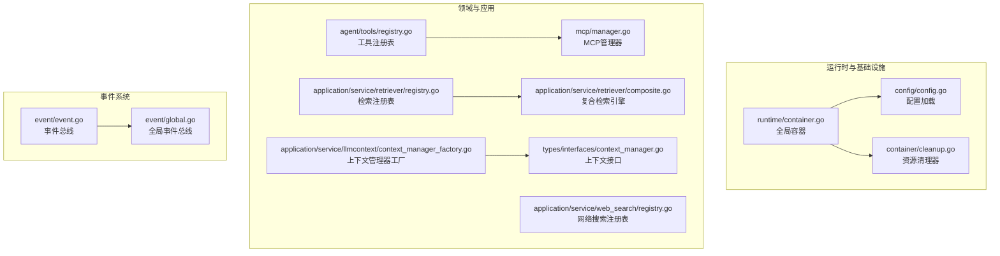
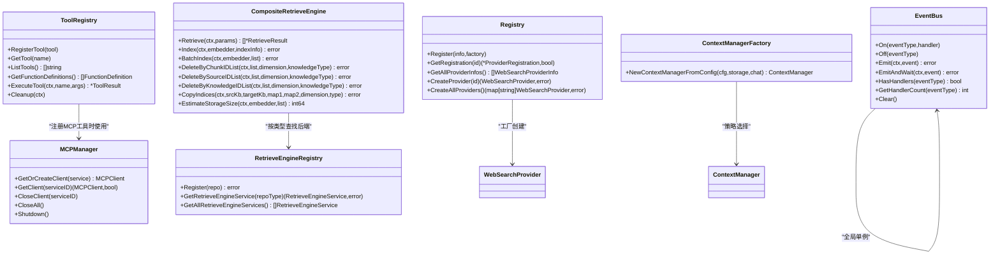
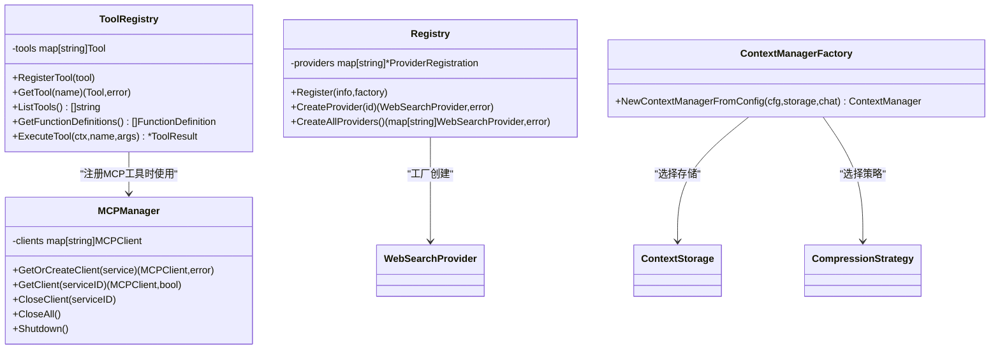
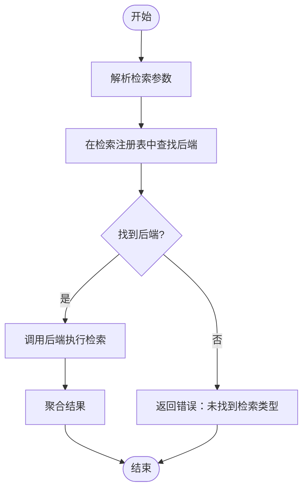
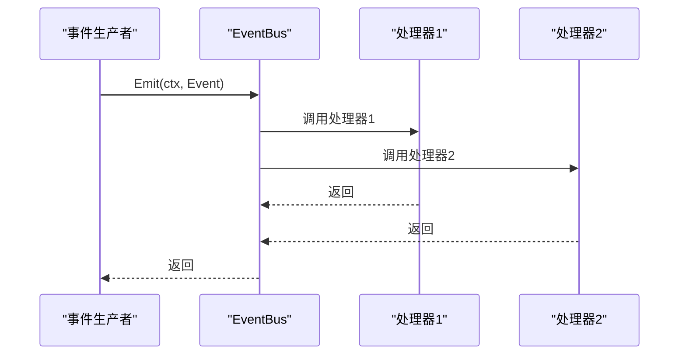
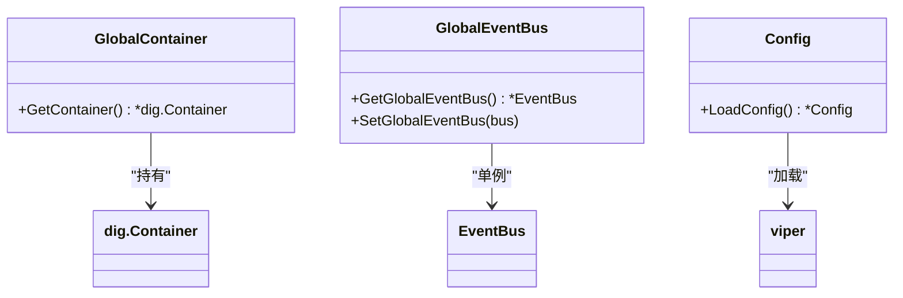
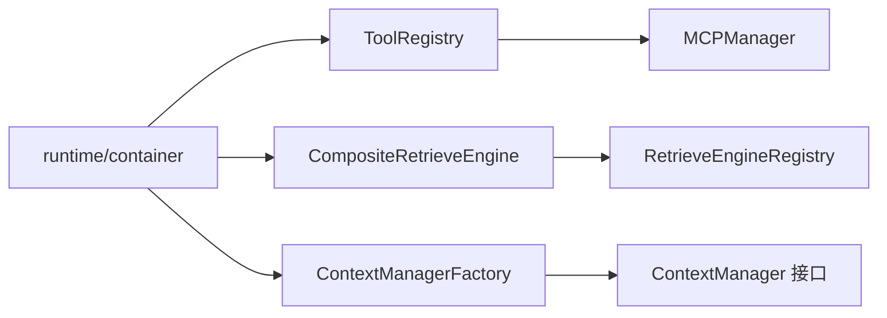

# 设计模式应用

<cite>
**本文档引用的文件**
- [internal/agent/tools/registry.go](file://internal/agent/tools/registry.go)
- [internal/mcp/manager.go](file://internal/mcp/manager.go)
- [internal/agent/tools/mcp_tool.go](file://internal/agent/tools/mcp_tool.go)
- [internal/application/service/retriever/registry.go](file://internal/application/service/retriever/registry.go)
- [internal/application/service/retriever/composite.go](file://internal/application/service/retriever/composite.go)
- [internal/application/service/web_search/registry.go](file://internal/application/service/web_search/registry.go)
- [internal/event/event.go](file://internal/event/event.go)
- [internal/event/global.go](file://internal/event/global.go)
- [internal/event/usage_example.md](file://internal/event/usage_example.md)
- [internal/config/config.go](file://internal/config/config.go)
- [internal/runtime/container.go](file://internal/runtime/container.go)
- [internal/container/container.go](file://internal/container/container.go)
- [internal/container/cleanup.go](file://internal/container/cleanup.go)
- [internal/application/service/llmcontext/context_manager_factory.go](file://internal/application/service/llmcontext/context_manager_factory.go)
- [internal/application/service/llmcontext/context_manager.go](file://internal/application/service/llmcontext/context_manager.go)
- [internal/types/interfaces/context_manager.go](file://internal/types/interfaces/context_manager.go)
- [internal/application/service/session.go](file://internal/application/service/session.go)
</cite>

## 目录
1. [引言](#引言)
2. [项目结构](#项目结构)
3. [核心组件](#核心组件)
4. [架构总览](#架构总览)
5. [详细组件分析](#详细组件分析)
6. [依赖关系分析](#依赖关系分析)
7. [性能考量](#性能考量)
8. [故障排查指南](#故障排查指南)
9. [结论](#结论)
10. [附录](#附录)

## 引言
本文件聚焦WiseDx项目中设计模式的实际应用，系统梳理并解释以下模式在工程中的落地位置与价值：
- 工厂模式：工具注册表与服务创建（工具注册、MCP客户端工厂、上下文管理器工厂）
- 策略模式：检索引擎与存储后端选择（检索复合引擎、压缩策略）
- 观察者模式：事件系统（事件总线、全局事件总线）
- 单例模式：配置管理与全局容器

通过对关键实现文件的逐段分析，给出模式类图、序列图与流程图，并总结最佳实践与可维护性提升点。

## 项目结构
WiseDx采用分层+模块化的组织方式：
- 内核层：运行时容器、配置、清理器
- 应用层：检索、网络搜索、上下文管理、会话服务等
- 领域层：工具注册与MCP集成、事件系统
- 接口层：类型接口与统一抽象

图表来源
- [internal/runtime/container.go](file://internal/runtime/container.go#L1-L24)
- [internal/config/config.go](file://internal/config/config.go#L170-L230)
- [internal/container/cleanup.go](file://internal/container/cleanup.go#L1-L56)
- [internal/agent/tools/registry.go](file://internal/agent/tools/registry.go#L12-L58)
- [internal/mcp/manager.go](file://internal/mcp/manager.go#L13-L96)
- [internal/application/service/retriever/registry.go](file://internal/application/service/retriever/registry.go#L11-L50)
- [internal/application/service/retriever/composite.go](file://internal/application/service/retriever/composite.go#L26-L90)
- [internal/application/service/web_search/registry.go](file://internal/application/service/web_search/registry.go#L11-L71)
- [internal/application/service/llmcontext/context_manager_factory.go](file://internal/application/service/llmcontext/context_manager_factory.go#L24-L81)
- [internal/types/interfaces/context_manager.go](file://internal/types/interfaces/context_manager.go#L9-L31)
- [internal/event/event.go](file://internal/event/event.go#L83-L160)
- [internal/event/global.go](file://internal/event/global.go#L8-L27)

章节来源
- [internal/runtime/container.go](file://internal/runtime/container.go#L1-L24)
- [internal/container/container.go](file://internal/container/container.go#L57-L84)

## 核心组件
- 工具注册表：集中注册与执行工具，提供函数定义导出与执行管线埋点
- MCP管理器：按服务ID缓存与复用客户端，负责连接、初始化与清理
- 检索注册表与复合引擎：按检索类型路由到具体后端，支持并发聚合
- 网络搜索注册表：以工厂函数创建不同提供商实例
- 事件总线与全局事件总线：发布订阅、同步/异步模式、一次性/持续监听
- 上下文管理器工厂：根据配置选择存储与压缩策略
- 全局容器与配置：统一依赖注入入口与配置加载

章节来源
- [internal/agent/tools/registry.go](file://internal/agent/tools/registry.go#L12-L114)
- [internal/mcp/manager.go](file://internal/mcp/manager.go#L13-L169)
- [internal/application/service/retriever/registry.go](file://internal/application/service/retriever/registry.go#L11-L65)
- [internal/application/service/retriever/composite.go](file://internal/application/service/retriever/composite.go#L26-L336)
- [internal/application/service/web_search/registry.go](file://internal/application/service/web_search/registry.go#L11-L89)
- [internal/event/event.go](file://internal/event/event.go#L83-L234)
- [internal/event/global.go](file://internal/event/global.go#L8-L57)
- [internal/application/service/llmcontext/context_manager_factory.go](file://internal/application/service/llmcontext/context_manager_factory.go#L24-L81)
- [internal/types/interfaces/context_manager.go](file://internal/types/interfaces/context_manager.go#L9-L31)
- [internal/config/config.go](file://internal/config/config.go#L170-L230)
- [internal/runtime/container.go](file://internal/runtime/container.go#L9-L23)

## 架构总览
WiseDx通过“工厂+注册表+接口”的组合实现高内聚、低耦合：
- 工厂模式负责“如何创建”，注册表负责“如何发现与聚合”
- 策略模式负责“如何选择算法/后端”，观察者模式负责“如何解耦通知”
- 单例模式确保全局唯一性（配置、容器、事件总线）

图表来源
- [internal/agent/tools/registry.go](file://internal/agent/tools/registry.go#L12-L114)
- [internal/mcp/manager.go](file://internal/mcp/manager.go#L13-L169)
- [internal/application/service/retriever/registry.go](file://internal/application/service/retriever/registry.go#L11-L65)
- [internal/application/service/retriever/composite.go](file://internal/application/service/retriever/composite.go#L26-L336)
- [internal/application/service/web_search/registry.go](file://internal/application/service/web_search/registry.go#L11-L89)
- [internal/event/event.go](file://internal/event/event.go#L83-L234)
- [internal/application/service/llmcontext/context_manager_factory.go](file://internal/application/service/llmcontext/context_manager_factory.go#L24-L81)

## 详细组件分析

### 工厂模式：工具注册表与服务创建
- 工具注册表：集中注册工具，提供按名称检索与执行；支持导出函数定义用于LLM调用
- MCP管理器：按服务ID缓存客户端，复用已建立的长连接；提供初始化与清理
- 网络搜索注册表：以工厂函数创建不同提供商实例，支持批量创建与信息枚举
- 上下文管理器工厂：依据配置选择存储与压缩策略，形成“策略+工厂”组合

图表来源
- [internal/agent/tools/registry.go](file://internal/agent/tools/registry.go#L12-L114)
- [internal/mcp/manager.go](file://internal/mcp/manager.go#L13-L169)
- [internal/application/service/web_search/registry.go](file://internal/application/service/web_search/registry.go#L11-L89)
- [internal/application/service/llmcontext/context_manager_factory.go](file://internal/application/service/llmcontext/context_manager_factory.go#L24-L81)

最佳实践
- 工具注册表应保证幂等注册与并发安全
- MCP客户端工厂需处理连接状态与超时，避免重复初始化
- 网络搜索工厂应捕获初始化异常，保证健壮性
- 上下文管理器工厂应提供默认值与降级策略

章节来源
- [internal/agent/tools/registry.go](file://internal/agent/tools/registry.go#L24-L114)
- [internal/mcp/manager.go](file://internal/mcp/manager.go#L37-L120)
- [internal/application/service/web_search/registry.go](file://internal/application/service/web_search/registry.go#L33-L89)
- [internal/application/service/llmcontext/context_manager_factory.go](file://internal/application/service/llmcontext/context_manager_factory.go#L24-L81)

### 策略模式：检索引擎与存储后端选择
- 检索注册表：按类型注册后端，提供并发安全的查找
- 复合检索引擎：根据检索类型动态路由到对应后端，支持并发聚合与错误传播
- 存储后端选择：上下文管理器工厂根据配置选择内存/Redis存储与滑动窗口/智能压缩策略

图表来源
- [internal/application/service/retriever/composite.go](file://internal/application/service/retriever/composite.go#L32-L62)
- [internal/application/service/retriever/registry.go](file://internal/application/service/retriever/registry.go#L37-L50)

最佳实践
- 为每种检索类型明确支持范围，避免越界调用
- 并发执行时统一错误收集与传播
- 在复合引擎中对不同后端的差异进行封装，对外暴露一致接口

章节来源
- [internal/application/service/retriever/registry.go](file://internal/application/service/retriever/registry.go#L11-L65)
- [internal/application/service/retriever/composite.go](file://internal/application/service/retriever/composite.go#L26-L336)

### 观察者模式：事件系统
- 事件总线：支持同步/异步发布、多处理器、等待模式、统计与清空
- 全局事件总线：单例封装，提供便捷的全局访问
- 使用示例：测试与异步处理演示

图表来源
- [internal/event/event.go](file://internal/event/event.go#L123-L160)
- [internal/event/global.go](file://internal/event/global.go#L14-L57)

最佳实践
- 同步事件总线仅用于关键路径，非关键路径使用异步
- 控制事件数据体量，避免阻塞
- 使用中间件与请求ID串联链路

章节来源
- [internal/event/event.go](file://internal/event/event.go#L83-L234)
- [internal/event/global.go](file://internal/event/global.go#L8-L57)
- [internal/event/usage_example.md](file://internal/event/usage_example.md#L366-L420)

### 单例模式：配置管理与客户端实例
- 全局容器：运行时包提供全局dig容器，贯穿整个应用生命周期
- 全局事件总线：通过单例确保全局唯一，避免重复实例
- 配置加载：集中加载配置与模板，提供默认值与环境变量替换

图表来源
- [internal/runtime/container.go](file://internal/runtime/container.go#L9-L23)
- [internal/event/global.go](file://internal/event/global.go#L8-L27)
- [internal/config/config.go](file://internal/config/config.go#L170-L230)

最佳实践
- 容器初始化放在应用启动阶段，避免并发初始化
- 事件总线单例仅在必要时替换（如测试）
- 配置加载失败时提供清晰错误与回退策略

章节来源
- [internal/runtime/container.go](file://internal/runtime/container.go#L9-L23)
- [internal/event/global.go](file://internal/event/global.go#L8-L57)
- [internal/config/config.go](file://internal/config/config.go#L170-L230)

## 依赖关系分析
- 工具注册表依赖MCP管理器以注册外部工具
- 复合检索引擎依赖检索注册表按类型路由
- 上下文管理器工厂依赖存储接口与压缩策略接口
- 全局容器负责装配上述组件

图表来源
- [internal/agent/tools/registry.go](file://internal/agent/tools/registry.go#L12-L114)
- [internal/mcp/manager.go](file://internal/mcp/manager.go#L13-L169)
- [internal/application/service/retriever/registry.go](file://internal/application/service/retriever/registry.go#L11-L65)
- [internal/application/service/retriever/composite.go](file://internal/application/service/retriever/composite.go#L26-L336)
- [internal/application/service/llmcontext/context_manager_factory.go](file://internal/application/service/llmcontext/context_manager_factory.go#L24-L81)
- [internal/runtime/container.go](file://internal/runtime/container.go#L9-L23)

章节来源
- [internal/container/container.go](file://internal/container/container.go#L57-L84)

## 性能考量
- 事件总线：同步模式顺序执行，异步模式fire-and-forget，性能接近纳秒级
- 检索复合引擎：并发执行各后端任务，统一错误收集，减少整体等待
- 上下文管理器：滑动窗口策略轻量，智能压缩策略需模型参与但具备降本能力
- 资源清理器：逆序执行，确保释放顺序正确

章节来源
- [internal/event/event.go](file://internal/event/event.go#L141-L160)
- [internal/application/service/retriever/composite.go](file://internal/application/service/retriever/composite.go#L131-L197)
- [internal/application/service/llmcontext/context_manager_factory.go](file://internal/application/service/llmcontext/context_manager_factory.go#L64-L77)
- [internal/container/cleanup.go](file://internal/container/cleanup.go#L25-L56)

## 故障排查指南
- 工具执行失败：检查工具是否注册、参数是否正确、执行结果字段
- MCP客户端异常：确认服务启用、传输类型、连接与初始化超时
- 检索类型不匹配：确认检索类型是否在后端支持列表中
- 事件处理失败：检查处理器返回错误、异步模式下的错误丢失
- 配置加载失败：检查配置文件路径、环境变量替换、模板目录存在性

章节来源
- [internal/agent/tools/registry.go](file://internal/agent/tools/registry.go#L60-L114)
- [internal/mcp/manager.go](file://internal/mcp/manager.go#L37-L120)
- [internal/application/service/retriever/composite.go](file://internal/application/service/retriever/composite.go#L75-L88)
- [internal/event/event.go](file://internal/event/event.go#L152-L160)
- [internal/config/config.go](file://internal/config/config.go#L170-L230)

## 结论
WiseDx通过工厂、策略、观察者与单例等设计模式，实现了：
- 工厂与注册表：统一创建与发现，降低耦合
- 策略与复合：灵活切换与组合后端，提升扩展性
- 观察者：解耦事件生产与消费，增强可观测性
- 单例：确保全局一致性与稳定性

这些模式共同提升了系统的可维护性、可扩展性与可测试性。

## 附录
- 代码片段路径示例（不直接展示代码内容）：
  - 工具注册与执行：[internal/agent/tools/registry.go](file://internal/agent/tools/registry.go#L24-L114)
  - MCP客户端工厂与缓存：[internal/mcp/manager.go](file://internal/mcp/manager.go#L37-L120)
  - 检索注册表与复合引擎：[internal/application/service/retriever/registry.go](file://internal/application/service/retriever/registry.go#L24-L50), [internal/application/service/retriever/composite.go](file://internal/application/service/retriever/composite.go#L32-L90)
  - 网络搜索工厂：[internal/application/service/web_search/registry.go](file://internal/application/service/web_search/registry.go#L33-L89)
  - 事件总线与全局事件总线：[internal/event/event.go](file://internal/event/event.go#L106-L160), [internal/event/global.go](file://internal/event/global.go#L14-L57)
  - 上下文管理器工厂：[internal/application/service/llmcontext/context_manager_factory.go](file://internal/application/service/llmcontext/context_manager_factory.go#L24-L81)
  - 配置加载：[internal/config/config.go](file://internal/config/config.go#L170-L230)
  - 全局容器：[internal/runtime/container.go](file://internal/runtime/container.go#L9-L23)