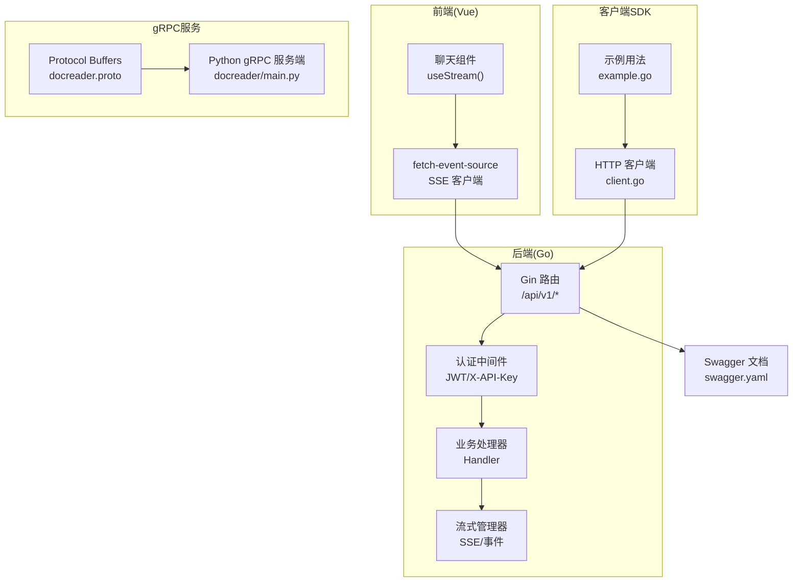
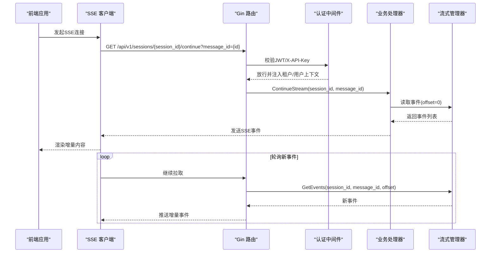
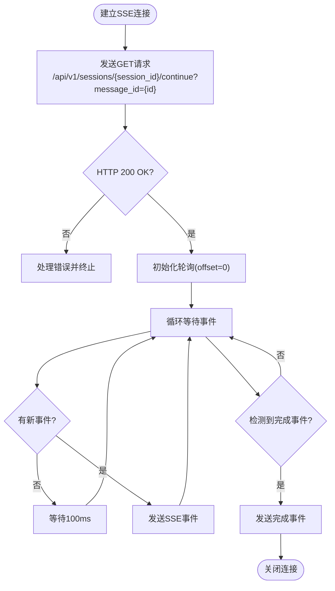
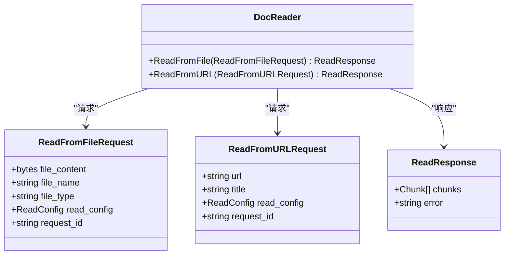
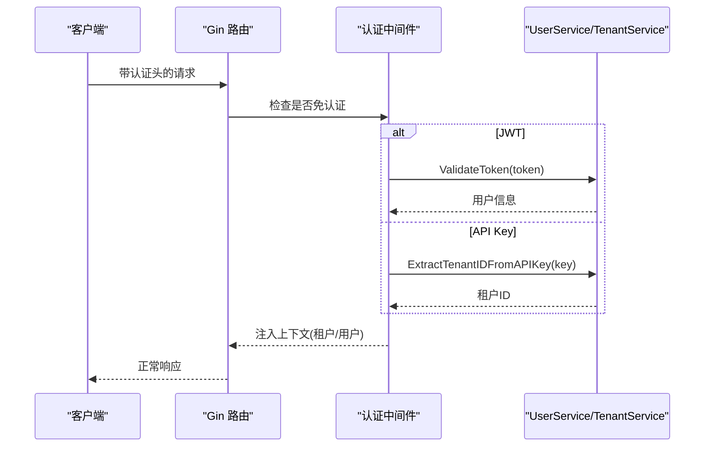
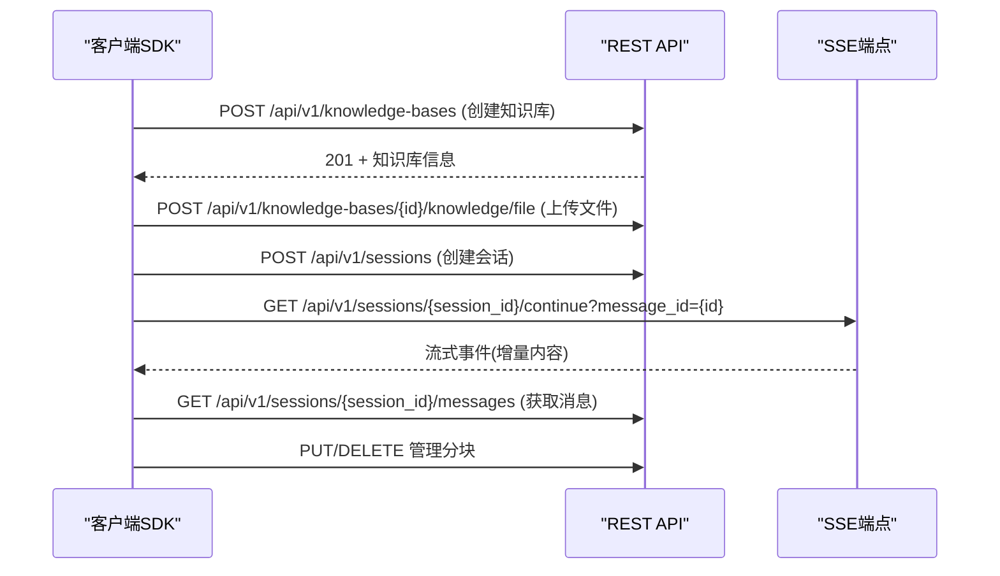
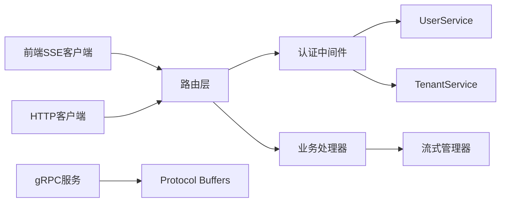

# API接口设计

<cite>
**本文档引用的文件**
- [cmd/server/main.go](file://cmd/server/main.go)
- [internal/router/router.go](file://internal/router/router.go)
- [internal/middleware/auth.go](file://internal/middleware/auth.go)
- [internal/handler/auth.go](file://internal/handler/auth.go)
- [internal/handler/session/stream.go](file://internal/handler/session/stream.go)
- [frontend/src/api/chat/streame.ts](file://frontend/src/api/chat/streame.ts)
- [client/client.go](file://client/client.go)
- [client/example.go](file://client/example.go)
- [docreader/proto/docreader.proto](file://docreader/proto/docreader.proto)
- [docs/swagger.yaml](file://docs/swagger.yaml)
- [docs/api/README.md](file://docs/api/README.md)
- [internal/errors/errors.go](file://internal/errors/errors.go)
- [frontend/src/api/system/index.ts](file://frontend/src/api/system/index.ts)
</cite>

## 目录
1. [引言](#引言)
2. [项目结构](#项目结构)
3. [核心组件](#核心组件)
4. [架构总览](#架构总览)
5. [详细组件分析](#详细组件分析)
6. [依赖分析](#依赖分析)
7. [性能考虑](#性能考虑)
8. [故障排除指南](#故障排除指南)
9. [结论](#结论)
10. [附录](#附录)

## 引言
本文件面向API设计与实现，系统化梳理WeKnora项目的RESTful API、WebSocket（SSE）流式接口、gRPC接口、认证与授权机制、版本管理与兼容策略，以及SDK与前端集成实践。文档旨在帮助开发者快速理解并正确使用API，确保一致性、可维护性与安全性。

## 项目结构
WeKnora采用Go语言后端配合Vue前端的前后端分离架构，后端通过Gin框架组织路由，中间件负责认证与日志等横切关注点；前端通过fetch-event-source消费SSE流；客户端SDK封装HTTP调用；gRPC服务独立于主服务运行。

**图表来源**
- [cmd/server/main.go](file://cmd/server/main.go#L12-L18)
- [internal/router/router.go](file://internal/router/router.go#L54-L118)
- [frontend/src/api/chat/streame.ts](file://frontend/src/api/chat/streame.ts#L18-L182)
- [client/client.go](file://client/client.go#L16-L105)
- [docreader/proto/docreader.proto](file://docreader/proto/docreader.proto#L1-L89)
- [docs/swagger.yaml](file://docs/swagger.yaml#L1-L10)

**章节来源**
- [cmd/server/main.go](file://cmd/server/main.go#L12-L18)
- [internal/router/router.go](file://internal/router/router.go#L54-L118)

## 核心组件
- 路由与分组：统一在/api/v1下按功能模块分组，如认证、知识库、知识、会话、消息、模型、初始化、系统等。
- 认证中间件：支持JWT与X-API-Key两种认证方式，部分公开接口（健康检查、登录、注册、刷新）免认证。
- 错误处理：统一错误码与HTTP状态码映射，标准化错误响应结构。
- 流式接口：基于SSE的问答流式输出，支持断线重连与继续拉取。
- gRPC接口：文档解析服务，定义在Protocol Buffers中，提供从文件/URL读取文档的能力。
- SDK与前端：HTTP客户端封装与SSE消费逻辑，便于集成与调试。

**章节来源**
- [internal/router/router.go](file://internal/router/router.go#L96-L115)
- [internal/middleware/auth.go](file://internal/middleware/auth.go#L18-L57)
- [internal/errors/errors.go](file://internal/errors/errors.go#L8-L40)

## 架构总览
后端通过Gin构建HTTP服务，注册Swagger文档，挂载认证与追踪中间件，再按模块注册路由。前端通过SSE持续接收流式数据，SDK封装HTTP请求并设置认证头。gRPC服务独立进程，提供文档读取能力。

**图表来源**
- [internal/handler/session/stream.go](file://internal/handler/session/stream.go#L18-L176)
- [frontend/src/api/chat/streame.ts](file://frontend/src/api/chat/streame.ts#L31-L148)

**章节来源**
- [internal/handler/session/stream.go](file://internal/handler/session/stream.go#L18-L176)
- [frontend/src/api/chat/streame.ts](file://frontend/src/api/chat/streame.ts#L18-L182)

## 详细组件分析

### RESTful API 设计原则与实现规范
- 版本与基址
  - 基础路径：/api/v1
  - 版本号：1.0（Swagger注释）
- HTTP方法选择
  - 资源幂等：GET/PUT/DELETE；变更资源：POST/DELETE
  - 批量操作：明确使用批量语义的端点（如标签批量更新）
- URL路径设计
  - 资源层级清晰：/knowledge-bases/:id/knowledge、/sessions/:id/messages
  - 查询参数用于过滤与分页：/knowledge/search?query=...
- 状态码使用
  - 成功：200/201/204
  - 参数错误：400
  - 未授权/鉴权失败：401
  - 禁止访问：403
  - 资源不存在：404
  - 冲突/重复：409
  - 请求过多：429
  - 服务器错误：500
- 统一错误响应
  - 结构：success=false + error(code/message/details)
  - 错误码枚举覆盖通用、租户、Agent等场景

**章节来源**
- [cmd/server/main.go](file://cmd/server/main.go#L12-L18)
- [internal/router/router.go](file://internal/router/router.go#L96-L115)
- [internal/errors/errors.go](file://internal/errors/errors.go#L12-L40)
- [docs/swagger.yaml](file://docs/swagger.yaml#L1-L10)

### WebSocket 接口（SSE）设计与实现
- 连接管理
  - SSE端点：/api/v1/sessions/{session_id}/continue?message_id={id}
  - 前端使用@fetch-event-source消费，支持onmessage、onerror、onclose回调
  - 建议设置X-Request-ID便于追踪
- 消息格式
  - 事件类型：message
  - 数据结构：包含响应类型、内容、完成标记、引用等字段
- 断线重连机制
  - 后端提供继续拉取接口，前端可携带message_id重连
  - 后端按offset增量推送，支持完成事件与最终事件发送

**图表来源**
- [internal/handler/session/stream.go](file://internal/handler/session/stream.go#L133-L175)
- [frontend/src/api/chat/streame.ts](file://frontend/src/api/chat/streame.ts#L128-L148)

**章节来源**
- [internal/handler/session/stream.go](file://internal/handler/session/stream.go#L18-L176)
- [frontend/src/api/chat/streame.ts](file://frontend/src/api/chat/streame.ts#L18-L182)

### gRPC 接口定义与实现
- 协议定义
  - 服务：DocReader
  - 方法：ReadFromFile、ReadFromURL
  - 消息：ReadFromFileRequest、ReadFromURLRequest、ReadResponse、Chunk、Image等
- 实现要点
  - Python侧启动gRPC服务，注册DocReaderServicer与Health服务
  - 服务监听本地端口，等待客户端调用
- 适用场景
  - 文档解析与分块抽取，支持文件内容与URL两种输入

**图表来源**
- [docreader/proto/docreader.proto](file://docreader/proto/docreader.proto#L8-L89)

**章节来源**
- [docreader/proto/docreader.proto](file://docreader/proto/docreader.proto#L1-L89)

### 认证与授权机制
- 认证方式
  - JWT：Authorization: Bearer {token}
  - API Key：X-API-Key: sk-开头的密钥
  - 可选：X-Tenant-ID用于跨租户访问（需具备跨租户权限）
- 授权策略
  - 认证中间件拦截请求，校验令牌或API Key
  - 校验通过后将租户与用户信息注入上下文
  - 部分公开接口（健康检查、登录、注册、刷新）免认证
- 安全策略
  - 建议开启CORS并限制允许的方法与头部
  - 生产环境禁用Swagger文档暴露

**图表来源**
- [internal/middleware/auth.go](file://internal/middleware/auth.go#L59-L196)
- [internal/handler/auth.go](file://internal/handler/auth.go#L42-L104)

**章节来源**
- [internal/middleware/auth.go](file://internal/middleware/auth.go#L18-L57)
- [internal/middleware/auth.go](file://internal/middleware/auth.go#L59-L196)
- [internal/handler/auth.go](file://internal/handler/auth.go#L42-L104)

### API 版本管理与向后兼容
- 版本策略
  - 当前版本：/api/v1
  - Swagger中声明版本号与基础路径
- 兼容性保障
  - 保留旧端点一段时间，提供迁移指引
  - 错误码与响应结构保持稳定，避免破坏性变更
- 弃用通知
  - 通过文档与变更日志标注废弃端点与替代方案
- 迁移指南
  - 建议逐步替换旧字段与端点，前端与SDK同步更新

**章节来源**
- [cmd/server/main.go](file://cmd/server/main.go#L12-L18)
- [docs/swagger.yaml](file://docs/swagger.yaml#L1-L10)

### API 使用示例与 SDK 集成
- SDK封装
  - HTTP客户端：统一设置Content-Type、可选X-API-Key、X-Request-ID
  - 响应解析：非2xx状态码统一抛错
- 示例流程
  - 创建知识库 → 上传知识 → 创建会话 → 知识问答（流式）→ 获取消息 → 管理分块 → 清理资源
- 前端集成
  - 使用fetch-event-source订阅SSE
  - 设置Authorization与X-Request-ID
  - 处理onmessage、onerror、onclose事件

**图表来源**
- [client/client.go](file://client/client.go#L16-L105)
- [client/example.go](file://client/example.go#L22-L246)
- [frontend/src/api/chat/streame.ts](file://frontend/src/api/chat/streame.ts#L31-L148)

**章节来源**
- [client/client.go](file://client/client.go#L16-L105)
- [client/example.go](file://client/example.go#L22-L246)
- [frontend/src/api/chat/streame.ts](file://frontend/src/api/chat/streame.ts#L18-L182)

## 依赖分析
- 路由层依赖中间件与处理器，处理器依赖服务层与流式管理器
- 认证中间件依赖UserService与TenantService，实现JWT与API Key双通道
- 前端SSE客户端依赖fetch-event-source，SDK依赖HTTP客户端
- gRPC服务独立于HTTP服务，通过Protocol Buffers定义契约

**图表来源**
- [internal/router/router.go](file://internal/router/router.go#L54-L118)
- [internal/middleware/auth.go](file://internal/middleware/auth.go#L59-L196)
- [frontend/src/api/chat/streame.ts](file://frontend/src/api/chat/streame.ts#L18-L182)
- [client/client.go](file://client/client.go#L16-L105)
- [docreader/proto/docreader.proto](file://docreader/proto/docreader.proto#L1-L89)

**章节来源**
- [internal/router/router.go](file://internal/router/router.go#L54-L118)
- [internal/middleware/auth.go](file://internal/middleware/auth.go#L59-L196)

## 性能考虑
- SSE轮询间隔：默认100ms，可根据网络与负载调整
- 流式事件累积：前端可设置节流渲染，避免频繁重绘
- 认证缓存：在中间件层避免重复校验（如租户信息），减少数据库压力
- 超时与重试：SDK设置合理超时，前端SSE连接异常时自动重试
- 日志与追踪：开启OpenTelemetry追踪，结合X-Request-ID定位问题

## 故障排除指南
- 常见错误与排查
  - 401未授权：检查Authorization头或X-API-Key是否正确
  - 403禁止访问：确认跨租户权限与目标租户有效性
  - 404资源不存在：核对session_id/message_id是否正确
  - 500服务器错误：查看日志与错误码，定位具体处理器
- 错误响应结构
  - 统一返回success=false与error对象，包含code/message/details
- 建议的日志字段
  - X-Request-ID、租户ID、用户ID、请求路径与方法

**章节来源**
- [internal/errors/errors.go](file://internal/errors/errors.go#L42-L192)
- [internal/middleware/auth.go](file://internal/middleware/auth.go#L193-L196)

## 结论
WeKnora的API体系以清晰的版本路径、严谨的认证授权、统一的错误处理与灵活的SSE流式接口为核心，辅以gRPC文档解析能力与完善的SDK/前端集成方案。遵循本文档的设计原则与最佳实践，可确保系统的稳定性、可扩展性与易用性。

## 附录
- 基础信息与认证机制
  - 基础URL：/api/v1
  - 认证方式：JWT（Authorization: Bearer）与API Key（X-API-Key）
  - 建议：为每个请求添加X-Request-ID便于追踪
- 系统信息与配置
  - 系统信息：/api/v1/system/info
  - MinIO桶列表：/api/v1/system/minio/buckets
  - 租户级KV配置：/api/v1/tenants/kv/*

**章节来源**
- [docs/api/README.md](file://docs/api/README.md#L15-L39)
- [frontend/src/api/system/index.ts](file://frontend/src/api/system/index.ts#L76-L112)