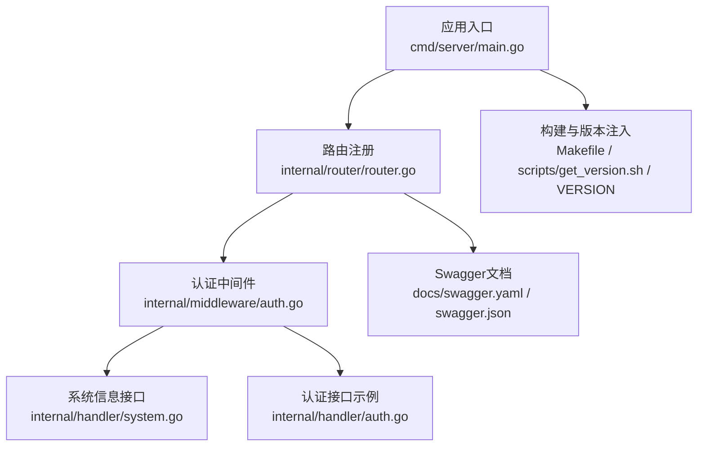
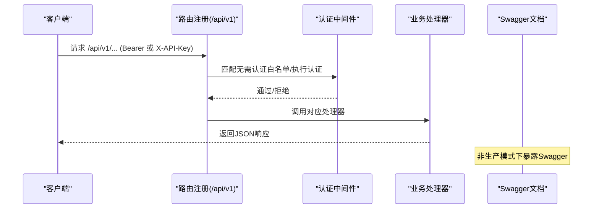
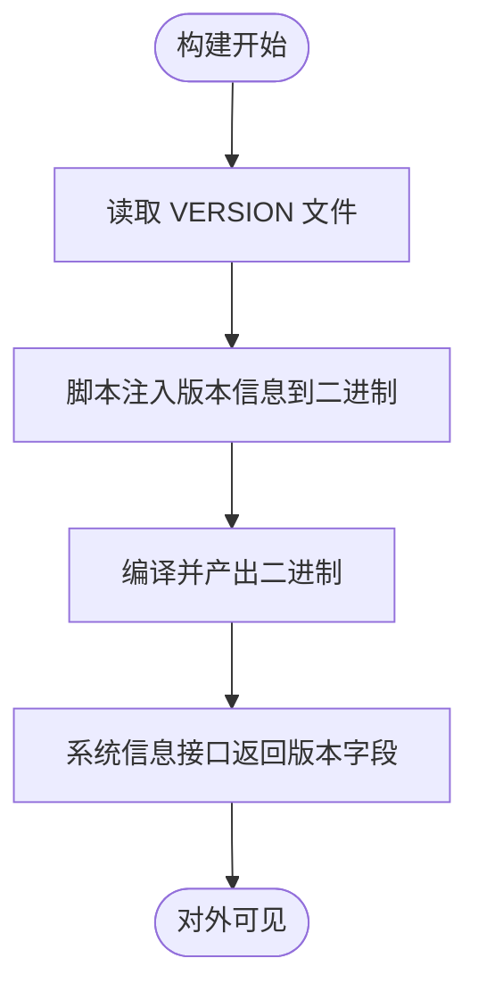
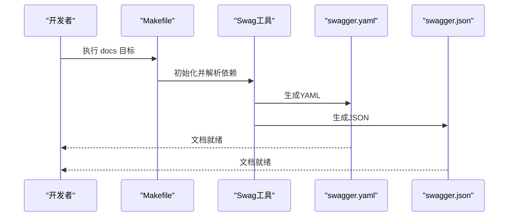
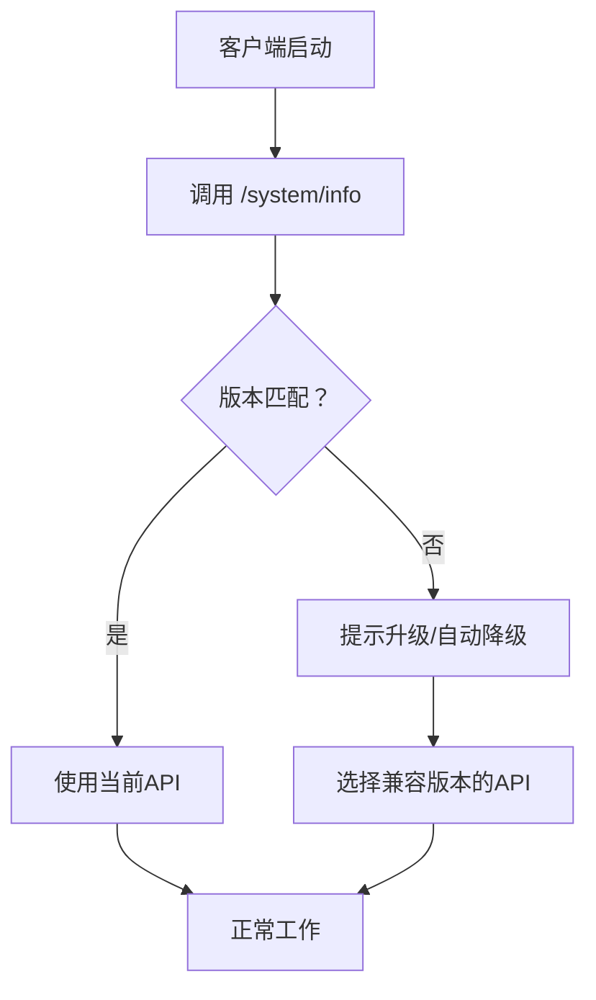
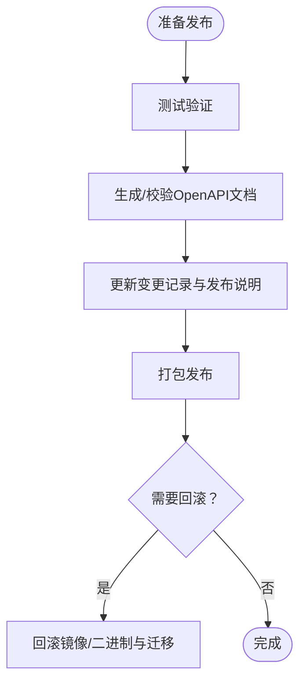
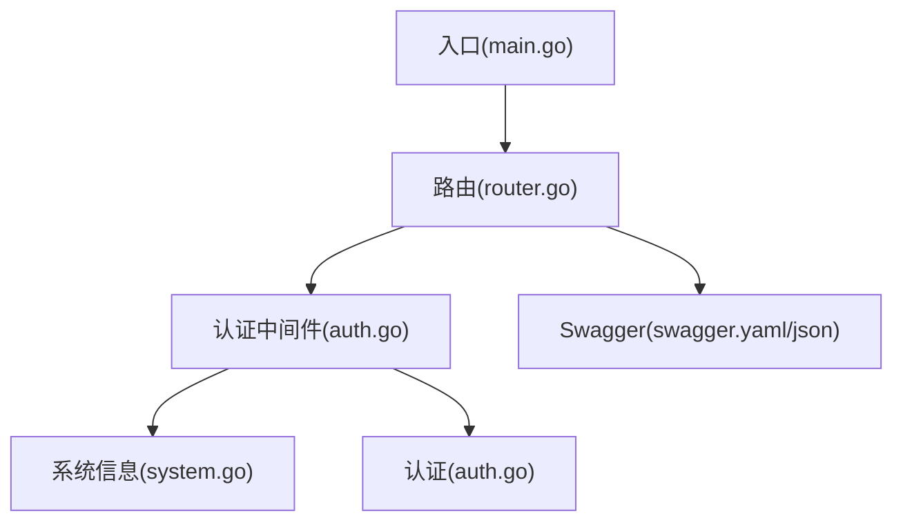

# API版本管理

<cite>
**本文引用的文件**
- [cmd/server/main.go](file://cmd/server/main.go)
- [internal/router/router.go](file://internal/router/router.go)
- [internal/middleware/auth.go](file://internal/middleware/auth.go)
- [internal/handler/system.go](file://internal/handler/system.go)
- [internal/handler/auth.go](file://internal/handler/auth.go)
- [internal/types/interfaces/tenant.go](file://internal/types/interfaces/tenant.go)
- [docs/swagger.yaml](file://docs/swagger.yaml)
- [docs/swagger.json](file://docs/swagger.json)
- [docs/api/README.md](file://docs/api/README.md)
- [Makefile](file://Makefile)
- [scripts/get_version.sh](file://scripts/get_version.sh)
- [VERSION](file://VERSION)
- [CHANGELOG.md](file://CHANGELOG.md)
</cite>

## 目录
1. [引言](#引言)
2. [项目结构](#项目结构)
3. [核心组件](#核心组件)
4. [架构总览](#架构总览)
5. [详细组件分析](#详细组件分析)
6. [依赖关系分析](#依赖关系分析)
7. [性能考量](#性能考量)
8. [故障排查指南](#故障排查指南)
9. [结论](#结论)
10. [附录](#附录)

## 引言
本文件系统化梳理本仓库的API版本管理策略与实践，覆盖版本控制策略（语义化版本号、版本路径设计、版本头标识）、向后兼容性保障（废弃API标记、迁移时间窗、兼容性矩阵）、Swagger/OpenAPI文档维护（接口文档生成、版本对比、变更记录）、客户端适配策略（版本检测、自动升级与降级处理）、完整版本发布流程（测试验证、文档更新、通知机制）以及版本回滚与紧急修复操作指南。旨在帮助开发者与运维人员建立一致、可追溯且低风险的API演进体系。

## 项目结构
- 版本号来源与注入
  - 版本号文件：VERSION
  - 构建时注入：通过脚本与Makefile将版本信息注入到二进制，供系统信息接口返回
- API版本路径
  - 全局基础路径：/api/v1
  - Swagger文档：按基础路径聚合
- 认证与安全
  - Bearer Token与X-API-Key双通道认证
  - 非生产环境可启用Swagger文档

**图表来源**
- [cmd/server/main.go](file://cmd/server/main.go#L12-L12)
- [internal/router/router.go](file://internal/router/router.go#L96-L115)
- [internal/middleware/auth.go](file://internal/middleware/auth.go#L59-L196)
- [internal/handler/system.go](file://internal/handler/system.go#L52-L92)
- [internal/handler/auth.go](file://internal/handler/auth.go#L42-L104)
- [docs/swagger.yaml](file://docs/swagger.yaml#L1-L1)
- [Makefile](file://Makefile#L198-L203)
- [scripts/get_version.sh](file://scripts/get_version.sh#L66-L68)
- [VERSION](file://VERSION#L1-L1)

**章节来源**
- [cmd/server/main.go](file://cmd/server/main.go#L12-L12)
- [internal/router/router.go](file://internal/router/router.go#L96-L115)
- [docs/swagger.yaml](file://docs/swagger.yaml#L1-L1)

## 核心组件
- 版本号与构建注入
  - 版本号：VERSION文件提供当前版本
  - 构建注入：脚本与Makefile将版本、提交ID、构建时间、Go版本注入二进制，系统信息接口返回
- API版本路径与认证
  - 基础路径：/api/v1
  - 认证：Bearer Token与X-API-Key
  - Swagger：非生产模式下启用
- 文档与变更记录
  - OpenAPI：docs/swagger.yaml与swagger.json
  - 变更记录：CHANGELOG.md

**章节来源**
- [VERSION](file://VERSION#L1-L1)
- [scripts/get_version.sh](file://scripts/get_version.sh#L66-L68)
- [Makefile](file://Makefile#L198-L203)
- [internal/handler/system.go](file://internal/handler/system.go#L52-L92)
- [internal/router/router.go](file://internal/router/router.go#L96-L115)
- [docs/swagger.yaml](file://docs/swagger.yaml#L1-L1)
- [docs/swagger.json](file://docs/swagger.json#L1-L1)
- [CHANGELOG.md](file://CHANGELOG.md#L1-L573)

## 架构总览
API版本管理贯穿“入口—路由—中间件—处理器—文档—构建”的全链路，确保版本路径、认证与文档的一致性与可追溯性。

**图表来源**
- [internal/router/router.go](file://internal/router/router.go#L96-L115)
- [internal/middleware/auth.go](file://internal/middleware/auth.go#L59-L196)
- [docs/swagger.yaml](file://docs/swagger.yaml#L1-L1)

## 详细组件分析

### 版本控制策略
- 语义化版本号
  - 来源：VERSION文件
  - 注入：构建时通过脚本与ldflags注入，系统信息接口返回
- 版本路径设计
  - 固定基础路径：/api/v1
  - 所有路由均在此前缀下注册
- 版本头标识
  - 当前未显式暴露API版本头；可通过系统信息接口获取构建版本信息作为间接依据

**图表来源**
- [VERSION](file://VERSION#L1-L1)
- [scripts/get_version.sh](file://scripts/get_version.sh#L66-L68)
- [Makefile](file://Makefile#L222-L228)
- [internal/handler/system.go](file://internal/handler/system.go#L52-L92)

**章节来源**
- [VERSION](file://VERSION#L1-L1)
- [scripts/get_version.sh](file://scripts/get_version.sh#L66-L68)
- [Makefile](file://Makefile#L222-L228)
- [internal/handler/system.go](file://internal/handler/system.go#L52-L92)

### 向后兼容性保证
- 废弃API标记
  - 仓库未发现显式“废弃”注解或状态码标注；建议在变更记录中明确标注废弃与移除计划
- 迁移时间窗
  - 建议在变更记录中明确“废弃—冻结—移除”的时间窗口，配合文档与通知机制
- 兼容性矩阵
  - 当前未提供API兼容性矩阵；建议基于版本与路由维度建立矩阵，标注各版本支持状态

**章节来源**
- [CHANGELOG.md](file://CHANGELOG.md#L1-L573)

### Swagger/OpenAPI文档维护
- 接口文档生成
  - 通过Makefile调用swag生成OpenAPI文档至docs目录
- 版本对比
  - 通过docs/swagger.yaml与docs/swagger.json对比差异
- 变更记录
  - CHANGELOG.md记录重大变更，辅助理解版本间差异

**图表来源**
- [Makefile](file://Makefile#L198-L203)
- [docs/swagger.yaml](file://docs/swagger.yaml#L1-L1)
- [docs/swagger.json](file://docs/swagger.json#L1-L1)

**章节来源**
- [Makefile](file://Makefile#L198-L203)
- [docs/swagger.yaml](file://docs/swagger.yaml#L1-L1)
- [docs/swagger.json](file://docs/swagger.json#L1-L1)
- [CHANGELOG.md](file://CHANGELOG.md#L1-L573)

### 客户端适配策略
- 版本检测
  - 通过系统信息接口获取版本、提交ID、构建时间等元数据，用于识别服务端版本
- 自动升级
  - 建议客户端在启动时拉取系统信息，比较本地版本与服务端版本，提示升级
- 降级处理
  - 建议客户端在不支持新特性时自动回退到兼容版本的API子集

**图表来源**
- [internal/handler/system.go](file://internal/handler/system.go#L52-L92)
- [docs/api/README.md](file://docs/api/README.md#L17-L18)

**章节来源**
- [internal/handler/system.go](file://internal/handler/system.go#L52-L92)
- [docs/api/README.md](file://docs/api/README.md#L17-L18)

### 版本发布流程
- 测试验证
  - 单元测试与集成测试通过
- 文档更新
  - 生成并校验OpenAPI文档
- 通知机制
  - 变更记录与发布说明同步更新
- 版本回滚
  - 通过镜像/二进制回滚与数据库迁移回退

**图表来源**
- [Makefile](file://Makefile#L198-L203)
- [CHANGELOG.md](file://CHANGELOG.md#L1-L573)

**章节来源**
- [Makefile](file://Makefile#L198-L203)
- [CHANGELOG.md](file://CHANGELOG.md#L1-L573)

### 版本回滚与紧急修复
- 回滚步骤
  - 回退镜像/二进制至上一个稳定版本
  - 如涉及数据结构变更，执行数据库迁移回退
- 紧急修复
  - 发布热修复版本，更新OpenAPI文档并通知客户端

**章节来源**
- [Makefile](file://Makefile#L164-L189)
- [CHANGELOG.md](file://CHANGELOG.md#L1-L573)

## 依赖关系分析
- 入口与路由
  - 入口文件设置基础路径与安全定义
  - 路由在/api/v1下注册，Swagger在非生产模式启用
- 中间件与认证
  - 认证中间件支持Bearer与X-API-Key，白名单覆盖健康检查与部分认证接口
- 处理器与文档
  - 处理器通过注解生成OpenAPI定义，系统信息接口返回版本元数据

**图表来源**
- [cmd/server/main.go](file://cmd/server/main.go#L12-L12)
- [internal/router/router.go](file://internal/router/router.go#L78-L87)
- [internal/middleware/auth.go](file://internal/middleware/auth.go#L18-L39)
- [internal/handler/system.go](file://internal/handler/system.go#L52-L92)
- [internal/handler/auth.go](file://internal/handler/auth.go#L42-L104)
- [docs/swagger.yaml](file://docs/swagger.yaml#L1-L1)

**章节来源**
- [cmd/server/main.go](file://cmd/server/main.go#L12-L12)
- [internal/router/router.go](file://internal/router/router.go#L78-L87)
- [internal/middleware/auth.go](file://internal/middleware/auth.go#L18-L39)
- [internal/handler/system.go](file://internal/handler/system.go#L52-L92)
- [internal/handler/auth.go](file://internal/handler/auth.go#L42-L104)
- [docs/swagger.yaml](file://docs/swagger.yaml#L1-L1)

## 性能考量
- 路由与中间件链路短，认证与日志中间件开销可控
- Swagger在生产模式关闭，避免不必要的资源消耗
- 版本信息仅在系统信息接口返回，不影响常规业务接口性能

[本节为通用指导，无需特定文件分析]

## 故障排查指南
- 认证失败
  - 检查Authorization头格式与X-API-Key有效性
  - 确认用户与租户状态
- 文档不可见
  - 确认非生产模式且未禁用Swagger
- 版本信息异常
  - 检查构建时版本注入是否正确

**章节来源**
- [internal/middleware/auth.go](file://internal/middleware/auth.go#L59-L196)
- [internal/router/router.go](file://internal/router/router.go#L78-L87)
- [internal/handler/system.go](file://internal/handler/system.go#L52-L92)

## 结论
本仓库采用固定基础路径与双认证通道的API设计，结合构建时版本注入与OpenAPI文档生成，形成可追溯的版本管理闭环。建议进一步完善废弃API标记、迁移时间窗与兼容性矩阵，并在发布流程中强化自动化与通知机制，以提升API演进的稳定性与可维护性。

[本节为总结，无需特定文件分析]

## 附录
- 基础路径与认证
  - 基础路径：/api/v1
  - 认证：Bearer与X-API-Key
- 版本信息接口
  - 系统信息接口返回版本、提交ID、构建时间、Go版本等

**章节来源**
- [internal/router/router.go](file://internal/router/router.go#L96-L115)
- [docs/api/README.md](file://docs/api/README.md#L17-L18)
- [internal/handler/system.go](file://internal/handler/system.go#L52-L92)