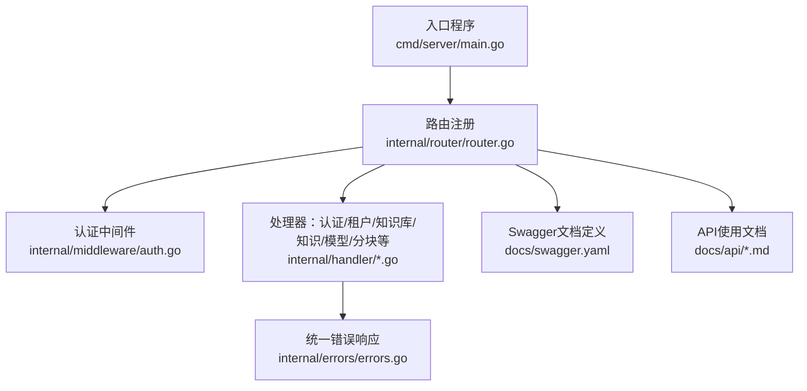
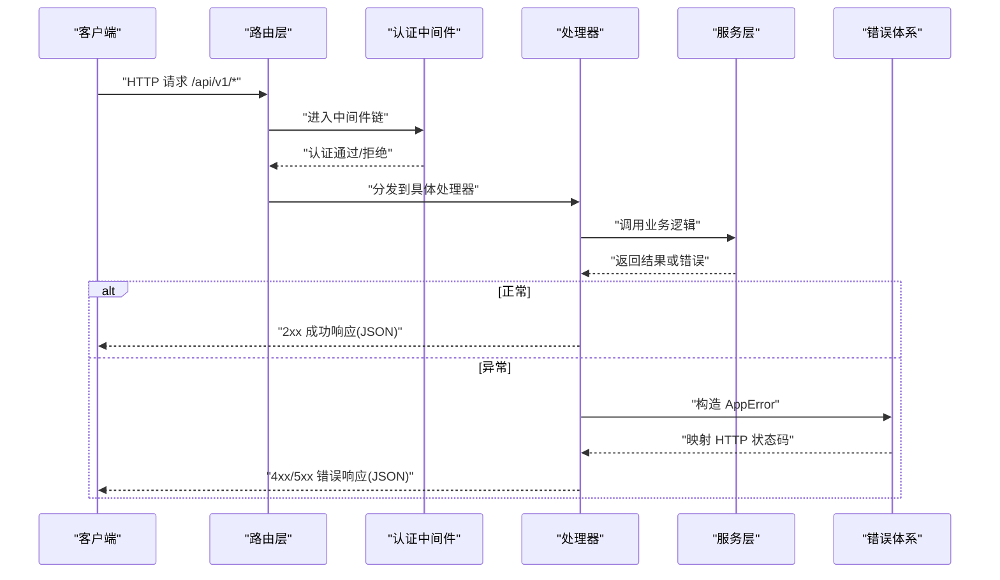
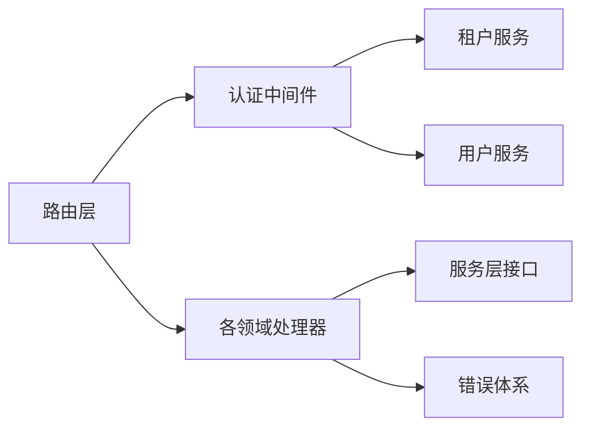

# RESTful API接口

<cite>
**本文引用的文件**
- [cmd/server/main.go](file://cmd/server/main.go)
- [internal/router/router.go](file://internal/router/router.go)
- [docs/swagger.yaml](file://docs/swagger.yaml)
- [docs/api/README.md](file://docs/api/README.md)
- [docs/api/tenant.md](file://docs/api/tenant.md)
- [docs/api/knowledge-base.md](file://docs/api/knowledge-base.md)
- [docs/api/knowledge.md](file://docs/api/knowledge.md)
- [docs/api/model.md](file://docs/api/model.md)
- [docs/api/chunk.md](file://docs/api/chunk.md)
- [internal/handler/auth.go](file://internal/handler/auth.go)
- [internal/handler/knowledgebase.go](file://internal/handler/knowledgebase.go)
- [internal/handler/knowledge.go](file://internal/handler/knowledge.go)
- [internal/middleware/auth.go](file://internal/middleware/auth.go)
- [internal/errors/errors.go](file://internal/errors/errors.go)
</cite>

## 目录
1. [简介](#简介)
2. [项目结构](#项目结构)
3. [核心组件](#核心组件)
4. [架构总览](#架构总览)
5. [详细组件分析](#详细组件分析)
6. [依赖分析](#依赖分析)
7. [性能考虑](#性能考虑)
8. [故障排查指南](#故障排查指南)
9. [结论](#结论)
10. [附录](#附录)

## 简介
本文件面向开发者与集成方，系统化梳理 WeKnora 的 RESTful API 接口，覆盖 HTTP 方法使用规范、URL 设计原则、状态码标准、请求/响应数据格式、完整端点清单与使用示例、错误处理机制与调试技巧。API 基础路径为 /api/v1，统一采用 JSON 数据格式，支持两种认证方式：JWT Bearer Token 与租户级 API Key。

## 项目结构
- 入口程序负责加载环境变量、构建依赖注入容器、启动 HTTP 服务器与优雅关闭流程。
- 路由层集中注册各模块路由，按功能域分组，统一挂载认证与追踪中间件。
- 处理器层实现具体业务逻辑，遵循 Gin 的 HandlerFunc 模式，统一返回结构。
- 中间件层提供认证、日志、恢复、错误处理与链路追踪。
- 错误体系定义统一错误码与错误响应结构，便于前端与集成方一致化处理。

图表来源
- [cmd/server/main.go](file://cmd/server/main.go#L88-L191)
- [internal/router/router.go](file://internal/router/router.go#L54-L118)
- [internal/middleware/auth.go](file://internal/middleware/auth.go#L59-L196)
- [internal/errors/errors.go](file://internal/errors/errors.go#L42-L191)

章节来源
- [cmd/server/main.go](file://cmd/server/main.go#L88-L191)
- [internal/router/router.go](file://internal/router/router.go#L54-L118)

## 核心组件
- 入口与服务器
  - 负责加载 .env、校验必要环境变量、设置日志、选择 Gin 运行模式、构建容器并启动 HTTP 服务器。
- 路由与中间件
  - 路由按模块分组，统一挂载 CORS、请求ID、日志、恢复、错误处理、认证与追踪中间件。
  - 认证支持 Bearer Token 与 X-API-Key，支持跨租户切换。
- 处理器
  - 每个领域模块对应 Handler，负责参数解析、调用服务层、错误转换与统一响应。
- 错误体系
  - 定义错误码枚举与 AppError 结构，统一映射到 HTTP 状态码。

章节来源
- [cmd/server/main.go](file://cmd/server/main.go#L47-L86)
- [internal/router/router.go](file://internal/router/router.go#L54-L118)
- [internal/middleware/auth.go](file://internal/middleware/auth.go#L59-L196)
- [internal/errors/errors.go](file://internal/errors/errors.go#L42-L191)

## 架构总览
下图展示请求从进入系统到返回响应的关键流转，包括认证、路由分发、处理器执行与错误处理。

图表来源
- [internal/router/router.go](file://internal/router/router.go#L90-L115)
- [internal/middleware/auth.go](file://internal/middleware/auth.go#L59-L196)
- [internal/handler/auth.go](file://internal/handler/auth.go#L53-L104)
- [internal/errors/errors.go](file://internal/errors/errors.go#L61-L125)

## 详细组件分析

### 认证与安全
- 认证方式
  - Bearer Token：Authorization: Bearer <token>
  - X-API-Key：X-API-Key: sk-...
- 跨租户访问
  - 可通过 X-Tenant-ID 指定目标租户，需具备跨租户访问权限。
- 无需认证的端点
  - /health、/api/v1/auth/register、/api/v1/auth/login、/api/v1/auth/refresh

章节来源
- [internal/middleware/auth.go](file://internal/middleware/auth.go#L18-L39)
- [internal/middleware/auth.go](file://internal/middleware/auth.go#L59-L196)

### URL 设计原则与端点清单
- 基础路径
  - /api/v1
- 资源命名与层级
  - 采用名词复数形式，路径层级清晰，参数通过路径段或查询参数传递。
- 端点概览（按模块）
  - 认证：注册、登录、刷新、校验、登出、当前用户、改密
  - 租户：创建、查询、更新、删除、列表、KV配置
  - 知识库：创建、列表、详情、更新、删除、拷贝、混合搜索
  - 知识：文件/URL/手动创建、列表、详情、更新、删除、下载、标签批量更新、搜索
  - 分块：列表、按ID删除、批量删除
  - 模型：提供商列表、创建、列表、详情、更新、删除
  - 会话/消息/聊天/评估/初始化/系统/MCP/网络搜索/自定义Agent 等

章节来源
- [internal/router/router.go](file://internal/router/router.go#L96-L115)
- [docs/api/README.md](file://docs/api/README.md#L15-L20)

### HTTP 方法使用规范
- GET：获取资源列表或详情，部分搜索接口使用 GET 但携带 JSON 请求体
- POST：创建资源（文件上传使用 multipart/form-data）
- PUT：更新资源
- DELETE：删除资源
- PATCH：未在路由中显式注册

章节来源
- [internal/router/router.go](file://internal/router/router.go#L120-L441)

### 状态码使用标准
- 2xx 成功
  - 200 OK：常规成功
  - 201 Created：创建成功
  - 204 No Content：删除成功且无返回体
- 4xx 客户端错误
  - 400 Bad Request：参数错误/校验失败
  - 401 Unauthorized：未认证/无效认证
  - 403 Forbidden：权限不足/跨租户无权
  - 404 Not Found：资源不存在
  - 409 Conflict：冲突（如重复知识）
  - 413 Payload Too Large：文件过大
  - 429 Too Many Requests：请求频率过高
- 5xx 服务器错误
  - 500 Internal Server Error：服务器内部错误
  - 503 Service Unavailable：服务不可用

章节来源
- [internal/errors/errors.go](file://internal/errors/errors.go#L12-L40)
- [internal/errors/errors.go](file://internal/errors/errors.go#L61-L125)
- [internal/handler/knowledge.go](file://internal/handler/knowledge.go#L67-L84)

### 请求与响应数据格式
- 统一响应结构
  - 成功：{"success": true, "data": ...}
  - 失败：{"success": false, "error": {"code": "...", "message": "...", "details": "..."}}
- 错误码枚举
  - 覆盖通用错误、租户相关、Agent 相关等
- Swagger 定义
  - 详尽的数据模型、枚举与字段约束，作为接口契约参考

章节来源
- [docs/api/README.md](file://docs/api/README.md#L41-L54)
- [docs/swagger.yaml](file://docs/swagger.yaml#L1-L50)
- [internal/errors/errors.go](file://internal/errors/errors.go#L42-L60)

### 认证端点
- POST /api/v1/auth/register
  - 请求体：用户名、邮箱、密码
  - 成功：201，返回用户信息
  - 失败：400/403
- POST /api/v1/auth/login
  - 请求体：邮箱、密码
  - 成功：200，返回 token、用户、租户信息
  - 失败：401
- POST /api/v1/auth/refresh
  - 刷新令牌
- GET /api/v1/auth/validate
  - 校验令牌有效性
- POST /api/v1/auth/logout
  - 撤销令牌
- GET /api/v1/auth/me
  - 获取当前用户
- POST /api/v1/auth/change-password
  - 修改密码

章节来源
- [internal/handler/auth.go](file://internal/handler/auth.go#L53-L104)
- [internal/handler/auth.go](file://internal/handler/auth.go#L116-L158)
- [internal/handler/auth.go](file://internal/handler/auth.go#L170-L200)

### 租户管理端点
- POST /api/v1/tenants
  - 创建租户，返回 API Key
- GET /api/v1/tenants/:id
  - 获取租户详情
- PUT /api/v1/tenants/:id
  - 更新租户，可能变更 API Key
- DELETE /api/v1/tenants/:id
  - 删除租户
- GET /api/v1/tenants
  - 获取租户列表
- GET /api/v1/tenants/all
  - 跨租户权限：列出所有租户
- GET /api/v1/tenants/search
  - 跨租户权限：搜索租户
- GET/PUT /api/v1/tenants/:id/kv/:key
  - 租户级 KV 配置读取/更新

章节来源
- [docs/api/tenant.md](file://docs/api/tenant.md#L5-L11)
- [docs/api/tenant.md](file://docs/api/tenant.md#L13-L70)
- [docs/api/tenant.md](file://docs/api/tenant.md#L72-L113)
- [docs/api/tenant.md](file://docs/api/tenant.md#L115-L177)
- [docs/api/tenant.md](file://docs/api/tenant.md#L179-L196)
- [docs/api/tenant.md](file://docs/api/tenant.md#L198-L243)

### 知识库管理端点
- POST /api/v1/knowledge-bases
  - 创建知识库，支持 chunking、图像处理、嵌入/重排序/视觉模型配置
- GET /api/v1/knowledge-bases
  - 获取知识库列表
- GET /api/v1/knowledge-bases/:id
  - 获取知识库详情
- PUT /api/v1/knowledge-bases/:id
  - 更新知识库
- DELETE /api/v1/knowledge-bases/:id
  - 删除知识库
- GET /api/v1/knowledge-bases/:id/hybrid-search
  - 混合搜索（GET + JSON 请求体）

章节来源
- [docs/api/knowledge-base.md](file://docs/api/knowledge-base.md#L5-L13)
- [docs/api/knowledge-base.md](file://docs/api/knowledge-base.md#L15-L96)
- [docs/api/knowledge-base.md](file://docs/api/knowledge-base.md#L98-L157)
- [docs/api/knowledge-base.md](file://docs/api/knowledge-base.md#L159-L216)
- [docs/api/knowledge-base.md](file://docs/api/knowledge-base.md#L218-L298)
- [docs/api/knowledge-base.md](file://docs/api/knowledge-base.md#L319-L371)

### 知识管理端点
- POST /api/v1/knowledge-bases/:id/knowledge/file
  - multipart/form-data：file、metadata、enable_multimodel、fileName
- POST /api/v1/knowledge-bases/:id/knowledge/url
  - JSON：url、enable_multimodel
- POST /api/v1/knowledge-bases/:id/knowledge/manual
  - JSON：title、content、status
- GET /api/v1/knowledge-bases/:id/knowledge
  - 查询参数：page/page_size/tag_id
- GET /api/v1/knowledge/:id
- PUT /api/v1/knowledge/:id
- PUT /api/v1/knowledge/manual/:id
- DELETE /api/v1/knowledge/:id
- GET /api/v1/knowledge/:id/download
- PUT /api/v1/knowledge/tags
- GET /api/v1/knowledge/batch
- PUT /api/v1/knowledge/image/:id/:chunk_id

章节来源
- [docs/api/knowledge.md](file://docs/api/knowledge.md#L5-L18)
- [docs/api/knowledge.md](file://docs/api/knowledge.md#L20-L68)
- [docs/api/knowledge.md](file://docs/api/knowledge.md#L70-L114)
- [docs/api/knowledge.md](file://docs/api/knowledge.md#L116-L166)
- [docs/api/knowledge.md](file://docs/api/knowledge.md#L170-L210)
- [docs/api/knowledge.md](file://docs/api/knowledge.md#L212-L278)
- [docs/api/knowledge.md](file://docs/api/knowledge.md#L280-L297)
- [docs/api/knowledge.md](file://docs/api/knowledge.md#L299-L314)

### 分块管理端点
- GET /api/v1/chunks/:knowledge_id
  - 分页查询知识分块
- DELETE /api/v1/chunks/:knowledge_id/:id
- DELETE /api/v1/chunks/:knowledge_id

章节来源
- [docs/api/chunk.md](file://docs/api/chunk.md#L5-L9)
- [docs/api/chunk.md](file://docs/api/chunk.md#L11-L57)
- [docs/api/chunk.md](file://docs/api/chunk.md#L59-L76)
- [docs/api/chunk.md](file://docs/api/chunk.md#L78-L95)

### 模型管理端点
- GET /api/v1/models/providers
  - 获取服务商列表（可按 model_type 过滤）
- POST /api/v1/models
  - 创建模型（支持本地 Ollama 与远程 API）
- GET /api/v1/models
- GET /api/v1/models/:id
- PUT /api/v1/models/:id
- DELETE /api/v1/models/:id

章节来源
- [docs/api/model.md](file://docs/api/model.md#L5-L12)
- [docs/api/model.md](file://docs/api/model.md#L42-L94)
- [docs/api/model.md](file://docs/api/model.md#L96-L294)
- [docs/api/model.md](file://docs/api/model.md#L296-L358)
- [docs/api/model.md](file://docs/api/model.md#L360-L398)
- [docs/api/model.md](file://docs/api/model.md#L400-L447)
- [docs/api/model.md](file://docs/api/model.md#L449-L466)

### 其他常用端点（节选）
- GET /api/v1/health
- GET /api/v1/system/info
- GET /api/v1/system/minio/buckets
- GET /api/v1/web-search/providers
- GET /api/v1/initialization/config/:kbId
- POST /api/v1/initialization/initialize/:kbId
- PUT /api/v1/initialization/config/:kbId
- GET /api/v1/initialization/ollama/status
- GET /api/v1/initialization/ollama/models
- POST /api/v1/initialization/remote/check
- POST /api/v1/initialization/extract/text-relation
- POST /api/v1/evaluation/

章节来源
- [internal/router/router.go](file://internal/router/router.go#L74-L87)
- [internal/router/router.go](file://internal/router/router.go#L380-L387)
- [internal/router/router.go](file://internal/router/router.go#L412-L420)
- [internal/router/router.go](file://internal/router/router.go#L355-L378)

## 依赖分析
- 路由到处理器
  - 路由层通过依赖注入容器装配各 Handler，Handler 再调用对应 Service。
- 认证与授权
  - 认证中间件优先尝试 Bearer Token，其次尝试 X-API-Key；支持跨租户切换。
- 错误传播
  - 处理器捕获业务错误，转换为 AppError 并映射到 HTTP 状态码，统一返回。

图表来源
- [internal/router/router.go](file://internal/router/router.go#L21-L51)
- [internal/middleware/auth.go](file://internal/middleware/auth.go#L60-L196)
- [internal/errors/errors.go](file://internal/errors/errors.go#L42-L191)

章节来源
- [internal/router/router.go](file://internal/router/router.go#L21-L51)
- [internal/middleware/auth.go](file://internal/middleware/auth.go#L60-L196)

## 性能考虑
- 日志与追踪
  - 统一请求ID、链路追踪中间件有助于定位性能瓶颈。
- 并发与限流
  - 建议在网关或反向代理层实施限流策略，避免突发流量导致服务过载。
- 大文件处理
  - 文件上传受 MAX_FILE_SIZE_MB 限制，建议前端分片上传与断点续传。
- 搜索与重排序
  - 混合搜索与重排序涉及外部模型调用，建议缓存热点查询与结果。

## 故障排查指南
- 常见错误与定位
  - 401/403：检查 Authorization 或 X-API-Key 是否正确、是否跨租户无权限
  - 400：检查请求体 JSON 格式、必填字段、文件大小限制
  - 409：重复知识，返回现有对象，可据此去重
  - 500：查看服务端日志与请求ID，结合错误码定位
- 调试技巧
  - 增加 X-Request-ID 请求头，便于日志关联
  - 使用 Swagger UI 测试端点，快速验证参数与响应
  - 通过 /health 检查服务可用性

章节来源
- [docs/api/README.md](file://docs/api/README.md#L29-L33)
- [docs/api/README.md](file://docs/api/README.md#L41-L54)
- [internal/handler/knowledge.go](file://internal/handler/knowledge.go#L67-L84)
- [internal/middleware/auth.go](file://internal/middleware/auth.go#L193-L196)

## 结论
本项目以清晰的路由分层、统一的认证与错误处理机制、详尽的 Swagger 定义与使用文档，提供了稳定可靠的 RESTful API。建议在生产环境中配合限流、缓存与可观测性方案，持续优化性能与稳定性。

## 附录

### 统一响应与错误结构
- 成功响应
  - {"success": true, "data": ...}
- 失败响应
  - {"success": false, "error": {"code": "...", "message": "...", "details": "..."}}

章节来源
- [docs/api/README.md](file://docs/api/README.md#L41-L54)
- [docs/swagger.yaml](file://docs/swagger.yaml#L3-L10)