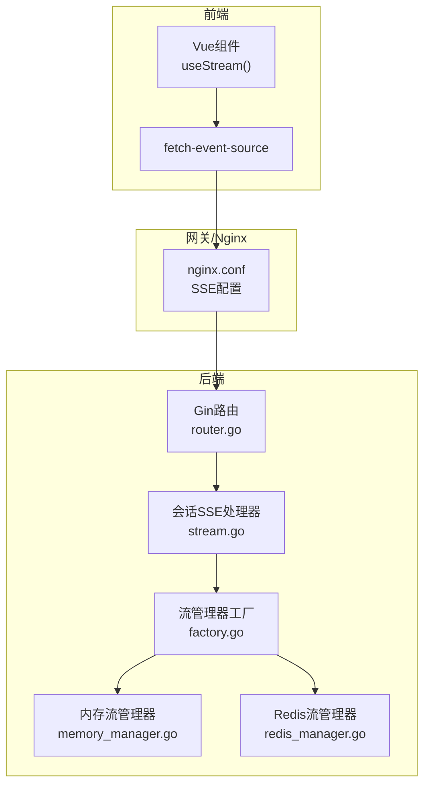
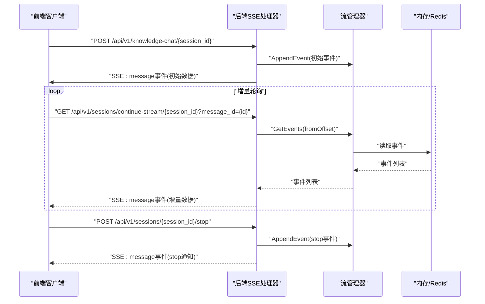
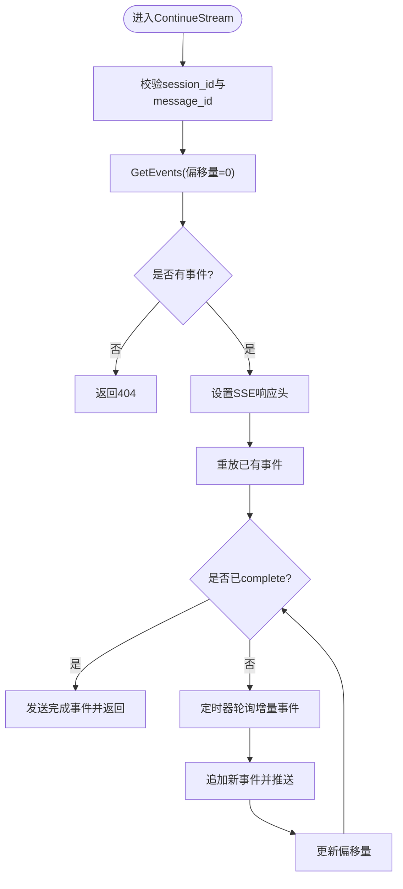
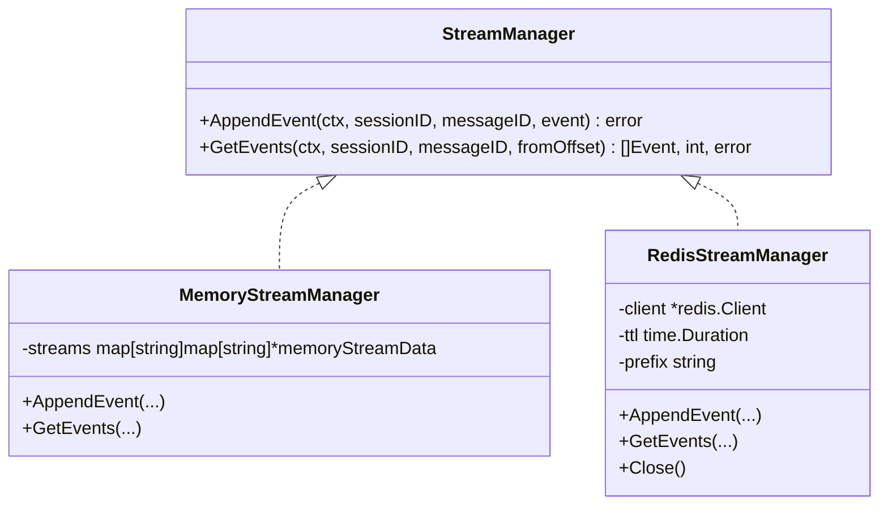
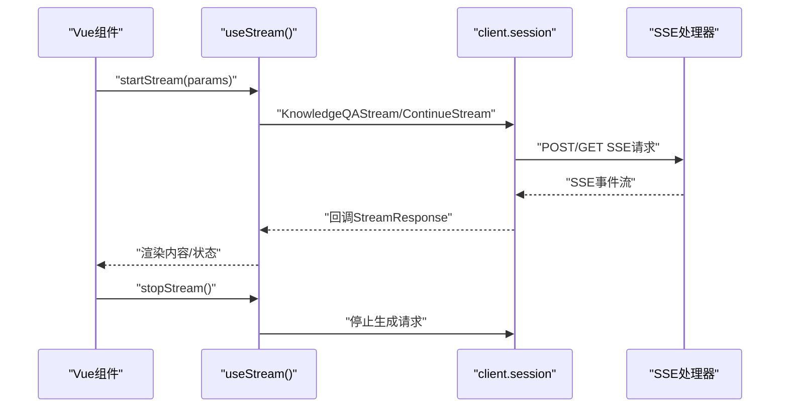
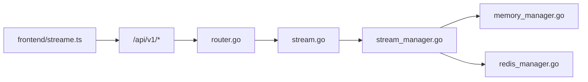

# WebSocket实时通信

<cite>
**本文引用的文件**
- [cmd/server/main.go](file://cmd/server/main.go)
- [internal/router/router.go](file://internal/router/router.go)
- [internal/handler/session/stream.go](file://internal/handler/session/stream.go)
- [internal/types/interfaces/stream_manager.go](file://internal/types/interfaces/stream_manager.go)
- [internal/stream/memory_manager.go](file://internal/stream/memory_manager.go)
- [internal/stream/redis_manager.go](file://internal/stream/redis_manager.go)
- [internal/stream/factory.go](file://internal/stream/factory.go)
- [client/session.go](file://client/session.go)
- [frontend/src/api/chat/streame.ts](file://frontend/src/api/chat/streame.ts)
- [frontend/nginx.conf](file://frontend/nginx.conf)
- [internal/models/chat/sse_reader.go](file://internal/models/chat/sse_reader.go)
</cite>

## 目录
1. [简介](#简介)
2. [项目结构](#项目结构)
3. [核心组件](#核心组件)
4. [架构概览](#架构概览)
5. [详细组件分析](#详细组件分析)
6. [依赖分析](#依赖分析)
7. [性能考量](#性能考量)
8. [故障排除指南](#故障排除指南)
9. [结论](#结论)

## 简介
本文件面向WebSocket实时通信接口的技术文档，聚焦于基于Server-Sent Events（SSE）的流式响应机制，涵盖握手协议、升级机制、消息格式与传输规范、流式响应处理、断线重连与消息确认、会话管理与连接池控制（内存与Redis）、以及客户端集成示例与性能优化建议。尽管代码库中未直接实现WebSocket，但其SSE实现提供了与WebSocket类似的实时推送能力，具备断线重连、事件确认与分布式存储等特性。

## 项目结构
后端采用Gin框架构建REST API，并通过SSE实现流式响应；前端使用fetch-event-source库消费SSE流；Nginx作为反向代理，开启SSE所需的HTTP/1.1与禁用缓冲等配置；流式事件通过内存或Redis两种存储策略实现，满足单机与分布式场景。

**图表来源**
- [frontend/src/api/chat/streame.ts](file://frontend/src/api/chat/streame.ts#L1-L182)
- [frontend/nginx.conf](file://frontend/nginx.conf#L1-L53)
- [internal/router/router.go](file://internal/router/router.go#L258-L292)
- [internal/handler/session/stream.go](file://internal/handler/session/stream.go#L31-L176)
- [internal/stream/factory.go](file://internal/stream/factory.go#L1-L36)
- [internal/stream/memory_manager.go](file://internal/stream/memory_manager.go#L1-L119)
- [internal/stream/redis_manager.go](file://internal/stream/redis_manager.go#L1-L137)

**章节来源**
- [cmd/server/main.go](file://cmd/server/main.go#L124-L192)
- [internal/router/router.go](file://internal/router/router.go#L53-L118)

## 核心组件
- SSE处理器：负责会话流的继续与停止，设置SSE响应头，轮询流事件并推送至客户端。
- 流管理器接口：抽象事件追加与增量读取，支持内存与Redis两种实现。
- 内存流管理器：基于内存映射的事件存储，适合单实例部署。
- Redis流管理器：基于Redis列表的事件存储，支持分布式与持久化TTL。
- 客户端SDK：封装SSE请求与解析，支持回调处理、断线重连与停止生成。
- 前端Hook：基于fetch-event-source的流式消费，支持事件处理与错误处理。

**章节来源**
- [internal/handler/session/stream.go](file://internal/handler/session/stream.go#L31-L176)
- [internal/types/interfaces/stream_manager.go](file://internal/types/interfaces/stream_manager.go#L1-L33)
- [internal/stream/memory_manager.go](file://internal/stream/memory_manager.go#L1-L119)
- [internal/stream/redis_manager.go](file://internal/stream/redis_manager.go#L1-L137)
- [client/session.go](file://client/session.go#L235-L313)
- [frontend/src/api/chat/streame.ts](file://frontend/src/api/chat/streame.ts#L1-L182)

## 架构概览
SSE实时通信采用“后端事件驱动+前端增量拉取”的设计：后端将生成过程拆分为多个事件（如thinking、tool_call、references、complete等），通过流管理器追加到内存或Redis；前端通过SSE持续轮询，基于offset增量读取并渲染。

**图表来源**
- [internal/router/router.go](file://internal/router/router.go#L258-L292)
- [internal/handler/session/stream.go](file://internal/handler/session/stream.go#L31-L176)
- [internal/types/interfaces/stream_manager.go](file://internal/types/interfaces/stream_manager.go#L20-L32)
- [internal/stream/memory_manager.go](file://internal/stream/memory_manager.go#L85-L115)
- [internal/stream/redis_manager.go](file://internal/stream/redis_manager.go#L88-L128)

## 详细组件分析

### SSE处理器与路由
- 路由注册：知识问答与会话继续流的路由均在router.go中注册，使用Gin中间件栈（CORS、鉴权、追踪等）。
- 继续流接口：ContinueStream根据session_id与message_id从流管理器读取事件，设置SSE响应头，周期性轮询并推送事件，遇到complete事件发送完成事件。
- 停止生成：StopSession写入stop事件到流管理器，触发前端停止通知。

**图表来源**
- [internal/router/router.go](file://internal/router/router.go#L258-L292)
- [internal/handler/session/stream.go](file://internal/handler/session/stream.go#L84-L176)

**章节来源**
- [internal/router/router.go](file://internal/router/router.go#L258-L292)
- [internal/handler/session/stream.go](file://internal/handler/session/stream.go#L31-L176)

### 流管理器接口与实现
- 接口定义：StreamManager提供AppendEvent与GetEvents两个核心方法，统一内存与Redis实现。
- 内存实现：基于嵌套map与锁保护，事件存储在内存中，适合单实例部署。
- Redis实现：基于Redis列表RPush追加事件，LRange增量读取，Expire设置TTL，支持分布式共享。

**图表来源**
- [internal/types/interfaces/stream_manager.go](file://internal/types/interfaces/stream_manager.go#L20-L32)
- [internal/stream/memory_manager.go](file://internal/stream/memory_manager.go#L18-L119)
- [internal/stream/redis_manager.go](file://internal/stream/redis_manager.go#L13-L137)

**章节来源**
- [internal/types/interfaces/stream_manager.go](file://internal/types/interfaces/stream_manager.go#L1-L33)
- [internal/stream/memory_manager.go](file://internal/stream/memory_manager.go#L1-L119)
- [internal/stream/redis_manager.go](file://internal/stream/redis_manager.go#L1-L137)
- [internal/stream/factory.go](file://internal/stream/factory.go#L1-L36)

### 客户端SDK与前端Hook
- 客户端SDK：支持知识问答流式请求、继续流、停止生成；内部使用bufio解析SSE事件，逐条推送回调。
- 前端Hook：基于fetch-event-source，自动处理onopen/onmessage/onerror/onclose，支持AbortController中断与错误提示。

**图表来源**
- [client/session.go](file://client/session.go#L235-L313)
- [frontend/src/api/chat/streame.ts](file://frontend/src/api/chat/streame.ts#L31-L182)

**章节来源**
- [client/session.go](file://client/session.go#L235-L313)
- [frontend/src/api/chat/streame.ts](file://frontend/src/api/chat/streame.ts#L1-L182)

### 消息格式与数据传输规范
- 事件类型：响应类型包含answer、references、thinking、tool_call、tool_result、error、reflection、session_title、agent_query、complete等。
- 事件结构：包含唯一ID、响应类型、内容片段、完成标志、时间戳与附加数据。
- 传输协议：SSE，事件以“event:”和“data:”行分隔，空行表示事件结束；后端使用c.SSEvent推送，前端使用SSEReader或SDK解析。

**章节来源**
- [client/session.go](file://client/session.go#L222-L233)
- [internal/models/chat/sse_reader.go](file://internal/models/chat/sse_reader.go#L10-L59)

### 断线重连与消息确认
- 断线重连：前端在onerror中抛出错误并在onclose中停止流；后端ContinueStream通过定时器轮询增量事件，客户端可重新发起继续流请求。
- 消息确认：complete事件作为流结束信号；stop事件用于主动终止生成并通知前端。

**章节来源**
- [frontend/src/api/chat/streame.ts](file://frontend/src/api/chat/streame.ts#L141-L148)
- [internal/handler/session/stream.go](file://internal/handler/session/stream.go#L338-L364)

### 会话管理与连接池控制
- 会话维度：以session_id与message_id为维度管理事件流，确保多会话并发隔离。
- 存储策略：内存实现适合单实例；Redis实现支持多实例共享与TTL控制，适合分布式部署。
- 连接控制：Nginx配置禁用缓冲、保持HTTP/1.1与连接，提升SSE稳定性。

**章节来源**
- [frontend/nginx.conf](file://frontend/nginx.conf#L38-L46)
- [internal/stream/factory.go](file://internal/stream/factory.go#L19-L35)

## 依赖分析
- 路由层依赖Gin与中间件栈，提供认证、CORS与追踪。
- 处理器层依赖流管理器接口，实现与存储解耦。
- 客户端与前端通过HTTP/1.1与SSE交互，Nginx作为反向代理。

**图表来源**
- [internal/router/router.go](file://internal/router/router.go#L53-L118)
- [internal/handler/session/stream.go](file://internal/handler/session/stream.go#L31-L176)
- [internal/types/interfaces/stream_manager.go](file://internal/types/interfaces/stream_manager.go#L20-L32)
- [frontend/src/api/chat/streame.ts](file://frontend/src/api/chat/streame.ts#L1-L182)

**章节来源**
- [internal/router/router.go](file://internal/router/router.go#L53-L118)

## 性能考量
- SSE配置：Nginx禁用缓冲、设置proxy_http_version 1.1、关闭chunked_transfer_encoding，有助于低延迟推送。
- 轮询频率：后端使用100ms定时器轮询增量事件，平衡实时性与CPU占用。
- 存储选择：Redis实现具备TTL与分布式能力，适合高并发场景；内存实现适合轻量部署。
- 前端渲染：前端支持节流渲染与事件缓冲，减少频繁DOM更新。

[本节为通用指导，无需特定文件引用]

## 故障排除指南
- 前端SSE连接失败：检查fetch-event-source的onerror回调与错误信息；确认后端SSE响应头与事件格式。
- Nginx代理问题：确认proxy_http_version、Connection清空、proxy_buffering关闭、超时时间足够。
- 事件丢失或重复：检查流管理器实现与offset更新逻辑；Redis实现需关注TTL与键空间。
- 停止生成无效：确认StopSession写入stop事件成功并触发前端停止通知。

**章节来源**
- [frontend/src/api/chat/streame.ts](file://frontend/src/api/chat/streame.ts#L141-L148)
- [frontend/nginx.conf](file://frontend/nginx.conf#L38-L46)
- [internal/handler/session/stream.go](file://internal/handler/session/stream.go#L266-L287)

## 结论
本项目通过SSE实现了稳定的实时流式通信，具备断线重连、事件确认与分布式存储能力。结合Nginx的SSE优化配置与前后端协同，可在多实例环境中提供一致的实时体验。对于需要WebSocket的场景，可在此基础上扩展，但当前SSE实现已能满足大多数实时数据推送需求。