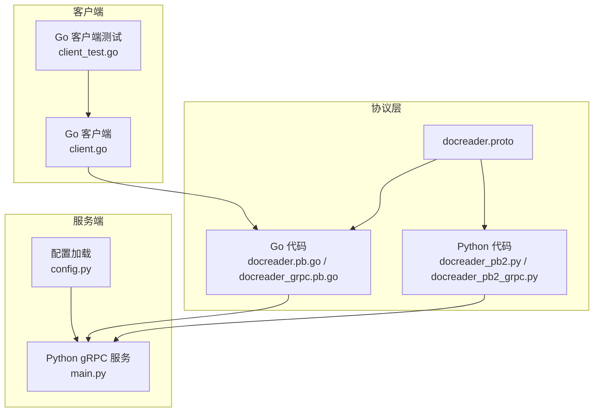
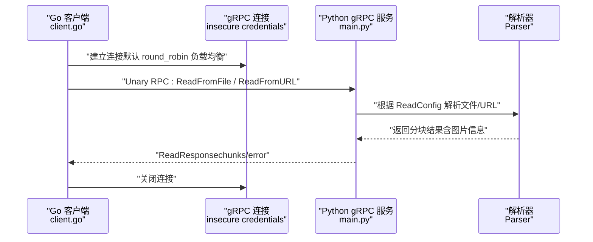
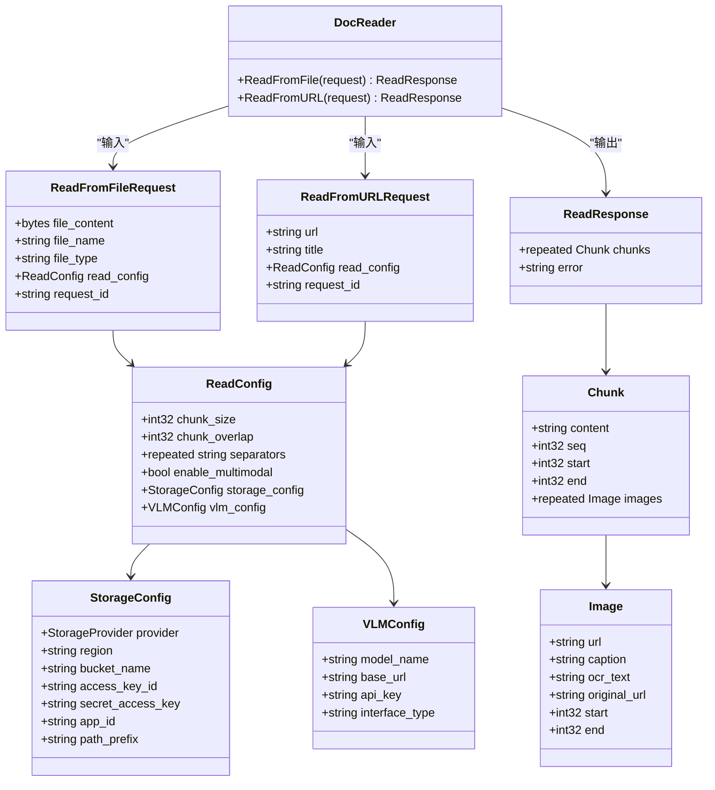
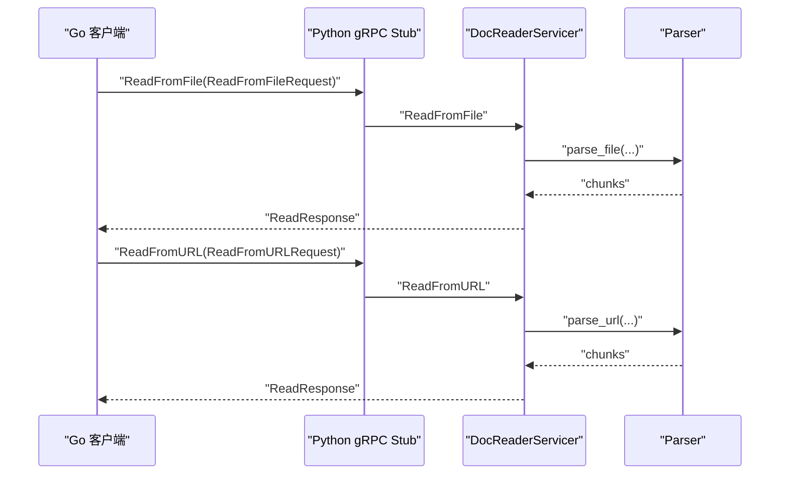
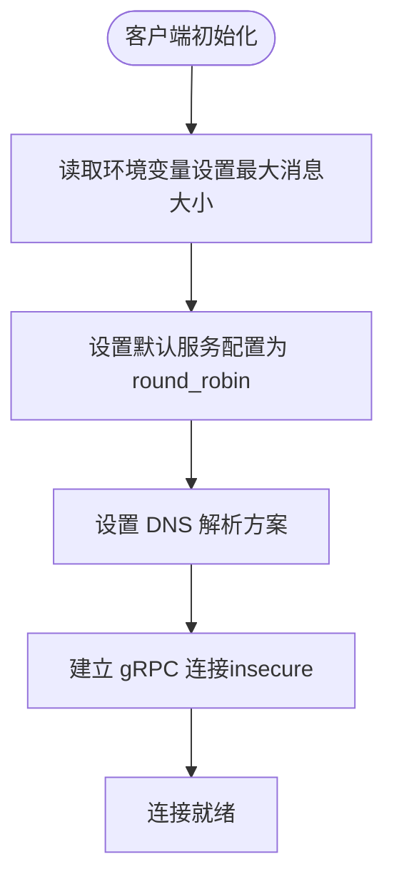
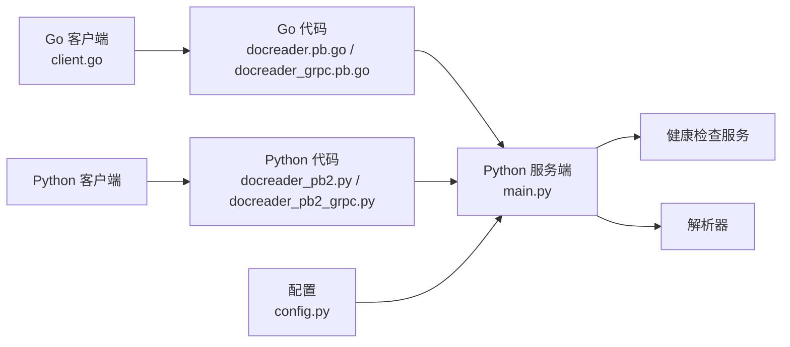

# gRPC远程过程调用

<cite>
**本文引用的文件**
- [docreader.proto](file://docreader/proto/docreader.proto)
- [docreader.pb.go](file://docreader/proto/docreader.pb.go)
- [docreader_grpc.pb.go](file://docreader/proto/docreader_grpc.pb.go)
- [docreader_pb2.py](file://docreader/proto/docreader_pb2.py)
- [docreader_pb2_grpc.py](file://docreader/proto/docreader_pb2_grpc.py)
- [generate_proto.sh](file://docreader/scripts/generate_proto.sh)
- [client.go](file://docreader/client/client.go)
- [main.py](file://docreader/main.py)
- [config.py](file://docreader/config.py)
- [client_test.go](file://docreader/client/client_test.go)
</cite>

## 目录
1. [简介](#简介)
2. [项目结构](#项目结构)
3. [核心组件](#核心组件)
4. [架构总览](#架构总览)
5. [详细组件分析](#详细组件分析)
6. [依赖关系分析](#依赖关系分析)
7. [性能考虑](#性能考虑)
8. [故障排查指南](#故障排查指南)
9. [结论](#结论)
10. [附录](#附录)

## 简介
本文件系统性地梳理了项目中的gRPC远程过程调用实现，覆盖Protocol Buffers消息定义、服务接口类型、连接管理与负载均衡、Python与Go客户端使用、服务部署与测试流程，并给出性能优化与调试建议。目标是帮助开发者快速理解并正确使用DocReader服务。

## 项目结构
- 协议定义位于 docreader/proto 下，包含 .proto 文件及由 protoc 生成的 Go/Python 代码。
- 服务端实现位于 docreader/main.py，基于 Python gRPC 实现 DocReader 服务。
- 客户端封装位于 docreader/client/client.go，提供 Go 客户端连接、调用与资源管理能力。
- 配置通过环境变量加载，集中于 docreader/config.py。
- 生成脚本 docreader/scripts/generate_proto.sh 提供一键生成 Go/Python gRPC 代码的能力。

图表来源
- [docreader.proto](file://docreader/proto/docreader.proto#L1-L89)
- [docreader.pb.go](file://docreader/proto/docreader.pb.go#L1-L120)
- [docreader_grpc.pb.go](file://docreader/proto/docreader_grpc.pb.go#L1-L168)
- [docreader_pb2.py](file://docreader/proto/docreader_pb2.py#L1-L56)
- [docreader_pb2_grpc.py](file://docreader/proto/docreader_pb2_grpc.py#L1-L146)
- [main.py](file://docreader/main.py#L1-L315)
- [config.py](file://docreader/config.py#L1-L285)
- [client.go](file://docreader/client/client.go#L1-L123)
- [client_test.go](file://docreader/client/client_test.go#L1-L155)

章节来源
- [docreader.proto](file://docreader/proto/docreader.proto#L1-L89)
- [docreader/scripts/generate_proto.sh](file://docreader/scripts/generate_proto.sh#L1-L32)

## 核心组件
- Protocol Buffers 消息与服务定义：在 docreader.proto 中定义 DocReader 服务与 ReadFromFile、ReadFromURL 两个方法，以及 ReadConfig、StorageConfig、VLMConfig、Chunk、Image、ReadResponse 等消息类型。
- Go 代码生成：通过 protoc 生成 Go 的消息类型与 gRPC stub，位于 docreader.pb.go 与 docreader_grpc.pb.go。
- Python 代码生成：通过 grpc_tools.protoc 生成 Python 的消息与 gRPC stub，位于 docreader_pb2.py 与 docreader_pb2_grpc.py。
- 服务端实现：在 main.py 中注册 DocReaderServicer，实现 ReadFromFile 与 ReadFromURL，并通过健康检查服务提供健康状态。
- 客户端封装：在 client.go 中提供连接建立、调用、关闭与调试日志等能力。
- 配置管理：config.py 从环境变量加载 gRPC 最大并发、最大消息大小、端口等配置。

章节来源
- [docreader.proto](file://docreader/proto/docreader.proto#L1-L89)
- [docreader.pb.go](file://docreader/proto/docreader.pb.go#L1-L120)
- [docreader_grpc.pb.go](file://docreader/proto/docreader_grpc.pb.go#L1-L168)
- [docreader_pb2.py](file://docreader/proto/docreader_pb2.py#L1-L56)
- [docreader_pb2_grpc.py](file://docreader/proto/docreader_pb2_grpc.py#L1-L146)
- [main.py](file://docreader/main.py#L130-L274)
- [client.go](file://docreader/client/client.go#L1-L123)
- [config.py](file://docreader/config.py#L99-L217)

## 架构总览
DocReader 采用经典的客户端-服务端模型，客户端通过 gRPC Unary RPC 调用服务端的解析逻辑，服务端返回分块后的文档内容与可选图片信息。

图表来源
- [client.go](file://docreader/client/client.go#L48-L76)
- [main.py](file://docreader/main.py#L130-L274)
- [docreader_grpc.pb.go](file://docreader/proto/docreader_grpc.pb.go#L113-L147)

## 详细组件分析

### Protocol Buffers 消息与序列化
- 服务定义：DocReader 服务包含 ReadFromFile 与 ReadFromURL 两个方法，均为 Unary RPC。
- 请求消息：
  - ReadFromFileRequest：包含文件内容、文件名、文件类型、ReadConfig、请求ID。
  - ReadFromURLRequest：包含 URL、标题、ReadConfig、请求ID。
- 配置消息：
  - ReadConfig：包含分块大小、重叠、分隔符、多模态开关、通用存储配置、VLM 配置。
  - StorageConfig：兼容腾讯云 COS 与 MinIO/S3，包含 provider、region、bucket_name、access_key_id、secret_access_key、app_id、path_prefix。
  - VLMConfig：包含模型名、基础URL、API Key、接口类型（如 openai/ollama）。
- 响应消息：
  - ReadResponse：包含分块列表与错误信息；Chunk 包含内容、顺序、起止位置与图片列表；Image 包含 URL、描述、OCR 文本、原始URL、起止位置。
- 序列化机制：Go/Python 代码由 protoc 生成，遵循 proto3 语义，字段按编号编码，支持二进制高效传输。

图表来源
- [docreader.proto](file://docreader/proto/docreader.proto#L8-L89)
- [docreader.pb.go](file://docreader/proto/docreader.pb.go#L75-L86)
- [docreader.pb.go](file://docreader/proto/docreader.pb.go#L168-L176)
- [docreader.pb.go](file://docreader/proto/docreader.pb.go#L236-L246)
- [docreader.pb.go](file://docreader/proto/docreader.pb.go#L321-L330)
- [docreader.pb.go](file://docreader/proto/docreader.pb.go#L398-L406)
- [docreader.pb.go](file://docreader/proto/docreader.pb.go#L467-L477)
- [docreader.pb.go](file://docreader/proto/docreader.pb.go#L551-L560)
- [docreader.pb.go](file://docreader/proto/docreader.pb.go#L628-L634)

章节来源
- [docreader.proto](file://docreader/proto/docreader.proto#L1-L89)
- [docreader.pb.go](file://docreader/proto/docreader.pb.go#L75-L86)
- [docreader.pb.go](file://docreader/proto/docreader.pb.go#L168-L176)
- [docreader.pb.go](file://docreader/proto/docreader.pb.go#L236-L246)
- [docreader.pb.go](file://docreader/proto/docreader.pb.go#L321-L330)
- [docreader.pb.go](file://docreader/proto/docreader.pb.go#L398-L406)
- [docreader.pb.go](file://docreader/proto/docreader.pb.go#L467-L477)
- [docreader.pb.go](file://docreader/proto/docreader.pb.go#L551-L560)
- [docreader.pb.go](file://docreader/proto/docreader.pb.go#L628-L634)

### 服务接口定义与调用流程
- Unary RPC：ReadFromFile 与 ReadFromURL 均为 Unary RPC，请求与响应均在单次往返内完成。
- 服务端处理：main.py 中的 DocReaderServicer 实现两个方法，内部将 ReadConfig 转换为 ChunkingConfig 并调用 Parser 进行解析，最终将结果转换为 protobuf 消息返回。
- 客户端调用：Go 客户端通过 NewDocReaderClient 创建，使用 insecure credentials 建立连接，默认启用 round_robin 负载均衡策略。

图表来源
- [docreader_grpc.pb.go](file://docreader/proto/docreader_grpc.pb.go#L30-L64)
- [main.py](file://docreader/main.py#L130-L274)

章节来源
- [docreader_grpc.pb.go](file://docreader/proto/docreader_grpc.pb.go#L113-L147)
- [main.py](file://docreader/main.py#L130-L274)

### 连接管理、负载均衡与安全
- 连接建立：Go 客户端使用 insecure credentials，设置默认服务配置为 round_robin 负载均衡策略，并通过 dns 方案解析地址。
- 超时与消息大小：Go 客户端支持通过环境变量配置最大消息大小；服务端通过 ThreadPoolExecutor 与最大消息大小选项进行限制。
- TLS 与认证：当前实现使用不安全凭证；如需 TLS 与认证，可在 DialOption 中替换为相应凭据与拦截器，并在服务端启用 TLS 与鉴权中间件。

图表来源
- [client.go](file://docreader/client/client.go#L18-L76)

章节来源
- [client.go](file://docreader/client/client.go#L18-L76)
- [config.py](file://docreader/config.py#L107-L113)
- [main.py](file://docreader/main.py#L281-L287)

### Python 客户端使用
- 生成与导入：通过 generate_proto.sh 生成 Python 代码，修复导入路径以适配不同平台。
- 通道与存根：使用 grpc.insecure_channel 创建通道，通过 DocReaderStub 发起 unary_unary 调用。
- 超时与元数据：可通过 options 传入超时、压缩、等待就绪等参数，metadata 支持自定义头部。
- 版本兼容：生成代码对 grpcio 版本有要求，若版本不匹配会抛出异常提示。

章节来源
- [generate_proto.sh](file://docreader/scripts/generate_proto.sh#L9-L32)
- [docreader_pb2_grpc.py](file://docreader/proto/docreader_pb2_grpc.py#L28-L48)
- [docreader_pb2_grpc.py](file://docreader/proto/docreader_pb2_grpc.py#L88-L146)

### Go 客户端使用
- 连接建立：NewClient 接收地址，设置 insecure credentials、默认服务配置与调用选项，返回封装的 Client。
- 方法调用：支持 ReadFromFile 与 ReadFromURL，内部通过 grpc.ClientConn.Invoke 发起调用。
- 资源管理：Close 关闭底层连接；SetDebug 控制调试日志；GetImagesFromChunk/HasImagesInChunk 辅助处理响应中的图片信息。

章节来源
- [client.go](file://docreader/client/client.go#L41-L123)

### 服务端实现与健康检查
- 服务注册：在 main.py 中创建 grpc.server，设置最大发送/接收消息大小，注册 DocReaderServicer 与 Health 服务。
- 端口监听：通过 add_insecure_port 监听 IPv6 地址与配置端口。
- 请求上下文：使用 request_id 上下文记录请求 ID，便于追踪。

章节来源
- [main.py](file://docreader/main.py#L276-L315)
- [main.py](file://docreader/main.py#L130-L274)

## 依赖关系分析
- Go 客户端依赖 Go 生成的 protobuf 与 gRPC 代码，通过 insecure credentials 与 round_robin 负载均衡访问服务端。
- Python 客户端依赖 Python 生成的 protobuf 与 gRPC 代码，通过 insecure_channel 与 unary_unary 方法调用。
- 服务端依赖解析器模块与健康检查服务，配置来源于环境变量。

图表来源
- [client.go](file://docreader/client/client.go#L1-L123)
- [docreader.pb.go](file://docreader/proto/docreader.pb.go#L1-L120)
- [docreader_grpc.pb.go](file://docreader/proto/docreader_grpc.pb.go#L1-L168)
- [docreader_pb2.py](file://docreader/proto/docreader_pb2.py#L1-L56)
- [docreader_pb2_grpc.py](file://docreader/proto/docreader_pb2_grpc.py#L1-L146)
- [main.py](file://docreader/main.py#L1-L315)
- [config.py](file://docreader/config.py#L1-L285)

章节来源
- [client.go](file://docreader/client/client.go#L1-L123)
- [docreader.pb.go](file://docreader/proto/docreader.pb.go#L1-L120)
- [docreader_grpc.pb.go](file://docreader/proto/docreader_grpc.pb.go#L1-L168)
- [docreader_pb2.py](file://docreader/proto/docreader_pb2.py#L1-L56)
- [docreader_pb2_grpc.py](file://docreader/proto/docreader_pb2_grpc.py#L1-L146)
- [main.py](file://docreader/main.py#L1-L315)
- [config.py](file://docreader/config.py#L1-L285)

## 性能考虑
- 最大消息大小：通过环境变量控制，Go 客户端与 Python 服务端均支持设置最大发送/接收消息大小，避免内存压力。
- 并发与线程池：服务端使用 ThreadPoolExecutor 控制并发处理能力，合理设置最大工作线程数。
- 负载均衡：Go 客户端默认 round_robin，适合多实例部署场景。
- 超时与压缩：客户端可配置超时与压缩选项，减少网络开销。
- 日志与追踪：服务端使用 request_id 上下文，便于定位问题与性能分析。

章节来源
- [config.py](file://docreader/config.py#L107-L113)
- [client.go](file://docreader/client/client.go#L18-L25)
- [main.py](file://docreader/main.py#L281-L287)

## 故障排查指南
- 生成代码版本不匹配：Python 生成代码对 grpcio 版本有严格要求，若版本过低或过高会触发异常，需按提示升级或降级。
- 连接失败：确认服务端已启动并监听对应端口，客户端地址与 DNS 解析正常。
- 超时与消息过大：适当增大最大消息大小与超时时间，或优化请求体大小。
- 健康检查：通过 Health 服务确认服务可用性。
- 日志与调试：Go 客户端支持调试日志开关；服务端记录请求 ID 与处理耗时，便于定位问题。

章节来源
- [docreader_pb2_grpc.py](file://docreader/proto/docreader_pb2_grpc.py#L18-L25)
- [client.go](file://docreader/client/client.go#L85-L96)
- [main.py](file://docreader/main.py#L292-L294)

## 结论
本项目基于 Protocol Buffers 与 gRPC 提供了清晰的文档解析服务接口，Go 与 Python 双端均有完善的代码生成与客户端封装。通过合理的配置与负载均衡策略，可满足多实例部署与高并发场景的需求。建议在生产环境中启用 TLS 与鉴权，并结合健康检查与日志体系完善监控与排障能力。

## 附录

### 部署与测试指南
- 生成代码
  - 使用 generate_proto.sh 一键生成 Go 与 Python 代码，并自动修复 Python 导入路径。
- 启动服务端
  - 通过 Python 运行 main.py 启动 gRPC 服务，注册 DocReader 与 Health 服务，监听配置端口。
- 客户端集成
  - Go 客户端：NewClient 建立连接，调用 ReadFromFile/ReadFromURL，处理 ReadResponse。
  - Python 客户端：使用 DocReaderStub 发起 unary_unary 调用，设置超时与元数据。
- 测试验证
  - Go 客户端测试用例包含 ReadFromURL 与 ReadFromFile 的基本用法与断言，可作为集成测试参考。

章节来源
- [generate_proto.sh](file://docreader/scripts/generate_proto.sh#L1-L32)
- [main.py](file://docreader/main.py#L276-L315)
- [client.go](file://docreader/client/client.go#L41-L123)
- [docreader_pb2_grpc.py](file://docreader/proto/docreader_pb2_grpc.py#L28-L48)
- [client_test.go](file://docreader/client/client_test.go#L20-L146)