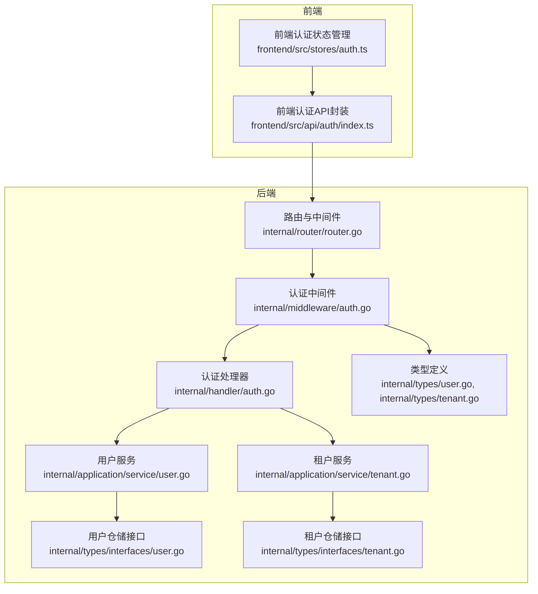
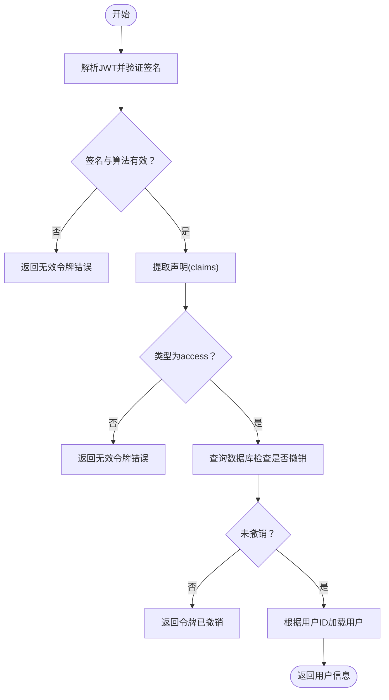
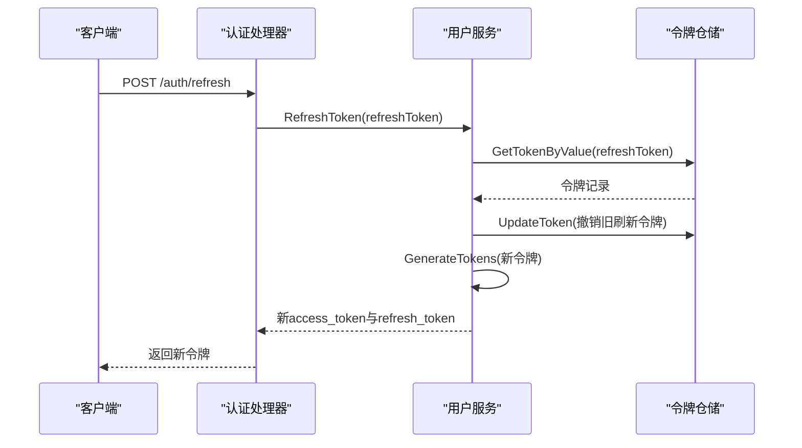
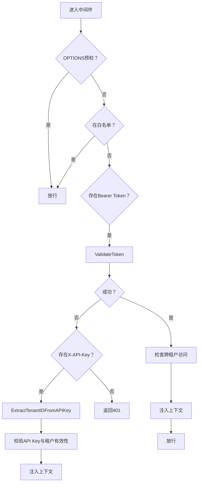
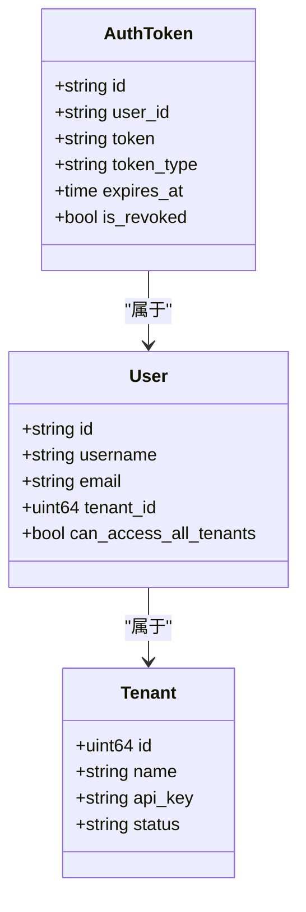
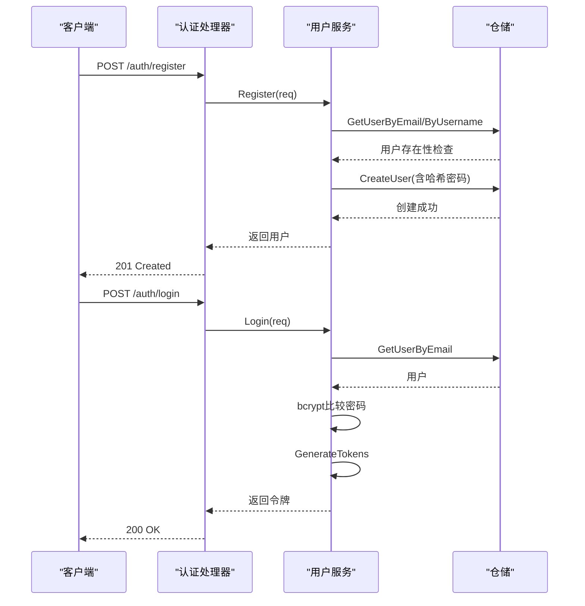
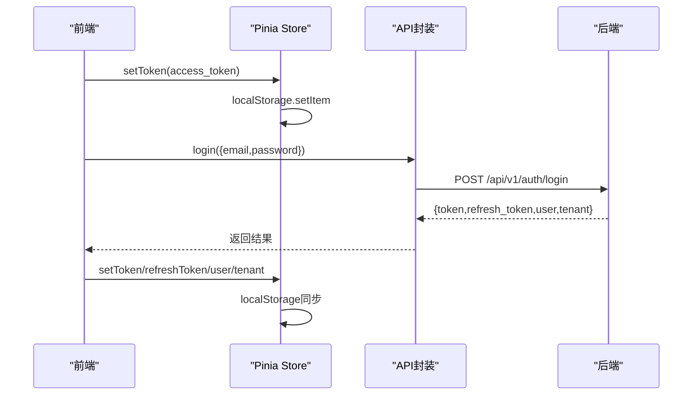
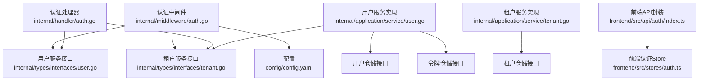

# 认证与授权机制

<cite>
**本文档引用的文件**
- [internal/middleware/auth.go](file://internal/middleware/auth.go)
- [internal/handler/auth.go](file://internal/handler/auth.go)
- [internal/application/service/user.go](file://internal/application/service/user.go)
- [internal/types/interfaces/user.go](file://internal/types/interfaces/user.go)
- [internal/types/user.go](file://internal/types/user.go)
- [internal/types/interfaces/tenant.go](file://internal/types/interfaces/tenant.go)
- [internal/types/tenant.go](file://internal/types/tenant.go)
- [internal/application/service/tenant.go](file://internal/application/service/tenant.go)
- [frontend/src/stores/auth.ts](file://frontend/src/stores/auth.ts)
- [frontend/src/api/auth/index.ts](file://frontend/src/api/auth/index.ts)
- [internal/router/router.go](file://internal/router/router.go)
- [cmd/server/main.go](file://cmd/server/main.go)
- [config/config.yaml](file://config/config.yaml)
</cite>

## 目录
1. [简介](#简介)
2. [项目结构](#项目结构)
3. [核心组件](#核心组件)
4. [架构概览](#架构概览)
5. [详细组件分析](#详细组件分析)
6. [依赖关系分析](#依赖关系分析)
7. [性能考量](#性能考量)
8. [故障排除指南](#故障排除指南)
9. [结论](#结论)
10. [附录](#附录)

## 简介
本文件全面阐述系统的认证与授权机制，涵盖JWT令牌的生成与验证流程、签名算法、过期时间与刷新机制；多租户架构设计、角色权限分配与资源访问控制；中间件认证流程（请求拦截、令牌解析与用户身份验证）；用户管理与会话管理（注册登录、密码加密与会话持久化）；以及完整的前后端集成示例与安全最佳实践。

## 项目结构
系统采用分层架构，认证相关代码分布在中间件、处理器、服务层与类型定义中，并通过依赖注入容器构建路由与中间件链路。



**图表来源**
- [internal/router/router.go](file://internal/router/router.go#L54-L118)
- [internal/middleware/auth.go](file://internal/middleware/auth.go#L59-L197)
- [internal/handler/auth.go](file://internal/handler/auth.go#L21-L401)
- [internal/application/service/user.go](file://internal/application/service/user.go#L47-L65)
- [internal/application/service/tenant.go](file://internal/application/service/tenant.go#L33-L41)
- [internal/types/interfaces/user.go](file://internal/types/interfaces/user.go#L9-L76)
- [internal/types/interfaces/tenant.go](file://internal/types/interfaces/tenant.go#L9-L31)
- [internal/types/user.go](file://internal/types/user.go#L9-L119)
- [internal/types/tenant.go](file://internal/types/tenant.go#L58-L94)

**章节来源**
- [internal/router/router.go](file://internal/router/router.go#L54-L118)
- [cmd/server/main.go](file://cmd/server/main.go#L124-L188)

## 核心组件
- 认证中间件：统一拦截请求，执行JWT与API Key认证，处理跨租户访问控制，并将用户与租户信息注入请求上下文。
- 认证处理器：提供注册、登录、登出、令牌刷新、当前用户查询、密码修改与令牌验证等HTTP接口。
- 用户服务：实现JWT签发与验证、密码哈希、令牌撤销与刷新、当前用户获取等功能。
- 租户服务：实现租户创建、API Key生成与解析、跨租户访问控制等。
- 类型定义：User、AuthToken、Tenant等核心数据模型与接口定义。
- 前端认证状态管理：Pinia Store负责令牌与用户信息的本地持久化与状态同步。

**章节来源**
- [internal/middleware/auth.go](file://internal/middleware/auth.go#L59-L197)
- [internal/handler/auth.go](file://internal/handler/auth.go#L21-L401)
- [internal/application/service/user.go](file://internal/application/service/user.go#L262-L428)
- [internal/application/service/tenant.go](file://internal/application/service/tenant.go#L210-L282)
- [internal/types/user.go](file://internal/types/user.go#L9-L119)
- [internal/types/tenant.go](file://internal/types/tenant.go#L58-L94)
- [frontend/src/stores/auth.ts](file://frontend/src/stores/auth.ts#L7-L233)

## 架构概览
认证与授权的整体流程如下：

```mermaid
sequenceDiagram
participant Client as "客户端"
participant Router as "路由/中间件"
participant AuthMW as "认证中间件"
participant AuthH as "认证处理器"
participant UserSvc as "用户服务"
participant TenantSvc as "租户服务"
Client->>Router : 发起HTTP请求
Router->>AuthMW : 应用认证中间件
AuthMW->>AuthMW : 检查白名单/预检请求
alt Bearer Token
AuthMW->>UserSvc : ValidateToken(token)
UserSvc-->>AuthMW : 用户信息或错误
else X-API-Key
AuthMW->>TenantSvc : ExtractTenantIDFromAPIKey(key)
TenantSvc-->>AuthMW : 租户ID或错误
AuthMW->>TenantSvc : GetTenantByID(tenantID)
TenantSvc-->>AuthMW : 租户信息
else 无认证
AuthMW-->>Client : 401 未授权
exit
end
AuthMW->>AuthMW : 跨租户访问校验
AuthMW->>AuthMW : 注入上下文(用户/租户)
AuthMW-->>Router : 放行
Router->>AuthH : 调用业务处理器
AuthH-->>Client : 返回响应
```

**图表来源**
- [internal/middleware/auth.go](file://internal/middleware/auth.go#L59-L197)
- [internal/handler/auth.go](file://internal/handler/auth.go#L116-L158)
- [internal/application/service/user.go](file://internal/application/service/user.go#L324-L354)
- [internal/application/service/tenant.go](file://internal/application/service/tenant.go#L242-L282)

## 详细组件分析

### JWT令牌生成与验证
- 令牌类型与有效期
  - 访问令牌：24小时有效，包含用户ID、邮箱、租户ID与签发/过期时间戳。
  - 刷新令牌：7天有效，仅用于换取新的访问令牌。
- 签名算法：HS256（HMAC-SHA256），密钥来自环境变量JWT_SECRET，若未配置则自动生成随机密钥。
- 令牌存储：生成后持久化至数据库，记录类型、过期时间与撤销状态。
- 验证流程：解析JWT，校验签名与算法，检查过期时间，查询数据库确认未被撤销，最后根据用户ID加载用户信息。



**图表来源**
- [internal/application/service/user.go](file://internal/application/service/user.go#L262-L354)

**章节来源**
- [internal/application/service/user.go](file://internal/application/service/user.go#L262-L322)
- [internal/application/service/user.go](file://internal/application/service/user.go#L324-L405)
- [internal/types/user.go](file://internal/types/user.go#L38-L59)

### 令牌刷新机制
- 输入：有效的刷新令牌。
- 流程：验证刷新令牌签名与类型，检查数据库未撤销，撤销旧刷新令牌，重新签发新的访问令牌与刷新令牌。
- 安全性：刷新令牌撤销后不可再次使用，防止重放攻击。



**图表来源**
- [internal/handler/auth.go](file://internal/handler/auth.go#L221-L253)
- [internal/application/service/user.go](file://internal/application/service/user.go#L356-L405)

**章节来源**
- [internal/handler/auth.go](file://internal/handler/auth.go#L221-L253)
- [internal/application/service/user.go](file://internal/application/service/user.go#L356-L405)

### 中间件认证流程
- 白名单：健康检查、注册、登录、刷新等无需认证。
- Bearer Token：从Authorization头解析，调用用户服务验证。
- X-API-Key：从X-API-Key头解析，提取租户ID并校验API Key有效性。
- 跨租户访问：当请求携带目标租户ID时，校验用户是否具备跨租户访问权限与配置开关。
- 上下文注入：将用户与租户信息存入Gin上下文，供后续处理器使用。



**图表来源**
- [internal/middleware/auth.go](file://internal/middleware/auth.go#L59-L197)

**章节来源**
- [internal/middleware/auth.go](file://internal/middleware/auth.go#L18-L197)

### 租户隔离与权限控制
- 多租户架构：每个用户属于一个默认租户，系统支持租户API Key用于后端服务间鉴权。
- 跨租户访问：需满足配置开关与用户具备跨租户访问权限位。
- API Key生成与解析：使用AES-GCM加密租户ID，前缀为sk-，便于后端快速解析租户ID。
- 资源访问控制：中间件根据上下文中的租户ID隔离资源，处理器在业务层面结合权限位进行细粒度控制。



**图表来源**
- [internal/types/user.go](file://internal/types/user.go#L9-L36)
- [internal/types/tenant.go](file://internal/types/tenant.go#L58-L94)
- [internal/types/user.go](file://internal/types/user.go#L38-L59)

**章节来源**
- [internal/types/user.go](file://internal/types/user.go#L9-L36)
- [internal/types/tenant.go](file://internal/types/tenant.go#L58-L94)
- [internal/application/service/tenant.go](file://internal/application/service/tenant.go#L210-L282)
- [config/config.yaml](file://config/config.yaml#L581-L585)

### 用户管理与会话管理
- 注册：校验必填字段，检查邮箱/用户名唯一性，bcrypt哈希密码，创建默认租户并生成用户。
- 登录：根据邮箱查找用户，校验账户状态与密码，生成访问与刷新令牌。
- 密码修改：验证旧密码，bcrypt哈希新密码并更新。
- 登出：撤销当前访问令牌。
- 会话持久化：令牌信息持久化至数据库，支持按用户撤销与清理过期令牌。



**图表来源**
- [internal/handler/auth.go](file://internal/handler/auth.go#L53-L104)
- [internal/handler/auth.go](file://internal/handler/auth.go#L116-L158)
- [internal/application/service/user.go](file://internal/application/service/user.go#L67-L128)
- [internal/application/service/user.go](file://internal/application/service/user.go#L130-L199)

**章节来源**
- [internal/handler/auth.go](file://internal/handler/auth.go#L53-L158)
- [internal/application/service/user.go](file://internal/application/service/user.go#L67-L199)

### 前后端集成示例
- 前端状态管理：使用Pinia Store保存用户、租户、令牌与当前知识库等信息，并持久化到localStorage。
- 前端API封装：提供登录、注册、获取当前用户、刷新令牌、登出、验证令牌等接口封装。
- 路由守卫：在路由层面检查认证状态，必要时调用令牌验证接口。
- 后端路由：统一挂载认证中间件，除白名单外所有/v1接口均需认证。



**图表来源**
- [frontend/src/stores/auth.ts](file://frontend/src/stores/auth.ts#L58-L128)
- [frontend/src/api/auth/index.ts](file://frontend/src/api/auth/index.ts#L118-L143)
- [internal/router/router.go](file://internal/router/router.go#L89-L118)

**章节来源**
- [frontend/src/stores/auth.ts](file://frontend/src/stores/auth.ts#L7-L233)
- [frontend/src/api/auth/index.ts](file://frontend/src/api/auth/index.ts#L1-L242)
- [internal/router/router.go](file://internal/router/router.go#L89-L118)

## 依赖关系分析
认证与授权模块的依赖关系如下：



**图表来源**
- [internal/middleware/auth.go](file://internal/middleware/auth.go#L60-L64)
- [internal/handler/auth.go](file://internal/handler/auth.go#L21-L40)
- [internal/application/service/user.go](file://internal/application/service/user.go#L47-L65)
- [internal/application/service/tenant.go](file://internal/application/service/tenant.go#L33-L41)
- [frontend/src/api/auth/index.ts](file://frontend/src/api/auth/index.ts#L1-L242)
- [frontend/src/stores/auth.ts](file://frontend/src/stores/auth.ts#L7-L233)

**章节来源**
- [internal/middleware/auth.go](file://internal/middleware/auth.go#L59-L197)
- [internal/handler/auth.go](file://internal/handler/auth.go#L21-L401)
- [internal/application/service/user.go](file://internal/application/service/user.go#L47-L65)
- [internal/application/service/tenant.go](file://internal/application/service/tenant.go#L33-L41)

## 性能考量
- JWT解析与数据库查询：令牌验证包含JWT解析与数据库查询，建议在高并发场景下：
  - 缓存活跃令牌状态（短期缓存）以减少数据库压力。
  - 使用连接池与索引优化令牌查询性能。
- 密码哈希成本：bcrypt默认成本已平衡安全性与性能，可根据硬件能力调整。
- 跨租户访问校验：仅在请求携带目标租户ID时触发，避免对常规请求产生额外开销。
- 前端本地存储：使用localStorage减少重复登录与令牌刷新次数，提升用户体验。

## 故障排除指南
- 401 未授权
  - 检查Authorization头格式是否为Bearer Token。
  - 确认令牌未过期且未被撤销。
  - 核对X-API-Key格式与租户有效性。
- 令牌无效
  - 确认JWT_SECRET配置正确且前后端一致。
  - 检查令牌类型是否为access或refresh。
- 跨租户访问被拒
  - 确认用户具备跨租户访问权限位与配置开关开启。
  - 检查目标租户ID是否有效。
- 登录失败
  - 核对邮箱与密码是否正确。
  - 检查账户是否激活。
- 登出后仍可访问
  - 确认令牌已被撤销。
  - 检查前端是否正确清除本地存储。

**章节来源**
- [internal/middleware/auth.go](file://internal/middleware/auth.go#L193-L196)
- [internal/application/service/user.go](file://internal/application/service/user.go#L324-L354)
- [internal/application/service/user.go](file://internal/application/service/user.go#L356-L405)
- [internal/handler/auth.go](file://internal/handler/auth.go#L116-L158)

## 结论
本系统通过JWT令牌与API Key双通道认证、严格的令牌撤销与过期控制、以及多租户隔离与跨租户访问控制，构建了安全可靠的认证与授权体系。配合前端状态管理与路由守卫，实现了完整的用户生命周期管理与会话控制。建议在生产环境中强化密钥管理、引入速率限制与审计日志，并持续监控令牌与会话状态以保障系统安全。

## 附录
- 安全最佳实践
  - 强制HTTPS传输，避免令牌在传输过程中泄露。
  - 定期轮换JWT_SECRET与租户API Key。
  - 限制令牌刷新频率，启用IP白名单与设备绑定。
  - 对敏感操作增加二次验证与操作审计。
- 常见攻击防护
  - 防重放：使用一次性令牌与时间戳。
  - 防暴力破解：登录失败计数与临时封禁。
  - 防XSS/CSRF：同源策略、CORS配置与CSRF令牌。
  - 防令牌泄露：短有效期与自动刷新、撤销机制。