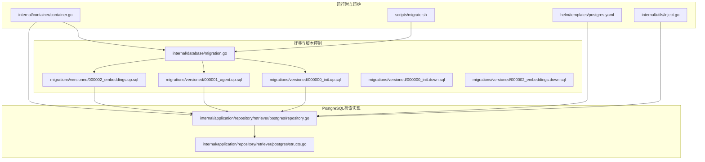
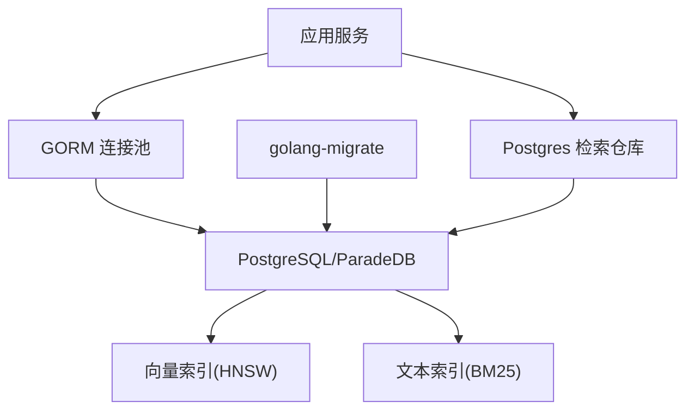
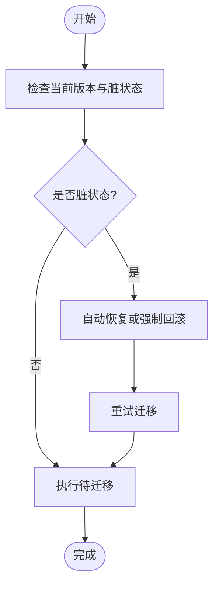
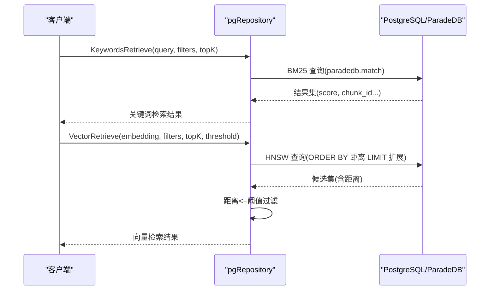
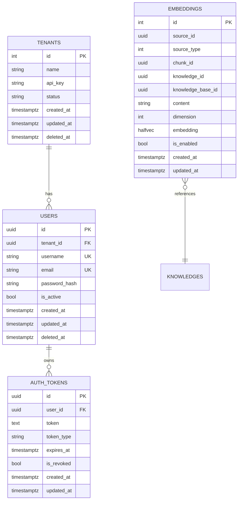
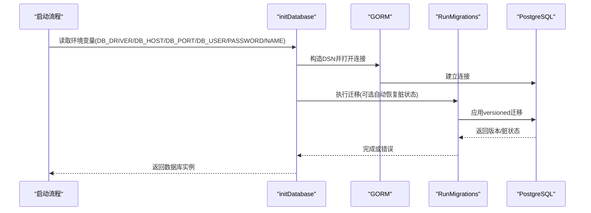
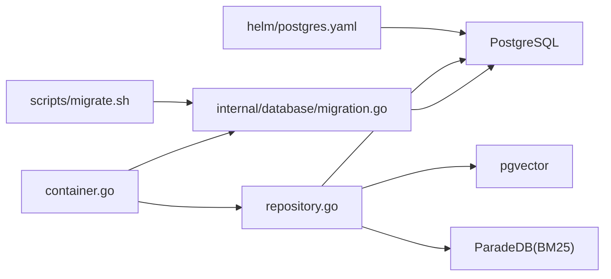

# 数据库架构设计

<cite>
**本文引用的文件**
- [internal/database/migration.go](file://internal/database/migration.go)
- [migrations/versioned/000000_init.up.sql](file://migrations/versioned/000000_init.up.sql)
- [migrations/versioned/000001_agent.up.sql](file://migrations/versioned/000001_agent.up.sql)
- [migrations/versioned/000002_embeddings.up.sql](file://migrations/versioned/000002_embeddings.up.sql)
- [migrations/versioned/000000_init.down.sql](file://migrations/versioned/000000_init.down.sql)
- [migrations/versioned/000002_embeddings.down.sql](file://migrations/versioned/000002_embeddings.down.sql)
- [internal/application/repository/retriever/postgres/repository.go](file://internal/application/repository/retriever/postgres/repository.go)
- [internal/application/repository/retriever/postgres/structs.go](file://internal/application/repository/retriever/postgres/structs.go)
- [internal/container/container.go](file://internal/container/container.go)
- [scripts/migrate.sh](file://scripts/migrate.sh)
- [helm/templates/postgres.yaml](file://helm/templates/postgres.yaml)
- [internal/utils/inject.go](file://internal/utils/inject.go)
</cite>

## 目录
1. [简介](#简介)
2. [项目结构](#项目结构)
3. [核心组件](#核心组件)
4. [架构总览](#架构总览)
5. [详细组件分析](#详细组件分析)
6. [依赖分析](#依赖分析)
7. [性能考量](#性能考量)
8. [故障排查指南](#故障排查指南)
9. [结论](#结论)
10. [附录](#附录)

## 简介
本文件面向数据库架构设计，结合代码库中的迁移脚本、PostgreSQL检索实现与容器化部署，系统阐述数据库整体架构、表空间与分区策略、核心表结构与约束、索引策略、查询优化、连接池与连接管理、备份恢复与高可用设计，并提供SQL示例路径与性能基准思路。

## 项目结构
数据库相关代码主要分布在以下模块：
- 迁移与版本控制：internal/database/migration.go 与 migrations/versioned 下的 up/down 脚本
- PostgreSQL检索实现：internal/application/repository/retriever/postgres 下的 repository 与 structs
- 连接与初始化：internal/container/container.go 中的 initDatabase
- 迁移脚本：scripts/migrate.sh
- 部署与高可用：helm/templates/postgres.yaml
- 安全校验：internal/utils/inject.go（SQL注入防护）

**图表来源**
- [internal/database/migration.go](file://internal/database/migration.go#L1-L221)
- [migrations/versioned/000000_init.up.sql](file://migrations/versioned/000000_init.up.sql#L1-L204)
- [migrations/versioned/000001_agent.up.sql](file://migrations/versioned/000001_agent.up.sql#L1-L409)
- [migrations/versioned/000002_embeddings.up.sql](file://migrations/versioned/000002_embeddings.up.sql#L1-L95)
- [internal/application/repository/retriever/postgres/repository.go](file://internal/application/repository/retriever/postgres/repository.go#L1-L620)
- [internal/application/repository/retriever/postgres/structs.go](file://internal/application/repository/retriever/postgres/structs.go#L1-L104)
- [internal/container/container.go](file://internal/container/container.go#L262-L335)
- [scripts/migrate.sh](file://scripts/migrate.sh#L1-L122)
- [helm/templates/postgres.yaml](file://helm/templates/postgres.yaml#L1-L128)
- [internal/utils/inject.go](file://internal/utils/inject.go#L519-L1670)

**章节来源**
- [internal/database/migration.go](file://internal/database/migration.go#L1-L221)
- [migrations/versioned/000000_init.up.sql](file://migrations/versioned/000000_init.up.sql#L1-L204)
- [migrations/versioned/000001_agent.up.sql](file://migrations/versioned/000001_agent.up.sql#L1-L409)
- [migrations/versioned/000002_embeddings.up.sql](file://migrations/versioned/000002_embeddings.up.sql#L1-L95)
- [internal/application/repository/retriever/postgres/repository.go](file://internal/application/repository/retriever/postgres/repository.go#L1-L620)
- [internal/application/repository/retriever/postgres/structs.go](file://internal/application/repository/retriever/postgres/structs.go#L1-L104)
- [internal/container/container.go](file://internal/container/container.go#L262-L335)
- [scripts/migrate.sh](file://scripts/migrate.sh#L1-L122)
- [helm/templates/postgres.yaml](file://helm/templates/postgres.yaml#L1-L128)
- [internal/utils/inject.go](file://internal/utils/inject.go#L519-L1670)

## 核心组件
- 迁移引擎与脏状态恢复：基于 golang-migrate 的版本化迁移，支持自动恢复脏状态
- PostgreSQL检索引擎：基于 ParadeDB 的 BM25 全文检索与 pgvector 的 HNSW 向量检索
- 数据模型：embeddings 表承载向量与文本，配合多维索引与条件过滤
- 连接与初始化：GORM 初始化数据库连接，自动执行迁移
- 运维脚本：统一迁移命令入口，支持 up/down/goto/force/create
- 高可用部署：Kubernetes Deployment + PVC + readinessProbe

**章节来源**
- [internal/database/migration.go](file://internal/database/migration.go#L14-L152)
- [internal/application/repository/retriever/postgres/repository.go](file://internal/application/repository/retriever/postgres/repository.go#L19-L403)
- [internal/application/repository/retriever/postgres/structs.go](file://internal/application/repository/retriever/postgres/structs.go#L14-L104)
- [internal/container/container.go](file://internal/container/container.go#L271-L335)
- [scripts/migrate.sh](file://scripts/migrate.sh#L63-L120)
- [helm/templates/postgres.yaml](file://helm/templates/postgres.yaml#L1-L128)

## 架构总览
数据库层采用“迁移驱动 + 检索引擎 + 运维脚本 + 部署模板”的组合：
- 迁移驱动：通过 versioned 迁移脚本定义表结构、索引与扩展
- 检索引擎：keywords（BM25）+ vector（HNSW）双通道，支持按知识库/知识/标签过滤
- 连接管理：GORM 连接池参数在容器初始化阶段注入
- 运维与高可用：迁移脚本集中管理；Helm 模板提供健康检查与持久化

**图表来源**
- [internal/container/container.go](file://internal/container/container.go#L271-L335)
- [internal/database/migration.go](file://internal/database/migration.go#L16-L152)
- [internal/application/repository/retriever/postgres/repository.go](file://internal/application/repository/retriever/postgres/repository.go#L19-L403)
- [migrations/versioned/000002_embeddings.up.sql](file://migrations/versioned/000002_embeddings.up.sql#L15-L95)

## 详细组件分析

### 迁移与版本控制
- 版本化迁移：使用 migrations/versioned 下的 up/down 脚本，按序号递增
- 脏状态处理：当迁移过程中断导致脏状态，支持自动恢复或强制回滚至上一版本
- 条件迁移：embeddings 迁移根据环境变量决定是否启用向量化能力

**图表来源**
- [internal/database/migration.go](file://internal/database/migration.go#L43-L152)
- [migrations/versioned/000002_embeddings.up.sql](file://migrations/versioned/000002_embeddings.up.sql#L4-L11)

**章节来源**
- [internal/database/migration.go](file://internal/database/migration.go#L14-L152)
- [migrations/versioned/000000_init.up.sql](file://migrations/versioned/000000_init.up.sql#L1-L204)
- [migrations/versioned/000001_agent.up.sql](file://migrations/versioned/000001_agent.up.sql#L1-L409)
- [migrations/versioned/000002_embeddings.up.sql](file://migrations/versioned/000002_embeddings.up.sql#L1-L95)
- [migrations/versioned/000000_init.down.sql](file://migrations/versioned/000000_init.down.sql#L1-L56)
- [migrations/versioned/000002_embeddings.down.sql](file://migrations/versioned/000002_embeddings.down.sql#L1-L15)

### PostgreSQL检索实现
- 双检索通道：KeywordsRetrieve 使用 BM25（ParadeDB），VectorRetrieve 使用 HNSW（pgvector）
- 过滤与阈值：支持按知识库/知识/标签过滤，向量检索使用阈值与扩展 TopK
- 批量操作：批量保存、删除、更新标签与启用状态

**图表来源**
- [internal/application/repository/retriever/postgres/repository.go](file://internal/application/repository/retriever/postgres/repository.go#L163-L403)

**章节来源**
- [internal/application/repository/retriever/postgres/repository.go](file://internal/application/repository/retriever/postgres/repository.go#L19-L403)
- [internal/application/repository/retriever/postgres/structs.go](file://internal/application/repository/retriever/postgres/structs.go#L14-L104)

### 数据模型与索引策略
- 核心表与主键策略
  - tenants：自增主键 id，序列起始值偏移以满足业务命名需求
  - models/knowledge_bases/knowledges/sessions/messages/chunks：UUID 主键，便于分布式与幂等
  - embeddings：自增主键 id，承载向量与文本
- 外键与级联
  - users.tenant_id → tenants(id)，ON DELETE SET NULL
  - auth_tokens.user_id → users(id)，ON DELETE CASCADE
  - 其余表间通过 UUID 外键或 JSONB 引用，避免强级联
- 索引策略
  - 唯一/普通/复合索引：如 tenants.api_key、chunks.tenant_id+knowledge_id、messages.session_id 等
  - GIN 索引：JSONB 字段（如 tenants.agent_config、sessions.agent_config）加速查询
  - 条件索引：embeddings.is_enabled、embeddings.knowledge_base_id
  - 向量索引：HNSW（不同维度分别建立），BM25（ParadeDB）全文索引
- 全文索引设计
  - 使用 ParadeDB 的 BM25，支持中文分词器配置，适合大规模文本检索

**图表来源**
- [migrations/versioned/000000_init.up.sql](file://migrations/versioned/000000_init.up.sql#L11-L204)
- [migrations/versioned/000001_agent.up.sql](file://migrations/versioned/000001_agent.up.sql#L11-L100)
- [migrations/versioned/000002_embeddings.up.sql](file://migrations/versioned/000002_embeddings.up.sql#L23-L95)

**章节来源**
- [migrations/versioned/000000_init.up.sql](file://migrations/versioned/000000_init.up.sql#L9-L204)
- [migrations/versioned/000001_agent.up.sql](file://migrations/versioned/000001_agent.up.sql#L52-L100)
- [migrations/versioned/000002_embeddings.up.sql](file://migrations/versioned/000002_embeddings.up.sql#L20-L95)

### 查询优化策略
- 执行计划分析
  - 向量检索使用子查询先按距离排序再阈值过滤，避免重复计算距离
  - 关键词检索使用 ParadeDB 的 BM25，结合过滤条件与排序
- 性能调优
  - HNSW 索引按维度分别建立，查询时显式 dimension 过滤以命中索引
  - 扩展 TopK（最小100，最大1000）减少阈值过滤成本
  - 使用 GIN 索引加速 JSONB 查询
- 慢查询监控
  - 建议开启 PostgreSQL 日志与慢查询日志，结合 EXPLAIN/EXPLAIN ANALYZE 分析
  - 在应用侧记录检索耗时与命中率，持续优化阈值与 TopK

**章节来源**
- [internal/application/repository/retriever/postgres/repository.go](file://internal/application/repository/retriever/postgres/repository.go#L251-L403)

### 连接池配置与连接管理最佳实践
- 连接初始化
  - 通过 GORM 打开连接，自动执行迁移（可配置是否自动恢复脏状态）
  - 连接字符串中设置 sslmode=disable（开发环境），生产环境建议使用 require 或通过 Helm 注入
- 连接池参数
  - 建议在 GORM Config 中设置连接池参数（最大打开连接数、空闲连接数、连接生命周期）
- 运维脚本
  - scripts/migrate.sh 提供统一迁移入口，支持 up/down/goto/force/create

**图表来源**
- [internal/container/container.go](file://internal/container/container.go#L271-L335)
- [internal/database/migration.go](file://internal/database/migration.go#L16-L152)
- [scripts/migrate.sh](file://scripts/migrate.sh#L63-L120)

**章节来源**
- [internal/container/container.go](file://internal/container/container.go#L271-L335)
- [scripts/migrate.sh](file://scripts/migrate.sh#L33-L60)

### 备份恢复策略与高可用设计
- 备份恢复
  - 迁移脚本提供 down/force/goto 等命令，可用于回滚与修复
  - Helm 模板提供 PVC 与就绪探针，保障 Pod 重建与数据持久化
- 高可用
  - Deployment 使用 Recreate 策略，避免数据损坏
  - readinessProbe 使用 pg_isready，确保应用仅在数据库就绪后接受流量

**章节来源**
- [migrations/versioned/000000_init.down.sql](file://migrations/versioned/000000_init.down.sql#L1-L56)
- [migrations/versioned/000002_embeddings.down.sql](file://migrations/versioned/000002_embeddings.down.sql#L1-L15)
- [scripts/migrate.sh](file://scripts/migrate.sh#L95-L120)
- [helm/templates/postgres.yaml](file://helm/templates/postgres.yaml#L21-L90)

### 安全与SQL校验
- SQL 注入防护
  - 内置 SQL 校验器，阻止危险函数、系统列访问、SchemaQualified 访问等
  - 适用于对用户输入的 SQL 查询进行白名单校验

**章节来源**
- [internal/utils/inject.go](file://internal/utils/inject.go#L519-L1670)

## 依赖分析
- 组件耦合
  - 迁移脚本与检索实现解耦，通过 GORM 与数据库交互
  - 检索实现依赖 pgvector 与 ParadeDB 扩展
- 外部依赖
  - golang-migrate：版本化迁移
  - GORM：ORM 与连接池
  - ParadeDB/PGVector：向量与全文检索

**图表来源**
- [internal/database/migration.go](file://internal/database/migration.go#L1-L221)
- [internal/application/repository/retriever/postgres/repository.go](file://internal/application/repository/retriever/postgres/repository.go#L1-L620)
- [internal/container/container.go](file://internal/container/container.go#L271-L335)
- [scripts/migrate.sh](file://scripts/migrate.sh#L1-L122)
- [helm/templates/postgres.yaml](file://helm/templates/postgres.yaml#L1-L128)

**章节来源**
- [internal/database/migration.go](file://internal/database/migration.go#L1-L221)
- [internal/application/repository/retriever/postgres/repository.go](file://internal/application/repository/retriever/postgres/repository.go#L1-L620)
- [internal/container/container.go](file://internal/container/container.go#L271-L335)
- [scripts/migrate.sh](file://scripts/migrate.sh#L1-L122)
- [helm/templates/postgres.yaml](file://helm/templates/postgres.yaml#L1-L128)

## 性能考量
- 向量检索
  - 使用 HNSW 并按维度建立索引，查询时显式 dimension 过滤
  - 扩展 TopK 与阈值过滤结合，减少后续排序成本
- 全文检索
  - BM25 索引配合中文分词器，适合大规模文本检索
- 索引维护
  - 条件索引（is_enabled、knowledge_base_id）与 GIN 索引（JSONB）提升查询效率
- 连接池
  - 建议在 GORM Config 中设置连接池参数，避免连接争用

[本节为通用指导，无需列出具体文件来源]

## 故障排查指南
- 迁移失败与脏状态
  - 自动恢复：启用 AutoRecoverDirty 选项，自动回滚至上一版本并重试
  - 手动修复：使用 migrate.sh force <version> 强制版本，再重启应用
- 连接问题
  - 检查 DB_URL、sslmode、密码编码（scripts/migrate.sh 已做 URL 编码）
  - 确认 DB_DRIVER 与 RETRIEVE_DRIVER 配置，决定是否启用向量化迁移
- 检索异常
  - 核查 HNSW/BM25 索引是否存在，必要时重建
  - 检查过滤条件与阈值设置，确认 TopK 扩展范围

**章节来源**
- [internal/database/migration.go](file://internal/database/migration.go#L56-L152)
- [scripts/migrate.sh](file://scripts/migrate.sh#L33-L60)
- [internal/container/container.go](file://internal/container/container.go#L294-L309)

## 结论
该数据库架构以“迁移驱动 + 检索引擎 + 运维脚本 + 部署模板”为核心，结合 ParadeDB 的 BM25 与 pgvector 的 HNSW，实现了关键词与向量双通道检索。通过完善的索引策略、连接池配置与高可用部署，兼顾了性能与可靠性。建议在生产环境中进一步细化连接池参数、慢查询监控与容量规划，并持续评估索引与查询策略的优化空间。

[本节为总结性内容，无需列出具体文件来源]

## 附录
- SQL 示例路径
  - 初始化表与索引：migrations/versioned/000000_init.up.sql
  - 用户与认证增强：migrations/versioned/000001_agent.up.sql
  - 向量与全文索引：migrations/versioned/000002_embeddings.up.sql
  - 迁移命令入口：scripts/migrate.sh
- 性能基准建议
  - 向量检索：固定维度，对比不同 TopK 与阈值下的延迟与召回
  - 全文检索：构造不同规模文本，评估 BM25 索引效果
  - 连接池：逐步增加并发连接数，观察延迟与错误率变化

[本节为辅助信息，无需列出具体文件来源]