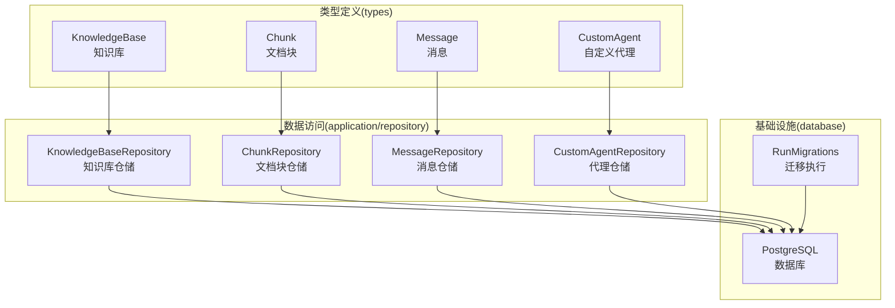
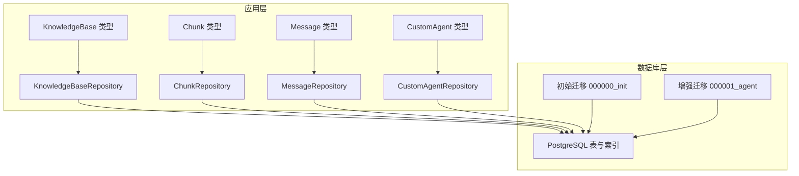
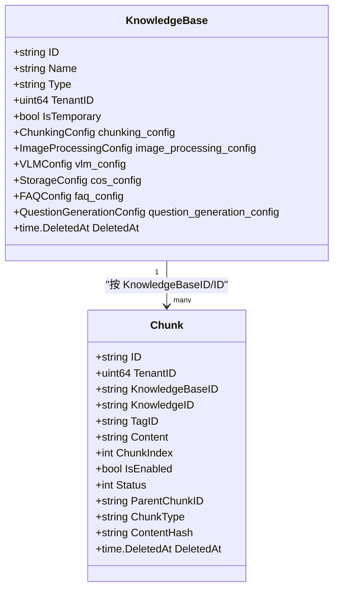
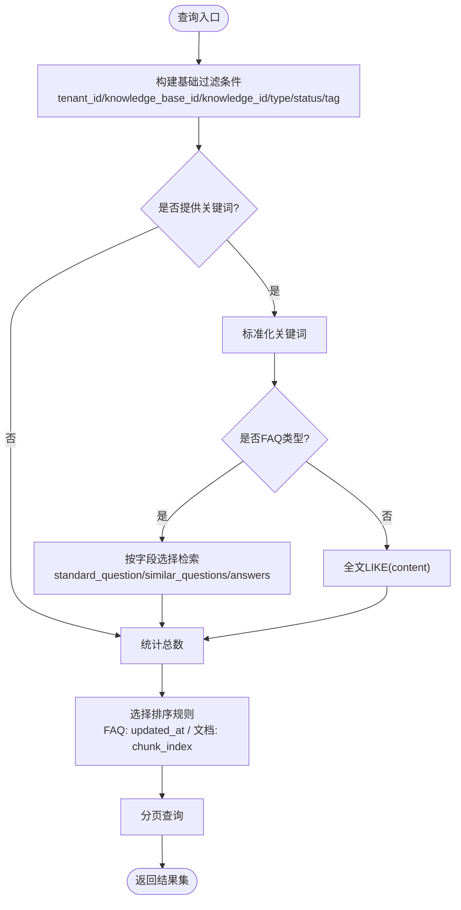
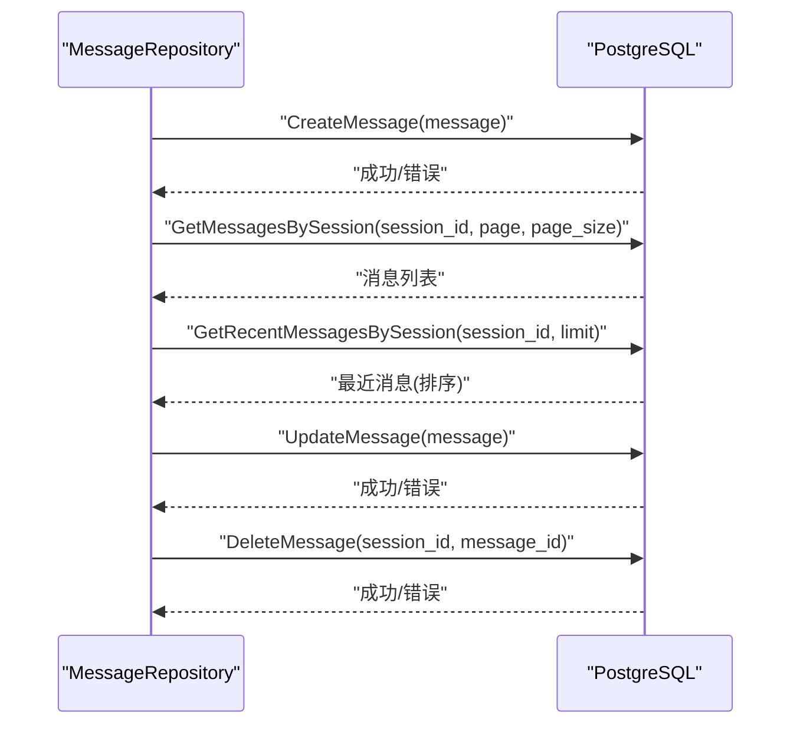
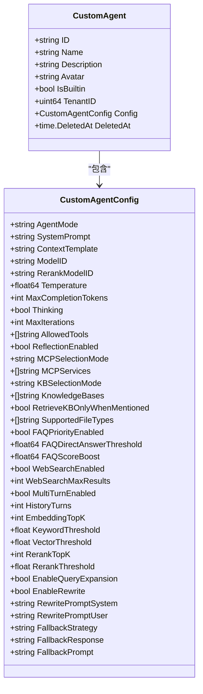
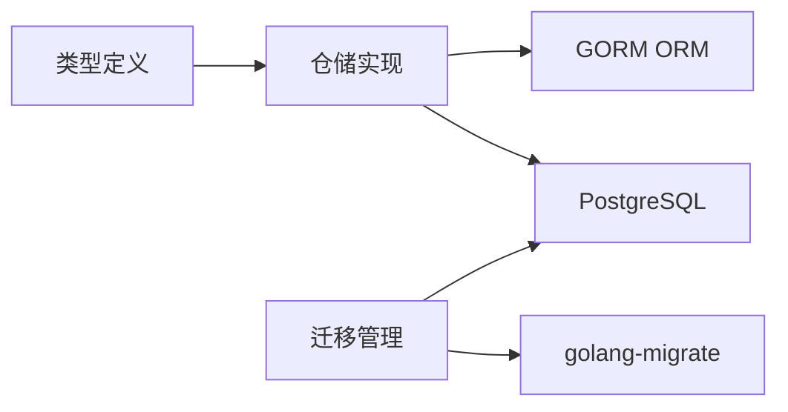

# 数据模型与架构

<cite>
**本文引用的文件**
- [internal/types/knowledgebase.go](file://internal/types/knowledgebase.go)
- [internal/types/chunk.go](file://internal/types/chunk.go)
- [internal/types/message.go](file://internal/types/message.go)
- [internal/types/agent.go](file://internal/types/agent.go)
- [internal/types/custom_agent.go](file://internal/types/custom_agent.go)
- [internal/application/repository/knowledgebase.go](file://internal/application/repository/knowledgebase.go)
- [internal/application/repository/chunk.go](file://internal/application/repository/chunk.go)
- [internal/application/repository/message.go](file://internal/application/repository/message.go)
- [internal/application/repository/custom_agent.go](file://internal/application/repository/custom_agent.go)
- [internal/database/migration.go](file://internal/database/migration.go)
- [migrations/versioned/000000_init.up.sql](file://migrations/versioned/000000_init.up.sql)
- [migrations/versioned/000001_agent.up.sql](file://migrations/versioned/000001_agent.up.sql)
</cite>

## 目录
1. [简介](#简介)
2. [项目结构](#项目结构)
3. [核心组件](#核心组件)
4. [架构总览](#架构总览)
5. [详细组件分析](#详细组件分析)
6. [依赖分析](#依赖分析)
7. [性能考虑](#性能考虑)
8. [故障排查指南](#故障排查指南)
9. [结论](#结论)
10. [附录](#附录)

## 简介
本文件面向数据模型与架构，系统性阐述知识库(KnowledgeBase)、文档块(Chunk)、消息(Message)与代理(CustomAgent)等核心实体的设计与关系映射；说明数据库架构、索引与约束策略；解析数据迁移机制（版本控制、回滚与一致性保障）；给出数据访问层的Repository模式、事务与错误处理实践；并覆盖缓存与性能优化、安全与隐私保护等主题。

## 项目结构
围绕数据模型与架构，代码库采用分层与职责分离的组织方式：
- types 层：定义领域模型与序列化接口，承载数据结构与约束
- application/repository 层：实现数据访问接口，封装SQL与事务
- database 层：迁移管理与版本控制
- migrations/versioned：数据库版本化迁移脚本

图表来源
- [internal/types/knowledgebase.go](file://internal/types/knowledgebase.go#L38-L84)
- [internal/types/chunk.go](file://internal/types/chunk.go#L96-L155)
- [internal/types/message.go](file://internal/types/message.go#L56-L87)
- [internal/types/custom_agent.go](file://internal/types/custom_agent.go#L39-L65)
- [internal/application/repository/knowledgebase.go](file://internal/application/repository/knowledgebase.go#L14-L22)
- [internal/application/repository/chunk.go](file://internal/application/repository/chunk.go#L15-L23)
- [internal/application/repository/message.go](file://internal/application/repository/message.go#L14-L24)
- [internal/application/repository/custom_agent.go](file://internal/application/repository/custom_agent.go#L15-L23)
- [internal/database/migration.go](file://internal/database/migration.go#L14-L25)

章节来源
- [internal/types/knowledgebase.go](file://internal/types/knowledgebase.go#L1-L348)
- [internal/types/chunk.go](file://internal/types/chunk.go#L1-L155)
- [internal/types/message.go](file://internal/types/message.go#L1-L135)
- [internal/types/custom_agent.go](file://internal/types/custom_agent.go#L1-L1027)
- [internal/application/repository/knowledgebase.go](file://internal/application/repository/knowledgebase.go#L1-L83)
- [internal/application/repository/chunk.go](file://internal/application/repository/chunk.go#L1-L770)
- [internal/application/repository/message.go](file://internal/application/repository/message.go#L1-L154)
- [internal/application/repository/custom_agent.go](file://internal/application/repository/custom_agent.go#L1-L63)
- [internal/database/migration.go](file://internal/database/migration.go#L1-L221)
- [migrations/versioned/000000_init.up.sql](file://migrations/versioned/000000_init.up.sql#L1-L204)
- [migrations/versioned/000001_agent.up.sql](file://migrations/versioned/000001_agent.up.sql#L1-L409)

## 核心组件
本节聚焦四大核心实体及其关键字段与约束，体现领域建模与持久化策略。

- 知识库(KnowledgeBase)
  - 标识与租户隔离：ID、TenantID
  - 类型与配置：Type、ChunkingConfig、ImageProcessingConfig、VLMConfig、StorageConfig、FAQConfig、QuestionGenerationConfig
  - 软删除与派生计数：DeletedAt、KnowledgeCount、ChunkCount、IsProcessing、ProcessingCount
  - 约束与默认值：类型枚举、默认配置、软删除索引

- 文档块(Chunk)
  - 多租户与归属：TenantID、KnowledgeBaseID、KnowledgeID
  - 结构化内容：Content、ChunkIndex、StartAt/EndAt、ParentChunkID、RelationChunks、IndirectRelationChunks
  - 分类与标记：ChunkType、TagID、ContentHash、Metadata
  - 状态与标志：Status、IsEnabled、Flags（位标志）
  - 软删除与索引：DeletedAt、TagID索引、ContentHash索引

- 消息(Message)
  - 会话归属：SessionID、RequestID
  - 内容与角色：Content、Role（user/assistant/system）
  - 引用与追踪：KnowledgeReferences、AgentSteps（推理过程）、MentionedItems（@提及）
  - 完成状态与时间戳：IsCompleted、CreatedAt/UpdatedAt、DeletedAt
  - GIN索引：AgentSteps、KnowledgeReferences

- 自定义代理(CustomAgent)
  - 复合主键：ID、TenantID
  - 配置维度：Config（AgentMode、SystemPrompt、ContextTemplate、模型参数、检索策略、工具集合、WebSearch、MultiTurn、FAQ策略等）
  - 内置代理常量：内置ID、模式标识
  - 默认值与校验：EnsureDefaults、IsAgentMode、内置代理模板

章节来源
- [internal/types/knowledgebase.go](file://internal/types/knowledgebase.go#L38-L84)
- [internal/types/chunk.go](file://internal/types/chunk.go#L96-L155)
- [internal/types/message.go](file://internal/types/message.go#L56-L87)
- [internal/types/custom_agent.go](file://internal/types/custom_agent.go#L39-L65)

## 架构总览
下图展示数据模型在应用层与数据库层的交互，以及迁移与索引策略：

图表来源
- [internal/application/repository/knowledgebase.go](file://internal/application/repository/knowledgebase.go#L14-L22)
- [internal/application/repository/chunk.go](file://internal/application/repository/chunk.go#L15-L23)
- [internal/application/repository/message.go](file://internal/application/repository/message.go#L14-L24)
- [internal/application/repository/custom_agent.go](file://internal/application/repository/custom_agent.go#L15-L23)
- [migrations/versioned/000000_init.up.sql](file://migrations/versioned/000000_init.up.sql#L1-L204)
- [migrations/versioned/000001_agent.up.sql](file://migrations/versioned/000001_agent.up.sql#L1-L409)

## 详细组件分析

### 知识库(KnowledgeBase)模型与仓储
- 字段要点
  - 多模态与存储：VLMConfig、StorageConfig、ImageProcessingConfig
  - FAQ专属：FAQConfig、QuestionGenerationConfig
  - 默认值与兼容：EnsureDefaults、IsMultimodalEnabled
- 仓储能力
  - CRUD、列表、按租户过滤、临时库隐藏、软删除索引
- 关系映射
  - 与Chunk：一对多（按KnowledgeBaseID与KnowledgeID）
  - 与Knowledge：一对多（按KnowledgeBaseID）

图表来源
- [internal/types/knowledgebase.go](file://internal/types/knowledgebase.go#L38-L84)
- [internal/types/chunk.go](file://internal/types/chunk.go#L96-L155)

章节来源
- [internal/types/knowledgebase.go](file://internal/types/knowledgebase.go#L1-L348)
- [internal/application/repository/knowledgebase.go](file://internal/application/repository/knowledgebase.go#L1-L83)

### 文档块(Chunk)模型与仓储
- 字段要点
  - 多类型支持：ChunkType涵盖文本、图像OCR/Caption、摘要、实体、关系、FAQ、Web搜索、表格等
  - 状态机：Status（默认/存储/索引）
  - 标志位：Flags（如推荐）
  - 关系与元数据：ParentChunkID、RelationChunks、IndirectRelationChunks、Metadata
  - 哈希与索引：ContentHash、TagID、DeletedAt
- 仓储能力
  - 批量插入、分页检索、关键词/FAQ检索、标签批量更新、标志位批量更新、FAQ差异比对、删除清理
- 性能特性
  - 批量更新使用CASE表达式绕过GORM默认值行为
  - FAQ全量导出/去重查询采用分批游标式查询

图表来源
- [internal/application/repository/chunk.go](file://internal/application/repository/chunk.go#L114-L209)

章节来源
- [internal/types/chunk.go](file://internal/types/chunk.go#L1-L155)
- [internal/application/repository/chunk.go](file://internal/application/repository/chunk.go#L1-L770)

### 消息(Message)模型与仓储
- 字段要点
  - 会话与请求：SessionID、RequestID
  - 内容与角色：Content、Role
  - 引用与推理：KnowledgeReferences、AgentSteps、MentionedItems
  - 生命周期：IsCompleted、CreatedAt/UpdatedAt/DeletedAt
- 仓储能力
  - 单条检索、分页查询、最近消息、按时间窗口查询、更新、删除、首条用户消息、按RequestID查询
- 设计细节
  - GORM钩子BeforeCreate自动生成UUID并初始化空数组

图表来源
- [internal/application/repository/message.go](file://internal/application/repository/message.go#L26-L122)

章节来源
- [internal/types/message.go](file://internal/types/message.go#L1-L135)
- [internal/application/repository/message.go](file://internal/application/repository/message.go#L1-L154)

### 代理(CustomAgent)模型与仓储
- 字段要点
  - 复合主键：ID、TenantID
  - 配置维度：AgentMode、SystemPrompt、ContextTemplate、模型参数、工具集合、WebSearch、MultiTurn、FAQ策略、检索策略、高级设置
  - 内置代理：快速问答、智能推理、数据分析师、问诊助手、诊断报告生成等
- 仓储能力
  - 创建、按ID与租户查询、按租户列表、更新、软删除

图表来源
- [internal/types/custom_agent.go](file://internal/types/custom_agent.go#L39-L181)

章节来源
- [internal/types/custom_agent.go](file://internal/types/custom_agent.go#L1-L1027)
- [internal/application/repository/custom_agent.go](file://internal/application/repository/custom_agent.go#L1-L63)

## 依赖分析
- 组件耦合
  - 仓储层依赖GORM与上下文，统一通过WithContext传递
  - 类型层广泛使用JSON/JSONB字段，配合GIN索引提升查询效率
- 外部依赖
  - 迁移框架：golang-migrate
  - 数据库：PostgreSQL（UUID扩展、GIN索引、JSONB）
- 潜在风险
  - JSONB字段频繁更新需注意索引维护成本
  - 批量更新使用原生SQL，需确保字段白名单与类型一致

图表来源
- [internal/application/repository/chunk.go](file://internal/application/repository/chunk.go#L25-L33)
- [internal/database/migration.go](file://internal/database/migration.go#L14-L25)

章节来源
- [internal/application/repository/chunk.go](file://internal/application/repository/chunk.go#L1-L770)
- [internal/database/migration.go](file://internal/database/migration.go#L1-L221)

## 性能考虑
- 查询优化
  - 为JSONB字段建立GIN索引（如AgentSteps、AgentConfig、ContextConfig）
  - 对高频过滤字段建立普通索引（如TagID、ContentHash、DeletedAt）
  - 分页查询结合COUNT与LIMIT，FAQ与文档采用差异化排序策略
- 批处理与连接
  - 批量插入使用Select("*")确保零值入库
  - 批量更新采用CASE表达式，减少往返与默认值覆盖
- 缓存与读写分离
  - 未见专用缓存层实现；建议对热点查询（如FAQ去重、标签统计）引入Redis缓存
  - 读写分离可通过连接池与只读副本实现（需在连接字符串与路由层配置）
- 向量化与检索
  - 向量索引与嵌入存储位于迁移脚本中，需结合检索引擎（如Qdrant/PG向量扩展）进行查询优化

[本节为通用指导，无需特定文件引用]

## 故障排查指南
- 迁移失败与脏状态
  - 自动恢复：启用AutoRecoverDirty时，迁移器会强制回退至上一版本并重试
  - 手动干预：记录当前版本与脏状态，使用force命令回退至稳定版本，修复后再重试
- 记录不存在
  - 知识库/代理查询不到时抛出特定错误，需检查ID与租户ID
- 批量操作异常
  - 批量更新失败时，返回已计划删除的ID列表，便于索引清理与重试
- JSONB字段问题
  - 确保字段类型为JSONB，GIN索引存在；避免在WHERE中对JSONB做昂贵函数计算

章节来源
- [internal/database/migration.go](file://internal/database/migration.go#L56-L151)
- [internal/application/repository/knowledgebase.go](file://internal/application/repository/knowledgebase.go#L12-L38)
- [internal/application/repository/chunk.go](file://internal/application/repository/chunk.go#L361-L403)

## 结论
本架构以清晰的领域模型为核心，通过类型层的强约束与仓储层的统一抽象，实现了知识库、文档块、消息与代理的高内聚低耦合。数据库层面采用版本化迁移与索引策略，兼顾可演进性与查询性能。建议后续完善缓存与读写分离、强化向量化检索与索引治理，并持续优化JSONB字段的查询与索引策略。

[本节为总结性内容，无需特定文件引用]

## 附录

### 数据库架构与索引策略
- 初始表结构
  - tenants、models、knowledge_bases、knowledges、sessions、messages、chunks
  - UUID扩展、序列化字段、软删除字段
- 增强迁移
  - 用户认证表(users、auth_tokens)
  - 租户/会话/知识库配置增强
  - 知识与块的标签、状态、哈希字段
  - MCP服务表与触发器
  - JSONB字段的GIN索引

章节来源
- [migrations/versioned/000000_init.up.sql](file://migrations/versioned/000000_init.up.sql#L1-L204)
- [migrations/versioned/000001_agent.up.sql](file://migrations/versioned/000001_agent.up.sql#L1-L409)

### 数据迁移管理机制
- 版本控制
  - 使用golang-migrate管理up/down脚本，路径为migrations/versioned
- 回滚策略
  - 脏状态自动恢复：强制回退至上一版本并重试
  - 手动强制：记录版本号后执行force命令
- 一致性保障
  - 迁移前后版本与脏状态检查
  - 数据清理与引用一致性（如模型引用清理）

章节来源
- [internal/database/migration.go](file://internal/database/migration.go#L14-L221)

### 数据访问层设计模式
- Repository模式
  - 统一接口与实现，屏蔽SQL细节
  - 上下文传播与事务边界
- 事务管理
  - 仓储方法内部负责事务提交/回滚
  - 批量操作采用原生SQL以提升性能
- 错误处理
  - 明确的NotFound错误与业务错误
  - 返回已计划操作结果以便上层重试与清理

章节来源
- [internal/application/repository/knowledgebase.go](file://internal/application/repository/knowledgebase.go#L1-L83)
- [internal/application/repository/chunk.go](file://internal/application/repository/chunk.go#L1-L770)
- [internal/application/repository/message.go](file://internal/application/repository/message.go#L1-L154)
- [internal/application/repository/custom_agent.go](file://internal/application/repository/custom_agent.go#L1-L63)

### 数据安全与隐私保护
- 认证与授权
  - 用户表与令牌表，外键约束与索引
  - 令牌类型与过期时间管理
- 数据最小化与脱敏
  - 仅存储必要字段，敏感信息（密码）仅保存哈希
- 审计与追踪
  - 软删除与时间戳便于审计
  - 消息中的AgentSteps可用于调试与审计（注意敏感信息脱敏）

章节来源
- [migrations/versioned/000001_agent.up.sql](file://migrations/versioned/000001_agent.up.sql#L10-L100)
- [internal/types/message.go](file://internal/types/message.go#L115-L135)