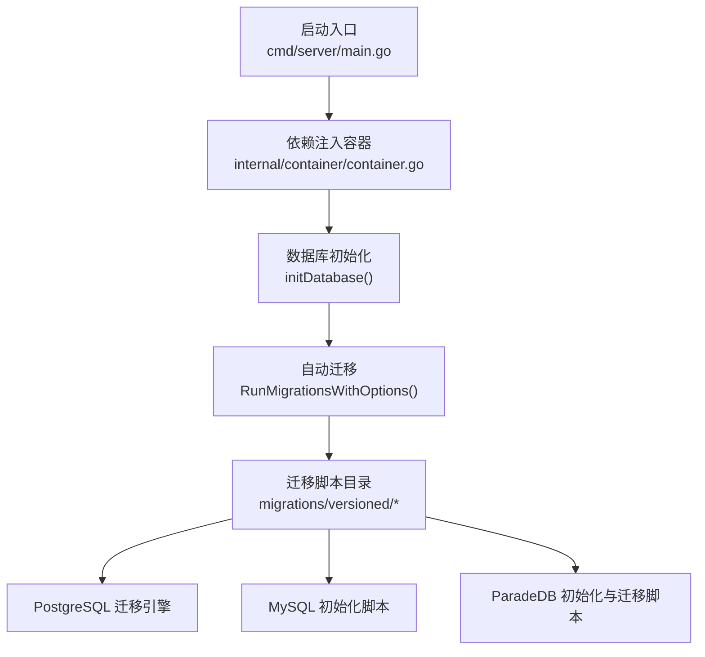
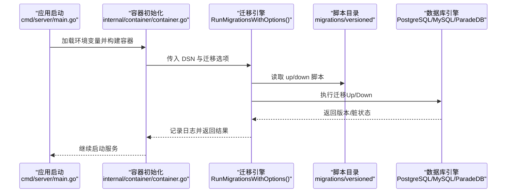
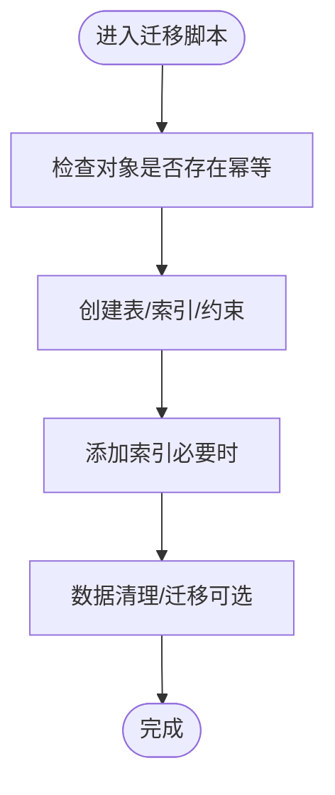
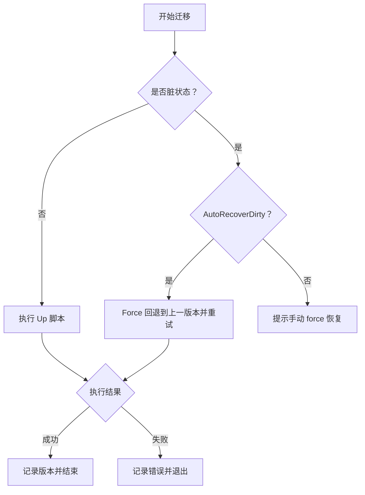
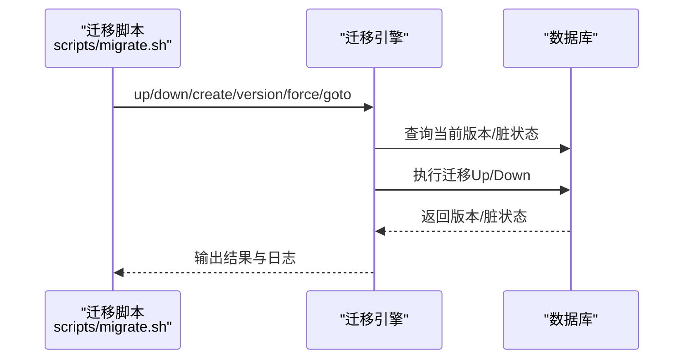
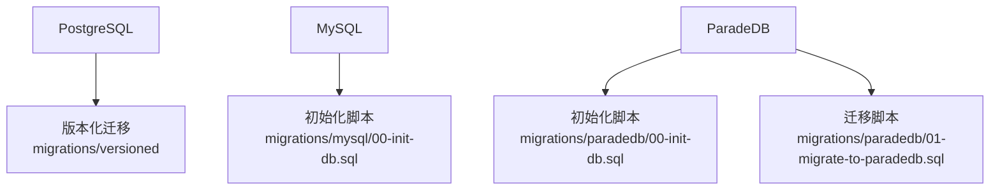
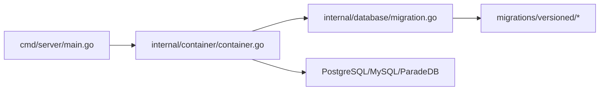

# 数据迁移管理

<cite>
**本文引用的文件**
- [migrations/versioned/000000_init.up.sql](file://migrations/versioned/000000_init.up.sql)
- [migrations/versioned/000000_init.down.sql](file://migrations/versioned/000000_init.down.sql)
- [migrations/versioned/000001_agent.up.sql](file://migrations/versioned/000001_agent.up.sql)
- [migrations/versioned/000001_agent.down.sql](file://migrations/versioned/000001_agent.down.sql)
- [internal/database/migration.go](file://internal/database/migration.go)
- [scripts/migrate.sh](file://scripts/migrate.sh)
- [migrations/mysql/00-init-db.sql](file://migrations/mysql/00-init-db.sql)
- [migrations/paradedb/00-init-db.sql](file://migrations/paradedb/00-init-db.sql)
- [migrations/paradedb/01-migrate-to-paradedb.sql](file://migrations/paradedb/01-migrate-to-paradedb.sql)
- [internal/container/container.go](file://internal/container/container.go)
- [cmd/server/main.go](file://cmd/server/main.go)
</cite>

## 目录
1. [简介](#简介)
2. [项目结构](#项目结构)
3. [核心组件](#核心组件)
4. [架构总览](#架构总览)
5. [详细组件分析](#详细组件分析)
6. [依赖分析](#依赖分析)
7. [性能考量](#性能考量)
8. [故障排查指南](#故障排查指南)
9. [结论](#结论)
10. [附录](#附录)

## 简介
本文件系统化阐述本项目的版本化迁移管理方案，涵盖迁移文件命名规范、版本控制策略、依赖关系管理、向上/向下迁移实现、数据一致性保障机制（事务与回滚）、迁移执行流程（预检查、执行、后验证）、多数据库支持（PostgreSQL、MySQL、ParadeDB）以及实际迁移案例与最佳实践（含大数据量与零停机升级策略）。文档面向开发者与运维人员，既提供代码级细节，也提供可操作的流程与图示。

## 项目结构
本项目采用“版本化迁移 + 脚本驱动 + 启动时自动迁移”的混合架构：
- 版本化迁移目录：migrations/versioned，按顺序编号的 up/down 脚本
- 数据库驱动初始化：容器层负责构建 DSN、自动迁移、连接池配置
- 迁移工具脚本：scripts/migrate.sh 提供 up/down/create/version/force/goto 等命令
- 多数据库支持：通过不同的初始化脚本适配 MySQL、PostgreSQL、ParadeDB

图表来源
- [cmd/server/main.go](file://cmd/server/main.go#L88-L193)
- [internal/container/container.go](file://internal/container/container.go#L262-L362)
- [internal/database/migration.go](file://internal/database/migration.go#L14-L152)

章节来源
- [cmd/server/main.go](file://cmd/server/main.go#L88-L193)
- [internal/container/container.go](file://internal/container/container.go#L262-L362)

## 核心组件
- 版本化迁移引擎：基于 golang-migrate 的文件源，按顺序执行 migrations/versioned 下的 up/down 脚本
- 迁移选项与容错：支持自动恢复脏状态（AutoRecoverDirty），在脏状态下强制回退并重试
- 迁移脚本：每个版本包含 up.sql 与 down.sql，遵循“IF NOT EXISTS”“条件判断”“索引/约束幂等”等幂等设计
- 迁移脚本工具：scripts/migrate.sh 提供命令行接口，支持本地开发与 CI/CD 集成
- 多数据库适配：PostgreSQL 为主，MySQL 与 ParadeDB 提供初始化脚本与迁移差异说明

章节来源
- [internal/database/migration.go](file://internal/database/migration.go#L14-L152)
- [scripts/migrate.sh](file://scripts/migrate.sh#L63-L120)

## 架构总览
下图展示了迁移执行的端到端流程：从应用启动到迁移引擎、脚本目录、数据库引擎，再到回滚与恢复策略。

图表来源
- [cmd/server/main.go](file://cmd/server/main.go#L88-L193)
- [internal/container/container.go](file://internal/container/container.go#L262-L362)
- [internal/database/migration.go](file://internal/database/migration.go#L27-L152)

## 详细组件分析

### 版本化迁移系统设计
- 命名规范
  - 版本号：固定 6 位数字，递增顺序执行
  - up/down：每个版本包含对应的 up.sql 与 down.sql
  - 示例：000000_init.up.sql、000000_init.down.sql
- 版本控制策略
  - 顺序执行：migrate 按文件名顺序读取并执行 up 脚本
  - 历史记录：migrate 在数据库中维护迁移历史表，记录已执行版本
  - 脏状态检测：若迁移中途失败导致部分应用，标记为脏；可通过 AutoRecoverDirty 或手动 force 恢复
- 依赖关系管理
  - 通过版本顺序隐式定义依赖：000001 依赖 000000 完成
  - 显式依赖：在 up 中使用 IF NOT EXISTS、条件约束与索引，避免重复创建
  - 外键与索引：在 up 中创建，down 中按逆序删除，确保可回滚

章节来源
- [internal/database/migration.go](file://internal/database/migration.go#L14-L152)
- [migrations/versioned/000000_init.up.sql](file://migrations/versioned/000000_init.up.sql#L1-L204)
- [migrations/versioned/000001_agent.up.sql](file://migrations/versioned/000001_agent.up.sql#L1-L409)

### 迁移脚本编写规范（up/down）
- 向上迁移（up）
  - 幂等性：使用 IF NOT EXISTS、条件约束、条件索引
  - 顺序性：按依赖顺序创建表、索引、约束
  - 可观测性：使用 RAISE NOTICE 输出阶段日志
  - 数据清理：必要时进行软删除或数据清洗
- 向下迁移（down）
  - 逆序删除：先删索引，再删表；外键约束需先删除
  - 不可逆数据：对不可逆的数据清理，注释说明（如软删除）
  - 事务：建议在单个事务中执行，便于回滚

图表来源
- [migrations/versioned/000000_init.up.sql](file://migrations/versioned/000000_init.up.sql#L1-L204)
- [migrations/versioned/000001_agent.up.sql](file://migrations/versioned/000001_agent.up.sql#L1-L409)

章节来源
- [migrations/versioned/000000_init.down.sql](file://migrations/versioned/000000_init.down.sql#L1-L56)
- [migrations/versioned/000001_agent.down.sql](file://migrations/versioned/000001_agent.down.sql#L1-L131)

### 数据一致性保证机制（事务、回滚、恢复）
- 事务处理
  - 单个迁移脚本通常在一个事务中执行，失败即回滚
  - 对于大型迁移，建议拆分为多个小版本，降低锁竞争与失败风险
- 脏状态恢复
  - AutoRecoverDirty：自动回退到上一个版本并重试
  - 手动 force：当自动恢复失败时，使用脚本强制设置版本
- 错误恢复
  - 记录日志：迁移引擎记录版本、脏状态、错误原因
  - 建议：在生产环境禁用自动恢复，改为人工干预

图表来源
- [internal/database/migration.go](file://internal/database/migration.go#L56-L152)

章节来源
- [internal/database/migration.go](file://internal/database/migration.go#L154-L193)

### 迁移执行流程（预检查、执行、后验证）
- 预检查
  - 获取当前版本与脏状态
  - 若脏且未启用自动恢复，提示手动修复
- 执行
  - 顺序执行 up 脚本，记录版本变化
  - 若中途失败，检测脏状态并触发恢复
- 后验证
  - 校验版本号与脏状态
  - 建议：在 CI 中增加迁移后验证步骤（如查询关键表计数）

图表来源
- [scripts/migrate.sh](file://scripts/migrate.sh#L63-L120)
- [internal/database/migration.go](file://internal/database/migration.go#L43-L152)

章节来源
- [scripts/migrate.sh](file://scripts/migrate.sh#L63-L120)
- [internal/database/migration.go](file://internal/database/migration.go#L27-L152)

### 多数据库支持（PostgreSQL、MySQL、ParadeDB）
- PostgreSQL（默认）
  - 使用 golang-migrate 的 postgres 驱动
  - DSN 支持自定义参数（如跳过嵌入迁移）
  - 启动时自动迁移，支持 AutoRecoverDirty
- MySQL
  - 提供初始化脚本，创建相同结构的表与索引
  - 语法差异：JSON 字段类型、索引命名、时间戳默认值等
- ParadeDB
  - 提供初始化与迁移脚本，包含向量扩展与 bm25 索引
  - 适用于中文全文检索与向量搜索场景

图表来源
- [migrations/mysql/00-init-db.sql](file://migrations/mysql/00-init-db.sql#L1-L157)
- [migrations/paradedb/00-init-db.sql](file://migrations/paradedb/00-init-db.sql#L1-L215)
- [migrations/paradedb/01-migrate-to-paradedb.sql](file://migrations/paradedb/01-migrate-to-paradedb.sql#L1-L70)

章节来源
- [internal/container/container.go](file://internal/container/container.go#L274-L310)
- [migrations/mysql/00-init-db.sql](file://migrations/mysql/00-init-db.sql#L1-L157)
- [migrations/paradedb/00-init-db.sql](file://migrations/paradedb/00-init-db.sql#L1-L215)
- [migrations/paradedb/01-migrate-to-paradedb.sql](file://migrations/paradedb/01-migrate-to-paradedb.sql#L1-L70)

### 实际迁移案例与最佳实践
- 初始数据库搭建
  - 使用 000000_init 脚本创建核心表与索引，设置序列起始值
  - 建议：在生产环境先在测试库验证，再执行
- 用户认证与权限增强
  - 使用 000001_agent 脚本新增用户表、令牌表、租户配置增强
  - 建议：在升级前备份数据，升级后验证用户登录与权限
- 大数据量迁移
  - 将大变更拆分为多个小版本，避免长时间锁表
  - 使用批量处理与索引优化，减少迁移时间
- 零停机升级策略
  - 采用蓝绿部署或滚动升级，配合迁移脚本的幂等性
  - 在迁移窗口外进行数据导出与导入，缩短业务中断时间

章节来源
- [migrations/versioned/000000_init.up.sql](file://migrations/versioned/000000_init.up.sql#L1-L204)
- [migrations/versioned/000001_agent.up.sql](file://migrations/versioned/000001_agent.up.sql#L1-L409)

## 依赖分析
- 启动依赖
  - main.go 负责加载环境变量与启动 HTTP 服务
  - container.go 负责构建容器、初始化数据库、执行迁移
- 迁移依赖
  - migration.go 依赖 golang-migrate 的 postgres 驱动
  - scripts/migrate.sh 依赖 migrate 命令行工具
- 数据库依赖
  - PostgreSQL 作为主数据库，MySQL/ParadeDB 作为备选或专用场景

图表来源
- [cmd/server/main.go](file://cmd/server/main.go#L88-L193)
- [internal/container/container.go](file://internal/container/container.go#L262-L362)
- [internal/database/migration.go](file://internal/database/migration.go#L14-L152)

章节来源
- [cmd/server/main.go](file://cmd/server/main.go#L88-L193)
- [internal/container/container.go](file://internal/container/container.go#L262-L362)
- [internal/database/migration.go](file://internal/database/migration.go#L14-L152)

## 性能考量
- 迁移性能
  - 避免一次性大表重建；拆分为多个小版本
  - 在 up 中使用条件创建与索引，减少重复开销
- 连接池
  - 容器层设置最大空闲连接与连接生命周期，降低连接抖动
- 并发与锁
  - 在高并发场景，尽量避免长事务；将大迁移安排在低峰时段

章节来源
- [internal/container/container.go](file://internal/container/container.go#L357-L361)

## 故障排查指南
- 常见问题
  - 脏状态：迁移失败导致数据库处于脏状态
  - 版本不一致：手动强制版本后仍需验证
  - 权限不足：数据库用户缺少创建/修改权限
- 处理步骤
  - 查看当前版本与脏状态：使用 version 命令
  - 自动恢复：设置 AUTO_RECOVER_DIRTY=true
  - 手动恢复：使用 force 命令强制版本
  - 重新执行：确认修复后重启应用，自动迁移将重试

章节来源
- [internal/database/migration.go](file://internal/database/migration.go#L56-L152)
- [scripts/migrate.sh](file://scripts/migrate.sh#L95-L120)

## 结论
本项目通过版本化迁移、幂等脚本与自动恢复机制，实现了稳定可靠的数据库演进能力。结合多数据库支持与脚本化工具，可在不同环境下高效完成迁移。建议在生产环境中采用小步快跑、充分测试与回滚预案，确保迁移安全与业务连续性。

## 附录
- 命令速查
  - up：执行待执行的迁移
  - down：回退一个版本
  - create：生成新的 up/down 脚本
  - version：查看当前版本
  - force：强制设置版本
  - goto：迁移到指定版本

章节来源
- [scripts/migrate.sh](file://scripts/migrate.sh#L63-L120)