# 核心数据模型

<cite>
**本文引用的文件**
- [internal/types/knowledgebase.go](file://internal/types/knowledgebase.go)
- [internal/types/chunk.go](file://internal/types/chunk.go)
- [internal/types/message.go](file://internal/types/message.go)
- [internal/types/agent.go](file://internal/types/agent.go)
- [internal/types/session.go](file://internal/types/session.go)
- [internal/types/tag.go](file://internal/types/tag.go)
- [internal/types/user.go](file://internal/types/user.go)
- [internal/types/tenant.go](file://internal/types/tenant.go)
- [migrations/versioned/000000_init.up.sql](file://migrations/versioned/000000_init.up.sql)
- [migrations/versioned/000001_agent.up.sql](file://migrations/versioned/000001_agent.up.sql)
- [migrations/versioned/000002_embeddings.up.sql](file://migrations/versioned/000002_embeddings.up.sql)
- [migrations/versioned/000003_chunk_flags.up.sql](file://migrations/versioned/000003_chunk_flags.up.sql)
- [migrations/versioned/000004_drop_vlm_model_id.up.sql](file://migrations/versioned/000004_drop_vlm_model_id.up.sql)
- [migrations/versioned/000005_mentioned_items.up.sql](file://migrations/versioned/000005_mentioned_items.up.sql)
- [migrations/versioned/000006_custom_agents.up.sql](file://migrations/versioned/000006_custom_agents.up.sql)
- [migrations/versioned/000007_embeddings_tag_id.up.sql](file://migrations/versioned/000007_embeddings_tag_id.up.sql)
- [migrations/versioned/000008_migrate_untagged_faq.up.sql](file://migrations/versioned/000008_migrate_untagged_faq.up.sql)
- [migrations/versioned/000009_add_last_faq_import_result.up.sql](file://migrations/versioned/000009_add_last_faq_import_result.up.sql)
- [migrations/versioned/000010_add_seq_id.up.sql](file://migrations/versioned/000010_add_seq_id.up.sql)
- [migrations/versioned/000011_pg_search_update.up.sql](file://migrations/versioned/000011_pg_search_update.up.sql)
- [migrations/versioned/000012_knowledge_base_permissions.up.sql](file://migrations/versioned/000012_knowledge_base_permissions.up.sql)
</cite>

## 目录
1. [简介](#简介)
2. [项目结构](#项目结构)
3. [核心组件](#核心组件)
4. [架构总览](#架构总览)
5. [详细组件分析](#详细组件分析)
6. [依赖分析](#依赖分析)
7. [性能考量](#性能考量)
8. [故障排查指南](#故障排查指南)
9. [结论](#结论)
10. [附录](#附录)

## 简介
本文件系统化梳理 WiseDx 核心数据模型，覆盖知识库(KnowledgeBase)、文档块(Chunk)、消息(Message)、代理(Agent)、会话(Session)、标签(Tag)、用户(User)与租户(Tenant)等实体。内容包括：
- 数据结构设计：字段定义、数据类型、约束与业务规则
- 实体关系映射：一对一、一对多、多对多
- 生命周期管理：创建、更新、删除与软删除策略
- 数据验证与输入输出规范
- 数据库表结构、字段映射、索引设计与性能优化建议
- 迁移脚本中的演进记录与兼容性说明

## 项目结构
围绕核心数据模型，后端通过 types 层定义统一的数据结构，并由迁移脚本在数据库中落地；应用层服务与仓库层负责业务逻辑与持久化。

```mermaid
graph TB
subgraph "类型定义(types)"
KB["KnowledgeBase<br/>知识库"]
CK["Chunk<br/>文档块"]
MSG["Message<br/>消息"]
AG["AgentConfig<br/>代理配置"]
SES["Session<br/>会话"]
TAG["KnowledgeTag<br/>标签"]
USR["User<br/>用户"]
TEN["Tenant<br/>租户"]
end
subgraph "数据库迁移"
M00["000000_init.up.sql"]
M01["000001_agent.up.sql"]
M02["000002_embeddings.up.sql"]
M03["000003_chunk_flags.up.sql"]
M04["000004_drop_vlm_model_id.up.sql"]
M05["000005_mentioned_items.up.sql"]
M06["000006_custom_agents.up.sql"]
M07["000007_embeddings_tag_id.up.sql"]
M08["000008_migrate_untagged_faq.up.sql"]
M09["000009_add_last_faq_import_result.up.sql"]
M10["000010_add_seq_id.up.sql"]
M11["000011_pg_search_update.up.sql"]
M12["000012_knowledge_base_permissions.up.sql"]
end
KB --- M00
CK --- M00
MSG --- M00
TAG --- M00
USR --- M00
TEN --- M00
AG --- M01
AG --- M06
MSG --- M05
CK --- M03
CK --- M07
CK --- M08
CK --- M10
TEN --- M12
```

图表来源
- [internal/types/knowledgebase.go](file://internal/types/knowledgebase.go#L38-L84)
- [internal/types/chunk.go](file://internal/types/chunk.go#L96-L155)
- [internal/types/message.go](file://internal/types/message.go#L56-L87)
- [internal/types/tag.go](file://internal/types/tag.go#L5-L27)
- [internal/types/user.go](file://internal/types/user.go#L9-L36)
- [internal/types/tenant.go](file://internal/types/tenant.go#L58-L94)
- [migrations/versioned/000000_init.up.sql](file://migrations/versioned/000000_init.up.sql#L1-L200)

章节来源
- [internal/types/knowledgebase.go](file://internal/types/knowledgebase.go#L1-L348)
- [internal/types/chunk.go](file://internal/types/chunk.go#L1-L155)
- [internal/types/message.go](file://internal/types/message.go#L1-L135)
- [internal/types/agent.go](file://internal/types/agent.go#L1-L178)
- [internal/types/session.go](file://internal/types/session.go#L1-L168)
- [internal/types/tag.go](file://internal/types/tag.go#L1-L41)
- [internal/types/user.go](file://internal/types/user.go#L1-L119)
- [internal/types/tenant.go](file://internal/types/tenant.go#L1-L188)

## 核心组件
本节从数据结构、约束与业务规则三个维度，逐项解析各实体的关键字段与行为。

- 知识库(KnowledgeBase)
  - 标识与元数据：ID、名称、类型(document/faq)、描述、是否临时
  - 多模态与嵌入：嵌入模型ID、摘要模型ID、VLM配置、图像处理配置
  - 存储与抽取：对象存储配置(COS)、抽取配置(提取文本/标签/图节点/关系)
  - FAQ专属：FAQ配置(索引模式、问题索引模式)、问题生成配置
  - 时间与软删：创建/更新/删除时间戳，DeletedAt支持软删除
  - 计数字段：知识条数、块数、处理状态(查询时计算，不落库)
  - 约束与默认：类型默认document；FAQ配置默认值确保一致性；多模态启用兼容新老配置
  - 业务规则：类型为faq时，FAQ配置必填且有默认策略；多模态启用优先检查VLM配置

- 文档块(Chunk)
  - 标识与归属：ID、租户ID、父知识ID、知识库ID、序列ID(SeqID)
  - 分类与标记：标签ID、内容哈希、类型(text/image_ocr/image_caption/summary/entity/relationship/faq/web_search/table_summary/table_column)
  - 结构关系：前后块ID、父块ID、关系块集合、间接关系块集合、图像信息
  - 状态与标志：启用状态、状态码(默认/已存储/已索引)、推荐标志位(位运算)
  - 文本定位：起止字符位置、分段索引
  - 扩展元数据：JSON元数据、JSON关系集合
  - 时间与软删：创建/更新/删除时间戳，DeletedAt支持软删除
  - 约束与默认：类型默认text；启用默认true；推荐标志默认开启；索引字段含复合索引

- 消息(Message)
  - 标识与会话：ID、会话ID、请求ID
  - 内容与角色：内容、角色(user/assistant/system)
  - 引用与执行：知识引用(References)、代理步骤(AgentSteps)、提及项(MentionedItems)
  - 完成状态：生成完成标记
  - 时间与软删：创建/更新/删除时间戳，DeletedAt支持软删除
  - 生命周期钩子：BeforeCreate自动生成ID并初始化空集合
  - 约束与默认：JSON字段类型(json/jsonb)，提及项与代理步骤为空时初始化为空数组

- 代理(AgentConfig)
  - 运行参数：最大迭代次数、反思开关、允许工具列表、温度、知识库访问范围
  - 系统提示：统一系统提示模板，兼容旧版按网络搜索开关的提示
  - 网络搜索：开关、最大结果数、目标选择
  - 会话配置：会话级启用/禁用、知识库/知识ID白名单
  - MCP服务：选择模式(all/selected/none)与服务列表
  - JSON序列化：AgentConfig与SessionAgentConfig均实现Value/Scan接口
  - 业务规则：ResolveSystemPrompt优先使用新字段，回退到旧字段

- 会话(Session)
  - 标识与描述：ID、标题、描述、租户ID
  - 配置：摘要配置(SummaryConfig)、上下文压缩策略(ContextConfig)
  - 时间与软删：创建/更新/删除时间戳，DeletedAt支持软删除
  - 关联关系：Messages外键关联(非持久化字段)
  - 生命周期钩子：BeforeCreate自动生成ID
  - 约束与默认：摘要与上下文配置JSON序列化

- 标签(KnowledgeTag)
  - 标识与归属：ID、租户ID、知识库ID、序列ID(SeqID)
  - 元数据：名称(同库内唯一)、颜色、排序
  - 统计：知识与块数量统计结构
  - 约束与默认：名称非空；排序默认0；索引：知识库ID、唯一索引序列ID

- 用户(User)
  - 标识与凭证：ID、用户名(唯一)、邮箱(唯一)、密码哈希、头像
  - 租户与状态：租户ID、是否激活、跨租户访问权限
  - 时间与软删：创建/更新/删除时间戳，DeletedAt支持软删除
  - 关联关系：Tenant外键关联(非持久化字段)
  - 约束与默认：用户名/邮箱唯一；激活默认true；跨租户默认false；索引：租户ID、用户名、邮箱

- 租户(Tenant)
  - 标识与状态：ID、名称、描述、API Key、状态(active/deprecated)
  - 资源配额：存储配额(字节，默认10GB)、已用存储
  - 检索引擎：检索引擎集合(关键词/向量/ES/Qdrant等)
  - 全局配置：上下文配置、Web搜索配置、对话配置(兼容旧版)
  - 时间与软删：创建/更新/删除时间戳，DeletedAt支持软删除
  - 生命周期钩子：BeforeCreate确保引擎列表非nil
  - 约束与默认：状态默认active；存储配额默认10GB；引擎映射基于环境变量驱动

章节来源
- [internal/types/knowledgebase.go](file://internal/types/knowledgebase.go#L38-L84)
- [internal/types/chunk.go](file://internal/types/chunk.go#L96-L155)
- [internal/types/message.go](file://internal/types/message.go#L56-L87)
- [internal/types/agent.go](file://internal/types/agent.go#L10-L79)
- [internal/types/session.go](file://internal/types/session.go#L74-L108)
- [internal/types/tag.go](file://internal/types/tag.go#L5-L27)
- [internal/types/user.go](file://internal/types/user.go#L9-L36)
- [internal/types/tenant.go](file://internal/types/tenant.go#L58-L94)

## 架构总览
下图展示核心实体之间的关系映射与典型交互流程。

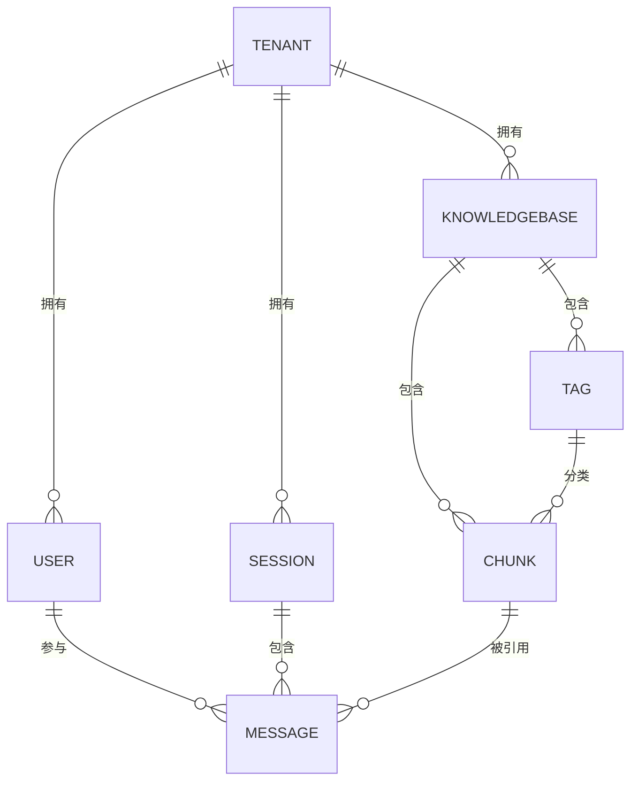

图表来源
- [internal/types/tenant.go](file://internal/types/tenant.go#L58-L94)
- [internal/types/user.go](file://internal/types/user.go#L9-L36)
- [internal/types/knowledgebase.go](file://internal/types/knowledgebase.go#L38-L84)
- [internal/types/chunk.go](file://internal/types/chunk.go#L96-L155)
- [internal/types/tag.go](file://internal/types/tag.go#L5-L27)
- [internal/types/session.go](file://internal/types/session.go#L74-L108)
- [internal/types/message.go](file://internal/types/message.go#L56-L87)

## 详细组件分析

### 知识库(KnowledgeBase)分析
- 数据结构要点
  - 复合配置：分块配置、图像处理配置、VLM配置、存储配置、抽取配置、FAQ配置、问题生成配置
  - 类型与默认：类型默认document；FAQ类型自动补全FAQ配置默认值
  - 多模态兼容：优先检查VLM配置，其次兼容老字段enable_multimodal
- 关系映射
  - 一对多：一个知识库包含多个文档块
  - 一对多：一个知识库包含多个标签
- 生命周期
  - 创建：EnsureDefaults保证默认值；类型为faq时补齐FAQ配置
  - 更新：支持增量更新配置字段
  - 删除：软删除，DeletedAt生效
- 索引与性能
  - DeletedAt建立索引，便于软删除过滤
  - 与FAQ导入相关的迁移脚本体现了索引与统计字段的演进

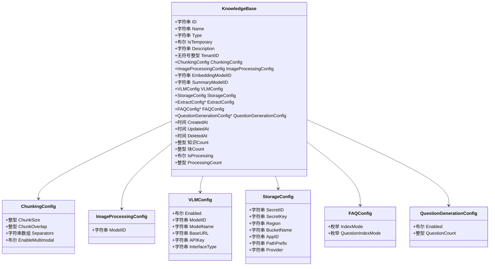

图表来源
- [internal/types/knowledgebase.go](file://internal/types/knowledgebase.go#L38-L84)
- [internal/types/knowledgebase.go](file://internal/types/knowledgebase.go#L96-L106)
- [internal/types/knowledgebase.go](file://internal/types/knowledgebase.go#L141-L145)
- [internal/types/knowledgebase.go](file://internal/types/knowledgebase.go#L181-L195)
- [internal/types/knowledgebase.go](file://internal/types/knowledgebase.go#L108-L124)
- [internal/types/knowledgebase.go](file://internal/types/knowledgebase.go#L281-L285)
- [internal/types/knowledgebase.go](file://internal/types/knowledgebase.go#L212-L219)

章节来源
- [internal/types/knowledgebase.go](file://internal/types/knowledgebase.go#L11-L36)
- [internal/types/knowledgebase.go](file://internal/types/knowledgebase.go#L38-L84)
- [internal/types/knowledgebase.go](file://internal/types/knowledgebase.go#L304-L347)

### 文档块(Chunk)分析
- 数据结构要点
  - 类型体系：文本、图片OCR、图片描述、摘要、实体、关系、FAQ、网页搜索、表格摘要/列
  - 状态与标志：默认/已存储/已索引；推荐标志位(位运算)
  - 关系链：父子块、前后块、关系块、间接关系块
  - 标记与定位：标签ID、内容哈希、起止位置、分段索引
  - JSON扩展：元数据、关系集合、图像信息
- 关系映射
  - 多对一：多个块属于一个知识库
  - 多对一：多个块属于一个知识
  - 多对一：多个块属于一个标签
  - 多对一：多个块指向父块(图片与文本关联)
- 生命周期
  - 创建：默认启用、默认类型text、默认推荐标志开启
  - 更新：支持更新内容、类型、关系、标志位
  - 删除：软删除，DeletedAt生效
- 索引与性能
  - TagID、ParentChunkID、ContentHash、DeletedAt建立索引
  - SeqID唯一索引，便于FAQ外部API使用

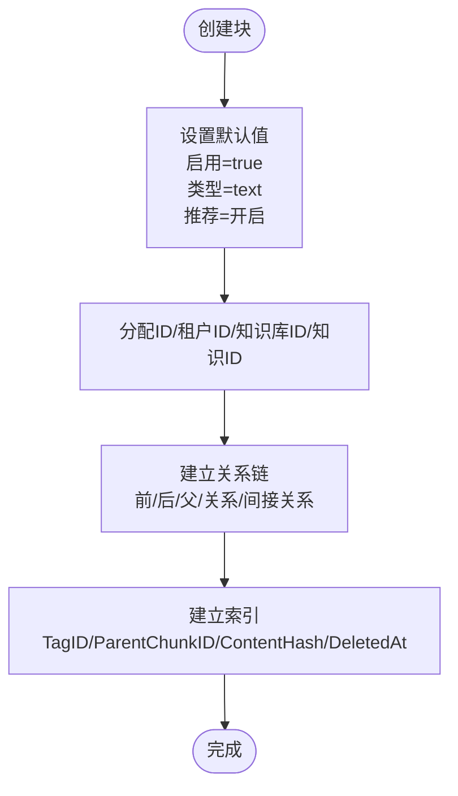

图表来源
- [internal/types/chunk.go](file://internal/types/chunk.go#L96-L155)
- [internal/types/chunk.go](file://internal/types/chunk.go#L48-L78)

章节来源
- [internal/types/chunk.go](file://internal/types/chunk.go#L11-L35)
- [internal/types/chunk.go](file://internal/types/chunk.go#L37-L46)
- [internal/types/chunk.go](file://internal/types/chunk.go#L48-L78)
- [internal/types/chunk.go](file://internal/types/chunk.go#L96-L155)

### 消息(Message)分析
- 数据结构要点
  - 角色与内容：用户/助手/系统三类角色
  - 引用与执行：知识引用集合、代理步骤(推理过程与工具调用)、提及项(@知识库/文件)
  - 完成状态：生成完成标记
  - 生命周期钩子：BeforeCreate自动生成ID并初始化空集合
- 关系映射
  - 多对一：消息属于会话
  - 多对多：消息引用多个块(通过References)
  - 多对一：消息可关联用户(通过会话)
- 生命周期
  - 创建：自动生成ID；引用/步骤/提及项为空时初始化为空数组
  - 更新：支持更新内容、角色、引用、步骤、提及项
  - 删除：软删除，DeletedAt生效
- 索引与性能
  - DeletedAt建立索引；SessionID可用于查询历史

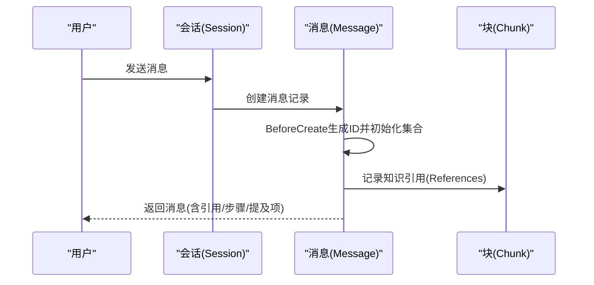

图表来源
- [internal/types/message.go](file://internal/types/message.go#L56-L87)
- [internal/types/message.go](file://internal/types/message.go#L115-L134)

章节来源
- [internal/types/message.go](file://internal/types/message.go#L56-L87)
- [internal/types/message.go](file://internal/types/message.go#L115-L134)

### 代理(AgentConfig)分析
- 数据结构要点
  - 运行参数：迭代次数、反思、工具列表、温度、知识库/知识白名单
  - 系统提示：统一模板，兼容旧版按网络搜索开关的提示
  - 网络搜索：开关、最大结果数、目标选择
  - 会话配置：会话级启用/禁用、知识库/知识ID白名单
  - MCP服务：选择模式与服务列表
  - JSON序列化：AgentConfig与SessionAgentConfig均实现Value/Scan
- 关系映射
  - 一对多：租户/会话可配置代理参数
  - 多对一：代理步骤与消息关联(存储于Message的AgentSteps)
- 生命周期
  - 创建：直接持久化JSON配置
  - 更新：支持增量更新
  - 删除：软删除(若存在软删除字段)
- 索引与性能
  - JSON字段不建索引；通过组合查询与缓存提升性能

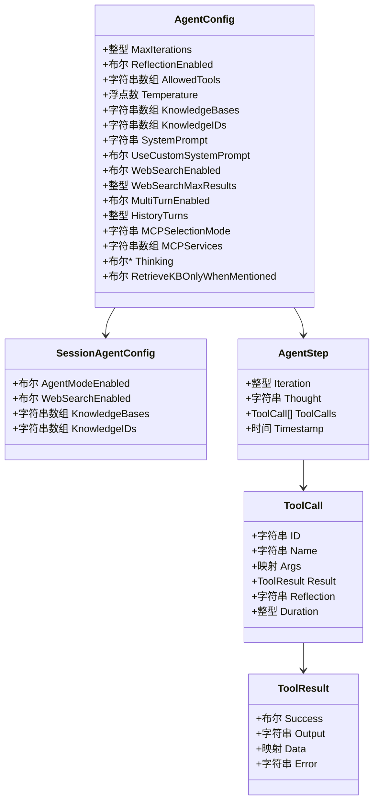

图表来源
- [internal/types/agent.go](file://internal/types/agent.go#L10-L79)
- [internal/types/agent.go](file://internal/types/agent.go#L140-L146)
- [internal/types/agent.go](file://internal/types/agent.go#L130-L138)
- [internal/types/agent.go](file://internal/types/agent.go#L122-L128)

章节来源
- [internal/types/agent.go](file://internal/types/agent.go#L10-L79)
- [internal/types/agent.go](file://internal/types/agent.go#L81-L105)

### 会话(Session)分析
- 数据结构要点
  - 标识与描述：ID、标题、描述、租户ID
  - 配置：摘要配置(SummaryConfig)、上下文压缩策略(ContextConfig)
  - 关联关系：Messages外键关联(非持久化字段)
  - 生命周期钩子：BeforeCreate自动生成ID
- 关系映射
  - 多对一：消息属于会话
  - 多对一：会话属于租户
- 生命周期
  - 创建：自动生成ID
  - 更新：支持更新标题/描述/配置
  - 删除：软删除，DeletedAt生效
- 索引与性能
  - TenantID建立索引；DeletedAt支持软删除过滤

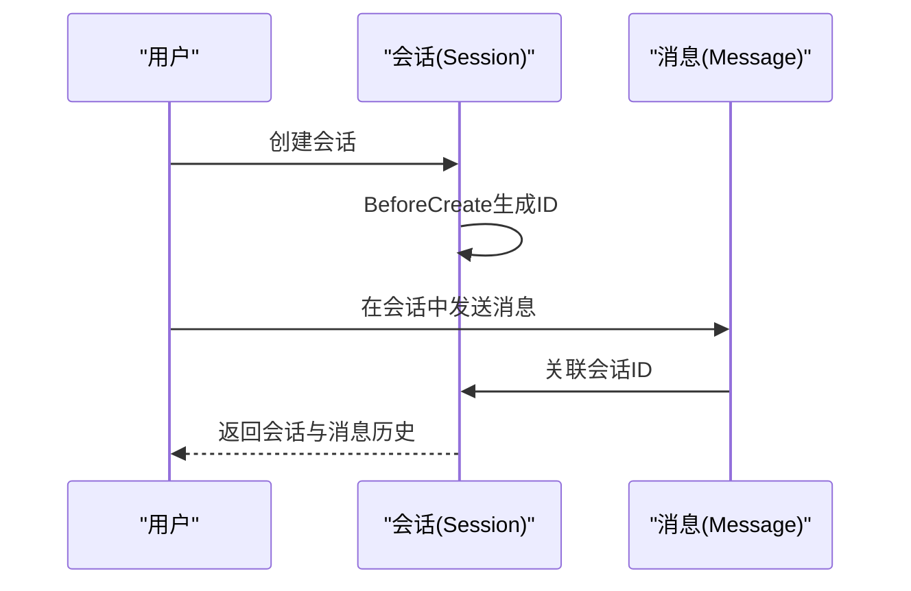

图表来源
- [internal/types/session.go](file://internal/types/session.go#L74-L108)
- [internal/types/session.go](file://internal/types/session.go#L110-L113)

章节来源
- [internal/types/session.go](file://internal/types/session.go#L74-L108)
- [internal/types/session.go](file://internal/types/session.go#L110-L113)

### 标签(KnowledgeTag)分析
- 数据结构要点
  - 标识与归属：ID、租户ID、知识库ID、序列ID(SeqID)
  - 元数据：名称(同库内唯一)、颜色、排序
  - 统计：知识与块数量统计结构
- 关系映射
  - 多对一：标签属于知识库
  - 多对多：标签与块(通过Chunk.TagID关联)
- 生命周期
  - 创建：校验名称唯一性
  - 更新：支持更新名称/颜色/排序
  - 删除：软删除或清理未使用标签
- 索引与性能
  - KnowledgeBaseID建立索引；SeqID唯一索引

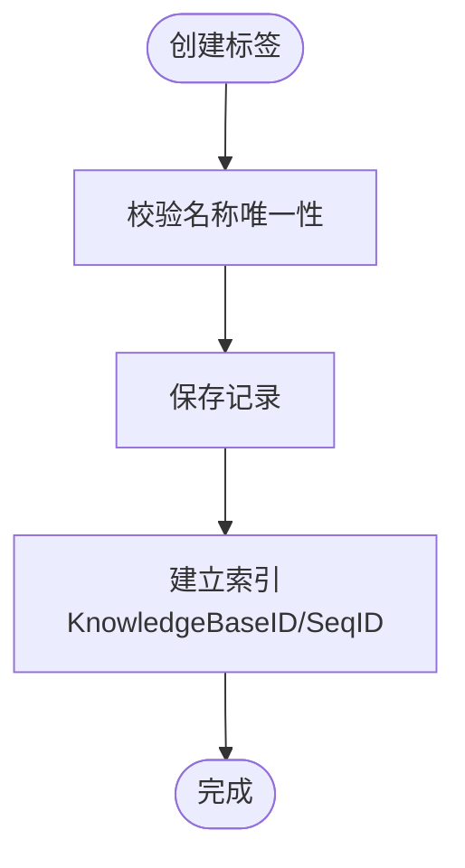

图表来源
- [internal/types/tag.go](file://internal/types/tag.go#L5-L27)

章节来源
- [internal/types/tag.go](file://internal/types/tag.go#L5-L27)

### 用户(User)分析
- 数据结构要点
  - 标识与凭证：ID、用户名(唯一)、邮箱(唯一)、密码哈希、头像
  - 租户与状态：租户ID、是否激活、跨租户访问权限
  - 关联关系：Tenant外键关联(非持久化字段)
- 关系映射
  - 多对一：用户属于租户
  - 多对一：用户可创建消息(通过会话)
- 生命周期
  - 创建：校验唯一性；默认激活
  - 更新：支持更新头像/状态/跨租户权限
  - 删除：软删除，DeletedAt生效
- 索引与性能
  - TenantID、Username、Email建立索引

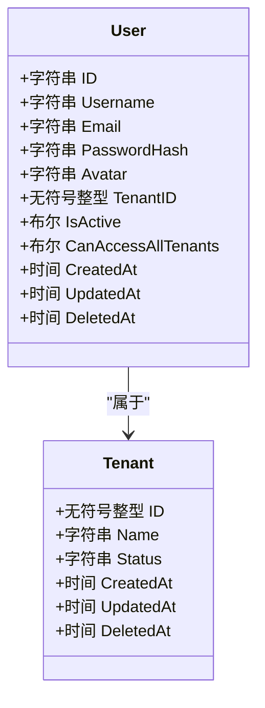

图表来源
- [internal/types/user.go](file://internal/types/user.go#L9-L36)
- [internal/types/tenant.go](file://internal/types/tenant.go#L58-L94)

章节来源
- [internal/types/user.go](file://internal/types/user.go#L9-L36)

### 租户(Tenant)分析
- 数据结构要点
  - 标识与状态：ID、名称、描述、API Key、状态(active/deprecated)
  - 资源配额：存储配额(字节，默认10GB)、已用存储
  - 检索引擎：检索引擎集合(关键词/向量/ES/Qdrant等)
  - 全局配置：上下文配置、Web搜索配置、对话配置(兼容旧版)
  - 生命周期钩子：BeforeCreate确保引擎列表非nil
- 关系映射
  - 多对一：用户/知识库/会话属于租户
- 生命周期
  - 创建：初始化引擎列表
  - 更新：支持更新配额/引擎/配置
  - 删除：软删除，DeletedAt生效
- 索引与性能
  - DeletedAt建立索引；引擎映射基于环境变量驱动

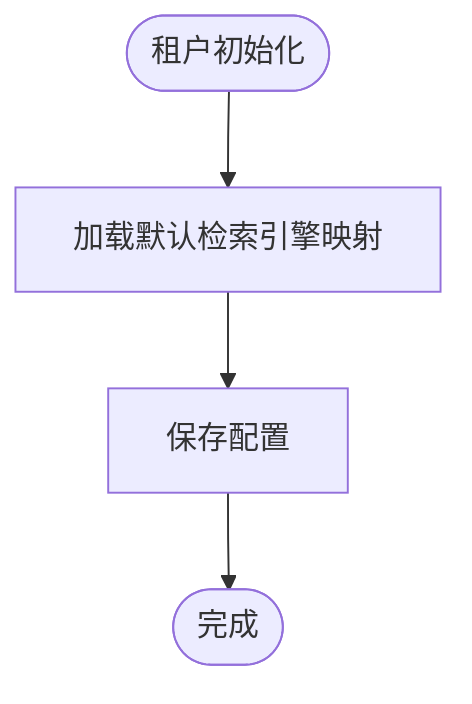

图表来源
- [internal/types/tenant.go](file://internal/types/tenant.go#L13-L56)
- [internal/types/tenant.go](file://internal/types/tenant.go#L109-L115)

章节来源
- [internal/types/tenant.go](file://internal/types/tenant.go#L58-L94)
- [internal/types/tenant.go](file://internal/types/tenant.go#L109-L115)

## 依赖分析
- 组件耦合
  - KnowledgeBase与Chunk：一对多，知识库决定块的类型与配置
  - KnowledgeBase与Tag：一对多，标签用于块分类
  - Session与Message：一对多，会话承载消息历史
  - Message与Chunk：多对多，通过References关联
  - User与Tenant：多对一，用户属于租户
  - Tenant与User/Session/KnowledgeBase：一对多
- 外部依赖
  - JSON/JSONB字段用于复杂配置与引用存储
  - GORM注解定义索引与约束
  - 迁移脚本定义表结构演进

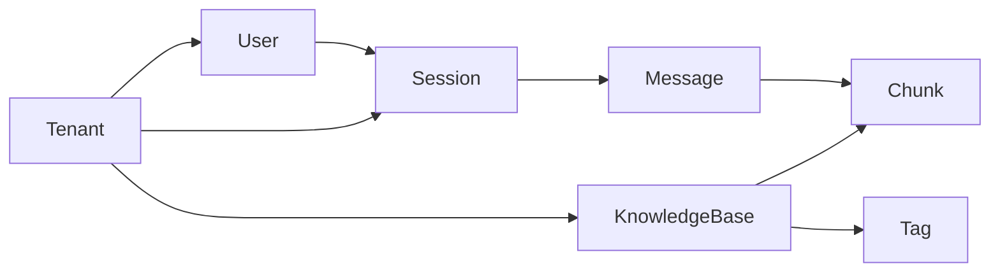

图表来源
- [internal/types/tenant.go](file://internal/types/tenant.go#L58-L94)
- [internal/types/user.go](file://internal/types/user.go#L9-L36)
- [internal/types/knowledgebase.go](file://internal/types/knowledgebase.go#L38-L84)
- [internal/types/chunk.go](file://internal/types/chunk.go#L96-L155)
- [internal/types/tag.go](file://internal/types/tag.go#L5-L27)
- [internal/types/session.go](file://internal/types/session.go#L74-L108)
- [internal/types/message.go](file://internal/types/message.go#L56-L87)

## 性能考量
- 索引设计
  - DeletedAt：软删除过滤
  - TenantID：多租户隔离查询
  - TagID/ParentChunkID/ContentHash：块级快速定位
  - SeqID：FAQ外部API使用
  - KnowledgeBaseID：快速定位知识库相关资源
- JSON字段
  - 代理配置、上下文配置、引用集合等采用JSON/JSONB存储，避免频繁Schema变更；查询时注意选择性与缓存
- 查询优化
  - 使用分页与投影减少I/O
  - 对高选择性字段建立索引，避免全表扫描
- 存储配额
  - 租户级存储配额限制整体占用，建议结合监控与告警

## 故障排查指南
- 常见问题
  - 重复创建：用户名/邮箱唯一约束冲突；标签名称唯一性冲突
  - 软删除误删：确认DeletedAt字段与查询条件
  - 多模态配置不生效：检查VLM配置与enable_multimodal兼容逻辑
  - FAQ索引异常：核对FAQConfig索引模式与问题索引模式
- 排查步骤
  - 核对迁移脚本执行状态与表结构
  - 检查索引是否存在及是否命中
  - 验证JSON字段序列化/反序列化是否正确
  - 查看BeforeCreate钩子是否触发

章节来源
- [internal/types/user.go](file://internal/types/user.go#L14-L26)
- [internal/types/tag.go](file://internal/types/tag.go#L17-L18)
- [internal/types/knowledgebase.go](file://internal/types/knowledgebase.go#L331-L347)
- [internal/types/chunk.go](file://internal/types/chunk.go#L145-L146)

## 结论
本文件系统化梳理了 WiseDx 的核心数据模型，明确了各实体的字段、约束与业务规则，并给出了关系映射、生命周期管理与性能优化建议。配合迁移脚本与GORM注解，可确保数据结构稳定演进与高效查询。

## 附录
- 数据库表结构与字段对应
  - 初始化表结构参考：[000000_init.up.sql](file://migrations/versioned/000000_init.up.sql#L1-L200)
  - 代理与自定义代理相关表：[000001_agent.up.sql](file://migrations/versioned/000001_agent.up.sql#L1-L200)、[000006_custom_agents.up.sql](file://migrations/versioned/000006_custom_agents.up.sql#L1-L200)
  - 嵌入与检索相关：[000002_embeddings.up.sql](file://migrations/versioned/000002_embeddings.up.sql#L1-L200)
  - 块标志位：[000003_chunk_flags.up.sql](file://migrations/versioned/000003_chunk_flags.up.sql#L1-L200)
  - VLM字段迁移：[000004_drop_vlm_model_id.up.sql](file://migrations/versioned/000004_drop_vlm_model_id.up.sql#L1-L200)
  - 提及项字段：[000005_mentioned_items.up.sql](file://migrations/versioned/000005_mentioned_items.up.sql#L1-L200)
  - 嵌入与标签ID：[000007_embeddings_tag_id.up.sql](file://migrations/versioned/000007_embeddings_tag_id.up.sql#L1-L200)
  - FAQ未分类迁移：[000008_migrate_untagged_faq.up.sql](file://migrations/versioned/000008_migrate_untagged_faq.up.sql#L1-L200)
  - 最近FAQ导入结果：[000009_add_last_faq_import_result.up.sql](file://migrations/versioned/000009_add_last_faq_import_result.up.sql#L1-L200)
  - 序列ID：[000010_add_seq_id.up.sql](file://migrations/versioned/000010_add_seq_id.up.sql#L1-L200)
  - PostgreSQL搜索更新：[000011_pg_search_update.up.sql](file://migrations/versioned/000011_pg_search_update.up.sql#L1-L200)
  - 知识库权限：[000012_knowledge_base_permissions.up.sql](file://migrations/versioned/000012_knowledge_base_permissions.up.sql#L1-L200)