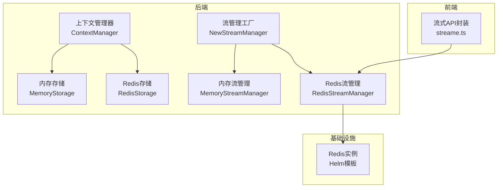
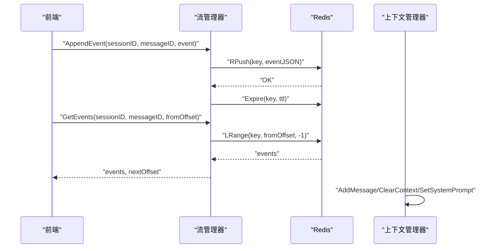
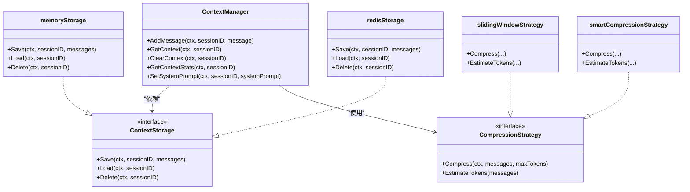
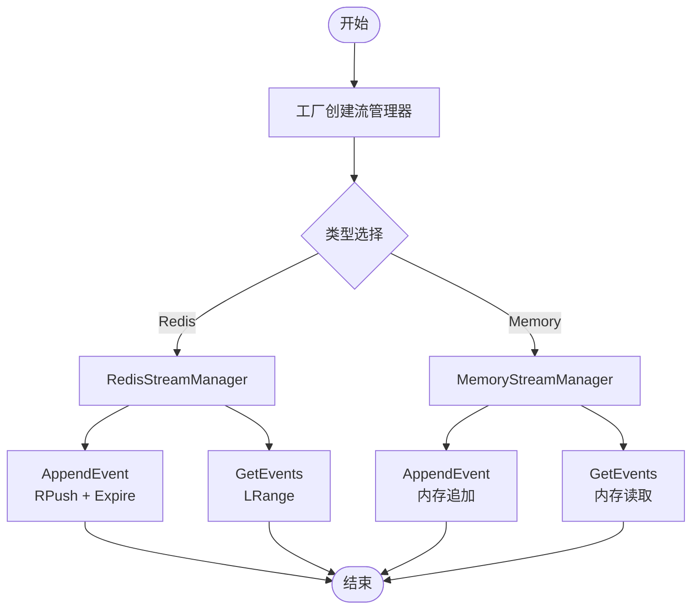
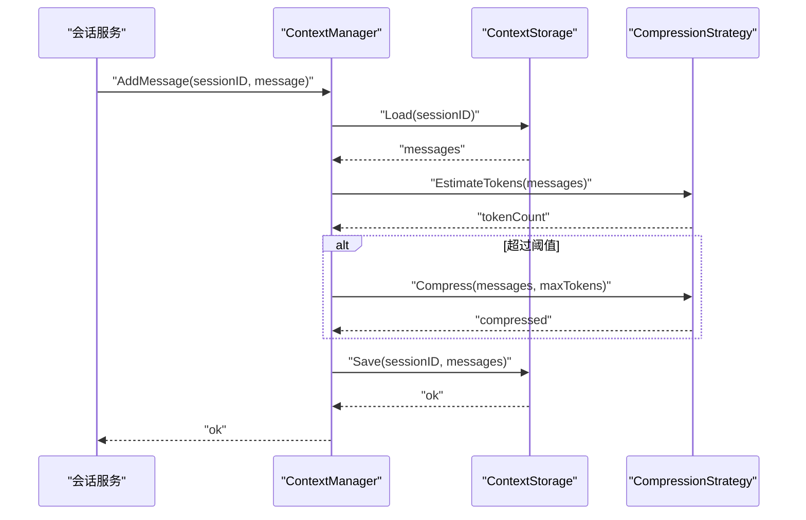
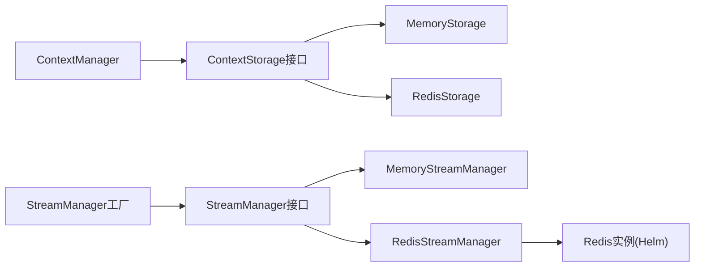

# 缓存策略与性能优化

<cite>
**本文引用的文件**
- [internal/application/service/llmcontext/context_manager.go](file://internal/application/service/llmcontext/context_manager.go)
- [internal/application/service/llmcontext/context_manager_factory.go](file://internal/application/service/llmcontext/context_manager_factory.go)
- [internal/application/service/llmcontext/compression_strategies.go](file://internal/application/service/llmcontext/compression_strategies.go)
- [internal/application/service/llmcontext/memory_storage.go](file://internal/application/service/llmcontext/memory_storage.go)
- [internal/application/service/llmcontext/redis_storage.go](file://internal/application/service/llmcontext/redis_storage.go)
- [internal/types/interfaces/context_manager.go](file://internal/types/interfaces/context_manager.go)
- [internal/stream/factory.go](file://internal/stream/factory.go)
- [internal/stream/redis_manager.go](file://internal/stream/redis_manager.go)
- [internal/stream/memory_manager.go](file://internal/stream/memory_manager.go)
- [internal/types/interfaces/stream_manager.go](file://internal/types/interfaces/stream_manager.go)
- [frontend/src/api/chat/streame.ts](file://frontend/src/api/chat/streame.ts)
- [helm/templates/redis.yaml](file://helm/templates/redis.yaml)
- [config/config.yaml](file://config/config.yaml)
- [internal/application/service/session.go](file://internal/application/service/session.go)
- [internal/event/usage_example.md](file://internal/event/usage_example.md)
- [internal/application/service/metric_hook.go](file://internal/application/service/metric_hook.go)
</cite>

## 目录
1. [简介](#简介)
2. [项目结构](#项目结构)
3. [核心组件](#核心组件)
4. [架构总览](#架构总览)
5. [详细组件分析](#详细组件分析)
6. [依赖分析](#依赖分析)
7. [性能考量](#性能考量)
8. [故障排查指南](#故障排查指南)
9. [结论](#结论)
10. [附录](#附录)

## 简介
本文件聚焦于系统中的缓存策略与性能优化，涵盖多层缓存架构（内存缓存、Redis缓存、分布式缓存）、上下文管理器的缓存机制（会话状态、消息历史、模型参数）、流式响应的缓存优化（WebSocket连接与实时数据缓存）、性能监控指标（缓存命中率、响应时间、资源利用率）、缓存失效策略与数据一致性保障，以及具体的缓存配置示例与性能调优案例。

## 项目结构
系统采用分层与接口分离的设计，缓存相关能力分布在以下模块：
- 上下文缓存：会话消息历史与系统提示词的存储与压缩
- 流式事件缓存：基于Redis列表的事件流管理
- 配置与部署：通过Helm模板提供Redis实例
- 前端流式消费：基于浏览器原生流式接口的实时渲染

**图表来源**
- [internal/application/service/llmcontext/context_manager.go](file://internal/application/service/llmcontext/context_manager.go#L1-L208)
- [internal/application/service/llmcontext/memory_storage.go](file://internal/application/service/llmcontext/memory_storage.go#L1-L51)
- [internal/application/service/llmcontext/redis_storage.go](file://internal/application/service/llmcontext/redis_storage.go#L1-L58)
- [internal/stream/factory.go](file://internal/stream/factory.go#L1-L36)
- [internal/stream/memory_manager.go](file://internal/stream/memory_manager.go#L1-L54)
- [internal/stream/redis_manager.go](file://internal/stream/redis_manager.go#L1-L95)
- [frontend/src/api/chat/streame.ts](file://frontend/src/api/chat/streame.ts#L128-L182)
- [helm/templates/redis.yaml](file://helm/templates/redis.yaml#L1-L124)

**章节来源**
- [internal/application/service/llmcontext/context_manager.go](file://internal/application/service/llmcontext/context_manager.go#L1-L208)
- [internal/stream/factory.go](file://internal/stream/factory.go#L1-L36)
- [helm/templates/redis.yaml](file://helm/templates/redis.yaml#L1-L124)

## 核心组件
- 上下文管理器（ContextManager）：负责会话消息历史的增删改查、系统提示词设置、上下文压缩与统计。
- 存储实现（ContextStorage）：内存与Redis两种实现，分离业务逻辑与持久化细节。
- 流管理器（StreamManager）：统一的事件流抽象，支持内存与Redis两种后端。
- 前端流式消费：基于浏览器流式接口的实时渲染与错误处理。

**章节来源**
- [internal/types/interfaces/context_manager.go](file://internal/types/interfaces/context_manager.go#L1-L54)
- [internal/types/interfaces/stream_manager.go](file://internal/types/interfaces/stream_manager.go#L1-L33)
- [internal/application/service/llmcontext/context_manager.go](file://internal/application/service/llmcontext/context_manager.go#L1-L208)
- [internal/application/service/llmcontext/memory_storage.go](file://internal/application/service/llmcontext/memory_storage.go#L1-L51)
- [internal/application/service/llmcontext/redis_storage.go](file://internal/application/service/llmcontext/redis_storage.go#L1-L58)
- [internal/stream/memory_manager.go](file://internal/stream/memory_manager.go#L1-L54)
- [internal/stream/redis_manager.go](file://internal/stream/redis_manager.go#L1-L95)
- [frontend/src/api/chat/streame.ts](file://frontend/src/api/chat/streame.ts#L128-L182)

## 架构总览
系统采用“业务逻辑 + 多存储后端”的分层架构：
- 上下文层：ContextManager聚合消息历史与系统提示，必要时压缩；存储层可切换至Redis以提升可扩展性。
- 流式层：StreamManager抽象事件流，工厂根据环境变量选择内存或Redis后端；Redis后端使用列表+TTL实现事件流的追加与过期控制。
- 前端层：通过streame.ts消费事件流，实现增量渲染与异常处理。

**图表来源**
- [internal/stream/redis_manager.go](file://internal/stream/redis_manager.go#L56-L95)
- [internal/types/interfaces/stream_manager.go](file://internal/types/interfaces/stream_manager.go#L20-L32)
- [frontend/src/api/chat/streame.ts](file://frontend/src/api/chat/streame.ts#L128-L182)
- [internal/application/service/llmcontext/context_manager.go](file://internal/application/service/llmcontext/context_manager.go#L45-L103)

## 详细组件分析

### 上下文管理器与缓存策略
- 业务职责：维护会话消息历史、系统提示词、上下文压缩与统计。
- 存储策略：支持内存与Redis两种后端，通过ContextStorage接口解耦。
- 压缩策略：滑动窗口与智能压缩（基于LLM摘要），在超过最大token阈值时进行压缩。
- 配置工厂：根据配置创建ContextManager，支持默认值与策略选择。

**图表来源**
- [internal/types/interfaces/context_manager.go](file://internal/types/interfaces/context_manager.go#L9-L54)
- [internal/application/service/llmcontext/context_manager.go](file://internal/application/service/llmcontext/context_manager.go#L12-L31)
- [internal/application/service/llmcontext/memory_storage.go](file://internal/application/service/llmcontext/memory_storage.go#L11-L22)
- [internal/application/service/llmcontext/redis_storage.go](file://internal/application/service/llmcontext/redis_storage.go#L14-L42)
- [internal/application/service/llmcontext/compression_strategies.go](file://internal/application/service/llmcontext/compression_strategies.go#L13-L80)

**章节来源**
- [internal/application/service/llmcontext/context_manager.go](file://internal/application/service/llmcontext/context_manager.go#L45-L173)
- [internal/application/service/llmcontext/context_manager_factory.go](file://internal/application/service/llmcontext/context_manager_factory.go#L24-L81)
- [internal/application/service/llmcontext/compression_strategies.go](file://internal/application/service/llmcontext/compression_strategies.go#L25-L182)
- [internal/application/service/llmcontext/memory_storage.go](file://internal/application/service/llmcontext/memory_storage.go#L24-L51)
- [internal/application/service/llmcontext/redis_storage.go](file://internal/application/service/llmcontext/redis_storage.go#L49-L58)

### 流式响应与缓存优化
- 工厂选择：根据环境变量选择内存或Redis流管理器。
- Redis实现：使用列表追加（RPush）与范围读取（LRange），配合TTL实现过期控制。
- 前端消费：基于浏览器流式接口，逐块解析并渲染，支持错误处理与手动停止。

**图表来源**
- [internal/stream/factory.go](file://internal/stream/factory.go#L17-L36)
- [internal/stream/redis_manager.go](file://internal/stream/redis_manager.go#L20-L95)
- [internal/stream/memory_manager.go](file://internal/stream/memory_manager.go#L18-L54)
- [internal/types/interfaces/stream_manager.go](file://internal/types/interfaces/stream_manager.go#L20-L32)

**章节来源**
- [internal/stream/factory.go](file://internal/stream/factory.go#L17-L36)
- [internal/stream/redis_manager.go](file://internal/stream/redis_manager.go#L56-L95)
- [internal/stream/memory_manager.go](file://internal/stream/memory_manager.go#L32-L54)
- [frontend/src/api/chat/streame.ts](file://frontend/src/api/chat/streame.ts#L128-L182)

### 上下文管理器工作流（序列图）

**图表来源**
- [internal/application/service/llmcontext/context_manager.go](file://internal/application/service/llmcontext/context_manager.go#L45-L103)
- [internal/application/service/llmcontext/compression_strategies.go](file://internal/application/service/llmcontext/compression_strategies.go#L67-L80)
- [internal/application/service/llmcontext/memory_storage.go](file://internal/application/service/llmcontext/memory_storage.go#L24-L36)

## 依赖分析
- 上下文管理器依赖ContextStorage接口，支持内存与Redis实现互换。
- 压缩策略与上下文管理器解耦，便于扩展新的压缩算法。
- 流管理器通过工厂模式选择内存或Redis后端，Redis后端依赖外部Redis实例。
- Helm模板提供Redis部署与探活配置，确保可用性。

**图表来源**
- [internal/types/interfaces/context_manager.go](file://internal/types/interfaces/context_manager.go#L9-L54)
- [internal/application/service/llmcontext/context_manager.go](file://internal/application/service/llmcontext/context_manager.go#L12-L31)
- [internal/stream/factory.go](file://internal/stream/factory.go#L17-L36)
- [helm/templates/redis.yaml](file://helm/templates/redis.yaml#L1-L124)

**章节来源**
- [internal/application/service/llmcontext/context_manager.go](file://internal/application/service/llmcontext/context_manager.go#L12-L31)
- [internal/stream/factory.go](file://internal/stream/factory.go#L17-L36)
- [helm/templates/redis.yaml](file://helm/templates/redis.yaml#L1-L124)

## 性能考量
- 缓存层次与选择
  - 内存缓存：适合单实例、低延迟场景；缺点是不可横向扩展。
  - Redis缓存：适合多实例、高并发场景；结合TTL实现自动过期。
  - 分布式缓存：通过Redis集群/哨兵/云托管实现高可用与弹性扩容。
- 上下文压缩
  - 滑动窗口：成本低、实时性强，适合对延迟敏感场景。
  - 智能压缩：通过LLM摘要减少token占用，适合长对话与高精度场景。
- 流式事件
  - Redis列表+TTL：O(1)追加、范围读取，适合高吞吐事件流。
  - 前端增量渲染：降低首屏等待与带宽压力。
- 监控与指标
  - 建议采集：请求QPS、P95/P99延迟、Redis命中率、内存使用率、事件积压。
  - 指标落地：Prometheus/Grafana或云监控平台。

[本节为通用性能指导，不直接分析具体文件]

## 故障排查指南
- Redis连接失败
  - 检查Helm部署的Redis实例状态与密码配置。
  - 核对环境变量（地址、密码、DB索引、前缀、TTL）。
- 事件流异常
  - 确认前端流式连接是否正常关闭与重试。
  - 检查Redis键空间与TTL是否按预期刷新。
- 上下文压缩无效
  - 确认最大token阈值与压缩策略配置。
  - 检查系统提示词插入逻辑与消息角色分布。

**章节来源**
- [helm/templates/redis.yaml](file://helm/templates/redis.yaml#L43-L85)
- [internal/stream/redis_manager.go](file://internal/stream/redis_manager.go#L20-L49)
- [frontend/src/api/chat/streame.ts](file://frontend/src/api/chat/streame.ts#L141-L152)
- [internal/application/service/llmcontext/context_manager.go](file://internal/application/service/llmcontext/context_manager.go#L170-L207)

## 结论
系统通过“接口抽象 + 多后端实现 + 工厂选择”的设计，在上下文与事件流两个关键路径实现了高性能与可扩展性。结合Redis与前端增量渲染，可在高并发场景下获得稳定的服务质量。建议在生产环境中启用Redis后端、合理设置TTL与压缩阈值，并建立完善的监控体系以持续优化性能。

[本节为总结性内容，不直接分析具体文件]

## 附录

### 缓存配置示例与调优建议
- 上下文缓存
  - 内存：适用于单实例、低延迟场景。
  - Redis：启用连接校验与默认TTL，设置合适的键前缀与会话超时。
  - 压缩策略：根据对话长度与SLA选择滑动窗口或智能压缩。
- 流式事件
  - Redis列表键命名规范：使用统一前缀与会话/消息ID组合。
  - TTL设置：结合业务生命周期与前端消费速度设定。
  - 前端：使用AbortController管理连接生命周期，捕获错误并重试。
- 分布式缓存
  - 使用Redis集群/哨兵/云托管，配置主从复制与持久化。
  - 设置合理的内存上限与淘汰策略，避免内存溢出。

**章节来源**
- [internal/application/service/llmcontext/redis_storage.go](file://internal/application/service/llmcontext/redis_storage.go#L21-L42)
- [internal/stream/redis_manager.go](file://internal/stream/redis_manager.go#L20-L49)
- [internal/stream/factory.go](file://internal/stream/factory.go#L17-L36)
- [frontend/src/api/chat/streame.ts](file://frontend/src/api/chat/streame.ts#L128-L182)
- [helm/templates/redis.yaml](file://helm/templates/redis.yaml#L43-L85)

### 性能监控指标清单
- 缓存命中率：上下文/事件流命中情况（需结合埋点统计）。
- 响应时间：P95/P99延迟，区分上游查询与下游LLM调用。
- 资源利用率：CPU、内存、Redis内存与连接数。
- 事件积压：流式事件队列长度与消费速率。
- 错误率：Redis连接失败、压缩失败、前端连接异常。

**章节来源**
- [internal/event/usage_example.md](file://internal/event/usage_example.md#L413-L419)
- [internal/application/service/metric_hook.go](file://internal/application/service/metric_hook.go#L1-L116)

### 缓存失效策略与数据一致性
- 失效策略
  - TTL过期：Redis键设置合理TTL，避免无限增长。
  - 主动清理：会话结束或上下文清空时删除键。
  - 前端偏移管理：消费完成后及时更新offset，避免重复拉取。
- 一致性保障
  - 事件顺序：Redis列表天然保证追加顺序，消费端按offset顺序读取。
  - 上下文一致性：压缩前后token估算与消息角色分布需一致。
  - 幂等性：事件消费端对重复事件进行幂等处理。

**章节来源**
- [internal/stream/redis_manager.go](file://internal/stream/redis_manager.go#L56-L95)
- [internal/application/service/llmcontext/context_manager.go](file://internal/application/service/llmcontext/context_manager.go#L105-L130)

### 热点数据处理与缓存穿透防护
- 热点数据
  - 识别高频会话与消息ID，适当提升Redis实例规格或引入二级缓存。
  - 对热点键设置更短TTL并配合预热策略。
- 缓存穿透
  - 对空结果设置短TTL并记录访问日志，防止恶意刷取。
  - 前端对异常响应进行兜底提示，避免重复请求。

[本节为通用指导，不直接分析具体文件]