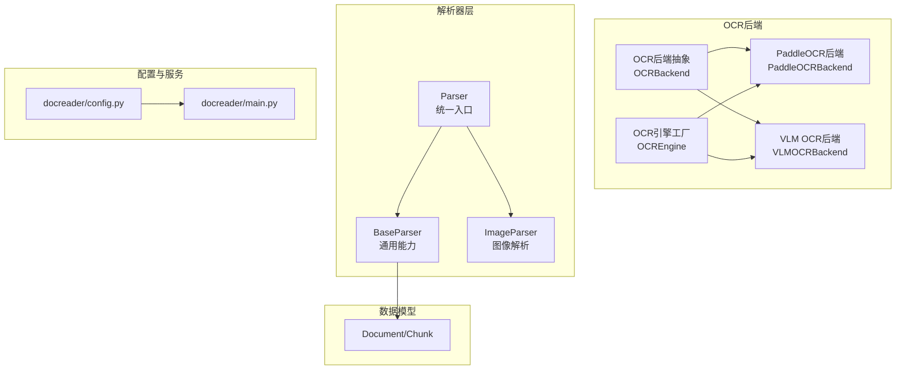
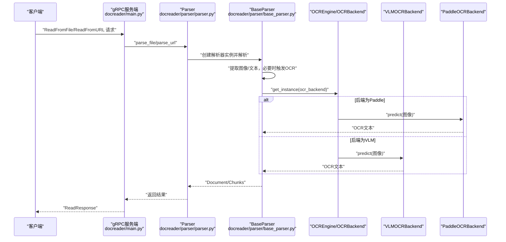
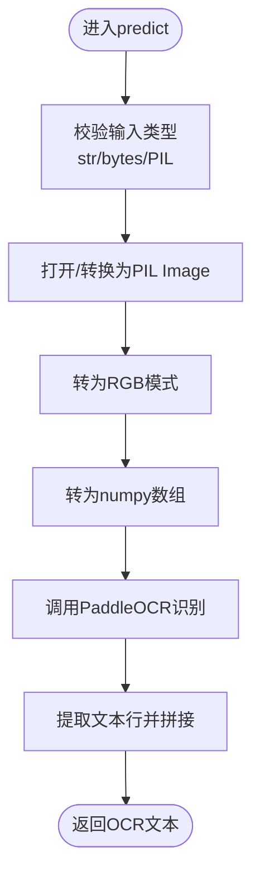
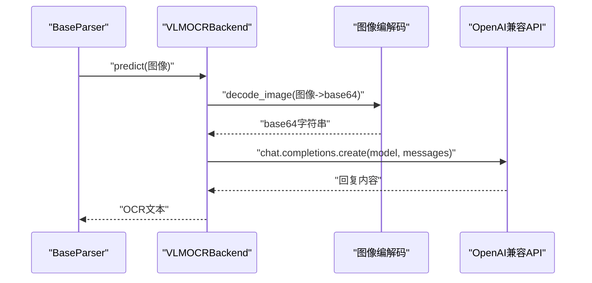
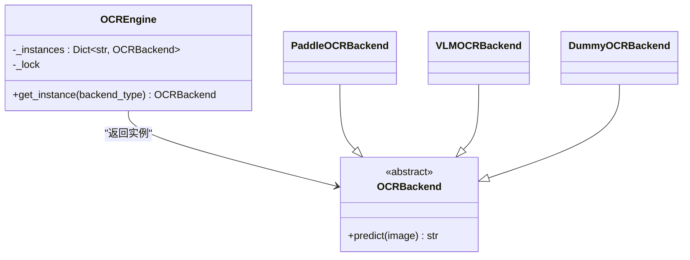
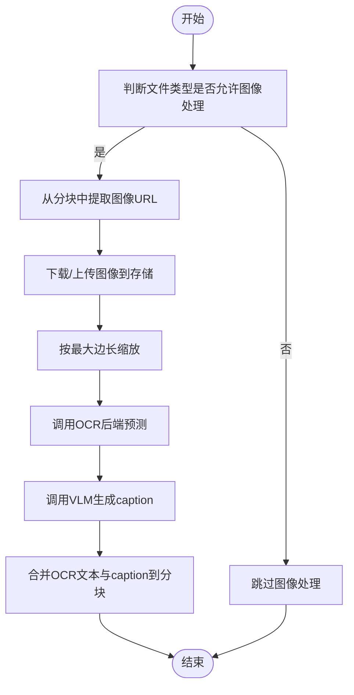
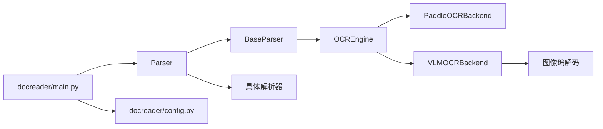

# OCR图像识别

<cite>
**本文引用的文件**
- [docreader/ocr/base.py](file://docreader/ocr/base.py)
- [docreader/ocr/paddle.py](file://docreader/ocr/paddle.py)
- [docreader/ocr/vlm.py](file://docreader/ocr/vlm.py)
- [docreader/ocr/__init__.py](file://docreader/ocr/__init__.py)
- [docreader/parser/base_parser.py](file://docreader/parser/base_parser.py)
- [docreader/parser/parser.py](file://docreader/parser/parser.py)
- [docreader/parser/image_parser.py](file://docreader/parser/image_parser.py)
- [docreader/models/document.py](file://docreader/models/document.py)
- [docreader/models/read_config.py](file://docreader/models/read_config.py)
- [docreader/main.py](file://docreader/main.py)
- [docreader/config.py](file://docreader/config.py)
- [docreader/utils/endecode.py](file://docreader/utils/endecode.py)
- [config/config.yaml](file://config/config.yaml)
</cite>

## 目录
1. [简介](#简介)
2. [项目结构](#项目结构)
3. [核心组件](#核心组件)
4. [架构总览](#架构总览)
5. [详细组件分析](#详细组件分析)
6. [依赖关系分析](#依赖关系分析)
7. [性能考量](#性能考量)
8. [故障排除指南](#故障排除指南)
9. [结论](#结论)
10. [附录](#附录)

## 简介
本技术文档面向OCR图像识别系统，聚焦于PaddleOCR集成与VLM（视觉语言模型）应用，涵盖模型加载、图像预处理、文本检测与识别、多模态输入处理、图像描述生成、跨模态理解、结果后处理、性能优化与故障排除。系统采用模块化设计，支持gRPC服务端，统一解析多种文档类型（含图像），并在多模态场景下对图像进行OCR与描述生成。

## 项目结构
- OCR后端抽象与实现：定义OCR后端接口，提供PaddleOCR与VLM两种实现；通过工厂类统一实例化与缓存。
- 解析器层：统一入口Parser负责路由到具体解析器；BaseParser封装通用能力（OCR、图像处理、分块、并发控制、URL安全校验等）。
- 数据模型：Document/Chunk定义文档与分块结构，便于序列化与传输。
- 配置与服务：docreader/config.py提供运行时配置加载；docreader/main.py提供gRPC服务端与响应转换。
- 工具模块：图像编解码（base64）、文本编码解码等辅助能力。

图表来源
- [docreader/ocr/base.py](file://docreader/ocr/base.py#L10-L31)
- [docreader/ocr/paddle.py](file://docreader/ocr/paddle.py#L16-L93)
- [docreader/ocr/vlm.py](file://docreader/ocr/vlm.py#L14-L87)
- [docreader/ocr/__init__.py](file://docreader/ocr/__init__.py#L12-L37)
- [docreader/parser/parser.py](file://docreader/parser/parser.py#L21-L55)
- [docreader/parser/base_parser.py](file://docreader/parser/base_parser.py#L29-L184)
- [docreader/parser/image_parser.py](file://docreader/parser/image_parser.py#L12-L48)
- [docreader/models/document.py](file://docreader/models/document.py#L9-L87)
- [docreader/config.py](file://docreader/config.py#L99-L217)
- [docreader/main.py](file://docreader/main.py#L276-L314)

章节来源
- [docreader/ocr/base.py](file://docreader/ocr/base.py#L10-L31)
- [docreader/ocr/paddle.py](file://docreader/ocr/paddle.py#L16-L93)
- [docreader/ocr/vlm.py](file://docreader/ocr/vlm.py#L14-L87)
- [docreader/ocr/__init__.py](file://docreader/ocr/__init__.py#L12-L37)
- [docreader/parser/parser.py](file://docreader/parser/parser.py#L21-L55)
- [docreader/parser/base_parser.py](file://docreader/parser/base_parser.py#L29-L184)
- [docreader/parser/image_parser.py](file://docreader/parser/image_parser.py#L12-L48)
- [docreader/models/document.py](file://docreader/models/document.py#L9-L87)
- [docreader/config.py](file://docreader/config.py#L99-L217)
- [docreader/main.py](file://docreader/main.py#L276-L314)

## 核心组件
- OCR后端抽象与实现
  - OCRBackend：定义predict接口，约束所有OCR后端行为。
  - PaddleOCRBackend：封装PaddleOCR初始化、CPU/GPU设备选择、AVX兼容性检测、模型参数配置、预测流程与错误处理。
  - VLMOCRBackend：基于OpenAI兼容客户端调用VLM模型，支持提示词工程与图像base64传输。
  - OCREngine：线程安全的OCR后端工厂，按后端类型缓存实例，避免重复初始化。
- 解析器与图像处理
  - BaseParser：统一实现OCR执行、图像尺寸限制、并发控制、URL安全校验、分块策略、图像下载上传、caption生成桥接。
  - Parser：路由不同文件类型到对应解析器，构建ChunkingConfig并传入解析器。
  - ImageParser：图像文件直传存储与Markdown占位生成。
- 数据模型
  - Document/Chunk：文档与分块结构，支持序列化与protobuf映射。
- 配置与服务
  - docreader/config.py：集中加载环境变量配置，含gRPC、图像并发、OCR/VLM、存储等。
  - docreader/main.py：gRPC服务端，请求ID追踪、UTF-8清洗、响应转换、健康检查。

章节来源
- [docreader/ocr/base.py](file://docreader/ocr/base.py#L10-L31)
- [docreader/ocr/paddle.py](file://docreader/ocr/paddle.py#L16-L175)
- [docreader/ocr/vlm.py](file://docreader/ocr/vlm.py#L14-L87)
- [docreader/ocr/__init__.py](file://docreader/ocr/__init__.py#L12-L37)
- [docreader/parser/base_parser.py](file://docreader/parser/base_parser.py#L95-L120)
- [docreader/parser/parser.py](file://docreader/parser/parser.py#L21-L179)
- [docreader/parser/image_parser.py](file://docreader/parser/image_parser.py#L12-L48)
- [docreader/models/document.py](file://docreader/models/document.py#L9-L87)
- [docreader/config.py](file://docreader/config.py#L99-L217)
- [docreader/main.py](file://docreader/main.py#L130-L314)

## 架构总览
系统采用“服务端gRPC + 多解析器 + OCR后端工厂”的分层架构。解析器根据文件类型选择具体实现，统一走BaseParser的OCR与图像处理流程；OCR后端通过工厂按需创建并缓存实例；VLM与PaddleOCR分别满足云端大模型与本地轻量部署需求。

图表来源
- [docreader/main.py](file://docreader/main.py#L130-L240)
- [docreader/parser/parser.py](file://docreader/parser/parser.py#L74-L178)
- [docreader/parser/base_parser.py](file://docreader/parser/base_parser.py#L95-L120)
- [docreader/ocr/__init__.py](file://docreader/ocr/__init__.py#L18-L37)
- [docreader/ocr/paddle.py](file://docreader/ocr/paddle.py#L118-L175)
- [docreader/ocr/vlm.py](file://docreader/ocr/vlm.py#L41-L87)

## 详细组件分析

### OCR后端：PaddleOCR集成
- 初始化与设备选择
  - 强制使用CPU并禁用GPU，通过环境变量与设备设置确保稳定性。
  - Linux平台检测AVX指令集，不支持时切换兼容模式并限制指令集使用。
  - 加载PaddleOCR并配置检测/识别模型、阈值、方向分类、膨胀等参数。
- 图像预处理
  - 统一转为RGB模式，转换为numpy数组供PaddleOCR处理。
- 文本提取
  - 调用OCR接口，遍历结果行，提取文本并拼接，做空白裁剪。
- 错误处理
  - 导入失败、OS异常（非法指令/崩溃）、通用异常均记录日志并返回空文本。

图表来源
- [docreader/ocr/paddle.py](file://docreader/ocr/paddle.py#L118-L175)

章节来源
- [docreader/ocr/paddle.py](file://docreader/ocr/paddle.py#L16-L175)

### OCR后端：VLM（视觉语言模型）
- 初始化
  - 从配置读取模型名、API基址、密钥，构造OpenAI兼容客户端。
  - 设置温度与最大token，定义中文OCR提示词（忽略页眉页脚、表格HTML、公式LaTeX、按阅读顺序组织）。
- 预处理
  - 使用图像编解码工具将输入图像编码为base64，避免二进制传输问题。
- 推理
  - 以OpenAI兼容格式发送消息，包含图像URL与提示词，返回模型回复。
- 错误处理
  - 客户端未初始化、异常均记录日志并返回空文本。

图表来源
- [docreader/ocr/vlm.py](file://docreader/ocr/vlm.py#L41-L87)
- [docreader/utils/endecode.py](file://docreader/utils/endecode.py#L23-L75)

章节来源
- [docreader/ocr/vlm.py](file://docreader/ocr/vlm.py#L14-L87)
- [docreader/utils/endecode.py](file://docreader/utils/endecode.py#L23-L75)

### OCR引擎工厂：实例化与缓存
- 线程安全的单例缓存，按后端类型创建并复用实例，避免重复初始化开销。
- 支持paddle、vlm与默认dummy后端。

图表来源
- [docreader/ocr/__init__.py](file://docreader/ocr/__init__.py#L12-L37)
- [docreader/ocr/base.py](file://docreader/ocr/base.py#L10-L31)

章节来源
- [docreader/ocr/__init__.py](file://docreader/ocr/__init__.py#L12-L37)
- [docreader/ocr/base.py](file://docreader/ocr/base.py#L10-L31)

### 解析器与图像处理：并发、限流与安全
- 并发与限流
  - 使用asyncio与信号量控制并发，避免大量图像同时处理导致内存与CPU压力。
  - 超时控制（30秒）防止阻塞，异常捕获后返回空结果以保证整体流程。
- 图像处理
  - 尺寸限制：超过最大边长时按比例缩放，避免超大图像拖慢OCR。
  - 下载与上传：支持远程URL、存储URL与本地路径，统一上传至对象存储并返回可访问URL。
  - URL安全校验：限制协议与主机范围，防止SSRF攻击。
- 分块策略
  - 保护表格、代码块、公式块、行内图片/链接等结构完整性，再按分隔符切分，保留重叠以维持语义连贯。
- 多模态
  - 在PDF、Markdown、Word等文档中抽取图像，调用OCR与caption生成，将结果注入到分块中。

图表来源
- [docreader/parser/base_parser.py](file://docreader/parser/base_parser.py#L421-L456)
- [docreader/parser/base_parser.py](file://docreader/parser/base_parser.py#L246-L356)
- [docreader/parser/base_parser.py](file://docreader/parser/base_parser.py#L721-L800)

章节来源
- [docreader/parser/base_parser.py](file://docreader/parser/base_parser.py#L95-L120)
- [docreader/parser/base_parser.py](file://docreader/parser/base_parser.py#L224-L244)
- [docreader/parser/base_parser.py](file://docreader/parser/base_parser.py#L246-L356)
- [docreader/parser/base_parser.py](file://docreader/parser/base_parser.py#L358-L384)
- [docreader/parser/base_parser.py](file://docreader/parser/base_parser.py#L421-L456)
- [docreader/parser/base_parser.py](file://docreader/parser/base_parser.py#L721-L800)

### 数据模型与响应转换
- Document/Chunk
  - 内容、位置、图像列表、元数据等字段，支持序列化与JSON转换。
- gRPC响应
  - 将内部Chunk转换为protobuf消息，确保字符串UTF-8有效性，避免代理/编码问题。
  - 支持在Chunk中附加图像信息（URL、caption、OCR文本、原始URL、位置）。

章节来源
- [docreader/models/document.py](file://docreader/models/document.py#L9-L87)
- [docreader/main.py](file://docreader/main.py#L242-L273)

### 配置与服务端
- 配置项
  - gRPC工作线程、最大消息大小、端口；图像最大并发；代理；OCR后端与模型；VLM模型与接口类型；存储类型与凭证；MinIO/COS参数等。
- 服务端
  - 启动gRPC服务，注册健康检查；设置线程池与消息大小；统一异常捕获与错误码返回；请求ID追踪与日志。

章节来源
- [docreader/config.py](file://docreader/config.py#L99-L217)
- [docreader/main.py](file://docreader/main.py#L276-L314)

## 依赖关系分析
- 组件耦合
  - Parser依赖各具体解析器；BaseParser依赖OCREngine与存储；VLM依赖图像编解码工具；main.py依赖Parser与配置。
- 外部依赖
  - PaddleOCR、OpenAI兼容API、PIL、numpy、requests、grpc等。
- 潜在循环依赖
  - 通过模块导入与延迟初始化避免循环；工厂类与抽象接口降低耦合。

图表来源
- [docreader/parser/parser.py](file://docreader/parser/parser.py#L21-L55)
- [docreader/parser/base_parser.py](file://docreader/parser/base_parser.py#L95-L120)
- [docreader/ocr/__init__.py](file://docreader/ocr/__init__.py#L18-L37)
- [docreader/ocr/paddle.py](file://docreader/ocr/paddle.py#L16-L93)
- [docreader/ocr/vlm.py](file://docreader/ocr/vlm.py#L14-L87)
- [docreader/utils/endecode.py](file://docreader/utils/endecode.py#L23-L75)
- [docreader/main.py](file://docreader/main.py#L276-L314)
- [docreader/config.py](file://docreader/config.py#L99-L217)

章节来源
- [docreader/parser/parser.py](file://docreader/parser/parser.py#L21-L55)
- [docreader/parser/base_parser.py](file://docreader/parser/base_parser.py#L95-L120)
- [docreader/ocr/__init__.py](file://docreader/ocr/__init__.py#L18-L37)
- [docreader/ocr/paddle.py](file://docreader/ocr/paddle.py#L16-L93)
- [docreader/ocr/vlm.py](file://docreader/ocr/vlm.py#L14-L87)
- [docreader/utils/endecode.py](file://docreader/utils/endecode.py#L23-L75)
- [docreader/main.py](file://docreader/main.py#L276-L314)
- [docreader/config.py](file://docreader/config.py#L99-L217)

## 性能考量
- 批量与并发
  - 通过信号量限制并发图像处理任务，避免资源争抢；对超时任务进行降级处理，保证整体吞吐。
- 图像预处理
  - 最大边长限制与等比缩放减少计算量；仅在必要时进行格式转换。
- 模型选择
  - PaddleOCR适合本地部署与CPU环境；VLM适合高质量描述与多模态理解，但需注意网络与成本。
- 内存管理
  - 异步处理完成后及时释放图像对象；并发结束后清理引用并触发GC。
- gRPC与序列化
  - 控制最大消息大小与线程池规模；对字符串进行UTF-8清洗，避免传输异常。

章节来源
- [docreader/parser/base_parser.py](file://docreader/parser/base_parser.py#L302-L356)
- [docreader/parser/base_parser.py](file://docreader/parser/base_parser.py#L224-L244)
- [docreader/config.py](file://docreader/config.py#L107-L113)
- [docreader/main.py](file://docreader/main.py#L280-L287)

## 故障排除指南
- PaddleOCR初始化失败
  - 现象：导入失败、OS错误（非法指令/崩溃）。
  - 处理：确认CPU指令集支持；在Linux上检测AVX；必要时安装CPU-only版本或切换后端。
- VLM调用异常
  - 现象：客户端未初始化、网络超时、API错误。
  - 处理：检查API密钥、基址与网络代理；确认提示词与图像编码正确。
- 图像处理超时/失败
  - 现象：OCR任务超时、并发异常、图像下载失败。
  - 处理：调整并发上限与超时时间；检查URL安全校验与代理配置；确保图像可访问。
- gRPC响应异常
  - 现象：内部错误、错误码返回、UTF-8异常。
  - 处理：查看日志与请求ID；确认Chunk转换与字符串清洗逻辑。

章节来源
- [docreader/ocr/paddle.py](file://docreader/ocr/paddle.py#L95-L116)
- [docreader/ocr/vlm.py](file://docreader/ocr/vlm.py#L50-L87)
- [docreader/parser/base_parser.py](file://docreader/parser/base_parser.py#L266-L297)
- [docreader/main.py](file://docreader/main.py#L185-L191)

## 结论
本系统通过抽象化的OCR后端、统一的解析器与并发控制、完善的配置与服务端，实现了稳定高效的OCR图像识别与多模态处理能力。PaddleOCR与VLM双后端适配不同部署与质量需求；BaseParser提供一致的图像处理与分块策略；gRPC服务端保障可扩展性与可观测性。结合性能优化与故障排除策略，可在生产环境中可靠运行。

## 附录
- 配置项一览（节选）
  - gRPC：最大工作线程、最大文件大小、端口
  - 图像：最大并发
  - 代理：HTTP/HTTPS代理
  - OCR：后端类型、API基址、密钥、模型名
  - VLM：模型基址、模型名、密钥、接口类型
  - 存储：类型、COS/MinIO参数、本地目录
- YAML配置（节选）
  - 知识库分块参数、图像处理开关、多模态配置等。

章节来源
- [docreader/config.py](file://docreader/config.py#L107-L217)
- [config/config.yaml](file://config/config.yaml#L507-L513)