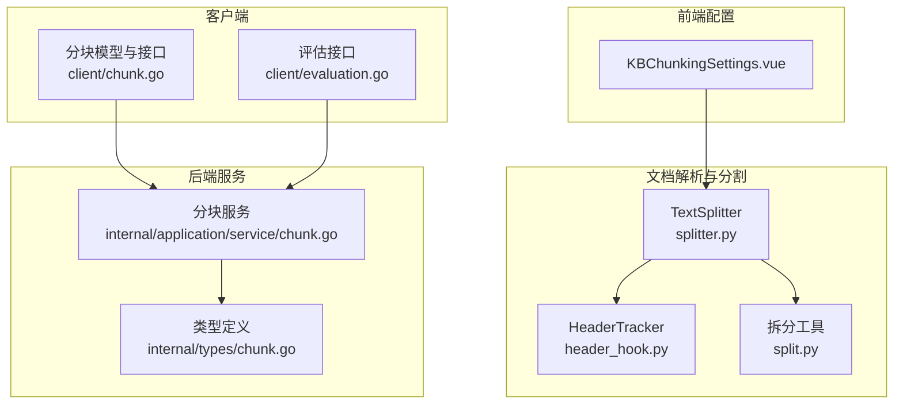
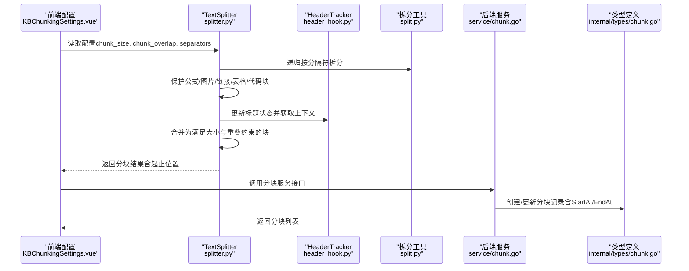
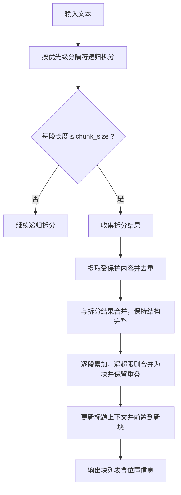
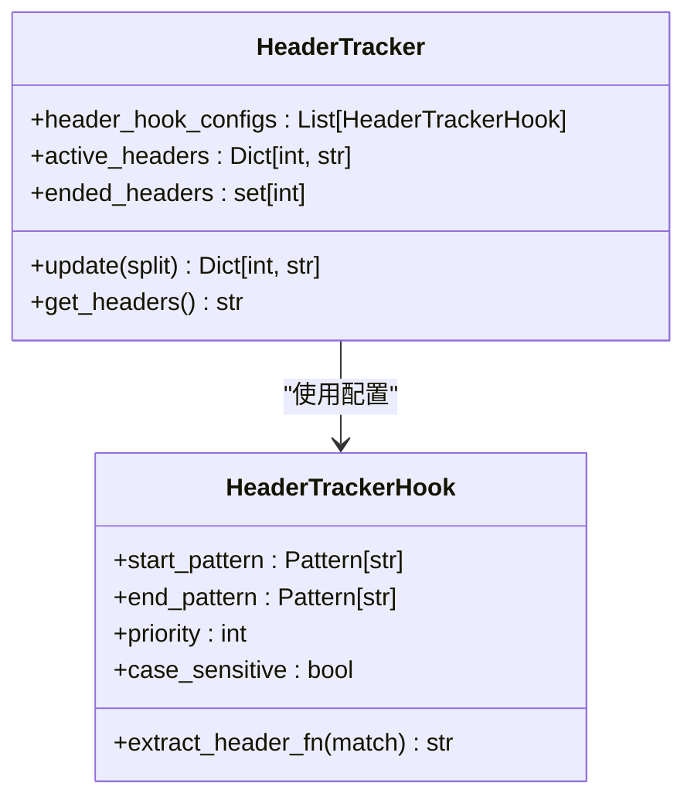
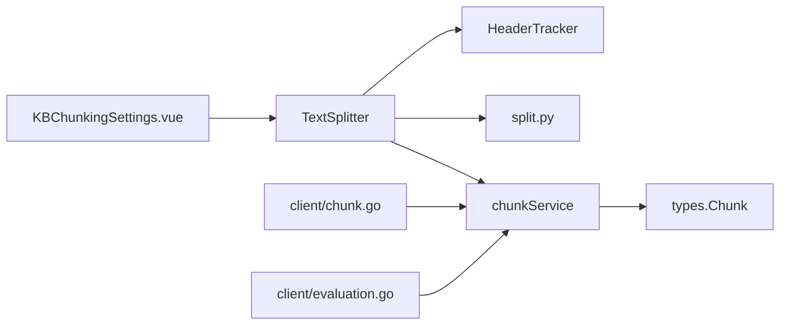

# 文本分割

<cite>
**本文引用的文件**
- [docreader/splitter/splitter.py](file://docreader/splitter/splitter.py)
- [docreader/splitter/header_hook.py](file://docreader/splitter/header_hook.py)
- [docreader/utils/split.py](file://docreader/utils/split.py)
- [frontend/src/views/knowledge/settings/KBChunkingSettings.vue](file://frontend/src/views/knowledge/settings/KBChunkingSettings.vue)
- [client/chunk.go](file://client/chunk.go)
- [internal/types/chunk.go](file://internal/types/chunk.go)
- [internal/application/service/chunk.go](file://internal/application/service/chunk.go)
- [client/evaluation.go](file://client/evaluation.go)
- [docreader/testdata/test.md](file://docreader/testdata/test.md)
</cite>

## 目录
1. [简介](#简介)
2. [项目结构](#项目结构)
3. [核心组件](#核心组件)
4. [架构总览](#架构总览)
5. [详细组件分析](#详细组件分析)
6. [依赖分析](#依赖分析)
7. [性能考虑](#性能考虑)
8. [故障排查指南](#故障排查指南)
9. [结论](#结论)
10. [附录](#附录)

## 简介
本技术文档围绕文本分割系统展开，重点解释基于 Python 的语义分割实现，涵盖句子边界检测、段落识别与标题层级处理。文档详细阐述分割策略设计原理（固定长度分割、语义边界分割与混合策略），说明 header_hook 机制如何实现标题层级识别、内容结构保持与层次化分割策略，并给出分割参数配置项（chunk_size、chunk_overlap、separators）的影响与调优方法。最后提供分割质量评估指标与优化建议，包括重叠率计算、语义连贯性检查与内容完整性验证。

## 项目结构
文本分割能力主要位于 docreader/splitter 目录，配合工具模块 docreader/utils 与前端配置界面 frontend/src/views/knowledge/settings/KBChunkingSettings.vue。后端服务通过 internal/application/service/chunk.go 与 internal/types/chunk.go 对分块进行持久化与检索支持；客户端 client/chunk.go 提供分块查询与更新接口；client/evaluation.go 支持评估任务的启动与结果查询。

图表来源
- [docreader/splitter/splitter.py](file://docreader/splitter/splitter.py#L31-L144)
- [docreader/splitter/header_hook.py](file://docreader/splitter/header_hook.py#L67-L113)
- [docreader/utils/split.py](file://docreader/utils/split.py#L5-L81)
- [frontend/src/views/knowledge/settings/KBChunkingSettings.vue](file://frontend/src/views/knowledge/settings/KBChunkingSettings.vue#L1-L232)
- [internal/types/chunk.go](file://internal/types/chunk.go#L96-L155)
- [internal/application/service/chunk.go](file://internal/application/service/chunk.go#L16-L45)
- [client/chunk.go](file://client/chunk.go#L14-L70)
- [client/evaluation.go](file://client/evaluation.go#L13-L66)

章节来源
- [docreader/splitter/splitter.py](file://docreader/splitter/splitter.py#L1-L585)
- [docreader/splitter/header_hook.py](file://docreader/splitter/header_hook.py#L1-L113)
- [docreader/utils/split.py](file://docreader/utils/split.py#L1-L81)
- [frontend/src/views/knowledge/settings/KBChunkingSettings.vue](file://frontend/src/views/knowledge/settings/KBChunkingSettings.vue#L1-L232)
- [internal/types/chunk.go](file://internal/types/chunk.go#L1-L155)
- [internal/application/service/chunk.go](file://internal/application/service/chunk.go#L1-L441)
- [client/chunk.go](file://client/chunk.go#L1-L179)
- [client/evaluation.go](file://client/evaluation.go#L1-L114)

## 核心组件
- TextSplitter：负责将输入文本按优先级分隔符递归切分，保护公式、图片、链接、表格与代码块等结构，再合并为满足 chunk_size 与 chunk_overlap 的最终块，并在合并过程中利用 header_hook 维护标题上下文。
- HeaderTracker：维护活动标题状态，识别表格等结构的开始/结束，生成可前置到每个块的上下文标题文本。
- 拆分工具 split.py：提供按分隔符、字符与正则表达式的拆分函数，以及匹配函数，支撑 TextSplitter 的多级拆分策略。
- 前端 KBChunkingSettings.vue：提供 chunk_size、chunk_overlap、separators 的可视化配置与滑块选择。
- 后端类型与服务：internal/types/chunk.go 定义分块数据结构；internal/application/service/chunk.go 提供分块的增删改查与分页检索；client/chunk.go 提供对外 API 的分块模型与请求响应结构；client/evaluation.go 提供评估任务的启动与结果查询。

章节来源
- [docreader/splitter/splitter.py](file://docreader/splitter/splitter.py#L31-L144)
- [docreader/splitter/header_hook.py](file://docreader/splitter/header_hook.py#L67-L113)
- [docreader/utils/split.py](file://docreader/utils/split.py#L5-L81)
- [frontend/src/views/knowledge/settings/KBChunkingSettings.vue](file://frontend/src/views/knowledge/settings/KBChunkingSettings.vue#L80-L142)
- [internal/types/chunk.go](file://internal/types/chunk.go#L96-L155)
- [internal/application/service/chunk.go](file://internal/application/service/chunk.go#L57-L130)
- [client/chunk.go](file://client/chunk.go#L14-L70)
- [client/evaluation.go](file://client/evaluation.go#L66-L114)

## 架构总览
下图展示从输入文本到最终分块的端到端流程，包括语义边界检测、结构保护、标题上下文注入与重叠合并。

图表来源
- [frontend/src/views/knowledge/settings/KBChunkingSettings.vue](file://frontend/src/views/knowledge/settings/KBChunkingSettings.vue#L1-L232)
- [docreader/splitter/splitter.py](file://docreader/splitter/splitter.py#L116-L144)
- [docreader/splitter/header_hook.py](file://docreader/splitter/header_hook.py#L74-L113)
- [docreader/utils/split.py](file://docreader/utils/split.py#L27-L66)
- [internal/application/service/chunk.go](file://internal/application/service/chunk.go#L57-L130)
- [internal/types/chunk.go](file://internal/types/chunk.go#L116-L129)

## 详细组件分析

### TextSplitter：语义分割与结构保护
- 分割流程
  - 递归按优先级分隔符拆分，若某次拆分未产生多段，则尝试下一个分隔符，直至找到合适的切分方式。
  - 对过大的子段继续递归拆分，直到每段长度不超过 chunk_size。
  - 提取受保护内容（公式、图片、链接、表格、代码块），将其与拆分结果合并，保证结构完整性。
  - 在合并阶段，根据 chunk_size 与 chunk_overlap 动态拼接块，并在必要时从块首弹出元素以维持重叠。
  - 利用 header_hook 获取当前活跃标题上下文，若标题长度合理则前置到新块，增强检索时的上下文连贯性。
- 重要特性
  - 保护正则覆盖数学公式、图片、链接、表格与代码块，避免破坏结构。
  - 位置信息保留（StartAt/EndAt），便于恢复原文与定位。
  - 可选长度函数（默认字符数），支持自定义 token 计数逻辑。
  - 提供 restore_text 以去除重叠并重建原文，用于一致性校验。

图表来源
- [docreader/splitter/splitter.py](file://docreader/splitter/splitter.py#L146-L297)
- [docreader/splitter/splitter.py](file://docreader/splitter/splitter.py#L299-L407)
- [docreader/splitter/splitter.py](file://docreader/splitter/splitter.py#L517-L556)

章节来源
- [docreader/splitter/splitter.py](file://docreader/splitter/splitter.py#L65-L144)
- [docreader/splitter/splitter.py](file://docreader/splitter/splitter.py#L146-L297)
- [docreader/splitter/splitter.py](file://docreader/splitter/splitter.py#L299-L407)
- [docreader/splitter/splitter.py](file://docreader/splitter/splitter.py#L517-L556)

### HeaderTracker：标题层级识别与上下文注入
- 核心职责
  - 维护活动标题集合（active_headers）与已结束标题集合（ended_headers），按优先级排序生成前置标题文本。
  - 针对表格等结构，通过 start_pattern/end_pattern 检测开始与结束，自动清理状态。
- 与 TextSplitter 的协作
  - TextSplitter 在合并阶段调用 header_hook.update(split) 更新状态，随后通过 get_headers() 获取当前标题上下文，前置到新块以提升检索语义连贯性。

图表来源
- [docreader/splitter/header_hook.py](file://docreader/splitter/header_hook.py#L67-L113)
- [docreader/splitter/header_hook.py](file://docreader/splitter/header_hook.py#L7-L40)

章节来源
- [docreader/splitter/header_hook.py](file://docreader/splitter/header_hook.py#L67-L113)

### 拆分工具 split.py：多策略拆分与匹配
- 提供按分隔符、字符与正则表达式的拆分函数，以及匹配函数，支撑 TextSplitter 的多级拆分策略。
- 通过 split_by_sep 与 split_by_char 实现“语义边界优先、字符级回退”的稳健拆分。

章节来源
- [docreader/utils/split.py](file://docreader/utils/split.py#L5-L81)

### 前端配置 KBChunkingSettings.vue：参数可视化与交互
- 支持滑块调整 chunk_size（范围 100–4000）、chunk_overlap（范围 0–500），以及多选分隔符（包含中文标点与英文分号等）。
- 将用户输入转换为 TextSplitter 的初始化参数，驱动后端分块服务。

章节来源
- [frontend/src/views/knowledge/settings/KBChunkingSettings.vue](file://frontend/src/views/knowledge/settings/KBChunkingSettings.vue#L80-L142)

### 后端类型与服务：分块持久化与检索
- internal/types/chunk.go 定义分块结构，包含内容、起止位置、类型、父子关系与元数据等字段。
- internal/application/service/chunk.go 提供分块的创建、查询、更新、删除与分页检索，支持与检索引擎的集成。
- client/chunk.go 定义对外 API 的分块模型与请求/响应结构，便于前端与服务端交互。

章节来源
- [internal/types/chunk.go](file://internal/types/chunk.go#L96-L155)
- [internal/application/service/chunk.go](file://internal/application/service/chunk.go#L57-L130)
- [client/chunk.go](file://client/chunk.go#L14-L70)

## 依赖分析
- TextSplitter 依赖 HeaderTracker 进行标题上下文维护，依赖 split.py 的拆分函数实现多策略切分。
- 前端 KBChunkingSettings.vue 将用户配置传递给 TextSplitter，后端 service/chunk.go 负责持久化与检索。
- client/evaluation.go 提供评估任务的启动与结果查询，可用于对比不同分割策略的效果。

图表来源
- [frontend/src/views/knowledge/settings/KBChunkingSettings.vue](file://frontend/src/views/knowledge/settings/KBChunkingSettings.vue#L1-L232)
- [docreader/splitter/splitter.py](file://docreader/splitter/splitter.py#L17-L20)
- [docreader/splitter/header_hook.py](file://docreader/splitter/header_hook.py#L67-L113)
- [docreader/utils/split.py](file://docreader/utils/split.py#L5-L81)
- [internal/application/service/chunk.go](file://internal/application/service/chunk.go#L16-L45)
- [internal/types/chunk.go](file://internal/types/chunk.go#L96-L155)
- [client/chunk.go](file://client/chunk.go#L14-L70)
- [client/evaluation.go](file://client/evaluation.go#L66-L114)

## 性能考虑
- 时间复杂度
  - 递归拆分与保护内容过滤在最坏情况下可能达到 O(n^2)，但通过优先级分隔符与字符级回退策略，通常能在较短路径内完成。
  - 合并阶段按顺序扫描拆分结果，时间复杂度近似 O(n)。
- 空间复杂度
  - 保存中间拆分与保护内容，空间复杂度 O(n)。
- 优化建议
  - 合理设置 chunk_size 与 chunk_overlap，避免过小导致过多块与频繁重叠处理。
  - 优先使用语义边界分隔符（如段落换行、中文句号），减少字符级拆分的开销。
  - 对超大文档采用流式处理或分批处理，降低内存峰值。

## 故障排查指南
- 常见问题
  - 分块丢失或重复：检查 separators 是否覆盖了关键边界；确认保护正则是否正确匹配目标结构。
  - 标题上下文过大导致块溢出：适当降低标题长度阈值或减少前置标题数量。
  - 重叠不一致：核对 chunk_overlap 与实际块大小，确保重叠部分由服务端正确裁剪。
- 诊断工具
  - TextSplitter 提供 restore_text 与可选的 _validate_chunks，可用于重建原文并比对差异。
  - 若验证失败，系统会生成错误报告文件，包含原始文本、分块详情与重建文本，便于定位问题。

章节来源
- [docreader/splitter/splitter.py](file://docreader/splitter/splitter.py#L409-L556)

## 结论
本系统通过“语义边界优先 + 结构保护 + 标题上下文注入”的混合策略，在保证内容完整性的同时提升检索语义连贯性。前端配置直观易用，后端服务完善，评估接口可辅助策略对比与优化。实践中应结合文档类型与下游任务需求，动态调整 chunk_size、chunk_overlap 与 separators，以获得最佳分割效果。

## 附录

### 分割策略设计与比较
- 固定长度分割
  - 优点：简单稳定，易于控制块大小。
  - 缺点：可能破坏语义边界，导致检索连贯性下降。
- 语义边界分割
  - 优点：尊重段落、句子等自然边界，提升语义完整性。
  - 缺点：对复杂结构（表格、代码块）需额外保护规则。
- 混合分割
  - 设计要点：优先按语义边界拆分，其次按字符级回退；对公式、图片、链接、表格、代码块进行保护；在合并阶段保留重叠并前置标题上下文。
  - 优势：兼顾完整性与连贯性，适合多模态文档。

### 参数配置与调优
- chunk_size
  - 影响：决定单块最大长度，影响嵌入维度与检索粒度。
  - 调优：结合下游模型的上下文长度限制与检索精度要求设定。
- chunk_overlap
  - 影响：决定相邻块的重叠长度，影响检索召回与上下文连贯性。
  - 调优：一般设置为 10%~20% 的 chunk_size，避免过度重叠造成冗余。
- separators
  - 影响：决定语义边界的优先级与拆分粒度。
  - 调优：优先选择段落换行与中文句号，再辅以空格与英文标点；针对特定领域可增加自定义分隔符。

### 分割质量评估与优化建议
- 重叠率计算
  - 公式：重叠率 = 重叠字符数 / 前一块长度 × 100%。
  - 目标：保持在合理区间（如 10%~25%），避免过高导致冗余，过低导致上下文缺失。
- 语义连贯性检查
  - 方法：对相邻块的交集与前缀/后缀进行一致性比对，确保关键术语与上下文一致。
  - 工具：利用评估接口 client/evaluation.go 启动任务，对比不同策略的检索指标。
- 内容完整性验证
  - 方法：使用 restore_text 重建原文并与原始文本逐字符比对，定位差异位置。
  - 建议：对差异位置进行人工复核，修正分隔符或保护正则。

章节来源
- [client/evaluation.go](file://client/evaluation.go#L66-L114)
- [docreader/splitter/splitter.py](file://docreader/splitter/splitter.py#L517-L556)