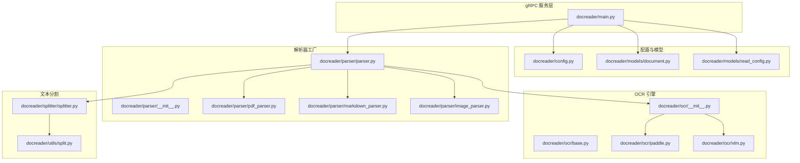
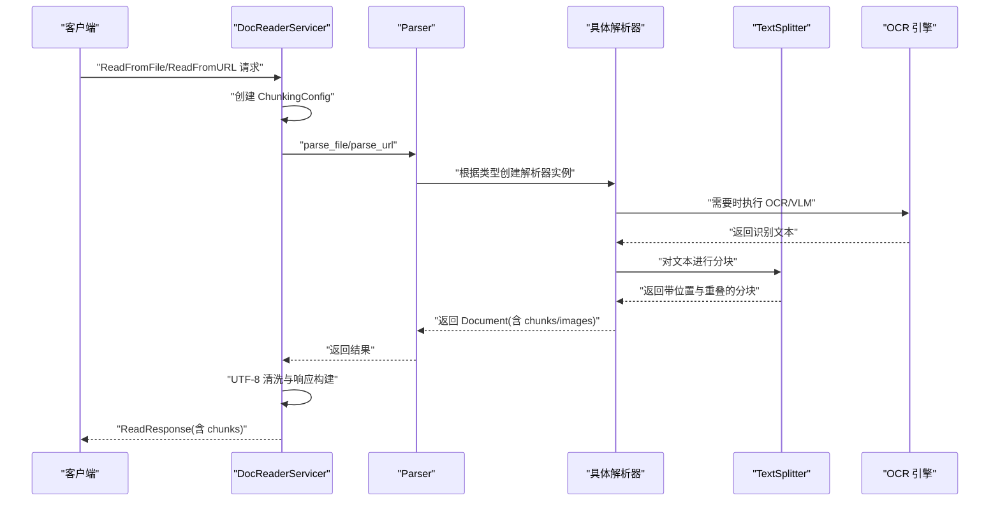
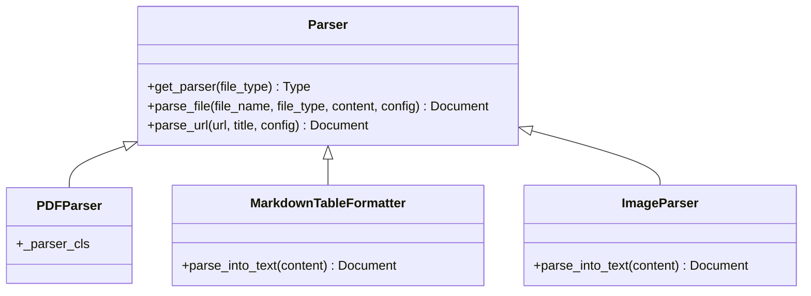
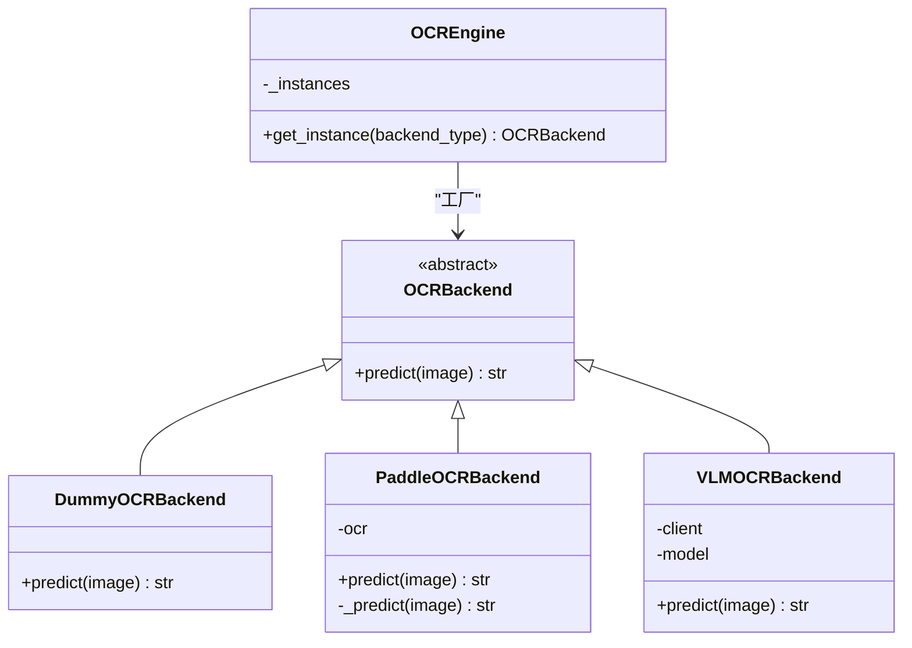
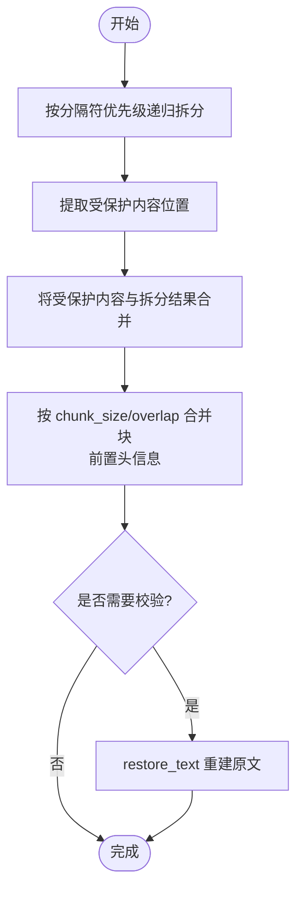
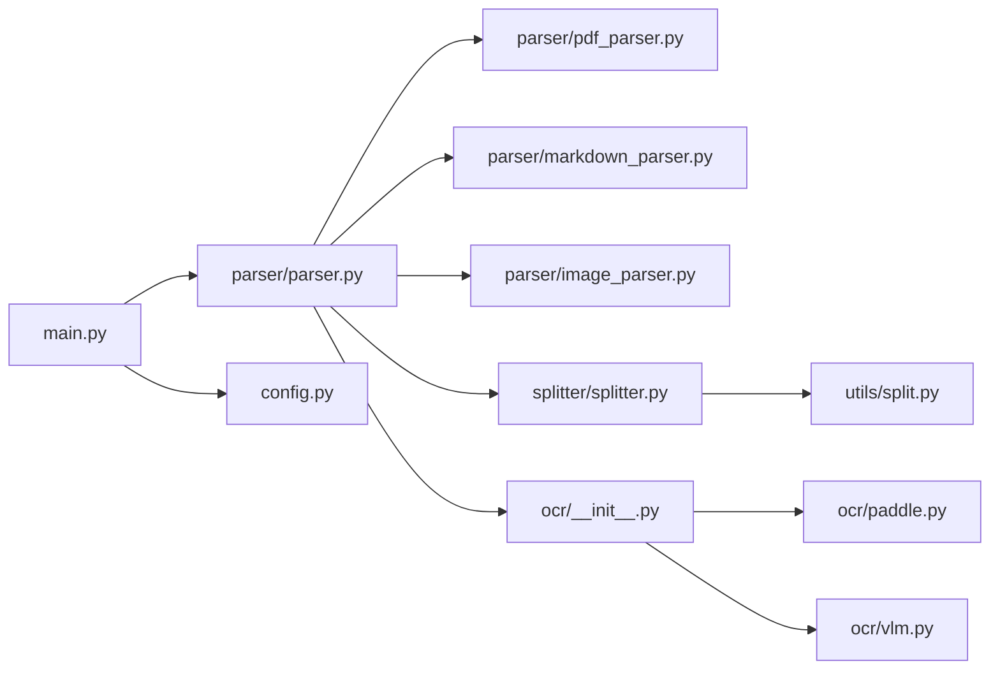

# 文档处理系统

<cite>
**本文档引用的文件**
- [docreader/main.py](file://docreader/main.py)
- [docreader/config.py](file://docreader/config.py)
- [docreader/models/document.py](file://docreader/models/document.py)
- [docreader/models/read_config.py](file://docreader/models/read_config.py)
- [docreader/parser/__init__.py](file://docreader/parser/__init__.py)
- [docreader/parser/parser.py](file://docreader/parser/parser.py)
- [docreader/parser/pdf_parser.py](file://docreader/parser/pdf_parser.py)
- [docreader/parser/markdown_parser.py](file://docreader/parser/markdown_parser.py)
- [docreader/parser/image_parser.py](file://docreader/parser/image_parser.py)
- [docreader/ocr/__init__.py](file://docreader/ocr/__init__.py)
- [docreader/ocr/base.py](file://docreader/ocr/base.py)
- [docreader/ocr/paddle.py](file://docreader/ocr/paddle.py)
- [docreader/ocr/vlm.py](file://docreader/ocr/vlm.py)
- [docreader/splitter/splitter.py](file://docreader/splitter/splitter.py)
- [docreader/utils/split.py](file://docreader/utils/split.py)
</cite>

## 目录
1. [简介](#简介)
2. [项目结构](#项目结构)
3. [核心组件](#核心组件)
4. [架构总览](#架构总览)
5. [详细组件分析](#详细组件分析)
6. [依赖关系分析](#依赖关系分析)
7. [性能考虑](#性能考虑)
8. [故障排查指南](#故障排查指南)
9. [结论](#结论)

## 简介
本项目为一个面向多格式文档的处理与解析服务，提供统一的 gRPC 接口，支持从本地文件或 URL 解析多种文档类型（PDF、Word、Excel、Markdown、纯文本、图片等），并结合 OCR 与视觉语言模型（VLM）进行图像识别与文本抽取，最终输出结构化的文本块（chunks）及关联的图片信息。系统内置智能文本分割策略，确保公式、表格、链接、图片等受保护内容在分块过程中不被破坏，并可选择启用多模态处理以保留图片与 OCR 文本。

## 项目结构
docreader 子模块为核心处理逻辑所在，包含配置、模型、解析器、OCR 引擎、文本分割器与工具函数等。主程序通过 gRPC 提供 ReadFromFile 与 ReadFromURL 两个接口，内部委派给 Parser 统一调度各类专用解析器。

**图表来源**
- [docreader/main.py](file://docreader/main.py#L1-L315)
- [docreader/config.py](file://docreader/config.py#L1-L285)
- [docreader/models/document.py](file://docreader/models/document.py#L1-L88)
- [docreader/models/read_config.py](file://docreader/models/read_config.py#L1-L28)
- [docreader/parser/__init__.py](file://docreader/parser/__init__.py#L1-L40)
- [docreader/parser/parser.py](file://docreader/parser/parser.py#L1-L179)
- [docreader/parser/pdf_parser.py](file://docreader/parser/pdf_parser.py#L1-L17)
- [docreader/parser/markdown_parser.py](file://docreader/parser/markdown_parser.py#L1-L200)
- [docreader/parser/image_parser.py](file://docreader/parser/image_parser.py#L1-L49)
- [docreader/ocr/__init__.py](file://docreader/ocr/__init__.py#L1-L38)
- [docreader/ocr/base.py](file://docreader/ocr/base.py#L1-L32)
- [docreader/ocr/paddle.py](file://docreader/ocr/paddle.py#L1-L176)
- [docreader/ocr/vlm.py](file://docreader/ocr/vlm.py#L1-L88)
- [docreader/splitter/splitter.py](file://docreader/splitter/splitter.py#L1-L585)
- [docreader/utils/split.py](file://docreader/utils/split.py#L1-L81)

**章节来源**
- [docreader/main.py](file://docreader/main.py#L1-L315)
- [docreader/parser/__init__.py](file://docreader/parser/__init__.py#L1-L40)

## 核心组件
- 服务入口与 gRPC 处理：DocReaderServicer 提供 ReadFromFile 与 ReadFromURL 两个接口，负责请求日志、参数校验、调用解析器、构建响应并进行 UTF-8 清洗。
- 配置管理：DocReaderConfig 从环境变量加载 gRPC 参数、代理、OCR/VLM、存储等配置，并提供打印与掩码导出能力。
- 解析器工厂：Parser 根据文件扩展名选择对应解析器（doc/docx/pdf/md/txt/csv/xlsx/图片/web），并注入分块配置与 OCR 后端。
- OCR 引擎：OCREngine 工厂按后端类型返回实例（PaddleOCR、VLM 或 Dummy），避免重复初始化。
- 文本分割：TextSplitter 支持受保护正则（公式、表格、链接、图片、代码块）、分隔符优先级、头信息上下文保留与重叠合并。
- 数据模型：Document/Chunk 定义统一的文档与分块结构，支持序列化/反序列化与元数据保留。

**章节来源**
- [docreader/main.py](file://docreader/main.py#L130-L274)
- [docreader/config.py](file://docreader/config.py#L48-L220)
- [docreader/parser/parser.py](file://docreader/parser/parser.py#L21-L179)
- [docreader/ocr/__init__.py](file://docreader/ocr/__init__.py#L12-L38)
- [docreader/splitter/splitter.py](file://docreader/splitter/splitter.py#L31-L297)
- [docreader/models/document.py](file://docreader/models/document.py#L9-L88)

## 架构总览
系统采用“服务层 → 解析器工厂 → 专用解析器 → 文本分割/OCR → 结果封装”的分层设计。gRPC 服务负责请求生命周期与错误处理，Parser 负责类型路由与配置注入，各解析器专注于特定格式的抽取，TextSplitter 保证语义完整性，OCR/VLM 提供图像识别能力，最终统一输出到 protobuf 响应。

**图表来源**
- [docreader/main.py](file://docreader/main.py#L135-L240)
- [docreader/parser/parser.py](file://docreader/parser/parser.py#L74-L179)
- [docreader/splitter/splitter.py](file://docreader/splitter/splitter.py#L116-L144)
- [docreader/ocr/__init__.py](file://docreader/ocr/__init__.py#L18-L37)

## 详细组件分析

### 服务与配置层
- DocReaderServicer
  - ReadFromFile：解析文件名、类型、内容，创建 ChunkingConfig，调用 Parser.parse_file，转换为 protobuf 响应，UTF-8 清洗字符串字段。
  - ReadFromURL：解析 URL 与标题，创建 ChunkingConfig，调用 Parser.parse_url，转换为 protobuf 响应。
  - _convert_chunk_to_proto：将内部 Chunk 对象转为 protobuf，确保图片 URL/caption/ocr_text 的 UTF-8 安全。
- 配置加载
  - DocReaderConfig：集中管理 gRPC 并发、文件大小、端口、代理、OCR/VLM、存储（COS/MinIO/本地）等。
  - print_config/dump_config：输出有效配置，敏感信息掩码。

**章节来源**
- [docreader/main.py](file://docreader/main.py#L130-L274)
- [docreader/config.py](file://docreader/config.py#L48-L285)

### 解析器体系
- Parser 工厂
  - 映射关系：docx/doc/pdf/md/txt/jpg/jpeg/png/gif/bmp/tiff/webp/csv/xlsx/xls → 对应解析器类。
  - parse_file/parse_url：注入 chunk_size、chunk_overlap、separators、enable_multimodal、最大并发、OCR 后端等。
- PDF 解析链
  - PDFParser 继承 FirstParser，按顺序尝试 MinerUParser → MarkitdownParser，首个成功即返回。
- Markdown 解析管线
  - MarkdownTableFormatter：标准化表格格式（列对齐、间距、缩进）。
  - MarkdownImageUtil：提取/替换 Markdown 图片（支持 base64 与路径），用于后续上传与引用。
- 图片解析
  - ImageParser：上传图片至存储，生成 Markdown 图片引用，记录图片二进制映射。

**图表来源**
- [docreader/parser/parser.py](file://docreader/parser/parser.py#L21-L179)
- [docreader/parser/pdf_parser.py](file://docreader/parser/pdf_parser.py#L6-L17)
- [docreader/parser/markdown_parser.py](file://docreader/parser/markdown_parser.py#L127-L161)
- [docreader/parser/image_parser.py](file://docreader/parser/image_parser.py#L12-L49)

**章节来源**
- [docreader/parser/parser.py](file://docreader/parser/parser.py#L27-L179)
- [docreader/parser/pdf_parser.py](file://docreader/parser/pdf_parser.py#L1-L17)
- [docreader/parser/markdown_parser.py](file://docreader/parser/markdown_parser.py#L1-L200)
- [docreader/parser/image_parser.py](file://docreader/parser/image_parser.py#L1-L49)

### OCR 与视觉语言模型
- OCREngine 工厂
  - 支持后端：paddle（PaddleOCR）、vlm（OpenAI 兼容接口）、dummy（占位）。
  - 线程安全单例缓存，避免重复初始化。
- PaddleOCRBackend
  - 禁用 GPU，强制 CPU；检测 AVX 指令集并设置兼容标志；配置检测/识别模型、阈值与参数；RGB 转换与数组处理；聚合识别结果。
- VLMOCRBackend
  - 基于 OpenAI 兼容客户端，发送图片 base64 与提示词，返回结构化文本；支持超时控制与错误日志。

**图表来源**
- [docreader/ocr/base.py](file://docreader/ocr/base.py#L10-L32)
- [docreader/ocr/paddle.py](file://docreader/ocr/paddle.py#L16-L176)
- [docreader/ocr/vlm.py](file://docreader/ocr/vlm.py#L14-L88)
- [docreader/ocr/__init__.py](file://docreader/ocr/__init__.py#L12-L38)

**章节来源**
- [docreader/ocr/__init__.py](file://docreader/ocr/__init__.py#L1-L38)
- [docreader/ocr/base.py](file://docreader/ocr/base.py#L1-L32)
- [docreader/ocr/paddle.py](file://docreader/ocr/paddle.py#L1-L176)
- [docreader/ocr/vlm.py](file://docreader/ocr/vlm.py#L1-L88)

### 文本分割策略
- TextSplitter
  - 分隔符优先级：按 separators 列表递归拆分，回退到逐字符拆分。
  - 受保护正则：公式（LaTeX 双美元）、图片（Markdown）、链接、表格（表头/表体）、代码块（含语言标识）。
  - 头信息追踪：HeaderTracker 记录标题上下文，合并时前置到每个块，避免丢失语义。
  - 重叠合并：基于 chunk_overlap 与长度函数，逐步弹出前一块内容以维持重叠。
  - 恢复校验：restore_text 可重建原文，便于调试与验证。
- 辅助工具
  - split_by_sep/split_by_char/split_by_regex：提供不同粒度的拆分策略。
  - split_text_keep_separator：保留分隔符在块内，便于后续拼接。

**图表来源**
- [docreader/splitter/splitter.py](file://docreader/splitter/splitter.py#L116-L297)
- [docreader/utils/split.py](file://docreader/utils/split.py#L5-L81)

**章节来源**
- [docreader/splitter/splitter.py](file://docreader/splitter/splitter.py#L31-L556)
- [docreader/utils/split.py](file://docreader/utils/split.py#L1-L81)

### 数据模型与嵌入准备
- Document/Chunk
  - Document：包含文本内容、图片映射、分块列表与元数据。
  - Chunk：包含内容、序列号、起止位置、图片列表与元数据；支持 to_dict/json/from_dict/from_json。
- 嵌入生成流程建议
  - 分块策略：使用 TextSplitter 生成带重叠的语义块，保留公式/表格/图片等受保护内容。
  - 元数据保留：在 Chunk.metadata 中附加原始位置、标题层级、图片引用等。
  - 向量化：对每个 Chunk.content 执行嵌入模型（如 OpenAI/Jina/Ollama 等），批量写入向量库（Qdrant/Elasticsearch 等）。
  - 注意：本仓库未直接实现嵌入生成，上述为最佳实践建议。

**章节来源**
- [docreader/models/document.py](file://docreader/models/document.py#L9-L88)

## 依赖关系分析
- 服务层依赖解析器工厂与配置模块，解析器工厂再依赖具体解析器与 OCR 引擎。
- 文本分割器依赖工具模块与头信息追踪钩子。
- 解析器在多模态场景下依赖 OCR 引擎与存储上传能力。

**图表来源**
- [docreader/main.py](file://docreader/main.py#L1-L315)
- [docreader/parser/parser.py](file://docreader/parser/parser.py#L1-L179)
- [docreader/splitter/splitter.py](file://docreader/splitter/splitter.py#L1-L585)
- [docreader/utils/split.py](file://docreader/utils/split.py#L1-L81)
- [docreader/ocr/__init__.py](file://docreader/ocr/__init__.py#L1-L38)

**章节来源**
- [docreader/main.py](file://docreader/main.py#L1-L315)
- [docreader/parser/parser.py](file://docreader/parser/parser.py#L1-L179)

## 性能考虑
- 并发与资源
  - gRPC 最大工作线程数与消息大小由配置控制，避免过大文件导致内存压力。
  - 图像并发处理上限通过配置项限制，防止 CPU/GPU 资源争用。
- OCR 优化
  - PaddleOCR 强制 CPU 并检测 AVX 指令集，兼容性优先；必要时切换到 VLM 或禁用 OCR。
  - 图像预处理：统一转 RGB，限制检测侧边长，提升识别稳定性。
- 文本分割
  - 受保护正则减少重复拆分成本；分隔符优先级降低回溯次数；重叠合并避免跨块语义断裂。
- 存储与网络
  - 图片上传采用对象存储（COS/MinIO/本地），建议开启 CDN 与压缩；URL 生成与掩码记录便于溯源。

[本节为通用指导，无需列出具体文件来源]

## 故障排查指南
- 常见问题
  - 文件类型不支持：Parser.get_parser 抛出异常，检查扩展名或 MIME 类型。
  - OCR 初始化失败：PaddleOCR 导入/OS 错误或 CPU 不支持 AVX，查看日志并切换后端。
  - VLM OCR 调用失败：检查 API Key/Base URL/模型名称与网络连通性。
  - gRPC 响应为空：确认解析器返回内容非空；检查日志中的警告与错误。
- 日志与诊断
  - 服务启动会打印有效配置；请求级别日志包含请求 ID、文件大小、分块数量与响应大小。
  - 文本分割器提供恢复文本与差异定位，便于定位分块错误。
- 异常恢复
  - PDF 解析采用链式回退（MinerU → MarkItDown），任一成功即返回。
  - 图片解析失败时返回空图片映射，保持文本可用性。
  - OCR 返回空文本不中断流程，保留可读内容。

**章节来源**
- [docreader/parser/parser.py](file://docreader/parser/parser.py#L57-L72)
- [docreader/ocr/paddle.py](file://docreader/ocr/paddle.py#L95-L116)
- [docreader/ocr/vlm.py](file://docreader/ocr/vlm.py#L50-L87)
- [docreader/splitter/splitter.py](file://docreader/splitter/splitter.py#L409-L515)
- [docreader/main.py](file://docreader/main.py#L164-L191)

## 结论
该文档处理系统以清晰的分层架构实现了多格式文档解析、OCR/VLM 图像识别与智能文本分块，具备良好的扩展性与鲁棒性。通过 gRPC 统一接口与严格的日志/错误处理，可在生产环境中稳定运行。建议在实际部署中结合业务需求调整分块参数、OCR 后端与存储策略，并完善嵌入生成与检索链路以满足下游问答/检索场景。