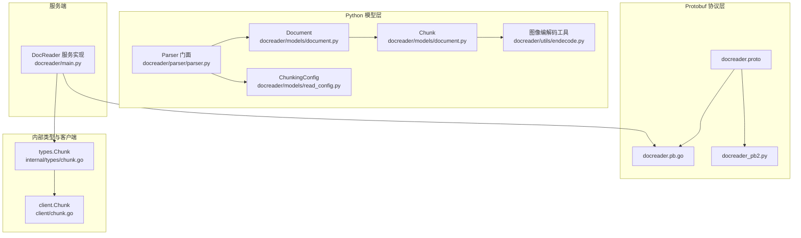
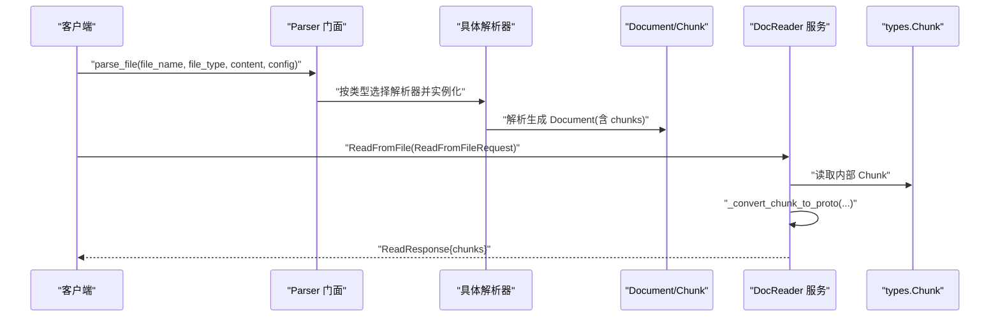
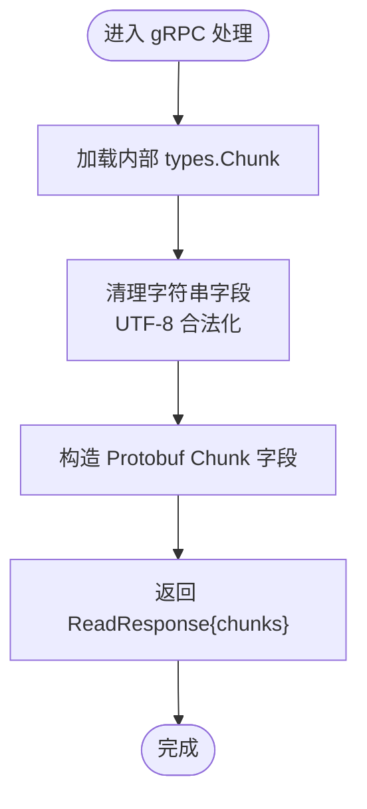
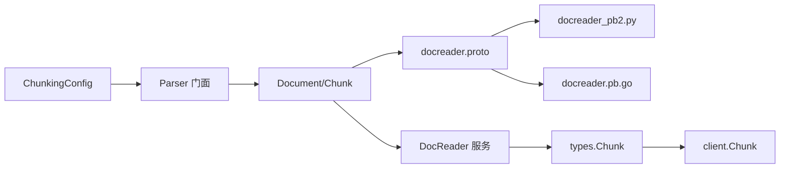

# 文档模型

<cite>
**本文引用的文件列表**
- [docreader/models/document.py](file://docreader/models/document.py)
- [docreader/models/read_config.py](file://docreader/models/read_config.py)
- [docreader/proto/docreader.proto](file://docreader/proto/docreader.proto)
- [docreader/proto/docreader_pb2.py](file://docreader/proto/docreader_pb2.py)
- [docreader/proto/docreader.pb.go](file://docreader/proto/docreader.pb.go)
- [internal/types/chunk.go](file://internal/types/chunk.go)
- [client/chunk.go](file://client/chunk.go)
- [docreader/utils/endecode.py](file://docreader/utils/endecode.py)
- [docreader/parser/parser.py](file://docreader/parser/parser.py)
- [docreader/main.py](file://docreader/main.py)
</cite>

## 目录
1. [简介](#简介)
2. [项目结构](#项目结构)
3. [核心组件](#核心组件)
4. [架构总览](#架构总览)
5. [详细组件分析](#详细组件分析)
6. [依赖分析](#依赖分析)
7. [性能考量](#性能考量)
8. [故障排查指南](#故障排查指南)
9. [结论](#结论)
10. [附录：模型扩展与自定义字段指南](#附录模型扩展与自定义字段指南)

## 简介
本文件面向文档处理系统的数据模型，系统性梳理以下内容：
- Document 模型的结构设计：文档元数据、内容属性与关联信息
- Chunk 模型的实现：内容分块、位置信息与多媒体资源组织
- ReadConfig/ChunkingConfig 的配置机制：解析参数、存储配置与 VLM 设置
- 模型之间的关系与依赖：文档-分块层次关系、配置-解析绑定机制
- 模型序列化与反序列化：Python Pydantic 与 Go Protobuf 的双向转换及数据一致性保障
- 模型扩展指南与自定义字段添加方法

## 项目结构
围绕文档模型的关键目录与文件如下：
- Python 层模型与配置
  - docreader/models/document.py：定义 Document 与 Chunk 的 Pydantic 模型
  - docreader/models/read_config.py：定义 ChunkingConfig 配置类
  - docreader/utils/endecode.py：图像编码解码工具，支撑多媒体资源处理
  - docreader/parser/parser.py：解析器门面，负责根据文件类型选择解析器并传入配置
- Protobuf 协议层
  - docreader/proto/docreader.proto：定义 ReadConfig、Chunk、Image 等消息体
  - docreader/proto/docreader_pb2.py：Python Protobuf 生成代码
  - docreader/proto/docreader.pb.go：Go Protobuf 生成代码
- 内部类型与客户端
  - internal/types/chunk.go：后端持久化与检索使用的 Chunk 结构（含关系、标志位、JSON 字段）
  - client/chunk.go：客户端对 Chunk 的 API 数据结构封装
- 服务端集成
  - docreader/main.py：gRPC DocReader 服务实现，包含将内部 Chunk 转换为 Protobuf Chunk 的逻辑

图表来源
- [docreader/models/document.py](file://docreader/models/document.py#L62-L88)
- [docreader/models/read_config.py](file://docreader/models/read_config.py#L4-L28)
- [docreader/parser/parser.py](file://docreader/parser/parser.py#L21-L179)
- [docreader/proto/docreader.proto](file://docreader/proto/docreader.proto#L1-L89)
- [docreader/proto/docreader_pb2.py](file://docreader/proto/docreader_pb2.py#L1-L55)
- [docreader/proto/docreader.pb.go](file://docreader/proto/docreader.pb.go#L551-L560)
- [internal/types/chunk.go](file://internal/types/chunk.go#L96-L155)
- [client/chunk.go](file://client/chunk.go#L14-L40)
- [docreader/main.py](file://docreader/main.py#L242-L254)

章节来源
- [docreader/models/document.py](file://docreader/models/document.py#L62-L88)
- [docreader/models/read_config.py](file://docreader/models/read_config.py#L4-L28)
- [docreader/parser/parser.py](file://docreader/parser/parser.py#L21-L179)
- [docreader/proto/docreader.proto](file://docreader/proto/docreader.proto#L1-L89)

## 核心组件
- Document：文档级容器，包含文本内容、图片映射、分块列表与元数据字典，并提供内容设置/获取与有效性检查。
- Chunk：分块级容器，包含文本内容、顺序号、起止位置、图片列表与元数据字典；提供 to_dict/to_json/from_dict/from_json 序列化/反序列化能力。
- ChunkingConfig：解析配置，控制分块大小、重叠、分隔符、多模态开关、存储配置与 VLM 配置。
- Protobuf 消息：ReadConfig、Chunk、Image 等，用于跨语言传输与服务间通信。
- types.Chunk：后端持久化与检索使用的结构，包含关系字段、标志位、启用状态、索引位置、内容哈希、图片信息等。
- client.Chunk：客户端 API 返回结构，与后端 types.Chunk 对应。

章节来源
- [docreader/models/document.py](file://docreader/models/document.py#L9-L88)
- [docreader/models/read_config.py](file://docreader/models/read_config.py#L4-L28)
- [docreader/proto/docreader.proto](file://docreader/proto/docreader.proto#L41-L89)
- [internal/types/chunk.go](file://internal/types/chunk.go#L96-L155)
- [client/chunk.go](file://client/chunk.go#L14-L40)

## 架构总览
文档处理流程从解析器门面开始，依据文件类型选择具体解析器，传入 ChunkingConfig 进行分块；解析完成后生成 Document（包含多个 Chunk），随后在服务端将内部 Chunk 转换为 Protobuf Chunk 并返回。

图表来源
- [docreader/parser/parser.py](file://docreader/parser/parser.py#L74-L131)
- [docreader/main.py](file://docreader/main.py#L242-L254)
- [docreader/proto/docreader.proto](file://docreader/proto/docreader.proto#L50-L89)
- [internal/types/chunk.go](file://internal/types/chunk.go#L96-L155)

## 详细组件分析

### Document 模型
- 结构要点
  - content：文档文本内容
  - images：文档级图片映射（键为标识，值为资源路径/URL）
  - chunks：分块列表（Chunk）
  - metadata：文档级元数据字典
  - 辅助方法：set_content/get_content/is_valid
- 设计意图
  - 将文档与其分块、元数据、图片资源统一建模，便于后续检索、向量化与关系抽取。
- 序列化/反序列化
  - Python 层使用 Pydantic 的 model_dump()/model_json() 与 json.dumps()/loads() 实现；支持 from_dict/from_json 以增强灵活性。
- 与 Chunk 的关系
  - Document 作为上层容器，聚合多个 Chunk；Chunk 本身也包含图片列表与元数据，形成“文档-分块-图片”的三层结构。

章节来源
- [docreader/models/document.py](file://docreader/models/document.py#L62-L88)

### Chunk 模型（Python）
- 结构要点
  - content：分块文本
  - seq/start/end：分块顺序号与在原文中的起止位置
  - images：分块内图片信息列表（字典）
  - metadata：分块级元数据
  - 序列化/反序列化：to_dict/to_json/from_dict/from_json
  - 哈希与相等性：基于 content 的简单比较
- 设计意图
  - 保持最小必要字段，便于向量化与检索；图片与元数据以结构化字典承载，便于扩展。
- 与 Protobuf 的对应
  - Protobuf 的 Chunk 字段与 Python Chunk 字段一一对应（content/seq/start/end/images）。

章节来源
- [docreader/models/document.py](file://docreader/models/document.py#L9-L60)
- [docreader/proto/docreader.proto](file://docreader/proto/docreader.proto#L77-L83)

### Chunk 模型（Go/types）
- 结构要点
  - 基础字段：ID、Content、ChunkIndex、StartAt/EndAt、IsEnabled、Status
  - 关系字段：PreChunkID/NextChunkID、ParentChunkID、RelationChunks/IndirectRelationChunks（JSON）
  - 标志位：Flags（位标志，如推荐）、ChunkType（文本/图片OCR/图片描述/摘要/实体/关系/FAQ/Web/表格等）
  - 图片信息：ImageInfo（URL、OriginalURL、StartPos/EndPos、Caption、OCRText）
  - 元数据：Metadata（JSON）
  - 时间戳与软删除：CreatedAt/UpdatedAt/DeletedAt
- 设计意图
  - 支持复杂关系网络构建与检索，满足知识图谱与问答场景需求；JSON 字段承载灵活扩展。
- 与客户端模型的对应
  - client.Chunk 与 types.Chunk 字段基本一致，便于 API 交互。

章节来源
- [internal/types/chunk.go](file://internal/types/chunk.go#L96-L155)
- [client/chunk.go](file://client/chunk.go#L14-L40)

### ReadConfig/ChunkingConfig 配置机制
- Python 层
  - ChunkingConfig：控制分块大小、重叠、分隔符、多模态开关、存储配置与 VLM 配置
- Protobuf 层
  - ReadConfig：与 ChunkingConfig 对应的协议字段，包含 chunk_size、chunk_overlap、separators、enable_multimodal、storage_config、vlm_config
  - StorageConfig/VLMConfig：通用对象存储与视觉语言模型配置
- 解析绑定
  - Parser 门面将 ChunkingConfig 传递给具体解析器，解析器据此进行分块与多模态处理（如 OCR、图像压缩等）

章节来源
- [docreader/models/read_config.py](file://docreader/models/read_config.py#L4-L28)
- [docreader/proto/docreader.proto](file://docreader/proto/docreader.proto#L23-L48)
- [docreader/parser/parser.py](file://docreader/parser/parser.py#L74-L131)

### 模型之间的关系与依赖
- 文档-分块层次
  - Document 聚合多个 Chunk；Chunk 本身可包含图片与元数据，形成“文档-分块-图片”三级结构
- 配置-解析绑定
  - Parser 门面根据文件类型选择解析器，并将 ChunkingConfig 注入解析器，确保分块策略一致
- 关系与标志位
  - types.Chunk 提供 PreChunkID/NextChunkID、ParentChunkID、RelationChunks/IndirectRelationChunks、Flags 等字段，支撑复杂关系网络与检索优化

章节来源
- [docreader/models/document.py](file://docreader/models/document.py#L62-L88)
- [docreader/parser/parser.py](file://docreader/parser/parser.py#L21-L179)
- [internal/types/chunk.go](file://internal/types/chunk.go#L96-L155)

### 模型序列化与反序列化

#### Python 层（Pydantic）
- Document/Chunk 提供 to_dict/to_json/from_dict/from_json 方法，便于在应用内部与外部系统之间传递结构化数据
- 优势：类型安全、字段校验、易于扩展

章节来源
- [docreader/models/document.py](file://docreader/models/document.py#L25-L60)

#### Protobuf 层（Python/Go）
- docreader.proto 定义 ReadConfig、Chunk、Image 等消息体
- 通过 docreader_pb2.py（Python）与 docreader.pb.go（Go）生成代码，实现跨语言序列化/反序列化
- 服务端在 gRPC 处理函数中调用 _convert_chunk_to_proto，将内部 Chunk 转换为 Protobuf Chunk，确保字段一致性

图表来源
- [docreader/main.py](file://docreader/main.py#L242-L254)
- [docreader/proto/docreader.proto](file://docreader/proto/docreader.proto#L77-L83)

章节来源
- [docreader/proto/docreader.proto](file://docreader/proto/docreader.proto#L41-L89)
- [docreader/proto/docreader_pb2.py](file://docreader/proto/docreader_pb2.py#L29-L55)
- [docreader/proto/docreader.pb.go](file://docreader/proto/docreader.pb.go#L551-L560)
- [docreader/main.py](file://docreader/main.py#L242-L254)

## 依赖分析
- 组件耦合
  - Parser 门面依赖 ChunkingConfig，并将其注入各解析器，确保分块策略一致
  - Document/Chunk 与 Protobuf 消息字段一一对应，降低转换成本
  - types.Chunk 与 client.Chunk 字段对齐，简化 API 交互
- 外部依赖
  - Protobuf 运行时（Python/Go）
  - 图像编解码工具（base64/PIL/Numpy）用于多媒体资源处理

图表来源
- [docreader/models/read_config.py](file://docreader/models/read_config.py#L4-L28)
- [docreader/parser/parser.py](file://docreader/parser/parser.py#L74-L131)
- [docreader/models/document.py](file://docreader/models/document.py#L62-L88)
- [docreader/proto/docreader.proto](file://docreader/proto/docreader.proto#L1-L89)
- [docreader/main.py](file://docreader/main.py#L242-L254)
- [internal/types/chunk.go](file://internal/types/chunk.go#L96-L155)
- [client/chunk.go](file://client/chunk.go#L14-L40)

章节来源
- [docreader/parser/parser.py](file://docreader/parser/parser.py#L21-L179)
- [docreader/models/document.py](file://docreader/models/document.py#L62-L88)
- [docreader/proto/docreader.proto](file://docreader/proto/docreader.proto#L1-L89)
- [internal/types/chunk.go](file://internal/types/chunk.go#L96-L155)
- [client/chunk.go](file://client/chunk.go#L14-L40)

## 性能考量
- 分块策略
  - chunk_size 与 chunk_overlap 控制向量化与检索精度与召回权衡
  - separators 决定分块边界，影响语义完整性
- 多模态处理
  - enable_multimodal 开关与最大并发任务数、OCR 后端配置共同影响吞吐
- 图像处理
  - 图像尺寸限制与 base64 编解码开销需平衡质量与性能
- 序列化
  - Protobuf 在跨语言传输中具有更小体积与更快速度的优势

## 故障排查指南
- 解析为空
  - 检查 Parser 是否正确选择解析器、ChunkingConfig 参数是否合理、文件类型是否受支持
- Protobuf 字段异常
  - 确保 _convert_chunk_to_proto 中字符串字段合法化（无孤立代理），避免 gRPC 编码错误
- 图像资源问题
  - 使用图像编解码工具进行 base64 编解码与格式转换，确认图片可读性
- 关系与标志位
  - 检查 types.Chunk 的 Flags、RelationChunks/IndirectRelationChunks 是否按预期更新

章节来源
- [docreader/parser/parser.py](file://docreader/parser/parser.py#L74-L131)
- [docreader/main.py](file://docreader/main.py#L242-L254)
- [docreader/utils/endecode.py](file://docreader/utils/endecode.py#L23-L112)
- [internal/types/chunk.go](file://internal/types/chunk.go#L48-L78)

## 结论
本文档系统梳理了文档处理系统中的数据模型：Document/Chunk 的结构设计、ReadConfig/ChunkingConfig 的配置机制、以及 Python 与 Go 两套模型在 Protobuf 层的映射与转换。通过清晰的分层与严格的序列化约束，系统在保证扩展性的同时兼顾性能与一致性。

## 附录：模型扩展与自定义字段指南
- 扩展 Document/Chunk 字段
  - Python 层：在 Pydantic 模型中新增字段，注意与 Protobuf 字段的映射关系；如需持久化，建议同步扩展 types.Chunk
  - Protobuf 层：在 docreader.proto 中新增字段，重新生成 docreader_pb2.py 与 docreader.pb.go，并在服务端转换逻辑中补充映射
- 新增配置项
  - 在 ChunkingConfig/ReadConfig 中添加新字段，确保 Parser 门面与解析器能够接收并使用新配置
- 多媒体资源组织
  - 使用图像编解码工具进行 base64 编解码，确保图片在 JSON/Protobuf 中可传输与渲染
- 关系与标志位
  - 如需新增关系类型或标志位，优先在 types.Chunk 的枚举与位标志中扩展，并在服务端逻辑中处理

章节来源
- [docreader/models/document.py](file://docreader/models/document.py#L9-L88)
- [docreader/models/read_config.py](file://docreader/models/read_config.py#L4-L28)
- [docreader/proto/docreader.proto](file://docreader/proto/docreader.proto#L41-L89)
- [docreader/utils/endecode.py](file://docreader/utils/endecode.py#L23-L112)
- [internal/types/chunk.go](file://internal/types/chunk.go#L11-L78)