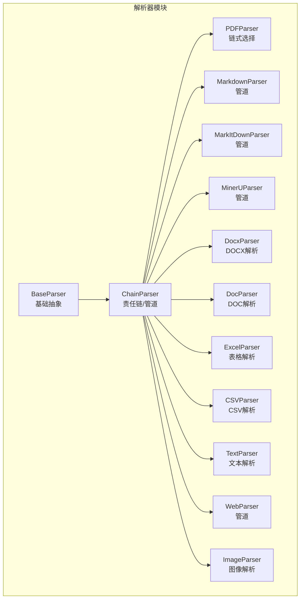
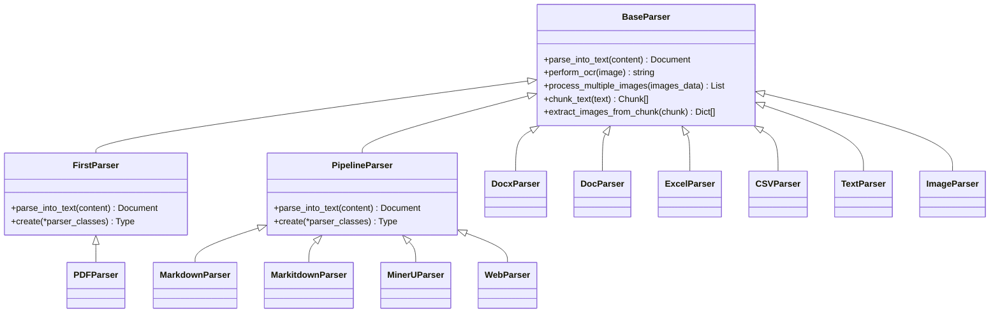
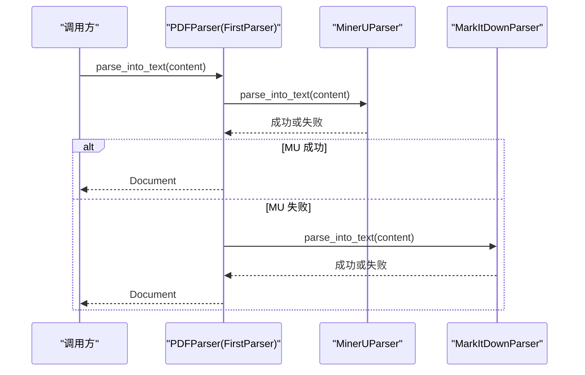
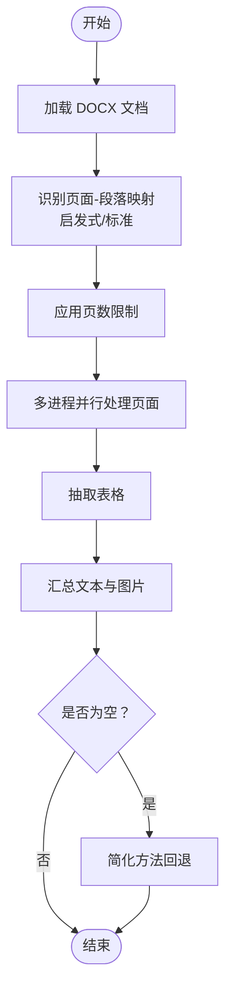
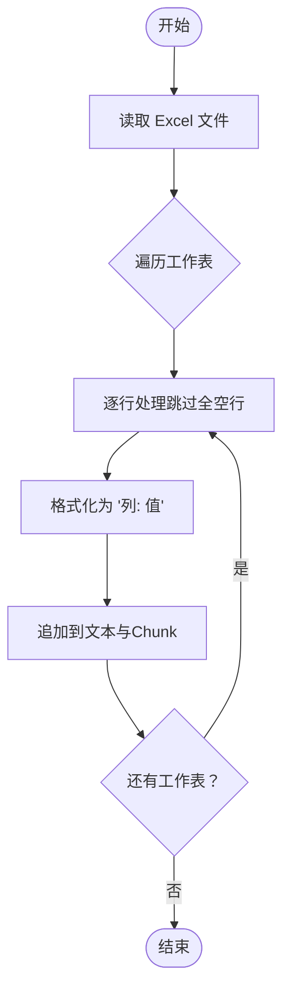
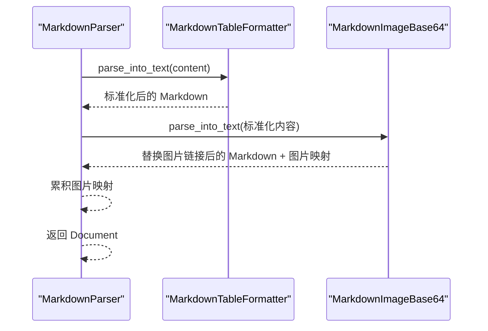
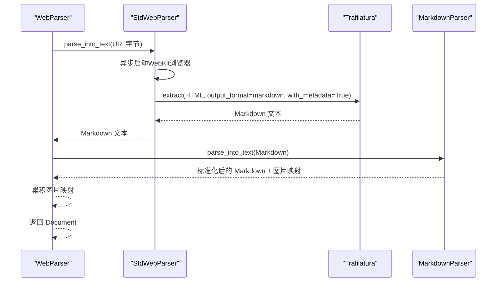
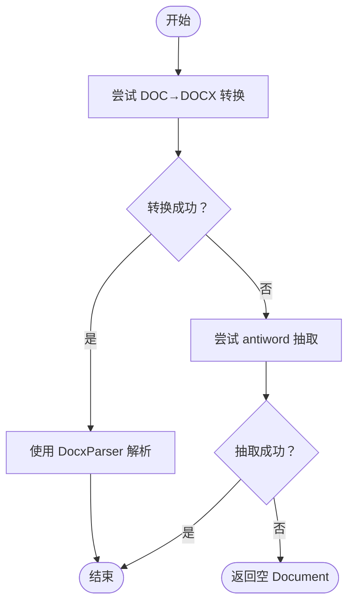
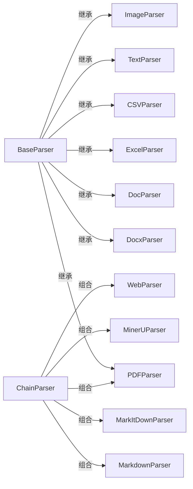

# 文档解析器

<cite>
**本文引用的文件**
- [docreader/parser/base_parser.py](file://docreader/parser/base_parser.py)
- [docreader/parser/chain_parser.py](file://docreader/parser/chain_parser.py)
- [docreader/parser/pdf_parser.py](file://docreader/parser/pdf_parser.py)
- [docreader/parser/mineru_parser.py](file://docreader/parser/mineru_parser.py)
- [docreader/parser/markitdown_parser.py](file://docreader/parser/markitdown_parser.py)
- [docreader/parser/markdown_parser.py](file://docreader/parser/markdown_parser.py)
- [docreader/parser/docx_parser.py](file://docreader/parser/docx_parser.py)
- [docreader/parser/doc_parser.py](file://docreader/parser/doc_parser.py)
- [docreader/parser/excel_parser.py](file://docreader/parser/excel_parser.py)
- [docreader/parser/csv_parser.py](file://docreader/parser/csv_parser.py)
- [docreader/parser/text_parser.py](file://docreader/parser/text_parser.py)
- [docreader/parser/web_parser.py](file://docreader/parser/web_parser.py)
- [docreader/parser/image_parser.py](file://docreader/parser/image_parser.py)
- [docreader/models/document.py](file://docreader/models/document.py)
</cite>

## 目录
1. [简介](#简介)
2. [项目结构](#项目结构)
3. [核心组件](#核心组件)
4. [架构总览](#架构总览)
5. [详细组件分析](#详细组件分析)
6. [依赖关系分析](#依赖关系分析)
7. [性能考量](#性能考量)
8. [故障排查指南](#故障排查指南)
9. [结论](#结论)
10. [附录](#附录)

## 简介
本文件面向“文档解析器”子系统，系统性梳理了多格式文档的解析实现与扩展机制，覆盖以下能力：
- PDF 解析：链式责任模式下的多后端解析（MinerU 为主、MarkItDown 为备选），支持页面级布局与结构化输出。
- Word 文档（DOC/DOCX）：基于 docx 和多进程并行的段落/表格/图片提取，支持分页与并发控制。
- Excel 表格（XLS/XLSX）：按行转结构化文本并生成独立 Chunk，便于检索与定位。
- Markdown：表格格式化、Base64 图片提取与上传、管道化处理。
- 文本文件：统一编码解码与分块策略。
- 网页解析：Playwright 渲染 + Trafilatura 抽取 + Markdown 管道。
- 图像解析：存储上传、OCR 文本提取与描述性标题生成。

同时，文档阐述了解析器的继承体系、接口设计、扩展机制与自定义解析器开发最佳实践。

## 项目结构
解析器模块位于 docreader/parser 下，采用“按格式分文件”的组织方式，辅以通用基类与管道/责任链模式实现复用与组合。

图表来源
- [docreader/parser/base_parser.py](file://docreader/parser/base_parser.py#L29-L460)
- [docreader/parser/chain_parser.py](file://docreader/parser/chain_parser.py#L20-L168)
- [docreader/parser/pdf_parser.py](file://docreader/parser/pdf_parser.py#L6-L17)
- [docreader/parser/markdown_parser.py](file://docreader/parser/markdown_parser.py#L413-L425)
- [docreader/parser/markitdown_parser.py](file://docreader/parser/markitdown_parser.py#L45-L46)
- [docreader/parser/mineru_parser.py](file://docreader/parser/mineru_parser.py#L294-L303)
- [docreader/parser/docx_parser.py](file://docreader/parser/docx_parser.py#L52-L161)
- [docreader/parser/doc_parser.py](file://docreader/parser/doc_parser.py#L95-L128)
- [docreader/parser/excel_parser.py](file://docreader/parser/excel_parser.py#L20-L98)
- [docreader/parser/csv_parser.py](file://docreader/parser/csv_parser.py#L20-L84)
- [docreader/parser/text_parser.py](file://docreader/parser/text_parser.py#L10-L35)
- [docreader/parser/web_parser.py](file://docreader/parser/web_parser.py#L116-L126)
- [docreader/parser/image_parser.py](file://docreader/parser/image_parser.py#L12-L49)

章节来源
- [docreader/parser/base_parser.py](file://docreader/parser/base_parser.py#L29-L460)
- [docreader/parser/chain_parser.py](file://docreader/parser/chain_parser.py#L20-L168)

## 核心组件
- BaseParser（基础抽象）
  - 定义统一接口 parse_into_text，提供 OCR、图片并发处理、文本分块、图像抽取与替换等通用能力。
  - 提供 URL 安全校验、OCR 引擎获取、Caption 描述生成、分块策略（保护结构、保留分隔符）等。
- ChainParser（组合模式）
  - FirstParser：顺序尝试多个解析器，首个成功即返回。
  - PipelineParser：顺序串联多个解析器，前一阶段输出作为下一阶段输入，累积图片映射。
- Document/Chunk（数据模型）
  - Document：包含 content、images、chunks、metadata。
  - Chunk：包含 content、seq、start、end、images、metadata，支持序列化与反序列化。

章节来源
- [docreader/parser/base_parser.py](file://docreader/parser/base_parser.py#L29-L460)
- [docreader/parser/chain_parser.py](file://docreader/parser/chain_parser.py#L20-L168)
- [docreader/models/document.py](file://docreader/models/document.py#L9-L88)

## 架构总览
解析器体系采用“基类 + 责任链/管道 + 具体格式解析器”的分层设计，既保证了可扩展性，又实现了复杂流程的模块化编排。

图表来源
- [docreader/parser/base_parser.py](file://docreader/parser/base_parser.py#L29-L460)
- [docreader/parser/chain_parser.py](file://docreader/parser/chain_parser.py#L20-L168)
- [docreader/parser/pdf_parser.py](file://docreader/parser/pdf_parser.py#L6-L17)
- [docreader/parser/markdown_parser.py](file://docreader/parser/markdown_parser.py#L413-L425)
- [docreader/parser/markitdown_parser.py](file://docreader/parser/markitdown_parser.py#L45-L46)
- [docreader/parser/mineru_parser.py](file://docreader/parser/mineru_parser.py#L294-L303)
- [docreader/parser/docx_parser.py](file://docreader/parser/docx_parser.py#L52-L161)
- [docreader/parser/doc_parser.py](file://docreader/parser/doc_parser.py#L95-L128)
- [docreader/parser/excel_parser.py](file://docreader/parser/excel_parser.py#L20-L98)
- [docreader/parser/csv_parser.py](file://docreader/parser/csv_parser.py#L20-L84)
- [docreader/parser/text_parser.py](file://docreader/parser/text_parser.py#L10-L35)
- [docreader/parser/web_parser.py](file://docreader/parser/web_parser.py#L116-L126)
- [docreader/parser/image_parser.py](file://docreader/parser/image_parser.py#L12-L49)

## 详细组件分析

### PDF 解析器（PDFParser）
- 设计要点
  - 使用 FirstParser 顺序尝试多个解析器，首个成功者即返回结果，提升容错性。
  - 默认链路：MinerUParser（主）、MarkItDownParser（备）。
- 关键流程
  - 链式尝试 parse_into_text，异常时记录并继续下一个解析器。
  - 返回 Document，若均失败则返回空 Document。

图表来源
- [docreader/parser/pdf_parser.py](file://docreader/parser/pdf_parser.py#L6-L17)
- [docreader/parser/mineru_parser.py](file://docreader/parser/mineru_parser.py#L294-L303)
- [docreader/parser/markitdown_parser.py](file://docreader/parser/markitdown_parser.py#L45-L46)

章节来源
- [docreader/parser/pdf_parser.py](file://docreader/parser/pdf_parser.py#L6-L17)
- [docreader/parser/mineru_parser.py](file://docreader/parser/mineru_parser.py#L74-L168)
- [docreader/parser/markitdown_parser.py](file://docreader/parser/markitdown_parser.py#L27-L43)

### Word 文档解析器（DocxParser）
- 设计要点
  - 采用 Docx 类进行页面映射与并行处理，支持大文档分页与多进程。
  - 图片缓存、临时文件共享、线程安全与资源清理。
- 关键流程
  - 加载文档 → 识别页面段落映射（启发式/标准）→ 分页限制 → 多进程并行处理 → 表格抽取 → 结果汇总。
  - 失败回退至简化方法（docx 内置解析）。

图表来源
- [docreader/parser/docx_parser.py](file://docreader/parser/docx_parser.py#L430-L496)
- [docreader/parser/docx_parser.py](file://docreader/parser/docx_parser.py#L296-L428)
- [docreader/parser/docx_parser.py](file://docreader/parser/docx_parser.py#L586-L800)

章节来源
- [docreader/parser/docx_parser.py](file://docreader/parser/docx_parser.py#L52-L161)
- [docreader/parser/docx_parser.py](file://docreader/parser/docx_parser.py#L245-L496)

### Excel 表格解析器（ExcelParser）
- 设计要点
  - 使用 pandas 读取多工作表，自动过滤空行，逐行转为“列名: 值”格式。
  - 每行生成独立 Chunk，保留起止位置与序号，便于检索定位。
- 关键流程
  - 遍历每个工作表 → 过滤空行 → 逐行拼接为文本 → 生成 Chunk 列表 → 返回 Document。

图表来源
- [docreader/parser/excel_parser.py](file://docreader/parser/excel_parser.py#L43-L98)

章节来源
- [docreader/parser/excel_parser.py](file://docreader/parser/excel_parser.py#L20-L98)

### Markdown 解析器（MarkdownParser）
- 设计要点
  - 管道化：先标准化表格格式，再提取/上传 Base64 图片并替换为存储 URL。
  - 工具类：MarkdownTableUtil（表格对齐与间距规范化）、MarkdownImageUtil（Base64/路径提取与替换）。
- 关键流程
  - StdTableFormatter → MarkdownImageBase64（上传并替换）→ 返回 Document（含 content 与 images 映射）。

图表来源
- [docreader/parser/markdown_parser.py](file://docreader/parser/markdown_parser.py#L413-L425)
- [docreader/parser/markdown_parser.py](file://docreader/parser/markdown_parser.py#L127-L161)
- [docreader/parser/markdown_parser.py](file://docreader/parser/markdown_parser.py#L350-L411)

章节来源
- [docreader/parser/markdown_parser.py](file://docreader/parser/markdown_parser.py#L30-L161)
- [docreader/parser/markdown_parser.py](file://docreader/parser/markdown_parser.py#L163-L411)

### 文本文件解析器（TextParser）
- 设计要点
  - 使用统一编码解码工具将字节流解码为字符串，直接返回 Document。
  - 可配合 BaseParser 的分块策略进行后续切分。

章节来源
- [docreader/parser/text_parser.py](file://docreader/parser/text_parser.py#L10-L35)

### 网页解析器（WebParser）
- 设计要点
  - StdWebParser：Playwright WebKit 渲染 + Trafilatura 抽取 HTML 为 Markdown，支持代理。
  - WebParser：StdWebParser → MarkdownParser 管道。
- 关键流程
  - 异步抓取 HTML → Trafilatura 抽取（含元数据、图片、表格、链接）→ 管道化 Markdown 处理 → 返回 Document。

图表来源
- [docreader/parser/web_parser.py](file://docreader/parser/web_parser.py#L85-L114)
- [docreader/parser/web_parser.py](file://docreader/parser/web_parser.py#L116-L126)

章节来源
- [docreader/parser/web_parser.py](file://docreader/parser/web_parser.py#L17-L114)
- [docreader/parser/web_parser.py](file://docreader/parser/web_parser.py#L116-L126)

### 图像解析器（ImageParser）
- 设计要点
  - 上传图片到对象存储，生成 Markdown 图片链接，返回 Document（content 为 Markdown，images 为 URL→Base64 映射）。
  - 可结合 BaseParser 的 OCR 与 Caption 能力进行进一步增强（在其他解析器中使用）。

章节来源
- [docreader/parser/image_parser.py](file://docreader/parser/image_parser.py#L12-L49)

### DOC 文档解析器（DocParser）
- 设计要点
  - DocParser 继承 Docx2Parser，提供多条路径：DOC→DOCX（LibreOffice/OpenOffice）→ DocxParser；或 antiword 直抽；textract 因 SSRF 风险禁用。
  - SandboxExecutor 提供代理配置与超时控制，保障外部命令执行安全。
- 关键流程
  - 尝试 DOC→DOCX 转换 → 使用 DocxParser 解析（含图片）→ 若失败则尝试 antiword → 失败则返回空 Document。

图表来源
- [docreader/parser/doc_parser.py](file://docreader/parser/doc_parser.py#L103-L128)
- [docreader/parser/doc_parser.py](file://docreader/parser/doc_parser.py#L170-L229)
- [docreader/parser/doc_parser.py](file://docreader/parser/doc_parser.py#L142-L168)

章节来源
- [docreader/parser/doc_parser.py](file://docreader/parser/doc_parser.py#L95-L128)
- [docreader/parser/doc_parser.py](file://docreader/parser/doc_parser.py#L170-L229)

### CSV 解析器（CSVParser）
- 设计要点
  - 使用 pandas 读取 CSV，自动跳过错误行，逐行格式化为“列: 值”并生成 Chunk。
- 关键流程
  - 读取 CSV → 遍历行 → 格式化 → 生成 Document（content + chunks）。

章节来源
- [docreader/parser/csv_parser.py](file://docreader/parser/csv_parser.py#L20-L84)

## 依赖关系分析
- 继承与组合
  - 所有具体解析器均继承 BaseParser，统一接口与通用能力。
  - FirstParser/PipelineParser 作为组合器，负责解析器实例化与调用顺序控制。
- 外部依赖
  - PDF：MinerU API、MarkItDown 库。
  - DOC：LibreOffice/OpenOffice、antiword、textract（禁用）。
  - DOCX：python-docx、Pillow、多进程。
  - 网页：Playwright（WebKit）、Trafilatura。
  - 图像：对象存储上传、OCR 引擎、VLM 描述生成。
- 数据模型
  - Document/Chunk 提供统一的数据结构，便于跨解析器传递与持久化。

图表来源
- [docreader/parser/chain_parser.py](file://docreader/parser/chain_parser.py#L20-L168)
- [docreader/parser/pdf_parser.py](file://docreader/parser/pdf_parser.py#L6-L17)
- [docreader/parser/markdown_parser.py](file://docreader/parser/markdown_parser.py#L413-L425)
- [docreader/parser/markitdown_parser.py](file://docreader/parser/markitdown_parser.py#L45-L46)
- [docreader/parser/mineru_parser.py](file://docreader/parser/mineru_parser.py#L294-L303)
- [docreader/parser/web_parser.py](file://docreader/parser/web_parser.py#L116-L126)

章节来源
- [docreader/parser/chain_parser.py](file://docreader/parser/chain_parser.py#L20-L168)

## 性能考量
- 并发与限流
  - BaseParser 的 process_multiple_images 使用 asyncio.Semaphore 控制并发，避免资源耗尽。
  - DocxParser 的多进程池根据文档大小与 CPU 核心动态调整工作进程数。
- 图像处理
  - 自动缩放最大尺寸，避免超大图导致内存与 OCR 时间飙升。
  - 图片缓存与临时文件清理，减少重复 IO。
- 文本分块
  - 保护结构（表格、代码块、公式、行内图片/链接）不被错误切分，提高下游检索质量。
- 外部服务
  - MinerU API、Cloud MinerU 异步轮询，设置合理超时与重试策略。
  - Web 抓取使用代理与超时控制，避免阻塞。

## 故障排查指南
- URL 安全校验失败
  - 现象：远程图片/网页被拒绝。
  - 排查：检查 URL 协议、主机名/IP 是否在受限名单内。
- OCR 失败或超时
  - 现象：图片 OCR 返回空或抛出异常。
  - 排查：确认 OCR 引擎可用、网络可达、图片尺寸未超过限制。
- DOC→DOCX 转换失败
  - 现象：LibreOffice/OpenOffice 未安装或命令执行失败。
  - 排查：检查 soffice 路径、环境变量、沙箱代理配置。
- antiword 抽取失败
  - 现象：antiword 未安装或返回非零退出码。
  - 排查：检查 antiword 路径、权限、超时时间。
- MinerU API 不可用
  - 现象：MinerU 端点不可达或返回错误。
  - 排查：检查 MINERU_ENDPOINT、网络连通性、轮询状态与任务 ID。
- 网页抓取失败
  - 现象：Playwright 启动失败或页面导航超时。
  - 排查：检查代理配置、WebKit 可用性、页面加载超时。

章节来源
- [docreader/parser/base_parser.py](file://docreader/parser/base_parser.py#L37-L94)
- [docreader/parser/base_parser.py](file://docreader/parser/base_parser.py#L197-L222)
- [docreader/parser/base_parser.py](file://docreader/parser/base_parser.py#L246-L356)
- [docreader/parser/doc_parser.py](file://docreader/parser/doc_parser.py#L170-L229)
- [docreader/parser/doc_parser.py](file://docreader/parser/doc_parser.py#L293-L312)
- [docreader/parser/mineru_parser.py](file://docreader/parser/mineru_parser.py#L55-L73)
- [docreader/parser/web_parser.py](file://docreader/parser/web_parser.py#L38-L84)

## 结论
该解析器体系通过“基类 + 责任链/管道 + 具体格式解析器”的分层设计，在保证可扩展性的同时，实现了多格式文档的稳定解析与结构化输出。针对不同格式的特性（如 PDF 的扫描版布局、DOC 的外部工具依赖、DOCX 的并发处理、Excel 的结构化行拆分、Markdown 的表格与图片处理、网页的动态渲染与抽取、图像的 OCR 与描述生成），提供了针对性的实现与优化。建议在生产环境中结合业务需求选择合适的解析链路，并关注外部依赖的可用性与性能瓶颈。

## 附录
- 自定义解析器开发指南
  - 继承 BaseParser，实现 parse_into_text，返回 Document。
  - 如需顺序处理，可组合 PipelineParser；如需择优尝试，可组合 FirstParser。
  - 注意：
    - 统一编码解码与异常处理；
    - 图片与文本的映射与替换；
    - 大文件/长文档的分块与并发控制；
    - 外部依赖的可用性检测与降级策略。
- 最佳实践
  - 优先使用管道化处理（先抽取结构，再做格式化与图片处理）；
  - 对大文档启用分页/分块与并发；
  - 对图片进行尺寸限制与缓存；
  - 对外部服务设置超时与重试；
  - 记录关键日志以便追踪与排障。