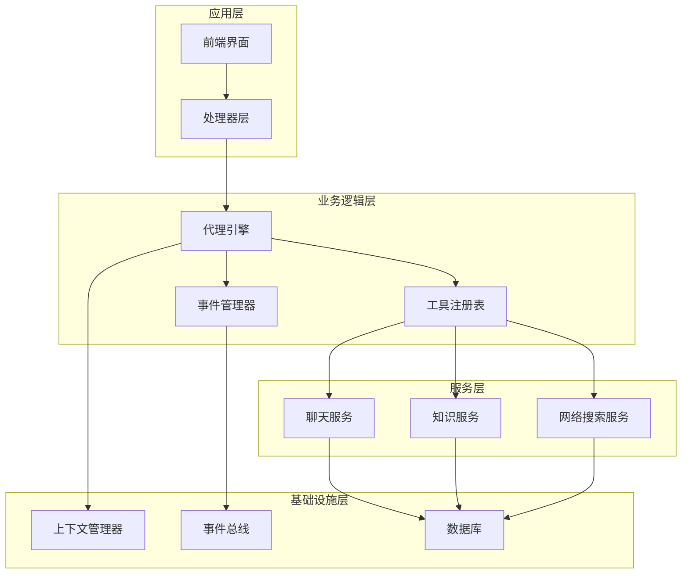
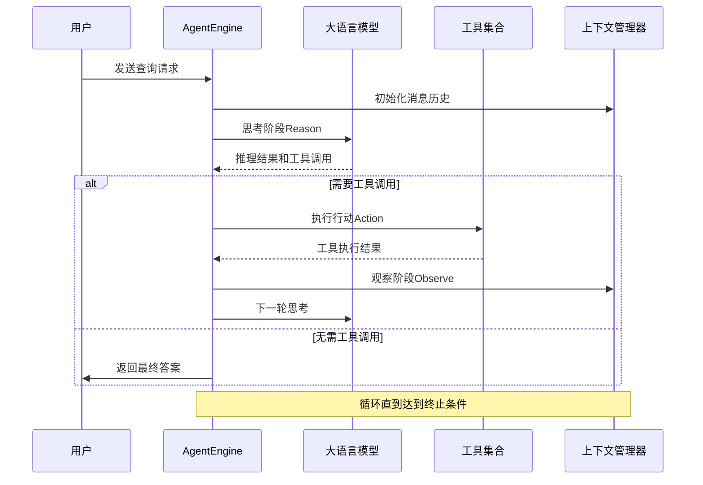
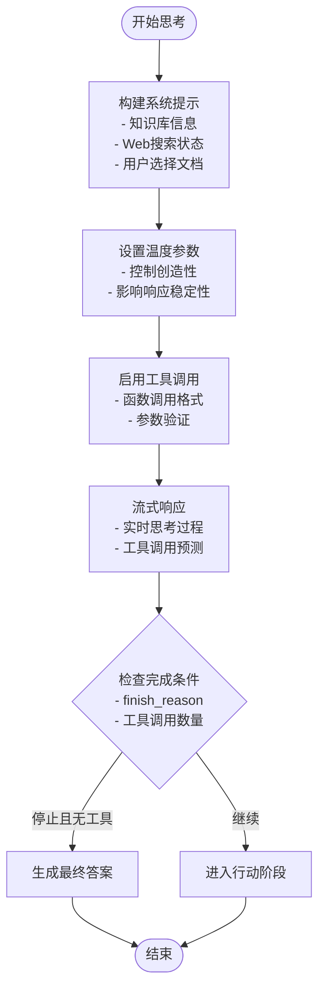
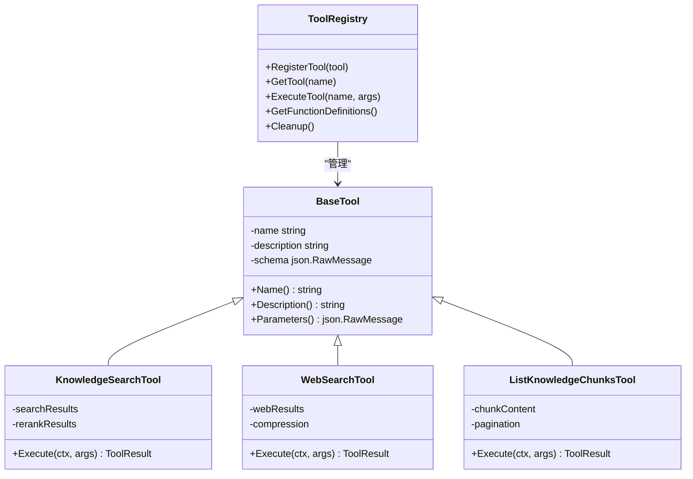
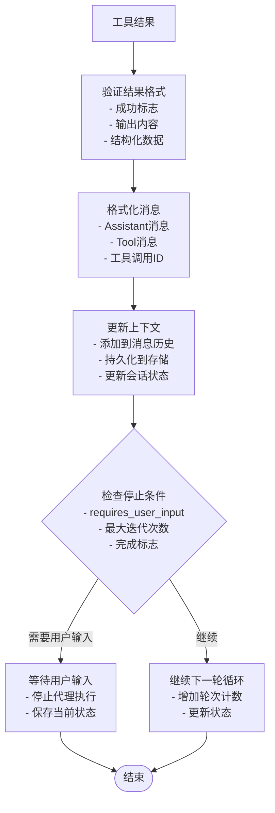
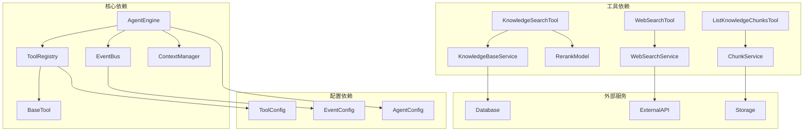

# ReACT架构实现

<cite>
**本文档引用的文件**
- [internal/agent/engine.go](file://internal/agent/engine.go)
- [internal/agent/prompts.go](file://internal/agent/prompts.go)
- [internal/agent/tools/tool.go](file://internal/agent/tools/tool.go)
- [internal/agent/tools/registry.go](file://internal/agent/tools/registry.go)
- [internal/agent/tools/knowledge_search.go](file://internal/agent/tools/knowledge_search.go)
- [internal/agent/tools/list_knowledge_chunks.go](file://internal/agent/tools/list_knowledge_chunks.go)
- [internal/agent/tools/web_search.go](file://internal/agent/tools/web_search.go)
- [internal/agent/tools/todo_write.go](file://internal/agent/tools/todo_write.go)
- [internal/agent/tools/grep_chunks.go](file://internal/agent/tools/grep_chunks.go)
- [internal/agent/tools/show_options.go](file://internal/agent/tools/show_options.go)
- [internal/agent/tools/sequentialthinking.go](file://internal/agent/tools/sequentialthinking.go)
- [internal/types/agent.go](file://internal/types/agent.go)
- [internal/event/event.go](file://internal/event/event.go)
- [config/config.yaml](file://config/config.yaml)
</cite>

## 目录
1. [简介](#简介)
2. [项目结构](#项目结构)
3. [核心组件](#核心组件)
4. [架构概览](#架构概览)
5. [详细组件分析](#详细组件分析)
6. [依赖关系分析](#依赖关系分析)
7. [性能考虑](#性能考虑)
8. [故障排除指南](#故障排除指南)
9. [结论](#结论)

## 简介

ReACT（推理-行动-观察）架构是一种强大的智能代理执行范式，通过循环的思考、行动和观察过程来解决复杂问题。本项目实现了完整的ReACT架构，结合大语言模型（LLM）的强大推理能力和丰富的工具生态系统，为用户提供智能化的知识检索和问题解答服务。

ReACT架构的核心在于其动态循环机制：代理首先进行思考（Reason）以制定行动计划，然后执行行动（Action）调用各种工具获取信息，最后观察（Observe）工具返回的结果并更新其知识状态。这种循环过程持续进行，直到达到终止条件或获得满意的答案。

## 项目结构

该项目采用模块化的Go语言架构设计，主要分为以下几个核心层次：

**图表来源**
- [internal/agent/engine.go](file://internal/agent/engine.go#L25-L73)
- [internal/agent/tools/registry.go](file://internal/agent/tools/registry.go#L12-L27)
- [internal/event/event.go](file://internal/event/event.go#L84-L104)

**章节来源**
- [internal/agent/engine.go](file://internal/agent/engine.go#L1-L888)
- [internal/agent/tools/registry.go](file://internal/agent/tools/registry.go#L1-L114)

## 核心组件

### AgentEngine - 代理引擎

AgentEngine是ReACT架构的核心执行引擎，负责协调整个推理-行动-观察循环。它维护代理的状态、管理工具调用、处理事件流，并确保执行过程的正确性和完整性。

关键特性：
- **状态管理**：跟踪当前轮次、步骤历史和最终答案
- **循环控制**：实现ReACT循环的迭代执行
- **事件驱动**：通过事件总线实现松耦合的组件通信
- **错误处理**：提供完善的错误捕获和恢复机制

### ToolRegistry - 工具注册表

工具注册表管理所有可用的工具，提供统一的工具发现、调用和生命周期管理接口。它支持动态工具注册和参数验证。

核心功能：
- **工具注册**：支持工具的动态注册和发现
- **参数验证**：基于JSON Schema验证工具参数
- **执行调度**：协调工具执行和结果处理
- **清理机制**：自动清理临时资源和状态

### SystemPrompt 构建器

系统提示词构建器负责生成适合特定场景的系统提示，包括知识库信息、Web搜索状态和用户选择的文档。

**章节来源**
- [internal/agent/engine.go](file://internal/agent/engine.go#L25-L73)
- [internal/agent/tools/registry.go](file://internal/agent/tools/registry.go#L12-L58)
- [internal/agent/prompts.go](file://internal/agent/prompts.go#L301-L330)

## 架构概览

ReACT架构的执行流程遵循严格的循环模式，每个循环包含三个核心阶段：

**图表来源**
- [internal/agent/engine.go](file://internal/agent/engine.go#L159-L521)

### 执行循环控制

ReACT循环的控制逻辑通过以下机制实现：

1. **迭代计数**：基于最大迭代次数限制循环
2. **终止条件**：当LLM返回停止信号且无工具调用时结束
3. **状态跟踪**：维护当前轮次和步骤历史
4. **异常处理**：捕获和处理执行过程中的错误

**章节来源**
- [internal/agent/engine.go](file://internal/agent/engine.go#L159-L477)

## 详细组件分析

### 思考阶段（Reason）

思考阶段是ReACT架构的核心，代理通过大语言模型进行推理和规划。该阶段的特点包括：

**图表来源**
- [internal/agent/engine.go](file://internal/agent/engine.go#L664-L742)
- [internal/agent/prompts.go](file://internal/agent/prompts.go#L301-L330)

思考阶段的关键实现细节：
- **系统提示构建**：动态生成包含知识库信息和Web搜索状态的系统提示
- **温度参数控制**：通过配置参数控制模型的创造性输出
- **工具调用启用**：允许LLM在思考过程中调用特定工具
- **流式响应**：实时传输思考过程，提供用户体验反馈

**章节来源**
- [internal/agent/engine.go](file://internal/agent/engine.go#L664-L742)
- [internal/agent/prompts.go](file://internal/agent/prompts.go#L301-L330)

### 行动阶段（Action）

行动阶段负责执行LLM推荐的具体操作，通过调用各种工具来获取所需信息。系统支持多种工具类型：

**图表来源**
- [internal/agent/tools/registry.go](file://internal/agent/tools/registry.go#L12-L58)
- [internal/agent/tools/tool.go](file://internal/agent/tools/tool.go#L10-L39)

行动阶段的执行流程：
1. **工具调用解析**：解析LLM返回的函数调用信息
2. **参数验证**：基于JSON Schema验证工具参数
3. **工具执行**：调用相应的工具处理函数
4. **结果收集**：收集工具执行结果并进行格式化

**章节来源**
- [internal/agent/tools/registry.go](file://internal/agent/tools/registry.go#L60-L103)
- [internal/agent/tools/tool.go](file://internal/agent/tools/tool.go#L10-L39)

### 观察阶段（Observe）

观察阶段负责处理工具返回的结果并将信息集成到代理的知识状态中。这一阶段确保代理能够从每次行动中学习并改进后续决策。

**图表来源**
- [internal/agent/engine.go](file://internal/agent/engine.go#L541-L620)

观察阶段的关键功能：
- **结果验证**：确保工具返回的数据格式正确
- **消息格式化**：按照OpenAI函数调用格式规范处理结果
- **上下文更新**：将新信息添加到对话历史中
- **状态检查**：监控执行状态并决定下一步操作

**章节来源**
- [internal/agent/engine.go](file://internal/agent/engine.go#L541-L620)

### 工具生态系统

系统提供了丰富的工具来支持各种应用场景：

#### 知识检索工具
- **grep_chunks**：基于关键词的精确文本匹配
- **knowledge_search**：语义向量搜索，支持混合检索
- **list_knowledge_chunks**：获取文档分块的完整内容

#### 网络搜索工具
- **web_search**：实时网络搜索，支持RAG压缩
- **web_fetch**：获取网页完整内容

#### 任务管理工具
- **todo_write**：创建和管理多步骤任务列表
- **show_options**：显示交互式选项供用户选择

#### 思维工具
- **thinking**：序列化思维过程，支持修订和分支

**章节来源**
- [internal/agent/tools/grep_chunks.go](file://internal/agent/tools/grep_chunks.go#L17-L84)
- [internal/agent/tools/knowledge_search.go](file://internal/agent/tools/knowledge_search.go#L22-L103)
- [internal/agent/tools/list_knowledge_chunks.go](file://internal/agent/tools/list_knowledge_chunks.go#L13-L56)
- [internal/agent/tools/web_search.go](file://internal/agent/tools/web_search.go#L16-L69)
- [internal/agent/tools/todo_write.go](file://internal/agent/tools/todo_write.go#L12-L136)
- [internal/agent/tools/show_options.go](file://internal/agent/tools/show_options.go#L12-L43)
- [internal/agent/tools/sequentialthinking.go](file://internal/agent/tools/sequentialthinking.go#L12-L129)

## 依赖关系分析

ReACT架构的依赖关系体现了清晰的分层设计和松耦合原则：

**图表来源**
- [internal/agent/engine.go](file://internal/agent/engine.go#L26-L36)
- [internal/agent/tools/registry.go](file://internal/agent/tools/registry.go#L12-L27)

### 关键依赖关系

1. **AgentEngine ↔ ToolRegistry**：通过接口抽象实现松耦合
2. **EventBus**：提供事件驱动的通信机制
3. **ContextManager**：管理对话历史和状态持久化
4. **工具接口**：统一的工具执行接口

**章节来源**
- [internal/agent/engine.go](file://internal/agent/engine.go#L26-L36)
- [internal/agent/tools/registry.go](file://internal/agent/tools/registry.go#L12-L27)

## 性能考虑

ReACT架构在设计时充分考虑了性能优化，主要体现在以下几个方面：

### 并发处理
- **并发搜索**：知识检索工具支持并行执行多个搜索请求
- **批量处理**：工具结果采用批处理方式减少开销
- **异步事件**：事件总线支持异步处理提高响应速度

### 缓存策略
- **会话缓存**：Web搜索结果在会话范围内缓存
- **临时知识库**：为会话创建临时知识库避免重复索引
- **结果去重**：自动去除重复和高度相似的结果

### 资源管理
- **自动清理**：工具执行后自动清理临时资源
- **内存优化**：流式处理大量数据避免内存溢出
- **连接池**：数据库和外部服务连接池管理

## 故障排除指南

### 常见问题及解决方案

#### 工具执行失败
**症状**：工具返回错误或超时
**解决方案**：
1. 检查工具参数格式是否正确
2. 验证外部服务连接状态
3. 查看日志获取详细错误信息
4. 实现重试机制处理临时故障

#### 上下文过长
**症状**：模型输出截断或性能下降
**解决方案**：
1. 调整历史消息轮数配置
2. 实施上下文压缩策略
3. 优化消息格式减少token使用

#### 循环卡死
**症状**：ReACT循环无法正常结束
**解决方案**：
1. 检查最大迭代次数设置
2. 验证终止条件判断逻辑
3. 实现超时保护机制

**章节来源**
- [internal/agent/engine.go](file://internal/agent/engine.go#L159-L521)

### 监控和调试

系统提供了完善的监控和调试机制：
- **事件日志**：详细的事件流记录
- **性能指标**：执行时间和资源使用统计
- **错误追踪**：完整的错误堆栈信息
- **状态检查**：实时查看代理执行状态

## 结论

ReACT架构实现通过精心设计的模块化结构和事件驱动机制，成功地将复杂的推理-行动-观察循环封装为可扩展、可维护的系统。该实现具有以下优势：

1. **模块化设计**：清晰的职责分离和接口抽象
2. **事件驱动**：松耦合的组件通信机制
3. **工具生态**：丰富的工具集支持多样化应用场景
4. **性能优化**：并发处理和缓存策略确保高效运行
5. **可扩展性**：易于添加新工具和功能模块

通过合理配置系统参数（如最大迭代次数、温度参数和思考模式），用户可以根据具体需求调整代理的行为特征。该架构为构建智能知识检索和问题解答系统提供了坚实的基础框架。