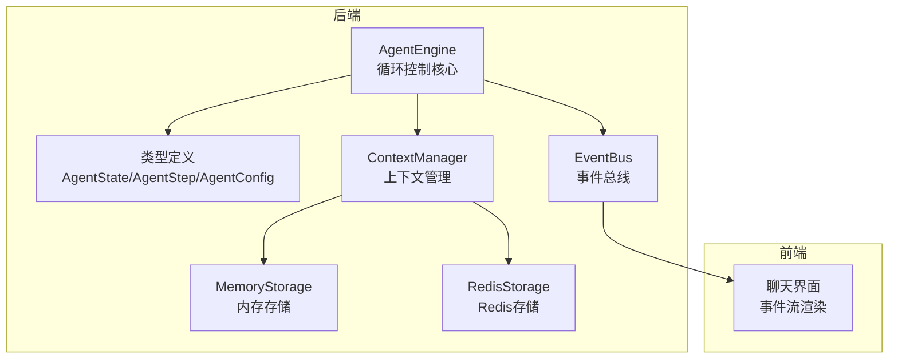
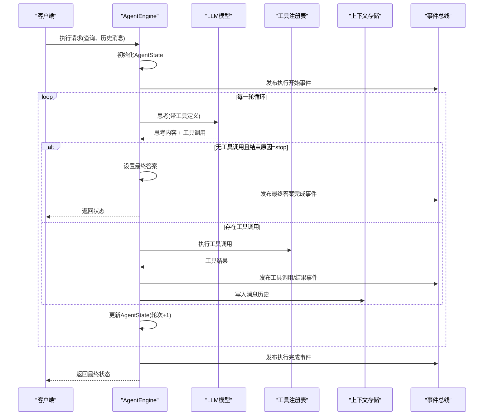
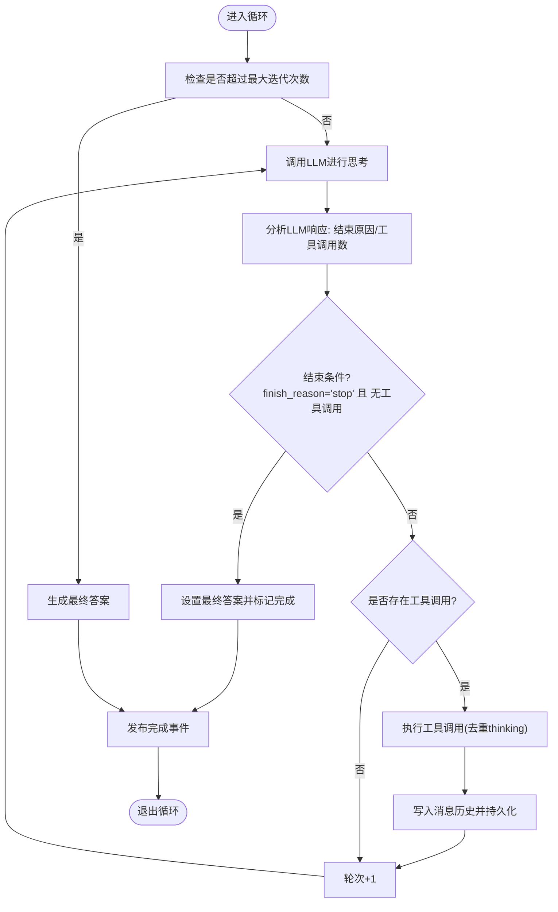
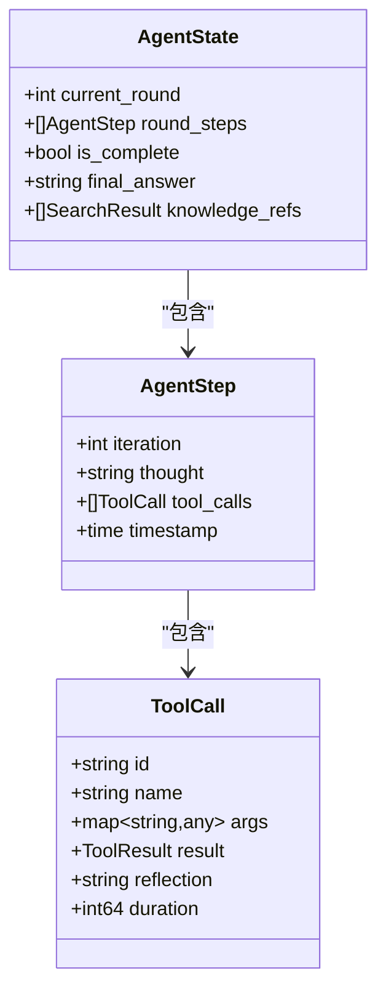
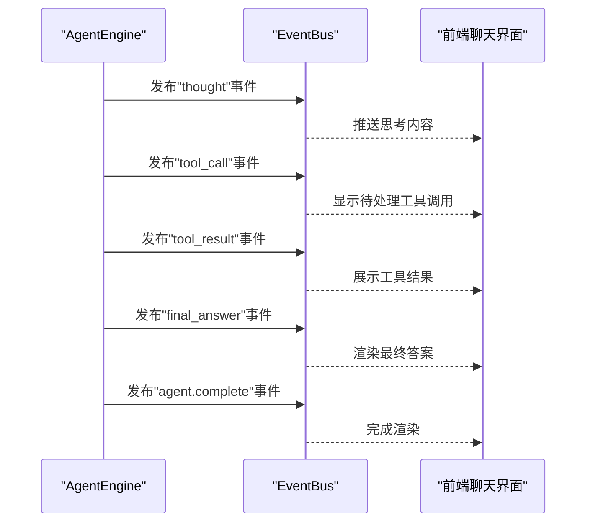
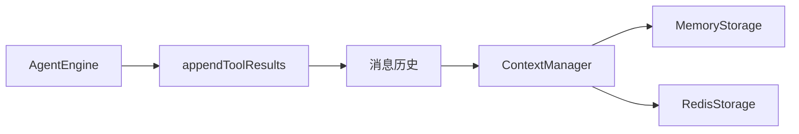
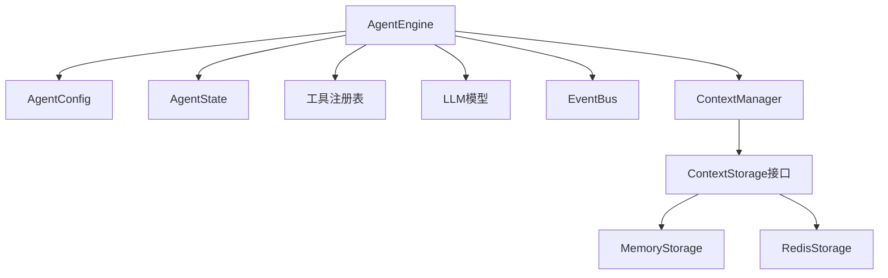

# 循环控制机制

<cite>
**本文档引用的文件**
- [internal/agent/engine.go](file://internal/agent/engine.go)
- [internal/agent/const.go](file://internal/agent/const.go)
- [internal/types/agent.go](file://internal/types/agent.go)
- [internal/event/event.go](file://internal/event/event.go)
- [internal/application/service/llmcontext/context_manager.go](file://internal/application/service/llmcontext/context_manager.go)
- [internal/application/service/llmcontext/memory_storage.go](file://internal/application/service/llmcontext/memory_storage.go)
- [internal/application/service/llmcontext/redis_storage.go](file://internal/application/service/llmcontext/redis_storage.go)
- [internal/middleware/error_handler.go](file://internal/middleware/error_handler.go)
- [frontend/src/views/chat/index.vue](file://frontend/src/views/chat/index.vue)
- [frontend/src/views/settings/AgentSettings.vue](file://frontend/src/views/settings/AgentSettings.vue)
</cite>

## 目录
1. [简介](#简介)
2. [项目结构](#项目结构)
3. [核心组件](#核心组件)
4. [架构概览](#架构概览)
5. [详细组件分析](#详细组件分析)
6. [依赖关系分析](#依赖关系分析)
7. [性能考虑](#性能考虑)
8. [故障排除指南](#故障排除指南)
9. [结论](#结论)
10. [附录](#附录)

## 简介
本文件深入解析 WiseDx 项目中 ReAct 循环控制机制的完整实现，涵盖最大迭代次数配置与检查、完成条件判断、异常处理策略、状态管理（代理状态保存与恢复、步骤历史记录与回放、中间结果持久化）、关键算法（终止条件检测、无限循环防护、资源使用监控）以及配置参数说明。文档同时提供实际代码示例路径，展示如何实现自定义的循环控制策略和状态管理机制。

## 项目结构
ReAct 循环控制主要由以下模块协同实现：
- Agent 引擎：负责循环执行、状态管理、事件发布
- 类型定义：AgentState、AgentStep、AgentConfig 等核心数据结构
- 事件总线：统一的事件发布与订阅机制
- 上下文管理：消息历史的持久化存储（内存/Redis）
- 前端交互：实时接收事件流并渲染思考过程与工具调用结果

**图表来源**
- [internal/agent/engine.go](file://internal/agent/engine.go#L25-L73)
- [internal/types/agent.go](file://internal/types/agent.go#L163-L170)
- [internal/event/event.go](file://internal/event/event.go#L84-L104)
- [internal/application/service/llmcontext/context_manager.go](file://internal/application/service/llmcontext/context_manager.go#L12-L31)
- [internal/application/service/llmcontext/memory_storage.go](file://internal/application/service/llmcontext/memory_storage.go#L11-L22)
- [internal/application/service/llmcontext/redis_storage.go](file://internal/application/service/llmcontext/redis_storage.go#L14-L21)

**章节来源**
- [internal/agent/engine.go](file://internal/agent/engine.go#L25-L73)
- [internal/types/agent.go](file://internal/types/agent.go#L16-L36)
- [internal/event/event.go](file://internal/event/event.go#L84-L104)

## 核心组件
- AgentEngine：ReAct 循环的执行引擎，包含循环主流程、事件发布、状态更新与最终答案生成
- AgentState：跟踪当前轮次、步骤历史、完成状态与最终答案
- AgentConfig：循环控制配置，包括最大迭代次数、温度、工具选择等
- EventBus：事件总线，统一发布思考、工具调用、工具结果、最终答案等事件
- ContextManager：上下文管理器，负责消息历史的持久化与加载

**章节来源**
- [internal/agent/engine.go](file://internal/agent/engine.go#L25-L73)
- [internal/types/agent.go](file://internal/types/agent.go#L163-L170)
- [internal/types/agent.go](file://internal/types/agent.go#L12-L36)
- [internal/event/event.go](file://internal/event/event.go#L84-L104)
- [internal/application/service/llmcontext/context_manager.go](file://internal/application/service/llmcontext/context_manager.go#L12-L31)

## 架构概览
ReAct 循环遵循 "思考-行动-观察-反思" 的迭代模式，通过事件总线实现实时反馈，并将中间结果持久化到上下文存储中，支持后续回放与恢复。

**图表来源**
- [internal/agent/engine.go](file://internal/agent/engine.go#L77-L155)
- [internal/agent/engine.go](file://internal/agent/engine.go#L159-L521)
- [internal/agent/engine.go](file://internal/agent/engine.go#L541-L620)
- [internal/event/event.go](file://internal/event/event.go#L42-L68)

## 详细组件分析

### AgentEngine 循环控制
AgentEngine 的 executeLoop 方法实现了 ReAct 循环的核心控制逻辑，包括：
- 最大迭代次数检查：通过 state.CurrentRound < config.MaxIterations 控制循环边界
- 完成条件判断：当 LLM 返回 finish_reason 为 stop 且无工具调用时，视为完成
- 异常处理：捕获 LLM 调用失败、工具执行失败并记录日志与事件
- 无限循环防护：对同一轮内多次调用 thinking 工具进行去重，防止思考循环
- 中间结果持久化：每次工具调用后将结果写入消息历史并持久化到上下文存储

**图表来源**
- [internal/agent/engine.go](file://internal/agent/engine.go#L159-L521)
- [internal/agent/engine.go](file://internal/agent/engine.go#L270-L291)
- [internal/agent/engine.go](file://internal/agent/engine.go#L541-L620)

**章节来源**
- [internal/agent/engine.go](file://internal/agent/engine.go#L159-L521)
- [internal/agent/engine.go](file://internal/agent/engine.go#L270-L291)
- [internal/agent/engine.go](file://internal/agent/engine.go#L541-L620)

### AgentState 与状态管理
AgentState 作为循环状态的核心载体，包含：
- CurrentRound：当前轮次计数
- RoundSteps：当前轮次内的步骤历史
- IsComplete：是否已完成
- FinalAnswer：最终答案
- KnowledgeRefs：收集的知识引用

AgentEngine 在每轮结束后更新 AgentState，并在循环结束时发布包含完整步骤历史的完成事件，便于前端回放与持久化。

**图表来源**
- [internal/types/agent.go](file://internal/types/agent.go#L163-L170)
- [internal/types/agent.go](file://internal/types/agent.go#L140-L146)
- [internal/types/agent.go](file://internal/types/agent.go#L130-L138)

**章节来源**
- [internal/types/agent.go](file://internal/types/agent.go#L163-L170)
- [internal/types/agent.go](file://internal/types/agent.go#L140-L146)
- [internal/types/agent.go](file://internal/types/agent.go#L130-L138)

### 事件总线与前端交互
EventBus 提供统一的事件发布机制，AgentEngine 在循环过程中发布多种事件类型：
- 思考事件：thought
- 工具调用事件：tool_call
- 工具结果事件：tool_result
- 最终答案事件：final_answer
- 执行完成事件：agent.complete

前端聊天界面通过订阅这些事件，实时渲染思考过程、工具调用与结果，并支持用户输入等待场景。

**图表来源**
- [internal/event/event.go](file://internal/event/event.go#L49-L68)
- [internal/agent/engine.go](file://internal/agent/engine.go#L664-L742)
- [frontend/src/views/chat/index.vue](file://frontend/src/views/chat/index.vue#L990-L1031)

**章节来源**
- [internal/event/event.go](file://internal/event/event.go#L49-L68)
- [internal/agent/engine.go](file://internal/agent/engine.go#L664-L742)
- [frontend/src/views/chat/index.vue](file://frontend/src/views/chat/index.vue#L990-L1031)

### 上下文管理与持久化
ContextManager 将业务逻辑与存储实现解耦，支持内存与 Redis 两种存储后端：
- 内存存储：适合测试与本地开发
- Redis 存储：生产环境推荐，支持分布式部署与高可用

AgentEngine 在每轮结束后调用 appendToolResults 将工具结果写入消息历史，并通过 ContextManager.AddMessage 持久化到存储中，确保状态可恢复与历史可回放。

**图表来源**
- [internal/agent/engine.go](file://internal/agent/engine.go#L541-L620)
- [internal/application/service/llmcontext/context_manager.go](file://internal/application/service/llmcontext/context_manager.go#L12-L31)
- [internal/application/service/llmcontext/memory_storage.go](file://internal/application/service/llmcontext/memory_storage.go#L11-L22)
- [internal/application/service/llmcontext/redis_storage.go](file://internal/application/service/llmcontext/redis_storage.go#L14-L21)

**章节来源**
- [internal/agent/engine.go](file://internal/agent/engine.go#L541-L620)
- [internal/application/service/llmcontext/context_manager.go](file://internal/application/service/llmcontext/context_manager.go#L12-L31)
- [internal/application/service/llmcontext/memory_storage.go](file://internal/application/service/llmcontext/memory_storage.go#L11-L22)
- [internal/application/service/llmcontext/redis_storage.go](file://internal/application/service/llmcontext/redis_storage.go#L14-L21)

### 配置参数说明
AgentConfig 提供了循环控制的关键配置项：
- max_iterations：最大迭代次数，默认值见默认常量
- temperature：LLM 采样温度
- allowed_tools：允许使用的工具列表
- thinking_enabled：是否启用思考模式
- web_search_enabled/web_search_max_results：网络搜索开关与结果数量
- knowledge_bases/knowledge_ids：可访问的知识库与文档ID
- multi_turn_enabled/history_turns：多轮对话与历史保留轮数
- mcp_selection_mode/mcp_services：MCP 服务选择模式与服务列表
- retrieve_kb_only_when_mentioned：仅在 @提及时检索知识库

前端设置页面提供了最大迭代次数的滑块配置与防抖保存逻辑，确保配置变更的稳定性与一致性。

**章节来源**
- [internal/types/agent.go](file://internal/types/agent.go#L12-L36)
- [internal/agent/const.go](file://internal/agent/const.go#L3-L12)
- [frontend/src/views/settings/AgentSettings.vue](file://frontend/src/views/settings/AgentSettings.vue#L64-L84)

## 依赖关系分析
AgentEngine 与各组件之间的依赖关系如下：

**图表来源**
- [internal/agent/engine.go](file://internal/agent/engine.go#L25-L73)
- [internal/types/agent.go](file://internal/types/agent.go#L12-L36)
- [internal/types/agent.go](file://internal/types/agent.go#L163-L170)
- [internal/application/service/llmcontext/context_manager.go](file://internal/application/service/llmcontext/context_manager.go#L12-L31)

**章节来源**
- [internal/agent/engine.go](file://internal/agent/engine.go#L25-L73)
- [internal/types/agent.go](file://internal/types/agent.go#L12-L36)
- [internal/types/agent.go](file://internal/types/agent.go#L163-L170)
- [internal/application/service/llmcontext/context_manager.go](file://internal/application/service/llmcontext/context_manager.go#L12-L31)

## 性能考虑
- 循环边界控制：通过 MaxIterations 限制最大轮次，避免无限循环
- 工具调用去重：同一轮内对 thinking 工具进行计数，防止重复调用导致的循环
- 事件流式处理：通过 EventBus 分阶段推送事件，降低前端渲染压力
- 上下文压缩：ContextManager 支持压缩策略，减少 Token 占用
- 存储选择：生产环境建议使用 Redis 存储，提升并发与可靠性

## 故障排除指南
- LLM 调用失败：检查模型连接与参数配置，查看事件总线中的错误事件
- 工具执行异常：确认工具参数格式正确，查看工具结果事件中的错误字段
- 事件丢失：确认 EventBus 的处理器已正确注册，检查异步/同步模式配置
- 上下文未持久化：验证 ContextManager 的存储后端连接状态与权限

**章节来源**
- [internal/agent/engine.go](file://internal/agent/engine.go#L192-L198)
- [internal/agent/engine.go](file://internal/agent/engine.go#L342-L349)
- [internal/event/middleware.go](file://internal/event/middleware.go#L55-L69)
- [internal/middleware/error_handler.go](file://internal/middleware/error_handler.go#L11-L47)

## 结论
WiseDx 的 ReAct 循环控制机制通过清晰的状态管理、完善的事件流与可插拔的上下文存储，实现了高效、可控且可扩展的智能体执行框架。通过合理的配置与监控策略，可以在保证系统稳定性的前提下，灵活应对复杂的推理与工具调用场景。

## 附录

### 自定义循环控制策略示例路径
- 自定义最大迭代次数：修改 AgentConfig 中的 max_iterations 字段
  - 示例路径：[internal/types/agent.go](file://internal/types/agent.go#L12-L13)
- 自定义思考模式：启用/禁用 thinking_enabled 并调整 temperature
  - 示例路径：[internal/types/agent.go](file://internal/types/agent.go#L33-L33)
- 自定义工具集：通过 allowed_tools 限定可用工具
  - 示例路径：[internal/types/agent.go](file://internal/types/agent.go#L15-L15)
- 自定义上下文存储：切换 MemoryStorage 或 RedisStorage
  - 示例路径：[internal/application/service/llmcontext/context_manager.go](file://internal/application/service/llmcontext/context_manager.go#L20-L31)
  - 示例路径：[internal/application/service/llmcontext/memory_storage.go](file://internal/application/service/llmcontext/memory_storage.go#L17-L22)
  - 示例路径：[internal/application/service/llmcontext/redis_storage.go](file://internal/application/service/llmcontext/redis_storage.go#L21-L42)