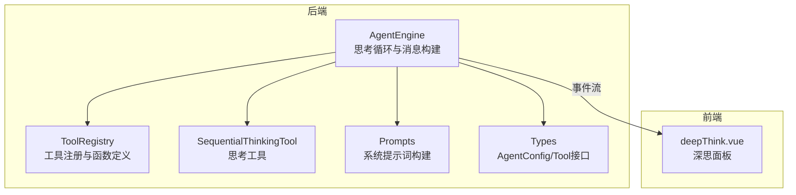
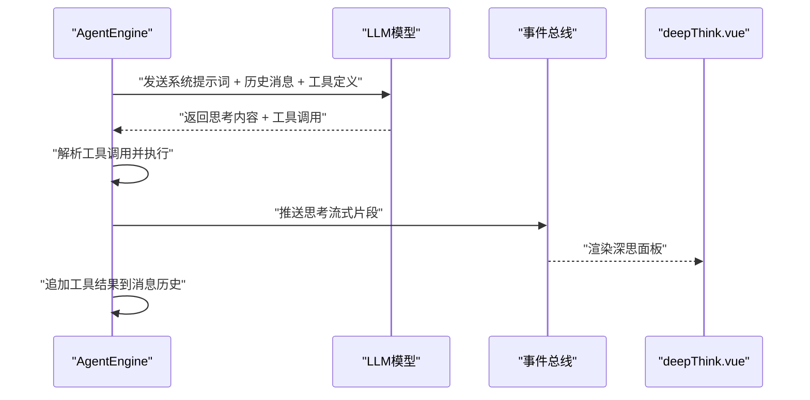
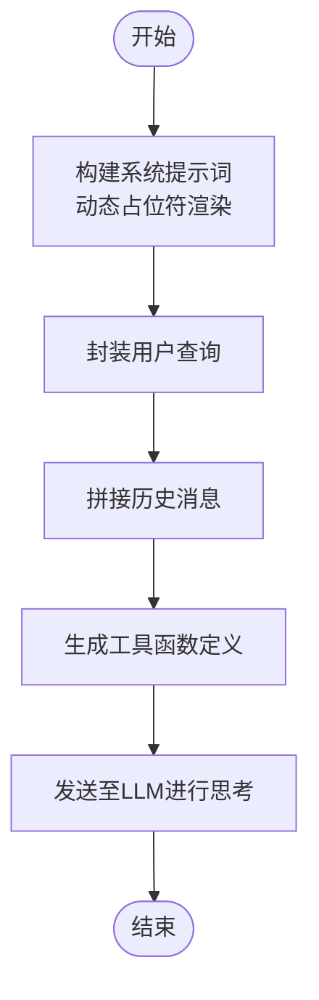
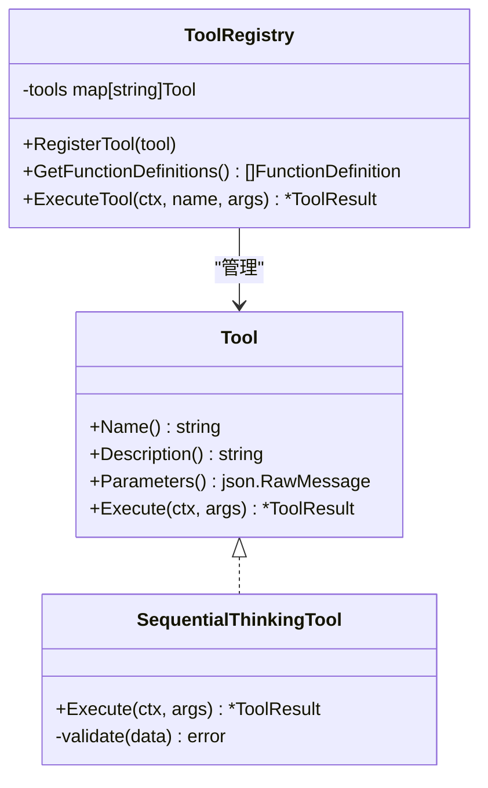
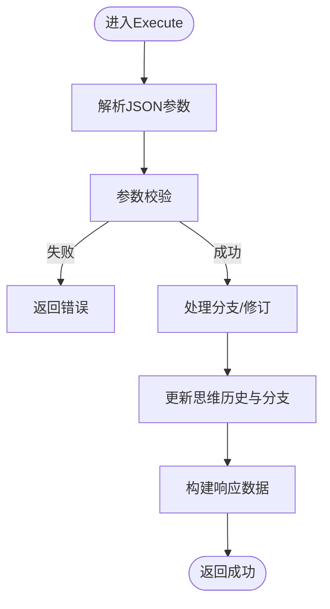
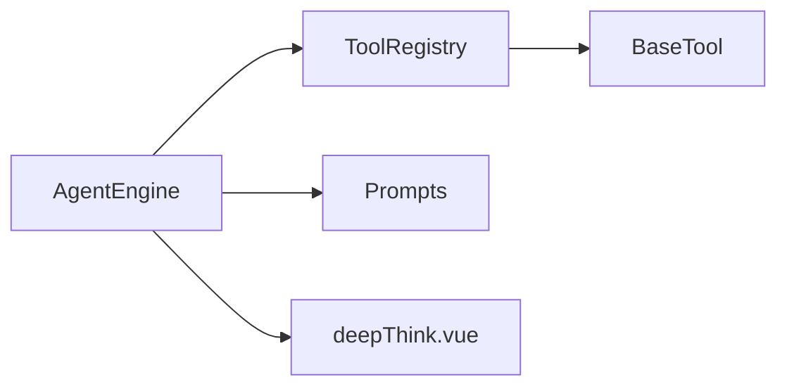

# 思考阶段实现

<cite>
**本文引用的文件**
- [internal/agent/engine.go](file://internal/agent/engine.go)
- [internal/agent/tools/sequentialthinking.go](file://internal/agent/tools/sequentialthinking.go)
- [internal/agent/tools/tool.go](file://internal/agent/tools/tool.go)
- [internal/agent/tools/registry.go](file://internal/agent/tools/registry.go)
- [internal/agent/prompts.go](file://internal/agent/prompts.go)
- [internal/types/agent.go](file://internal/types/agent.go)
- [internal/types/chat.go](file://internal/types/chat.go)
- [config/prompt_templates/system_prompt.yaml](file://config/prompt_templates/system_prompt.yaml)
- [frontend/src/views/chat/components/deepThink.vue](file://frontend/src/views/chat/components/deepThink.vue)
</cite>

## 目录
1. [简介](#简介)
2. [项目结构](#项目结构)
3. [核心组件](#核心组件)
4. [架构总览](#架构总览)
5. [详细组件分析](#详细组件分析)
6. [依赖分析](#依赖分析)
7. [性能考量](#性能考量)
8. [故障排查指南](#故障排查指南)
9. [结论](#结论)
10. [附录](#附录)

## 简介
本文聚焦“思考(Reason)”阶段的实现细节，系统阐述以下主题：
- LLM函数调用在思考阶段的实现原理与消息构建流程
- 温度参数(Temperature)对思考过程的影响与调节范围
- 思维模式(Thinking)的配置与启用方式
- 思考阶段的消息构建：系统提示词的动态生成、用户查询的封装、历史对话的上下文传递
- 工具定义的构建：可用工具列表生成、函数签名标准化格式、参数Schema验证机制
- 思考阶段的配置参数：最大思考时间、温度调节范围、思维深度控制等
- 实际代码示例路径：如何实现自定义的思考策略与提示词模板

## 项目结构
思考阶段位于后端Agent引擎与前端渲染组件之间，通过事件总线驱动思考流式输出与前端可视化。核心文件分布如下：
- 后端引擎与工具层：AgentEngine、工具注册与执行、工具基类与Schema
- 提示词模板与系统提示词构建：动态占位符渲染、知识库与Web搜索状态注入
- 类型定义：Agent配置、工具接口、函数调用响应
- 前端组件：深思面板，用于展示思考过程与流式内容

图表来源
- [internal/agent/engine.go](file://internal/agent/engine.go#L75-L155)
- [internal/agent/tools/registry.go](file://internal/agent/tools/registry.go#L47-L58)
- [internal/agent/tools/sequentialthinking.go](file://internal/agent/tools/sequentialthinking.go#L12-L129)
- [internal/agent/prompts.go](file://internal/agent/prompts.go#L301-L330)
- [internal/types/agent.go](file://internal/types/agent.go#L107-L120)
- [frontend/src/views/chat/components/deepThink.vue](file://frontend/src/views/chat/components/deepThink.vue#L1-L195)

章节来源
- [internal/agent/engine.go](file://internal/agent/engine.go#L75-L155)
- [internal/agent/tools/registry.go](file://internal/agent/tools/registry.go#L47-L58)
- [internal/agent/tools/sequentialthinking.go](file://internal/agent/tools/sequentialthinking.go#L12-L129)
- [internal/agent/prompts.go](file://internal/agent/prompts.go#L301-L330)
- [internal/types/agent.go](file://internal/types/agent.go#L107-L120)
- [frontend/src/views/chat/components/deepThink.vue](file://frontend/src/views/chat/components/deepThink.vue#L1-L195)

## 核心组件
- AgentEngine：负责思考循环、消息构建、工具函数定义生成、事件流式输出
- ToolRegistry：管理工具注册、函数定义导出、工具执行与清理
- SequentialThinkingTool：思考工具实现，支持分支、修订、动态调整思维深度
- Prompts：系统提示词模板与动态占位符渲染
- Types：AgentConfig、Tool接口、FunctionDefinition、ChatResponse等类型定义
- deepThink.vue：前端深思面板，展示思考流式内容与折叠/展开行为

章节来源
- [internal/agent/engine.go](file://internal/agent/engine.go#L25-L73)
- [internal/agent/tools/registry.go](file://internal/agent/tools/registry.go#L12-L27)
- [internal/agent/tools/sequentialthinking.go](file://internal/agent/tools/sequentialthinking.go#L131-L150)
- [internal/agent/prompts.go](file://internal/agent/prompts.go#L301-L330)
- [internal/types/agent.go](file://internal/types/agent.go#L107-L120)
- [frontend/src/views/chat/components/deepThink.vue](file://frontend/src/views/chat/components/deepThink.vue#L1-L195)

## 架构总览
思考阶段的端到端流程：
- AgentEngine在每轮迭代中调用LLM进行思考，携带系统提示词、历史消息与可用工具定义
- LLM根据系统提示词与上下文生成思考内容与工具调用
- AgentEngine解析工具调用，执行工具并追加结果到消息历史
- 通过事件总线将思考流式内容推送到前端，前端深思面板实时渲染

图表来源
- [internal/agent/engine.go](file://internal/agent/engine.go#L157-L521)
- [internal/agent/engine.go](file://internal/agent/engine.go#L664-L742)
- [frontend/src/views/chat/components/deepThink.vue](file://frontend/src/views/chat/components/deepThink.vue#L1-L195)

章节来源
- [internal/agent/engine.go](file://internal/agent/engine.go#L157-L521)
- [internal/agent/engine.go](file://internal/agent/engine.go#L664-L742)
- [frontend/src/views/chat/components/deepThink.vue](file://frontend/src/views/chat/components/deepThink.vue#L1-L195)

## 详细组件分析

### 思考阶段消息构建与系统提示词
- 系统提示词构建：根据知识库信息、Web搜索开关、当前时间与占位符动态生成
- 用户查询封装：将用户问题与历史消息拼接为消息数组
- 上下文传递：历史消息与工具结果持续累积，作为后续思考的上下文

图表来源
- [internal/agent/prompts.go](file://internal/agent/prompts.go#L301-L330)
- [internal/agent/engine.go](file://internal/agent/engine.go#L104-L127)
- [internal/agent/engine.go](file://internal/agent/engine.go#L114-L117)

章节来源
- [internal/agent/prompts.go](file://internal/agent/prompts.go#L301-L330)
- [internal/agent/engine.go](file://internal/agent/engine.go#L104-L127)
- [internal/agent/engine.go](file://internal/agent/engine.go#L114-L117)

### LLM函数调用与工具定义
- 工具注册：ToolRegistry统一注册工具，导出函数定义（名称、描述、参数Schema）
- 函数签名标准化：FunctionDefinition包含名称、描述与参数Schema
- 参数Schema验证：工具执行前进行参数校验，确保输入合法
- 工具执行：AgentEngine解析工具调用，调用ToolRegistry执行并收集结果

图表来源
- [internal/agent/tools/tool.go](file://internal/agent/tools/tool.go#L10-L47)
- [internal/agent/tools/registry.go](file://internal/agent/tools/registry.go#L12-L58)
- [internal/agent/tools/sequentialthinking.go](file://internal/agent/tools/sequentialthinking.go#L131-L239)
- [internal/types/agent.go](file://internal/types/agent.go#L107-L120)

章节来源
- [internal/agent/tools/tool.go](file://internal/agent/tools/tool.go#L10-L47)
- [internal/agent/tools/registry.go](file://internal/agent/tools/registry.go#L12-L58)
- [internal/agent/tools/sequentialthinking.go](file://internal/agent/tools/sequentialthinking.go#L131-L239)
- [internal/types/agent.go](file://internal/types/agent.go#L107-L120)

### 思维模式(Thinking)的配置与启用
- 配置入口：AgentConfig中包含Thinking字段（指针），用于控制是否启用扩展思考模式
- 启用方式：在streamThinkingToEventBus中将Thinking传入ChatOptions，交由底层模型决定是否启用
- 作用范围：仅影响思考阶段的工具调用与流式输出，不影响工具执行本身

章节来源
- [internal/types/agent.go](file://internal/types/agent.go#L32-L33)
- [internal/agent/engine.go](file://internal/agent/engine.go#L675-L679)
- [internal/agent/engine.go](file://internal/agent/engine.go#L688-L741)

### 温度参数(Temperature)对思考过程的影响
- 影响范围：Temperature控制LLM输出的随机性与创造性，进而影响思考的多样性与稳定性
- 调节范围：后端对话配置校验温度范围为0~2；前端普通模式与Agent模式分别提供滑条调节
- 作用机制：AgentEngine在streamThinkingToEventBus中将Temperature传入ChatOptions，影响思考阶段的采样行为

章节来源
- [internal/handler/tenant.go](file://internal/handler/tenant.go#L759-L761)
- [frontend/src/views/settings/AgentSettings.vue](file://frontend/src/views/settings/AgentSettings.vue#L86-L106)
- [internal/agent/engine.go](file://internal/agent/engine.go#L675-L679)

### 思考工具(SequentialThinkingTool)的实现要点
- 输入参数Schema：包含thought、next_thought_needed、thought_number、total_thoughts等字段
- 参数校验：确保thought非空、thought_number与total_thoughts≥1
- 分支与修订：支持branch_from_thought、branch_id、is_revision等字段，实现思维分支与修订
- 响应结构：返回结构化数据，包含思维进度、分支列表、显示类型等

图表来源
- [internal/agent/tools/sequentialthinking.go](file://internal/agent/tools/sequentialthinking.go#L161-L239)
- [internal/agent/tools/sequentialthinking.go](file://internal/agent/tools/sequentialthinking.go#L241-L259)

章节来源
- [internal/agent/tools/sequentialthinking.go](file://internal/agent/tools/sequentialthinking.go#L161-L239)
- [internal/agent/tools/sequentialthinking.go](file://internal/agent/tools/sequentialthinking.go#L241-L259)

### 工具定义构建与函数签名标准化
- 工具函数定义：ToolRegistry.GetFunctionDefinitions遍历注册工具，生成FunctionDefinition列表
- 标准化格式：包含name、description、parameters（JSON Schema）
- 参数Schema：工具通过BaseTool.Parameters返回Schema，用于LLM函数调用参数约束

章节来源
- [internal/agent/tools/registry.go](file://internal/agent/tools/registry.go#L47-L58)
- [internal/agent/tools/tool.go](file://internal/agent/tools/tool.go#L36-L39)

### 思考阶段的配置参数说明
- 最大思考时间：通过MaxIterations限制ReAct迭代次数，避免无限循环
- 温度调节范围：0~2（后端校验），前端提供滑条调节
- 思维深度控制：通过total_thoughts与thought_number动态调整，支持分支与修订
- 思维模式开关：Thinking指针控制是否启用扩展思考模式

章节来源
- [internal/types/agent.go](file://internal/types/agent.go#L12-L36)
- [internal/handler/tenant.go](file://internal/handler/tenant.go#L759-L761)
- [internal/agent/tools/sequentialthinking.go](file://internal/agent/tools/sequentialthinking.go#L83-L128)

### 实际代码示例路径（如何实现自定义思考策略与提示词模板）
- 自定义思考策略：可在SequentialThinkingTool基础上扩展参数Schema与执行逻辑，例如增加“思维深度”或“反思频率”控制
- 自定义提示词模板：通过config/prompt_templates/system_prompt.yaml新增模板，或在AgentConfig中使用SystemPrompt字段注入动态模板
- 前端渲染：deepThink.vue负责深思面板的流式渲染与折叠行为，可扩展为支持Markdown渲染或富文本展示

章节来源
- [internal/agent/tools/sequentialthinking.go](file://internal/agent/tools/sequentialthinking.go#L131-L239)
- [config/prompt_templates/system_prompt.yaml](file://config/prompt_templates/system_prompt.yaml#L1-L114)
- [frontend/src/views/chat/components/deepThink.vue](file://frontend/src/views/chat/components/deepThink.vue#L1-L195)

## 依赖分析
- AgentEngine依赖ToolRegistry进行工具注册与执行，依赖Prompts构建系统提示词
- ToolRegistry依赖Tool接口与BaseTool基类，统一管理工具生命周期
- 前端deepThink.vue依赖事件总线数据流，渲染思考内容

图表来源
- [internal/agent/engine.go](file://internal/agent/engine.go#L25-L73)
- [internal/agent/tools/registry.go](file://internal/agent/tools/registry.go#L12-L27)
- [internal/agent/tools/tool.go](file://internal/agent/tools/tool.go#L10-L15)
- [frontend/src/views/chat/components/deepThink.vue](file://frontend/src/views/chat/components/deepThink.vue#L1-L195)

章节来源
- [internal/agent/engine.go](file://internal/agent/engine.go#L25-L73)
- [internal/agent/tools/registry.go](file://internal/agent/tools/registry.go#L12-L27)
- [internal/agent/tools/tool.go](file://internal/agent/tools/tool.go#L10-L15)
- [frontend/src/views/chat/components/deepThink.vue](file://frontend/src/views/chat/components/deepThink.vue#L1-L195)

## 性能考量
- 流式输出：通过事件总线逐片推送思考内容，减少一次性渲染压力
- 工具调用去重：在单轮中限制thinking工具调用次数，避免重复思考导致的性能浪费
- 上下文累积：历史消息与工具结果持续累积，建议在配置中合理设置历史轮数与最大迭代次数

## 故障排查指南
- 工具参数解析失败：检查工具Schema与参数是否匹配，查看日志中的错误信息
- 思考工具重复调用：关注AgentEngine中的去重逻辑，避免在一轮中多次调用thinking
- 温度过高导致输出不稳定：适当降低Temperature，提升思考稳定性
- 系统提示词缺失占位符：确认模板中占位符是否正确渲染，特别是{{web_search_status}}与{{current_time}}

章节来源
- [internal/agent/engine.go](file://internal/agent/engine.go#L277-L291)
- [internal/agent/tools/sequentialthinking.go](file://internal/agent/tools/sequentialthinking.go#L165-L182)

## 结论
思考阶段通过AgentEngine与ToolRegistry协作，实现了可配置、可扩展的函数调用与流式思考输出。系统提示词的动态生成与上下文传递保障了思考的连贯性；温度参数与思维模式配置提供了对思考过程可控的调节手段；SequentialThinkingTool的Schema化设计与分支修订能力增强了思维的灵活性与鲁棒性。前端深思面板则提供了直观的思考过程可视化。

## 附录
- 提示词模板示例：参见config/prompt_templates/system_prompt.yaml，支持多角色与多场景模板
- 类型定义参考：AgentConfig、Tool接口、FunctionDefinition、ChatResponse等