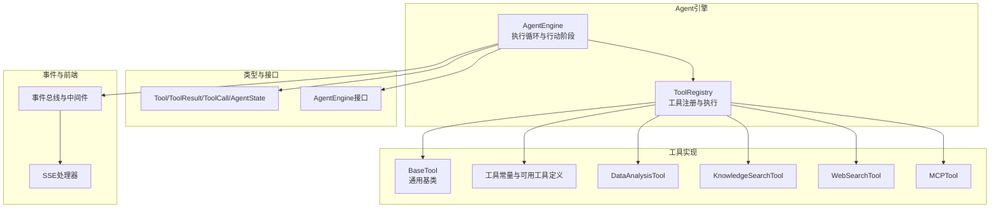
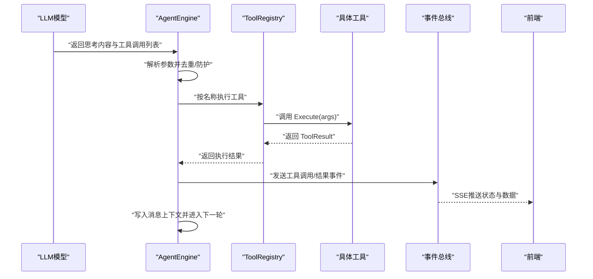
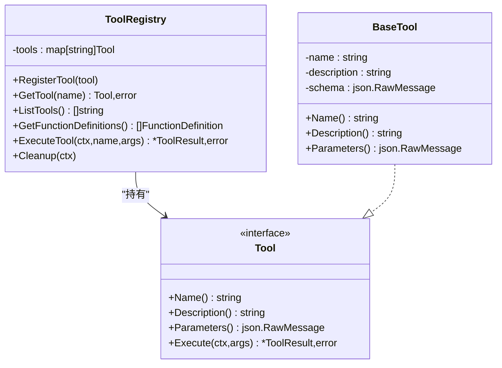
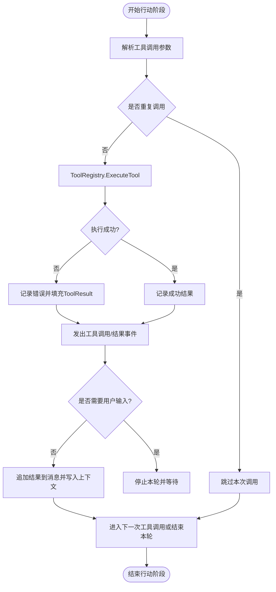
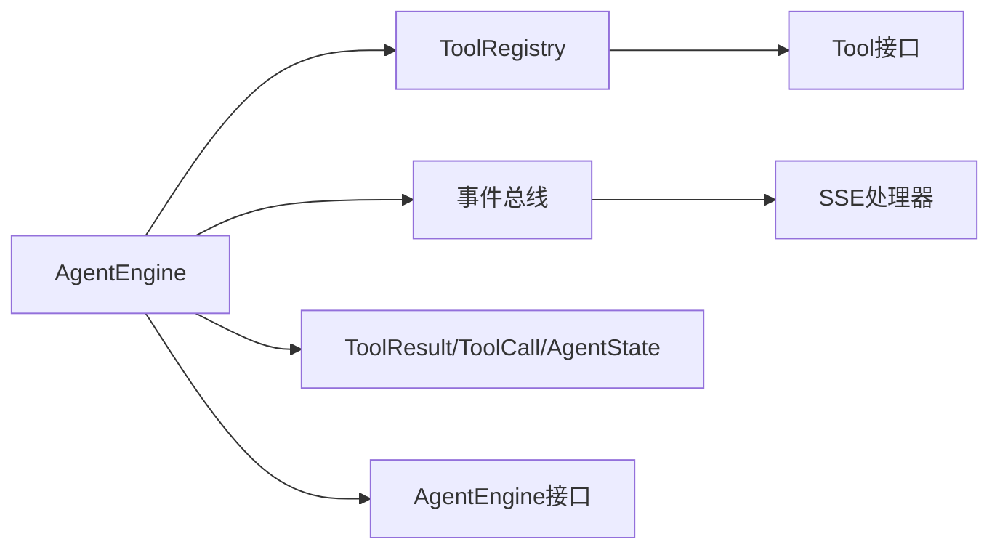

# 行动阶段实现

<cite>
**本文引用的文件**
- [internal/agent/engine.go](file://internal/agent/engine.go)
- [internal/agent/tools/registry.go](file://internal/agent/tools/registry.go)
- [internal/agent/tools/tool.go](file://internal/agent/tools/tool.go)
- [internal/agent/tools/definitions.go](file://internal/agent/tools/definitions.go)
- [internal/agent/tools/data_analysis.go](file://internal/agent/tools/data_analysis.go)
- [internal/agent/tools/knowledge_search.go](file://internal/agent/tools/knowledge_search.go)
- [internal/agent/tools/web_search.go](file://internal/agent/tools/web_search.go)
- [internal/agent/tools/mcp_tool.go](file://internal/agent/tools/mcp_tool.go)
- [internal/types/agent.go](file://internal/types/agent.go)
- [internal/types/interfaces/agent.go](file://internal/types/interfaces/agent.go)
- [internal/application/service/chat_pipline/chat_pipline.go](file://internal/application/service/chat_pipline/chat_pipline.go)
- [internal/handler/session/agent_stream_handler.go](file://internal/handler/session/agent_stream_handler.go)
- [internal/event/usage_example.md](file://internal/event/usage_example.md)
</cite>

## 目录
1. [引言](#引言)
2. [项目结构](#项目结构)
3. [核心组件](#核心组件)
4. [架构总览](#架构总览)
5. [详细组件分析](#详细组件分析)
6. [依赖分析](#依赖分析)
7. [性能考虑](#性能考虑)
8. [故障排查指南](#故障排查指南)
9. [结论](#结论)
10. [附录](#附录)

## 引言
本文件聚焦“行动（Action）”阶段的技术实现，系统阐述工具调用的执行流程、工具注册表管理机制、参数解析与验证、工具选择策略（含优先级与条件触发）、循环调用防护、工具生命周期管理（初始化、参数绑定、执行监控、结果收集、错误处理），以及行动阶段的配置参数（如工具超时、并发限制、重试机制）。同时提供自定义工具注册与调用示例路径，并说明工具执行状态的实时监控方式。

## 项目结构
行动阶段位于后端 Agent 引擎内部，围绕 AgentEngine 的执行循环展开，通过 ToolRegistry 统一管理工具注册与调用，工具实现位于 internal/agent/tools 下，类型定义与接口位于 internal/types 中，事件流与前端交互由事件总线与处理器负责。

图表来源
- [internal/agent/engine.go](file://internal/agent/engine.go#L157-L521)
- [internal/agent/tools/registry.go](file://internal/agent/tools/registry.go#L12-L113)
- [internal/agent/tools/tool.go](file://internal/agent/tools/tool.go#L10-L86)
- [internal/agent/tools/definitions.go](file://internal/agent/tools/definitions.go#L3-L60)
- [internal/types/agent.go](file://internal/types/agent.go#L107-L178)
- [internal/types/interfaces/agent.go](file://internal/types/interfaces/agent.go#L21-L47)
- [internal/application/service/chat_pipline/chat_pipline.go](file://internal/application/service/chat_pipline/chat_pipline.go#L9-L86)
- [internal/handler/session/agent_stream_handler.go](file://internal/handler/session/agent_stream_handler.go#L159-L196)

章节来源
- [internal/agent/engine.go](file://internal/agent/engine.go#L157-L521)
- [internal/agent/tools/registry.go](file://internal/agent/tools/registry.go#L12-L113)
- [internal/agent/tools/tool.go](file://internal/agent/tools/tool.go#L10-L86)
- [internal/agent/tools/definitions.go](file://internal/agent/tools/definitions.go#L3-L60)
- [internal/types/agent.go](file://internal/types/agent.go#L107-L178)
- [internal/types/interfaces/agent.go](file://internal/types/interfaces/agent.go#L21-L47)
- [internal/application/service/chat_pipline/chat_pipline.go](file://internal/application/service/chat_pipline/chat_pipline.go#L9-L86)
- [internal/handler/session/agent_stream_handler.go](file://internal/handler/session/agent_stream_handler.go#L159-L196)

## 核心组件
- AgentEngine：负责 ReAct 循环，其中行动阶段在 executeLoop 中完成工具调用、结果收集与上下文写入。
- ToolRegistry：统一注册、检索、执行工具，并输出标准化日志与事件。
- 工具接口与基类：Tool 接口定义工具能力；BaseTool 提供通用名称、描述、参数 Schema。
- 工具实现：知识检索、数据分析、网络搜索、MCP 工具等。
- 类型与事件：ToolResult/ToolCall/AgentState 描述执行结果与状态；事件总线驱动前后端交互。

章节来源
- [internal/agent/engine.go](file://internal/agent/engine.go#L25-L73)
- [internal/agent/tools/registry.go](file://internal/agent/tools/registry.go#L12-L113)
- [internal/agent/tools/tool.go](file://internal/agent/tools/tool.go#L10-L86)
- [internal/types/agent.go](file://internal/types/agent.go#L107-L178)

## 架构总览
行动阶段的执行序列如下：

图表来源
- [internal/agent/engine.go](file://internal/agent/engine.go#L159-L477)
- [internal/agent/tools/registry.go](file://internal/agent/tools/registry.go#L60-L103)
- [internal/handler/session/agent_stream_handler.go](file://internal/handler/session/agent_stream_handler.go#L159-L196)

## 详细组件分析

### 工具注册与执行（ToolRegistry）
- 注册与检索：通过名称映射存储工具实例，支持列出工具与导出函数定义。
- 执行流程：先获取工具，再调用 Execute(args)，最后统一记录 Pipeline 日志（成功/失败/警告）。
- 生命周期清理：针对特定工具（如数据分析）提供 Cleanup。

图表来源
- [internal/agent/tools/registry.go](file://internal/agent/tools/registry.go#L12-L113)
- [internal/agent/tools/tool.go](file://internal/agent/tools/tool.go#L10-L47)
- [internal/types/agent.go](file://internal/types/agent.go#L107-L120)

章节来源
- [internal/agent/tools/registry.go](file://internal/agent/tools/registry.go#L12-L113)
- [internal/agent/tools/tool.go](file://internal/agent/tools/tool.go#L10-L47)
- [internal/types/agent.go](file://internal/types/agent.go#L107-L120)

### 行动阶段执行流程（AgentEngine.executeLoop）
- 参数解析与校验：将 LLM 返回的工具调用参数反序列化为 map，记录并打印参数明细。
- 循环调用防护：同一轮内对“thinking”工具进行计数，超过一次则跳过以避免无限思考循环。
- 工具调用：通过 ToolRegistry 执行工具，记录耗时与结果，统一发出事件。
- 结果收集与上下文写入：将工具调用与结果追加到消息历史，并写入上下文管理器。
- 用户输入等待：若工具返回 requires_user_input，则停止当前循环，等待用户响应。

图表来源
- [internal/agent/engine.go](file://internal/agent/engine.go#L261-L477)

章节来源
- [internal/agent/engine.go](file://internal/agent/engine.go#L261-L477)

### 工具参数解析与验证
- 参数绑定：将 LLM 返回的 JSON 字符串反序列化为 map，便于后续工具读取。
- 验证与错误处理：工具内部对输入进行严格校验（如必填字段、范围、格式），失败时返回 ToolResult 并记录错误。
- 输出格式：统一返回 ToolResult，包含 success、output、data、error 字段，便于前端渲染与后续处理。

章节来源
- [internal/agent/engine.go](file://internal/agent/engine.go#L293-L303)
- [internal/types/agent.go](file://internal/types/agent.go#L122-L138)

### 工具选择策略与条件触发
- 工具清单构建：AgentEngine 从 ToolRegistry 获取函数定义，注入到 LLM 的工具列表中。
- 可用工具集合：通过工具常量与默认允许列表控制启用范围。
- 条件触发：工具自身根据输入与上下文决定是否执行（例如网络搜索仅在知识库检索不足时触发）。

章节来源
- [internal/agent/engine.go](file://internal/agent/engine.go#L523-L539)
- [internal/agent/tools/definitions.go](file://internal/agent/tools/definitions.go#L27-L60)

### 循环调用防护
- 同轮去重：对“thinking”工具在同一轮内的调用次数进行计数，超过一次即跳过。
- 轮次边界：每轮结束后才允许新的思考循环，避免连续多轮重复思考。

章节来源
- [internal/agent/engine.go](file://internal/agent/engine.go#L277-L291)

### 工具生命周期管理
- 初始化：工具构造时注入依赖（服务、连接、配置等）。
- 参数绑定：Execute 接收 json.RawMessage，工具自行解析为结构化输入。
- 执行监控：统一记录 Pipeline 日志（info/warn/error），并发出事件。
- 结果收集：封装为 ToolResult，包含结构化 data 与人类可读 output。
- 错误处理：捕获执行错误与业务错误，统一返回并记录。
- 清理：部分工具在会话结束或注册表清理时释放资源。

章节来源
- [internal/agent/tools/data_analysis.go](file://internal/agent/tools/data_analysis.go#L56-L77)
- [internal/agent/tools/registry.go](file://internal/agent/tools/registry.go#L60-L103)

### 自定义工具注册与调用示例路径
- 注册新工具：实现 Tool 接口（Name/Description/Parameters/Execute），并通过 ToolRegistry.RegisterTool 注册。
- 在 AgentEngine 中生效：通过 ToolRegistry.GetFunctionDefinitions 将工具暴露给 LLM。
- 示例参考：
  - 工具接口与基类：[internal/agent/tools/tool.go](file://internal/agent/tools/tool.go#L10-L47)
  - 工具常量与默认允许列表：[internal/agent/tools/definitions.go](file://internal/agent/tools/definitions.go#L3-L60)
  - 数据分析工具（含清理逻辑）：[internal/agent/tools/data_analysis.go](file://internal/agent/tools/data_analysis.go#L56-L77)
  - 知识检索工具（参数校验与结果封装）：[internal/agent/tools/knowledge_search.go](file://internal/agent/tools/knowledge_search.go#L154-L200)
  - 网络搜索工具（条件触发与压缩）：[internal/agent/tools/web_search.go](file://internal/agent/tools/web_search.go#L110-L200)

章节来源
- [internal/agent/tools/tool.go](file://internal/agent/tools/tool.go#L10-L47)
- [internal/agent/tools/definitions.go](file://internal/agent/tools/definitions.go#L3-L60)
- [internal/agent/tools/data_analysis.go](file://internal/agent/tools/data_analysis.go#L56-L77)
- [internal/agent/tools/knowledge_search.go](file://internal/agent/tools/knowledge_search.go#L154-L200)
- [internal/agent/tools/web_search.go](file://internal/agent/tools/web_search.go#L110-L200)

### 工具执行状态实时监控
- 事件驱动：AgentEngine 在工具调用前后发出事件（工具调用、工具结果、最终答案等）。
- SSE 推送：SSE 处理器将事件转换为前端可消费的数据流，合并工具结果数据用于渲染。
- 日志与追踪：统一使用 PipelineInfo/PipelineWarn/PipelineError 记录关键指标（工具名、参数、耗时、成功与否、错误）。

章节来源
- [internal/agent/engine.go](file://internal/agent/engine.go#L305-L436)
- [internal/handler/session/agent_stream_handler.go](file://internal/handler/session/agent_stream_handler.go#L159-L196)
- [internal/event/usage_example.md](file://internal/event/usage_example.md#L303-L364)

## 依赖分析
- AgentEngine 依赖 ToolRegistry 进行工具管理，依赖事件总线进行状态广播。
- ToolRegistry 依赖 types.Tool 接口与 ToolResult 结构。
- 工具实现依赖各自的服务接口（知识库、检索、网络搜索、MCP 等）。
- 前端通过 SSE 接收事件，结合工具返回的 data 字段进行可视化。

图表来源
- [internal/agent/engine.go](file://internal/agent/engine.go#L25-L73)
- [internal/agent/tools/registry.go](file://internal/agent/tools/registry.go#L12-L113)
- [internal/types/agent.go](file://internal/types/agent.go#L107-L178)
- [internal/types/interfaces/agent.go](file://internal/types/interfaces/agent.go#L21-L47)

章节来源
- [internal/agent/engine.go](file://internal/agent/engine.go#L25-L73)
- [internal/agent/tools/registry.go](file://internal/agent/tools/registry.go#L12-L113)
- [internal/types/agent.go](file://internal/types/agent.go#L107-L178)
- [internal/types/interfaces/agent.go](file://internal/types/interfaces/agent.go#L21-L47)

## 性能考虑
- 工具执行耗时统计：记录每次工具调用的毫秒级耗时，便于定位慢工具。
- 上下文写入成本：工具结果写入上下文管理器，需关注持久化开销。
- 事件流吞吐：SSE 推送与事件中间件可能成为瓶颈，建议按需裁剪事件粒度。
- 资源清理：数据分析等工具在会话结束或注册表清理时主动释放资源，降低内存占用。

章节来源
- [internal/agent/engine.go](file://internal/agent/engine.go#L305-L332)
- [internal/agent/tools/data_analysis.go](file://internal/agent/tools/data_analysis.go#L56-L77)

## 故障排查指南
- 工具未找到：检查 ToolRegistry 是否正确注册，或名称是否一致。
- 参数解析失败：确认 LLM 返回的参数 JSON 格式正确，必要时在工具内部增加更详细的错误提示。
- 执行异常：查看 Pipeline 日志中的 error 字段，结合事件总线输出定位问题。
- 循环卡死：检查是否存在多次调用“thinking”的情况，确保防护逻辑生效。
- 前端无更新：确认事件总线已注册监听，SSE 处理器正常运行。

章节来源
- [internal/agent/tools/registry.go](file://internal/agent/tools/registry.go#L60-L103)
- [internal/agent/engine.go](file://internal/agent/engine.go#L277-L291)
- [internal/handler/session/agent_stream_handler.go](file://internal/handler/session/agent_stream_handler.go#L159-L196)

## 结论
行动阶段通过 ToolRegistry 实现工具的统一管理与执行，结合 AgentEngine 的执行循环完成参数解析、工具选择、调用防护、结果收集与上下文写入。借助事件总线与 SSE，实现了工具执行状态的实时监控与前端可视化。通过严格的参数验证与生命周期管理，保证了系统的稳定性与可观测性。

## 附录

### 行动阶段配置参数说明
- 最大迭代轮次：控制 ReAct 循环的最大轮数，防止无限循环。
- 温度系数：影响 LLM 的创造性，间接影响工具调用频率与质量。
- 允许工具列表：限定可用工具集合，减少不必要的工具调用。
- 网络搜索开关与最大结果数：控制网络搜索工具的启用与返回数量。
- MCP 服务选择模式与服务列表：控制 MCP 工具的注册范围。
- 多轮对话与历史轮数：控制上下文长度与历史保留策略。

章节来源
- [internal/types/agent.go](file://internal/types/agent.go#L12-L36)
- [internal/agent/tools/definitions.go](file://internal/agent/tools/definitions.go#L45-L60)