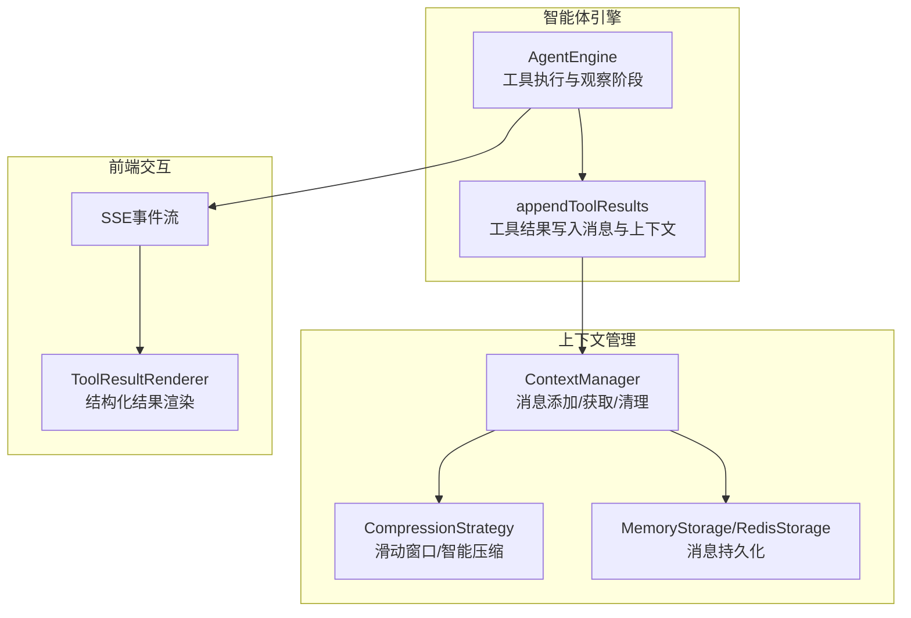
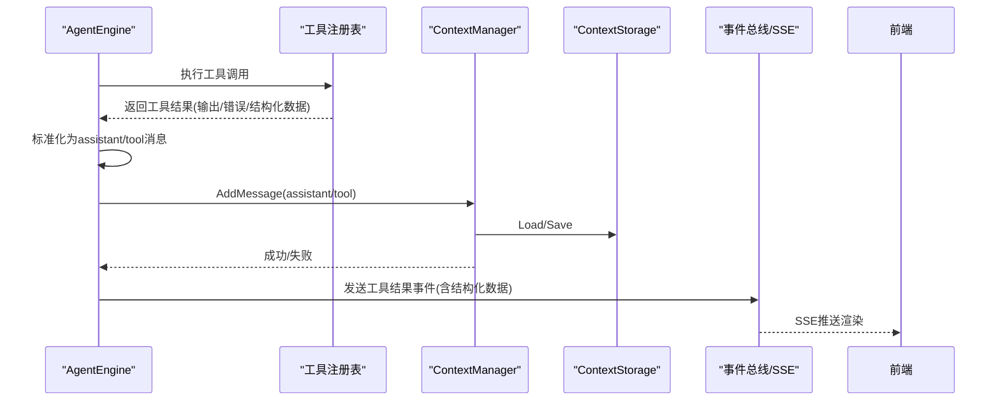
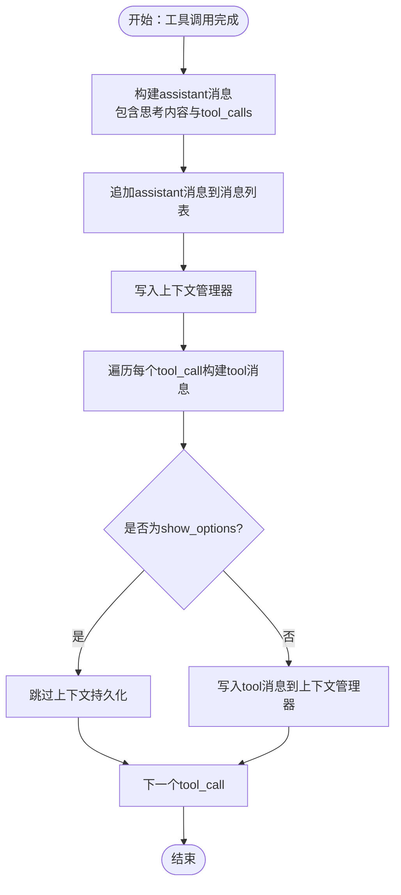
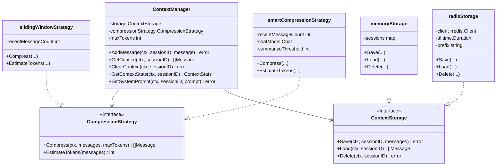
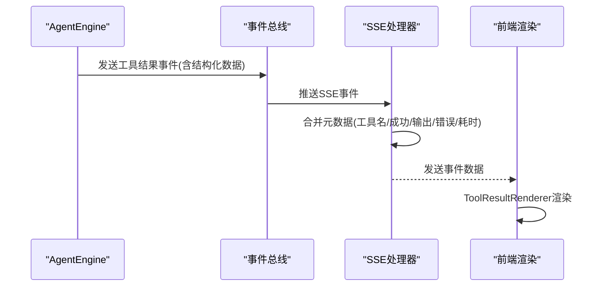
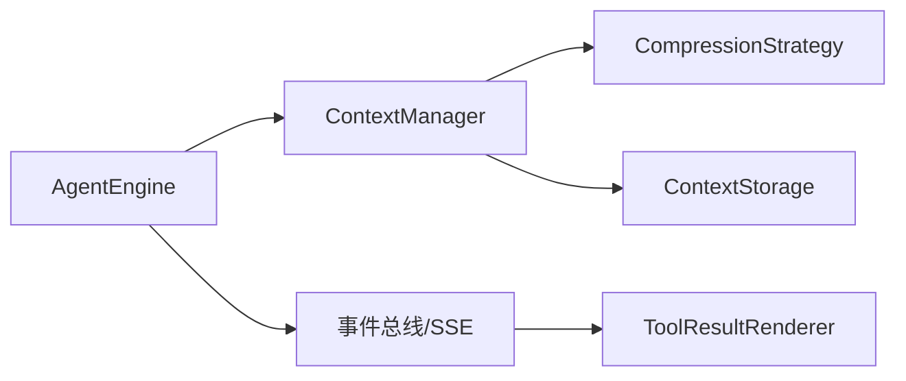

# 观察阶段实现

<cite>
**本文档引用的文件**
- [internal/agent/engine.go](file://internal/agent/engine.go)
- [internal/application/service/llmcontext/context_manager.go](file://internal/application/service/llmcontext/context_manager.go)
- [internal/application/service/llmcontext/compression_strategies.go](file://internal/application/service/llmcontext/compression_strategies.go)
- [internal/application/service/llmcontext/context_manager_factory.go](file://internal/application/service/llmcontext/context_manager_factory.go)
- [internal/application/service/llmcontext/memory_storage.go](file://internal/application/service/llmcontext/memory_storage.go)
- [internal/application/service/llmcontext/redis_storage.go](file://internal/application/service/llmcontext/redis_storage.go)
- [internal/types/interfaces/context_manager.go](file://internal/types/interfaces/context_manager.go)
- [internal/types/chat.go](file://internal/types/chat.go)
- [internal/application/service/chat_pipline/load_history.go](file://internal/application/service/chat_pipline/load_history.go)
- [internal/handler/session/agent_stream_handler.go](file://internal/handler/session/agent_stream_handler.go)
- [frontend/src/views/chat/components/ToolResultRenderer.vue](file://frontend/src/views/chat/components/ToolResultRenderer.vue)
- [internal/config/config.go](file://internal/config/config.go)
</cite>

## 目录
1. [引言](#引言)
2. [项目结构](#项目结构)
3. [核心组件](#核心组件)
4. [架构概览](#架构概览)
5. [详细组件分析](#详细组件分析)
6. [依赖关系分析](#依赖关系分析)
7. [性能考虑](#性能考虑)
8. [故障排除指南](#故障排除指南)
9. [结论](#结论)

## 引言
本文件深入解析 WiseDx 项目中"观察(Observe)"阶段的实现机制，重点涵盖以下方面：
- 工具结果的收集与处理流程
- 消息历史的更新策略与上下文管理器集成
- 观察阶段的数据流转：工具输出标准化、错误信息提取与格式化、结构化数据解析与存储
- 上下文管理与历史压缩清理的协作机制
- 观察阶段的配置参数说明与最佳实践
- 自定义观察逻辑与上下文更新策略的实际代码示例路径

## 项目结构
观察阶段位于智能体引擎内部，贯穿工具执行、结果收集、消息持久化与上下文压缩的完整链路。前端通过事件总线接收工具结果并渲染。

**图表来源**
- [internal/agent/engine.go](file://internal/agent/engine.go#L541-L620)
- [internal/application/service/llmcontext/context_manager.go](file://internal/application/service/llmcontext/context_manager.go#L45-L144)
- [internal/application/service/llmcontext/compression_strategies.go](file://internal/application/service/llmcontext/compression_strategies.go#L1-L243)
- [internal/application/service/llmcontext/memory_storage.go](file://internal/application/service/llmcontext/memory_storage.go#L1-L66)
- [internal/application/service/llmcontext/redis_storage.go](file://internal/application/service/llmcontext/redis_storage.go#L1-L128)
- [internal/handler/session/agent_stream_handler.go](file://internal/handler/session/agent_stream_handler.go#L159-L196)
- [frontend/src/views/chat/components/ToolResultRenderer.vue](file://frontend/src/views/chat/components/ToolResultRenderer.vue#L88-L137)

**章节来源**
- [internal/agent/engine.go](file://internal/agent/engine.go#L541-L620)
- [internal/application/service/llmcontext/context_manager.go](file://internal/application/service/llmcontext/context_manager.go#L45-L144)

## 核心组件
- AgentEngine：负责工具调用、结果收集、消息构建与上下文写入
- ContextManager：封装上下文业务逻辑，负责消息加载、追加、压缩与保存
- CompressionStrategy：提供滑动窗口与智能压缩两种策略
- ContextStorage：内存与Redis两种存储后端
- 事件总线与SSE：将工具结果以事件形式推送到前端进行渲染

**章节来源**
- [internal/agent/engine.go](file://internal/agent/engine.go#L300-L500)
- [internal/types/interfaces/context_manager.go](file://internal/types/interfaces/context_manager.go#L9-L31)

## 架构概览
观察阶段在智能体循环中执行，主要步骤如下：
1. 工具调用完成后，将工具调用与结果标准化为消息
2. 将"assistant"与"tool"两类消息写入上下文管理器
3. 上下文管理器根据策略进行压缩与保存
4. 通过事件总线与SSE将结果传递给前端渲染

**图表来源**
- [internal/agent/engine.go](file://internal/agent/engine.go#L300-L500)
- [internal/agent/engine.go](file://internal/agent/engine.go#L541-L620)
- [internal/application/service/llmcontext/context_manager.go](file://internal/application/service/llmcontext/context_manager.go#L45-L144)
- [internal/handler/session/agent_stream_handler.go](file://internal/handler/session/agent_stream_handler.go#L159-L196)

## 详细组件分析

### 工具结果收集与标准化
- 工具调用完成后，AgentEngine会记录输出预览、错误信息与结构化数据，并将工具调用与结果写入当前轮次的步骤中
- appendToolResults方法将工具调用标准化为OpenAI风格的消息格式：
  - assistant消息：包含思考内容与tool_calls数组
  - tool消息：包含工具输出或错误信息，以及对应的tool_call_id
- 特殊处理：对于show_options工具，仅用于前端显示，不写入上下文

**图表来源**
- [internal/agent/engine.go](file://internal/agent/engine.go#L541-L620)

**章节来源**
- [internal/agent/engine.go](file://internal/agent/engine.go#L300-L500)
- [internal/agent/engine.go](file://internal/agent/engine.go#L541-L620)

### 消息历史更新策略与上下文管理器集成
- ContextManager.AddMessage负责完整流程：加载现有消息、追加新消息、估算token数、必要时压缩、最后保存
- 支持两种压缩策略：
  - 滑动窗口：保留系统消息与最近N条普通消息
  - 智能压缩：当旧消息数量超过阈值时，使用LLM生成摘要，再保留系统消息、摘要与最近消息
- 存储后端支持内存与Redis，Redis版本具备TTL与键前缀配置

**图表来源**
- [internal/types/interfaces/context_manager.go](file://internal/types/interfaces/context_manager.go#L9-L53)
- [internal/application/service/llmcontext/compression_strategies.go](file://internal/application/service/llmcontext/compression_strategies.go#L13-L243)
- [internal/application/service/llmcontext/memory_storage.go](file://internal/application/service/llmcontext/memory_storage.go#L11-L66)
- [internal/application/service/llmcontext/redis_storage.go](file://internal/application/service/llmcontext/redis_storage.go#L14-L128)

**章节来源**
- [internal/application/service/llmcontext/context_manager.go](file://internal/application/service/llmcontext/context_manager.go#L45-L144)
- [internal/application/service/llmcontext/compression_strategies.go](file://internal/application/service/llmcontext/compression_strategies.go#L25-L182)
- [internal/application/service/llmcontext/memory_storage.go](file://internal/application/service/llmcontext/memory_storage.go#L24-L65)
- [internal/application/service/llmcontext/redis_storage.go](file://internal/application/service/llmcontext/redis_storage.go#L49-L127)

### 数据流转与事件推送
- 工具执行完成后，AgentEngine通过事件总线发出两类事件：
  - 工具结果事件：包含输出、错误、成功标志、持续时间与结构化数据
  - 工具执行事件：用于内部监控
- SSE处理器将事件转换为前端可消费的响应，合并结构化数据以支持富文本渲染

**图表来源**
- [internal/agent/engine.go](file://internal/agent/engine.go#L405-L436)
- [internal/handler/session/agent_stream_handler.go](file://internal/handler/session/agent_stream_handler.go#L159-L196)
- [frontend/src/views/chat/components/ToolResultRenderer.vue](file://frontend/src/views/chat/components/ToolResultRenderer.vue#L88-L137)

**章节来源**
- [internal/agent/engine.go](file://internal/agent/engine.go#L405-L436)
- [internal/handler/session/agent_stream_handler.go](file://internal/handler/session/agent_stream_handler.go#L159-L196)
- [frontend/src/views/chat/components/ToolResultRenderer.vue](file://frontend/src/views/chat/components/ToolResultRenderer.vue#L88-L137)

### 历史信息加载与对话历史构建
- PluginLoadHistory插件负责加载历史对话，移除<think>标记并按请求ID分组
- 支持最大轮次限制与时间排序，确保多轮对话的历史上下文正确拼接

**章节来源**
- [internal/application/service/chat_pipline/load_history.go](file://internal/application/service/chat_pipline/load_history.go#L45-L126)

## 依赖关系分析
- AgentEngine依赖ContextManager进行消息持久化；ContextManager进一步依赖CompressionStrategy与ContextStorage
- 前端通过SSE与事件总线接收工具结果，ToolResultRenderer根据display_type选择对应组件渲染

**图表来源**
- [internal/agent/engine.go](file://internal/agent/engine.go#L541-L620)
- [internal/application/service/llmcontext/context_manager.go](file://internal/application/service/llmcontext/context_manager.go#L45-L144)
- [internal/handler/session/agent_stream_handler.go](file://internal/handler/session/agent_stream_handler.go#L159-L196)
- [frontend/src/views/chat/components/ToolResultRenderer.vue](file://frontend/src/views/chat/components/ToolResultRenderer.vue#L88-L137)

**章节来源**
- [internal/agent/engine.go](file://internal/agent/engine.go#L541-L620)
- [internal/application/service/llmcontext/context_manager.go](file://internal/application/service/llmcontext/context_manager.go#L45-L144)

## 性能考虑
- Token估算：两种压缩策略均提供粗略估算（字符数/4），用于快速判断是否需要压缩
- 智能压缩成本：当旧消息数量超过阈值时，调用LLM生成摘要，带来额外推理开销
- 存储后端：Redis具备TTL与序列化/反序列化成本，适合分布式场景；内存存储适合单实例与低延迟需求
- 前端渲染：结构化数据合并与组件切换可能带来UI渲染压力，建议在前端做虚拟滚动与懒加载

[本节为通用指导，无需特定文件分析]

## 故障排除指南
- 工具执行失败：检查工具返回的Error字段与事件总线日志，确认错误信息已正确格式化
- 上下文保存失败：查看ContextManager的错误日志，确认存储后端连接与序列化状态
- 压缩异常：若智能压缩失败，系统会回退到保留所有消息的策略，确保对话连贯性
- 前端渲染异常：检查SSE事件数据结构，确保结构化数据字段完整且display_type正确

**章节来源**
- [internal/agent/engine.go](file://internal/agent/engine.go#L342-L369)
- [internal/application/service/llmcontext/context_manager.go](file://internal/application/service/llmcontext/context_manager.go#L91-L94)
- [internal/application/service/llmcontext/compression_strategies.go](file://internal/application/service/llmcontext/compression_strategies.go#L152-L160)

## 结论
观察阶段通过标准化工具结果、集成上下文管理器与事件总线，实现了高效、可扩展的消息持久化与前端渲染。结合滑动窗口与智能压缩策略，能够在保证对话质量的同时控制上下文窗口大小。建议根据部署环境选择合适的存储后端，并针对前端渲染进行性能优化。