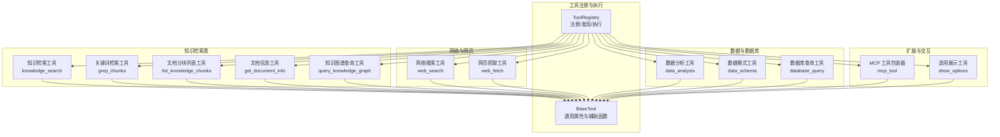
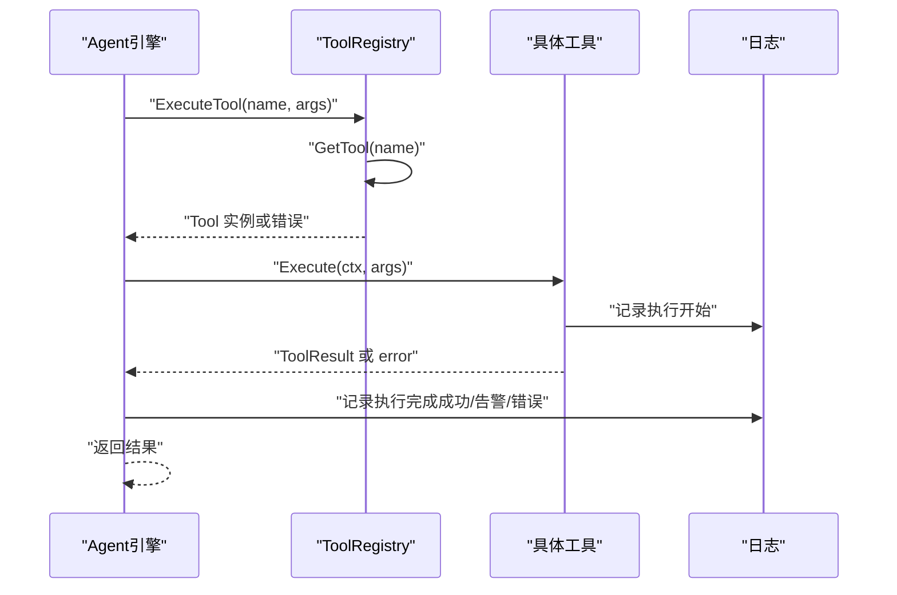
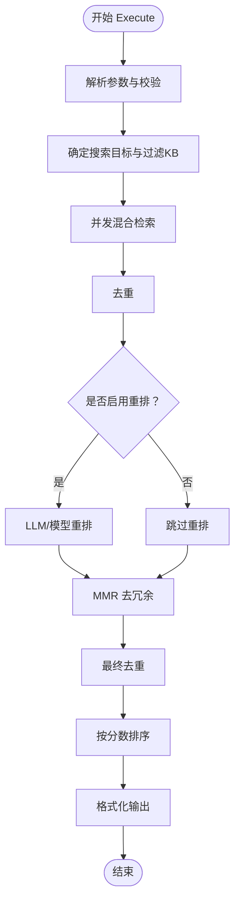
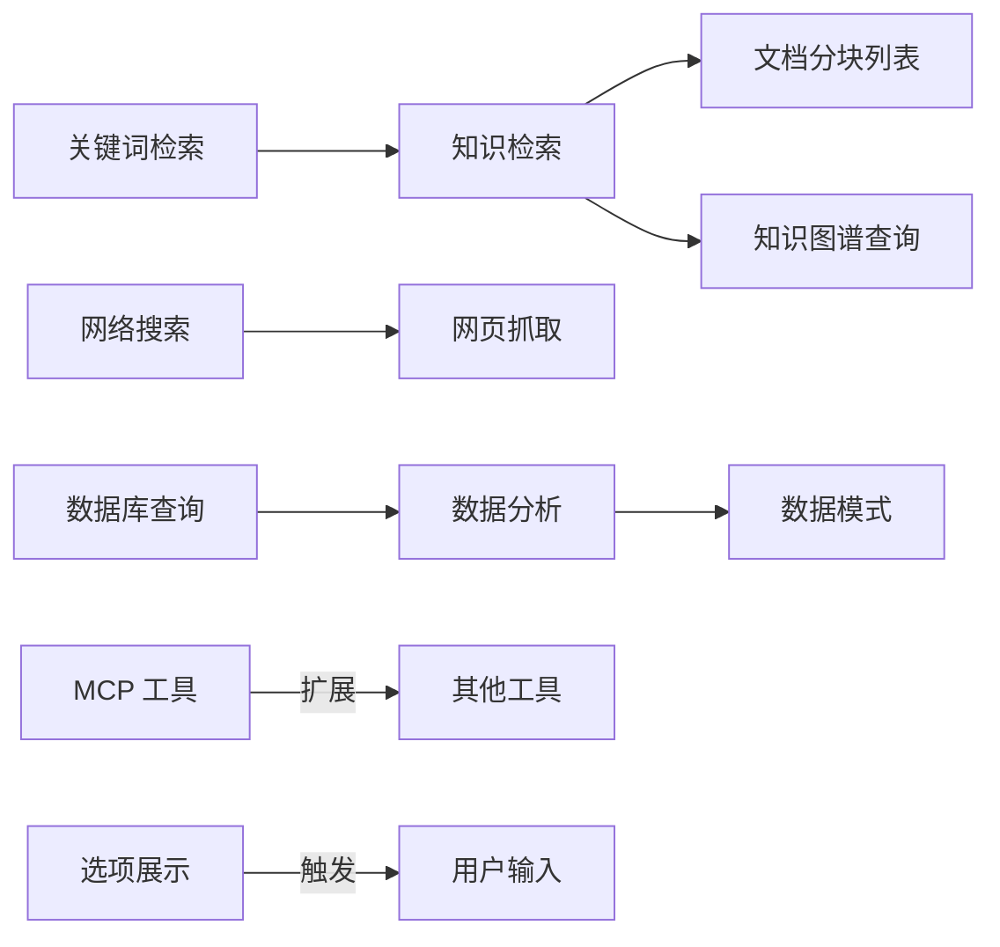

# 内置工具

<cite>
**本文引用的文件**
- [internal/agent/tools/registry.go](file://internal/agent/tools/registry.go)
- [internal/agent/tools/tool.go](file://internal/agent/tools/tool.go)
- [internal/agent/tools/definitions.go](file://internal/agent/tools/definitions.go)
- [internal/agent/tools/knowledge_search.go](file://internal/agent/tools/knowledge_search.go)
- [internal/agent/tools/grep_chunks.go](file://internal/agent/tools/grep_chunks.go)
- [internal/agent/tools/list_knowledge_chunks.go](file://internal/agent/tools/list_knowledge_chunks.go)
- [internal/agent/tools/get_document_info.go](file://internal/agent/tools/get_document_info.go)
- [internal/agent/tools/query_knowledge_graph.go](file://internal/agent/tools/query_knowledge_graph.go)
- [internal/agent/tools/web_search.go](file://internal/agent/tools/web_search.go)
- [internal/agent/tools/web_fetch.go](file://internal/agent/tools/web_fetch.go)
- [internal/agent/tools/data_analysis.go](file://internal/agent/tools/data_analysis.go)
- [internal/agent/tools/data_schema.go](file://internal/agent/tools/data_schema.go)
- [internal/agent/tools/database_query.go](file://internal/agent/tools/database_query.go)
- [internal/agent/tools/mcp_tool.go](file://internal/agent/tools/mcp_tool.go)
- [internal/agent/tools/show_options.go](file://internal/agent/tools/show_options.go)
</cite>

## 目录
1. [简介](#简介)
2. [项目结构](#项目结构)
3. [核心组件](#核心组件)
4. [架构总览](#架构总览)
5. [详细组件分析](#详细组件分析)
6. [依赖关系分析](#依赖关系分析)
7. [性能考虑](#性能考虑)
8. [故障排查指南](#故障排查指南)
9. [结论](#结论)
10. [附录](#附录)

## 简介
本文件为 WiseDx 内置工具集合的综合技术文档。系统通过统一的工具注册与执行框架，提供知识检索、网络搜索、数据分析、数据库查询、知识图谱查询、网页抓取与解析、文档信息查询、数据模式查看、MCP 工具桥接以及交互式选项展示等能力。文档涵盖：
- 工具参数 Schema 定义与输入校验
- 执行流程（参数解析、业务处理、结果封装）
- 输出格式规范与前端展示映射
- 错误处理策略与性能优化建议
- 工具间协作机制与依赖关系
- 配置选项与扩展点说明

## 项目结构
内置工具位于 internal/agent/tools 目录，采用“按功能模块划分”的组织方式，每个工具独立实现 Tool 接口，并通过 ToolRegistry 统一注册与调度。

图表来源
- [internal/agent/tools/registry.go](file://internal/agent/tools/registry.go#L1-L114)
- [internal/agent/tools/tool.go](file://internal/agent/tools/tool.go#L1-L86)
- [internal/agent/tools/knowledge_search.go](file://internal/agent/tools/knowledge_search.go#L1-L1402)
- [internal/agent/tools/grep_chunks.go](file://internal/agent/tools/grep_chunks.go#L1-L694)
- [internal/agent/tools/list_knowledge_chunks.go](file://internal/agent/tools/list_knowledge_chunks.go#L1-L298)
- [internal/agent/tools/get_document_info.go](file://internal/agent/tools/get_document_info.go#L1-L303)
- [internal/agent/tools/query_knowledge_graph.go](file://internal/agent/tools/query_knowledge_graph.go#L1-L394)
- [internal/agent/tools/web_search.go](file://internal/agent/tools/web_search.go#L1-L285)
- [internal/agent/tools/web_fetch.go](file://internal/agent/tools/web_fetch.go#L1-L662)
- [internal/agent/tools/data_analysis.go](file://internal/agent/tools/data_analysis.go#L1-L475)
- [internal/agent/tools/data_schema.go](file://internal/agent/tools/data_schema.go#L1-L115)
- [internal/agent/tools/database_query.go](file://internal/agent/tools/database_query.go#L1-L330)
- [internal/agent/tools/mcp_tool.go](file://internal/agent/tools/mcp_tool.go#L1-L320)
- [internal/agent/tools/show_options.go](file://internal/agent/tools/show_options.go#L1-L129)

章节来源
- [internal/agent/tools/registry.go](file://internal/agent/tools/registry.go#L1-L114)
- [internal/agent/tools/tool.go](file://internal/agent/tools/tool.go#L1-L86)

## 核心组件
- 工具注册中心（ToolRegistry）
  - 职责：注册工具、按名称检索、列出工具、生成函数定义、统一执行与清理
  - 关键方法：RegisterTool、GetTool、ListTools、GetFunctionDefinitions、ExecuteTool、Cleanup
- 基础工具（BaseTool）
  - 职责：统一存储工具名称、描述、参数 Schema；提供通用辅助函数（如相关度等级、匹配类型格式化）
- 工具常量与可用工具清单
  - 职责：集中管理工具名常量与默认允许列表，供前端与配置使用

章节来源
- [internal/agent/tools/registry.go](file://internal/agent/tools/registry.go#L12-L114)
- [internal/agent/tools/tool.go](file://internal/agent/tools/tool.go#L10-L86)
- [internal/agent/tools/definitions.go](file://internal/agent/tools/definitions.go#L3-L60)

## 架构总览
工具执行链路如下：
- Agent 引擎通过 ToolRegistry 获取工具定义与实例
- 对传入参数进行 JSON 解析与 Schema 校验
- 调用具体工具 Execute 方法执行业务逻辑
- 将结果封装为 ToolResult（包含 Success、Output、Data、Error）
- 记录流水日志（PipelineInfo/PipelineWarn/PipelineError）

图表来源
- [internal/agent/tools/registry.go](file://internal/agent/tools/registry.go#L60-L103)

章节来源
- [internal/agent/tools/registry.go](file://internal/agent/tools/registry.go#L60-L103)

## 详细组件分析

### 知识检索工具（knowledge_search）
- 功能特性
  - 向量与关键词混合检索，支持多查询融合
  - 可选 LLM 重排与传统重排模型重排
  - 最大相关性（MMR）去重，提升多样性
  - 支持知识库类型区分（FAQ 不参与重排）
- 参数 Schema
  - queries：必填，1–5 个语义查询
  - knowledge_base_ids：可选，限制检索范围
- 输入校验
  - 校验 queries 非空；按租户会话配置或全局配置读取 topK、阈值等参数
- 执行流程
  - 并发对多个搜索目标执行混合检索
  - 去重 → 重排（优先 LLM，其次模型，否则跳过）→ MMR → 最终去重 → 排序 → 格式化输出
- 输出格式
  - ToolResult.Data 中包含 results、count、display_type 等字段，前端按“知识检索结果”渲染
- 性能优化
  - 并发搜索减少总耗时；先去重再重排降低后续处理成本
- 错误处理
  - 参数解析失败、无可用搜索目标、重排失败等场景返回错误并记录日志

图表来源
- [internal/agent/tools/knowledge_search.go](file://internal/agent/tools/knowledge_search.go#L154-L407)

章节来源
- [internal/agent/tools/knowledge_search.go](file://internal/agent/tools/knowledge_search.go#L1-L1402)

### 关键词检索工具（grep_chunks）
- 功能特性
  - 固定字符串匹配，支持多关键字 OR 逻辑
  - 基于数据库的 ILIKE 模糊匹配，支持知识库/文档级过滤
  - 去重、评分、MMR 降冗余
- 参数 Schema
  - pattern：必填，1 个或多个关键字
  - knowledge_base_ids：可选，过滤知识库
  - max_results：可选，默认 50，上限 200
- 执行流程
  - 参数解析与校验 → 构建查询 → 执行 → 去重 → 评分 → MMR → 聚合 → 格式化输出
- 输出格式
  - ToolResult.Data 中包含 patterns、knowledge_results、result_count、display_type 等

章节来源
- [internal/agent/tools/grep_chunks.go](file://internal/agent/tools/grep_chunks.go#L1-L694)

### 文档分块列表工具（list_knowledge_chunks）
- 功能特性
  - 分页列出指定文档的所有分块，支持文本与 FAQ 类型
- 参数 Schema
  - knowledge_id：必填
  - limit：默认 20，最大 100
  - offset：默认 0
- 执行流程
  - 参数校验 → 分页查询 → 组装输出 → 返回 ToolResult
- 输出格式
  - ToolResult.Data 中包含 knowledge_id、knowledge_title、chunks、page、page_size 等

章节来源
- [internal/agent/tools/list_knowledge_chunks.go](file://internal/agent/tools/list_knowledge_chunks.go#L1-L298)

### 文档信息工具（get_document_info）
- 功能特性
  - 并发批量查询文档元数据与分块计数
- 参数 Schema
  - knowledge_ids：必填，数组，最多 10 个
- 执行流程
  - 参数校验 → 并发查询 → 汇总成功/失败 → 格式化输出
- 输出格式
  - ToolResult.Data 中包含 documents、total_docs、requested、errors、display_type 等

章节来源
- [internal/agent/tools/get_document_info.go](file://internal/agent/tools/get_document_info.go#L1-L303)

### 知识图谱查询工具（query_knowledge_graph）
- 功能特性
  - 并发查询多个知识库的图谱，自动去重并按相关度排序
  - 若知识库未配置图谱抽取，则回退为常规检索
- 参数 Schema
  - knowledge_base_ids：必填，1–10 个
  - query：必填
- 执行流程
  - 参数校验 → 并发查询 → 收集结果与错误 → 去重 → 排序 → 格式化输出
- 输出格式
  - ToolResult.Data 中包含 results、count、kb_counts、graph_configs、graph_data、has_graph_config 等

章节来源
- [internal/agent/tools/query_knowledge_graph.go](file://internal/agent/tools/query_knowledge_graph.go#L1-L394)

### 网络搜索工具（web_search）
- 功能特性
  - 仅在 KB 检索不足时使用，支持 RAG 压缩与会话缓存
- 参数 Schema
  - query：必填
- 执行流程
  - 参数校验 → 读取租户配置 → 调用搜索服务 → 可选 RAG 压缩 → 格式化输出
- 输出格式
  - ToolResult.Data 中包含 query、results、count、display_type 等

章节来源
- [internal/agent/tools/web_search.go](file://internal/agent/tools/web_search.go#L1-L285)

### 网页抓取工具（web_fetch）
- 功能特性
  - 抓取网页内容并转换为 Markdown，可选调用小模型进行摘要
  - SSRF/重定向防护，DNS Pinning 与 Host Header 保留
- 参数 Schema
  - items：必填，数组，每项含 url 与 prompt
- 执行流程
  - 参数校验 → URL 规范化与安全校验 → 并发抓取 → HTML→Markdown → 可选摘要 → 汇总输出
- 输出格式
  - ToolResult.Data 中包含 results、count、display_type 等

章节来源
- [internal/agent/tools/web_fetch.go](file://internal/agent/tools/web_fetch.go#L1-L662)

### 数据分析工具（data_analysis）
- 功能特性
  - 将 CSV/XLSX 加载至 DuckDB，执行只读 SQL 查询
  - 严格 SQL 安全校验，禁止修改类操作
- 参数 Schema
  - knowledge_id：必填
  - sql：必填，只读查询
- 执行流程
  - 参数校验 → 加载知识到 DuckDB → 替换占位符 → 安全校验 → 单条查询执行 → 格式化输出
- 输出格式
  - ToolResult.Data 中包含 rows、row_count、query、display_type、session_id 等

章节来源
- [internal/agent/tools/data_analysis.go](file://internal/agent/tools/data_analysis.go#L1-L475)

### 数据模式工具（data_schema）
- 功能特性
  - 读取知识库中表格摘要与列信息分块，拼接输出
- 参数 Schema
  - knowledge_id：必填
- 执行流程
  - 参数校验 → 查询摘要与列分块 → 拼接输出 → 返回 ToolResult
- 输出格式
  - ToolResult.Data 中包含 summary、columns

章节来源
- [internal/agent/tools/data_schema.go](file://internal/agent/tools/data_schema.go#L1-L115)

### 数据库查询工具（database_query）
- 功能特性
  - 通过 GORM 执行只读 SQL，自动注入 tenant_id 进行安全过滤
  - 综合安全校验（注入风险检查、白名单表等）
- 参数 Schema
  - sql：必填，只读查询
- 执行流程
  - 参数校验 → 安全校验（注入风险、租户注入）→ 执行查询 → 格式化输出
- 输出格式
  - ToolResult.Data 中包含 columns、rows、row_count、query、tenant_id、display_type 等

章节来源
- [internal/agent/tools/database_query.go](file://internal/agent/tools/database_query.go#L1-L330)

### MCP 工具包装器（mcp_tool）
- 功能特性
  - 将外部 MCP 服务的工具包装为内置工具，统一命名与参数 Schema
  - 支持 stdio/其他传输方式，自动连接与断开
- 参数 Schema
  - 由 MCP 服务提供，若无则返回空对象
- 执行流程
  - 参数解析 → 获取/创建 MCP 客户端 → 调用工具 → 提取文本内容 → 返回 ToolResult
- 输出格式
  - ToolResult.Data 中包含 content_items 等

章节来源
- [internal/agent/tools/mcp_tool.go](file://internal/agent/tools/mcp_tool.go#L1-L320)

### 选项展示工具（show_options）
- 功能特性
  - 展示交互式选项按钮，等待用户选择后继续对话
- 参数 Schema
  - question：必填
  - options：必填，至少一个，含 label 与 value
  - multi_select：可选，默认 false
- 执行流程
  - 参数校验 → 格式化输出 → 设置 emit_quick_reply 与 requires_user_input 标记
- 输出格式
  - ToolResult.Data 中包含 question、options、multi_select、display_type、emit_quick_reply、requires_user_input

章节来源
- [internal/agent/tools/show_options.go](file://internal/agent/tools/show_options.go#L1-L129)

## 依赖关系分析
- 工具注册与执行
  - ToolRegistry 统一管理工具生命周期与执行
  - BaseTool 提供通用属性与辅助函数
- 工具间协作
  - 知识检索（knowledge_search）与关键词检索（grep_chunks）配合，先粗筛后精搜
  - 网络搜索（web_search）与网页抓取（web_fetch）配合，先概览后深挖
  - 数据分析（data_analysis）与数据模式（data_schema）配合，先看结构后执行查询
  - 知识图谱查询（query_knowledge_graph）与知识检索（knowledge_search）配合，先网络再图谱
- 外部依赖
  - 搜索与重排：嵌入向量、关键词混合、LLM 重排、传统重排模型
  - 数据库：GORM（只读）、DuckDB（只读 SQL）
  - 网络：HTTP/ChromeDP 抓取、SSRF 安全
  - MCP：远程工具调用桥接

图表来源
- [internal/agent/tools/knowledge_search.go](file://internal/agent/tools/knowledge_search.go#L1-L1402)
- [internal/agent/tools/grep_chunks.go](file://internal/agent/tools/grep_chunks.go#L1-L694)
- [internal/agent/tools/web_search.go](file://internal/agent/tools/web_search.go#L1-L285)
- [internal/agent/tools/web_fetch.go](file://internal/agent/tools/web_fetch.go#L1-L662)
- [internal/agent/tools/data_analysis.go](file://internal/agent/tools/data_analysis.go#L1-L475)
- [internal/agent/tools/data_schema.go](file://internal/agent/tools/data_schema.go#L1-L115)
- [internal/agent/tools/database_query.go](file://internal/agent/tools/database_query.go#L1-L330)
- [internal/agent/tools/mcp_tool.go](file://internal/agent/tools/mcp_tool.go#L1-L320)
- [internal/agent/tools/show_options.go](file://internal/agent/tools/show_options.go#L1-L129)

章节来源
- [internal/agent/tools/registry.go](file://internal/agent/tools/registry.go#L1-L114)

## 性能考虑
- 并发与去重
  - 知识检索与关键词检索均采用并发搜索与去重策略，显著降低重复计算
- 重排与多样性
  - LLM/模型重排与 MMR 的组合在保证相关度的同时提升多样性
- SQL 安全校验
  - DuckDB 与数据库查询工具均实施严格的只读与注入风险检查，避免慢查询与安全问题
- 抓取与限流
  - 网页抓取设置超时与字符上限，避免资源滥用
- 缓存与会话
  - 网络搜索支持会话级临时知识库缓存，避免重复索引

## 故障排查指南
- 参数解析失败
  - 现象：返回 ToolResult.Success=false，Error 字段包含解析错误
  - 排查：核对 JSON 结构与必填字段
- 无可用搜索目标
  - 现象：知识检索返回“未指定知识库且无可用搜索目标”
  - 排查：确认知识库配置与权限
- 重排失败
  - 现象：知识检索使用原始分数或警告日志
  - 排查：检查 LLM/重排模型可用性与配置
- SQL 注入或修改类操作被拒绝
  - 现象：数据分析/数据库查询返回安全校验失败
  - 排查：确保仅使用只读 SQL，避免多语句与危险函数
- 网页抓取失败
  - 现象：web_fetch 返回错误或部分失败
  - 排查：检查 URL 可达性、SSRF 防护规则、超时设置
- MCP 工具调用失败
  - 现象：返回错误消息或连接失败
  - 排查：确认 MCP 服务可用、传输方式正确、客户端连接释放

章节来源
- [internal/agent/tools/knowledge_search.go](file://internal/agent/tools/knowledge_search.go#L154-L407)
- [internal/agent/tools/data_analysis.go](file://internal/agent/tools/data_analysis.go#L79-L158)
- [internal/agent/tools/database_query.go](file://internal/agent/tools/database_query.go#L116-L252)
- [internal/agent/tools/web_fetch.go](file://internal/agent/tools/web_fetch.go#L100-L236)
- [internal/agent/tools/mcp_tool.go](file://internal/agent/tools/mcp_tool.go#L64-L134)

## 结论
内置工具体系通过统一的注册与执行框架，实现了从知识检索、网络搜索、数据分析到数据库查询、网页抓取、图谱探索与交互式选项展示的全链路能力。各工具在参数 Schema、输入校验、执行流程与输出格式上保持一致，便于前端统一渲染与 Agent 自动编排。通过并发、去重、重排与 MMR 等策略，兼顾准确性与多样性；通过严格的安全校验与防护措施，保障系统稳定与安全。

## 附录
- 工具清单与默认允许列表
  - 已注册工具：思考、制定计划、关键词搜索、语义搜索、查看文档分块、查询知识图谱、获取文档信息、查询数据库、数据分析、查看数据元信息、展示选项
  - 默认允许工具：除“思考”“制定计划”外，其余工具默认允许
- 配置与扩展
  - 工具参数 Schema 由各工具自行定义，支持 JSON Schema 校验
  - MCP 工具可通过服务端动态注册，实现第三方能力接入
  - 清理机制：数据分析师在退出时清理会话内创建的临时表

章节来源
- [internal/agent/tools/definitions.go](file://internal/agent/tools/definitions.go#L20-L60)
- [internal/agent/tools/registry.go](file://internal/agent/tools/registry.go#L105-L114)
- [internal/agent/tools/mcp_tool.go](file://internal/agent/tools/mcp_tool.go#L191-L256)