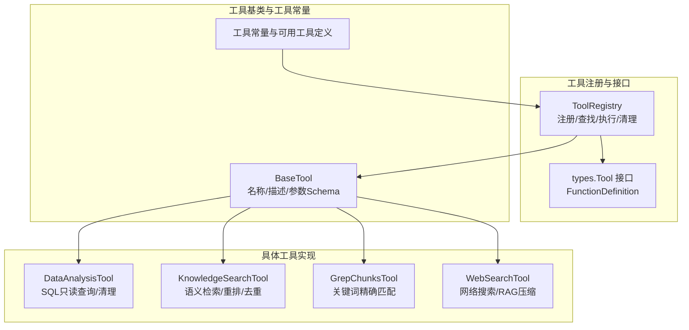
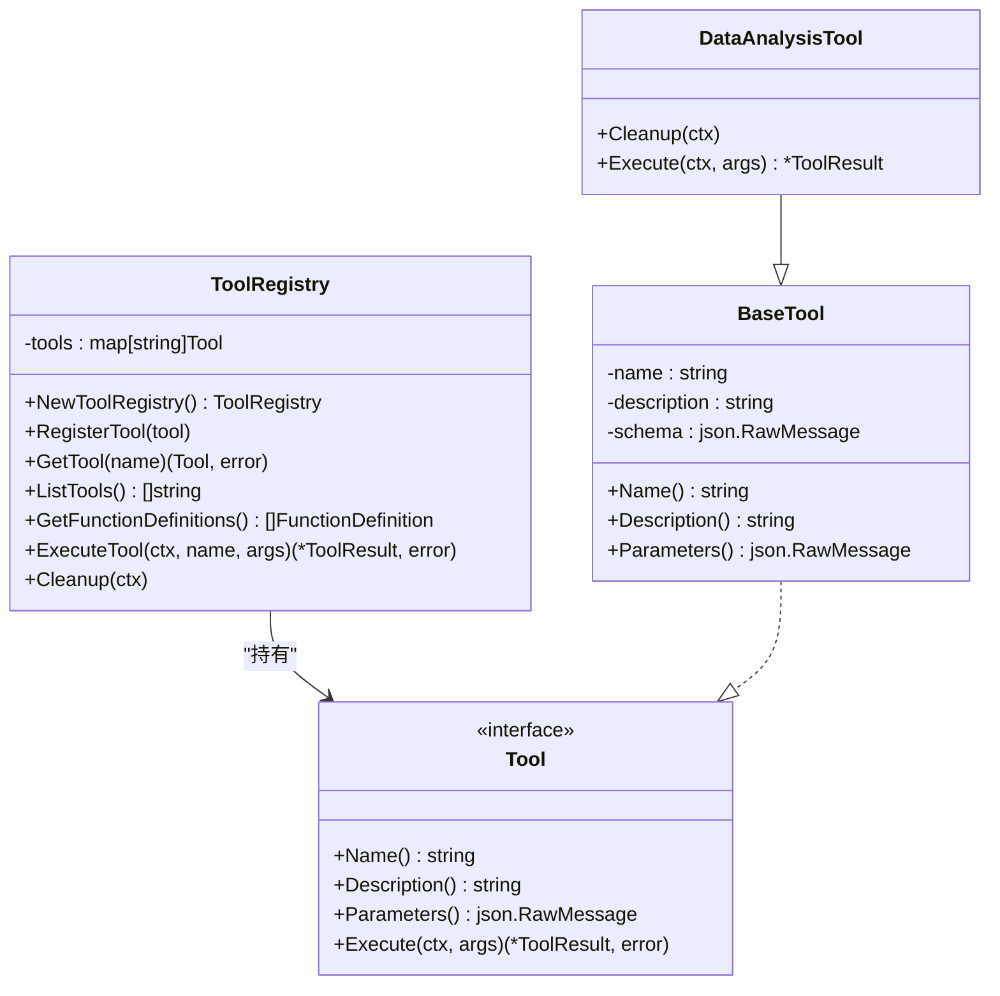
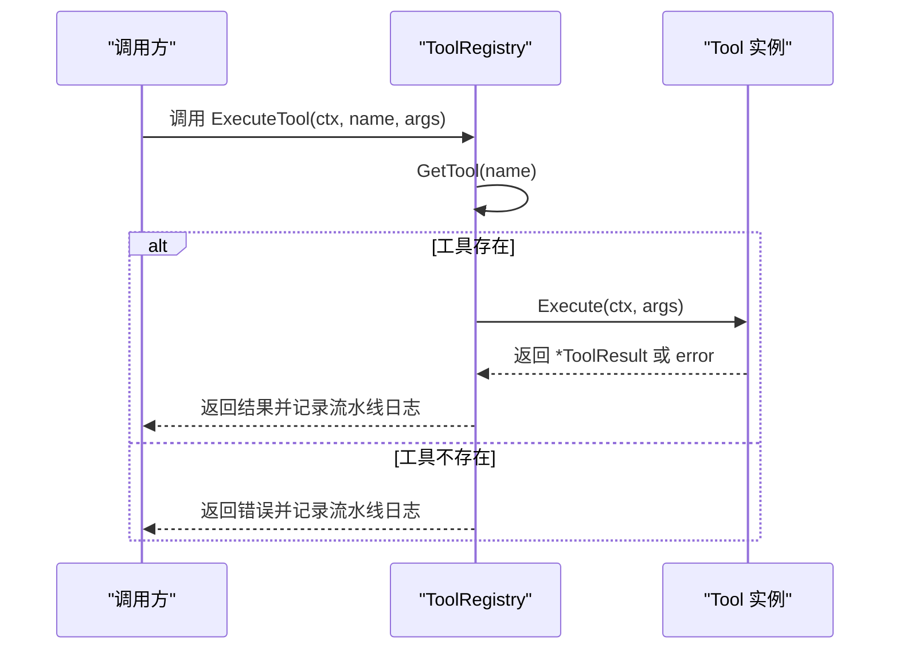
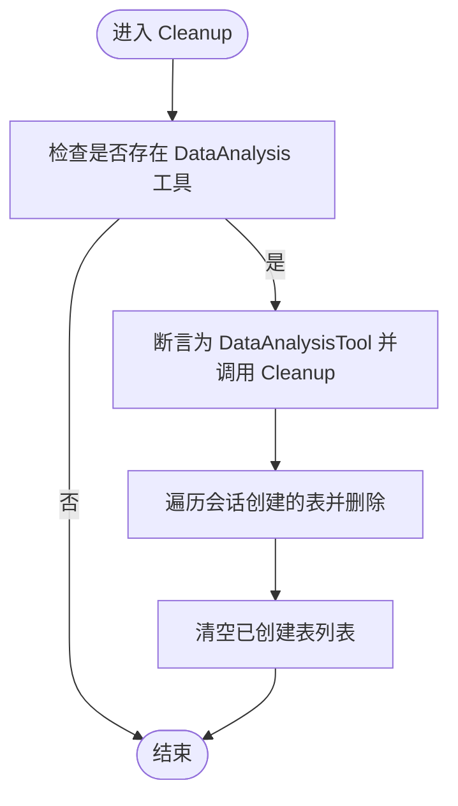
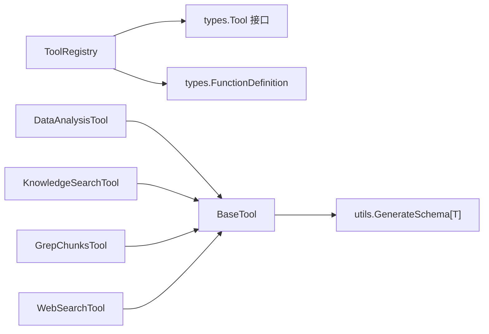

# 工具注册表

<cite>
**本文引用的文件**
- [internal/agent/tools/registry.go](file://internal/agent/tools/registry.go)
- [internal/agent/tools/tool.go](file://internal/agent/tools/tool.go)
- [internal/agent/tools/definitions.go](file://internal/agent/tools/definitions.go)
- [internal/agent/tools/data_analysis.go](file://internal/agent/tools/data_analysis.go)
- [internal/agent/tools/knowledge_search.go](file://internal/agent/tools/knowledge_search.go)
- [internal/agent/tools/grep_chunks.go](file://internal/agent/tools/grep_chunks.go)
- [internal/agent/tools/web_search.go](file://internal/agent/tools/web_search.go)
- [internal/types/agent.go](file://internal/types/agent.go)
- [internal/utils/json.go](file://internal/utils/json.go)
</cite>

## 目录
1. [简介](#简介)
2. [项目结构](#项目结构)
3. [核心组件](#核心组件)
4. [架构总览](#架构总览)
5. [详细组件分析](#详细组件分析)
6. [依赖分析](#依赖分析)
7. [性能考虑](#性能考虑)
8. [故障排查指南](#故障排查指南)
9. [结论](#结论)
10. [附录](#附录)

## 简介
本文件围绕工具注册表（ToolRegistry）展开，系统性阐述其设计原理、工具存储机制、注册与查找流程、函数定义生成过程、执行与清理策略，并结合具体工具实现给出最佳实践与排错建议。目标是帮助开发者在不直接阅读源码的情况下，也能高效理解并正确使用工具注册表。

## 项目结构
工具注册表位于内部工具子系统，与工具基类、工具常量定义、各类具体工具实现以及类型接口共同构成完整的工具体系。

**图表来源**
- [internal/agent/tools/registry.go](file://internal/agent/tools/registry.go#L12-L15)
- [internal/agent/tools/tool.go](file://internal/agent/tools/tool.go#L10-L15)
- [internal/agent/tools/definitions.go](file://internal/agent/tools/definitions.go#L3-L18)
- [internal/types/agent.go](file://internal/types/agent.go#L107-L120)

**章节来源**
- [internal/agent/tools/registry.go](file://internal/agent/tools/registry.go#L1-L114)
- [internal/agent/tools/tool.go](file://internal/agent/tools/tool.go#L1-L86)
- [internal/agent/tools/definitions.go](file://internal/agent/tools/definitions.go#L1-L60)
- [internal/types/agent.go](file://internal/types/agent.go#L107-L178)

## 核心组件
- ToolRegistry：集中管理工具注册、查找、执行与清理；提供函数定义导出用于LLM函数调用适配。
- Tool 接口：统一工具能力契约，要求提供名称、描述、参数Schema与执行逻辑。
- BaseTool：为具体工具提供通用字段与方法，确保参数Schema通过类型推断自动生成。
- 工具常量与可用工具定义：集中维护工具名称常量与UI暴露的可用工具清单。
- 具体工具：如DataAnalysisTool、KnowledgeSearchTool、GrepChunksTool、WebSearchTool等，均实现Tool接口。

**章节来源**
- [internal/agent/tools/registry.go](file://internal/agent/tools/registry.go#L12-L15)
- [internal/types/agent.go](file://internal/types/agent.go#L107-L120)
- [internal/agent/tools/tool.go](file://internal/agent/tools/tool.go#L10-L15)
- [internal/agent/tools/definitions.go](file://internal/agent/tools/definitions.go#L3-L18)

## 架构总览
工具注册表采用“键值映射”的存储结构，以工具名称为键，工具实例为值。注册时依据工具名称写入；查找时按名称读取；执行时先查找再调用；清理时对特定工具进行资源回收。

**图表来源**
- [internal/agent/tools/registry.go](file://internal/agent/tools/registry.go#L12-L15)
- [internal/types/agent.go](file://internal/types/agent.go#L107-L120)
- [internal/agent/tools/tool.go](file://internal/agent/tools/tool.go#L10-L15)
- [internal/agent/tools/data_analysis.go](file://internal/agent/tools/data_analysis.go#L27-L33)

## 详细组件分析

### ToolRegistry 设计与实现
- 存储机制：内部使用字符串到工具接口的映射，键为工具名称，值为实现了Tool接口的实例。
- 注册流程：RegisterTool 将工具按名称写入映射，实现“同名覆盖”语义；若需避免重复，应在上层调用前自行检查。
- 查找算法：GetTool 通过存在性判断返回对应工具或错误，时间复杂度为O(1)。
- 函数定义生成：GetFunctionDefinitions 遍历已注册工具，提取名称、描述与参数Schema，形成LLM函数调用所需的FunctionDefinition列表。
- 执行流程：ExecuteTool 先通过GetTool查找工具，若不存在则记录错误并返回；若存在则调用工具的Execute方法，同时根据执行结果与错误输出不同级别的流水线日志。
- 清理机制：Cleanup 仅针对特定工具（如DataAnalysisTool）进行资源回收，避免对未实现清理接口的工具造成破坏性调用。

**图表来源**
- [internal/agent/tools/registry.go](file://internal/agent/tools/registry.go#L60-L103)

**章节来源**
- [internal/agent/tools/registry.go](file://internal/agent/tools/registry.go#L12-L114)

### RegisterTool 的实现细节
- 唯一性约束：注册时以工具名称作为键写入映射，若重复注册会覆盖旧实例。若需严格唯一性，应在上层调用前显式检查是否存在同名工具。
- 类型安全保证：传入参数必须实现Tool接口，编译期即可保证名称、描述、参数Schema与执行方法的存在性。

**章节来源**
- [internal/agent/tools/registry.go](file://internal/agent/tools/registry.go#L24-L27)
- [internal/types/agent.go](file://internal/types/agent.go#L107-L120)

### GetTool 的错误处理策略
- 未命中返回：当名称不存在时，返回明确的错误信息，便于上层进行容错与降级。
- 日志策略：执行路径中通过流水线日志记录开始、失败与完成事件，便于追踪与审计。

**章节来源**
- [internal/agent/tools/registry.go](file://internal/agent/tools/registry.go#L29-L36)
- [internal/agent/tools/registry.go](file://internal/agent/tools/registry.go#L66-L100)

### GetFunctionDefinitions 的参数Schema序列化与LLM适配
- 参数Schema来源：每个工具通过BaseTool的Parameters方法提供json.RawMessage格式的Schema。
- 序列化策略：直接透传json.RawMessage，避免二次序列化开销；保持Schema原样供LLM函数调用使用。
- 适配流程：Registry将工具的名称、描述与Schema组合为FunctionDefinition数组，供上层模型调用。

**章节来源**
- [internal/agent/tools/tool.go](file://internal/agent/tools/tool.go#L36-L39)
- [internal/agent/tools/registry.go](file://internal/agent/tools/registry.go#L47-L58)
- [internal/types/agent.go](file://internal/types/agent.go#L172-L178)

### ExecuteTool 的执行与日志
- 流水线日志：开始阶段记录工具名与参数；完成后根据成功与否与错误情况输出info/warn/error级别日志。
- 结果封装：统一返回*ToolResult与error，便于上层处理。

**章节来源**
- [internal/agent/tools/registry.go](file://internal/agent/tools/registry.go#L60-L103)

### Cleanup 的实现原理与资源管理
- 特定清理：当前实现仅针对DataAnalysisTool进行清理，避免对其他工具产生副作用。
- 资源管理：DataAnalysisTool维护会话级创建的表名列表，在Cleanup中逐个删除，确保会话结束后的环境整洁。

**图表来源**
- [internal/agent/tools/registry.go](file://internal/agent/tools/registry.go#L105-L114)
- [internal/agent/tools/data_analysis.go](file://internal/agent/tools/data_analysis.go#L56-L77)

**章节来源**
- [internal/agent/tools/registry.go](file://internal/agent/tools/registry.go#L105-L114)
- [internal/agent/tools/data_analysis.go](file://internal/agent/tools/data_analysis.go#L56-L77)

### 工具基类与参数Schema生成
- BaseTool：统一保存名称、描述与参数Schema，提供Name/Description/Parameters方法。
- Schema生成：通过工具内部使用GenerateSchema[T]生成类型T对应的JSON Schema，并以json.RawMessage形式存储，确保类型安全与Schema一致性。

**章节来源**
- [internal/agent/tools/tool.go](file://internal/agent/tools/tool.go#L10-L39)
- [internal/utils/json.go](file://internal/utils/json.go#L19-L35)

### 典型工具实现要点（对比参考）
- DataAnalysisTool：支持只读SQL执行、安全性校验、结果格式化与会话级表清理。
- KnowledgeSearchTool：并发混合检索、去重、重排与MMR，支持LLM与传统重排器。
- GrepChunksTool：关键词精确匹配、去重、评分与MMR，适合快速定位。
- WebSearchTool：网络搜索、RAG压缩与会话缓存，补充KB不足的信息。

**章节来源**
- [internal/agent/tools/data_analysis.go](file://internal/agent/tools/data_analysis.go#L79-L158)
- [internal/agent/tools/knowledge_search.go](file://internal/agent/tools/knowledge_search.go#L154-L407)
- [internal/agent/tools/grep_chunks.go](file://internal/agent/tools/grep_chunks.go#L112-L248)
- [internal/agent/tools/web_search.go](file://internal/agent/tools/web_search.go#L110-L284)

## 依赖分析
- 内部依赖
  - ToolRegistry 依赖 types.Tool 接口与 types.FunctionDefinition。
  - 具体工具实现依赖 BaseTool 与工具输入结构体。
  - 参数Schema生成依赖 internal/utils/json.go 中的 GenerateSchema。
- 外部依赖
  - 工具执行可能依赖数据库连接、服务接口与外部搜索服务等，但这些不在本文件范围内。

**图表来源**
- [internal/agent/tools/registry.go](file://internal/agent/tools/registry.go#L1-L10)
- [internal/agent/tools/tool.go](file://internal/agent/tools/tool.go#L1-L8)
- [internal/utils/json.go](file://internal/utils/json.go#L1-L35)
- [internal/types/agent.go](file://internal/types/agent.go#L107-L178)

**章节来源**
- [internal/agent/tools/registry.go](file://internal/agent/tools/registry.go#L1-L10)
- [internal/agent/tools/tool.go](file://internal/agent/tools/tool.go#L1-L8)
- [internal/utils/json.go](file://internal/utils/json.go#L1-L35)
- [internal/types/agent.go](file://internal/types/agent.go#L107-L178)

## 性能考虑
- 查找性能：基于map的O(1)查找，适合高频调用场景。
- 执行路径：ExecuteTool在查找失败时尽早返回，减少无效调用。
- Schema传递：直接透传json.RawMessage，避免重复序列化。
- 清理范围：仅对特定工具进行清理，降低全局扫描成本。

[本节为通用指导，无需列出具体文件来源]

## 故障排查指南
- 工具未找到
  - 现象：GetTool返回错误。
  - 排查：确认工具是否已通过RegisterTool注册；核对名称大小写与拼写。
- 执行失败
  - 现象：ExecuteTool返回错误或ToolResult.Error非空。
  - 排查：查看流水线日志中的开始/完成事件；检查工具内部错误分支（如参数解析、权限/安全限制）。
- Schema不匹配
  - 现象：LLM函数调用失败或参数校验报错。
  - 排查：确认工具参数Schema由GenerateSchema[T]生成且未被篡改；检查FunctionDefinition导出是否正确。
- 资源泄漏
  - 现象：会话结束后残留临时对象。
  - 排查：确保DataAnalysisTool的Cleanup被调用；检查会话生命周期管理。

**章节来源**
- [internal/agent/tools/registry.go](file://internal/agent/tools/registry.go#L29-L36)
- [internal/agent/tools/registry.go](file://internal/agent/tools/registry.go#L66-L100)
- [internal/agent/tools/data_analysis.go](file://internal/agent/tools/data_analysis.go#L56-L77)

## 结论
ToolRegistry通过简洁的键值映射与清晰的接口契约，提供了高效的工具注册、查找与执行能力，并以函数定义导出实现LLM函数调用适配。配合BaseTool与GenerateSchema[T]，在保证类型安全的同时降低了Schema维护成本。Cleanup机制聚焦于特定工具，确保资源可控释放。建议在实际工程中：
- 在注册前进行名称唯一性检查；
- 通过GetFunctionDefinitions统一导出工具能力；
- 明确工具执行失败的回退策略；
- 对需要清理的工具在会话结束时主动调用清理。

[本节为总结性内容，无需列出具体文件来源]

## 附录

### 最佳实践清单
- 注册阶段
  - 使用常量定义工具名称，避免魔法字符串。
  - 在RegisterTool前检查名称唯一性，必要时提供覆盖策略说明。
- 执行阶段
  - 统一通过ExecuteTool进行调用，利用内置日志与错误包装。
  - 对外部依赖（数据库、服务）设置合理超时与重试。
- Schema与LLM
  - 使用GenerateSchema[T]生成Schema，确保与输入结构一致。
  - 导出FunctionDefinition时保持名称、描述与Schema的同步更新。
- 清理阶段
  - 仅对实现清理接口的工具进行资源回收。
  - 在会话结束或容器销毁时触发清理。

**章节来源**
- [internal/agent/tools/definitions.go](file://internal/agent/tools/definitions.go#L3-L18)
- [internal/agent/tools/tool.go](file://internal/agent/tools/tool.go#L18-L39)
- [internal/agent/tools/registry.go](file://internal/agent/tools/registry.go#L47-L58)
- [internal/agent/tools/registry.go](file://internal/agent/tools/registry.go#L105-L114)