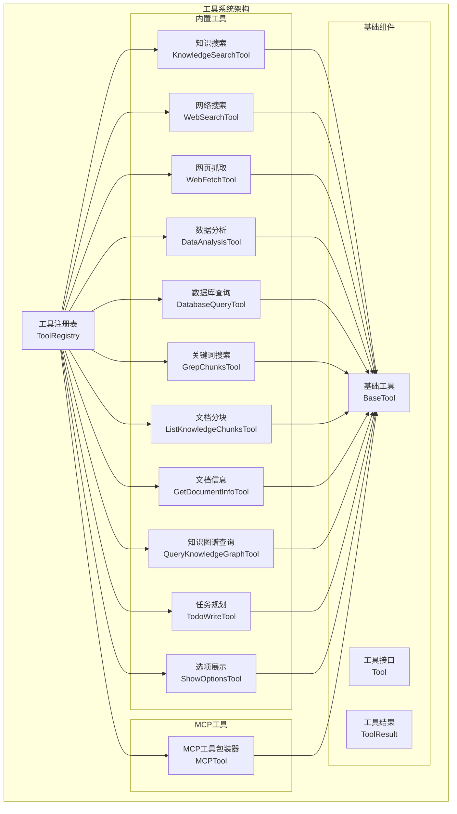
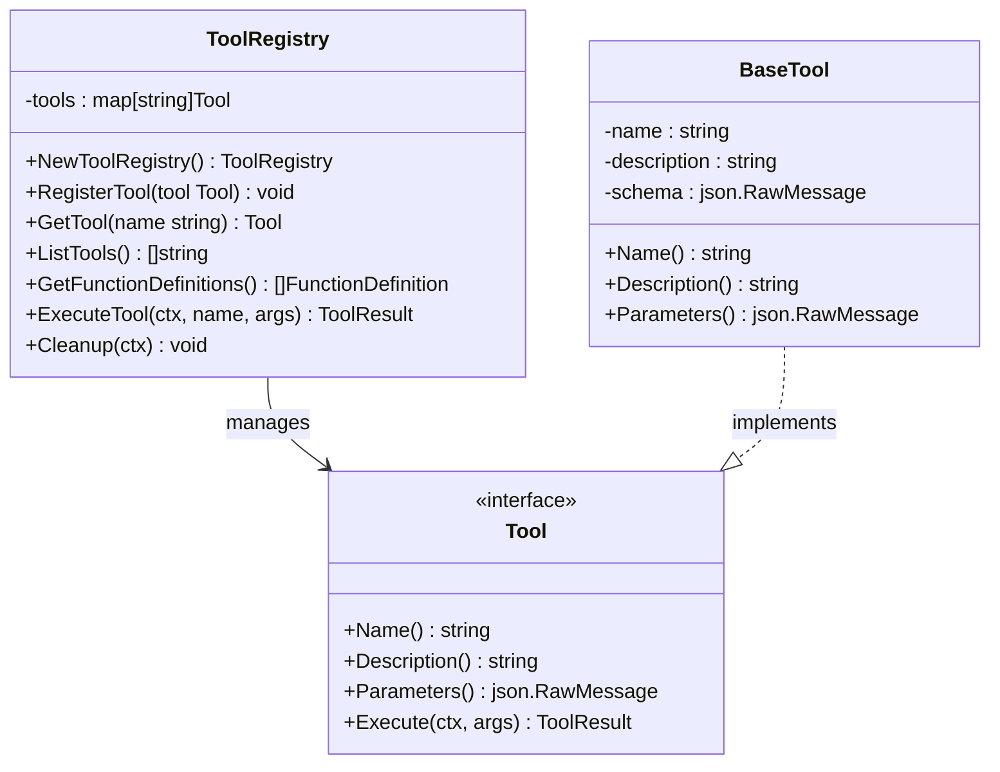
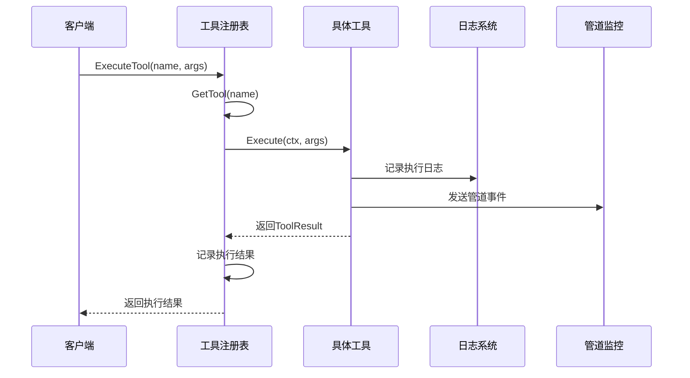
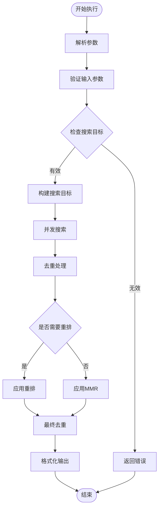
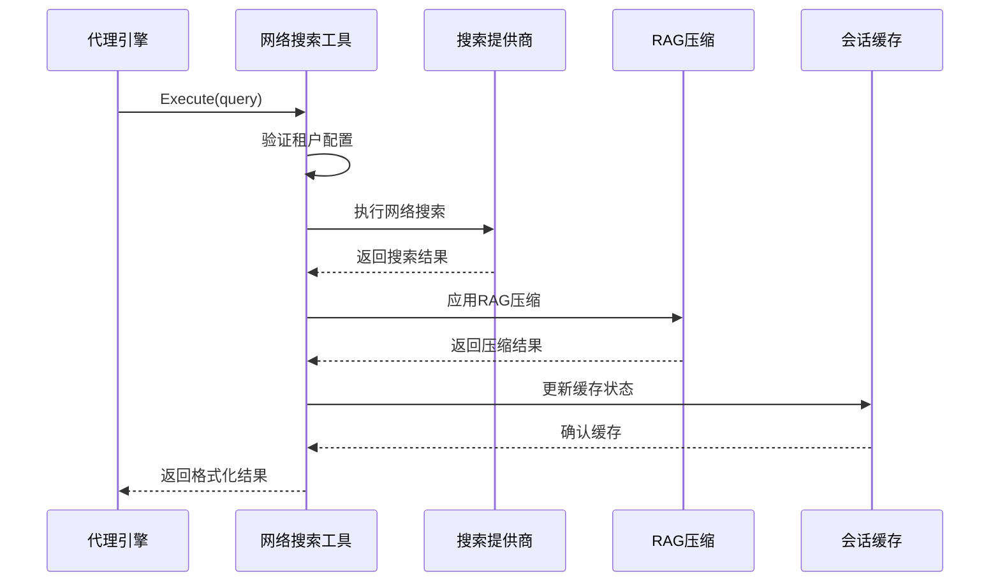
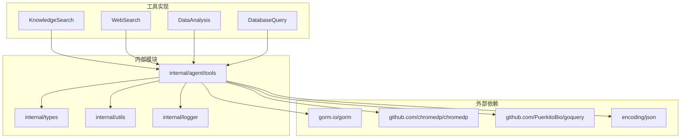

# 工具系统

<cite>
**本文档引用的文件**
- [internal/agent/tools/registry.go](file://internal/agent/tools/registry.go)
- [internal/agent/tools/tool.go](file://internal/agent/tools/tool.go)
- [internal/agent/tools/definitions.go](file://internal/agent/tools/definitions.go)
- [internal/agent/tools/knowledge_search.go](file://internal/agent/tools/knowledge_search.go)
- [internal/agent/tools/web_search.go](file://internal/agent/tools/web_search.go)
- [internal/agent/tools/web_fetch.go](file://internal/agent/tools/web_fetch.go)
- [internal/agent/tools/data_analysis.go](file://internal/agent/tools/data_analysis.go)
- [internal/agent/tools/database_query.go](file://internal/agent/tools/database_query.go)
- [internal/agent/tools/grep_chunks.go](file://internal/agent/tools/grep_chunks.go)
- [internal/agent/tools/list_knowledge_chunks.go](file://internal/agent/tools/list_knowledge_chunks.go)
- [internal/agent/tools/get_document_info.go](file://internal/agent/tools/get_document_info.go)
- [internal/agent/tools/query_knowledge_graph.go](file://internal/agent/tools/query_knowledge_graph.go)
- [internal/agent/tools/mcp_tool.go](file://internal/agent/tools/mcp_tool.go)
- [internal/agent/tools/todo_write.go](file://internal/agent/tools/todo_write.go)
- [internal/agent/tools/show_options.go](file://internal/agent/tools/show_options.go)
- [internal/common/tools.go](file://internal/common/tools.go)
</cite>

## 目录
1. [简介](#简介)
2. [项目结构](#项目结构)
3. [核心组件](#核心组件)
4. [架构概览](#架构概览)
5. [详细组件分析](#详细组件分析)
6. [依赖分析](#依赖分析)
7. [性能考虑](#性能考虑)
8. [故障排除指南](#故障排除指南)
9. [结论](#结论)
10. [附录](#附录)

## 简介

工具系统是 WiseDx 项目的核心基础设施，为智能代理提供了丰富的外部能力扩展。该系统实现了高度模块化的工具架构，支持知识检索、网络搜索、数据分析、数据库查询等多种工具类型，并通过统一的注册表机制进行管理和调度。

系统采用插件式设计，支持内置工具和外部 MCP 服务工具的统一管理。每个工具都实现了标准化的接口，具备参数验证、执行监控和结果处理能力，确保了系统的可扩展性和可维护性。

## 项目结构

工具系统位于 `internal/agent/tools/` 目录下，采用按功能模块划分的组织方式：



**图表来源**
- [internal/agent/tools/registry.go](file://internal/agent/tools/registry.go#L12-L58)
- [internal/agent/tools/tool.go](file://internal/agent/tools/tool.go#L10-L47)

**章节来源**
- [internal/agent/tools/registry.go](file://internal/agent/tools/registry.go#L1-L114)
- [internal/agent/tools/tool.go](file://internal/agent/tools/tool.go#L1-L86)

## 核心组件

### 工具注册表 (ToolRegistry)

工具注册表是整个工具系统的核心管理组件，负责工具的注册、检索、执行和清理工作。



**图表来源**
- [internal/agent/tools/registry.go](file://internal/agent/tools/registry.go#L12-L58)
- [internal/agent/tools/tool.go](file://internal/agent/tools/tool.go#L10-L47)

### 工具接口定义

所有工具都实现了统一的 `Tool` 接口，确保了工具行为的一致性：

| 方法 | 参数 | 返回值 | 描述 |
|------|------|--------|------|
| Name | 无 | string | 返回工具唯一标识符 |
| Description | 无 | string | 返回工具功能描述 |
| Parameters | 无 | json.RawMessage | 返回参数验证模式 |
| Execute | ctx: context.Context, args: json.RawMessage | *ToolResult, error | 执行工具逻辑 |

**章节来源**
- [internal/agent/tools/tool.go](file://internal/agent/tools/tool.go#L10-L47)
- [internal/agent/tools/registry.go](file://internal/agent/tools/registry.go#L24-L58)

## 架构概览

工具系统采用分层架构设计，实现了清晰的关注点分离：



**图表来源**
- [internal/agent/tools/registry.go](file://internal/agent/tools/registry.go#L60-L103)
- [internal/common/tools.go](file://internal/common/tools.go#L184-L197)

系统架构特点：

1. **统一入口**: 所有工具调用通过 `ToolRegistry.ExecuteTool` 统一入口
2. **参数验证**: 基于 JSON Schema 的参数验证机制
3. **执行监控**: 通过管道日志系统进行执行过程监控
4. **错误处理**: 标准化的错误处理和返回机制
5. **资源管理**: 支持工具资源的自动清理

**章节来源**
- [internal/agent/tools/registry.go](file://internal/agent/tools/registry.go#L60-L114)

## 详细组件分析

### 知识搜索工具 (KnowledgeSearchTool)

知识搜索工具是系统的核心检索组件，实现了语义搜索、混合检索和结果重排功能。



**图表来源**
- [internal/agent/tools/knowledge_search.go](file://internal/agent/tools/knowledge_search.go#L154-L407)

**实现特性**：

1. **多阶段搜索**: 支持向量搜索、关键词搜索和混合搜索
2. **并发优化**: 使用 goroutine 并发执行多个搜索任务
3. **结果重排**: 支持基于 LLM 的重排和传统重排模型
4. **去重机制**: 多层次的结果去重和冗余消除
5. **MMR算法**: 最大边际相关性算法确保结果多样性

**章节来源**
- [internal/agent/tools/knowledge_search.go](file://internal/agent/tools/knowledge_search.go#L1-L800)

### 网络搜索工具 (WebSearchTool)

网络搜索工具提供了实时网络信息检索能力，集成了 RAG 压缩和会话缓存功能。



**图表来源**
- [internal/agent/tools/web_search.go](file://internal/agent/tools/web_search.go#L110-L284)

**核心功能**：

1. **租户隔离**: 基于租户的配置管理和权限控制
2. **RAG压缩**: 自动提取和压缩相关信息
3. **会话缓存**: 临时知识库状态管理
4. **结果格式化**: 标准化的结果展示格式

**章节来源**
- [internal/agent/tools/web_search.go](file://internal/agent/tools/web_search.go#L1-L285)

### 数据分析工具 (DataAnalysisTool)

数据分析工具提供了基于 DuckDB 的数据查询和分析能力，支持 CSV 和 Excel 文件的读取和 SQL 查询。

```mermaid
classDiagram
class DataAnalysisTool {
-knowledgeService : KnowledgeService
-db : sql.DB
-sessionID : string
-createdTables : []string
+Execute(ctx, args) ToolResult
+LoadFromKnowledgeID(ctx, knowledgeID) TableSchema
+LoadFromCSV(ctx, filename, tableName) TableSchema
+LoadFromExcel(ctx, filename, tableName) TableSchema
+Cleanup(ctx) void
}
class TableSchema {
+tableName : string
+columns : []ColumnInfo
+rowCount : int64
+metadata : map[string]interface{}
+Description() string
}
class ColumnInfo {
+name : string
+type : string
+nullable : string
}
DataAnalysisTool --> TableSchema : creates
TableSchema --> ColumnInfo : contains
```

**图表来源**
- [internal/agent/tools/data_analysis.go](file://internal/agent/tools/data_analysis.go#L27-L475)

**安全特性**：

1. **只读查询**: 严格限制为只读 SQL 查询
2. **参数验证**: Comprehensive SQL 验证和安全检查
3. **会话隔离**: 基于会话的数据库连接管理
4. **自动清理**: 会话结束时自动清理临时表

**章节来源**
- [internal/agent/tools/data_analysis.go](file://internal/agent/tools/data_analysis.go#L1-L475)

### 数据库查询工具 (DatabaseQueryTool)

数据库查询工具提供了安全的数据库访问能力，集成了自动租户过滤和 SQL 安全验证。

**实现特点**：

1. **自动租户注入**: 自动为查询添加租户过滤条件
2. **SQL 安全验证**: 多层 SQL 安全检查和验证
3. **只读限制**: 严格限制为只读查询
4. **结果格式化**: 标准化的查询结果格式

**章节来源**
- [internal/agent/tools/database_query.go](file://internal/agent/tools/database_query.go#L1-L330)

### 关键词搜索工具 (GrepChunksTool)

关键词搜索工具实现了高效的文本模式匹配功能，支持精确的关键词检索。

**核心算法**：

1. **多模式匹配**: 支持多个关键词的并行匹配
2. **去重处理**: 基于内容签名的重复内容检测
3. **评分系统**: 基于匹配次数和位置的相关性评分
4. **MMR优化**: 最大边际相关性算法减少冗余

**章节来源**
- [internal/agent/tools/grep_chunks.go](file://internal/agent/tools/grep_chunks.go#L1-L694)

### 文档信息工具 (GetDocumentInfoTool)

文档信息工具提供了批量文档元数据查询功能，支持并发处理多个文档。

**并发处理**：

1. **goroutine 并发**: 每个文档查询独立 goroutine
2. **错误聚合**: 统一收集和报告查询错误
3. **批量优化**: 支持最多 10 个文档的批量查询
4. **状态检查**: 实时检查文档处理状态

**章节来源**
- [internal/agent/tools/get_document_info.go](file://internal/agent/tools/get_document_info.go#L1-L303)

### 知识图谱查询工具 (QueryKnowledgeGraphTool)

知识图谱查询工具提供了实体关系探索和知识网络分析能力。

**图谱功能**：

1. **多 KB 查询**: 并发查询多个知识库的图谱
2. **配置检查**: 自动检查知识库的图谱配置状态
3. **结果去重**: 跨知识库的结果去重和合并
4. **可视化支持**: 生成前端可视化的图谱数据

**章节来源**
- [internal/agent/tools/query_knowledge_graph.go](file://internal/agent/tools/query_knowledge_graph.go#L1-L394)

### MCP 工具包装器 (MCPTool)

MCP 工具包装器实现了外部 MCP 服务工具的统一集成。

**集成特性**：

1. **动态发现**: 自动发现和注册 MCP 服务工具
2. **传输抽象**: 支持多种 MCP 传输协议
3. **参数映射**: 自动处理工具参数映射
4. **错误处理**: 统一的 MCP 错误处理和报告

**章节来源**
- [internal/agent/tools/mcp_tool.go](file://internal/agent/tools/mcp_tool.go#L1-L320)

## 依赖分析

工具系统采用松耦合的设计，通过接口和依赖注入实现模块间的解耦。



**图表来源**
- [internal/agent/tools/knowledge_search.go](file://internal/agent/tools/knowledge_search.go#L3-L20)
- [internal/agent/tools/web_search.go](file://internal/agent/tools/web_search.go#L3-L14)

**依赖关系特点**：

1. **最小依赖**: 每个工具只依赖必要的外部库
2. **接口抽象**: 通过接口抽象隐藏具体实现细节
3. **配置驱动**: 通过配置文件控制工具行为
4. **错误隔离**: 各工具的错误处理相互独立

**章节来源**
- [internal/agent/tools/knowledge_search.go](file://internal/agent/tools/knowledge_search.go#L1-L800)
- [internal/agent/tools/web_search.go](file://internal/agent/tools/web_search.go#L1-L285)

## 性能考虑

工具系统在设计时充分考虑了性能优化，采用了多种策略来提升执行效率：

### 并发优化策略

1. **goroutine 并发**: 关键工具广泛使用 goroutine 实现并行处理
2. **连接池管理**: 数据库连接和 HTTP 客户端使用连接池
3. **异步处理**: 支持异步工具执行和结果收集

### 缓存机制

1. **会话缓存**: WebSearchTool 使用会话级别的临时知识库缓存
2. **结果缓存**: 重复查询结果的缓存和复用
3. **配置缓存**: 工具配置和元数据的缓存机制

### 内存管理

1. **流式处理**: 大文件和大数据集的流式处理
2. **及时释放**: 及时释放不再使用的资源和连接
3. **垃圾回收**: 优化对象生命周期管理

## 故障排除指南

### 常见问题诊断

**工具注册失败**：
- 检查工具名称的唯一性
- 验证工具实现是否正确
- 确认依赖注入配置

**执行超时**：
- 检查网络连接状态
- 验证外部服务可用性
- 调整超时配置参数

**内存不足**：
- 检查大数据集处理逻辑
- 验证缓存清理机制
- 优化数据结构和算法

### 错误处理策略

工具系统实现了多层次的错误处理机制：

1. **参数验证**: 在工具执行前进行严格的参数验证
2. **异常捕获**: 使用 defer 和 recover 机制捕获异常
3. **错误传播**: 标准化的错误信息传播和记录
4. **降级处理**: 在部分功能失效时的降级策略

**章节来源**
- [internal/common/tools.go](file://internal/common/tools.go#L184-L197)

## 结论

工具系统通过其模块化、可扩展的设计，为 WiseDx 项目提供了强大的外部能力集成框架。系统不仅支持丰富的内置工具，还通过 MCP 机制实现了对外部服务的无缝集成。

关键优势包括：

1. **统一接口**: 所有工具遵循统一的接口规范
2. **参数验证**: 基于 JSON Schema 的强类型参数验证
3. **执行监控**: 完善的管道日志和执行监控
4. **安全控制**: 多层次的安全验证和访问控制
5. **性能优化**: 并发处理和缓存机制提升执行效率

该系统为未来的功能扩展和技术演进奠定了坚实的基础，能够适应不断变化的业务需求和技术环境。

## 附录

### 工具扩展指南

**新增工具开发步骤**：

1. 创建工具结构体并实现 Tool 接口
2. 定义参数结构体和 JSON Schema
3. 实现 Execute 方法和业务逻辑
4. 注册工具到工具注册表
5. 添加单元测试和集成测试

**最佳实践**：

1. **参数验证**: 始终进行参数验证和错误处理
2. **资源管理**: 确保资源的正确分配和释放
3. **日志记录**: 详细的执行日志和错误记录
4. **性能考虑**: 优化算法和数据结构
5. **安全性**: 实施必要的安全措施和访问控制

### 配置管理

工具系统的配置主要通过以下方式管理：

1. **工具定义**: 在 definitions.go 中定义工具元数据
2. **默认配置**: 在 AvailableToolDefinitions 函数中设置默认工具列表
3. **运行时配置**: 通过环境变量和配置文件动态调整
4. **租户配置**: 支持按租户的个性化配置