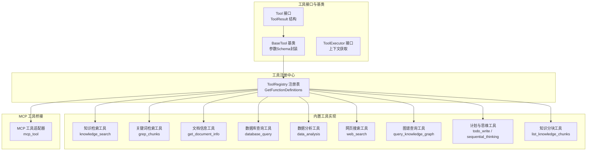
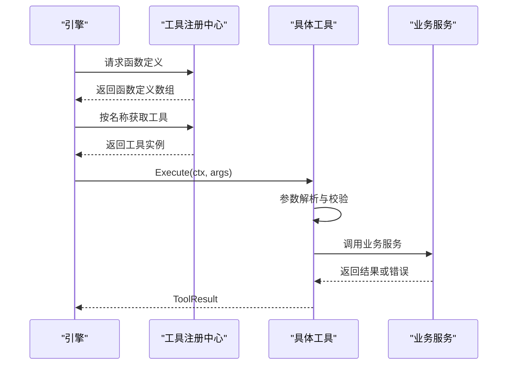
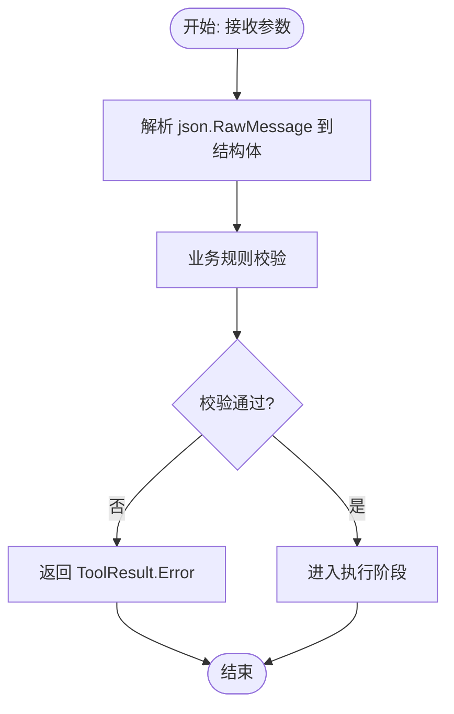
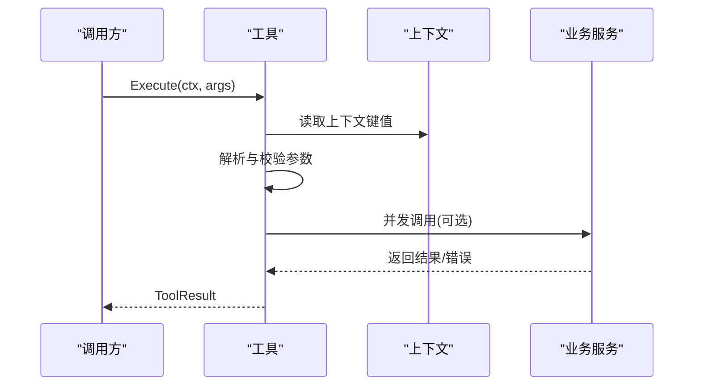
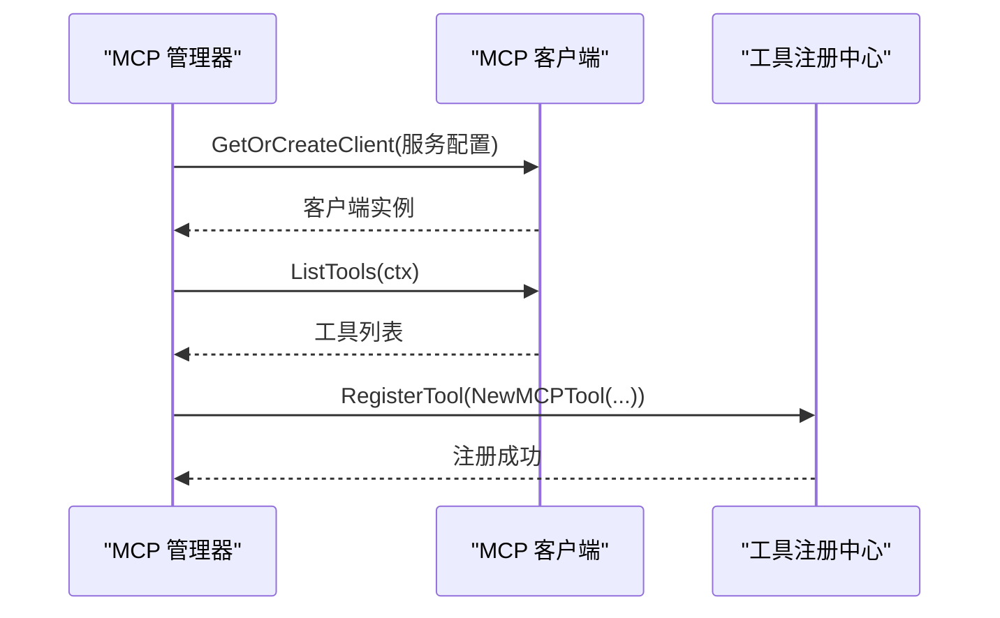
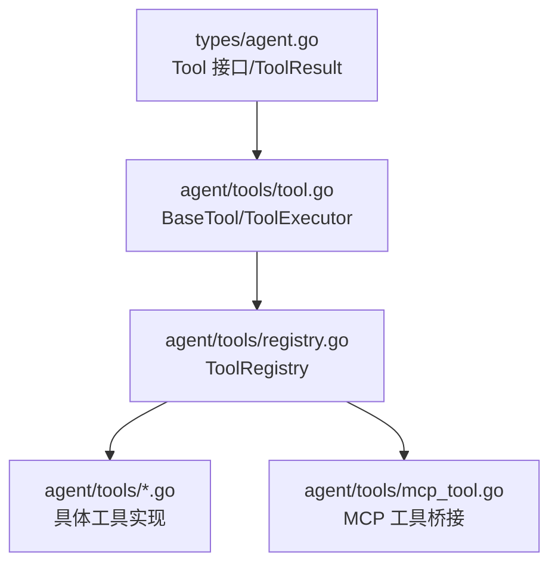

# 自定义工具扩展

<cite>
**本文档引用的文件**
- [internal/types/agent.go](file://internal/types/agent.go)
- [internal/agent/tools/tool.go](file://internal/agent/tools/tool.go)
- [internal/agent/tools/registry.go](file://internal/agent/tools/registry.go)
- [internal/agent/tools/definitions.go](file://internal/agent/tools/definitions.go)
- [internal/agent/tools/mcp_tool.go](file://internal/agent/tools/mcp_tool.go)
- [internal/agent/tools/data_analysis.go](file://internal/agent/tools/data_analysis.go)
- [internal/agent/tools/web_search.go](file://internal/agent/tools/web_search.go)
- [internal/agent/tools/database_query.go](file://internal/agent/tools/database_query.go)
- [internal/agent/tools/get_document_info.go](file://internal/agent/tools/get_document_info.go)
- [internal/agent/tools/knowledge_search.go](file://internal/agent/tools/knowledge_search.go)
- [internal/agent/tools/list_knowledge_chunks.go](file://internal/agent/tools/list_knowledge_chunks.go)
- [internal/agent/tools/sequentialthinking.go](file://internal/agent/tools/sequentialthinking.go)
- [internal/agent/tools/todo_write.go](file://internal/agent/tools/todo_write.go)
- [internal/agent/tools/grep_chunks.go](file://internal/agent/tools/grep_chunks.go)
- [internal/agent/tools/query_knowledge_graph.go](file://internal/agent/tools/query_knowledge_graph.go)
</cite>

## 目录
1. [简介](#简介)
2. [项目结构](#项目结构)
3. [核心组件](#核心组件)
4. [架构概览](#架构概览)
5. [详细组件分析](#详细组件分析)
6. [依赖分析](#依赖分析)
7. [性能考虑](#性能考虑)
8. [故障排除指南](#故障排除指南)
9. [结论](#结论)
10. [附录](#附录)

## 简介
本指南面向希望在系统中开发和集成自定义工具的开发者，围绕工具接口设计、参数Schema定义、执行流程与上下文处理、异步与错误传播、测试与调试、性能优化与安全实践等方面提供完整的技术文档。通过阅读本指南，您将能够：
- 准确实现 Tool 接口并遵循统一的参数Schema规范
- 设计健壮的工具执行流程，正确处理上下文、并发与错误
- 构建可测试、可维护的工具实现，并将其注册到系统中
- 在保证安全的前提下提升工具性能与用户体验

## 项目结构
工具系统位于 internal/agent/tools 目录下，采用“按功能域划分”的模块化组织方式：
- 工具接口与基类：定义 Tool 接口、BaseTool 基类与通用执行辅助
- 工具注册中心：集中管理工具注册、检索与函数定义导出
- 工具实现：涵盖知识检索、数据库查询、数据分析、网络搜索、图谱查询、思维与计划等
- MCP 工具桥接：将外部 MCP 服务暴露为系统内可用工具
- 工具定义清单：声明可用工具列表与默认允许列表



**图表来源**
- [internal/types/agent.go](file://internal/types/agent.go#L107-L120)
- [internal/agent/tools/tool.go](file://internal/agent/tools/tool.go#L10-L39)
- [internal/agent/tools/registry.go](file://internal/agent/tools/registry.go#L12-L58)
- [internal/agent/tools/mcp_tool.go](file://internal/agent/tools/mcp_tool.go#L191-L256)

**章节来源**
- [internal/agent/tools/tool.go](file://internal/agent/tools/tool.go#L1-L86)
- [internal/agent/tools/registry.go](file://internal/agent/tools/registry.go#L1-L58)
- [internal/agent/tools/definitions.go](file://internal/agent/tools/definitions.go#L27-L59)

## 核心组件
本节聚焦工具系统的三大核心要素：接口设计、参数Schema与执行模型。

- Tool 接口
  - Name(): 返回工具唯一标识
  - Description(): 返回人类可读的工具描述
  - Parameters(): 返回 JSON Schema（json.RawMessage），用于参数校验与UI提示
  - Execute(ctx, args): 执行工具逻辑，返回 ToolResult 与错误

- BaseTool 基类
  - 封装 name、description、schema 字段
  - 提供 Name()、Description()、Parameters() 的基础实现
  - 提供通用输出格式化与匹配类型转换等辅助函数

- ToolExecutor 接口
  - 在 Tool 基础上增加 GetContext()，用于在执行时注入上下文数据（如租户ID、会话ID）

- ToolResult 结构
  - Success、Output、Data、Error 字段，统一承载执行结果与错误信息

- 工具注册与函数定义
  - ToolRegistry 负责注册、检索与导出函数定义
  - GetFunctionDefinitions 将工具的 Name、Description、Parameters 导出给上层引擎

**章节来源**
- [internal/types/agent.go](file://internal/types/agent.go#L107-L120)
- [internal/agent/tools/tool.go](file://internal/agent/tools/tool.go#L10-L39)
- [internal/agent/tools/tool.go](file://internal/agent/tools/tool.go#L41-L47)
- [internal/agent/tools/tool.go](file://internal/agent/tools/tool.go#L51-L85)
- [internal/agent/tools/registry.go](file://internal/agent/tools/registry.go#L12-L58)

## 架构概览
工具系统采用“接口抽象 + 基类复用 + 注册中心 + 上下文注入”的架构模式，确保工具实现的一致性与可扩展性。



**图表来源**
- [internal/agent/tools/registry.go](file://internal/agent/tools/registry.go#L24-L58)
- [internal/types/agent.go](file://internal/types/agent.go#L107-L120)

**章节来源**
- [internal/agent/tools/registry.go](file://internal/agent/tools/registry.go#L12-L58)
- [internal/types/agent.go](file://internal/types/agent.go#L107-L120)

## 详细组件分析

### 工具接口与基类
- 接口职责清晰：工具仅负责“做什么”和“如何执行”，不关心注册与调度
- 基类复用：通过 BaseTool 统一封装参数Schema，避免重复实现
- 上下文注入：ToolExecutor 为需要上下文的工具提供统一入口

```mermaid
classDiagram
class Tool {
+Name() string
+Description() string
+Parameters() json.RawMessage
+Execute(ctx, args) *ToolResult
}
class BaseTool {
-name string
-description string
-schema json.RawMessage
+Name() string
+Description() string
+Parameters() json.RawMessage
}
class ToolExecutor {
+GetContext() map[string]interface{}
}
Tool <|.. BaseTool
ToolExecutor ..|> Tool
BaseTool <|-- ConcreteTool
```

**图表来源**
- [internal/types/agent.go](file://internal/types/agent.go#L107-L120)
- [internal/agent/tools/tool.go](file://internal/agent/tools/tool.go#L10-L39)
- [internal/agent/tools/tool.go](file://internal/agent/tools/tool.go#L41-L47)

**章节来源**
- [internal/types/agent.go](file://internal/types/agent.go#L107-L120)
- [internal/agent/tools/tool.go](file://internal/agent/tools/tool.go#L10-L47)

### 参数Schema定义与验证
- JSON Schema 格式
  - 内置工具普遍采用 utils.GenerateSchema[T]() 生成强类型的 Schema
  - 对于复杂场景，也可直接使用 json.RawMessage 提供自定义Schema
- 类型约束与校验
  - 使用 jsonschema 标签描述字段含义
  - 在 Execute 中进行参数解析与业务校验，确保输入合法
- 验证机制
  - 对外部输入进行严格校验，必要时结合业务规则二次校验
  - 错误信息统一包装为 ToolResult.Error，便于前端展示与日志追踪



**图表来源**
- [internal/agent/tools/web_search.go](file://internal/agent/tools/web_search.go#L110-L133)
- [internal/agent/tools/database_query.go](file://internal/agent/tools/database_query.go#L116-L142)
- [internal/agent/tools/data_analysis.go](file://internal/agent/tools/data_analysis.go#L80-L98)

**章节来源**
- [internal/agent/tools/web_search.go](file://internal/agent/tools/web_search.go#L68-L74)
- [internal/agent/tools/database_query.go](file://internal/agent/tools/database_query.go#L95-L100)
- [internal/agent/tools/data_analysis.go](file://internal/agent/tools/data_analysis.go#L16-L25)

### 执行流程与上下文处理
- 上下文注入
  - 通过 ToolExecutor.GetContext() 获取运行时上下文（如租户ID、会话ID）
  - 在 Execute 中读取上下文键值，确保工具行为符合当前会话与权限
- 并发与异步
  - 对于批量查询或跨服务调用，采用 goroutine + WaitGroup 并发处理
  - 使用互斥锁保护共享资源，避免竞态条件
- 错误传播
  - 所有错误统一包装为 ToolResult.Error，保持调用方一致的错误处理体验
  - 日志记录关键路径，便于问题定位与审计



**图表来源**
- [internal/agent/tools/tool.go](file://internal/agent/tools/tool.go#L41-L47)
- [internal/agent/tools/get_document_info.go](file://internal/agent/tools/get_document_info.go#L71-L94)
- [internal/agent/tools/web_search.go](file://internal/agent/tools/web_search.go#L110-L164)

**章节来源**
- [internal/agent/tools/tool.go](file://internal/agent/tools/tool.go#L41-L47)
- [internal/agent/tools/get_document_info.go](file://internal/agent/tools/get_document_info.go#L71-L94)
- [internal/agent/tools/web_search.go](file://internal/agent/tools/web_search.go#L110-L164)

### 工具实现模式
- 知识检索工具（knowledge_search）
  - 支持多查询、多知识库并发搜索
  - 采用混合检索与重排（Rerank）提升相关性
  - 使用 MMR 控制冗余，保证多样性
- 关键词检索工具（grep_chunks）
  - 固定字符串匹配，支持多模式 OR 逻辑
  - 去重、评分与 MMR 优化结果质量
- 文档信息工具（get_document_info）
  - 并发查询文档元数据与分块统计
  - 格式化输出，便于前端展示
- 数据库查询工具（database_query）
  - 自动注入租户ID，只允许 SELECT
  - 安全校验与 SQL 防护
- 数据分析工具（data_analysis）
  - DuckDB 读写隔离，会话级清理
  - 严格只读与安全校验
- 网页搜索工具（web_search）
  - 支持 RAG 压缩与会话缓存
  - 多提供商配置与压缩策略
- 图谱查询工具（query_knowledge_graph）
  - 并发查询多个知识库图谱
  - 自动去重与可视化数据构建
- 思维与计划工具（sequential_thinking / todo_write）
  - 支持分支与修订，跟踪任务状态
  - 与检索工具配合，形成完整的检索-思维闭环

**章节来源**
- [internal/agent/tools/knowledge_search.go](file://internal/agent/tools/knowledge_search.go#L154-L407)
- [internal/agent/tools/grep_chunks.go](file://internal/agent/tools/grep_chunks.go#L112-L248)
- [internal/agent/tools/get_document_info.go](file://internal/agent/tools/get_document_info.go#L71-L258)
- [internal/agent/tools/database_query.go](file://internal/agent/tools/database_query.go#L116-L252)
- [internal/agent/tools/data_analysis.go](file://internal/agent/tools/data_analysis.go#L80-L158)
- [internal/agent/tools/web_search.go](file://internal/agent/tools/web_search.go#L110-L284)
- [internal/agent/tools/query_knowledge_graph.go](file://internal/agent/tools/query_knowledge_graph.go#L77-L359)
- [internal/agent/tools/sequentialthinking.go](file://internal/agent/tools/sequentialthinking.go#L161-L239)
- [internal/agent/tools/todo_write.go](file://internal/agent/tools/todo_write.go#L165-L204)

### MCP 工具桥接
- 动态发现与注册
  - 通过 MCPManager 获取客户端，列举远端工具并注册到本地注册中心
  - 支持 stdio 传输的连接释放与超时控制
- 工具命名与过滤
  - 对远端工具名称进行清洗，确保符合本地命名规范
- 生命周期管理
  - 为 stdio 传输在列举完成后主动断开连接，避免资源泄漏



**图表来源**
- [internal/agent/tools/mcp_tool.go](file://internal/agent/tools/mcp_tool.go#L191-L256)

**章节来源**
- [internal/agent/tools/mcp_tool.go](file://internal/agent/tools/mcp_tool.go#L191-L256)

### 工具注册与使用
- 注册流程
  - 工具实现完成后，通过 ToolRegistry.RegisterTool(tool) 注册
  - 通过 GetFunctionDefinitions 导出函数定义，供引擎调用
- 默认可用工具
  - 通过 AvailableToolDefinitions 与 DefaultAllowedTools 控制默认开放能力
- 使用方式
  - 引擎根据 AllowedTools 与配置决定是否启用某工具
  - 调用时传入 json.RawMessage 参数，工具内部解析为结构体并执行

**章节来源**
- [internal/agent/tools/registry.go](file://internal/agent/tools/registry.go#L24-L58)
- [internal/agent/tools/definitions.go](file://internal/agent/tools/definitions.go#L27-L59)

## 依赖分析
工具系统内部依赖清晰，耦合度低，便于扩展与维护。



**图表来源**
- [internal/types/agent.go](file://internal/types/agent.go#L107-L120)
- [internal/agent/tools/tool.go](file://internal/agent/tools/tool.go#L10-L39)
- [internal/agent/tools/registry.go](file://internal/agent/tools/registry.go#L12-L58)

**章节来源**
- [internal/types/agent.go](file://internal/types/agent.go#L107-L120)
- [internal/agent/tools/tool.go](file://internal/agent/tools/tool.go#L10-L39)
- [internal/agent/tools/registry.go](file://internal/agent/tools/registry.go#L12-L58)

## 性能考虑
- 并发优化
  - 对多知识库或批量请求采用并发处理，显著降低延迟
  - 合理设置并发上限，避免过度竞争
- 结果质量与冗余控制
  - 使用 MMR 控制结果冗余，提升多样性与相关性
  - 去重策略减少重复内容，降低前端渲染压力
- 缓存与会话隔离
  - 网页搜索支持会话级缓存，避免重复检索
  - 数据分析工具按会话清理临时表，防止资源累积
- SQL 安全与性能
  - 数据库查询工具自动注入租户ID并限制为只读
  - 数据分析工具对 SQL 进行严格校验与限制，避免危险操作

[本节提供通用指导，无需特定文件引用]

## 故障排除指南
- 常见错误类型
  - 参数解析失败：检查 json.RawMessage 是否符合结构体定义
  - 权限不足：确认上下文中租户ID与会话ID是否正确传递
  - 资源访问失败：检查数据库连接、外部服务可达性与超时设置
- 调试技巧
  - 使用日志记录关键路径与中间结果，便于定位问题
  - 对并发场景使用互斥锁保护共享状态
  - 对外部调用设置合理超时，避免阻塞
- 错误传播
  - 统一返回 ToolResult.Error，前端可根据错误类型进行友好提示
  - 对可恢复错误进行重试或降级处理

**章节来源**
- [internal/agent/tools/web_search.go](file://internal/agent/tools/web_search.go#L110-L179)
- [internal/agent/tools/database_query.go](file://internal/agent/tools/database_query.go#L116-L171)
- [internal/agent/tools/data_analysis.go](file://internal/agent/tools/data_analysis.go#L80-L143)

## 结论
通过统一的接口设计、严谨的参数Schema与强大的执行框架，系统为自定义工具提供了清晰的扩展路径。开发者只需遵循 Tool 接口规范，结合 BaseTool 的参数Schema封装与上下文注入机制，即可快速实现高质量的工具并安全地接入系统。配合注册中心与 MCP 桥接，工具生态得以持续扩展，满足多样化的业务需求。

## 附录

### 开发自定义工具的完整流程
- 步骤一：定义参数结构体与 JSON Schema
  - 使用 utils.GenerateSchema[T]() 生成强类型 Schema
  - 或直接提供 json.RawMessage 自定义 Schema
- 步骤二：实现 Tool 接口
  - 实现 Name、Description、Parameters、Execute 方法
  - 在 Execute 中进行参数解析与业务校验
- 步骤三：上下文与并发
  - 如需上下文，实现 ToolExecutor.GetContext()
  - 对并发场景使用 goroutine + WaitGroup，并加锁保护共享资源
- 步骤四：错误处理与日志
  - 统一返回 ToolResult，错误信息写入 Error
  - 关键路径打点日志，便于排查
- 步骤五：注册与导出
  - 通过 ToolRegistry.RegisterTool(tool) 注册
  - 通过 GetFunctionDefinitions 导出函数定义
- 步骤六：测试与验证
  - 编写单元测试，覆盖正常与异常路径
  - 使用最小化参数集验证工具行为
  - 对并发与边界条件进行专项测试

**章节来源**
- [internal/agent/tools/tool.go](file://internal/agent/tools/tool.go#L10-L39)
- [internal/agent/tools/registry.go](file://internal/agent/tools/registry.go#L24-L58)
- [internal/agent/tools/web_search.go](file://internal/agent/tools/web_search.go#L110-L133)
- [internal/agent/tools/database_query.go](file://internal/agent/tools/database_query.go#L116-L142)
- [internal/agent/tools/data_analysis.go](file://internal/agent/tools/data_analysis.go#L80-L98)