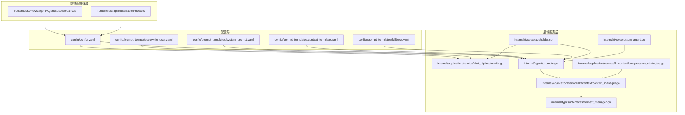
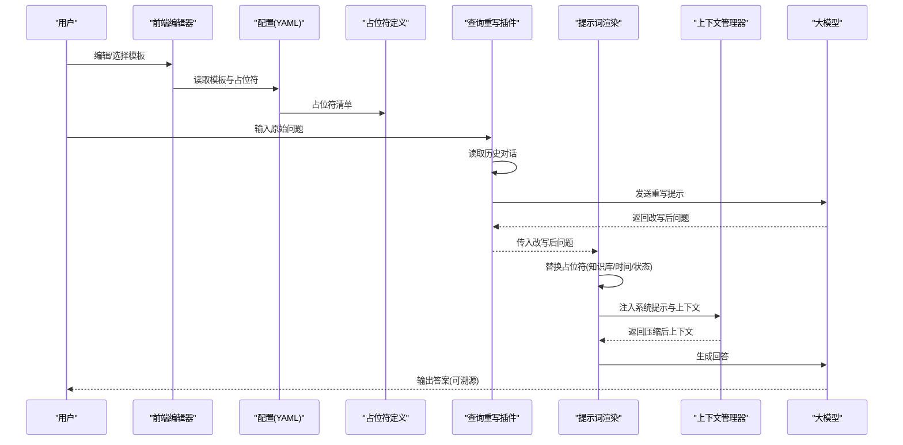
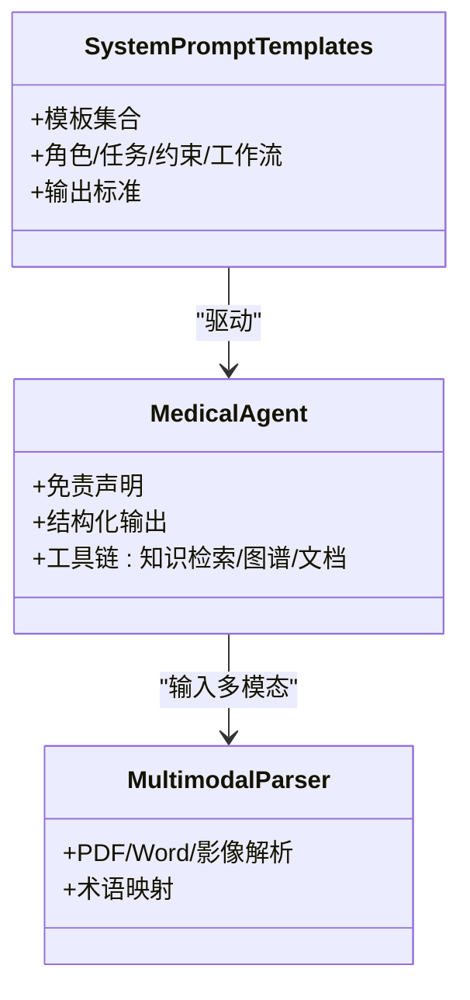
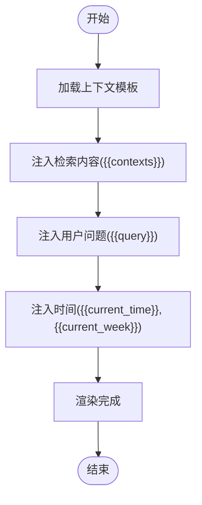
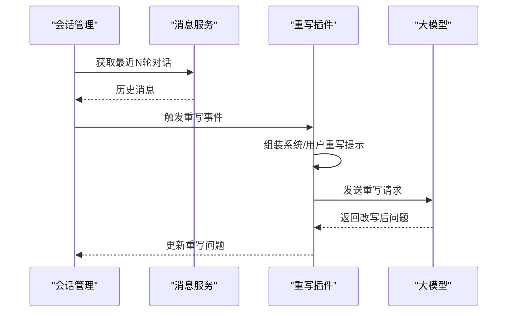
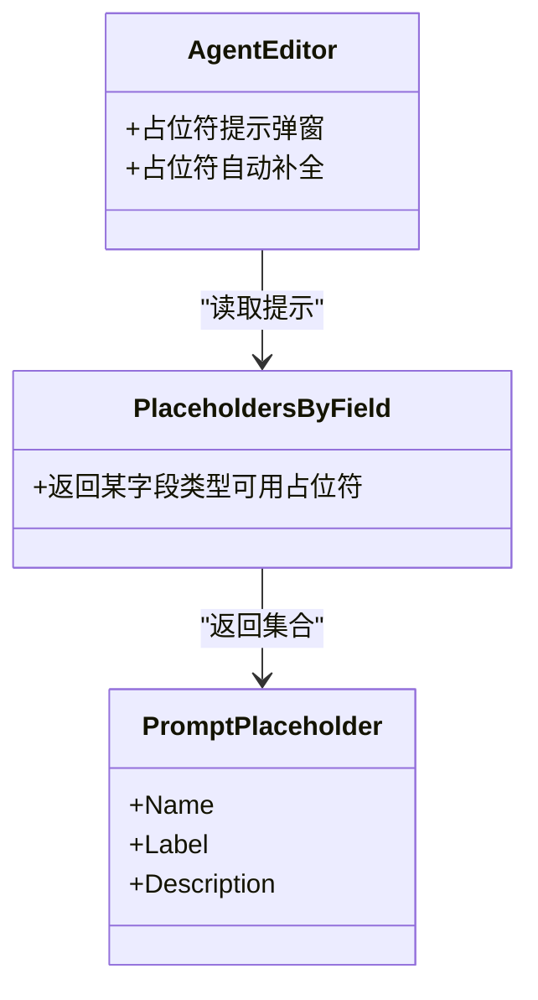
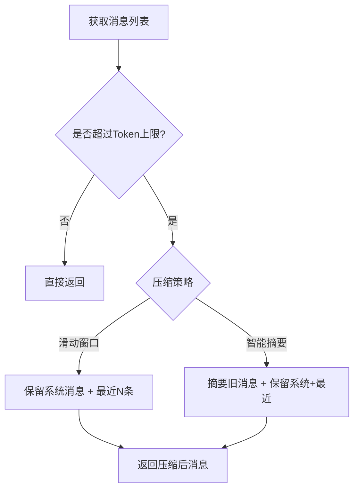
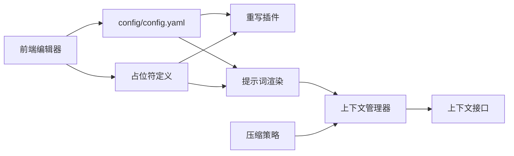

# 提示词工程

<cite>
**本文引用的文件**
- [config/prompt_templates/system_prompt.yaml](file://config/prompt_templates/system_prompt.yaml)
- [config/prompt_templates/context_template.yaml](file://config/prompt_templates/context_template.yaml)
- [config/prompt_templates/rewrite_user.yaml](file://config/prompt_templates/rewrite_user.yaml)
- [config/prompt_templates/fallback.yaml](file://config/prompt_templates/fallback.yaml)
- [config/config.yaml](file://config/config.yaml)
- [internal/agent/prompts.go](file://internal/agent/prompts.go)
- [internal/application/service/chat_pipline/rewrite.go](file://internal/application/service/chat_pipline/rewrite.go)
- [internal/types/placeholder.go](file://internal/types/placeholder.go)
- [internal/types/interfaces/context_manager.go](file://internal/types/interfaces/context_manager.go)
- [internal/application/service/llmcontext/context_manager.go](file://internal/application/service/llmcontext/context_manager.go)
- [internal/application/service/llmcontext/compression_strategies.go](file://internal/application/service/llmcontext/compression_strategies.go)
- [internal/types/custom_agent.go](file://internal/types/custom_agent.go)
- [frontend/src/views/agent/AgentEditorModal.vue](file://frontend/src/views/agent/AgentEditorModal.vue)
- [frontend/src/api/initialization/index.ts](file://frontend/src/api/initialization/index.ts)
- [README_CN.md](file://README_CN.md)
- [README.md](file://README.md)
</cite>

## 目录
1. [简介](#简介)
2. [项目结构](#项目结构)
3. [核心组件](#核心组件)
4. [架构总览](#架构总览)
5. [详细组件分析](#详细组件分析)
6. [依赖分析](#依赖分析)
7. [性能考量](#性能考量)
8. [故障排查指南](#故障排查指南)
9. [结论](#结论)
10. [附录](#附录)

## 简介
本文件面向提示词工程的系统化设计与落地实践，聚焦以下目标：
- 系统提示词模板设计原理：涵盖医学专业领域提示词优化、多模态输入处理与上下文管理策略。
- 用户提示词构建规则：查询重写、上下文注入与指令明确化技术。
- 提示词模板配置管理：YAML 配置文件结构、参数占位符与动态内容替换机制。
- 提示词优化指南：效果评估、A/B 测试与性能调优方法。
- 医学专业术语处理、循证医学原则与可追溯性要求的实现策略。

## 项目结构
提示词工程相关代码分布在配置层、后端服务层与前端编辑器层：
- 配置层：YAML 模板集中定义系统提示、上下文模板、查询重写模板与兜底模板。
- 后端服务层：提示词占位符定义、模板渲染、查询重写插件、上下文压缩与存储。
- 前端编辑器层：模板占位符提示与可视化编辑。

**图表来源**
- [config/config.yaml](file://config/config.yaml#L1-L585)
- [config/prompt_templates/system_prompt.yaml](file://config/prompt_templates/system_prompt.yaml#L1-L114)
- [config/prompt_templates/context_template.yaml](file://config/prompt_templates/context_template.yaml#L1-L66)
- [config/prompt_templates/rewrite_user.yaml](file://config/prompt_templates/rewrite_user.yaml#L1-L31)
- [config/prompt_templates/fallback.yaml](file://config/prompt_templates/fallback.yaml#L1-L48)
- [internal/types/placeholder.go](file://internal/types/placeholder.go#L1-L166)
- [internal/application/service/chat_pipline/rewrite.go](file://internal/application/service/chat_pipline/rewrite.go#L1-L229)
- [internal/agent/prompts.go](file://internal/agent/prompts.go#L1-L441)
- [internal/application/service/llmcontext/context_manager.go](file://internal/application/service/llmcontext/context_manager.go#L1-L144)
- [internal/application/service/llmcontext/compression_strategies.go](file://internal/application/service/llmcontext/compression_strategies.go#L1-L243)
- [internal/types/interfaces/context_manager.go](file://internal/types/interfaces/context_manager.go#L1-L54)
- [internal/types/custom_agent.go](file://internal/types/custom_agent.go#L664-L986)
- [frontend/src/views/agent/AgentEditorModal.vue](file://frontend/src/views/agent/AgentEditorModal.vue#L1891-L1943)
- [frontend/src/api/initialization/index.ts](file://frontend/src/api/initialization/index.ts#L316-L356)

**章节来源**
- [config/config.yaml](file://config/config.yaml#L1-L585)
- [config/prompt_templates/system_prompt.yaml](file://config/prompt_templates/system_prompt.yaml#L1-L114)
- [config/prompt_templates/context_template.yaml](file://config/prompt_templates/context_template.yaml#L1-L66)
- [config/prompt_templates/rewrite_user.yaml](file://config/prompt_templates/rewrite_user.yaml#L1-L31)
- [config/prompt_templates/fallback.yaml](file://config/prompt_templates/fallback.yaml#L1-L48)
- [internal/types/placeholder.go](file://internal/types/placeholder.go#L1-L166)
- [internal/application/service/chat_pipline/rewrite.go](file://internal/application/service/chat_pipline/rewrite.go#L1-L229)
- [internal/agent/prompts.go](file://internal/agent/prompts.go#L1-L441)
- [internal/application/service/llmcontext/context_manager.go](file://internal/application/service/llmcontext/context_manager.go#L1-L144)
- [internal/application/service/llmcontext/compression_strategies.go](file://internal/application/service/llmcontext/compression_strategies.go#L1-L243)
- [internal/types/interfaces/context_manager.go](file://internal/types/interfaces/context_manager.go#L1-L54)
- [internal/types/custom_agent.go](file://internal/types/custom_agent.go#L664-L986)
- [frontend/src/views/agent/AgentEditorModal.vue](file://frontend/src/views/agent/AgentEditorModal.vue#L1891-L1943)
- [frontend/src/api/initialization/index.ts](file://frontend/src/api/initialization/index.ts#L316-L356)

## 核心组件
- 提示词模板与占位符
  - 系统提示模板：定义角色、任务、约束、工作流与输出标准，支持多角色与多场景（知识库问答、专家助手、客服、技术支持、纯对话、网络搜索助手）。
  - 上下文模板：将检索到的参考资料、用户问题与时间信息注入到系统提示中，支持标准、详细、简洁与问答模板。
  - 查询重写模板：基于历史对话与当前问题，生成独立、完整、可脱离上下文理解的问题。
  - 兜底模板：当知识库无法满足时，提供礼貌、简洁或模型兜底的回复模板。
  - 占位符体系：统一定义 query、contexts、current_time、current_week、conversation、yesterday、answer、knowledge_bases、web_search_status 等占位符及其用途。
- 提示词渲染与注入
  - 渲染函数：将占位符替换为实际内容，支持知识库列表格式化、网络搜索状态注入与当前时间注入。
  - Agent 模式系统提示：根据是否启用网络搜索与知识库选择，动态拼接“用户选定知识库”与“网络搜索状态”。
- 查询重写插件
  - 读取最近对话历史，构造重写提示，调用大模型生成改写后的独立问题，去除思考过程标记，限制历史轮次。
- 上下文管理
  - 上下文管理器：维护会话消息窗口，估算 token 数量，必要时压缩上下文。
  - 压缩策略：滑动窗口与智能摘要两种策略，保障系统消息与近期消息的完整性。
- 医学 Agent 与专业术语
  - 内置医学诊断报告生成 Agent：强调循证医学、免责声明、结构化输出与工具链（知识检索、图谱查询、文档查看等）。
  - 多模态与术语映射：支持 PDF、Word、医学影像报告解析，术语映射至 ICD-10、MeSH、SNOMED CT，确保可追溯性。

**章节来源**
- [config/prompt_templates/system_prompt.yaml](file://config/prompt_templates/system_prompt.yaml#L1-L114)
- [config/prompt_templates/context_template.yaml](file://config/prompt_templates/context_template.yaml#L1-L66)
- [config/prompt_templates/rewrite_user.yaml](file://config/prompt_templates/rewrite_user.yaml#L1-L31)
- [config/prompt_templates/fallback.yaml](file://config/prompt_templates/fallback.yaml#L1-L48)
- [internal/types/placeholder.go](file://internal/types/placeholder.go#L1-L166)
- [internal/agent/prompts.go](file://internal/agent/prompts.go#L181-L330)
- [internal/application/service/chat_pipline/rewrite.go](file://internal/application/service/chat_pipline/rewrite.go#L19-L210)
- [internal/application/service/llmcontext/context_manager.go](file://internal/application/service/llmcontext/context_manager.go#L1-L144)
- [internal/application/service/llmcontext/compression_strategies.go](file://internal/application/service/llmcontext/compression_strategies.go#L13-L182)
- [internal/types/custom_agent.go](file://internal/types/custom_agent.go#L664-L986)
- [README_CN.md](file://README_CN.md#L40-L55)
- [README.md](file://README.md#L48-L71)

## 架构总览
提示词工程贯穿“配置-渲染-注入-压缩-生成”的闭环流程，如下所示：

**图表来源**
- [config/config.yaml](file://config/config.yaml#L27-L136)
- [internal/types/placeholder.go](file://internal/types/placeholder.go#L91-L138)
- [internal/application/service/chat_pipline/rewrite.go](file://internal/application/service/chat_pipline/rewrite.go#L51-L210)
- [internal/agent/prompts.go](file://internal/agent/prompts.go#L181-L330)
- [internal/application/service/llmcontext/context_manager.go](file://internal/application/service/llmcontext/context_manager.go#L109-L129)

**章节来源**
- [config/config.yaml](file://config/config.yaml#L27-L136)
- [internal/types/placeholder.go](file://internal/types/placeholder.go#L91-L138)
- [internal/application/service/chat_pipline/rewrite.go](file://internal/application/service/chat_pipline/rewrite.go#L51-L210)
- [internal/agent/prompts.go](file://internal/agent/prompts.go#L181-L330)
- [internal/application/service/llmcontext/context_manager.go](file://internal/application/service/llmcontext/context_manager.go#L109-L129)

## 详细组件分析

### 系统提示词模板设计与医学优化
- 设计原则
  - 角色与任务明确：系统提示清晰定义角色、使命与工作流，确保模型行为与预期一致。
  - 约束与规则：强制“KB First, Web Second”“Deep Read”“证据优先”等规则，避免模型凭空生成。
  - 输出标准：强调“近邻引用”“结构化”“富媒体”“可追溯”等输出规范。
  - 多角色适配：通过模板 ID 与描述区分知识库问答、专家助手、客服、技术支持、纯对话与网络搜索助手。
- 医学专业优化
  - 引入医学 Agent 模式：内置诊断报告生成 Agent，强调免责声明、结构化输出与工具链协作。
  - 术语映射与可追溯：支持 ICD-10、MeSH、SNOMED CT 等术语映射，确保答案可溯源至原文。
  - 多模态输入：PDF、Word、医学影像报告解析，支持表格、图表与专业术语抽取。

**图表来源**
- [config/prompt_templates/system_prompt.yaml](file://config/prompt_templates/system_prompt.yaml#L1-L114)
- [internal/types/custom_agent.go](file://internal/types/custom_agent.go#L664-L986)
- [README_CN.md](file://README_CN.md#L40-L55)
- [README.md](file://README.md#L48-L71)

**章节来源**
- [config/prompt_templates/system_prompt.yaml](file://config/prompt_templates/system_prompt.yaml#L1-L114)
- [internal/types/custom_agent.go](file://internal/types/custom_agent.go#L664-L986)
- [README_CN.md](file://README_CN.md#L40-L55)
- [README.md](file://README.md#L48-L71)

### 上下文模板与动态内容注入
- 模板结构
  - 标准/详细/简洁/问答四种上下文模板，统一注入 contexts 与 query，并在详细模板中增加时间与星期信息。
- 占位符与渲染
  - 占位符定义：query、contexts、current_time、current_week 等。
  - 渲染逻辑：将检索到的参考资料与用户问题注入模板，支持时间注入与知识库列表格式化。
- 医学场景注入
  - 在医学 Agent 中，系统提示动态注入“用户选定知识库”与“网络搜索状态”，确保检索策略与可追溯性。

**图表来源**
- [config/prompt_templates/context_template.yaml](file://config/prompt_templates/context_template.yaml#L1-L66)
- [internal/types/placeholder.go](file://internal/types/placeholder.go#L31-L89)
- [internal/agent/prompts.go](file://internal/agent/prompts.go#L181-L251)

**章节来源**
- [config/prompt_templates/context_template.yaml](file://config/prompt_templates/context_template.yaml#L1-L66)
- [internal/types/placeholder.go](file://internal/types/placeholder.go#L31-L89)
- [internal/agent/prompts.go](file://internal/agent/prompts.go#L181-L251)

### 查询重写与指令明确化
- 重写流程
  - 读取最近对话历史，过滤不完整回合，按时间排序并限制轮次。
  - 构造重写提示（系统/用户），替换占位符（历史对话、当前问题、时间）。
  - 调用模型生成改写后问题，去除思考标记，传递给后续流程。
- 指令明确化
  - 通过 Few-shot 示例与明确的改写目标，确保代词消解、省略补全与问题独立性。

**图表来源**
- [internal/application/service/chat_pipline/rewrite.go](file://internal/application/service/chat_pipline/rewrite.go#L51-L210)
- [config/config.yaml](file://config/config.yaml#L30-L136)

**章节来源**
- [internal/application/service/chat_pipline/rewrite.go](file://internal/application/service/chat_pipline/rewrite.go#L51-L210)
- [config/config.yaml](file://config/config.yaml#L30-L136)

### 提示词配置管理与占位符体系
- YAML 配置结构
  - templates 列表：每个模板包含 id、name、description、标志位（如 has_knowledge_base、has_web_search）与 content。
  - content 中使用占位符进行动态替换。
- 占位符定义与映射
  - 统一的 PromptPlaceholder 结构，按字段类型（系统提示、Agent 系统提示、上下文模板、重写提示、兜底提示）返回可用占位符集合。
  - 前端 Agent 编辑器根据占位符集合提供智能提示与插入。

**图表来源**
- [internal/types/placeholder.go](file://internal/types/placeholder.go#L91-L138)
- [frontend/src/views/agent/AgentEditorModal.vue](file://frontend/src/views/agent/AgentEditorModal.vue#L1891-L1943)

**章节来源**
- [internal/types/placeholder.go](file://internal/types/placeholder.go#L91-L138)
- [frontend/src/views/agent/AgentEditorModal.vue](file://frontend/src/views/agent/AgentEditorModal.vue#L1891-L1943)

### 上下文管理策略与多模态输入
- 上下文管理器
  - 存储接口：支持内存与 Redis 等存储后端，提供增删查与统计。
  - 压缩策略：滑动窗口策略（保留系统消息与最近 N 条消息）与智能摘要策略（旧消息摘要 + 最近消息）。
  - Token 估算：按字符数粗估 token 数量，指导压缩阈值。
- 多模态输入处理
  - 前端提供多模态测试接口，后端调用 docreader 服务进行 OCR、图像 Caption 与分块处理，支持 PDF、Word、医学影像报告等。

**图表来源**
- [internal/types/interfaces/context_manager.go](file://internal/types/interfaces/context_manager.go#L12-L31)
- [internal/application/service/llmcontext/context_manager.go](file://internal/application/service/llmcontext/context_manager.go#L109-L129)
- [internal/application/service/llmcontext/compression_strategies.go](file://internal/application/service/llmcontext/compression_strategies.go#L25-L182)
- [frontend/src/api/initialization/index.ts](file://frontend/src/api/initialization/index.ts#L316-L356)

**章节来源**
- [internal/types/interfaces/context_manager.go](file://internal/types/interfaces/context_manager.go#L12-L31)
- [internal/application/service/llmcontext/context_manager.go](file://internal/application/service/llmcontext/context_manager.go#L109-L129)
- [internal/application/service/llmcontext/compression_strategies.go](file://internal/application/service/llmcontext/compression_strategies.go#L25-L182)
- [frontend/src/api/initialization/index.ts](file://frontend/src/api/initialization/index.ts#L316-L356)

## 依赖分析
- 组件耦合
  - 占位符定义与模板渲染强耦合：渲染函数依赖占位符清单；Agent 系统提示与上下文模板共享 query、contexts、time 等占位符。
  - 重写插件与配置强耦合：依赖 Conversation 配置中的重写提示与阈值。
  - 上下文管理器与存储后端弱耦合：通过接口抽象，支持内存/Redis 等后端切换。
- 外部依赖
  - 大模型服务：用于查询重写与回答生成。
  - docreader 服务：用于多模态解析与分块。
- 潜在循环依赖
  - 未发现直接循环依赖；各模块通过接口与配置文件解耦。

**图表来源**
- [config/config.yaml](file://config/config.yaml#L27-L136)
- [internal/types/placeholder.go](file://internal/types/placeholder.go#L91-L138)
- [internal/application/service/chat_pipline/rewrite.go](file://internal/application/service/chat_pipline/rewrite.go#L19-L43)
- [internal/agent/prompts.go](file://internal/agent/prompts.go#L181-L330)
- [internal/application/service/llmcontext/context_manager.go](file://internal/application/service/llmcontext/context_manager.go#L1-L144)
- [internal/types/interfaces/context_manager.go](file://internal/types/interfaces/context_manager.go#L1-L54)
- [internal/application/service/llmcontext/compression_strategies.go](file://internal/application/service/llmcontext/compression_strategies.go#L1-L243)
- [frontend/src/views/agent/AgentEditorModal.vue](file://frontend/src/views/agent/AgentEditorModal.vue#L1891-L1943)

**章节来源**
- [config/config.yaml](file://config/config.yaml#L27-L136)
- [internal/types/placeholder.go](file://internal/types/placeholder.go#L91-L138)
- [internal/application/service/chat_pipline/rewrite.go](file://internal/application/service/chat_pipline/rewrite.go#L19-L43)
- [internal/agent/prompts.go](file://internal/agent/prompts.go#L181-L330)
- [internal/application/service/llmcontext/context_manager.go](file://internal/application/service/llmcontext/context_manager.go#L1-L144)
- [internal/types/interfaces/context_manager.go](file://internal/types/interfaces/context_manager.go#L1-L54)
- [internal/application/service/llmcontext/compression_strategies.go](file://internal/application/service/llmcontext/compression_strategies.go#L1-L243)
- [frontend/src/views/agent/AgentEditorModal.vue](file://frontend/src/views/agent/AgentEditorModal.vue#L1891-L1943)

## 性能考量
- 占位符替换成本
  - 渲染函数采用字符串替换，复杂度与模板大小线性相关；建议控制模板规模与占位符数量。
- 上下文压缩
  - 滑动窗口策略开销低，适合长对话；智能摘要策略在消息较多时显著减少 token，但引入一次摘要调用。
- 重写调用
  - 重写插件调用大模型，温度与长度参数需谨慎设置；建议限制历史轮次与最大生成长度。
- 多模态解析
  - 图像/PDF 解析耗时较长，建议异步处理与缓存分块结果。

[本节为通用性能建议，不直接分析具体文件]

## 故障排查指南
- 兜底回复策略
  - fallback_strategy 与 fallback_prompt 控制兜底行为；可在配置中切换策略与模板。
- 重写失败
  - 检查历史消息拉取是否成功、模型调用是否报错、占位符替换是否完整。
- 上下文溢出
  - 调整压缩阈值、最近消息数量或最大 token；确认存储后端可用。
- 医学 Agent 未触发 Deep Read
  - 检查检索策略与工具链配置，确保知识检索与文档查看工具正常启用。

**章节来源**
- [config/config.yaml](file://config/config.yaml#L14-L26)
- [internal/application/service/chat_pipline/rewrite.go](file://internal/application/service/chat_pipline/rewrite.go#L74-L210)
- [internal/application/service/llmcontext/context_manager.go](file://internal/application/service/llmcontext/context_manager.go#L116-L129)
- [internal/types/custom_agent.go](file://internal/types/custom_agent.go#L945-L986)

## 结论
本提示词工程体系通过“模板化 + 占位符 + 插件化 + 上下文压缩”的组合，实现了：
- 医学专业领域的角色化与规范化提示词设计；
- 多模态输入与术语映射的可追溯性保障；
- 查询重写与上下文注入的指令明确化；
- 配置驱动的模板管理与前端可视化编辑；
- 面向性能与可维护性的上下文压缩策略。

建议在实际落地中：
- 建立模板版本与变更追踪；
- 基于 A/B 测试评估不同模板与占位符组合的效果；
- 持续优化重写提示与检索策略，提升医学问答的准确性与可解释性。

[本节为总结性内容，不直接分析具体文件]

## 附录
- 医学应用场景与术语映射
  - 临床决策支持、医学科研辅助、药学知识服务、医疗合规审查；
  - ICD-10、MeSH、SNOMED CT 术语映射与循证医学原则。
- 多模态测试接口
  - 前端提供图像/文档多模态测试入口，后端调用 docreader 服务进行 OCR 与 Caption。

**章节来源**
- [README_CN.md](file://README_CN.md#L40-L55)
- [README.md](file://README.md#L48-L71)
- [frontend/src/api/initialization/index.ts](file://frontend/src/api/initialization/index.ts#L316-L356)